# YUDAO-AI-HIS 智慧医疗信息系统 - 安全架构设计文档（等保三级）

> **文档编号**: YUDAO-HIS-SEC-001
> **版本**: V1.0
> **创建日期**: 2026-06-16
> **状态**: 设计中
> **参考标准**: GB/T 22239-2008《信息安全等级保护基本要求》第三级 | 《个人信息保护法》 | 《电子签名法》 | HIMSS EMRAM Stage 5+
> **关联文档**: YUDAO-HIS-PRD-001, YUDAO-HIS-BR-001, YUDAO-HIS-DM-001

---

## 1. 设计概述

### 1.1 安全目标

| 目标类型 | 目标描述 | 衡量指标 |
|----------|----------|----------|
| 合规目标 | 通过信息安全等级保护三级认证 | 100%符合GB/T 22239-2008第三级要求 |
| 业务目标 | 保障医疗业务数据安全完整 | 数据完整性校验通过率100% |
| 患者隐私目标 | 符合《个人信息保护法》要求 | 患者敏感数据100%加密存储 |
| 运营目标 | 系统可用率≥99.9% | 年停机≤8.76小时 |
| 追溯目标 | 操作可追溯、可审计 | 审计日志完整率100% |

### 1.2 安全架构设计原则

1. **合规性原则**: 全面满足等保三级技术和管理要求
2. **最小权限原则**: 用户权限按"需知需用"原则分配
3. **分层防护原则**: 网络、主机、应用、数据多层防护
4. **纵深防御原则**: 多重安全机制叠加防护
5. **可追溯原则**: 所有操作留痕，可审计可追溯
6. **持续改进原则**: 定期安全评估和漏洞修复

### 1.3 等保三级核心要求概览

#### 技术要求

| 安全层面 | 核心要求 |
|----------|----------|
| 物理安全 | 机房安全、设备防盗、电磁防护 |
| 网络安全 | 边界防护、入侵检测、访问控制 |
| 主机安全 | 身份鉴别、访问控制、安全审计、入侵防范 |
| 应用安全 | 身份鉴别、访问控制、安全审计、通信安全、软件容错 |
| 数据安全 | 数据完整性、数据保密性、数据备份恢复 |

#### 管理要求

| 管理层面 | 核心要求 |
|----------|----------|
| 安全管理制度 | 安全方针、管理制度、操作规程 |
| 安全管理机构 | 岗位设置、人员配备、授权管理 |
| 人员安全管理 | 人员录用、人员考核、安全培训 |
| 系统建设管理 | 系统定级、安全设计、工程实施 |
| 系统运维管理 | 环境管理、资产管理、介质管理、监控管理 |

---

## 2. 安全架构总览

### 2.1 安全架构分层设计图

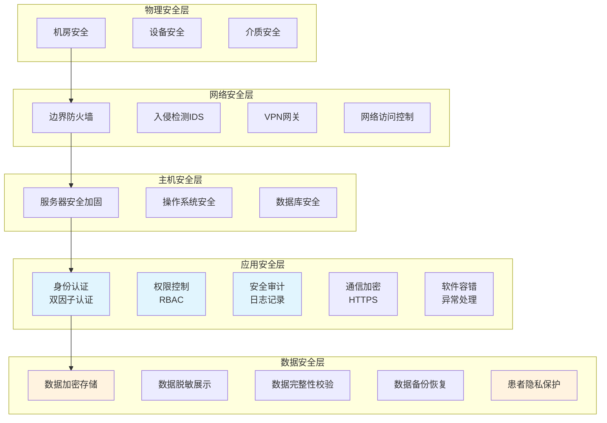

### 2.2 安全组件交互图

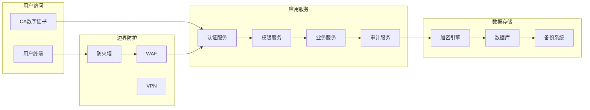

---

## 3. 身份认证安全设计

### 3.1 双因子认证设计

#### 认证方式组合

| 认证方式 | 认证因子 | 适用场景 | 安全级别 |
|----------|----------|----------|----------|
| 用户名+密码 | 知识因子 | 基础认证 | 低 |
| 用户名+密码+CA证书 | 知识+拥有因子 | 关键系统登录 | 高 |
| 用户名+密码+短信验证码 | 知识+拥有因子 | 移动端登录 | 中 |
| 用户名+密码+动态口令 | 知识+拥有因子 | 高敏感操作 | 高 |

#### 双因子认证流程图

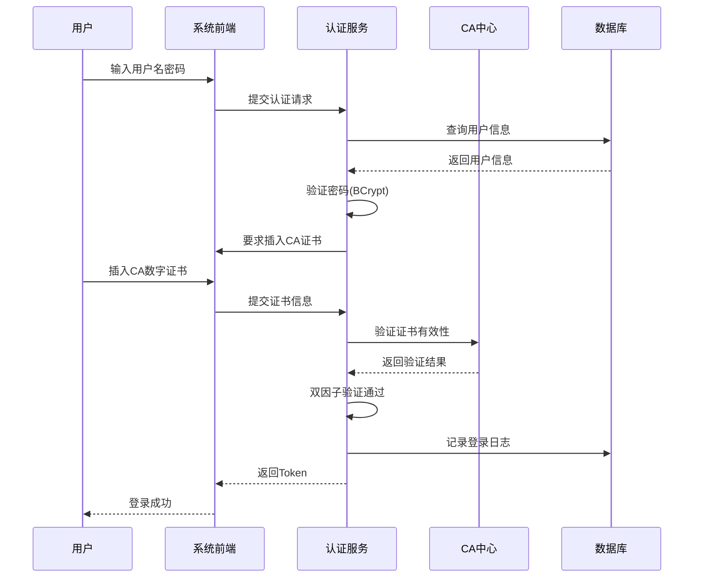

### 3.2 密码安全策略

#### 密码复杂度要求（符合BR-SYS-002）

| 要求项 | 具体标准 | 实现方式 |
|--------|----------|----------|
| 最小长度 | ≥8位 | 前端校验+后端校验 |
| 字符组成 | 含大写字母、小写字母、数字、特殊字符至少3类 | 正则表达式校验 |
| 禁止内容 | 禁止使用用户名、生日、连续字符(123456) | 黑名单校验 |
| 历史密码 | 不能与最近5次密码相同 | 密码历史记录表 |

#### 密码加密存储

```
加密算法: BCrypt + AES256
存储格式: ${algorithm}${iterations}${salt}${hash}
示例: $bcrypt$12$randomsalt$hashedpassword
```

| 字段 | 加密方式 | 说明 |
|------|----------|------|
| sys_user.password | BCrypt(password) | 单向加密，不可逆 |
| his_patient.id_card | AES256(id_card) | 可逆加密，需解密时使用密钥 |
| his_patient.insurance_no | AES256(insurance_no) | 可逆加密 |

#### 密码生命周期管理

| 阶段 | 安全措施 | 强制要求 |
|------|----------|----------|
| 创建 | 复杂度校验 | 必须符合复杂度要求 |
| 存储 | BCrypt加密 | 加密存储，禁止明文 |
| 使用 | 登录验证 | 防暴力破解(失败锁定) |
| 更新 | 定期更换 | 建议90天更换 |
| 作废 | 密码历史 | 记录历史，禁止重复 |

### 3.3 登录失败处理（符合BR-SYS-003）

#### 登录失败锁定策略

| 触发条件 | 锁定时长 | 解锁方式 | 提示信息 |
|----------|----------|----------|----------|
| 连续失败5次 | 30分钟 | 自动解锁或管理员解锁 | "账户已锁定，请30分钟后重试" |
| 24小时内失败10次 | 24小时 | 管理员解锁 | "账户异常，请联系管理员" |
| 密码错误提示 | - | - | 不提示"用户名或密码错误"，只提示"认证失败" |

#### 暴力破解防护机制

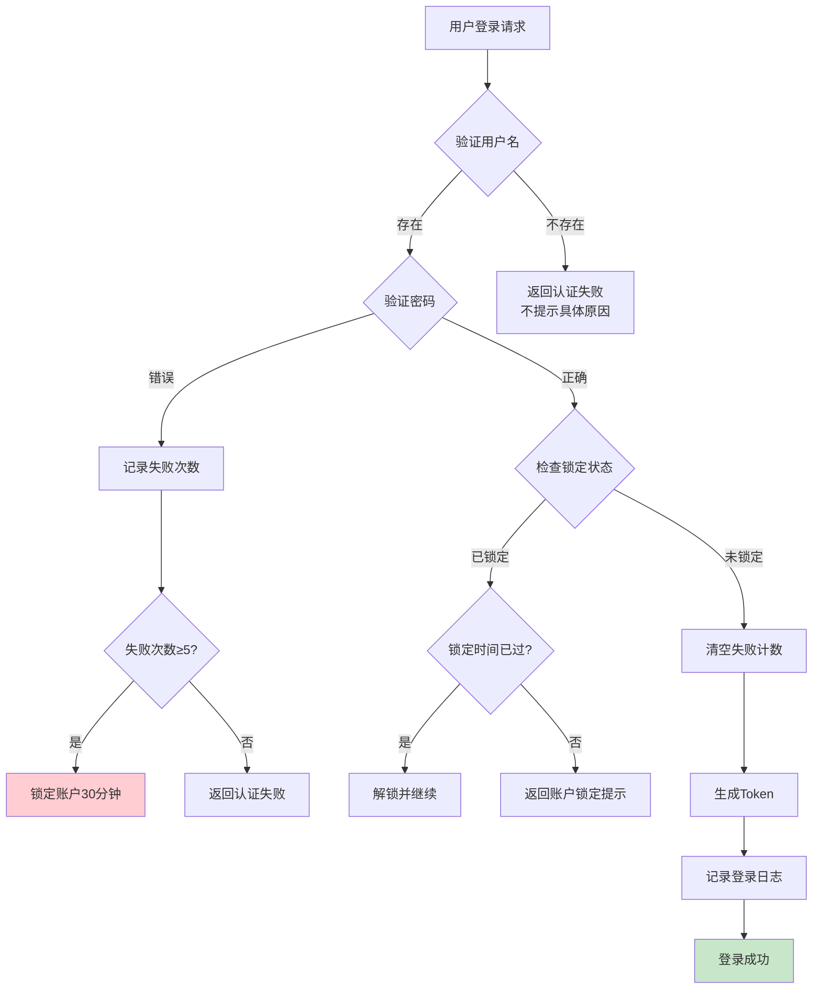

### 3.4 会话安全管理

#### 会话超时配置

| 会话类型 | 超时时间 | 超时处理 | 安全级别 |
|----------|----------|----------|----------|
| 普通用户会话 | 30分钟 | 自动注销，跳转登录页 | 默认 |
| 管理员会话 | 15分钟 | 自动注销，跳转登录页 | 高 |
| 高敏感操作 | 5分钟 | 需重新认证 | 最高 |
| 移动端会话 | 60分钟 | Token过期刷新 | 中 |

#### 会话安全机制

| 机制 | 实现方式 | 安全作用 |
|------|----------|----------|
| Token机制 | JWT + Redis存储 | 防止会话劫持 |
| Token刷新 | 刷新Token有效期 | 减少重复登录 |
| 单点登录限制 | 检测同一账户多终端 | 可配置允许多终端或单终端 |
| 会话注销 | 清除Token和Redis缓存 | 安全登出 |
| 防CSRF | CSRF Token验证 | 防跨站请求伪造 |

---

## 4. 权限控制安全设计

### 4.1 RBAC权限模型设计

#### 权限模型架构图

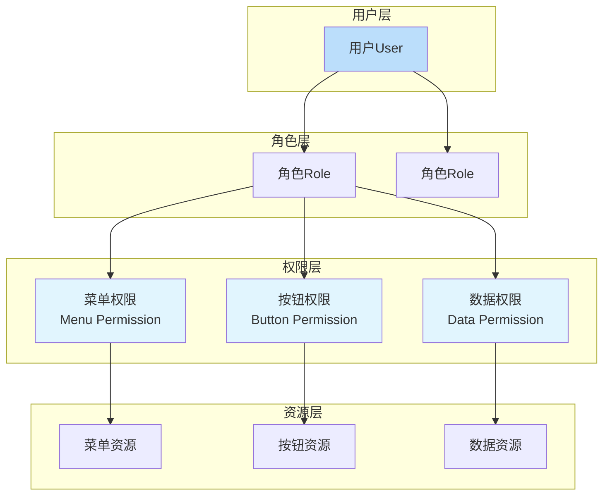

#### 三级权限控制说明（符合BR-SYS-004）

| 权限层级 | 权限类型 | 控制对象 | 实现方式 |
|----------|----------|----------|----------|
| 第一级 | 菜单权限 | 页面/菜单 | 未授权菜单不显示 |
| 第二级 | 按钮权限 | 操作按钮 | 未授权按钮隐藏/禁用 |
| 第三级 | 数据权限 | 业务数据 | 数据范围SQL过滤 |

#### 数据权限范围定义

| 权限范围 | 权限标识 | SQL条件 | 适用场景 |
|----------|----------|----------|----------|
| 全部数据 | SCOPE_ALL | 无限制 | 系统管理员、医院管理者 |
| 本部门数据 | SCOPE_DEPT | dept_id = #{userDeptId} | 科室主任 |
| 本部门及下级 | SCOPE_DEPT_CHILD | dept_id IN (#{userDeptId}及下级) | 科室负责人 |
| 仅本人数据 | SCOPE_SELF | create_by = #{userName} | 普通医生/护士 |
| 自定义数据 | SCOPE_CUSTOM | dept_id IN (#{customDeptList}) | 特殊角色 |

### 4.2 角色权限矩阵

#### 核心角色权限分配

| 角色 | 菜单权限 | 按钮权限 | 数据权限 | 安全级别 |
|------|----------|----------|----------|----------|
| 系统管理员(SYS_ADMIN) | 全部菜单 | 全部按钮 | 全部数据 | 最高 |
| 医院管理者(HOSPITAL_MGR) | 运营报表、统计分析 | 查看、导出 | 全院数据(脱敏) | 高 |
| 科室主任 | 本科室业务菜单 | 本科室管理操作 | 本部门及下级 | 中 |
| 门诊医生(OP_DOCTOR) | 门诊工作站 | 接诊、开方、病历 | 仅本人患者 | 中 |
| 住院医生(IP_DOCTOR) | 住院工作站 | 医嘱、病历、诊断 | 仅本人患者 | 中 |
| 护士(NURSE) | 护理工作站 | 医嘱执行、护理记录 | 本病区患者 | 中 |
| 药剂师(PHARMACIST) | 药房管理 | 审核、调配、发药 | 本药房数据 | 中 |
| 收费员(CASHIER) | 收费管理 | 收费、退费(需审批) | 仅本人收费记录 | 低 |
| 检验技师(LAB_TECH) | LIS系统 | 检验操作、审核 | 本科室标本 | 中 |

### 4.3 权限最小化原则实施

#### 权限分配规则

| 规则编号 | 规则描述 | 实施方式 |
|----------|----------|----------|
| SEC-RULE-001 | 默认无权限原则 | 新用户无任何权限，需管理员分配 |
| SEC-RULE-002 | 职责分离原则 | 敏感操作需双人复核(如退费审批) |
| SEC-RULE-003 | 权限互斥原则 | 关键权限不能同时授予(如收费+退费审批) |
| SEC-RULE-004 | 权限有效期 | 临时权限设置有效期，到期自动收回 |
| SEC-RULE-005 | 权限变更审批 | 权限变更需审批流程 |

#### 敏感操作权限控制

| 敏感操作 | 权限要求 | 复核要求 | 审计要求 |
|----------|----------|----------|----------|
| 用户管理 | 系统管理员 | - | 强制审计 |
| 权限分配 | 系统管理员 | - | 强制审计 |
| 密码重置 | 系统管理员 | - | 强制审计 |
| 退费审批 | 财务主管 | 主任复核 | 强制审计 |
| 病历封存 | 医务科+质控科 | 双方确认 | 强制审计 |
| 数据导出 | 系统管理员 | 科室负责人审批 | 强制审计 |

### 4.4 权限变更审计

#### 权限变更审计记录

| 字段 | 内容 | 说明 |
|------|------|------|
| 变更ID | audit_permission_change_id | 唯一标识 |
| 变更类型 | GRANT/REVOKE/MODIFY | 授权/收回/修改 |
| 变更对象 | 用户ID/角色ID | 变更对象标识 |
| 变换前权限 | 权限列表(JSON) | 变更前权限快照 |
| 变换后权限 | 权限列表(JSON) | 变更后权限快照 |
| 变更人 | 操作人ID+姓名 | 执行变更的人员 |
| 变更时间 | timestamp | 变更发生时间 |
| 变更原因 | 变更说明 | 变更理由记录 |
| 审批人 | 审批人ID+姓名 | 变更审批人(如需要) |

---

## 5. 数据安全设计

### 5.1 敏感数据分类分级

#### 患者数据分级表

| 数据级别 | 数据类型 | 数据示例 | 安全措施 |
|----------|----------|----------|----------|
| 一级(最高敏感) | 身份信息 | 身份证号、医保号 | 加密存储、脱敏展示、访问审批 |
| 一级(最高敏感) | 财务信息 | 银行卡号、缴费记录 | 加密存储、访问日志 |
| 二级(高敏感) | 健康信息 | 诊断、检验结果、病历 | 加密存储、数据权限控制 |
| 二级(高敏感) | 联系方式 | 手机号、地址 | 部分脱敏展示 |
| 三级(中敏感) | 就诊信息 | 挂号记录、费用明细 | 数据权限控制 |
| 四级(低敏感) | 公开信息 | 科室信息、医生信息 | 无特殊限制 |

#### 数据安全措施矩阵

| 安全措施 | 一级数据 | 二级数据 | 三级数据 | 四级数据 |
|----------|----------|----------|----------|----------|
| 加密存储 | 必须 | 必须 | 可选 | 不需要 |
| 传输加密 | 必须 | 必须 | 必须 | 推荐 |
| 脱敏展示 | 必须 | 部分 | 不需要 | 不需要 |
| 访问审批 | 必须 | 推荐 | 不需要 | 不需要 |
| 操作审计 | 必须 | 必须 | 必须 | 推荐 |
| 导出控制 | 必须 | 必须 | 推荐 | 不需要 |

### 5.2 数据加密存储设计

#### 加密算法选择

| 数据类型 | 加密算法 | 密钥管理 | 解密场景 |
|----------|----------|----------|----------|
| 密码 | BCrypt(不可逆) | 无需密钥 | 验证时比对 |
| 身份证号 | AES-256(可逆) | 密钥管理系统 | 医保对接、法律取证 |
| 医保号 | AES-256(可逆) | 密钥管理系统 | 医保结算 |
| 银行卡号 | AES-256(可逆) | 密钥管理系统 | 退款 |
| 手机号 | AES-256(可选) | 密钥管理系统 | 短信通知 |

#### 密钥管理系统设计

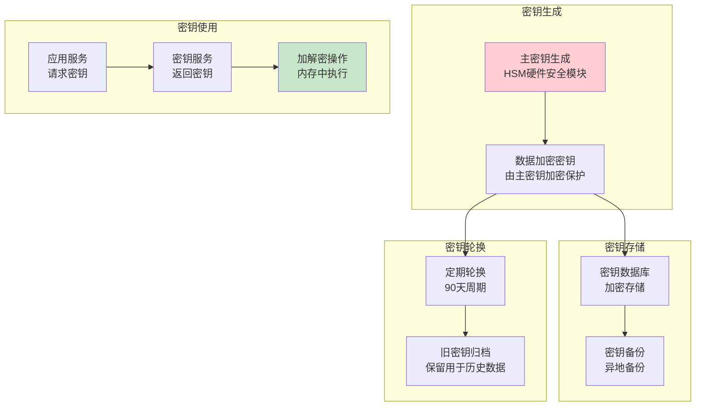

#### 加密字段实现

```sql
-- 加密字段存储示例
CREATE TABLE his_patient (
    patient_id BIGINT PRIMARY KEY,
    patient_no VARCHAR(30),
    patient_name VARCHAR(50),
    id_card VARCHAR(100),  -- 存储AES加密后的Base64字符串
    insurance_no VARCHAR(100),  -- 存储AES加密后的Base64字符串
    phone VARCHAR(100),  -- 可选加密
    ...
);

-- 加密实现伪代码
public class DataEncryption {
    // 加密
    public String encrypt(String plainText, String keyAlias) {
        Key key = keyManager.getKey(keyAlias);
        return AES256.encrypt(plainText, key);
    }
    // 解密
    public String decrypt(String cipherText, String keyAlias) {
        Key key = keyManager.getKey(keyAlias);
        return AES256.decrypt(cipherText, key);
    }
}
```

### 5.3 数据脱敏展示设计

#### 脱敏规则表

| 数据类型 | 脱敏规则 | 脱敏示例 | 展示场景 |
|----------|----------|----------|----------|
| 身份证号 | 前3位+后4位显示，中间隐藏 | 320**********1234 | 列表查询、报表 |
| 手机号 | 前3位+后4位显示，中间隐藏 | 138****5678 | 列表查询 |
| 姓名 | 姓显示，名隐藏(1-2位) | 张*、张** | 报表统计(可配置) |
| 医保号 | 部分隐藏 | 1234****5678 | 列表查询 |
| 银行卡号 | 前4位+后4位显示 | 6222****8888 | 退款展示 |

#### 脱敏实现方式

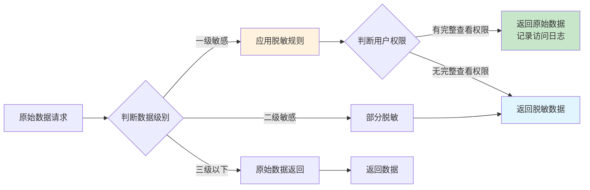

#### 权限控制完整数据查看

| 数据类型 | 完整查看权限 | 申请流程 |
|----------|----------|----------|
| 身份证号 | 系统管理员、财务主管、医保专员 | 审批+审计 |
| 手机号 | 相关科室、收费员 | 无需审批 |
| 病历全文 | 主管医生、会诊医生(授权患者) | 无需审批 |
| 诊断信息 | 主治医生、相关医技科室 | 无需审批 |

### 5.4 数据传输加密设计

#### HTTPS/TLS配置

| 配置项 | 要求标准 | 实现方式 |
|----------|----------|----------|
| TLS版本 | TLS 1.2+ | 禁用TLS 1.0/1.1 |
| 证书 | 合法CA签发 | 使用权威CA证书 |
| 加密套件 | 强加密算法 | AES-GCM、ECDHE |
| HSTS | 启用HSTS | 强制HTTPS访问 |
| 证书更新 | 定期更新 | 提前30天更新 |

#### 外部接口传输加密

| 接口类型 | 加密方式 | 说明 |
|----------|----------|----------|
| 医保接口 | HTTPS+国密算法 | 符合医保接口规范 |
| 银行支付 | HTTPS+签名验证 | 防篡改验证 |
| 区域平台 | HTTPS+HL7 FHIR | 标准传输 |
| 移动端API | HTTPS+Token | 安全线传输 |

### 5.5 数据完整性校验设计

#### 数据完整性机制

| 机制 | 实现方式 | 应用场景 |
|------|----------|----------|
| 数字签名 | CA签名验证 | 电子病历、处方、知情同意书 |
| 哈希校验 | SHA-256校验码 | 文件传输、数据同步 |
| 数据库约束 | 外键、唯一约束、CHECK约束 | 业务数据完整性 |
| 事务完整性 | 数据库事务ACID | 业务操作原子性 |

#### 电子签名设计（符合BR-EMR-002）

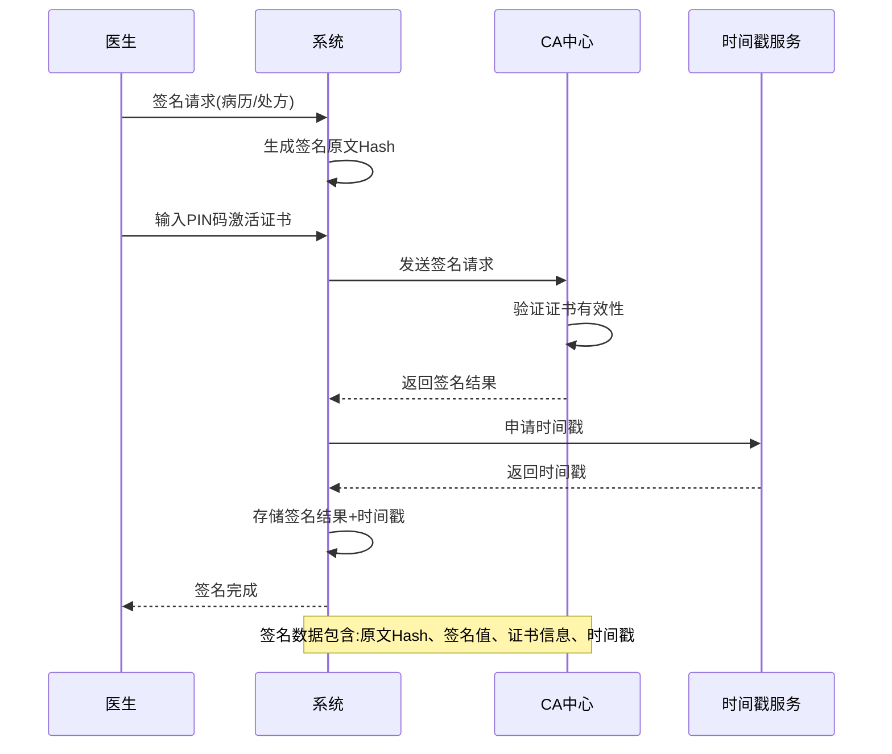

---

## 6. 审计日志安全设计

### 6.1 审计日志体系架构

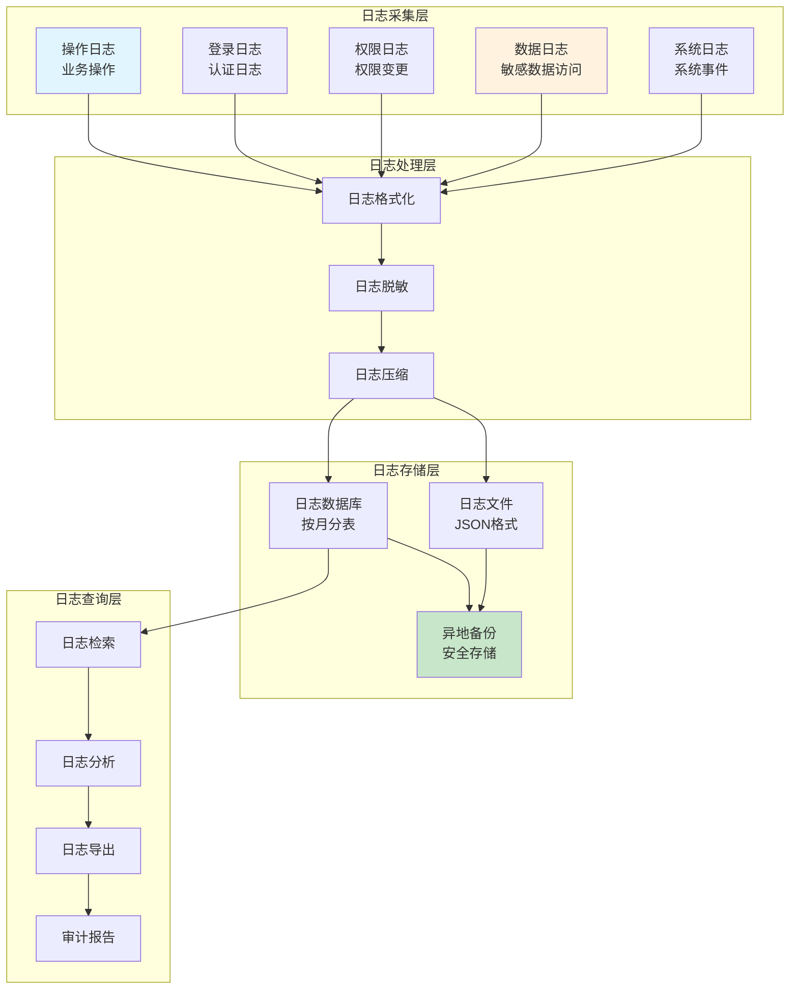

### 6.2 操作审计设计（符合BR-SYS-005）

#### 审计记录内容

| 字段 | 内容 | 说明 |
|------|------|------|
| log_id | 日志ID | 主键，自增 |
| user_id | 操作用户ID | 关联sys_user |
| username | 用户名 | 操作人标识 |
| operation_type | 操作类型 | 查询/新增/修改/删除/导出/打印 |
| module_code | 模块编码 | 操作模块标识 |
| module_name | 模块名称 | 模块描述 |
| operation_desc | 操作描述 | 具体操作说明 |
| request_url | 请求URL | API地址 |
| request_method | HTTP方法 | GET/POST/PUT/DELETE |
| request_params | 请求参数(脱敏) | 参数快照，敏感数据脱敏 |
| response_code | 响应状态码 | 200/400/500等 |
| response_msg | 响应消息 | 结果描述 |
| ip_address | 操作IP | 客户端IP |
| location | 操作地点 | IP归属地 |
| user_agent | 用户代理 | 浏览器信息 |
| browser | 浏览器 | 浏览器类型 |
| os | 操作系统 | 操作系统类型 |
| operation_time | 操作时间 | 精确到毫秒 |
| execution_time | 执行时长 | 响应时间(ms) |
| status | 操作状态 | 成功/失败 |
| error_msg | 错误信息 | 失败时的错误信息 |

#### 关键操作审计要求

| 操作类型 | 审计要求 | 操作前后值记录 |
|----------|----------|----------|
| 用户管理 | 强制审计 | 是 |
| 权限分配 | 强制审计 | 是(权限变更前后) |
| 密码修改 | 强制审计 | 否(不记录密码) |
| 敏感数据查看 | 强制审计 | 是(查看内容摘要) |
| 数据修改 | 强制审计 | 是(修改前后值) |
| 数据删除 | 强制审计 | 是(删除内容快照) |
| 数据导出 | 强制审计 | 是(导出范围) |
| 退费操作 | 强制审计 | 是(退费明细) |
| 病历封存 | 强制审计 | 是(封存内容) |

### 6.3 审计日志保护机制

#### 日志安全属性（符合BR-SYS-005）

| 安全属性 | 实现方式 | 说明 |
|----------|----------|----------|
| 不可删除 | 数据库权限控制 | 禁止DELETE操作 |
| 不可修改 | 数据库权限控制 | 禁止UPDATE操作 |
| 只增不减 | 只允许INSERT | 保证完整性 |
| 独立存储 | 专用数据库/表 | 与业务数据隔离 |
| 异地备份 | 定时异地备份 | 防单点故障 |
| 加密存储 | AES加密(可选) | 高敏感场景 |

#### 日志权限控制

| 角色 | 查看权限 | 导出权限 | 说明 |
|------|----------|----------|----------|
| 系统管理员 | 全部日志 | 全部日志 | 最高权限 |
| 审计专员 | 全部日志 | 审计相关日志 | 审计职能 |
| 科室主任 | 本科室日志 | 本科室日志 | 部门审计 |
| 普通用户 | 仅本人操作日志 | 无导出权限 | 个人查看 |

### 6.4 审计分析报告

#### 定期审计报告

| 报告类型 | 报告周期 | 报告内容 | 报告对象 |
|----------|----------|----------|----------|
| 安全态势周报 | 每周 | 登录统计、异常操作、风险预警 | 安全管理员 |
| 操作审计月报 | 每月 | 操作统计、高频操作、异常分析 | 安全管理员 |
| 权限审计季报 | 每季度 | 权限变更统计、冗余权限清理建议 | 系统管理员 |
| 数据访问年报 | 每年 | 敏感数据访问统计、访问合理性分析 | 安全委员会 |

#### 异常审计告警

| 异常类型 | 告警条件 | 告警级别 | 处理方式 |
|----------|----------|----------|----------|
| 登录异常 | 同一账户多地登录 | 中 | 记录+通知 |
| 暴力破解 | 连续失败≥5次 | 高 | 锁定+通知 |
| 异常访问 | 非工作时间大量访问 | 中 | 记录+分析 |
| 权限滥用 | 越权操作尝试 | 高 | 记录+通知+阻断 |
| 数据泄露 | 大量敏感数据导出 | 高 | 阻断+审批 |
| 异常删除 | 大批量数据删除 | 高 | 阻断+审批 |

---

## 7. 网络安全设计

### 7.1 网络架构安全设计

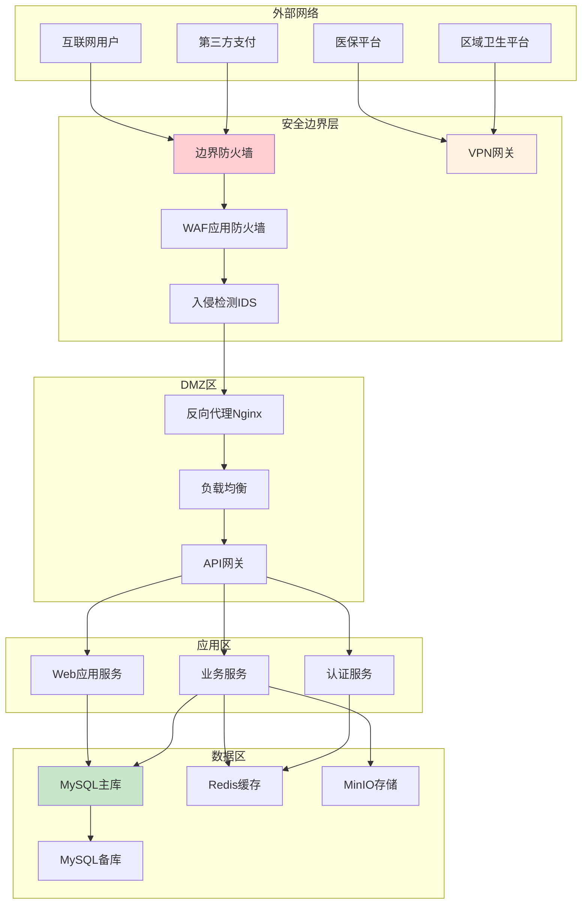

### 7.2 网络边界防护

#### 防火墙策略设计

| 区域 | 入站规则 | 出站规则 | 说明 |
|------|----------|----------|----------|
| 外部→DMZ | 仅HTTPS(443)、VPN端口 | 仅访问DMZ内部 | 严格入站控制 |
| DMZ→应用 | 仅应用服务端口 | 仅访问数据区 | 限制横向访问 |
| 应用→数据 | 仅数据库端口 | 无外部访问 | 数据库访问控制 |
| VPN→内部 | VPN认证后可访问应用区 | 全部受限 | VPN访问控制 |

#### 防火墙端口控制

| 服务 | 端口 | 开放范围 | 安全措施 |
|------|------|----------|----------|
| HTTPS | 443 | 全网开放 | WAF保护 |
| VPN | 443/自定义 | 内部用户 | VPN认证 |
| SSH | 22 | 管理网段 | 密钥认证 |
| MySQL | 3306 | 应用服务器 | IP白名单 |
| Redis | 6379 | 应用服务器 | IP白名单+密码 |

### 7.3 VPN访问设计

#### VPN安全配置

| 配置项 | 安全要求 | 说明 |
|----------|----------|----------|
| VPN协议 | IPsec或SSL VPN | 强加密协议 |
| 用户认证 | 双因子认证 | 用户名+证书/动态口令 |
| 会话加密 | AES-256加密 | VPN隧道加密 |
| 访问控制 | ACL策略 | VPN后仍需权限控制 |
| 连接超时 | 8小时自动断开 | 防长期连接 |
| 日志记录 | 完整VPN日志 | 连接记录 |

#### VPN用户权限

| VPN用户类型 | VPN权限范围 | 应用权限 |
|----------|----------|----------|
| 内部员工 | 应用区、管理区(受限) | 按角色分配 |
| 外部运维 | 仅管理区(审批后) | 仅运维权限 |
| 外部审计 | 仅审计系统 | 仅查看权限 |

### 7.4 入侵检测与防御

#### IDS/IPS配置

| 检测类型 | 检测内容 | 响应方式 | 告警级别 |
|----------|----------|----------|----------|
| 网络入侵 | 端口扫描、DDoS攻击 | 阻断+告警 | 高 |
| 应用攻击 | SQL注入、XSS攻击 | WAF阻断 | 高 |
| 异常流量 | 异常流量模式 | 告警+分析 | 中 |
| 恶意软件 | 恶意软件特征 | 阻断+告警 | 高 |
| 暴力破解 | 登录暴力破解 | 阻断+锁定 | 高 |

#### WAF防护策略

| 防护类型 | 防护规则 | 检测方式 |
|----------|----------|----------|
| SQL注入 | SQL关键字过滤、参数校验 | 规则+语义分析 |
| XSS攻击 | 脚本过滤、编码校验 | 规则检测 |
| CSRF攻击 | Token验证、来源验证 | 应用层检测 |
| 文件上传 | 文件类型限制、大小限制 | 白名单+病毒扫描 |
| 目录遍历 | 路径过滤 | 规则检测 |

---

## 8. 数据备份安全设计

### 8.1 备份策略设计

#### RPO/RTO目标（符合PRD要求）

| 目标指标 | 目标值 | 实现方式 |
|----------|----------|----------|
| RPO(数据丢失量) | ≤1小时 | 每小时增量备份 |
| RTO(恢复时间) | ≤4小时 | 灾备切换、增量恢复 |
| 数据完整性 | 100% | 备份校验、恢复测试 |
| 备份成功率 | ≥99% | 备份监控告警 |

#### 备份类型与频率

| 备份类型 | 备份频率 | 备份内容 | 存储位置 |
|----------|----------|----------|----------|
| 全量备份 | 每日(凌晨) | 全部数据库 | 本地+异地 |
| 增量备份 | 每小时 | 变更数据 | 本地+异地 |
| 日志备份 | 每15分钟 | 事务日志 | 本地+异地 |
| 配置备份 | 每周 | 系统配置 | 本地+异地 |
| 文件备份 | 每日 | 影像文件 | 异地存储 |

### 8.2 备份架构设计

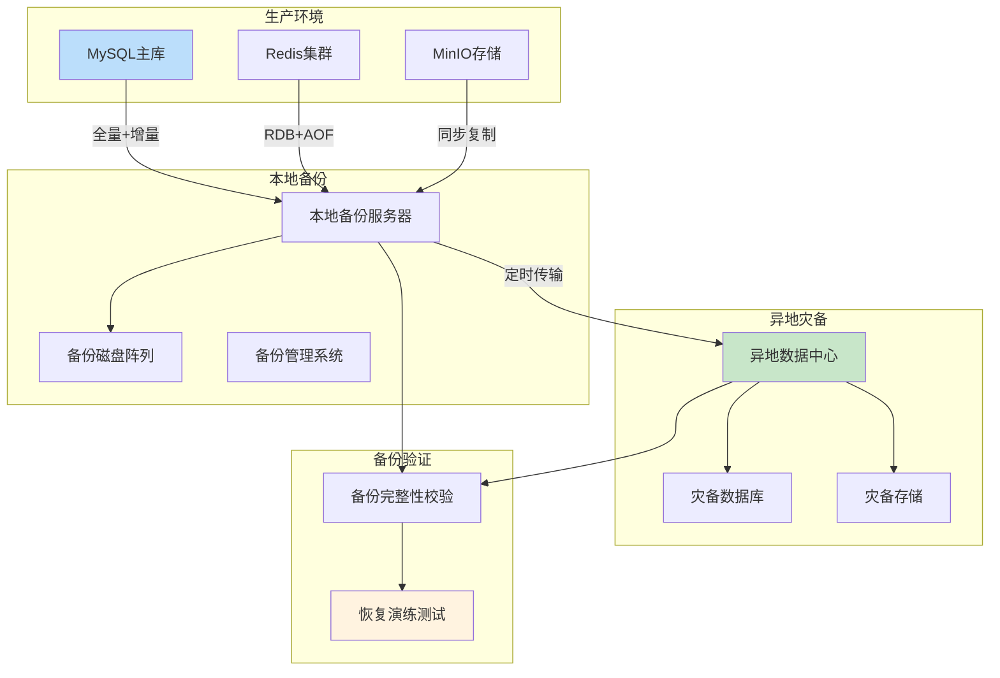

### 8.3 异地备份策略

#### 异地备份要求

| 要求项 | 具体标准 | 实现方式 |
|----------|----------|----------|
| 异地距离 | ≥100公里或同城不同数据中心 | 异地机房 |
| 传输加密 | HTTPS/专线加密传输 | 安全传输 |
| 数据加密 | 备份数据加密存储 | AES加密 |
| 网络隔离 | 专线或VPN传输 | 安全网络 |
| 完整校验 | 定期备份完整性校验 | 哈希校验 |

#### 备份数据保留

| 数据类型 | 保留期限 | 保留策略 |
|----------|----------|----------|
| 全量备份 | 30天 | 每日保留，超过30天删除 |
| 增量备份 | 7天 | 每小时保留，超过7天删除 |
| 日志备份 | 3天 | 15分钟保留，超过3天删除 |
| 重要备份 | 1年+ | 归档保留(年度、季度备份) |
| 审计日志备份 | 3年+ | 符合等保要求长期保留 |

### 8.4 备份恢复测试

#### 恢复测试计划

| 测试类型 | 测试频率 | 测试内容 | 测试报告 |
|----------|----------|----------|----------|
| 完整恢复测试 | 每季度 | 全量+增量恢复演练 | 恢复报告 |
| 部分恢复测试 | 每月 | 单表/单库恢复测试 | 恢复报告 |
| 灾备切换测试 | 每半年 | 灾备中心切换演练 | 切换报告 |
| RTO验证测试 | 每季度 | 恢复时间验证 | 性能报告 |

---

## 9. 患者隐私保护设计

### 9.1 个人信息保护法合规

#### 个人信息处理原则

| 原则 | 实施措施 |
|------|----------|
| 合法原则 | 医疗服务必需，患者知情同意 |
| 正当原则 | 最小必要，不超范围收集 |
| 必要原则 | 仅收集诊疗必需信息 |
| 诚信原则 | 不欺骗误导患者 |
| 安全原则 | 加密存储、访问控制、审计追溯 |

#### 患者知情同意设计

| 同意类型 | 适用场景 | 实现方式 |
|----------|----------|----------|
| 服务必要同意 | 挂号建档、就诊治疗 | 服务协议中明确告知 |
| 医保信息同意 | 医保结算对接 | 医保授权书签署 |
| 研究用途同意 | 科研数据使用(可选) | 独立授权书签署 |
| 第三方共享同意 | 区域平台共享(可选) | 独立授权书签署 |

### 9.2 患者数据访问授权

#### 数据访问授权矩阵

| 数据类型 | 访问角色 | 授权条件 | 授权有效期 |
|----------|----------|----------|----------|
| 基本信息 | 门诊医生 | 当前就诊患者 | 就诊期间 |
| 基本信息 | 住院医生 | 当前主管患者 | 住院期间 |
| 诊断信息 | 会诊医生 | 会诊授权患者 | 会诊期间 |
| 病历全文 | 主管医生 | 主管患者 | 诊疗期间 |
| 病历全文 | 质控医生 | 质控范围患者 | 质控期间 |
| 统计数据 | 管理者 | 脱敏统计数据 | 按权限 |

#### 数据访问审批流程

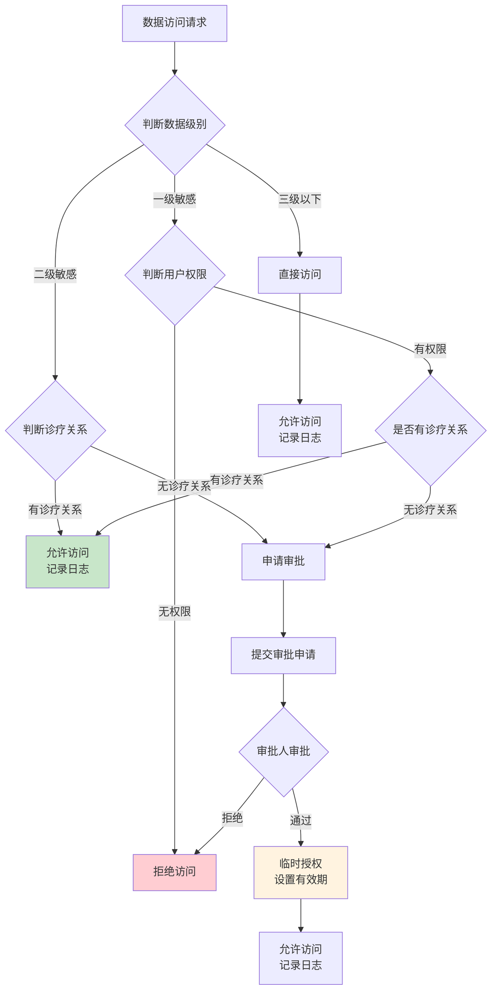

### 9.3 数据导出控制

#### 数据导出规则

| 导出类型 | 导出权限 | 审批要求 | 安全措施 |
|----------|----------|----------|----------|
| 单患者数据 | 主管医生 | 无需审批 | 加密导出 |
| 科室数据统计 | 科室主任 | 无需审批 | 脱敏导出 |
| 全院数据导出 | 系统管理员 | 科室负责人+安全审批 | 加密+审计 |
| 研究数据导出 | 研究申请 | 医务科+伦理委员会审批 | 脱敏+加密 |
| 政府监管数据 | 系统管理员 | 医院领导审批 | 按要求处理 |

#### 导出安全机制

| 机制 | 实现方式 |
|------|----------|
| 导出审批 | 导出申请→审批→执行 |
| 导出范围 | 限定导出数据范围和时间范围 |
| 数据脱敏 | 敏感字段脱敏导出 |
| 格式加密 | 导出文件加密(EXCEL/PDF加密) |
| 导出日志 | 记录导出人、范围、时间、用途 |
| 水印标记 | 导出文件添加水印标记 |

---

## 10. 安全管理制度设计

### 10.1 安全管理制度框架

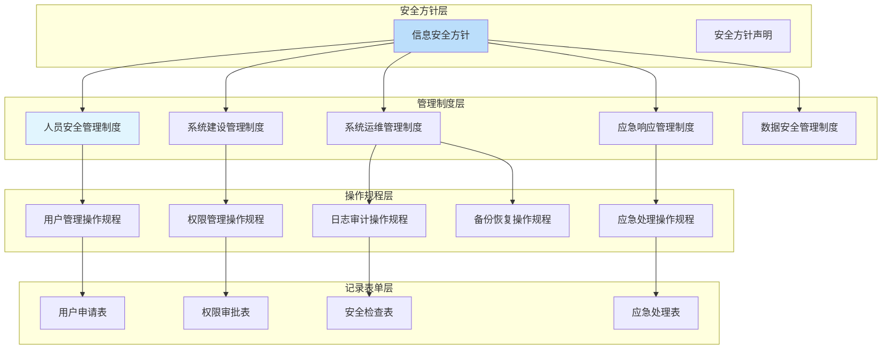

### 10.2 安全管理机构设计

#### 安全岗位设置

| 岗位名称 | 职责范围 | 人员要求 | 授权范围 |
|----------|----------|----------|----------|
| 安全主管 | 安全管理全面负责 | 副院长级 | 安全决策权 |
| 安全管理员 | 安全技术管理 | 信息科主管 | 安全实施权 |
| 系统管理员 | 系统运维管理 | IT技术主管 | 系统管理权 |
| 审计专员 | 安全审计监督 | 审计部门人员 | 审计查看权 |
| 数据管理员 | 数据管理负责 | 信息科人员 | 数据管理权 |

#### 安全职责矩阵

| 职责 | 安全主管 | 安全管理员 | 系统管理员 | 审计专员 |
|------|----------|----------|----------|----------|
| 安全方针制定 | 负责 | 参与 | - | - |
| 安全制度制定 | 负责 | 参与 | 参与 | 参与 |
| 安全策略实施 | 审批 | 负责 | 执行 | 监督 |
| 安全事件响应 | 决策 | 执行 | 执行 | 监督 |
| 安全审计 | 审阅 | 支持 | 配合 | 负责 |
| 权限管理审批 | 审批 | 审批 | 建议 | 监督 |

### 10.3 人员安全管理

#### 人员安全措施

| 阶段 | 安全措施 | 实施方式 |
|------|----------|----------|
| 录用 | 背景调查、安全协议签署 | 人事部门执行 |
| 在岗 | 安全培训、安全考核 | 定期培训和考核 |
| 调岗 | 权限变更、交接审计 | 权限管理流程 |
| 离岗 | 权限收回、资产回收 | 离岗安全流程 |
| 临时人员 | 临时权限、监控审计 | 严格限制 |

#### 安全培训计划

| 培训类型 | 培训频率 | 培训内容 | 培训对象 |
|----------|----------|----------|----------|
| 安全意识培训 | 每年 | 信息安全基础、法规要求 | 全员 |
| 安全技能培训 | 每季度 | 安全工具使用、安全操作 | IT人员 |
| 等保知识培训 | 每年 | 等保三级要求、合规要点 | 管理人员 |
| 应急演练培训 | 每半年 | 安全事件响应、应急流程 | 相关人员 |

---

## 11. 等保三级合规对照表

### 11.1 技术要求合规对照

#### 物理安全要求

| 要求编号 | 要求描述 | 合规措施 | 合规状态 |
|----------|----------|----------|----------|
| 物理访问控制 | 机房出入控制 | 门禁系统、视频监控 | 符合 |
| 防盗窃防破坏 | 设备防盗保护 | 机房安防、设备锁定 | 符合 |
| 防雷防静电 | 机房防雷防静电 | 机房建设规范 | 符合 |
| 防火灾防水灾 | 机房防火防水 | 机房消防、防水措施 | 符合 |
| 温湿度控制 | 机房温湿度控制 | 机房空调系统 | 符合 |
| 电磁防护 | 电磁防护措施 | 机房电磁屏蔽 | 符合 |

#### 网络安全要求

| 要求编号 | 要求描述 | 合规措施 | 合规状态 |
|----------|----------|----------|----------|
| 结构安全 | 网络结构安全 | 分区隔离、冗余设计 | 符合 |
| 边界完整性 | 网络边界防护 | 防火墙、VPN网关 | 符合 |
| 访问控制 | 网络访问控制 | ACL策略、IP白名单 | 符合 |
| 入侵检测 | 入侵检测措施 | IDS/IPS部署 | 符合 |
| 安全审计 | 网络安全审计 | 网络流量日志 | 符合 |

#### 主机安全要求

| 要求编号 | 要求描述 | 合规措施 | 合规状态 |
|----------|----------|----------|----------|
| 身份鉴别 | 服务器身份鉴别 | 双因子认证、强密码 | 符合 |
| 访问控制 | 主机访问控制 | 操作系统权限控制 | 符合 |
| 安全审计 | 主机安全审计 | 系统日志审计 | 符合 |
| 入侵防范 | 主机入侵防范 | 安全加固、补丁管理 | 符合 |
| 恶意代码防范 | 防病毒措施 | 杀毒软件、病毒过滤 | 符合 |

#### 应用安全要求

| 要求编号 | 要求描述 | 合规措施 | 合规状态 |
|----------|----------|----------|----------|
| 身份鉴别 | 应用身份鉴别 | 双因子认证(密码+CA) | 符合 |
| 访问控制 | 应用访问控制 | RBAC三级权限控制 | 符合 |
| 安全审计 | 应用安全审计 | 操作日志审计(≥3年) | 符合 |
| 通信完整性 | 数据完整性保护 | 数字签名、哈希校验 | 符合 |
| 通信保密性 | 数据传输加密 | HTTPS/TLS 1.2+ | 符合 |
| 软件容错 | 软件容错机制 | 异常处理、输入校验 | 符合 |

#### 数据安全要求

| 要求编号 | 要求描述 | 合规措施 | 合规状态 |
|----------|----------|----------|----------|
| 数据完整性 | 数据完整性校验 | 数据校验、签名验证 | 符合 |
| 数据保密性 | 数据加密存储 | AES-256加密存储 | 符合 |
| 数据备份 | 数据备份恢复 | RPO≤1h、RTO≤4h、异地备份 | 符合 |

### 11.2 管理要求合规对照

#### 安全管理制度要求

| 要求编号 | 要求描述 | 合规措施 | 合规状态 |
|----------|----------|----------|----------|
| 管理制度 | 制定安全管理制度 | 安全方针+管理制度+操作规程 | 符合 |
| 制定发布 | 制度制定发布流程 | 审批发布、定期修订 | 符合 |
| 评审修订 | 制度评审修订 | 定期评审、按需修订 | 符合 |

#### 安全管理机构要求

| 要求编号 | 要求描述 | 合规措施 | 合规状态 |
|----------|----------|----------|----------|
| 岗位设置 | 安全岗位设置 | 安全主管、管理员、审计员 | 符合 |
| 人员配备 | 安全人员配备 | 专职安全管理人员 | 符合 |
| 授权审批 | 安全授权审批 | 权限审批流程 | 符合 |
| 沟通合作 | 安全沟通机制 | 安全会议、协调机制 | 符合 |

#### 人员安全管理要求

| 要求编号 | 要求描述 | 合规措施 | 合规状态 |
|----------|----------|----------|----------|
| 人员录用 | 录用安全审查 | 背景调查、安全协议 | 符合 |
| 人员考核 | 安全考核 | 定期安全考核 | 符合 |
| 安全培训 | 安全教育培训 | 年度安全培训 | 符合 |
| 离岗管理 | 离岗安全处理 | 权限收回、交接审计 | 符合 |

#### 系统建设管理要求

| 要求编号 | 要求描述 | 合规措施 | 合规状态 |
|----------|----------|----------|----------|
| 系统定级 | 系统等级定级 | 等保三级定级备案 | 符合 |
| 安全设计 | 安全方案设计 | 本文档安全架构设计 | 符合 |
| 安全采购 | 安全产品采购 | 合规安全产品采购 | 符合 |
| 工程实施 | 安全工程实施 | 安全实施规范 | 符合 |
| 测试验收 | 安全测试验收 | 安全测试、验收确认 | 符合 |

#### 系统运维管理要求

| 要求编号 | 要求描述 | 合规措施 | 合规状态 |
|----------|----------|----------|----------|
| 环境管理 | 运维环境管理 | 机房运维管理 | 符合 |
| 资产管理 | 资产管理 | 资产台账管理 | 符合 |
| 介质管理 | 介质安全管理 | 介质管理规范 | 符合 |
| 监控管理 | 监控管理 | 系统监控告警 | 符合 |
| 备份恢复 | 备份恢复管理 | 备份恢复规范 | 符合 |
| 事件处置 | 安全事件处置 | 应急响应机制 | 符合 |

---

## 12. 安全检查清单

### 12.1 日常安全检查清单

#### 每日检查项

| 检查项 | 检查内容 | 检查方式 | 检查人 |
|----------|----------|----------|----------|
| 系统登录日志 | 检查异常登录 | 登录日志分析 | 安全管理员 |
| 操作日志 | 检查异常操作 | 操作日志分析 | 安全管理员 |
| 备份状态 | 检查备份是否成功 | 备份系统检查 | 系统管理员 |
| 系统可用性 | 检查系统运行状态 | 监控系统检查 | 系统管理员 |
| 安全告警 | 检查安全告警信息 | 安全告警系统 | 安全管理员 |

#### 每周检查项

| 检查项 | 检查内容 | 检查方式 | 检查人 |
|----------|----------|----------|----------|
| 权限变更审核 | 审核权限变更记录 | 权限审计日志 | 安全管理员 |
| 异常操作统计 | 统计分析异常操作 | 日志统计分析 | 安全管理员 |
| 备份恢复测试 | 部分恢复测试 | 恢复演练 | 系统管理员 |
| 系统补丁检查 | 检查补丁更新状态 | 补丁管理系统 | 系统管理员 |
| 病毒检查 | 检查病毒扫描日志 | 杀毒软件日志 | 系统管理员 |

#### 每月检查项

| 检查项 | 检查内容 | 检查方式 | 检查人 |
|----------|----------|----------|----------|
| 用户权限审计 | 审计用户权限合理性 | 权限矩阵检查 | 安全管理员 |
| 密码策略检查 | 检查密码策略执行 | 密码审计 | 安全管理员 |
| 安全配置审计 | 检查安全配置 | 配置核查 | 安全管理员 |
| 日志完整性检查 | 检查日志完整性 | 日志校验 | 审计专员 |
| 培训计划检查 | 检查培训执行情况 | 培训记录 | 安全主管 |

### 12.2 定期安全审计清单

#### 每季度审计项

| 审计项 | 审计内容 | 审计方式 | 审计人 |
|----------|----------|----------|----------|
| 备份恢复演练 | 全量恢复演练测试 | 恢复演练 | 系统管理员 |
| 权限矩阵审计 | 全面权限审计 | 权限矩阵分析 | 审计专员 |
| 安全制度执行 | 检查制度执行情况 | 制度检查 | 安全主管 |
| 安全培训审计 | 审计培训执行 | 培训记录检查 | 安全主管 |
| 灾备切换演练 | 灾备切换测试 | 切换演练 | 系统管理员 |

#### 每年审计项

| 审计项 | 审计内容 | 审计方式 | 审计人 |
|----------|----------|----------|----------|
| 等保测评 | 等保三级测评 | 专业测评机构 | 安全主管 |
| 安全风险评估 | 全面风险评估 | 风险评估报告 | 安全主管 |
| 安全制度修订 | 制度修订完善 | 制度评审 | 安全主管 |
| 安全培训计划 | 制定年度培训计划 | 训计划编制 | 安全主管 |
| 安全预算编制 | 编制安全预算 | 预算编制 | 安全主管 |

### 12.3 安全事件响应清单

#### 安全事件分级

| 事件级别 | 事件类型 | 响应时间 | 响应措施 |
|----------|----------|----------|----------|
| 一级(重大) | 系统宕机、数据泄露、重大入侵 | 立即响应 | 全员响应、领导决策 |
| 二级(较大) | 系统异常、安全告警、权限异常 | 30分钟内 | 安全团队响应 |
| 三级(一般) | 异常登录、操作异常、日志异常 | 2小时内 | 安全管理员处理 |

#### 安全事件响应流程

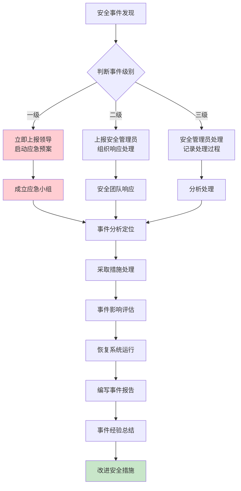

---

## 13. 安全架构实施计划

### 13.1 安全功能实施优先级

| 优先级 | 安全功能 | 实施阶段 | 说明 |
|----------|----------|----------|----------|
| P0 | 身份认证(密码策略、登录锁定) | MVP一期 | 核心安全基础 |
| P0 | 权限控制(RBAC三级) | MVP一期 | 核心安全基础 |
| P0 | 审计日志(操作审计) | MVP一期 | 合规必需 |
| P0 | 数据传输加密(HTTPS) | MVP一期 | 基础安全 |
| P1 | 双因子认证(CA证书) | 第二期 | 高安全场景 |
| P1 | 数据加密存储 | 第二期 | 患者隐私保护 |
| P1 | 数据脱敏展示 | 第二期 | 患者隐私保护 |
| P1 | 数据备份恢复 | 第二期 | 业务连续性 |
| P2 | 入侵检测(WAF) | 第三期 | 增强安全 |
| P2 | VPN安全访问 | 第三期 | 远程访问安全 |
| P2 | 灾备系统 | 第三期 | 业务连续性增强 |

### 13.2 安全技术选型

| 安全功能 | 技术选型 | 说明 |
|----------|----------|----------|
| 密码加密 | BCrypt + AES-256 | 密码单向加密 |
| 数据加密 | AES-256-GCM | 数据可逆加密 |
| 传输加密 | TLS 1.2+ (HTTPS) | 安全传输 |
| 数字签名 | CA证书 + SHA-256 | 电子签名 |
| 防火墙 | 硬件防火墙 + WAF | 边界防护 |
| IDS/IPS | 网络入侵检测系统 | 入侵检测 |
| VPN | SSL VPN/IPsec VPN | 安全远程访问 |
| 日志审计 | 数据库审计 + 应用审计 | 审计日志 |
| 备份系统 | 数据库备份 + 文件备份 | 数据备份 |

---

## 14. 附录

### 14.1 安全架构设计图汇总

#### 总体安全架构图

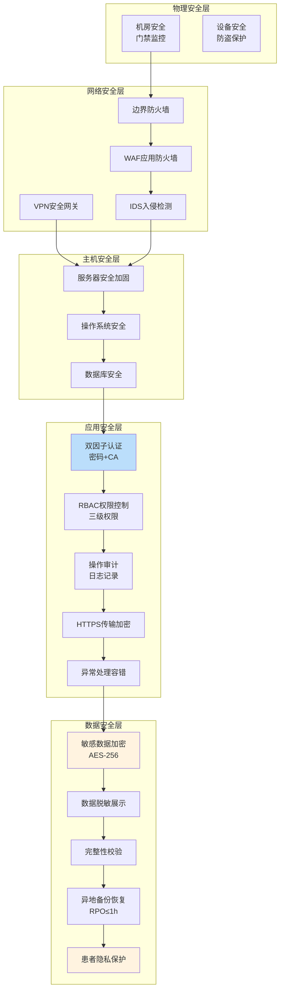

### 14.2 变更历史

| 版本 | 日期 | 变更内容 | 变更人 |
|------|------|----------|--------|
| V1.0 | 2026-06-16 | 初始版本，完成等保三级安全架构设计 | YUDAO-AI-HIS安全架构组 |

---

> **安全架构师**: ________________
> **技术负责人**: ________________
> **最后更新**: 2026-06-16