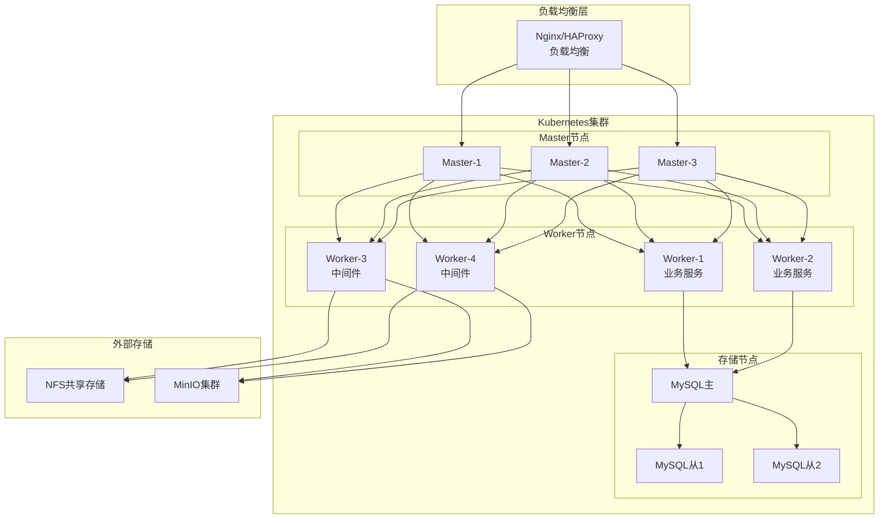
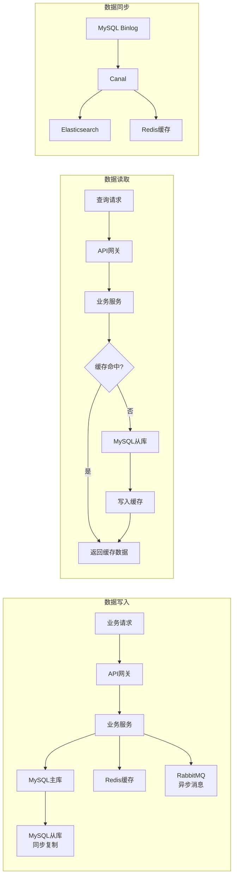

# YUDAO-AI-HIS 智慧医疗信息系统 - 技术选型报告

> **文档编号**: YUDAO-HIS-TSR-001
> **版本**: V1.0
> **创建日期**: 2026-06-16
> **状态**: 评审中
> **编制方法**: 基于PRD需求和模块划分，按照HIMSS EMRAM Stage 5+、等保三级、HL7 FHIR R4标准进行技术选型
> **参考标准**: HIMSS EMRAM Stage 5+ | GB/T 22239-2019(等保三级) | HL7 FHIR R4 | DICOM 3.0

---

## 1. 技术选型概述

### 1.1 选型原则

| 原则 | 说明 | 权重 |
|------|------|------|
| 标准合规 | 符合HIMSS EMRAM Stage 5+、等保三级、HL7 FHIR R4等标准 | 高 |
| 技术成熟 | 选择经过大规模生产验证的成熟技术栈 | 高 |
| 团队匹配 | 与团队现有技术栈(YUDAO/若依框架)匹配，降低学习成本 | 高 |
| 高可用性 | 支持集群部署、故障自动切换，系统可用率≥99.9% | 高 |
| 高性能 | 支持日均5000+门诊量，响应时间≤2秒 | 高 |
| 可扩展性 | 微服务架构，支持模块独立部署和水平扩展 | 中 |
| 安全合规 | 满足等保三级安全要求，支持审计追踪 | 高 |
| 生态完善 | 社区活跃，文档完善，第三方组件丰富 | 中 |

### 1.2 技术栈总览

```
┌─────────────────────────────────────────────────────────────────────────────┐
│                           YUDAO-AI-HIS 技术栈架构                            │
├─────────────────────────────────────────────────────────────────────────────┤
│  前端技术栈                                                                   │
│  Vue 3.4+ | TypeScript 5.x | Element Plus 2.x | Pinia 2.x | Vite 5.x        │
│  微信小程序 | uni-app(移动端)                                                 │
├─────────────────────────────────────────────────────────────────────────────┤
│  后端技术栈                                                                   │
│  Java 17 | Spring Boot 3.2 | Spring Cloud 2023.x | Spring Security 6.x      │
│  MyBatis-Plus 3.5 | Spring Data JPA | OAuth2/JWT                            │
├─────────────────────────────────────────────────────────────────────────────┤
│  中间件                                                                       │
│  Redis 7.x(缓存/分布式锁) | RabbitMQ 3.12(消息队列) | XXL-Job 2.4(任务调度) │
│  MinIO(对象存储) | Elasticsearch 8.x(搜索) | Nacos 2.x(注册配置中心)        │
├─────────────────────────────────────────────────────────────────────────────┤
│  数据存储                                                                     │
│  MySQL 8.0(主数据库) | Redis 7.x(缓存) | MinIO(影像存储)                    │
│  Elasticsearch 8.x(病历检索) | ShardingSphere(分库分表)                     │
├─────────────────────────────────────────────────────────────────────────────┤
│  基础设施                                                                     │
│  Docker 24.x | Kubernetes 1.28 | Jenkins 2.x | GitLab CI                    │
│  Prometheus + Grafana(监控) | ELK Stack(日志) | SkyWalking(APM)             │
├─────────────────────────────────────────────────────────────────────────────┤
│  医疗标准                                                                     │
│  HL7 FHIR R4(互操作) | DICOM 3.0(影像) | ICD-10(诊断编码)                   │
│  国家医保局接口规范 | CA电子签名(PKI)                                         │
└─────────────────────────────────────────────────────────────────────────────┘
```

---

## 2. 后端技术栈选型

### 2.1 开发语言：Java 17

#### 选型理由

| 维度 | 说明 |
|------|------|
| 技术成熟 | Java是企业级应用首选语言，生态完善，经过30年验证 |
| 团队匹配 | YUDAO框架基于Java开发，团队具备丰富经验 |
| 性能提升 | Java 17相比Java 8性能提升约20%，GC优化显著 |
| 长期支持 | Java 17是LTS版本，Oracle支持至2029年 |
| 新特性 | Records、Sealed Classes、Pattern Matching等新特性提升开发效率 |
| 医疗行业 | 主流HIS系统均采用Java，人才储备充足 |

#### 替代方案对比

| 方案 | 优势 | 劣势 | 结论 |
|------|------|------|------|
| **Java 17** | 生态完善、团队匹配、LTS支持 | 内存占用较高 | **推荐** |
| Go | 性能优异、部署简单 | 生态不如Java、医疗行业案例少 | 不推荐 |
| Python | 开发效率高、AI生态好 | 性能较差、类型不安全 | 不推荐 |
| C#/.NET | 微软生态完善 | 跨平台部署复杂、社区较小 | 不推荐 |

#### 风险评估

| 风险项 | 风险等级 | 应对措施 |
|--------|----------|----------|
| JVM内存占用 | 低 | 合理配置堆内存，使用G1GC |
| 版本升级成本 | 低 | Java 8→17升级已完成，无兼容问题 |

#### 引入策略

1. 开发环境统一采用JDK 17.0.8+
2. 生产环境采用OpenJDK 17或Amazon Corretto 17
3. Docker基础镜像采用`eclipse-temurin:17-jre-alpine`

---

### 2.2 核心框架：Spring Boot 3.2 + Spring Cloud 2023.x

#### 选型理由

| 维度 | 说明 |
|------|------|
| 框架成熟 | Spring是全球最流行的Java框架，企业级应用标准 |
| 团队匹配 | YUDAO框架基于Spring Boot构建，无缝衔接 |
| 版本升级 | Spring Boot 3.x支持Java 17，性能优化显著 |
| 微服务支持 | Spring Cloud提供完整的微服务解决方案 |
| 安全框架 | Spring Security 6.x内置OAuth2/JWT支持 |
| 社区活跃 | 文档完善，问题解决方案丰富 |

#### 替代方案对比

| 方案 | 优势 | 劣势 | 结论 |
|------|------|------|------|
| **Spring Boot 3.2** | 生态完善、团队匹配、微服务支持 | 学习曲线较陡 | **推荐** |
| Quarkus | 启动快、内存低 | 生态不如Spring、团队不熟悉 | 不推荐 |
| Micronaut | 轻量级、编译时检查 | 社区较小、文档不足 | 不推荐 |
| Vert.x | 高性能异步 | 编程模型复杂、学习成本高 | 不推荐 |

#### 核心组件选型

| 组件 | 版本 | 用途 |
|------|------|------|
| Spring Boot | 3.2.x | 应用框架 |
| Spring Cloud | 2023.0.x | 微服务组件 |
| Spring Cloud Gateway | 4.1.x | API网关 |
| Spring Cloud Alibaba | 2023.0.x | 阿里巴巴微服务组件 |
| Nacos | 2.3.x | 注册中心/配置中心 |
| Spring Security | 6.2.x | 安全框架 |
| Spring Data JPA | 3.2.x | ORM框架 |

#### 风险评估

| 风险项 | 风险等级 | 应对措施 |
|--------|----------|----------|
| 版本升级 | 中 | 锁定版本号，定期安全升级 |
| Spring Cloud组件复杂 | 中 | 按需引入，避免过度设计 |

#### 引入策略

1. MVP阶段采用单体架构(Spring Boot)，预留微服务拆分接口
2. 第二期按模块逐步拆分为微服务
3. 使用Nacos作为注册中心和配置中心
4. API网关采用Spring Cloud Gateway

---

### 2.3 数据访问层：MyBatis-Plus 3.5 + Spring Data JPA

#### 选型理由

| 维度 | 说明 |
|------|------|
| 团队匹配 | YUDAO框架默认使用MyBatis-Plus |
| 开发效率 | MyBatis-Plus提供代码生成器，减少样板代码 |
| 灵活性 | 复杂SQL支持好，适合医疗业务复杂查询 |
| 性能 | 支持分页插件、多租户、数据权限 |
| 双轨并行 | JPA用于简单CRUD，MyBatis用于复杂查询 |

#### 替代方案对比

| 方案 | 优势 | 劣势 | 结论 |
|------|------|------|------|
| **MyBatis-Plus** | 灵活、团队熟悉、代码生成 | 需手写复杂SQL | **推荐** |
| JPA/Hibernate | 对象化操作、跨数据库 | 复杂查询性能差、N+1问题 | 辅助使用 |
| JOOQ | 类型安全、SQL构建强 | 商业许可、学习成本高 | 不推荐 |
| JDBC Template | 最底层控制 | 代码冗余、开发效率低 | 不推荐 |

#### 风险评估

| 风险项 | 风险等级 | 应对措施 |
|--------|----------|----------|
| SQL注入风险 | 中 | 使用参数绑定，禁止字符串拼接 |
| N+1查询问题 | 中 | 使用JOIN查询或批量查询 |

#### 引入策略

1. 简单CRUD使用MyBatis-Plus内置方法
2. 复杂业务查询使用自定义XML映射
3. 分页查询使用PaginationInnerInterceptor插件
4. 数据权限使用DataPermissionInterceptor插件

---

### 2.4 安全框架：Spring Security 6.x + OAuth2/JWT

#### 选型理由

| 维度 | 说明 |
|------|------|
| 框架集成 | Spring Security与Spring Boot无缝集成 |
| 等保合规 | 支持RBAC、密码加密、会话管理等安全要求 |
| OAuth2支持 | 内置OAuth2授权服务器，支持第三方集成 |
| JWT无状态 | 支持分布式部署，无需Session共享 |
| CA签名集成 | 支持X.509证书认证，对接CA电子签名 |

#### 安全功能对照

| 等保三级要求 | 实现方案 |
|--------------|----------|
| 身份鉴别 | 用户名密码+CA证书双因素认证 |
| 访问控制 | RBAC三级权限(菜单/按钮/数据) |
| 安全审计 | 操作日志记录，保留≥3年 |
| 入侵防范 | 登录失败锁定、SQL注入防护、XSS过滤 |
| 数据完整性 | CA数字签名、数据校验 |
| 数据保密性 | 敏感数据加密存储、TLS传输 |
| 数据备份 | RPO≤1小时、RTO≤4小时 |

#### 替代方案对比

| 方案 | 优势 | 劣势 | 结论 |
|------|------|------|------|
| **Spring Security** | 功能全面、生态完善 | 配置复杂 | **推荐** |
| Apache Shiro | 简单易用 | 功能不如Spring Security | 不推荐 |
| Sa-Token | 轻量级、API友好 | 生态较小 | 备选 |

#### 风险评估

| 风险项 | 风险等级 | 应对措施 |
|--------|----------|----------|
| 配置错误导致安全漏洞 | 高 | 安全配置代码审查、渗透测试 |
| JWT Token泄露 | 中 | 短有效期+刷新Token、HTTPS传输 |

#### 引入策略

1. 实现自定义UserDetailsService对接用户体系
2. JWT Token有效期：访问Token 2小时，刷新Token 7天
3. 密码加密采用BCrypt算法
4. 敏感接口添加@PreAuthorize权限注解
5. 集成CA电子签名服务

---

### 2.5 消息队列：RabbitMQ 3.12

#### 选型理由

| 维度 | 说明 |
|------|------|
| 功能完善 | 支持多种消息模式、死信队列、延迟队列 |
| 医疗场景 | 适合医嘱执行、危急值通知等业务消息 |
| 可靠性 | 支持消息确认、持久化、集群高可用 |
| 管理界面 | 内置Web管理界面，便于监控 |
| 协议支持 | 支持AMQP、MQTT等多种协议 |

#### 业务场景映射

| 业务场景 | 消息模式 | 说明 |
|----------|----------|------|
| 医嘱执行通知 | 工作队列 | 医嘱提交→护士站接收 |
| 危急值通报 | 发布订阅 | 检验危急值→多科室通知 |
| 处方审核 | RPC | 同步等待审核结果 |
| 延迟提醒 | 延迟队列 | 预约提醒、用药提醒 |
| 接口日志 | 异步写入 | 解耦业务逻辑 |

#### 替代方案对比

| 方案 | 优势 | 劣势 | 结论 |
|------|------|------|------|
| **RabbitMQ** | 功能全面、管理界面好 | 吞吐量中等 | **推荐** |
| Kafka | 高吞吐、适合日志 | 功能复杂、医疗场景过重 | 备选(日志场景) |
| RocketMQ | 阿里出品、事务消息 | 社区较小、文档不足 | 不推荐 |
| Redis Stream | 简单、已有Redis | 功能有限、可靠性一般 | 不推荐 |

#### 风险评估

| 风险项 | 风险等级 | 应对措施 |
|--------|----------|----------|
| 消息丢失 | 中 | 开启持久化、消费确认 |
| 消息积压 | 中 | 监控队列深度、扩容消费者 |

#### 引入策略

1. 部署3节点集群，镜像队列保证高可用
2. 开启消息持久化和消费确认
3. 死信队列处理消费失败消息
4. 监控队列深度，设置告警阈值

---

### 2.6 缓存：Redis 7.x

#### 选型理由

| 维度 | 说明 |
|------|------|
| 性能优异 | 单机QPS可达10万+，满足高并发需求 |
| 功能丰富 | 支持缓存、分布式锁、限流、消息队列 |
| 集群支持 | Redis Cluster支持分片和主从复制 |
| 持久化 | RDB+AOF双持久化，数据安全 |
| 新特性 | Redis 7.x支持多线程IO、函数脚本 |

#### 应用场景

| 场景 | 数据结构 | 说明 |
|------|----------|------|
| 用户Session | String | JWT Token黑名单 |
| 数据字典缓存 | Hash | 字典项缓存，减少DB查询 |
| 分布式锁 | String+Lua | 库存扣减、床位分配并发控制 |
| 排行榜 | ZSet | 医生工作量排行 |
| 计数器 | String | 门诊号源计数、限流计数 |
| 地理位置 | GeoHash | 附近医院/药店查询 |

#### 替代方案对比

| 方案 | 优势 | 劣势 | 结论 |
|------|------|------|------|
| **Redis 7.x** | 功能全面、性能优异 | 内存成本高 | **推荐** |
| Memcached | 简单高效 | 功能单一、无持久化 | 不推荐 |
| Ehcache | Java原生 | 分布式支持弱 | 本地缓存补充 |

#### 风险评估

| 风险项 | 风险等级 | 应对措施 |
|--------|----------|----------|
| 缓存穿透 | 中 | 布隆过滤器、空值缓存 |
| 缓存雪崩 | 中 | 过期时间随机、多级缓存 |
| 缓存击穿 | 中 | 热点数据永不过期、分布式锁 |
| 内存不足 | 中 | 监控内存使用、设置淘汰策略 |

#### 引入策略

1. 部署Redis Cluster 6节点(3主3从)
2. 开启AOF持久化，每秒同步
3. 使用Spring Cache注解简化缓存操作
4. 分布式锁使用Redisson框架
5. 监控内存使用率，设置告警

---

### 2.7 任务调度：XXL-Job 2.4

#### 选型理由

| 维度 | 说明 |
|------|------|
| 功能完善 | 支持Cron、固定频率、延迟任务 |
| 分布式 | 支持分片广播、故障转移 |
| 管理界面 | Web界面可视化管理任务 |
| 运维友好 | 支持任务暂停、手动触发、查看日志 |
| 团队熟悉 | YUDAO框架默认集成XXL-Job |

#### 业务场景

| 场景 | 调度策略 | 说明 |
|------|----------|------|
| 日结报表生成 | Cron(每日23:30) | 门诊/住院日结统计 |
| 效期预警 | Cron(每日8:00) | 药品效期检查预警 |
| 病历质控检查 | 固定频率(每5分钟) | 时限质控扫描 |
| 预约提醒 | 延迟任务 | 就诊前1天短信提醒 |
| 数据归档 | Cron(每月1日) | 历史数据归档 |

#### 替代方案对比

| 方案 | 优势 | 劣势 | 结论 |
|------|------|------|------|
| **XXL-Job** | 功能全面、管理界面好 | 需独立部署 | **推荐** |
| Quartz | Spring集成 | 分布式支持弱、无管理界面 | 不推荐 |
| ElasticJob | 弹性分片 | 依赖Zookeeper、复杂度高 | 备选 |
| Spring Scheduler | 简单 | 分布式支持弱 | 仅简单场景 |

#### 风险评估

| 风险项 | 风险等级 | 应对措施 |
|--------|----------|----------|
| 任务重复执行 | 中 | 分布式锁、幂等设计 |
| 调度中心单点 | 中 | 部署多实例、数据库高可用 |

#### 引入策略

1. XXL-Job调度中心部署2实例(主备)
2. 执行器嵌入各业务模块
3. 关键任务配置告警通知
4. 任务日志保留30天

---

### 2.8 API网关：Spring Cloud Gateway 4.1

#### 选型理由

| 维度 | 说明 |
|------|------|
| 云原生 | Spring Cloud官方网关，替代Zuul |
| 性能优异 | 基于WebFlux，非阻塞IO |
| 功能丰富 | 路由、限流、熔断、鉴权 |
| 易扩展 | Filter链式处理，自定义扩展 |

#### 核心功能

| 功能 | 实现方式 | 说明 |
|------|----------|------|
| 路由转发 | 动态路由配置 | 服务发现自动路由 |
| 限流 | Redis+Lua | 令牌桶/漏桶算法 |
| 熔断 | Resilience4j | 服务降级、熔断 |
| 鉴权 | JWT Filter | Token校验、权限检查 |
| 日志 | Global Filter | 请求响应日志记录 |
| 跨域 | CORS配置 | 前后端分离支持 |

#### 替代方案对比

| 方案 | 优势 | 劣势 | 结论 |
|------|------|------|------|
| **Spring Cloud Gateway** | Spring生态、性能好 | 配置复杂 | **推荐** |
| Nginx+Lua | 高性能、灵活 | 需Lua开发、管理复杂 | 备选 |
| Kong | 功能全面、插件多 | 需独立部署、学习成本 | 不推荐 |
| APISIX | 云原生、性能好 | 社区较小 | 备选 |

#### 风险评估

| 风险项 | 风险等级 | 应对措施 |
|--------|----------|----------|
| 网关单点故障 | 高 | 多实例部署、负载均衡 |
| 性能瓶颈 | 中 | 限流保护、监控告警 |

#### 引入策略

1. 网关独立部署，至少2实例
2. 集成Nacos服务发现
3. 配置限流、熔断策略
4. 统一鉴权、日志处理

---

## 3. 前端技术栈选型

### 3.1 框架：Vue 3.4 + TypeScript 5.x

#### 选型理由

| 维度 | 说明 |
|------|------|
| 团队匹配 | YUDAO前端采用Vue 3，团队熟悉 |
| 性能提升 | Vue 3相比Vue 2性能提升约2倍 |
| TypeScript | 类型安全，减少运行时错误 |
| 组合式API | 逻辑复用更灵活，代码组织更清晰 |
| 生态完善 | 组件库、工具链成熟 |

#### 替代方案对比

| 方案 | 优势 | 劣势 | 结论 |
|------|------|------|------|
| **Vue 3** | 团队熟悉、性能好、生态完善 | 组合式API学习曲线 | **推荐** |
| React | 生态最大、灵活性高 | 学习曲线陡、团队不熟悉 | 不推荐 |
| Angular | 企业级、完整框架 | 复杂度高、学习成本高 | 不推荐 |
| Svelte | 编译时优化、无虚拟DOM | 生态较小、团队不熟悉 | 不推荐 |

#### 风险评估

| 风险项 | 风险等级 | 应对措施 |
|--------|----------|----------|
| 组合式API学习成本 | 低 | 团队培训、代码规范 |
| TypeScript类型定义 | 中 | 使用 DefinitelyTyped、自定义类型 |

#### 引入策略

1. 使用`<script setup>`语法糖
2. 统一使用TypeScript
3. 配置ESLint + Prettier代码规范
4. 使用Volar插件支持

---

### 3.2 UI组件库：Element Plus 2.x

#### 选型理由

| 维度 | 说明 |
|------|------|
| Vue 3原生支持 | Element Plus专为Vue 3设计 |
| 组件丰富 | 60+组件，覆盖常见业务场景 |
| 医疗风格 | 支持主题定制，适合医疗系统 |
| 团队熟悉 | YUDAO默认使用Element Plus |
| 文档完善 | 中文文档，示例丰富 |

#### 替代方案对比

| 方案 | 优势 | 劣势 | 结论 |
|------|------|------|------|
| **Element Plus** | 团队熟悉、组件丰富 | 风格较通用 | **推荐** |
| Ant Design Vue | 设计规范好 | 风格与YUDAO不一致 | 不推荐 |
| Naive UI | Vue 3原生、TS友好 | 组件较少 | 不推荐 |
| Arco Design | 字节出品、设计好 | 社区较小 | 不推荐 |

#### 风险评估

| 风险项 | 风险等级 | 应对措施 |
|--------|----------|----------|
| 组件库升级 | 低 | 锁定版本，渐进升级 |
| 样式覆盖 | 低 | 使用CSS变量定制主题 |

#### 引入策略

1. 按需引入组件，减少打包体积
2. 定制医疗风格主题
3. 扩展业务组件(病历编辑器、影像查看器)

---

### 3.3 状态管理：Pinia 2.x

#### 选型理由

| 维度 | 说明 |
|------|------|
| Vue 3官方推荐 | 替代Vuex，Vue 3最佳状态管理 |
| TypeScript支持 | 类型推断完善 |
| 简洁API | 比Vuex更简单直观 |
| DevTools支持 | Vue DevTools集成 |

#### 替代方案对比

| 方案 | 优势 | 劣势 | 结论 |
|------|------|------|------|
| **Pinia** | 官方推荐、简洁、TS支持好 | - | **推荐** |
| Vuex 4 | Vue生态老牌 | Mutations繁琐、TS支持弱 | 不推荐 |
| Zustand | 简单轻量 | Vue生态外 | 不推荐 |

#### 引入策略

1. 按模块划分Store
2. 使用组合式Store复用逻辑
3. 持久化关键状态(用户信息、权限)

---

### 3.4 构建工具：Vite 5.x

#### 选型理由

| 维度 | 说明 |
|------|------|
| 极速启动 | 基于ESM，冷启动<1秒 |
| 热更新快 | HMR毫秒级响应 |
| Vue官方推荐 | Vue 3 + Vite是官方推荐组合 |
| 构建优化 | Rollup打包，Tree-shaking友好 |

#### 替代方案对比

| 方案 | 优势 | 劣势 | 结论 |
|------|------|------|------|
| **Vite** | 极速、官方推荐 | 生态不如Webpack成熟 | **推荐** |
| Webpack 5 | 生态成熟、配置灵活 | 启动慢、配置复杂 | 不推荐 |
| Rollup | 打包优化好 | 开发服务器弱 | 仅生产构建 |

#### 引入策略

1. 开发环境使用Vite
2. 配置代理解决跨域
3. 配置构建优化(压缩、分包)

---

### 3.5 移动端：微信小程序 + uni-app

#### 选型理由

| 维度 | 说明 |
|------|------|
| 用户习惯 | 微信是患者主要入口 |
| 开发效率 | uni-app一套代码多端运行 |
| 功能支持 | 支持扫码、支付、定位等能力 |
| 团队熟悉 | Vue语法，学习成本低 |

#### 应用场景

| 场景 | 平台 | 说明 |
|------|------|------|
| 预约挂号 | 微信小程序 | 患者预约入口 |
| 报告查询 | 微信小程序 | 检验/影像报告查看 |
| 在线缴费 | 微信小程序 | 微信支付集成 |
| 闭环给药扫码 | 原生App | 护士PDA扫码 |
| 医生工作站 | Web | PC端主要入口 |

#### 替代方案对比

| 方案 | 优势 | 劣势 | 结论 |
|------|------|------|------|
| **微信小程序+uni-app** | 用户覆盖广、开发效率高 | 功能受限 | **推荐** |
| 原生App | 功能完整 | 开发成本高、推广难 | 仅PDA端 |
| Flutter | 跨平台、性能好 | 学习成本高、团队不熟悉 | 不推荐 |
| React Native | 跨平台 | 团队不熟悉React | 不推荐 |

#### 引入策略

1. 患者服务采用微信小程序
2. 使用uni-app统一管理小程序代码
3. PDA端开发原生Android App
4. 共享API接口层

---

## 4. 数据存储选型

### 4.1 主数据库：MySQL 8.0

#### 选型理由

| 维度 | 说明 |
|------|------|
| 技术成熟 | 全球最流行的开源关系数据库 |
| 团队熟悉 | YUDAO默认使用MySQL |
| 性能优异 | InnoDB引擎，支持事务、行锁 |
| 功能完善 | 支持JSON、窗口函数、CTE |
| 高可用 | 主从复制、MHA集群方案成熟 |

#### 版本特性

| 特性 | 说明 |
|------|------|
| InnoDB增强 | 事务性能提升、即时DDL |
| JSON支持 | 原生JSON类型，灵活存储 |
| 窗口函数 | 支持复杂统计分析 |
| 通用表表达式 | 递归查询支持 |
| 不可见索引 | 优化索引管理 |
| 降序索引 | 排序性能提升 |

#### 替代方案对比

| 方案 | 优势 | 劣势 | 结论 |
|------|------|------|------|
| **MySQL 8.0** | 团队熟悉、生态完善 | 写扩展能力弱 | **推荐** |
| PostgreSQL | 功能强大、扩展性好 | 团队不熟悉、运维成本高 | 不推荐 |
| Oracle | 企业级、功能最强 | 商业许可、成本高 | 不推荐 |
| SQL Server | 微软生态 | 跨平台差、许可成本 | 不推荐 |

#### 分库分表方案

| 数据表 | 年增量 | 分表策略 | 分表键 |
|--------|--------|----------|--------|
| his_charge_detail | 3000万 | 按年分表 | year |
| his_lab_result | 500万 | 按年分表 | year |
| his_nursing_record | 500万 | 按年分表 | year |
| sys_audit_log | 1000万 | 按月分表 | year_month |
| his_medication_admin | 2000万 | 按年分表 | year |

#### 风险评估

| 风险项 | 风险等级 | 应对措施 |
|--------|----------|----------|
| 单点故障 | 高 | 主从复制+MHA自动切换 |
| 数据丢失 | 高 | 双主同步+定期备份 |
| 性能瓶颈 | 中 | 读写分离、分库分表 |

#### 引入策略

1. 部署主从复制(1主2从)
2. 使用ShardingSphere实现分库分表
3. 读写分离，写主读从
4. 定期全量备份+增量备份
5. 监控慢查询，优化索引

---

### 4.2 对象存储：MinIO

#### 选型理由

| 维度 | 说明 |
|------|------|
| S3兼容 | 兼容AWS S3 API，生态完善 |
| 高性能 | 对象存储性能优异 |
| 开源免费 | Apache 2.0许可，无商业成本 |
| 分布式 | 支持分布式部署，数据冗余 |
| 医疗适用 | 适合DICOM影像存储 |

#### 应用场景

| 场景 | 存储类型 | 说明 |
|------|----------|------|
| DICOM影像 | 对象存储 | CT/MRI/X光影像 |
| 病历附件 | 对象存储 | 病历扫描件、知情同意书 |
| 报告模板 | 对象存储 | Word/PDF模板 |
| 导入导出文件 | 对象存储 | 批量数据文件 |

#### 替代方案对比

| 方案 | 优势 | 劣势 | 结论 |
|------|------|------|------|
| **MinIO** | S3兼容、高性能、开源 | 需自建运维 | **推荐** |
| 阿里云OSS | 全托管、功能丰富 | 商业成本高 | 备选(云端部署) |
| Ceph | 企业级、功能全 | 部署复杂、运维成本高 | 不推荐 |
| FastDFS | 简单轻量 | 功能有限、社区不活跃 | 不推荐 |

#### 风险评估

| 风险项 | 风险等级 | 应对措施 |
|--------|----------|----------|
| 存储节点故障 | 中 | 分布式部署、数据冗余 |
| 磁盘空间不足 | 中 | 监控告警、扩容计划 |

#### 引入策略

1. 部署4节点集群，纠删码模式
2. 按业务分Bucket(影像/病历/模板)
3. 配置生命周期策略，冷数据归档
4. 监控存储使用率，设置告警

---

### 4.3 缓存：Redis 7.x

(详见2.6节，此处不重复)

---

### 4.4 搜索引擎：Elasticsearch 8.x

#### 选型理由

| 维度 | 说明 |
|------|------|
| 全文检索 | 强大的全文搜索能力 |
| 医疗场景 | 适合病历检索、诊断检索 |
| 聚合分析 | 支持复杂统计聚合 |
| 分布式 | 天然分布式，水平扩展 |
| 性能优异 | 近实时搜索，毫秒级响应 |

#### 应用场景

| 场景 | 索引设计 | 说明 |
|------|----------|------|
| 病历检索 | 病历内容全文索引 | 主诉、现病史、诊断检索 |
| 诊断检索 | ICD-10编码索引 | 智能诊断推荐 |
| 药品检索 | 药品名称/拼音索引 | 药品快速检索 |
| 检验项目检索 | 项目名称索引 | 检验项目快速选择 |
| 日志检索 | 操作日志索引 | 审计日志快速查询 |

#### 替代方案对比

| 方案 | 优势 | 劣势 | 结论 |
|------|------|------|------|
| **Elasticsearch** | 全文检索强、生态完善 | 资源占用高 | **推荐** |
| Solr | 全文检索强 | 分布式不如ES | 不推荐 |
| Meilisearch | 轻量级、简单 | 功能有限 | 不推荐 |
| MySQL全文索引 | 无需额外组件 | 性能差、功能弱 | 不推荐 |

#### 风险评估

| 风险项 | 风险等级 | 应对措施 |
|--------|----------|----------|
| 集群故障 | 高 | 3节点集群、定期快照 |
| 内存不足 | 中 | 合理配置JVM堆内存 |
| 索引膨胀 | 中 | 定期清理、索引生命周期 |

#### 引入策略

1. 部署3节点集群(3主或1主2从)
2. 使用IK分词器支持中文
3. 与MySQL数据同步使用Logstash或Canal
4. 监控集群健康状态

---

## 5. 外部接口标准选型

### 5.1 医疗数据标准：HL7 FHIR R4

#### 选型理由

| 维度 | 说明 |
|------|------|
| 国际标准 | HL7 FHIR是国际医疗互操作标准 |
| RESTful | 基于REST API，易于集成 |
| 资源模型 | 清晰的资源模型，易于理解 |
| 扩展性 | 支持自定义扩展(Extension) |
| 国家标准 | 国家卫健委推荐FHIR标准 |

#### FHIR资源映射

| FHIR资源 | HIS业务 | 说明 |
|----------|---------|------|
| Patient | 患者主索引 | 患者基本信息 |
| Encounter | 就诊记录 | 门诊/住院就诊 |
| Practitioner | 医护人员 | 医生/护士信息 |
| Organization | 机构信息 | 科室/医院信息 |
| Condition | 诊断信息 | 门诊/住院诊断 |
| Observation | 观察记录 | 检验结果/生命体征 |
| MedicationRequest | 处方/医嘱 | 药品医嘱 |
| MedicationAdministration | 给药记录 | eMAR记录 |
| DiagnosticReport | 诊断报告 | 检验/影像报告 |
| Procedure | 操作/手术 | 手术记录 |
| AllergyIntolerance | 过敏信息 | 患者过敏史 |
| Immunization | 免疫接种 | 疫苗接种记录 |
| DocumentReference | 文档引用 | 病历文书引用 |

#### 替代方案对比

| 方案 | 优势 | 劣势 | 结论 |
|------|------|------|------|
| **HL7 FHIR R4** | 国际标准、RESTful、易用 | 学习成本 | **推荐** |
| HL7 v2 | 传统标准、医院广泛使用 | 复杂、老旧 | 兼容支持 |
| CDA | 文档标准 | 仅文档场景 | 辅助使用 |

#### 风险评估

| 风险项 | 风险等级 | 应对措施 |
|--------|----------|----------|
| 标准理解偏差 | 中 | 团队培训、参考实现 |
| 扩展定义不一致 | 中 | 参考国家扩展规范 |

#### 引入策略

1. 使用HAPI FHIR作为FHIR服务器
2. 定义资源映射规则
3. 对外接口统一采用FHIR格式
4. 内部兼容HL7 v2消息

---

### 5.2 影像标准：DICOM 3.0

#### 选型理由

| 维度 | 说明 |
|------|------|
| 国际标准 | 医学影像国际标准 |
| 设备兼容 | 所有医疗影像设备支持DICOM |
| 功能完整 | 影像采集、存储、传输、显示 |
| 行业标准 | PACS系统必须遵循DICOM |

#### DICOM服务

| 服务 | 说明 |
|------|------|
| C-STORE | 影像存储 |
| C-FIND | 影像查询 |
| C-MOVE | 影像传输 |
| C-GET | 影像获取 |
| MWL | 工作列表(检查任务) |
| MPPS | 执行过程步骤 |

#### 替代方案对比

| 方案 | 优势 | 劣势 | 结论 |
|------|------|------|------|
| **DICOM 3.0** | 国际标准、设备兼容 | 复杂 | **必须支持** |
| Web Access to DICOM | Web友好 | 非标准 | 辅助使用 |

#### 引入策略

1. 使用dcm4chee作为DICOM服务器
2. MinIO作为DICOM影像存储后端
3. Web端使用cornerstone.js影像查看器
4. 支持DICOM Web访问

---

### 5.3 医保接口：国家医保局接口规范

#### 选型理由

| 维度 | 说明 |
|------|------|
| 国家强制 | 国家医保局统一接口规范 |
| 全覆盖 | 覆盖全国医保结算 |
| 功能完整 | 挂号、收费、结算、对账 |

#### 接口功能

| 功能 | 说明 |
|------|------|
| 人员信息获取 | 医保身份验证 |
| 挂号结算 | 门诊挂号医保结算 |
| 门诊结算 | 门诊费用医保结算 |
| 住院登记 | 住院医保登记 |
| 住院结算 | 出院医保结算 |
| 目录对照 | 医保目录对照 |
| 对账 | 医保费用对账 |

#### 风险评估

| 风险项 | 风险等级 | 应对措施 |
|--------|----------|----------|
| 接口变更 | 中 | 关注医保局公告、及时升级 |
| 网络故障 | 中 | 重试机制、离线模式 |

#### 引入策略

1. 使用国家医保局提供的SDK
2. 封装统一医保接口层
3. 实现医保目录对照
4. 支持多省份医保(按省份配置)

---

## 6. 基础设施选型

### 6.1 容器化：Docker 24.x + Kubernetes 1.28

#### 选型理由

| 维度 | 说明 |
|------|------|
| 云原生标准 | Kubernetes是云原生事实标准 |
| 弹性伸缩 | 支持HPA/VPA自动伸缩 |
| 高可用 | 多副本部署、故障自动恢复 |
| 运维友好 | 统一部署、配置管理 |
| 生态完善 | 工具链成熟 |

#### Kubernetes组件

| 组件 | 用途 |
|------|------|
| Deployment | 无状态应用部署 |
| StatefulSet | 有状态应用部署(MySQL/Redis) |
| Service | 服务发现与负载均衡 |
| Ingress | HTTP路由 |
| ConfigMap | 配置管理 |
| Secret | 敏感信息管理 |
| HPA | 水平自动伸缩 |

#### 替代方案对比

| 方案 | 优势 | 劣势 | 结论 |
|------|------|------|------|
| **Kubernetes** | 云原生标准、功能全面 | 学习曲线陡 | **推荐** |
| Docker Compose | 简单易用 | 仅适合单机、无编排 | 开发环境 |
| Swarm | Docker原生 | 功能有限 | 不推荐 |
| 裸金属部署 | 无容器开销 | 运维复杂、不可伸缩 | 不推荐 |

#### 风险评估

| 风险项 | 风险等级 | 应对措施 |
|--------|----------|----------|
| 集群故障 | 高 | 多Master部署、定期备份 |
| 学习成本 | 中 | 团队培训、渐进迁移 |

#### 引入策略

1. 生产环境使用Kubernetes
2. 开发环境使用Docker Compose
3. 使用Helm管理应用部署
4. 配置HPA自动伸缩

---

### 6.2 监控：Prometheus + Grafana

#### 选型理由

| 维度 | 说明 |
|------|------|
| 云原生 | Kubernetes监控标准方案 |
| 功能全面 | 指标采集、告警、可视化 |
| 生态丰富 | Exporter支持多种组件 |
| 开源免费 | 社区活跃 |

#### 监控指标

| 监控对象 | 指标类型 | 说明 |
|----------|----------|------|
| 应用服务 | JVM、QPS、延迟 | Micrometer集成 |
| MySQL | 连接数、QPS、慢查询 | MySQL Exporter |
| Redis | 内存、命中率、连接数 | Redis Exporter |
| RabbitMQ | 队列深度、消费速率 | RabbitMQ Exporter |
| Kubernetes | Pod、Node状态 | cAdvisor |
| 业务指标 | 门诊量、医嘱量 | 自定义指标 |

#### 告警规则

| 告警项 | 阈值 | 严重程度 |
|--------|------|----------|
| CPU使用率 | >80% | Warning |
| 内存使用率 | >85% | Warning |
| 磁盘使用率 | >90% | Critical |
| 接口响应时间 | >2s | Warning |
| 错误率 | >1% | Critical |
| 队列积压 | >1000 | Warning |

#### 替代方案对比

| 方案 | 优势 | 劣势 | 结论 |
|------|------|------|------|
| **Prometheus+Grafana** | 云原生标准、功能全面 | 存储有限 | **推荐** |
| Zabbix | 功能全面、企业级 | 配置复杂、非云原生 | 不推荐 |
| Datadog | SaaS、功能强 | 商业成本高 | 不推荐 |

#### 引入策略

1. 使用kube-prometheus-stack一键部署
2. 应用集成Micrometer暴露指标
3. 配置Grafana仪表盘
4. 配置AlertManager告警通知

---

### 6.3 日志：ELK Stack

#### 选型理由

| 维度 | 说明 |
|------|------|
| 功能全面 | 日志采集、存储、检索、可视化 |
| Elasticsearch | 强大的全文检索能力 |
| Kibana | 可视化分析友好 |
| 云原生 | Kubernetes日志采集 |

#### 组件选型

| 组件 | 版本 | 用途 |
|------|------|------|
| Elasticsearch | 8.x | 日志存储与检索 |
| Logstash | 8.x | 日志处理管道 |
| Kibana | 8.x | 可视化界面 |
| Filebeat | 8.x | 日志采集Agent |

#### 替代方案对比

| 方案 | 优势 | 劣势 | 结论 |
|------|------|------|------|
| **ELK Stack** | 功能全面、生态完善 | 资源占用高 | **推荐** |
| Loki+Grafana | 轻量级、与Prometheus集成 | 检索能力弱 | 备选 |
| Fluentd | 灵活 | 配置复杂 | 不推荐 |

#### 引入策略

1. 使用ECK(Elastic Cloud on Kubernetes)部署
2. Filebeat采集应用日志
3. Logstash处理日志格式
4. Kibana可视化分析
5. 日志保留90天

---

### 6.4 CI/CD：Jenkins 2.x / GitLab CI

#### 选型理由

| 维度 | 说明 |
|------|------|
| 功能全面 | 构建流水线、自动化部署 |
| 生态丰富 | 插件丰富 |
| 团队熟悉 | 团队有Jenkins使用经验 |
| GitLab集成 | 与GitLab代码仓库集成 |

#### 流水线设计

| 阶段 | 步骤 | 说明 |
|------|------|------|
| 构建 | 编译、单元测试 | Maven构建 |
| 静态分析 | SonarQube | 代码质量检查 |
| 打包 | Docker镜像构建 | 推送镜像仓库 |
| 部署 | Kubernetes部署 | Helm部署 |
| 验收测试 | 接口测试、UI测试 | 自动化测试 |

#### 替代方案对比

| 方案 | 优势 | 劣势 | 结论 |
|------|------|------|------|
| **Jenkins** | 功能全面、插件丰富 | 配置复杂 | **推荐** |
| GitLab CI | 与GitLab集成好 | 功能不如Jenkins | 备选 |
| GitHub Actions | 云服务、简单 | 国内访问慢 | 不推荐 |

#### 引入策略

1. Jenkins主节点部署
2. 配置多分支流水线
3. 集成SonarQube代码质量检查
4. 集成Harbor镜像仓库
5. 配置自动触发构建

---

## 7. 技术架构图

### 7.1 整体技术架构

```mermaid
graph TB
    subgraph "患者服务层"
        PATIENT[患者门户<br/>微信小程序]
        MOBILE[移动端<br/>uni-app]
    end

    subgraph "前端应用层"
        WEB[Web前端<br/>Vue3+ElementPlus]
        PDA[PDA应用<br/>Android原生]
    end

    subgraph "API网关层"
        GATEWAY[Spring Cloud Gateway<br/>路由/限流/鉴权]
    end

    subgraph "业务服务层"
        M01[M01 门诊管理]
        M02[M02 住院管理]
        M03[M03 电子病历]
        M04[M04 检验管理]
        M05[M05 影像管理]
        M06[M06 药品管理]
        M07[M07 手术麻醉]
        M08[M08 财务管理]
        M09[M09 系统管理]
        M10[M10 集成平台]
        M11[M11 患者服务]
        M12[M12 运营管理]
        M13[M13 AI辅助]
    end

    subgraph "公共服务层"
        CDS[临床决策支持CDS]
        WF[工作流引擎]
        REPORT[报表引擎]
        CA[CA签名服务]
    end

    subgraph "中间件层"
        NACOS[Nacos<br/>注册/配置中心]
        REDIS[Redis Cluster<br/>缓存/分布式锁]
        MQ[RabbitMQ Cluster<br/>消息队列]
        XXLJOB[XXL-Job<br/>任务调度]
        ES[Elasticsearch<br/>搜索引擎]
    end

    subgraph "数据存储层"
        MYSQL[MySQL Cluster<br/>主数据库]
        MINIO[MinIO Cluster<br/>对象存储]
    end

    subgraph "基础设施层"
        K8S[Kubernetes<br/>容器编排]
        PROM[Prometheus<br/>监控]
        GRAFANA[Grafana<br/>可视化]
        ELK[ELK Stack<br/>日志]
    end

    subgraph "外部系统"
        INS[医保系统]
        LIS[外部LIS]
        PACS[外部PACS]
        AI[AI服务]
    end

    PATIENT --> GATEWAY
    MOBILE --> GATEWAY
    WEB --> GATEWAY
    PDA --> GATEWAY

    GATEWAY --> M01 & M02 & M03 & M04 & M05 & M06 & M07 & M08 & M09 & M10 & M11 & M12 & M13

    M01 & M02 & M03 & M04 & M05 & M06 & M07 & M08 & M09 & M10 & M11 & M12 & M13 --> NACOS
    M01 & M02 & M03 & M04 & M05 & M06 & M07 & M08 & M09 & M10 & M11 & M12 & M13 --> REDIS
    M01 & M02 & M03 & M04 & M05 & M06 & M07 & M08 & M09 & M10 & M11 & M12 & M13 --> MQ
    M01 & M02 & M03 & M04 & M05 & M06 & M07 & M08 & M09 & M10 & M11 & M12 & M13 --> MYSQL
    M05 --> MINIO
    M03 --> ES

    M01 & M02 & M06 --> CDS
    M03 --> CA
    M12 --> REPORT

    M08 --> INS
    M04 --> LIS
    M05 --> PACS
    M13 --> AI

    XXLJOB --> M01 & M02 & M03 & M04 & M05 & M08
```



### 7.2 部署架构



### 7.3 数据流架构



---

## 8. 技术选型风险矩阵

### 8.1 风险评估汇总

| 风险项 | 风险等级 | 影响范围 | 应对措施 | 责任人 |
|--------|----------|----------|----------|--------|
| Spring Cloud组件复杂 | 中 | 后端架构 | 按需引入、渐进式微服务 | 架构师 |
| MySQL单点故障 | 高 | 数据存储 | 主从复制+MHA自动切换 | DBA |
| Redis内存不足 | 中 | 缓存层 | 监控告警、扩容计划 | 运维 |
| RabbitMQ消息丢失 | 中 | 消息队列 | 持久化+消费确认 | 开发 |
| Kubernetes学习成本 | 中 | 基础设施 | 团队培训、渐进迁移 | 运维 |
| ES集群故障 | 高 | 搜索引擎 | 多节点部署、定期快照 | 运维 |
| 医保接口变更 | 中 | 外部接口 | 关注公告、及时升级 | 开发 |
| JWT Token泄露 | 中 | 安全 | 短有效期+HTTPS | 开发 |
| 分库分表复杂度 | 中 | 数据存储 | ShardingSphere简化 | DBA |
| 微服务拆分成本 | 中 | 架构演进 | 预留接口、渐进拆分 | 架构师 |

### 8.2 技术债务清单

| 技术债务 | 产生原因 | 优先级 | 计划解决时间 |
|----------|----------|--------|--------------|
| 单体架构 | MVP快速交付 | P1 | 第二期微服务拆分 |
| 手动部署 | 初期快速迭代 | P1 | Sprint 4引入CI/CD |
| 监控缺失 | 初期功能优先 | P0 | Sprint 3引入监控 |
| 日志分散 | 初期快速迭代 | P1 | Sprint 4引入ELK |

---

## 9. 技术选型决策记录

### 9.1 关键决策记录

| 决策编号 | 决策内容 | 决策理由 | 决策日期 | 决策人 |
|----------|----------|----------|----------|--------|
| ADR-001 | 选择Java 17而非Go | 团队熟悉、医疗行业主流、生态完善 | 2026-06-16 | 技术负责人 |
| ADR-002 | 选择Spring Boot而非Quarkus | 团队熟悉、YUDAO框架匹配、生态完善 | 2026-06-16 | 技术负责人 |
| ADR-003 | 选择Vue 3而非React | 团队熟悉、YUDAO前端匹配 | 2026-06-16 | 技术负责人 |
| ADR-004 | 选择MySQL而非PostgreSQL | 团队熟悉、YUDAO默认、运维成熟 | 2026-06-16 | 技术负责人 |
| ADR-005 | 选择RabbitMQ而非Kafka | 医疗场景适配、功能全面、管理友好 | 2026-06-16 | 技术负责人 |
| ADR-006 | 选择MinIO而非OSS | 开源免费、S3兼容、自主可控 | 2026-06-16 | 技术负责人 |
| ADR-007 | 选择Kubernetes而非裸金属 | 云原生标准、弹性伸缩、运维友好 | 2026-06-16 | 技术负责人 |
| ADR-008 | MVP采用单体架构 | 快速交付、渐进演进 | 2026-06-16 | 架构师 |

---

## 10. 技术选型实施计划

### 10.1 技术引入时间表

| Sprint | 时间 | 技术引入 | 说明 |
|--------|------|----------|------|
| Sprint 1 | 第1-2周 | Java 17 + Spring Boot 3.2 + MySQL 8.0 + Redis 7.x | 基础框架搭建 |
| Sprint 2 | 第3-4周 | Vue 3 + Element Plus + Vite | 前端框架搭建 |
| Sprint 3 | 第5-6周 | RabbitMQ + XXL-Job | 中间件引入 |
| Sprint 4 | 第7-9周 | Docker + Kubernetes + Prometheus + Grafana | 基础设施引入 |
| Sprint 5 | 第10-12周 | Elasticsearch + MinIO | 搜索与存储引入 |
| Sprint 6 | 第13-15周 | Nacos + Spring Cloud Gateway | 微服务组件引入 |
| Sprint 7 | 第16-18周 | ELK Stack + Jenkins | 日志与CI/CD引入 |
| Sprint 8 | 第19-21周 | HAPI FHIR + DICOM | 医疗标准引入 |
| Sprint 9 | 第22-24周 | 微服务拆分 | 架构演进 |

### 10.2 技术培训计划

| 培训主题 | 培训对象 | 培训时长 | 培训方式 |
|----------|----------|----------|----------|
| Java 17新特性 | 后端开发 | 4小时 | 内部分享 |
| Spring Boot 3.x | 后端开发 | 8小时 | 外部培训 |
| Vue 3组合式API | 前端开发 | 4小时 | 内部分享 |
| Kubernetes基础 | 运维团队 | 16小时 | 外部培训 |
| HL7 FHIR标准 | 全体开发 | 8小时 | 外部培训 |
| 等保三级要求 | 全体成员 | 4小时 | 安全培训 |

---

## 11. 附录

### 11.1 技术版本清单

| 技术 | 版本 | 许可协议 | 官方网站 |
|------|------|----------|----------|
| Java | 17.0.8+ | GPL v2 | https://openjdk.org |
| Spring Boot | 3.2.x | Apache 2.0 | https://spring.io |
| Spring Cloud | 2023.0.x | Apache 2.0 | https://spring.io |
| MyBatis-Plus | 3.5.x | Apache 2.0 | https://baomidou.com |
| Spring Security | 6.2.x | Apache 2.0 | https://spring.io |
| Vue | 3.4.x | MIT | https://vuejs.org |
| Element Plus | 2.x | MIT | https://element-plus.org |
| Pinia | 2.x | MIT | https://pinia.vuejs.org |
| Vite | 5.x | MIT | https://vitejs.dev |
| MySQL | 8.0.x | GPL | https://mysql.com |
| Redis | 7.x | BSD | https://redis.io |
| RabbitMQ | 3.12.x | MPL 1.1 | https://rabbitmq.com |
| XXL-Job | 2.4.x | GNU 3.0 | https://xuxueli.com |
| Elasticsearch | 8.x | SSPL | https://elastic.co |
| MinIO | RELEASE.2024-x | AGPL 3.0 | https://min.io |
| Nacos | 2.3.x | Apache 2.0 | https://nacos.io |
| Docker | 24.x | Apache 2.0 | https://docker.com |
| Kubernetes | 1.28.x | Apache 2.0 | https://kubernetes.io |
| Prometheus | 2.x | Apache 2.0 | https://prometheus.io |
| Grafana | 10.x | AGPL 3.0 | https://grafana.com |
| Jenkins | 2.x | MIT | https://jenkins.io |

### 11.2 变更历史

| 版本 | 日期 | 变更内容 | 变更人 |
|------|------|----------|--------|
| V1.0 | 2026-06-16 | 初始版本，完成技术选型报告 | YUDAO-AI-HIS技术组 |

### 11.3 参考文档

1. HIS系统-产品需求文档 (YUDAO-HIS-PRD-001)
2. HIS系统-模块划分文档 (YUDAO-HIS-MDD-001)
3. HIMSS EMRAM Stage 5+ 标准
4. GB/T 22239-2019 信息安全技术 网络安全等级保护基本要求
5. HL7 FHIR R4 规范 (https://hl7.org/fhir/R4)
6. DICOM 3.0 标准
7. 国家医保局接口规范

---

> **技术负责人**: ________________
> **架构设计师**: ________________
> **最后更新**: 2026-06-16
