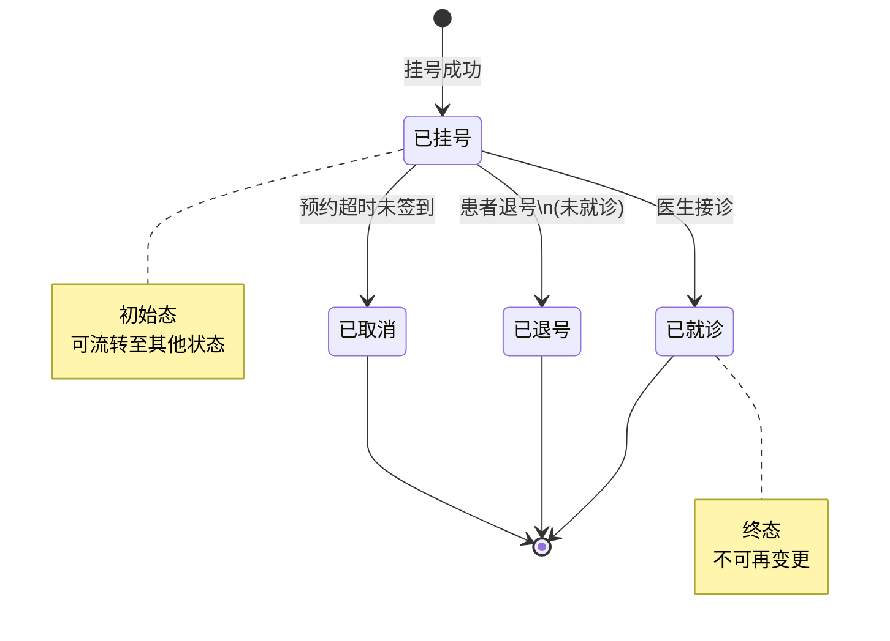
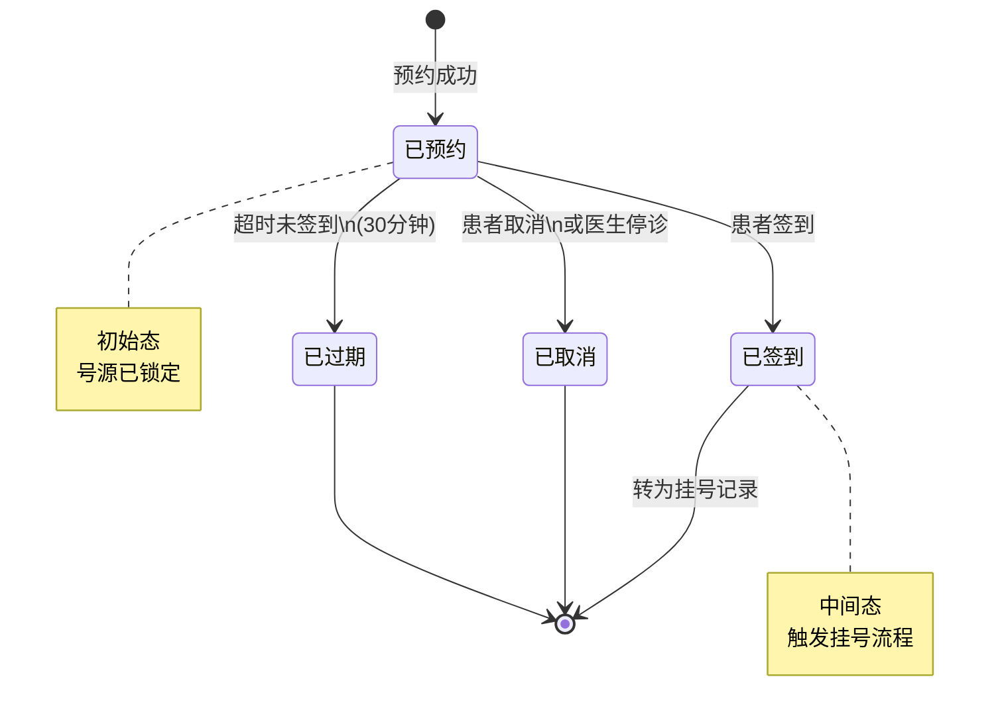
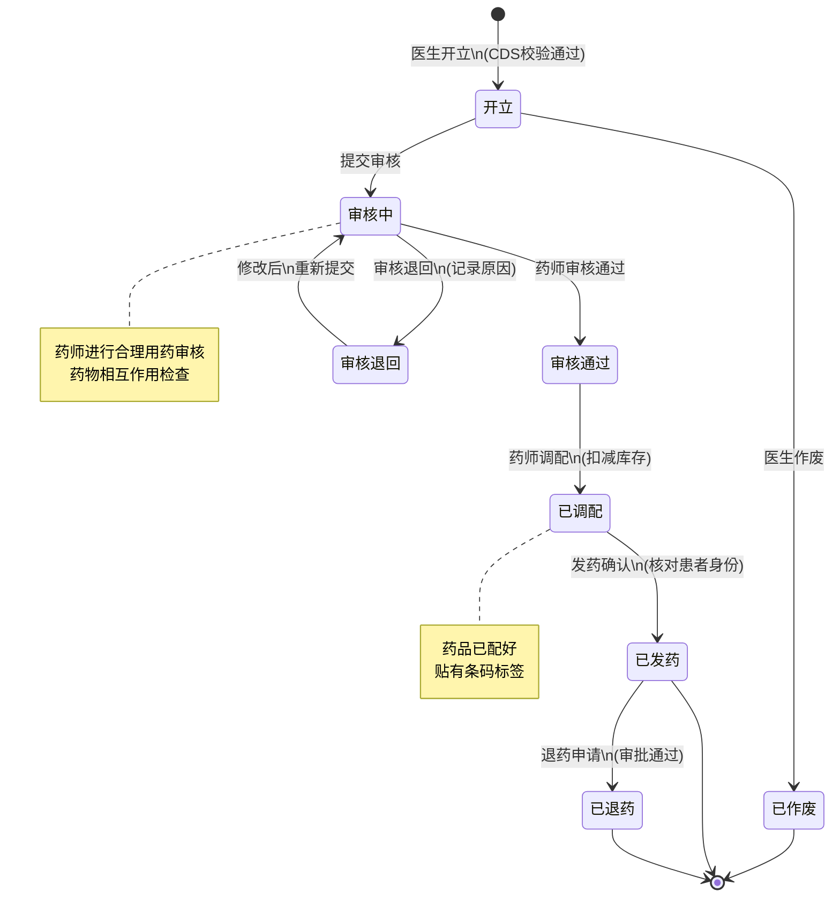
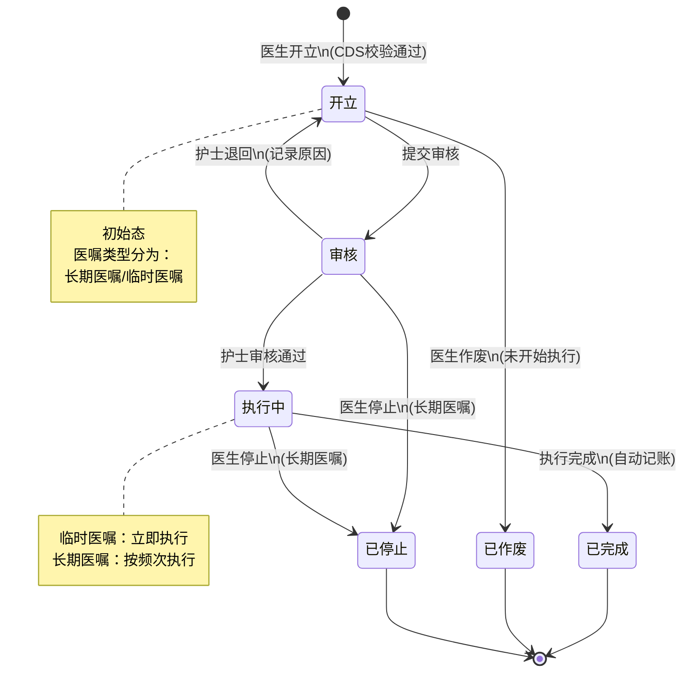
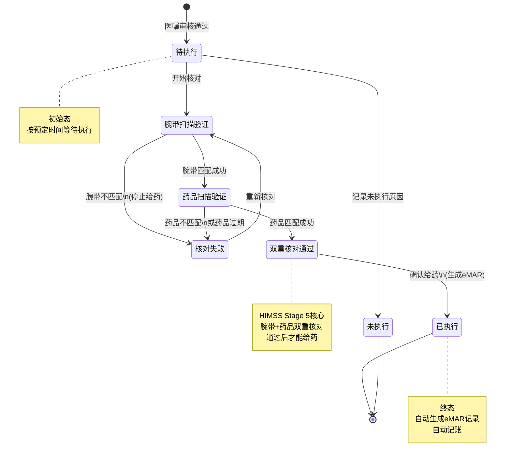
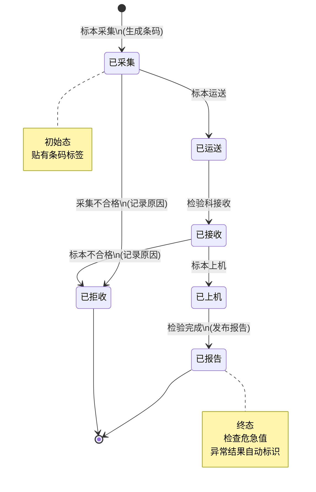
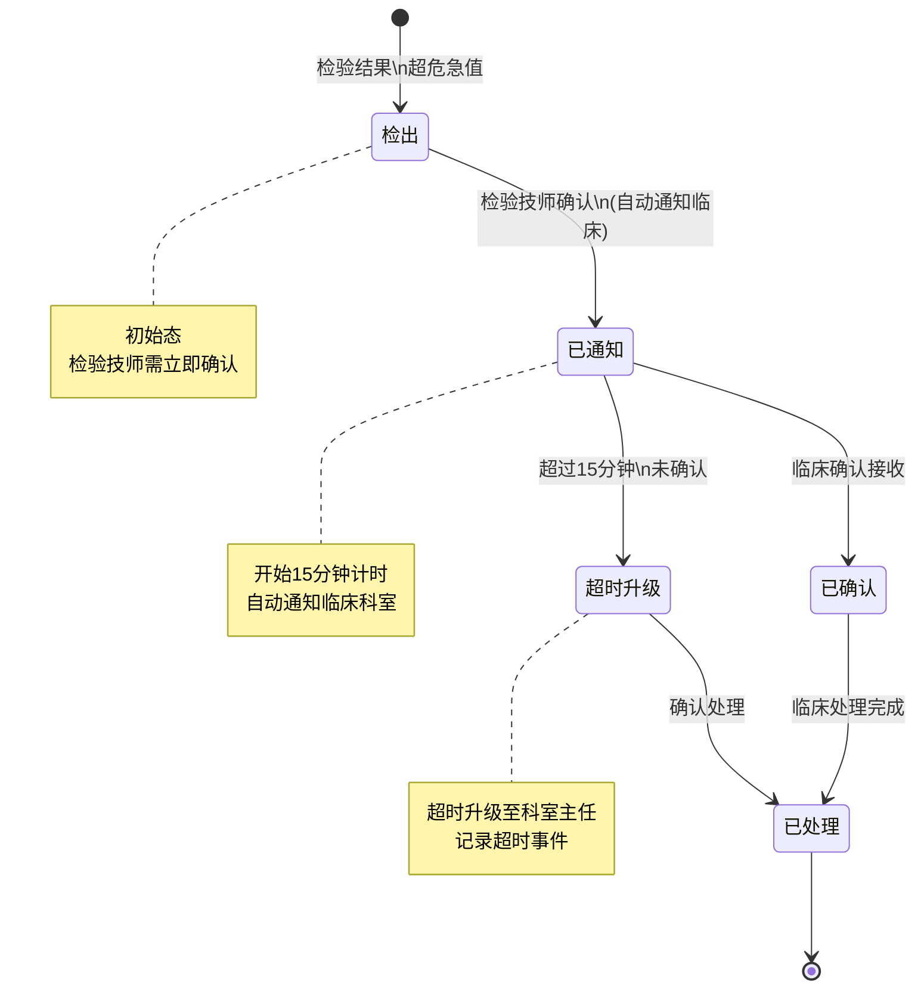
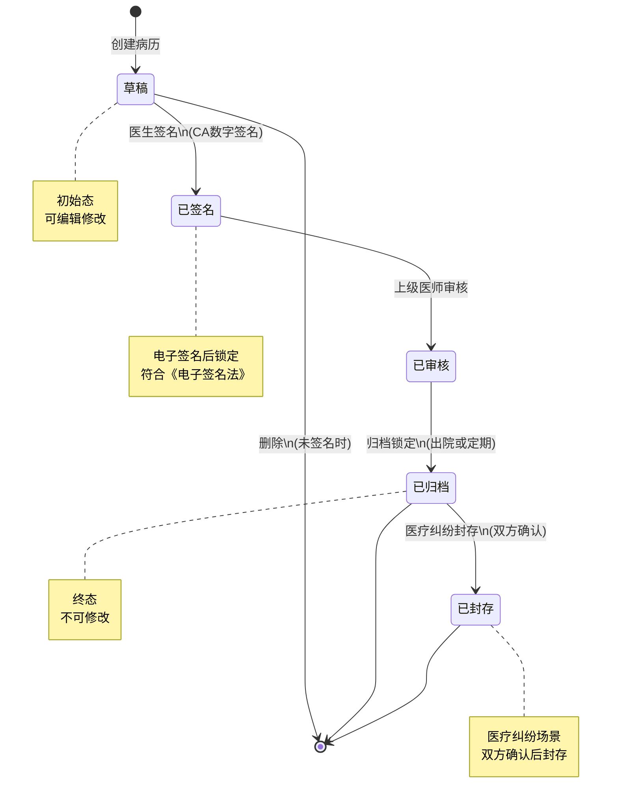
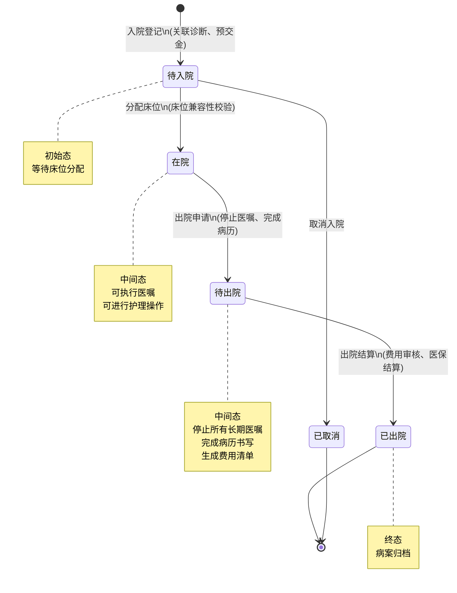

# YUDAO-AI-HIS 智慧医疗信息系统 - 状态机设计文档

> **文档编号**: YUDAO-HIS-SM-001
> **版本**: V1.0
> **创建日期**: 2026-06-16
> **状态**: 设计中
> **关联文档**: YUDAO-HIS-PRD-001, YUDAO-HIS-BR-001

---

## 1. 概述

### 1.1 文档目的

本文档定义YUDAO-AI-HIS智慧医疗信息系统中核心业务对象的状态机设计，包括状态定义、状态流转规则、触发事件、约束条件等。状态机设计遵循以下原则：

- **完整性**: 覆盖所有需要状态管理的业务对象
- **确定性**: 每个状态转换都有明确的触发条件和目标状态
- **可追溯**: 所有状态变更记录审计日志
- **合规性**: 符合HIMSS EMRAM Stage 5+和等保三级要求

### 1.2 状态机清单

| 序号 | 状态机名称 | 适用对象 | 所属模块 | 优先级 | 业务规则 |
|------|------------|----------|----------|--------|----------|
| SM-001 | 挂号状态机 | 挂号记录 | M01门诊 | P0 | BR-OP-033 |
| SM-002 | 预约状态机 | 预约记录 | M01门诊 | P0 | BR-OP-034 |
| SM-003 | 处方状态机 | 处方记录 | M01门诊/M06药品 | P0 | BR-PHARM-005 |
| SM-004 | 医嘱状态机 | 医嘱记录 | M02住院 | P0 | BR-IP-007 |
| SM-005 | eMAR给药状态机 | 给药记录 | M02住院 | P0 | BR-EMAR-001~008 |
| SM-006 | 检验标本状态机 | 检验标本 | M04检验 | P0 | BR-LIS-001 |
| SM-007 | 危急值处理状态机 | 危急值记录 | M04检验 | P0 | BR-LIS-002 |
| SM-008 | 病历状态机 | 病历文书 | M03电子病历 | P0 | BR-EMR-001~003 |
| SM-009 | 出入院状态机 | 住院记录 | M02住院 | P0 | BR-IP-001~014 |

### 1.3 状态机编码规范

#### 1.3.1 数据库编码规范

- 使用TINYINT类型存储状态值
- 状态值使用正整数（1, 2, 3...）
- 0保留为默认/初始状态
- 负数保留为异常/特殊状态

#### 1.3.2 Java枚举类规范

```java
/**
 * 状态枚举基类接口
 */
public interface StatusEnum {
    Integer getCode();
    String getName();
    String getDescription();
}

/**
 * 状态常量类示例
 */
public class RegisterStatus {
    /** 已挂号 */
    public static final int REGISTERED = 1;
    /** 已就诊 */
    public static final int VISITED = 2;
    /** 已退号 */
    public static final int REFUNDED = 3;
    /** 已取消 */
    public static final int CANCELLED = 4;
}
```

---

## 2. 挂号状态机 (SM-001)

### 2.1 基本信息

| 属性 | 内容 |
|------|------|
| 状态机编号 | SM-001 |
| 状态机名称 | 挂号状态机 |
| 适用对象 | op_register（挂号记录表） |
| 状态字段 | register_status |
| 业务规则 | BR-OP-033: 挂号状态流转规则 |
| 优先级 | P0（MVP必需） |

### 2.2 状态列表

| 状态编码 | 状态名称 | 状态描述 | 状态类型 | 允许操作 |
|----------|----------|----------|----------|----------|
| 1 | 已挂号 | 挂号成功，等待就诊 | 初始态 | 就诊、退号、取消 |
| 2 | 已就诊 | 医生完成接诊 | 终态 | 无 |
| 3 | 已退号 | 挂号已退，费用退还 | 终态 | 无 |
| 4 | 已取消 | 预约挂号未签到取消 | 终态 | 无 |

### 2.3 状态流转表

| 当前状态 | 触发事件 | 目标状态 | 前置条件 | 执行操作 | 关联规则 |
|----------|----------|----------|----------|----------|----------|
| - | 挂号成功 | 已挂号(1) | 号源可用、支付成功 | 创建挂号记录、分配排队号、扣减号源 | BR-OP-001~003 |
| 已挂号(1) | 医生接诊 | 已就诊(2) | 医生确认接诊 | 更新就诊时间、生成就诊记录 | - |
| 已挂号(1) | 患者退号 | 已退号(3) | 未就诊、在退号时限内 | 原路退款、释放号源、记录退号日志 | BR-OP-003 |
| 已挂号(1) | 预约超时 | 已取消(4) | 预约挂号未签到 | 释放号源、发送取消通知 | BR-OP-052 |

### 2.4 状态流转图



### 2.5 状态约束规则

1. **已就诊不可退号**: 状态为"已就诊"的挂号记录不可执行退号操作
2. **退号时限约束**: 当日挂号超过规定时限需审批方可退号（BR-OP-003）
3. **医保退号同步**: 医保挂号退号需同步撤销医保结算
4. **号源释放**: 退号或取消后自动释放号源

### 2.6 Java枚举定义

```java
/**
 * 挂号状态枚举
 */
public enum RegisterStatusEnum implements StatusEnum {

    REGISTERED(1, "已挂号", "挂号成功，等待就诊"),
    VISITED(2, "已就诊", "医生完成接诊"),
    REFUNDED(3, "已退号", "挂号已退，费用退还"),
    CANCELLED(4, "已取消", "预约挂号未签到取消");

    private final Integer code;
    private final String name;
    private final String description;

    RegisterStatusEnum(Integer code, String name, String description) {
        this.code = code;
        this.name = name;
        this.description = description;
    }

    @Override
    public Integer getCode() {
        return code;
    }

    @Override
    public String getName() {
        return name;
    }

    @Override
    public String getDescription() {
        return description;
    }

    /**
     * 判断是否可以退号
     */
    public boolean canRefund() {
        return this == REGISTERED;
    }

    /**
     * 判断是否为终态
     */
    public boolean isFinal() {
        return this == VISITED || this == REFUNDED || this == CANCELLED;
    }
}
```

---

## 3. 预约状态机 (SM-002)

### 3.1 基本信息

| 属性 | 内容 |
|------|------|
| 状态机编号 | SM-002 |
| 状态机名称 | 预约状态机 |
| 适用对象 | op_appointment（预约记录表） |
| 状态字段 | appointment_status |
| 业务规则 | BR-OP-034: 预约状态流转规则 |
| 优先级 | P0（MVP必需） |

### 3.2 状态列表

| 状态编码 | 状态名称 | 状态描述 | 状态类型 | 允许操作 |
|----------|----------|----------|----------|----------|
| 1 | 已预约 | 预约成功，等待签到 | 初始态 | 签到、取消、过期 |
| 2 | 已签到 | 患者到院签到 | 中间态 | 转挂号 |
| 3 | 已取消 | 患者主动取消或停诊取消 | 终态 | 无 |
| 4 | 已过期 | 超时未签到自动过期 | 终态 | 无 |

### 3.3 状态流转表

| 当前状态 | 触发事件 | 目标状态 | 前置条件 | 执行操作 | 关联规则 |
|----------|----------|----------|----------|----------|----------|
| - | 预约成功 | 已预约(1) | 号源可用、在预约范围内 | 锁定号源、发送预约通知 | BR-OP-001~002 |
| 已预约(1) | 患者签到 | 已签到(2) | 在预约时间段内 | 创建挂号记录、分配排队号 | - |
| 已预约(1) | 患者取消 | 已取消(3) | 取消时间符合规定 | 释放号源、发送取消通知 | BR-OP-015 |
| 已预约(1) | 医生停诊 | 已取消(3) | 管理员确认停诊 | 释放号源、发送停诊通知 | BR-OP-042 |
| 已预约(1) | 超时未签到 | 已过期(4) | 超过预约时间30分钟 | 释放号源、记录过期 | BR-OP-052 |

### 3.4 状态流转图



### 3.5 状态约束规则

1. **预约时间范围**: 只能预约7天内的号源（BR-OP-002）
2. **预约限次**: 每人每科室每日限预约1次（BR-OP-001）
3. **取消时限**: 预约时间前24小时内不可取消
4. **过期处理**: 预约时间段结束后30分钟自动过期

### 3.6 Java枚举定义

```java
/**
 * 预约状态枚举
 */
public enum AppointmentStatusEnum implements StatusEnum {

    APPOINTED(1, "已预约", "预约成功，等待签到"),
    CHECKED_IN(2, "已签到", "患者到院签到"),
    CANCELLED(3, "已取消", "患者主动取消或停诊取消"),
    EXPIRED(4, "已过期", "超时未签到自动过期");

    private final Integer code;
    private final String name;
    private final String description;

    AppointmentStatusEnum(Integer code, String name, String description) {
        this.code = code;
        this.name = name;
        this.description = description;
    }

    @Override
    public Integer getCode() {
        return code;
    }

    @Override
    public String getName() {
        return name;
    }

    @Override
    public String getDescription() {
        return description;
    }

    /**
     * 判断是否可以取消
     */
    public boolean canCancel() {
        return this == APPOINTED;
    }

    /**
     * 判断是否可以签到
     */
    public boolean canCheckIn() {
        return this == APPOINTED;
    }
}
```

---

## 4. 处方状态机 (SM-003)

### 4.1 基本信息

| 属性 | 内容 |
|------|------|
| 状态机编号 | SM-003 |
| 状态机名称 | 处方状态机 |
| 适用对象 | his_prescription（处方记录表） |
| 状态字段 | prescription_status |
| 业务规则 | BR-PHARM-005: 处方必须经审核方可调配 |
| 优先级 | P0（MVP必需） |

### 4.2 状态列表

| 状态编码 | 状态名称 | 状态描述 | 状态类型 | 允许操作 |
|----------|----------|----------|----------|----------|
| 1 | 开立 | 医生已开立处方 | 初始态 | 提交审核、作废 |
| 2 | 审核中 | 药师审核中 | 中间态 | 审核通过、审核退回 |
| 3 | 审核通过 | 药师审核通过 | 中间态 | 调配 |
| 4 | 审核退回 | 审核不通过，退回修改 | 中间态 | 修改后重新提交 |
| 5 | 已调配 | 药品已调配完成 | 中间态 | 发药 |
| 6 | 已发药 | 药品已发放给患者 | 终态 | 退药申请 |
| 7 | 已退药 | 药品已退回 | 终态 | 无 |
| 8 | 已作废 | 处方已作废 | 终态 | 无 |

### 4.3 状态流转表

| 当前状态 | 触发事件 | 目标状态 | 前置条件 | 执行操作 | 关联规则 |
|----------|----------|----------|----------|----------|----------|
| - | 医生开立 | 开立(1) | CDS校验通过 | 创建处方记录 | BR-OP-006 |
| 开立(1) | 提交审核 | 审核中(2) | 处方信息完整 | 发送审核通知 | - |
| 开立(1) | 医生作废 | 已作废(8) | 未开始审核 | 记录作废原因 | - |
| 审核中(2) | 审核通过 | 审核通过(3) | 合理用药检查通过 | 记录审核药师、时间 | BR-PHARM-006 |
| 审核中(2) | 审核退回 | 审核退回(4) | 发现问题 | 记录退回原因、通知医生 | - |
| 审核退回(4) | 修改提交 | 审核中(2) | 医生修改完成 | 重新进入审核流程 | - |
| 审核通过(3) | 药师调配 | 已调配(5) | 库存充足 | 扣减库存、贴标签 | BR-PHARM-009 |
| 已调配(5) | 发药确认 | 已发药(6) | 核对患者身份 | 记录发药时间、药师 | BR-OP-012 |
| 已发药(6) | 退药申请 | 已退药(7) | 审批通过 | 回补库存、记录退药 | - |

### 4.4 状态流转图



### 4.5 状态约束规则

1. **CDS校验**: 处方开立时必须进行CDS校验（BR-OP-006）
2. **审核强制**: 所有处方必须经过药师审核方可调配（BR-PHARM-005）
3. **大额确认**: 处方金额超过500元需医生二次确认（BR-OP-007）
4. **麻醉药品**: 麻醉药品处方需专项管理（BR-PHARM-004）
5. **库存扣减**: 发药确认时库存扣减必须原子操作（BR-PHARM-009）

### 4.6 Java枚举定义

```java
/**
 * 处方状态枚举
 */
public enum PrescriptionStatusEnum implements StatusEnum {

    CREATED(1, "开立", "医生已开立处方"),
    AUDITING(2, "审核中", "药师审核中"),
    AUDIT_PASSED(3, "审核通过", "药师审核通过"),
    AUDIT_REJECTED(4, "审核退回", "审核不通过，退回修改"),
    DISPENSED(5, "已调配", "药品已调配完成"),
    DISPENSED_OUT(6, "已发药", "药品已发放给患者"),
    RETURNED(7, "已退药", "药品已退回"),
    VOIDED(8, "已作废", "处方已作废");

    private final Integer code;
    private final String name;
    private final String description;

    PrescriptionStatusEnum(Integer code, String name, String description) {
        this.code = code;
        this.name = name;
        this.description = description;
    }

    @Override
    public Integer getCode() {
        return code;
    }

    @Override
    public String getName() {
        return name;
    }

    @Override
    public String getDescription() {
        return description;
    }

    /**
     * 判断是否可以调配
     */
    public boolean canDispense() {
        return this == AUDIT_PASSED;
    }

    /**
     * 判断是否可以发药
     */
    public boolean canDispenseOut() {
        return this == DISPENSED;
    }

    /**
     * 判断是否为终态
     */
    public boolean isFinal() {
        return this == DISPENSED_OUT || this == RETURNED || this == VOIDED;
    }
}
```

---

## 5. 医嘱状态机 (SM-004)

### 5.1 基本信息

| 属性 | 内容 |
|------|------|
| 状态机编号 | SM-004 |
| 状态机名称 | 医嘱状态机 |
| 适用对象 | his_order（医嘱记录表） |
| 状态字段 | order_status |
| 业务规则 | BR-IP-007: 医嘱状态流转规则 |
| 优先级 | P0（MVP必需） |

### 5.2 状态列表

| 状态编码 | 状态名称 | 状态描述 | 状态类型 | 允许操作 |
|----------|----------|----------|----------|----------|
| 1 | 开立 | 医生已开立医嘱 | 初始态 | 提交审核、作废 |
| 2 | 审核 | 护士审核中 | 中间态 | 审核通过、退回 |
| 3 | 执行中 | 医嘱正在执行 | 中间态 | 执行完成、停止 |
| 4 | 已完成 | 医嘱执行完成 | 终态 | 无 |
| 5 | 已作废 | 医嘱已作废 | 终态 | 无 |
| 6 | 已停止 | 长期医嘱已停止 | 终态 | 无 |

### 5.3 状态流转表

| 当前状态 | 触发事件 | 目标状态 | 前置条件 | 执行操作 | 关联规则 |
|----------|----------|----------|----------|----------|----------|
| - | 医生开立 | 开立(1) | CDS校验通过 | 创建医嘱记录 | BR-IP-005 |
| 开立(1) | 提交审核 | 审核(2) | 医嘱信息完整 | 发送护士站通知 | - |
| 开立(1) | 医生作废 | 已作废(5) | 未开始执行 | 记录作废原因 | - |
| 审核(2) | 审核通过 | 执行中(3) | 护士确认 | 开始执行、临时医嘱立即执行 | - |
| 审核(2) | 护士退回 | 开立(1) | 发现问题 | 记录退回原因、通知医生 | - |
| 执行中(3) | 执行完成 | 已完成(4) | 执行完毕 | 记录执行结果、自动记账 | BR-FIN-004 |
| 执行中(3) | 医生停止 | 已停止(6) | 长期医嘱 | 记录停止原因、时间 | BR-IP-006 |
| 审核(2) | 医生停止 | 已停止(6) | 长期医嘱 | 记录停止信息 | BR-IP-006 |

### 5.4 状态流转图



### 5.5 状态约束规则

1. **CDS校验**: 医嘱开立必须进行CDS校验（BR-IP-005）
2. **长期医嘱停止**: 长期医嘱停止需提前一天（BR-IP-006）
3. **临时医嘱**: 临时医嘱立即执行
4. **出院停止**: 出院前必须停止所有长期医嘱（BR-IP-012）
5. **自动记账**: 医嘱执行完成时自动记账（BR-FIN-004）

### 5.6 Java枚举定义

```java
/**
 * 医嘱状态枚举
 */
public enum OrderStatusEnum implements StatusEnum {

    CREATED(1, "开立", "医生已开立医嘱"),
    AUDITING(2, "审核", "护士审核中"),
    EXECUTING(3, "执行中", "医嘱正在执行"),
    COMPLETED(4, "已完成", "医嘱执行完成"),
    VOIDED(5, "已作废", "医嘱已作废"),
    STOPPED(6, "已停止", "长期医嘱已停止");

    private final Integer code;
    private final String name;
    private final String description;

    OrderStatusEnum(Integer code, String name, String description) {
        this.code = code;
        this.name = name;
        this.description = description;
    }

    @Override
    public Integer getCode() {
        return code;
    }

    @Override
    public String getName() {
        return name;
    }

    @Override
    public String getDescription() {
        return description;
    }

    /**
     * 判断是否可以停止
     */
    public boolean canStop() {
        return this == AUDITING || this == EXECUTING;
    }

    /**
     * 判断是否可以作废
     */
    public boolean canVoid() {
        return this == CREATED;
    }

    /**
     * 判断是否为终态
     */
    public boolean isFinal() {
        return this == COMPLETED || this == VOIDED || this == STOPPED;
    }
}
```

---

## 6. eMAR给药状态机 (SM-005)

### 6.1 基本信息

| 属性 | 内容 |
|------|------|
| 状态机编号 | SM-005 |
| 状态机名称 | eMAR给药状态机 |
| 适用对象 | his_medication_admin（给药记录表） |
| 状态字段 | admin_status |
| 业务规则 | BR-EMAR-001~008: 闭环给药规则 |
| 优先级 | P0（MVP必需） |
| HIMSS要求 | EMRAM Stage 5核心功能 |

### 6.2 状态列表

| 状态编码 | 状态名称 | 状态描述 | 状态类型 | 允许操作 |
|----------|----------|----------|----------|----------|
| 1 | 待执行 | 医嘱已审核，等待执行 | 初始态 | 开始核对、未执行 |
| 2 | 腕带扫描验证 | 正在扫描患者腕带 | 中间态 | 确认匹配、不匹配 |
| 3 | 药品扫描验证 | 正在扫描药品条码 | 中间态 | 确认匹配、不匹配 |
| 4 | 双重核对通过 | 腕带和药品双重核对通过 | 中间态 | 确认给药 |
| 5 | 已执行 | 给药完成 | 终态 | 无 |
| 6 | 未执行 | 未执行给药（记录原因） | 终态 | 补执行 |
| 7 | 核对失败 | 核对不匹配，停止给药 | 中间态 | 重新核对 |

### 6.3 状态流转表

| 当前状态 | 触发事件 | 目标状态 | 前置条件 | 执行操作 | 关联规则 |
|----------|----------|----------|----------|----------|----------|
| - | 医嘱审核通过 | 待执行(1) | 给药医嘱 | 创建给药计划 | - |
| 待执行(1) | 开始核对 | 腕带扫描验证(2) | 护士开始执行 | 记录开始时间 | BR-EMAR-002 |
| 待执行(1) | 记录未执行 | 未执行(6) | 选择未执行原因 | 记录原因、通知医生 | BR-EMAR-008 |
| 腕带扫描验证(2) | 腕带匹配 | 药品扫描验证(3) | 患者身份匹配 | 记录腕带信息 | BR-EMAR-003 |
| 腕带扫描验证(2) | 腕带不匹配 | 核对失败(7) | 患者身份不匹配 | 停止给药、记录异常 | BR-EMAR-003 |
| 药品扫描验证(3) | 药品匹配 | 双重核对通过(4) | 药品信息匹配 | 记录药品批号 | BR-EMAR-006 |
| 药品扫描验证(3) | 药品不匹配 | 核对失败(7) | 药品不匹配 | 停止给药、联系药师 | BR-EMAR-003 |
| 药品扫描验证(3) | 药品过期 | 核对失败(7) | 药品已过期 | 停止给药、记录过期 | BR-EMAR-005 |
| 双重核对通过(4) | 确认给药 | 已执行(5) | 护士确认 | 生成eMAR记录、自动记账 | BR-EMAR-004 |
| 核对失败(7) | 重新核对 | 腕带扫描验证(2) | 重新开始 | 重置核对状态 | - |

### 6.4 状态流转图



### 6.5 状态约束规则

1. **双重核对强制**: 给药前必须完成腕带和药品双重核对（BR-EMAR-001）
2. **扫描顺序**: 必须先扫描腕带再扫描药品（BR-EMAR-002）
3. **核对失败阻止**: 任一核对不匹配即阻止给药（BR-EMAR-003）
4. **eMAR必填项**: 记录必须包含时间、剂量、途径、护士、核对结果（BR-EMAR-004）
5. **药品过期检查**: 过期药品禁止使用（BR-EMAR-005）
6. **批号追溯**: 给药记录必须关联药品批号（BR-EMAR-006）
7. **未执行通知**: 给药未执行需通知医生（BR-EMAR-008）

### 6.6 Java枚举定义

```java
/**
 * eMAR给药状态枚举
 */
public enum MedicationAdminStatusEnum implements StatusEnum {

    PENDING(1, "待执行", "医嘱已审核，等待执行"),
    WRISTBAND_SCANNING(2, "腕带扫描验证", "正在扫描患者腕带"),
    DRUG_SCANNING(3, "药品扫描验证", "正在扫描药品条码"),
    DOUBLE_CHECK_PASSED(4, "双重核对通过", "腕带和药品双重核对通过"),
    ADMINISTERED(5, "已执行", "给药完成"),
    NOT_ADMINISTERED(6, "未执行", "未执行给药（记录原因）"),
    CHECK_FAILED(7, "核对失败", "核对不匹配，停止给药");

    private final Integer code;
    private final String name;
    private final String description;

    MedicationAdminStatusEnum(Integer code, String name, String description) {
        this.code = code;
        this.name = name;
        this.description = description;
    }

    @Override
    public Integer getCode() {
        return code;
    }

    @Override
    public String getName() {
        return name;
    }

    @Override
    public String getDescription() {
        return description;
    }

    /**
     * 判断是否可以给药
     */
    public boolean canAdminister() {
        return this == DOUBLE_CHECK_PASSED;
    }

    /**
     * 判断是否为终态
     */
    public boolean isFinal() {
        return this == ADMINISTERED || this == NOT_ADMINISTERED;
    }

    /**
     * 判断是否需要重新核对
     */
    public boolean canRetry() {
        return this == CHECK_FAILED;
    }
}
```

---

## 7. 检验标本状态机 (SM-006)

### 7.1 基本信息

| 属性 | 内容 |
|------|------|
| 状态机编号 | SM-006 |
| 状态机名称 | 检验标本状态机 |
| 适用对象 | his_specimen（检验标本表） |
| 状态字段 | specimen_status |
| 业务规则 | BR-LIS-001: 标本全程条码追踪 |
| 优先级 | P0（MVP必需） |

### 7.2 状态列表

| 状态编码 | 状态名称 | 状态描述 | 状态类型 | 允许操作 |
|----------|----------|----------|----------|----------|
| 1 | 已采集 | 标本已采集 | 初始态 | 运送、拒收 |
| 2 | 已运送 | 标本运送中 | 中间态 | 接收 |
| 3 | 已接收 | 检验科已接收 | 中间态 | 上机、拒收 |
| 4 | 已上机 | 标本正在检验 | 中间态 | 报告 |
| 5 | 已报告 | 检验报告已发布 | 终态 | 无 |
| 6 | 已拒收 | 标本不合格已拒收 | 终态 | 无 |

### 7.3 状态流转表

| 当前状态 | 触发事件 | 目标状态 | 前置条件 | 执行操作 | 关联规则 |
|----------|----------|----------|----------|----------|----------|
| - | 标本采集 | 已采集(1) | 采集信息完整 | 生成条码、记录采集人时间 | - |
| 已采集(1) | 标本运送 | 已运送(2) | 采集完成 | 记录运送人、时间 | BR-LIS-001 |
| 已采集(1) | 标本拒收 | 已拒收(6) | 采集不合格 | 记录拒收原因、通知重采 | BR-LIS-005 |
| 已运送(2) | 标本接收 | 已接收(3) | 标本完好 | 记录接收人、时间 | - |
| 已接收(3) | 标本上机 | 已上机(4) | 设备就绪 | 记录上机时间 | - |
| 已接收(3) | 标本拒收 | 已拒收(6) | 标本不合格 | 记录拒收原因、通知重采 | BR-LIS-005 |
| 已上机(4) | 检验完成 | 已报告(5) | 检验结果录入 | 发布报告、检查危急值 | BR-LIS-002~004 |

### 7.4 状态流转图



### 7.5 状态约束规则

1. **全程追踪**: 标本必须全程条码追踪（BR-LIS-001）
2. **拒收处理**: 不合格标本拒收并通知重新采集（BR-LIS-005）
3. **报告时限**: 常规检验报告时间≤2小时（BR-LIS-003）
4. **异常标识**: 检验结果异常自动标识（BR-LIS-004）
5. **危急值检查**: 检验完成后检查危急值并通报（BR-LIS-002）

### 7.6 Java枚举定义

```java
/**
 * 检验标本状态枚举
 */
public enum SpecimenStatusEnum implements StatusEnum {

    COLLECTED(1, "已采集", "标本已采集"),
    TRANSPORTING(2, "已运送", "标本运送中"),
    RECEIVED(3, "已接收", "检验科已接收"),
    TESTING(4, "已上机", "标本正在检验"),
    REPORTED(5, "已报告", "检验报告已发布"),
    REJECTED(6, "已拒收", "标本不合格已拒收");

    private final Integer code;
    private final String name;
    private final String description;

    SpecimenStatusEnum(Integer code, String name, String description) {
        this.code = code;
        this.name = name;
        this.description = description;
    }

    @Override
    public Integer getCode() {
        return code;
    }

    @Override
    public String getName() {
        return name;
    }

    @Override
    public String getDescription() {
        return description;
    }

    /**
     * 判断是否为终态
     */
    public boolean isFinal() {
        return this == REPORTED || this == REJECTED;
    }
}
```

---

## 8. 危急值处理状态机 (SM-007)

### 8.1 基本信息

| 属性 | 内容 |
|------|------|
| 状态机编号 | SM-007 |
| 状态机名称 | 危急值处理状态机 |
| 适用对象 | his_critical_value（危急值记录表） |
| 状态字段 | critical_status |
| 业务规则 | BR-LIS-002: 危急值15分钟内通报 |
| 优先级 | P0（MVP必需） |

### 8.2 状态列表

| 状态编码 | 状态名称 | 状态描述 | 状态类型 | 允许操作 |
|----------|----------|----------|----------|----------|
| 1 | 检出 | 检验结果检出危急值 | 初始态 | 确认、通知 |
| 2 | 已通知 | 已通知临床科室 | 中间态 | 确认接收 |
| 3 | 已确认 | 临床已确认接收 | 中间态 | 处理 |
| 4 | 已处理 | 临床已处理 | 终态 | 无 |
| 5 | 超时升级 | 超时未确认，已升级 | 中间态 | 确认处理 |

### 8.3 状态流转表

| 当前状态 | 触发事件 | 目标状态 | 前置条件 | 执行操作 | 关联规则 |
|----------|----------|----------|----------|----------|----------|
| - | 检出危急值 | 检出(1) | 检验结果超危急值 | 创建危急值记录 | BR-LIS-004 |
| 检出(1) | 检验技师确认 | 已通知(2) | 检验技师确认 | 自动通知临床、记录通知时间 | BR-LIS-002 |
| 已通知(2) | 临床确认接收 | 已确认(3) | 临床确认 | 记录确认人、时间 | - |
| 已通知(2) | 超时未确认 | 超时升级(5) | 超过15分钟未确认 | 升级通知科室主任 | BR-LIS-002 |
| 已确认(3) | 临床处理 | 已处理(4) | 处理完成 | 记录处理结果 | - |
| 超时升级(5) | 确认处理 | 已处理(4) | 处理完成 | 记录处理结果 | - |

### 8.4 状态流转图



### 8.5 状态约束规则

1. **15分钟通报**: 危急值必须15分钟内通知临床并确认接收（BR-LIS-002）
2. **超时升级**: 超时未确认自动升级通知科室主任
3. **完整记录**: 记录检出、通知、确认、处理全流程时间
4. **双重确认**: 检验技师确认+临床确认

### 8.6 Java枚举定义

```java
/**
 * 危急值处理状态枚举
 */
public enum CriticalValueStatusEnum implements StatusEnum {

    DETECTED(1, "检出", "检验结果检出危急值"),
    NOTIFIED(2, "已通知", "已通知临床科室"),
    CONFIRMED(3, "已确认", "临床已确认接收"),
    PROCESSED(4, "已处理", "临床已处理"),
    TIMEOUT_ESCALATED(5, "超时升级", "超时未确认，已升级");

    private final Integer code;
    private final String name;
    private final String description;

    CriticalValueStatusEnum(Integer code, String name, String description) {
        this.code = code;
        this.name = name;
        this.description = description;
    }

    @Override
    public Integer getCode() {
        return code;
    }

    @Override
    public String getName() {
        return name;
    }

    @Override
    public String getDescription() {
        return description;
    }

    /**
     * 判断是否需要升级
     */
    public boolean needEscalate() {
        return this == NOTIFIED;
    }

    /**
     * 判断是否为终态
     */
    public boolean isFinal() {
        return this == PROCESSED;
    }
}
```

---

## 9. 病历状态机 (SM-008)

### 9.1 基本信息

| 属性 | 内容 |
|------|------|
| 状态机编号 | SM-008 |
| 状态机名称 | 病历状态机 |
| 适用对象 | his_medical_record（病历文书表） |
| 状态字段 | record_status |
| 业务规则 | BR-EMR-001~003: 病历管理规则 |
| 优先级 | P0（MVP必需） |

### 9.2 状态列表

| 状态编码 | 状态名称 | 状态描述 | 状态类型 | 允许操作 |
|----------|----------|----------|----------|----------|
| 1 | 草稿 | 病历正在编辑中 | 初始态 | 编辑、提交、删除 |
| 2 | 已签名 | 医生已签名 | 中间态 | 提交审核 |
| 3 | 已审核 | 上级医师已审核 | 中间态 | 归档 |
| 4 | 已归档 | 病历已归档锁定 | 终态 | 封存 |
| 5 | 已封存 | 医疗纠纷场景封存 | 终态 | 无 |

### 9.3 状态流转表

| 当前状态 | 触发事件 | 目标状态 | 前置条件 | 执行操作 | 关联规则 |
|----------|----------|----------|----------|----------|----------|
| - | 创建病历 | 草稿(1) | 就诊记录存在 | 创建病历记录 | BR-EMR-001 |
| 草稿(1) | 医生签名 | 已签名(2) | 内容填写完整 | 记录电子签名、锁定修改 | BR-EMR-002 |
| 草稿(1) | 删除 | - | 未签名 | 删除病历记录 | - |
| 已签名(2) | 提交审核 | 已审核(3) | 上级医师审核 | 记录审核人、时间 | - |
| 已审核(3) | 归档 | 已归档(4) | 出院或定期归档 | 锁定病历、不可修改 | BR-EMR-001 |
| 已归档(4) | 医疗纠纷封存 | 已封存(5) | 双方确认签字 | 生成副本、记录封存日志 | BR-EMR-003 |

### 9.4 状态流转图



### 9.5 状态约束规则

1. **归档锁定**: 病历归档后不可修改（BR-EMR-001）
2. **电子签名**: 电子签名必须符合《电子签名法》（BR-EMR-002）
3. **病历封存**: 医疗纠纷时病历封存需双方确认（BR-EMR-003）
4. **完成时限**: 入院记录24小时内完成、首次病程8小时内完成（BR-IP-008）

### 9.6 Java枚举定义

```java
/**
 * 病历状态枚举
 */
public enum MedicalRecordStatusEnum implements StatusEnum {

    DRAFT(1, "草稿", "病历正在编辑中"),
    SIGNED(2, "已签名", "医生已签名"),
    AUDITED(3, "已审核", "上级医师已审核"),
    ARCHIVED(4, "已归档", "病历已归档锁定"),
    SEALED(5, "已封存", "医疗纠纷场景封存");

    private final Integer code;
    private final String name;
    private final String description;

    MedicalRecordStatusEnum(Integer code, String name, String description) {
        this.code = code;
        this.name = name;
        this.description = description;
    }

    @Override
    public Integer getCode() {
        return code;
    }

    @Override
    public String getName() {
        return name;
    }

    @Override
    public String getDescription() {
        return description;
    }

    /**
     * 判断是否可编辑
     */
    public boolean canEdit() {
        return this == DRAFT;
    }

    /**
     * 判断是否为终态
     */
    public boolean isFinal() {
        return this == ARCHIVED || this == SEALED;
    }
}
```

---

## 10. 出入院状态机 (SM-009)

### 10.1 基本信息

| 属性 | 内容 |
|------|------|
| 状态机编号 | SM-009 |
| 状态机名称 | 出入院状态机 |
| 适用对象 | his_admission（住院记录表） |
| 状态字段 | admission_status |
| 业务规则 | BR-IP-001~014: 住院管理规则 |
| 优先级 | P0（MVP必需） |

### 10.2 状态列表

| 状态编码 | 状态名称 | 状态描述 | 状态类型 | 允许操作 |
|----------|----------|----------|----------|----------|
| 1 | 待入院 | 已办理入院登记，等待床位 | 初始态 | 分配床位、取消 |
| 2 | 在院 | 已入院在院治疗 | 中间态 | 医嘱、出院申请 |
| 3 | 待出院 | 已申请出院，等待结算 | 中间态 | 结算 |
| 4 | 已出院 | 出院结算完成 | 终态 | 无 |
| 5 | 已取消 | 入院登记已取消 | 终态 | 无 |

### 10.3 状态流转表

| 当前状态 | 触发事件 | 目标状态 | 前置条件 | 执行操作 | 关联规则 |
|----------|----------|----------|----------|----------|----------|
| - | 入院登记 | 待入院(1) | 关联诊断、预交金缴纳 | 创建住院记录 | BR-IP-001~002 |
| 待入院(1) | 分配床位 | 在院(2) | 床位可用、床位兼容性校验 | 分配床位、开始医嘱 | BR-IP-003 |
| 待入院(1) | 取消入院 | 已取消(5) | 未分配床位 | 退还预交金 | - |
| 在院(2) | 出院申请 | 待出院(3) | 停止长期医嘱、完成病历 | 停止医嘱、生成费用清单 | BR-IP-012~013 |
| 待出院(3) | 出院结算 | 已出院(4) | 费用审核完成、无未结费用 | 结算、医保结算、病案归档 | BR-IP-014~017 |

### 10.4 状态流转图



### 10.5 状态约束规则

1. **入院关联诊断**: 入院必须关联门诊诊断或急诊诊断（BR-IP-001）
2. **预交金管理**: 预交金不足时提醒，欠费超阈值限制记账（BR-IP-002）
3. **床位分配**: 需考虑性别、病种、感染等因素（BR-IP-003）
4. **入院评估**: 入院护理评估必须在4小时内完成（BR-IP-004）
5. **出院停止医嘱**: 出院前必须停止所有长期医嘱（BR-IP-012）
6. **出院费用审核**: 必须完成费用审核，无未结费用（BR-IP-013）
7. **病案归档**: 归档后不可修改（BR-IP-014）

### 10.6 Java枚举定义

```java
/**
 * 出入院状态枚举
 */
public enum AdmissionStatusEnum implements StatusEnum {

    PENDING(1, "待入院", "已办理入院登记，等待床位"),
    IN_HOSPITAL(2, "在院", "已入院在院治疗"),
    PENDING_DISCHARGE(3, "待出院", "已申请出院，等待结算"),
    DISCHARGED(4, "已出院", "出院结算完成"),
    CANCELLED(5, "已取消", "入院登记已取消");

    private final Integer code;
    private final String name;
    private final String description;

    AdmissionStatusEnum(Integer code, String name, String description) {
        this.code = code;
        this.name = name;
        this.description = description;
    }

    @Override
    public Integer getCode() {
        return code;
    }

    @Override
    public String getName() {
        return name;
    }

    @Override
    public String getDescription() {
        return description;
    }

    /**
     * 判断是否可以出院
     */
    public boolean canDischarge() {
        return this == IN_HOSPITAL;
    }

    /**
     * 判断是否为终态
     */
    public boolean isFinal() {
        return this == DISCHARGED || this == CANCELLED;
    }
}
```

---

## 11. 状态机通用服务设计

### 11.1 状态机服务接口

```java
/**
 * 状态机服务接口
 * @param <S> 状态枚举类型
 * @param <E> 事件类型
 */
public interface StateMachineService<S extends Enum<S> & StatusEnum, E> {

    /**
     * 获取当前状态
     */
    S getCurrentStatus(Long entityId);

    /**
     * 状态转换
     */
    boolean transition(Long entityId, E event, String operator);

    /**
     * 检查是否可以转换
     */
    boolean canTransition(Long entityId, E event);

    /**
     * 获取可转换的状态列表
     */
    List<S> getAvailableTransitions(Long entityId);

    /**
     * 获取状态变更历史
     */
    List<StateChangeLog> getStateChangeHistory(Long entityId);
}
```

### 11.2 状态变更日志表设计

```sql
-- 状态变更日志表
CREATE TABLE sys_state_change_log (
    log_id          BIGINT          NOT NULL AUTO_INCREMENT COMMENT '日志ID',
    entity_type     VARCHAR(50)     NOT NULL COMMENT '实体类型',
    entity_id       BIGINT          NOT NULL COMMENT '实体ID',
    old_status      INT             DEFAULT NULL COMMENT '原状态',
    new_status      INT             NOT NULL COMMENT '新状态',
    event           VARCHAR(50)     NOT NULL COMMENT '触发事件',
    operator        VARCHAR(50)     NOT NULL COMMENT '操作人',
    operate_time    DATETIME        NOT NULL COMMENT '操作时间',
    reason          VARCHAR(500)    DEFAULT NULL COMMENT '变更原因',
    remark          VARCHAR(500)    DEFAULT NULL COMMENT '备注',
    PRIMARY KEY (log_id),
    INDEX idx_entity (entity_type, entity_id),
    INDEX idx_operate_time (operate_time)
) COMMENT '状态变更日志表';
```

### 11.3 状态机配置类

```java
/**
 * 状态机配置
 */
@Configuration
public class StateMachineConfig {

    /**
     * 状态转换规则配置
     */
    @Bean
    public Map<String, List<StateTransition>> stateTransitionRules() {
        Map<String, List<StateTransition>> rules = new HashMap<>();

        // 挂号状态机配置
        rules.put("REGISTER", Arrays.asList(
            new StateTransition(null, RegisterStatusEnum.REGISTERED, "REGISTER_SUCCESS"),
            new StateTransition(RegisterStatusEnum.REGISTERED, RegisterStatusEnum.VISITED, "VISIT"),
            new StateTransition(RegisterStatusEnum.REGISTERED, RegisterStatusEnum.REFUNDED, "REFUND"),
            new StateTransition(RegisterStatusEnum.REGISTERED, RegisterStatusEnum.CANCELLED, "TIMEOUT")
        ));

        // ... 其他状态机配置

        return rules;
    }
}
```

---

## 12. 状态机测试用例

### 12.1 挂号状态机测试用例

```gherkin
Feature: 挂号状态机测试

  Scenario: 正常挂号状态流转
    Given 患者选择科室"内科"挂号
    When 挂号成功
    Then 挂号状态为"已挂号"
    When 医生接诊
    Then 挂号状态为"已就诊"
    And 状态不可再变更

  Scenario: 已就诊不可退号
    Given 挂号状态为"已就诊"
    When 尝试退号
    Then 系统提示"患者已就诊，不能办理退号"
    And 退号操作被拒绝

  Scenario: 预约超时取消
    Given 预约挂号状态为"已挂号"
    And 预约时间已过30分钟
    When 系统执行定时检查
    Then 挂号状态变更为"已取消"
```

### 12.2 eMAR给药状态机测试用例

```gherkin
Feature: eMAR给药状态机测试

  Scenario: 完整闭环给药流程
    Given 存在待执行给药医嘱
    When 护士开始核对
    Then 状态变为"腕带扫描验证"
    When 腕带扫描匹配成功
    Then 状态变为"药品扫描验证"
    When 药品扫描匹配成功
    Then 状态变为"双重核对通过"
    When 护士确认给药
    Then 状态变为"已执行"
    And 生成eMAR记录
    And 自动记账

  Scenario: 腕带不匹配阻止给药
    Given 状态为"腕带扫描验证"
    When 腕带扫描不匹配
    Then 状态变为"核对失败"
    And 系统阻止继续给药
    And 记录核对失败日志

  Scenario: 未执行给药记录
    Given 状态为"待执行"
    When 护士选择"未执行"
    And 选择原因"患者拒绝"
    Then 状态变为"未执行"
    And 通知医生
```

---

## 附录A: 状态机汇总表

| 状态机 | 状态数 | 初始态 | 中间态 | 终态 | 核心业务规则 |
|--------|--------|--------|--------|------|--------------|
| 挂号状态机 | 4 | 1 | 0 | 3 | BR-OP-033 |
| 预约状态机 | 4 | 1 | 1 | 2 | BR-OP-034 |
| 处方状态机 | 8 | 1 | 4 | 3 | BR-PHARM-005 |
| 医嘱状态机 | 6 | 1 | 2 | 3 | BR-IP-007 |
| eMAR给药状态机 | 7 | 1 | 4 | 2 | BR-EMAR-001~008 |
| 检验标本状态机 | 6 | 1 | 3 | 2 | BR-LIS-001 |
| 危急值处理状态机 | 5 | 1 | 3 | 1 | BR-LIS-002 |
| 病历状态机 | 5 | 1 | 2 | 2 | BR-EMR-001~003 |
| 出入院状态机 | 5 | 1 | 2 | 2 | BR-IP-001~014 |

---

## 附录B: 变更历史

| 版本 | 日期 | 变更内容 | 变更人 |
|------|------|----------|--------|
| V1.0 | 2026-06-16 | 初始版本，定义9个核心业务状态机 | YUDAO-AI-HIS架构组 |

---

> **架构师**: ________________
> **技术负责人**: ________________
> **最后更新**: 2026-06-16
