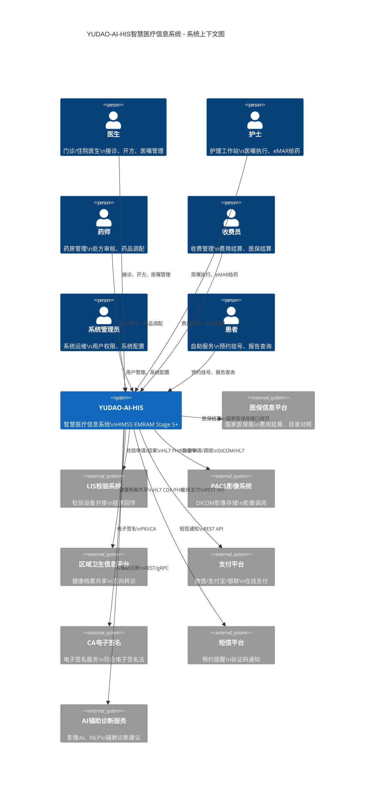
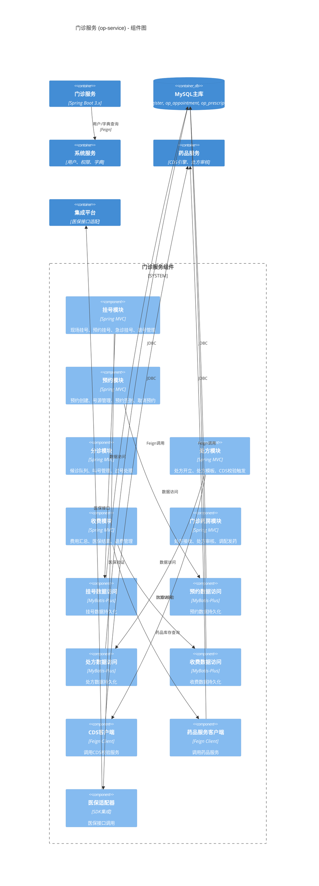
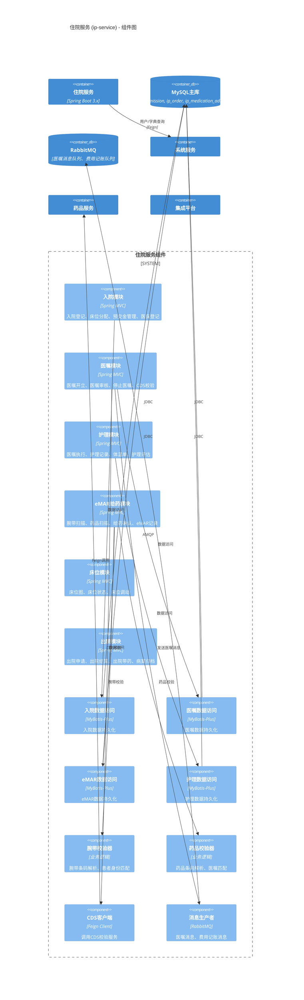
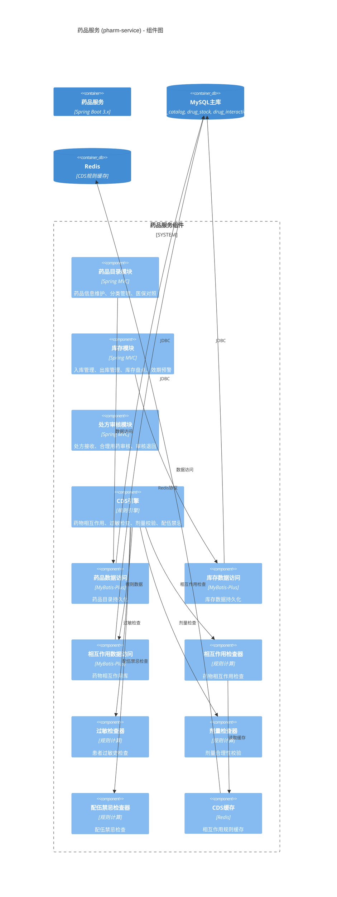
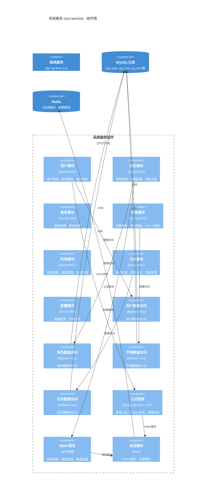
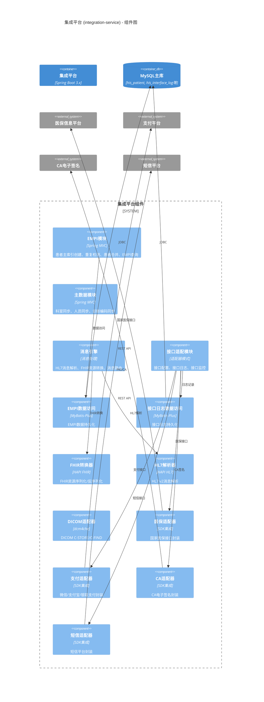
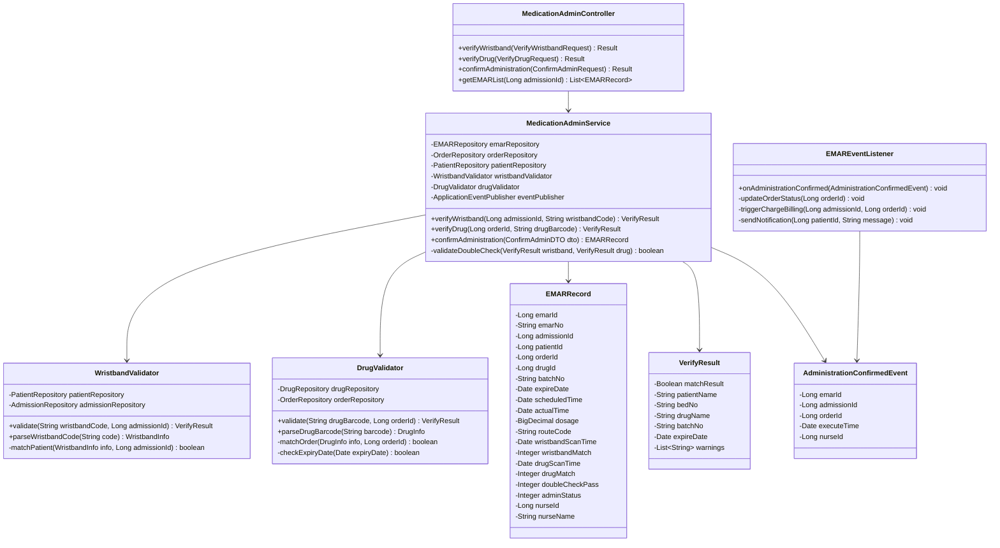
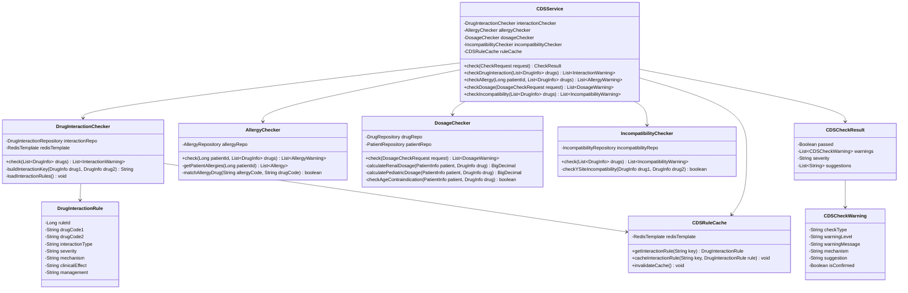
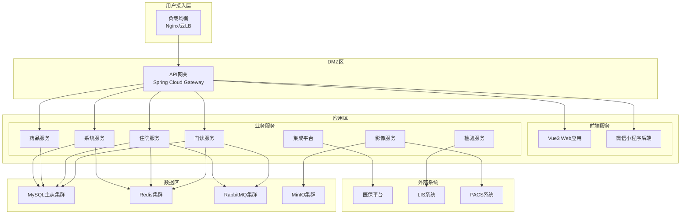

# YUDAO-AI-HIS 智慧医疗信息系统 - 系统架构图(C4模型)

> **文档编号**: YUDAO-HIS-ARCH-001
> **版本**: V1.0
> **创建日期**: 2026-06-16
> **状态**: 设计中
> **参考文档**: YUDAO-HIS-PRD-001, YUDAO-HIS-MDD-001, YUDAO-HIS-DM-001, YUDAO-HIS-API-001
> **架构标准**: C4 Model | HIMSS EMRAM Stage 5+ | HL7 FHIR R4

---

## 1. C4模型概述

### 1.1 架构分层说明

C4模型是一种分层架构设计方法，通过四个层次的抽象来描述软件系统架构：

| 层级 | 名称 | 关注点 | 目标受众 |
|------|------|--------|----------|
| Level 1 | 系统上下文图 (System Context) | 系统与外部世界的关系 | 非技术人员、管理层 |
| Level 2 | 容器图 (Container Diagram) | 系统内部高层结构 | 技术决策者、架构师 |
| Level 3 | 组件图 (Component Diagram) | 容器内部的组件构成 | 开发人员、架构师 |
| Level 4 | 代码图 (Code Diagram) | 组件内部的代码结构 | 开发人员 |

### 1.2 系统定位

YUDAO-AI-HIS智慧医疗信息系统是一套面向三级医院的综合医院信息系统，目标达到HIMSS EMRAM Stage 5+水平，核心特性包括：

- **闭环给药管理**: 腕带+药品条码双重核对，给药差错率降低90%
- **临床决策支持(CDS)**: 药物相互作用、过敏检查、剂量合理性四维校验
- **标准互操作**: 基于HL7 FHIR R4实现院内/院间互联互通
- **AI辅助诊断**: 智能分诊、影像AI、病历质控AI

---

## 2. Level 1: 系统上下文图 (System Context)

### 2.1 架构图

### 2.2 系统上下文说明

#### 2.2.1 用户角色

| 用户角色 | 主要职责 | 核心功能需求 |
|----------|----------|--------------|
| 医生 | 接诊、诊断、开方、医嘱管理 | 门诊医生工作站、住院医生工作站、CDS校验 |
| 护士 | 医嘱执行、护理记录、给药管理 | 护理工作站、eMAR闭环给药、体温单 |
| 药师 | 处方审核、药品调配、发药 | 门诊药房、住院药房、合理用药审核 |
| 收费员 | 费用结算、医保结算、退费管理 | 门诊收费、出院结算、日结对账 |
| 系统管理员 | 系统运维、权限管理、数据维护 | 用户管理、角色权限、字典管理 |
| 患者 | 自助挂号、报告查询、在线缴费 | 患者门户(微信小程序)、预约挂号 |

#### 2.2.2 外部系统

| 外部系统 | 接口编号 | 协议标准 | 交互内容 |
|----------|----------|----------|----------|
| 医保信息平台 | IF-001 | 国家医保局接口规范 | 医保身份验证、费用结算、目录对照 |
| LIS检验系统 | IF-002 | HL7 FHIR / ASTM | 检验申请、标本追踪、结果回传 |
| PACS影像系统 | IF-003 | DICOM / HL7 | 影像申请、DICOM存储、报告回传 |
| 区域卫生信息平台 | IF-005 | HL7 CDA / FHIR | 健康档案共享、双向转诊、EMPI同步 |
| 支付平台 | IF-006 | HTTPS REST API | 微信/支付宝/银联支付、退款 |
| CA电子签名 | IF-008 | PKI/CA | 电子签名、时间戳、签名验证 |
| 短信平台 | IF-009 | REST API | 预约提醒、验证码、危急值通知 |
| AI辅助诊断服务 | IF-010 | REST API / gRPC | 影像AI、智能分诊、病历质控AI |

### 2.3 关键设计决策

| 决策编号 | 决策内容 | 决策原因 |
|----------|----------|----------|
| ADR-001 | 采用HL7 FHIR R4作为互操作标准 | 符合国际医疗信息化标准，支持资源映射，便于院内/院间数据交换 |
| ADR-002 | 集成CA电子签名服务 | 符合《电子签名法》要求，病历文书具有法律效力 |
| ADR-003 | 对接AI辅助诊断服务 | 提升诊断效率，支持智慧医疗能力建设 |

---

## 3. Level 2: 容器图 (Container Diagram)

### 3.1 整体架构图

```mermaid
C4Container
    title YUDAO-AI-HIS智慧医疗信息系统 - 容器图

    Person(doctor, "医生", "门诊/住院医生")
    Person(nurse, "护士", "护理工作站")
    Person(pharmacist, "药师", "药房管理")
    Person(cashier, "收费员", "收费管理")
    Person(admin, "系统管理员", "系统运维")
    Person(patient, "患者", "自助服务")

    System_Boundary(his, "YUDAO-AI-HIS智慧医疗信息系统") {

        Container(web, "Vue3 Web应用", "Vue3 + Element Plus + TypeScript", "医护人员工作台\n门诊/住院/药房/管理后台")
        Container(miniapp, "微信小程序", "微信小程序原生/Taro", "患者自助服务\n预约挂号、报告查询、在线缴费")
        Container(selfservice, "自助机客户端", "Electron/Qt", "自助挂号、自助缴费、报告打印")

        Container(op_service, "门诊服务", "Spring Boot 3.x", "门诊业务\n挂号、医生工作站、收费、药房")
        Container(ip_service, "住院服务", "Spring Boot 3.x", "住院业务\n入院、医生工作站、护理、出院")
        Container(pharm_service, "药品服务", "Spring Boot 3.x", "药品管理\n药库、药房、库存、处方审核")
        Container(lis_service, "检验服务", "Spring Boot 3.x", "检验管理\n申请、标本、结果、危急值")
        Container(ris_service, "影像服务", "Spring Boot 3.x", "影像管理\n申请、DICOM、报告")
        Container(sys_service, "系统服务", "Spring Boot 3.x", "系统管理\n用户、角色、权限、字典")
        Container(integration_service, "集成平台", "Spring Boot 3.x", "集成服务\nEMPI、消息引擎、接口适配器")

        ContainerDb(mysql, "MySQL主库", "MySQL 8.x", "业务数据存储\n患者、就诊、医嘱、处方等")
        ContainerDb(redis, "Redis缓存", "Redis 7.x", "会话缓存\n热点数据、分布式锁")
        ContainerDb(minio, "MinIO对象存储", "MinIO", "文件存储\nDICOM影像、病历附件")
        ContainerDb(mq, "RabbitMQ消息队列", "RabbitMQ", "异步消息\n医嘱执行、费用记账、通知")
    }

    System_Ext(insurance, "医保信息平台")
    System_Ext(lis, "LIS检验系统")
    System_Ext(pacs, "PACS影像系统")
    System_Ext(region, "区域卫生信息平台")
    System_Ext(payment, "支付平台")
    System_Ext(ca, "CA电子签名")
    System_Ext(sms, "短信平台")
    System_Ext(ai, "AI辅助诊断服务")

    Rel(doctor, web, "接诊、开方、医嘱管理", "HTTPS/REST")
    Rel(nurse, web, "医嘱执行、eMAR给药", "HTTPS/REST")
    Rel(pharmacist, web, "处方审核、药品调配", "HTTPS/REST")
    Rel(cashier, web, "费用结算、医保结算", "HTTPS/REST")
    Rel(admin, web, "用户管理、系统配置", "HTTPS/REST")
    Rel(patient, miniapp, "预约挂号、报告查询", "HTTPS/REST")
    Rel(patient, selfservice, "自助挂号、缴费", "HTTPS/REST")

    Rel(web, op_service, "门诊业务", "REST API")
    Rel(web, ip_service, "住院业务", "REST API")
    Rel(web, pharm_service, "药品业务", "REST API")
    Rel(web, sys_service, "系统管理", "REST API")

    Rel(miniapp, integration_service, "患者服务", "REST API")
    Rel(selfservice, integration_service, "自助服务", "REST API")

    Rel(op_service, mysql, "数据读写", "JDBC")
    Rel(ip_service, mysql, "数据读写", "JDBC")
    Rel(pharm_service, mysql, "数据读写", "JDBC")
    Rel(lis_service, mysql, "数据读写", "JDBC")
    Rel(ris_service, mysql, "数据读写", "JDBC")
    Rel(sys_service, mysql, "数据读写", "JDBC")
    Rel(integration_service, mysql, "EMPI数据", "JDBC")

    Rel(op_service, redis, "缓存/分布式锁", "Redis Protocol")
    Rel(ip_service, redis, "缓存/分布式锁", "Redis Protocol")
    Rel(sys_service, redis, "会话缓存", "Redis Protocol")

    Rel(ris_service, minio, "DICOM影像存储", "S3 API")

    Rel(op_service, mq, "处方消息", "AMQP")
    Rel(ip_service, mq, "医嘱消息", "AMQP")
    Rel(lis_service, mq, "危急值通知", "AMQP")

    Rel(integration_service, insurance, "医保结算", "国家医保接口")
    Rel(lis_service, lis, "检验申请/结果", "HL7 FHIR/ASTM")
    Rel(ris_service, pacs, "影像申请/调阅", "DICOM")
    Rel(integration_service, region, "健康档案共享", "HL7 FHIR/CDA")
    Rel(integration_service, payment, "在线支付", "REST API")
    Rel(sys_service, ca, "电子签名", "PKI/CA")
    Rel(integration_service, sms, "短信通知", "REST API")
    Rel(integration_service, ai, "AI辅助诊断", "REST/gRPC")
```

### 3.2 容器说明

#### 3.2.1 前端应用容器

| 容器名称 | 技术栈 | 功能职责 | 用户群体 |
|----------|--------|----------|----------|
| Vue3 Web应用 | Vue3 + Element Plus + TypeScript | 医护人员工作台，包含门诊/住院/药房/管理后台 | 医生、护士、药师、收费员、管理员 |
| 微信小程序 | 微信小程序原生/Taro | 患者自助服务入口 | 患者 |
| 自助机客户端 | Electron/Qt | 自助挂号、缴费、打印 | 患者 |

#### 3.2.2 后端服务容器

| 服务名称 | 模块编号 | 核心职责 | 数据边界 |
|----------|----------|----------|----------|
| 门诊服务 (op-service) | M01 | 挂号、门诊医生工作站、收费、药房 | op_register, op_encounter, op_prescription |
| 住院服务 (ip-service) | M02 | 入院、医生工作站、护理、eMAR、出院 | ip_admission, ip_order, ip_medication_admin |
| 药品服务 (pharm-service) | M06 | 药库、药房库存、处方审核、CDS引擎 | drug_catalog, drug_stock, drug_interaction |
| 检验服务 (lis-service) | M04 | 检验申请、标本管理、结果、危急值 | lis_request, lis_specimen, lis_result |
| 影像服务 (ris-service) | M05 | 影像申请、DICOM存储、报告 | ris_request, ris_study, ris_report |
| 系统服务 (sys-service) | M09 | 用户、角色、权限、字典、日志 | sys_user, sys_role, sys_dict |
| 集成平台 (integration-service) | M10 | EMPI、主数据、消息引擎、接口适配器 | his_patient, his_interface_log |

#### 3.2.3 数据存储容器

| 存储名称 | 技术选型 | 存储内容 | 数据量估算 |
|----------|----------|----------|------------|
| MySQL主库 | MySQL 8.x | 业务数据（患者、就诊、医嘱、处方等） | 年增量约5亿条 |
| Redis缓存 | Redis 7.x | 会话缓存、热点数据、分布式锁 | 内存容量 |
| MinIO对象存储 | MinIO | DICOM影像、病历附件 | 年增量约50TB |
| RabbitMQ消息队列 | RabbitMQ | 异步消息（医嘱执行、费用记账、通知） | 日均约100万条 |

#### 3.2.4 外部接口适配器

| 适配器名称 | 对接系统 | 协议标准 | 核心功能 |
|------------|----------|----------|----------|
| 医保适配器 | 医保信息平台 | 国家医保局接口规范 | 医保身份验证、费用结算、目录对照 |
| FHIR适配器 | 区域平台/LIS | HL7 FHIR R4 | FHIR资源转换、消息路由 |
| DICOM适配器 | PACS | DICOM 3.0 | C-STORE/C-FIND/C-MOVE |
| 支付适配器 | 微信/支付宝/银联 | REST API | 统一支付接口、异步回调 |
| CA适配器 | CA签名服务 | PKI/CA | 电子签名、签名验证 |

### 3.3 关键设计决策

| 决策编号 | 决策内容 | 决策原因 |
|----------|----------|----------|
| ADR-004 | 采用微服务架构，按业务领域拆分服务 | 业务模块边界清晰，支持独立部署和扩展，降低耦合度 |
| ADR-005 | 使用RabbitMQ作为消息中间件 | 解耦业务流程，支持异步处理，提升系统吞吐量 |
| ADR-006 | 采用MinIO作为对象存储 | 兼容S3协议，支持DICOM影像存储，成本可控 |
| ADR-007 | 前后端分离，Vue3 SPA架构 | 提升开发效率，支持敏捷迭代，用户体验更好 |

---

## 4. Level 3: 组件图 (Component Diagram)

### 4.1 门诊服务组件图

### 4.2 住院服务组件图

### 4.3 药品服务组件图

### 4.4 系统服务组件图

### 4.5 集成平台组件图

### 4.6 组件职责说明

#### 4.6.1 门诊服务组件

| 组件名称 | 职责描述 | 核心接口 |
|----------|----------|----------|
| 挂号模块 | 现场挂号、预约挂号、急诊挂号、退号管理 | POST /api/v1/op/registers |
| 预约模块 | 预约创建、号源管理、预约签到、取消预约 | POST /api/v1/op/appointments |
| 分诊模块 | 候诊队列、叫号管理、过号处理 | GET /api/v1/op/triage |
| 处方模块 | 处方开立、处方模板、CDS校验触发 | POST /api/v1/op/prescriptions |
| 收费模块 | 费用汇总、医保结算、退费管理 | POST /api/v1/op/charges |

#### 4.6.2 住院服务组件

| 组件名称 | 职责描述 | 核心接口 |
|----------|----------|----------|
| 入院模块 | 入院登记、床位分配、预交金管理、医保登记 | POST /api/v1/ip/admissions |
| 医嘱模块 | 医嘱开立、医嘱审核、停止医嘱、CDS校验 | POST /api/v1/ip/orders |
| 护理模块 | 医嘱执行、护理记录、体温单、护理评估 | POST /api/v1/ip/nursing-records |
| eMAR给药模块 | 腕带扫描、药品扫描、给药确认、eMAR记录 | POST /api/v1/ip/emar |
| 出院模块 | 出院申请、出院结算、出院带药、病案归档 | POST /api/v1/ip/discharge |

#### 4.6.3 药品服务组件

| 组件名称 | 职责描述 | 核心能力 |
|----------|----------|----------|
| 药品目录模块 | 药品信息维护、分类管理、医保对照 | 药品CRUD、分类树、医保对照 |
| 库存模块 | 入库管理、出库管理、库存盘点、效期预警 | 先进先出、效期预警、五专管理 |
| 处方审核模块 | 处方接收、合理用药审核、审核退回 | 处方审核流程、审核结果通知 |
| CDS引擎 | 药物相互作用、过敏检查、剂量校验、配伍禁忌 | 四维校验、规则缓存 |

### 4.7 关键设计决策

| 决策编号 | 决策内容 | 决策原因 |
|----------|----------|----------|
| ADR-008 | CDS引擎独立部署在药品服务 | CDS规则与药品知识库紧密关联，便于规则维护和更新 |
| ADR-009 | eMAR闭环给药采用腕带+药品条码双重校验 | 符合HIMSS EMRAM Stage 5要求，杜绝给药差错 |
| ADR-010 | 集成平台统一管理外部接口适配器 | 统一接口日志、监控、限流，便于运维管理 |
| ADR-011 | 采用Feign实现服务间调用 | 声明式HTTP客户端，与Spring Cloud生态集成良好 |

---

## 5. Level 4: 代码图 (Code Diagram)

### 5.1 eMAR闭环给药组件类图

### 5.2 CDS临床决策支持组件类图

### 5.3 代码设计说明

#### 5.3.1 eMAR闭环给药设计要点

| 设计要点 | 说明 |
|----------|------|
| 双重校验模式 | 先扫描腕带验证患者身份，再扫描药品条码验证药品匹配，两者都通过才允许给药 |
| 事件驱动架构 | 给药确认后发布事件，异步更新医嘱状态、触发费用记账、发送通知 |
| 领域模型 | EMARRecord为核心领域对象，包含完整的给药记录信息 |
| 校验器模式 | WristbandValidator和DrugValidator分别处理腕带和药品校验逻辑 |

#### 5.3.2 CDS引擎设计要点

| 设计要点 | 说明 |
|----------|------|
| 四维校验 | 药物相互作用、过敏检查、剂量合理性、配伍禁忌四个维度独立校验 |
| 规则缓存 | 使用Redis缓存药物相互作用规则，提升校验性能 |
| 严重程度分级 | HIGH（必须修改）、MEDIUM（需确认原因）、LOW（可忽略） |
| 扩展性 | 每个检查器独立实现，便于新增检查维度 |

### 5.4 关键设计决策

| 决策编号 | 决策内容 | 决策原因 |
|----------|----------|----------|
| ADR-012 | eMAR采用事件驱动架构 | 解耦给药确认与后续处理（状态更新、费用记账），提升响应速度 |
| ADR-013 | CDS规则使用Redis缓存 | 药物相互作用规则数据量大（约5000条），缓存可显著提升性能 |
| ADR-014 | 校验器采用策略模式 | 便于扩展新的校验规则，符合开闭原则 |

---

## 6. 架构决策记录 (ADR)

### 6.1 架构决策汇总

| 决策编号 | 决策标题 | 状态 | 日期 |
|----------|----------|------|------|
| ADR-001 | 采用HL7 FHIR R4作为互操作标准 | 已采纳 | 2026-06-16 |
| ADR-002 | 集成CA电子签名服务 | 已采纳 | 2026-06-16 |
| ADR-003 | 对接AI辅助诊断服务 | 已采纳 | 2026-06-16 |
| ADR-004 | 采用微服务架构 | 已采纳 | 2026-06-16 |
| ADR-005 | 使用RabbitMQ作为消息中间件 | 已采纳 | 2026-06-16 |
| ADR-006 | 采用MinIO作为对象存储 | 已采纳 | 2026-06-16 |
| ADR-007 | 前后端分离，Vue3 SPA架构 | 已采纳 | 2026-06-16 |
| ADR-008 | CDS引擎独立部署在药品服务 | 已采纳 | 2026-06-16 |
| ADR-009 | eMAR闭环给药采用双重校验 | 已采纳 | 2026-06-16 |
| ADR-010 | 集成平台统一管理外部接口适配器 | 已采纳 | 2026-06-16 |
| ADR-011 | 采用Feign实现服务间调用 | 已采纳 | 2026-06-16 |
| ADR-012 | eMAR采用事件驱动架构 | 已采纳 | 2026-06-16 |
| ADR-013 | CDS规则使用Redis缓存 | 已采纳 | 2026-06-16 |
| ADR-014 | 校验器采用策略模式 | 已采纳 | 2026-06-16 |

### 6.2 架构原则

| 原则编号 | 原则名称 | 说明 |
|----------|----------|------|
| AP-001 | 业务领域驱动 | 按门诊、住院、药品等业务领域划分服务边界 |
| AP-002 | 标准先行 | 遵循HL7 FHIR、ICD-10、DICOM等国际标准 |
| AP-003 | 安全合规 | 符合等保三级、电子签名法要求 |
| AP-004 | 高可用设计 | 关键服务冗余部署，支持故障自动切换 |
| AP-005 | 可观测性 | 完善的日志、监控、链路追踪能力 |

---

## 7. 技术选型

### 7.1 技术栈总览

| 层级 | 技术选型 | 版本 | 说明 |
|------|----------|------|------|
| 前端框架 | Vue3 + Element Plus | 3.x | 医护工作台 |
| 移动端 | 微信小程序/Taro | - | 患者自助服务 |
| 后端框架 | Spring Boot | 3.x | 微服务基础框架 |
| 数据库 | MySQL | 8.x | 业务数据存储 |
| 缓存 | Redis | 7.x | 会话缓存、热点数据 |
| 消息队列 | RabbitMQ | 3.x | 异步消息处理 |
| 对象存储 | MinIO | - | DICOM影像、附件 |
| 容器编排 | Kubernetes | 1.28+ | 容器化部署 |

### 7.2 中间件选型

| 中间件 | 选型 | 说明 |
|--------|------|------|
| 注册中心 | Nacos | 服务注册与发现、配置中心 |
| 网关 | Spring Cloud Gateway | API路由、限流、鉴权 |
| 链路追踪 | SkyWalking | 分布式链路追踪 |
| 监控 | Prometheus + Grafana | 指标监控、告警 |
| 日志 | ELK Stack | 日志收集、分析、展示 |

---

## 8. 部署架构

### 8.1 部署拓扑图

---

## 9. 附录

### 9.1 术语表

| 术语 | 全称 | 说明 |
|------|------|------|
| HIS | Hospital Information System | 医院信息系统 |
| EMR | Electronic Medical Record | 电子病历 |
| eMAR | Electronic Medication Administration Record | 电子给药记录 |
| CDS | Clinical Decision Support | 临床决策支持 |
| EMPI | Enterprise Master Patient Index | 企业级患者主索引 |
| FHIR | Fast Healthcare Interoperability Resources | 快速医疗互操作性资源 |
| DICOM | Digital Imaging and Communications in Medicine | 医学数字影像和通信标准 |

### 9.2 参考文档

1. YUDAO-HIS-PRD-001 产品需求文档
2. YUDAO-HIS-MDD-001 模块划分文档
3. YUDAO-HIS-DM-001 数据模型设计文档
4. YUDAO-HIS-API-001 API设计文档
5. HIMSS EMRAM Stage 5+ 标准
6. HL7 FHIR R4 规范

### 9.3 变更历史

| 版本 | 日期 | 变更内容 | 变更人 |
|------|------|----------|--------|
| V1.0 | 2026-06-16 | 初始版本，完成C4模型四层架构设计 | YUDAO-AI-HIS架构组 |

---

> **架构设计师**: ________________
> **技术负责人**: ________________
> **最后更新**: 2026-06-16
