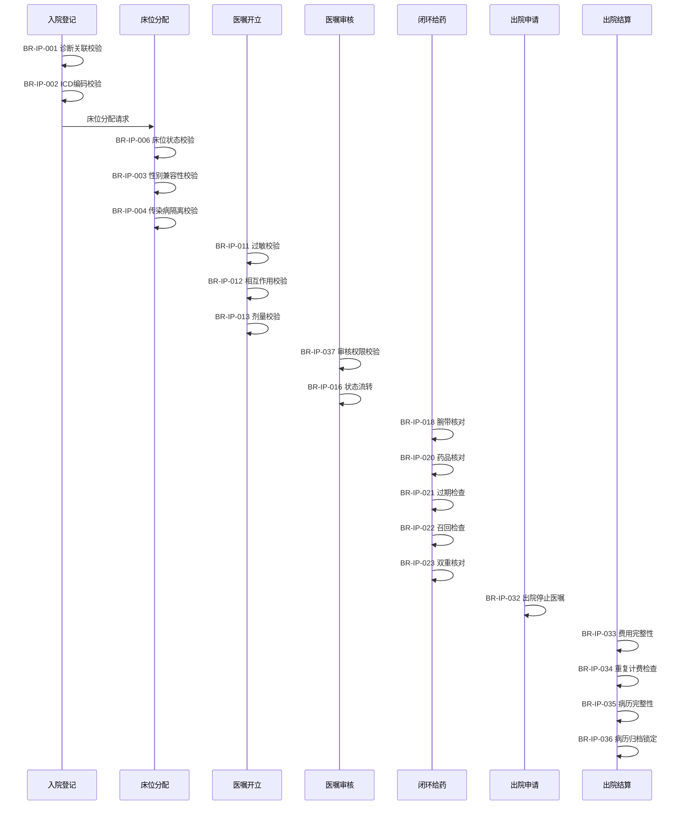

# M02 住院管理子系统 - 业务规则文档

> **文档编号**: YUDAO-HIS-BR-M02
> **版本**: V1.0
> **创建日期**: 2026-06-16
> **所属系统**: YUDAO-AI-HIS智慧医疗信息系统
> **参考文档**: YUDAO-HIS-PRD-M02, YUDAO-HIS-US-M02, YUDAO-HIS-AC-M02

---

## 1. 文档概述

### 1.1 规则分类说明

| 规则类型 | 说明 | 示例 |
|----------|------|------|
| 校验规则 | 数据合法性检查、格式校验 | 身份证格式校验、剂量范围校验 |
| 约束规则 | 业务条件限制、前置条件 | 床位性别兼容性、传染病隔离约束 |
| 计算规则 | 自动计算逻辑、公式推导 | 预交金余额计算、Braden评分计算 |
| 状态规则 | 状态流转条件、状态约束 | 医嘱状态流转、床位状态变更 |
| 权限规则 | 操作权限控制、角色授权 | 医嘱审核权限、结算撤销权限 |
| 时间规则 | 时限要求、超时处理 | 入院评估时限、医嘱审核时限 |
| 关联规则 | 数据关联约束、引用完整性 | 入院关联诊断、医嘱关联患者 |

### 1.2 规则优先级定义

| 优先级 | 级别 | 说明 | 处理方式 |
|--------|------|------|----------|
| P1 | 强制阻断 | 必须满足，否则禁止操作 | 系统强制阻止，不可绕过 |
| P2 | 强制确认 | 必须满足，但可确认后继续 | 弹出警告，需二次确认 |
| P3 | 警告提示 | 建议满足，可忽略 | 显示警告，允许继续 |
| P4 | 建议提示 | 最佳实践建议 | 仅提示，不阻止 |

---

## 2. 入院管理业务规则

### 2.1 入院关联诊断规则

#### BR-IP-001 入院诊断关联校验

| 属性 | 内容 |
|------|------|
| 规则编号 | BR-IP-001 |
| 规则名称 | 入院诊断关联校验 |
| 规则类型 | 关联规则 |
| 适用对象 | 入院登记 |
| 规则描述 | 入院登记时必须关联有效的门诊诊断信息，如无门诊诊断需手动录入入院诊断 |
| 触发时机 | 入院登记提交时 |
| 校验逻辑 | ```pseudo<br>IF outpatient_visit_id EXISTS THEN<br>    IF outpatient_diagnosis EXISTS AND diagnosis_status = '有效' THEN<br>        RETURN '关联成功'<br>    ELSE<br>        RETURN '门诊诊断无效，请手动录入入院诊断'<br>    END IF<br>ELSE<br>    RETURN '未找到门诊就诊记录，请手动录入入院诊断'<br>END IF<br>``` |
| 失败处理 | 允许手动录入入院诊断，记录诊断来源为"手动录入" |
| 优先级 | P3 |

#### BR-IP-002 入院诊断ICD编码校验

| 属性 | 内容 |
|------|------|
| 规则编号 | BR-IP-002 |
| 规则名称 | 入院诊断ICD编码校验 |
| 规则类型 | 校验规则 |
| 适用对象 | 入院诊断录入 |
| 规则描述 | 入院诊断必须关联有效的ICD-10编码，编码需在系统编码表中存在且状态为启用 |
| 触发时机 | 入院诊断录入提交时 |
| 校验逻辑 | ```pseudo<br>IF diagnosis_code IS NOT NULL THEN<br>    IF icd10_code_table.contains(diagnosis_code) AND code_status = '启用' THEN<br>        RETURN '编码有效'<br>    ELSE<br>        RETURN 'ICD编码无效或已停用'<br>    END IF<br>ELSE<br>    RETURN '请选择诊断编码'<br>END IF<br>``` |
| 失败处理 | 阻止提交，提示用户选择有效的诊断编码 |
| 优先级 | P1 |

---

### 2.2 床位兼容性校验规则

#### BR-IP-003 床位性别兼容性校验

| 属性 | 内容 |
|------|------|
| 规则编号 | BR-IP-003 |
| 规则名称 | 床位性别兼容性校验 |
| 规则类型 | 约束规则 |
| 适用对象 | 床位分配 |
| 规则描述 | 患者性别与病房性别限制必须兼容，男性患者不能分配到女性病房，女性患者不能分配到男性病房 |
| 触发时机 | 床位分配确认时 |
| 校验逻辑 | ```pseudo<br>IF ward.gender_restriction = '无限制' THEN<br>    RETURN '兼容'<br>ELSE IF ward.gender_restriction = '女性' AND patient.gender = '女' THEN<br>    RETURN '兼容'<br>ELSE IF ward.gender_restriction = '男性' AND patient.gender = '男' THEN<br>    RETURN '兼容'<br>ELSE<br>    RETURN '床位性别不兼容'<br>END IF<br>``` |
| 失败处理 | 阻止床位分配，提示用户选择兼容的床位，推荐同性别病房可用床位 |
| 优先级 | P1 |

#### BR-IP-004 传染病隔离床位校验

| 属性 | 内容 |
|------|------|
| 规则编号 | BR-IP-004 |
| 规则名称 | 传染病隔离床位校验 |
| 规则类型 | 约束规则 |
| 适用对象 | 床位分配 |
| 规则描述 | 传染病患者必须分配到隔离病区床位，普通病区床位不可分配给传染病患者 |
| 触发时机 | 床位分配确认时 |
| 校验逻辑 | ```pseudo<br>IF patient.diagnosis_code IN infectious_disease_codes THEN<br>    IF ward.isolation_area = true THEN<br>        RETURN '隔离床位合规'<br>    ELSE<br>        RETURN '传染病患者需分配隔离病区床位'<br>    END IF<br>ELSE<br>    RETURN '非传染病患者，床位无隔离要求'<br>END IF<br>``` |
| 失败处理 | 阻止床位分配，提示用户选择隔离病区床位，推荐隔离病区可用床位 |
| 优先级 | P1 |

#### BR-IP-005 儿童床位分配建议

| 属性 | 内容 |
|------|------|
| 规则编号 | BR-IP-005 |
| 规则名称 | 儿童床位分配建议 |
| 规则类型 | 约束规则 |
| 适用对象 | 床位分配 |
| 规则描述 | 年龄小于14岁的患者建议分配到儿科病房，如选择成人病房需二次确认 |
| 触发时机 | 床位分配确认时 |
| 校验逻辑 | ```pseudo<br>IF patient.age < 14 THEN<br>    IF ward.department_type = '儿科' THEN<br>        RETURN '儿科床位合规'<br>    ELSE<br>        RETURN '儿童患者建议分配儿科病房'<br>    END IF<br>ELSE<br>    RETURN '成人患者，床位无年龄限制'<br>END IF<br>``` |
| 失败处理 | 提示建议信息，允许用户确认后继续分配 |
| 优先级 | P2 |

#### BR-IP-006 床位状态可用性校验

| 属性 | 内容 |
|------|------|
| 规则编号 | BR-IP-006 |
| 规则名称 | 床位状态可用性校验 |
| 规则类型 | 状态规则 |
| 适用对象 | 床位分配 |
| 规则描述 | 只有状态为"空床"的床位才能分配给患者，其他状态的床位不可分配 |
| 触发时机 | 床位分配选择时 |
| 校验逻辑 | ```pseudo<br>IF bed.status = '空床' THEN<br>    RETURN '床位可分配'<br>ELSE IF bed.status = '占用' THEN<br>    RETURN '床位已占用'<br>ELSE IF bed.status = '清洁' THEN<br>    RETURN '床位正在清洁'<br>ELSE IF bed.status = '维修' THEN<br>    RETURN '床位正在维修'<br>END IF<br>``` |
| 失败处理 | 阻止床位分配，提示用户选择其他可用床位 |
| 优先级 | P1 |

#### BR-IP-007 危重患者床位推荐

| 属性 | 内容 |
|------|------|
| 规则编号 | BR-IP-007 |
| 规则名称 | 危重患者床位推荐 |
| 规则类型 | 约束规则 |
| 适用对象 | 床位分配 |
| 规则描述 | 入院情况为"危"的患者建议分配ICU床位，如选择普通病房需二次确认 |
| 触发时机 | 床位分配确认时 |
| 校验逻辑 | ```pseudo<br>IF patient.admission_condition = '危' THEN<br>    IF bed.bed_type = 'ICU' THEN<br>        RETURN 'ICU床位合规'<br>    ELSE<br>        RETURN '危重患者建议入住ICU'<br>    END IF<br>ELSE<br>    RETURN '非危重患者，床位无特殊要求'<br>END IF<br>``` |
| 失败处理 | 提示建议信息，允许用户确认后继续分配 |
| 优先级 | P2 |

---

### 2.3 预交金预警规则

#### BR-IP-008 预交金最低限额校验

| 属性 | 内容 |
|------|------|
| 规则编号 | BR-IP-008 |
| 规则名称 | 预交金最低限额校验 |
| 规则类型 | 约束规则 |
| 适用对象 | 预交金缴纳 |
| 规则描述 | 预交金金额不得低于科室设定的最低限额，低于限额时需提示用户 |
| 触发时机 | 预交金缴纳提交时 |
| 校验逻辑 | ```pseudo<br>min_deposit = department.get_min_deposit_amount()<br>IF input_amount < min_deposit THEN<br>    RETURN '预交金低于最低限额 ' + min_deposit + ' 元'<br>ELSE<br>    RETURN '预交金金额合规'<br>END IF<br>``` |
| 失败处理 | 提示最低限额信息，允许继续缴纳但标记为不足 |
| 优先级 | P3 |

#### BR-IP-009 预交金余额不足预警

| 属性 | 内容 |
|------|------|
| 规则编号 | BR-IP-009 |
| 规则名称 | 预交金余额不足预警 |
| 规则类型 | 计算规则 |
| 适用对象 | 预交金管理 |
| 规则描述 | 当预交金余额使用率超过阈值时，自动发送预警通知 |
| 触发时机 | 定时任务检查（每小时） |
| 校验逻辑 | ```pseudo<br>threshold = system_config.get_deposit_warning_threshold() // 默认80%<br>FOR each patient IN hospitalized_patients:<br>    balance = patient.get_deposit_balance()<br>    used_amount = patient.get_used_amount()<br>    usage_rate = used_amount / (balance + used_amount)<br>    IF usage_rate >= threshold THEN<br>        SEND warning_notification TO nurse_station<br>        LOG warning_event<br>    END IF<br>END FOR<br>``` |
| 失败处理 | 发送预警通知至护士站，通知工作人员催缴 |
| 优先级 | P3 |

#### BR-IP-010 预交金余额计算

| 属性 | 内容 |
|------|------|
| 规则编号 | BR-IP-010 |
| 规则名称 | 预交金余额计算 |
| 规则类型 | 计算规则 |
| 适用对象 | 预交金管理 |
| 规则描述 | 预交金余额 = 预交金总额 - 已使用金额 - 已退款金额 |
| 触发时机 | 查询预交金余额时 |
| 校验逻辑 | ```pseudo<br>total_deposit = SUM(deposit_records WHERE patient_id = current_patient)<br>used_amount = SUM(expense_records WHERE patient_id = current_patient)<br>refund_amount = SUM(refund_records WHERE patient_id = current_patient)<br>balance = total_deposit - used_amount - refund_amount<br>RETURN balance<br>``` |
| 失败处理 | 无（计算规则） |
| 优先级 | P4 |

---

## 3. 医嘱管理业务规则

### 3.1 医嘱CDS校验规则

#### BR-IP-011 药物过敏校验

| 属性 | 内容 |
|------|------|
| 规则编号 | BR-IP-011 |
| 规则名称 | 药物过敏校验 |
| 规则类型 | 校验规则 |
| 适用对象 | 药品医嘱开立 |
| 规则描述 | 开立药品医嘱时必须校验患者过敏史，如药品在患者过敏列表中，必须弹出警告并需二次确认 |
| 触发时机 | 药品医嘱提交时 |
| 校验逻辑 | ```pseudo<br>patient_allergies = patient.get_allergy_list()<br>drug_class = drug.get_drug_class()<br>FOR each allergy IN patient_allergies:<br>    IF allergy.substance_class = drug_class OR allergy.substance_name = drug.name THEN<br>        RETURN '警告：患者' + allergy.substance_name + '过敏，反应类型：' + allergy.reaction_type<br>    END IF<br>END FOR<br>RETURN '无过敏风险'<br>``` |
| 失败处理 | 弹出过敏警告对话框，显示过敏反应类型，医生必须强制确认才能继续提交 |
| 优先级 | P1 |

#### BR-IP-012 药物相互作用校验

| 属性 | 内容 |
|------|------|
| 规则编号 | BR-IP-012 |
| 规则名称 | 药物相互作用校验 |
| 规则类型 | 校验规则 |
| 适用对象 | 药品医嘱开立 |
| 规则描述 | 开立药品医嘱时必须校验与患者当前用药的相互作用，存在严重相互作用时必须警告 |
| 触发时机 | 药品医嘱提交时 |
| 校验逻辑 | ```pseudo<br>current_drugs = patient.get_current_medication_list()<br>new_drug = order.get_drug()<br>FOR each current_drug IN current_drugs:<br>    interaction = drug_interaction_db.query(current_drug.id, new_drug.id)<br>    IF interaction EXISTS THEN<br>        IF interaction.level = '严重' THEN<br>            RETURN '警告：' + current_drug.name + '与' + new_drug.name + '存在严重相互作用，风险：' + interaction.risk_description<br>        ELSE IF interaction.level = '中等' THEN<br>            RETURN '提示：' + current_drug.name + '与' + new_drug.name + '存在相互作用，需注意'<br>        END IF<br>    END IF<br>END FOR<br>RETURN '无相互作用风险'<br>``` |
| 失败处理 | 弹出相互作用警告，显示相互作用级别和风险描述，建议替代药品，医生需确认风险后才能提交 |
| 优先级 | P1 |

#### BR-IP-013 药物剂量合理性校验

| 属性 | 内容 |
|------|------|
| 规则编号 | BR-IP-013 |
| 规则名称 | 药物剂量合理性校验 |
| 规则类型 | 校验规则 |
| 适用对象 | 药品医嘱开立 |
| 规则描述 | 开立药品医嘱时必须校验剂量是否在常规剂量范围内，超出范围需警告 |
| 触发时机 | 药品医嘱提交时 |
| 校验逻辑 | ```pseudo<br>drug_dosage_range = drug.get_dosage_range(patient.age, patient.weight)<br>input_dosage = order.get_dosage()<br>IF input_dosage < drug_dosage_range.min THEN<br>    RETURN '警告：剂量低于常规范围，常规范围：' + drug_dosage_range.min + '-' + drug_dosage_range.max<br>ELSE IF input_dosage > drug_dosage_range.max THEN<br>    RETURN '警告：剂量超出常规范围，常规范围：' + drug_dosage_range.min + '-' + drug_dosage_range.max<br>ELSE<br>    RETURN '剂量合理'<br>END IF<br>``` |
| 失败处理 | 显示常规剂量范围，医生需确认或调整剂量后才能提交 |
| 优先级 | P2 |

---

### 3.2 长期医嘱停止时间规则

#### BR-IP-014 长期医嘱自动停止时间计算

| 属性 | 内容 |
|------|------|
| 规则编号 | BR-IP-014 |
| 规则名称 | 长期医嘱自动停止时间计算 |
| 规则类型 | 计算规则 |
| 适用对象 | 长期医嘱开立 |
| 规则描述 | 长期医嘱的预期停止时间 = 开始时间 + 疗程天数 |
| 触发时机 | 长期医嘱审核通过时 |
| 校验逻辑 | ```pseudo<br>IF order.category = '长期医嘱' AND order.duration IS NOT NULL THEN<br>    start_time = order.get_start_time()<br>    duration_days = order.get_duration()<br>    expected_stop_time = start_time + duration_days * 24 * 60 * 60 // 秒<br>    order.set_expected_stop_time(expected_stop_time)<br>    RETURN '停止时间已计算：' + expected_stop_time<br>END IF<br>``` |
| 失败处理 | 无（计算规则） |
| 优先级 | P4 |

#### BR-IP-015 长期医嘱超期提醒

| 属性 | 内容 |
|------|------|
| 规则编号 | BR-IP-015 |
| 规则名称 | 长期医嘱超期提醒 |
| 规则类型 | 时间规则 |
| 适用对象 | 长期医嘱管理 |
| 规则描述 | 长期医嘱疗程即将结束时（剩余天数≤1天），自动发送提醒通知医生 |
| 触发时机 | 定时任务检查（每日） |
| 校验逻辑 | ```pseudo<br>FOR each order IN active_long_orders:<br>    IF order.expected_stop_time EXISTS THEN<br>        remaining_days = (order.expected_stop_time - current_time) / (24 * 60 * 60)<br>        IF remaining_days <= 1 AND order.status = '执行中' THEN<br>            SEND notification TO order.prescribing_doctor<br>            notification.content = '医嘱' + order.content + '即将结束，请确认是否续开'<br>        END IF<br>    END IF<br>END FOR<br>``` |
| 失败处理 | 发送提醒通知至开立医生 |
| 优先级 | P3 |

---

### 3.3 医嘱状态流转规则

#### BR-IP-016 医嘱状态流转规则

| 属性 | 内容 |
|------|------|
| 规则编号 | BR-IP-016 |
| 规则名称 | 医嘱状态流转规则 |
| 规则类型 | 状态规则 |
| 适用对象 | 医嘱管理 |
| 规则描述 | 医嘱状态必须按照规定的流转路径进行变更，不可跳过或逆向流转 |
| 触发时机 | 医嘱状态变更时 |
| 校验逻辑 | ```pseudo<br>状态流转矩阵：<br>TRANSITION_MATRIX = {<br>    '开立': ['审核', '已作废', '退回修改'],<br>    '审核': ['执行中', '退回修改'],<br>    '执行中': ['已完成', '已停止'],<br>    '退回修改': ['开立'],<br>    '已完成': [], // 终态<br>    '已停止': [], // 终态<br>    '已作废': []  // 终态<br>}<br><br>IF target_status IN TRANSITION_MATRIX[current_status] THEN<br>    RETURN '状态流转合法'<br>ELSE<br>    RETURN '状态流转非法，当前状态：' + current_status + '不可流转至：' + target_status<br>END IF<br>``` |
| 失败处理 | 阻止状态变更，提示用户当前状态不可流转至目标状态 |
| 优先级 | P1 |

#### BR-IP-017 已执行医嘱禁止作废

| 属性 | 内容 |
|------|------|
| 规则编号 | BR-IP-017 |
| 规则名称 | 已执行医嘱禁止作废 |
| 规则类型 | 状态规则 |
| 适用对象 | 医嘱作废 |
| 规则描述 | 状态为"执行中"或"已完成"的医嘱不可作废，必须先停止后才能作废或直接停止 |
| 触发时机 | 医嘱作废操作时 |
| 校验逻辑 | ```pseudo<br>IF order.status IN ['执行中', '已完成', '已停止'] THEN<br>    RETURN '已执行医嘱不可作废，请先停止医嘱'<br>ELSE IF order.status IN ['开立', '审核'] THEN<br>    RETURN '医嘱可作废'<br>END IF<br>``` |
| 失败处理 | 阻止作废操作，提示用户已执行医嘱不可作废，建议先停止医嘱 |
| 优先级 | P1 |

---

## 4. 闭环给药业务规则

### 4.1 腕带核对规则

#### BR-IP-018 腕带患者身份核对

| 属性 | 内容 |
|------|------|
| 规则编号 | BR-IP-018 |
| 规则名称 | 腕带患者身份核对 |
| 规则类型 | 校验规则 |
| 适用对象 | 闭环给药 |
| 规则描述 | 给药前必须扫描患者腕带核对身份，腕带信息必须与医嘱患者信息完全匹配 |
| 触发时机 | 给药执行开始时 |
| 校验逻辑 | ```pseudo<br>wristband_info = scan_wristband_barcode()<br>order_patient = order.get_patient()<br>IF wristband_info.patient_id = order_patient.id THEN<br>    IF wristband_info.bed_no = order_patient.bed_no THEN<br>        RETURN '患者身份匹配成功'<br>    ELSE<br>        RETURN '床位不匹配，腕带床位：' + wristband_info.bed_no + '，医嘱床位：' + order_patient.bed_no<br>    END IF<br>ELSE<br>    RETURN '患者不匹配，腕带患者：' + wristband_info.patient_name + '，医嘱患者：' + order_patient.name<br>END IF<br>``` |
| 失败处理 | 阻止继续给药，发出声音警报，记录核对失败日志，要求护士核实患者身份 |
| 优先级 | P1 |

#### BR-IP-019 腕带扫描超时处理

| 属性 | 内容 |
|------|------|
| 规则编号 | BR-IP-019 |
| 规则名称 | 腕带扫描超时处理 |
| 规则类型 | 时间规则 |
| 适用对象 | 闭环给药 |
| 规则描述 | 腕带扫描超过30秒无响应时，系统自动重置扫描状态 |
| 触发时机 | 腕带扫描等待时 |
| 校验逻辑 | ```pseudo<br>scan_start_time = get_current_time()<br>WHILE waiting_for_scan:<br>    IF get_current_time() - scan_start_time > 30 THEN<br>        RETURN '扫描超时，请重试'<br>        RESET scan_state<br>        LOG timeout_event<br>    END IF<br>END WHILE<br>``` |
| 失败处理 | 提示扫描超时，重置扫描状态，记录超时日志 |
| 优先级 | P3 |

---

### 4.2 药品条码核对规则

#### BR-IP-020 药品条码核对

| 属性 | 内容 |
|------|------|
| 规则编号 | BR-IP-020 |
| 规则名称 | 药品条码核对 |
| 规则类型 | 校验规则 |
| 适用对象 | 闭环给药 |
| 规则描述 | 给药前必须扫描药品条码核对药品信息，药品信息必须与医嘱药品信息完全匹配 |
| 触发时机 | 腕带核对成功后 |
| 校验逻辑 | ```pseudo<br>drug_barcode_info = scan_drug_barcode()<br>order_drug = order.get_drug()<br>IF drug_barcode_info.drug_id = order_drug.id THEN<br>    IF drug_barcode_info.dosage = order_drug.dosage THEN<br>        RETURN '药品匹配成功'<br>    ELSE<br>        RETURN '药品规格不完全匹配，需确认'<br>    END IF<br>ELSE<br>    RETURN '药品不匹配，扫描药品：' + drug_barcode_info.drug_name + '，医嘱药品：' + order_drug.name<br>END IF<br>``` |
| 失败处理 | 阻止给药，发出严重警告，显示药品对比信息，记录核对失败日志，建议联系药房核实 |
| 优先级 | P1 |

#### BR-IP-021 药品过期检查

| 属性 | 内容 |
|------|------|
| 规则编号 | BR-IP-021 |
| 规则名称 | 药品过期检查 |
| 规则类型 | 校验规则 |
| 适用对象 | 闭环给药 |
| 规则描述 | 扫描药品时必须检查药品有效期，过期药品禁止使用 |
| 触发时机 | 药品条码扫描时 |
| 校验逻辑 | ```pseudo<br>drug_info = scan_drug_barcode()<br>current_date = get_current_date()<br>IF drug_info.expiry_date < current_date THEN<br>    RETURN '药品已过期，过期日期：' + drug_info.expiry_date<br>ELSE IF drug_info.expiry_date - current_date <= 30 THEN<br>    RETURN '药品即将过期，有效期：' + drug_info.expiry_date<br>ELSE<br>    RETURN '药品有效期正常'<br>END IF<br>``` |
| 失败处理 | 过期药品：阻止使用，记录过期药品拦截日志，建议联系药房更换<br>即将过期：提示警告，允许继续但需确认 |
| 优先级 | P1 |

#### BR-IP-022 药品召回检查

| 属性 | 内容 |
|------|------|
| 规则编号 | BR-IP-022 |
| 规则名称 | 药品召回检查 |
| 规则类型 | 校验规则 |
| 适用对象 | 闭环给药 |
| 规则描述 | 扫描药品时必须检查药品批号是否在召回列表中，召回药品禁止使用 |
| 触发时机 | 药品条码扫描时 |
| 校验逻辑 | ```pseudo<br>drug_info = scan_drug_barcode()<br>recall_list = drug_recall_db.query(drug_info.batch_no)<br>IF recall_list EXISTS THEN<br>    RETURN '该批次药品已被召回，禁止使用，召回原因：' + recall_list.reason<br>ELSE<br>    RETURN '药品批号正常'<br>END IF<br>``` |
| 失败处理 | 阻止给药，显示召回原因，记录召回药品拦截日志，建议联系药房更换 |
| 优先级 | P1 |

---

### 4.3 双重核对规则

#### BR-IP-023 双重核对完整性校验

| 属性 | 内容 |
|------|------|
| 规则编号 | BR-IP-023 |
| 规则名称 | 双重核对完整性校验 |
| 规则类型 | 校验规则 |
| 适用对象 | 闭环给药 |
| 规则描述 | 给药确认前必须完成腕带扫描和药品条码扫描双重核对，两者必须都匹配成功 |
| 触发时机 | 给药确认时 |
| 校验逻辑 | ```pseudo<br>IF wristband_scan_result = '匹配成功' AND drug_scan_result = '匹配成功' THEN<br>    RETURN '双重核对通过，可以给药'<br>ELSE IF wristband_scan_result IS NULL OR drug_scan_result IS NULL THEN<br>    RETURN '请完成腕带和药品双重核对'<br>ELSE<br>    RETURN '双重核对未通过，腕带结果：' + wristband_scan_result + '，药品结果：' + drug_scan_result<br>END IF<br>``` |
| 失败处理 | 阻止给药确认，提示完成双重核对，显示核对完成状态 |
| 优先级 | P1 |

#### BR-IP-024 双重核对超时校验

| 属性 | 内容 |
|------|------|
| 规则编号 | BR-IP-024 |
| 规则名称 | 双重核对超时校验 |
| 规则类型 | 时间规则 |
| 适用对象 | 闭环给药 |
| 规则描述 | 腕带扫描完成后，药品扫描超过5分钟未完成时，核对状态自动重置 |
| 触发时机 | 药品扫描等待时 |
| 校验逻辑 | ```pseudo<br>wristband_scan_time = get_wristband_scan_time()<br>IF get_current_time() - wristband_scan_time > 5 * 60 THEN<br>    RETURN '核对已超时，请重新开始'<br>    RESET all_scan_state<br>ELSE<br>    RETURN '核对时间正常'<br>END IF<br>``` |
| 失败处理 | 提示核对超时，重置核对状态，要求重新扫描腕带 |
| 优先级 | P2 |

---

## 5. 护理管理业务规则

### 5.1 入院评估时限规则

#### BR-IP-025 入院护理评估时限

| 属性 | 内容 |
|------|------|
| 规则编号 | BR-IP-025 |
| 规则名称 | 入院护理评估时限 |
| 规则类型 | 时间规则 |
| 适用对象 | 入院护理评估 |
| 规则描述 | 患者入科确认后必须在24小时内完成入院护理评估（跌倒、压疮风险评估） |
| 触发时机 | 定时任务检查（每小时） |
| 校验逻辑 | ```pseudo<br>FOR each patient IN recently_admitted_patients:<br>    admission_confirm_time = patient.get_ward_confirm_time()<br>    IF admission_confirm_time IS NOT NULL THEN<br>        elapsed_hours = (get_current_time() - admission_confirm_time) / (60 * 60)<br>        IF elapsed_hours > 24 AND patient.nursing_assessment_completed = false THEN<br>            RETURN '入院护理评估超时，患者：' + patient.name<br>        END IF<br>    END IF<br>END FOR<br>``` |
| 失败处理 | 发送评估超时提醒至护士站，上报护士长 |
| 优先级 | P2 |

#### BR-IP-026 跌倒风险定期复评

| 属性 | 内容 |
|------|------|
| 规则编号 | BR-IP-026 |
| 规则名称 | 跌倒风险定期复评 |
| 规则类型 | 时间规则 |
| 适用对象 | 跌倒风险评估 |
| 规则描述 | 跌倒风险评估结果超过7天后必须进行复评 |
| 触发时机 | 定时任务检查（每日） |
| 校验逻辑 | ```pseudo<br>FOR each patient IN hospitalized_patients:<br>    last_assessment_time = patient.get_last_fall_assessment_time()<br>    IF last_assessment_time IS NOT NULL THEN<br>        elapsed_days = (get_current_time() - last_assessment_time) / (24 * 60 * 60)<br>        IF elapsed_days > 7 THEN<br>            RETURN '跌倒风险评估超过复评周期，患者：' + patient.name<br>        END IF<br>    END IF<br>END FOR<br>``` |
| 失败处理 | 发送复评提醒至责任护士 |
| 优先级 | P3 |

---

### 5.2 生命体征异常通知规则

#### BR-IP-027 体温异常预警

| 属性 | 内容 |
|------|------|
| 规则编号 | BR-IP-027 |
| 规则名称 | 体温异常预警 |
| 规则类型 | 校验规则 |
| 适用对象 | 生命体征录入 |
| 规则描述 | 体温超过38.5℃或低于36℃时，系统自动发送预警通知 |
| 触发时机 | 体温数据录入时 |
| 校验逻辑 | ```pseudo<br>temperature = input_temperature<br>IF temperature > 38.5 THEN<br>    RETURN '体温异常偏高：' + temperature + '℃'<br>ELSE IF temperature < 36 THEN<br>    RETURN '体温异常偏低：' + temperature + '℃'<br>ELSE<br>    RETURN '体温正常'<br>END IF<br>``` |
| 失败处理 | 发送预警通知至护士站和医生，在体温单上标记异常点 |
| 优先级 | P2 |

#### BR-IP-028 血压异常预警

| 属性 | 内容 |
|------|------|
| 规则编号 | BR-IP-028 |
| 规则名称 | 血压异常预警 |
| 规则类型 | 校验规则 |
| 适用对象 | 生命体征录入 |
| 规则描述 | 收缩压超过180mmHg或低于90mmHg，舒张压超过120mmHg或低于60mmHg时，系统自动发送预警 |
| 触发时机 | 血压数据录入时 |
| 校验逻辑 | ```pseudo<br>systolic = input_systolic_pressure<br>diastolic = input_diastolic_pressure<br>IF systolic > 180 OR systolic < 90 THEN<br>    RETURN '血压异常，收缩压：' + systolic + 'mmHg'<br>ELSE IF diastolic > 120 OR diastolic < 60 THEN<br>    RETURN '血压异常，舒张压：' + diastolic + 'mmHg'<br>ELSE<br>    RETURN '血压正常'<br>END IF<br>``` |
| 失败处理 | 发送预警通知至护士站和医生 |
| 优先级 | P2 |

#### BR-IP-029 心率异常预警

| 属性 | 内容 |
|------|------|
| 规则编号 | BR-IP-029 |
| 规则名称 | 心率异常预警 |
| 规则类型 | 校验规则 |
| 适用对象 | 生命体征录入 |
| 规则描述 | 心率超过120次/分或低于50次/分时，系统自动发送预警通知 |
| 触发时机 | 心率数据录入时 |
| 校验逻辑 | ```pseudo<br>heart_rate = input_heart_rate<br>IF heart_rate > 120 THEN<br>    RETURN '心率异常偏高：' + heart_rate + '次/分'<br>ELSE IF heart_rate < 50 THEN<br>    RETURN '心率异常偏低：' + heart_rate + '次/分'<br>ELSE<br>    RETURN '心率正常'<br>END IF<br>``` |
| 失败处理 | 发送预警通知至护士站和医生 |
| 优先级 | P2 |

---

### 5.3 护理评估计算规则

#### BR-IP-030 Morse跌倒风险评分计算

| 属性 | 内容 |
|------|------|
| 规则编号 | BR-IP-030 |
| 规则名称 | Morse跌倒风险评分计算 |
| 规则类型 | 计算规则 |
| 适用对象 | 跌倒风险评估 |
| 规则描述 | Morse跌倒评估量表总分 = 各项评分之和，根据总分判断风险等级 |
| 触发时机 | 跌倒评估表提交时 |
| 校验逻辑 | ```pseudo<br>// Morse跌倒评估量表评分规则<br>score_history_of_falling = IF has_falling_history THEN 25 ELSE 0<br>score_secondary_diagnosis = IF has_secondary_diagnosis THEN 15 ELSE 0<br>score_ambulatory Aid = CASE walking Aid:<br>    '无' => 0,<br>    '拐杖/助行器' => 15,<br>    '轮椅' => 30<br>END CASE<br>score_iv_heparin = IF has_iv_heparin THEN 20 ELSE 0<br>score_gait = CASE gait_type:<br>    '正常' => 0,<br>    '虚弱' => 10,<br>    '受损' => 20<br>END CASE<br>score_mental_status = CASE mental_status:<br>    '清醒' => 0,<br>    '对自己的能力估过高' => 15<br>END CASE<br><br>total_score = score_history_of_falling + score_secondary_diagnosis + score_ambulatory_Aid + score_iv_heparin + score_gait + score_mental_status<br><br>risk_level = IF total_score >= 45 THEN '高风险' ELSE IF total_score >= 25 THEN '中等风险' ELSE '低风险'<br>RETURN total_score, risk_level<br>``` |
| 失败处理 | 无（计算规则） |
| 优先级 | P4 |

#### BR-IP-031 Braden压疮风险评分计算

| 属性 | 内容 |
|------|------|
| 规则编号 | BR-IP-031 |
| 规则名称 | Braden压疮风险评分计算 |
| 规则类型 | 计算规则 |
| 适用对象 | 压疮风险评估 |
| 规则描述 | Braden压疮评估量表总分 = 各项评分之和（感知能力+潮湿程度+活动能力+移动能力+营养状况+摩擦和剪切），根据总分判断风险等级 |
| 触发时机 | 压疮评估表提交时 |
| 校验逻辑 | ```pseudo<br>// Braden压疮评估量表评分规则（每项1-4分）<br>score_perception = CASE perception_level:<br>    '完全丧失' => 1,<br>    '严重丧失' => 2,<br>    '轻度丧失' => 3,<br>    '未受损' => 4<br>END CASE<br><br>score_moisture = CASE moisture_level:<br>    '持久潮湿' => 1,<br>    '经常潮湿' => 2,<br>    '偶尔潮湿' => 3,<br>    '很少潮湿' => 4<br>END CASE<br><br>score_activity = CASE activity_level:<br>    '卧床' => 1,<br>    '轮椅' => 2,<br>    '偶尔行走' => 3,<br>    '经常行走' => 4<br>END CASE<br><br>score_mobility = CASE mobility_level:<br>    '完全受限' => 1,<br>    '严重受限' => 2,<br>    '轻度受限' => 3,<br>    '不受限' => 4<br>END CASE<br><br>score_nutrition = CASE nutrition_level:<br>    '非常差' => 1,<br>    '可能不足' => 2,<br>    '适当' => 3,<br>    '良好' => 4<br>END CASE<br><br>score_friction_shear = CASE friction_level:<br>    '有问题' => 1,<br>    '潜在问题' => 2,<br>    '无明显问题' => 3<br>END CASE<br><br>total_score = score_perception + score_moisture + score_activity + score_mobility + score_nutrition + score_friction_shear<br><br>risk_level = IF total_score <= 12 THEN '高风险' ELSE IF total_score <= 18 THEN '中等风险' ELSE '低风险'<br>RETURN total_score, risk_level<br>``` |
| 失败处理 | 无（计算规则） |
| 优先级 | P4 |

---

## 6. 出院管理业务规则

### 6.1 出院前医嘱停止规则

#### BR-IP-032 出院前自动停止长期医嘱

| 属性 | 内容 |
|------|------|
| 规则编号 | BR-IP-032 |
| 规则名称 | 出院前自动停止长期医嘱 |
| 规则类型 | 状态规则 |
| 适用对象 | 出院申请 |
| 规则描述 | 医生开具出院医嘱时，系统自动停止所有状态为"执行中"的长期医嘱 |
| 触发时机 | 出院医嘱提交时 |
| 校验逻辑 | ```pseudo<br>IF order.type = '出院医嘱' THEN<br>    FOR each active_order IN patient.get_active_long_orders():<br>        IF active_order.status = '执行中' THEN<br>            active_order.set_stop_time(get_current_time())<br>            active_order.set_status('已停止')<br>            LOG order_stop_event<br>            SEND notification TO nurse_station<br>        END IF<br>    END FOR<br>END IF<br>``` |
| 失败处理 | 无（自动处理规则） |
| 优先级 | P4 |

---

### 6.2 费用审核规则

#### BR-IP-033 费用汇总完整性检查

| 属性 | 内容 |
|------|------|
| 规则编号 | BR-IP-033 |
| 规则名称 | 费用汇总完整性检查 |
| 规则类型 | 校验规则 |
| 适用对象 | 出院结算 |
| 规则描述 | 出院结算前必须检查费用完整性，确保所有费用已记账，无遗漏费用项目 |
| 触发时机 | 费用汇总时 |
| 校验逻辑 | ```pseudo<br>// 检查医嘱执行是否都已计费<br>FOR each order IN patient.get_all_orders():<br>    IF order.status IN ['已完成', '已执行'] AND order.billing_status = '未计费' THEN<br>        RETURN '存在未计费项目：' + order.content<br>    END IF<br>END FOR<br><br>// 检查床位费是否完整<br>admission_days = patient.get_admission_days()<br>bed_fee_count = patient.get_bed_fee_count()<br>IF bed_fee_count < admission_days THEN<br>    RETURN '床位费不完整，缺少天数：' + (admission_days - bed_fee_count)<br>END IF<br><br>// 检查护理费是否完整<br>IF patient.nursing_level_fee_count < admission_days THEN<br>    RETURN '护理费不完整'<br>END IF<br><br>RETURN '费用完整'<br>``` |
| 失败处理 | 提示存在未计费项目，阻止结算，要求补充计费 |
| 优先级 | P1 |

#### BR-IP-034 费用重复计费检查

| 属性 | 内容 |
|------|------|
| 规则编号 | BR-IP-034 |
| 规则名称 | 费用重复计费检查 |
| 规则类型 | 校验规则 |
| 适用对象 | 费用汇总 |
| 规则描述 | 费用汇总时必须检查是否存在重复计费项目，发现重复计费需提示用户 |
| 触发时机 | 费用汇总时 |
| 校验逻辑 | ```pseudo<br>expense_records = patient.get_expense_records()<br>FOR each record1 IN expense_records:<br>    FOR each record2 IN expense_records:<br>        IF record1.id != record2.id AND record1.item_code = record2.item_code AND record1.execute_time = record2.execute_time THEN<br>            RETURN '存在重复计费：' + record1.item_name + '，时间：' + record1.execute_time<br>        END IF<br>    END FOR<br>END FOR<br>RETURN '无重复计费'<br>``` |
| 失败处理 | 提示重复计费项目，要求核实并删除重复记录 |
| 优先级 | P1 |

---

### 6.3 病历归档锁定规则

#### BR-IP-035 出院病历完整性校验

| 属性 | 内容 |
|------|------|
| 规则编号 | BR-IP-035 |
| 规则名称 | 出院病历完整性校验 |
| 规则类型 | 校验规则 |
| 适用对象 | 病案归档 |
| 规则描述 | 病案归档前必须检查病历完整性，入院记录、出院记录必须已完成 |
| 触发时机 | 病案归档时 |
| 校验逻辑 | ```pseudo<br>required_records = ['入院记录', '病程记录', '出院记录']<br>FOR each record_type IN required_records:<br>    record = patient.get_medical_record(record_type)<br>    IF record IS NULL OR record.status != '已完成' THEN<br>        RETURN '病历不完整，缺少：' + record_type<br>    END IF<br>END FOR<br><br>// 检查入院记录时限<br>admission_time = patient.get_admission_time()<br>admission_record_time = patient.get_admission_record_time()<br>IF admission_record_time - admission_time > 24 * 60 * 60 THEN<br>    RETURN '入院记录超时完成'<br>END IF<br><br>RETURN '病历完整'<br>``` |
| 失败处理 | 阻止归档，提示缺少的病历类型，要求补充病历 |
| 优先级 | P1 |

#### BR-IP-036 病历归档锁定

| 属性 | 内容 |
|------|------|
| 规则编号 | BR-IP-036 |
| 规则名称 | 病历归档锁定 |
| 规则类型 | 状态规则 |
| 适用对象 | 病案归档 |
| 规则描述 | 病历归档后自动锁定，不可修改，只能通过审批流程解锁修改 |
| 触发时机 | 病案归档完成时 |
| 校验逻辑 | ```pseudo<br>IF patient.medical_records.all_completed() THEN<br>    FOR each record IN patient.medical_records:<br>        record.set_status('已归档')<br>        record.set_locked(true)<br>        record.set_archive_time(get_current_time())<br>    END FOR<br>    patient.set_archive_status('已归档')<br>    RETURN '病历已归档锁定'<br>ELSE<br>    RETURN '病历不完整，无法归档'<br>END IF<br>``` |
| 失败处理 | 阻止归档，提示病历不完整 |
| 优先级 | P1 |

---

## 7. 权限规则

### 7.1 医嘱审核权限规则

#### BR-IP-037 医嘱审核权限校验

| 属性 | 内容 |
|------|------|
| 规则编号 | BR-IP-037 |
| 规则名称 | 医嘱审核权限校验 |
| 规则类型 | 权限规则 |
| 适用对象 | 医嘱审核 |
| 规则描述 | 只有具备医嘱审核权限的护士才能审核医嘱，实习护士无审核权限 |
| 触发时机 | 医嘱审核操作时 |
| 校验逻辑 | ```pseudo<br>nurse_role = current_user.get_role()<br>nurse_permissions = role_permission_db.query(nurse_role.id)<br>IF 'ORDER_AUDIT' IN nurse_permissions THEN<br>    RETURN '有医嘱审核权限'<br>ELSE<br>    RETURN '无医嘱审核权限'<br>END IF<br>``` |
| 失败处理 | 阻止审核操作，提示无医嘱审核权限，记录权限校验失败日志 |
| 优先级 | P1 |

#### BR-IP-038 出院结算撤销权限

| 属性 | 内容 |
|------|------|
| 规则编号 | BR-IP-038 |
| 规则名称 | 出院结算撤销权限 |
| 规则类型 | 权限规则 |
| 适用对象 | 出院结算撤销 |
| 规则描述 | 出院结算撤销需要收费员申请，主管审批通过后才能执行 |
| 触发时机 | 结算撤销申请时 |
| 校验逻辑 | ```pseudo<br>IF current_user.role = '收费员' THEN<br>    IF discharge_time - get_current_time() <= 24 * 60 * 60 THEN // 24小时内<br>        IF supervisor_approval EXISTS AND approval_result = '同意' THEN<br>            RETURN '结算撤销审批通过'<br>        ELSE<br>            RETURN '需要主管审批'<br>        END IF<br>    ELSE<br>        RETURN '超过24小时，不可撤销'<br>    END IF<br>ELSE<br>    RETURN '非收费员角色，无撤销权限'<br>END IF<br>``` |
| 失败处理 | 阻止撤销，提示需要主管审批或已超过撤销时限 |
| 优先级 | P1 |

---

## 8. 规则冲突检测

### 8.1 规则冲突矩阵

| 规则A | 规则B | 冲突类型 | 冲突说明 | 解决方案 |
|-------|-------|----------|----------|----------|
| BR-IP-003 床位性别兼容性 | BR-IP-004 传染病隔离床位 | 条件冲突 | 传染病患者优先分配隔离床位，性别兼容性可适当放宽 | 传染病规则优先级高于性别规则，隔离病区可设置性别为"无限制" |
| BR-IP-011 药物过敏校验 | BR-IP-012 药物相互作用校验 | 执行顺序冲突 | 两个校验同时触发，警告信息可能重叠 | 按顺序执行：先过敏校验，后相互作用校验，合并显示警告 |
| BR-IP-015 长期医嘱超期提醒 | BR-IP-032 出院前停止医嘱 | 时序冲突 | 医嘱超期提醒与出院停止医嘱可能同时触发 | 出院停止医嘱优先，出院流程启动后不再发送超期提醒 |
| BR-IP-018 腕带核对 | BR-IP-020 药品条码核对 | 执行顺序冲突 | 必须先腕带核对后药品核对，不能颠倒顺序 | 强制执行顺序：腕带核对成功后才能进入药品核对 |
| BR-IP-027 体温异常预警 | BR-IP-028 血压异常预警 | 并行冲突 | 同时录入多项生命体征时，多个预警同时触发 | 合并显示所有异常预警，统一发送通知 |

### 8.2 冲突检测伪代码

```pseudo
// 规则冲突检测引擎
FUNCTION detect_conflicts(new_rule):
    FOR each existing_rule IN rule_repository:
        IF check_conflict(existing_rule, new_rule) THEN
            conflict_type = analyze_conflict_type(existing_rule, new_rule)
            IF conflict_type = '严重冲突' THEN
                RETURN '规则冲突：' + existing_rule.name + '与' + new_rule.name + '存在严重冲突'
            ELSE IF conflict_type = '可解决冲突' THEN
                solution = generate_solution(existing_rule, new_rule)
                LOG '规则冲突已记录，建议解决方案：' + solution
            END IF
        END IF
    END FOR
    RETURN '无规则冲突'

FUNCTION check_conflict(rule1, rule2):
    // 检查适用对象是否重叠
    IF rule1.target_object = rule2.target_object THEN
        // 检查触发时机是否重叠
        IF rule1.trigger_time = rule2.trigger_time THEN
            // 检查规则效果是否矛盾
            IF rule1.effect contradicts rule2.effect THEN
                RETURN true
            END IF
        END IF
    END IF
    RETURN false
```

---

## 9. 规则依赖关系图

### 9.1 规则依赖关系矩阵

| 上游规则 | 下游规则 | 依赖类型 | 依赖说明 |
|----------|----------|----------|----------|
| BR-IP-001 入院诊断关联校验 | BR-IP-002 入院诊断ICD编码校验 | 数据依赖 | 入院诊断数据先关联后校验编码 |
| BR-IP-003 床位性别兼容性校验 | BR-IP-006 床位状态可用性校验 | 前置依赖 | 床位状态必须可用后才能校验兼容性 |
| BR-IP-004 传染病隔离床位校验 | BR-IP-003 床位性别兼容性校验 | 优先级依赖 | 传染病校验优先级高于性别兼容性校验 |
| BR-IP-006 床位状态可用性校验 | BR-IP-007 危重患者床位推荐 | 前置依赖 | 床位必须可用后才能进行推荐 |
| BR-IP-011 药物过敏校验 | BR-IP-012 药物相互作用校验 | 顺序依赖 | 过敏校验先执行，相互作用校验后执行 |
| BR-IP-012 药物相互作用校验 | BR-IP-013 药物剂量合理性校验 | 顺序依赖 | 相互作用校验先执行，剂量校验后执行 |
| BR-IP-014 长期医嘱停止时间计算 | BR-IP-015 长期医嘱超期提醒 | 数据依赖 | 停止时间计算后才能执行超期提醒 |
| BR-IP-016 医嘱状态流转规则 | BR-IP-017 已执行医嘱禁止作废 | 包含依赖 | 作废校验是状态流转规则的子规则 |
| BR-IP-018 腕带患者身份核对 | BR-IP-020 药品条码核对 | 前置依赖 | 腕带核对成功后才能执行药品核对 |
| BR-IP-020 药品条码核对 | BR-IP-021 药品过期检查 | 并行依赖 | 药品核对同时检查过期状态 |
| BR-IP-020 药品条码核对 | BR-IP-022 药品召回检查 | 并行依赖 | 药品核对同时检查召回状态 |
| BR-IP-018 腕带核对 + BR-IP-020 药品核对 | BR-IP-023 双重核对完整性校验 | 聚合依赖 | 双重核对校验依赖前两项核对结果 |
| BR-IP-023 双重核对完整性校验 | BR-IP-024 双重核对超时校验 | 补充依赖 | 超时校验是双重核对的补充规则 |
| BR-IP-025 入院护理评估时限 | BR-IP-026 跌倒风险定期复评 | 时间依赖 | 入院评估后才有复评周期 |
| BR-IP-030 Morse跌倒评分计算 | BR-IP-031 Braden压疮评分计算 | 并行依赖 | 两种评估独立并行执行 |
| BR-IP-032 出院前停止长期医嘱 | BR-IP-033 费用汇总完整性检查 | 前置依赖 | 医嘱停止后才能汇总费用 |
| BR-IP-033 费用汇总完整性检查 | BR-IP-034 费用重复计费检查 | 并行依赖 | 费用完整性检查包含重复检查 |
| BR-IP-033 费用完整性检查 | BR-IP-035 出院病历完整性校验 | 前置依赖 | 费用完整后才能检查病历 |
| BR-IP-035 出院病历完整性校验 | BR-IP-036 病历归档锁定 | 前置依赖 | 病历完整后才能归档锁定 |

### 9.2 规则依赖关系图（Mermaid格式）

```mermaid
graph TD
    subgraph 入院管理规则群
        BR001[BR-IP-001 入院诊断关联校验] --> BR002[BR-IP-002 ICD编码校验]
        BR006[BR-IP-006 床位状态可用性校验] --> BR003[BR-IP-003 性别兼容性校验]
        BR006 --> BR004[BR-IP-004 传染病隔离校验]
        BR006 --> BR005[BR-IP-005 儿童床位建议]
        BR006 --> BR007[BR-IP-007 危重患者床位推荐]
        BR004 -.->|优先级高于| BR003
    end

    subgraph 预交金管理规则群
        BR008[BR-IP-008 预交金最低限额] --> BR009[BR-IP-009 预交金不足预警]
        BR010[BR-IP-010 预交金余额计算]
    end

    subgraph 医嘱管理规则群
        BR011[BR-IP-011 药物过敏校验] --> BR012[BR-IP-012 相互作用校验]
        BR012 --> BR013[BR-IP-013 剂量合理性校验]
        BR014[BR-IP-014 停止时间计算] --> BR015[BR-IP-015 超期提醒]
        BR016[BR-IP-016 状态流转规则] --> BR017[BR-IP-017 已执行禁止作废]
        BR037[BR-IP-037 医嘱审核权限]
    end

    subgraph 闭环给药规则群
        BR018[BR-IP-018 腕带核对] --> BR020[BR-IP-020 药品条码核对]
        BR020 --> BR021[BR-IP-021 药品过期检查]
        BR020 --> BR022[BR-IP-022 药品召回检查]
        BR018 --> BR023[BR-IP-023 双重核对完整性]
        BR020 --> BR023
        BR023 --> BR024[BR-IP-024 双重核对超时]
        BR019[BR-IP-019 腕带扫描超时]
    end

    subgraph 护理管理规则群
        BR025[BR-IP-025 入院评估时限] --> BR026[BR-IP-026 跌倒复评提醒]
        BR027[BR-IP-027 体温异常预警]
        BR028[BR-IP-028 血压异常预警]
        BR029[BR-IP-029 心率异常预警]
        BR030[BR-IP-030 Morse跌倒评分]
        BR031[BR-IP-031 Braden压疮评分]
    end

    subgraph 出院管理规则群
        BR032[BR-IP-032 出院停止医嘱] --> BR033[BR-IP-033 费用完整性检查]
        BR033 --> BR034[BR-IP-034 重复计费检查]
        BR033 --> BR035[BR-IP-035 病历完整性校验]
        BR035 --> BR036[BR-IP-036 病历归档锁定]
        BR038[BR-IP-038 结算撤销权限]
    end

    // 跨规则群依赖
    BR015 -.->|出院优先| BR032
```

### 9.3 规则执行顺序图



---

## 10. 规则统计汇总

### 10.1 按规则类型统计

| 规则类型 | 规则数量 | 占比 |
|----------|----------|------|
| 校验规则 | 14 | 37% |
| 约束规则 | 5 | 13% |
| 计算规则 | 5 | 13% |
| 状态规则 | 5 | 13% |
| 权限规则 | 2 | 5% |
| 时间规则 | 5 | 13% |
| 关联规则 | 2 | 5% |
| **合计** | **38** | **100%** |

### 10.2 按优先级统计

| 优先级 | 规则数量 | 占比 |
|--------|----------|------|
| P1 强制阻断 | 16 | 42% |
| P2 强制确认 | 7 | 18% |
| P3 警告提示 | 10 | 26% |
| P4 建议提示 | 5 | 13% |
| **合计** | **38** | **100%** |

### 10.3 按业务模块统计

| 业务模块 | 规则数量 | 占比 |
|----------|----------|------|
| 入院管理 | 10 | 26% |
| 医嘱管理 | 7 | 18% |
| 闭环给药 | 7 | 18% |
| 护理管理 | 7 | 18% |
| 出院管理 | 4 | 11% |
| 权限管理 | 2 | 5% |
| **合计** | **38** | **100%** |

---

## 11. 规则维护说明

### 11.1 规则变更流程

1. **规则新增**: 需经过业务评审、技术评审、测试验证后发布
2. **规则修改**: 需评估影响范围，经过审批后修改，保留历史版本
3. **规则删除**: 需评估依赖关系，确保无下游依赖后才能删除

### 11.2 规则版本管理

| 版本字段 | 说明 |
|----------|------|
| 规则编号 | 固定不变，唯一标识 |
| 规则版本号 | 每次修改递增 |
| 生效日期 | 规则生效的日期 |
| 失效日期 | 规则失效的日期（可选） |
| 变更说明 | 规则变更的内容说明 |

### 11.3 规则配置化建议

以下规则建议支持配置化，便于业务调整：

| 规则编号 | 配置项 | 配置说明 |
|----------|--------|----------|
| BR-IP-008 | 预交金最低限额 | 按科室配置不同限额 |
| BR-IP-009 | 预交金预警阈值 | 全局配置预警阈值百分比 |
| BR-IP-013 | 药物剂量范围 | 按药品配置剂量范围 |
| BR-IP-025 | 入院评估时限 | 全局配置评估时限（小时） |
| BR-IP-026 | 跌倒复评周期 | 全局配置复评周期（天） |
| BR-IP-027/028/029 | 生命体征预警阈值 | 全局配置各项预警阈值 |

---

> **编制**: YUDAO-AI-HIS产品组
> **最后更新**: 2026-06-16