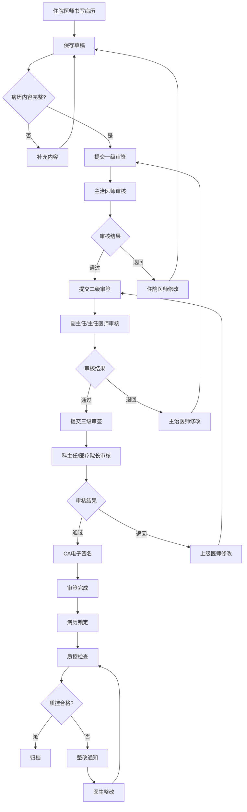

# M03 电子病历子系统 - 产品需求文档(PRD)

> **文档编号**: YUDAO-HIS-PRD-M03
> **版本**: V1.0
> **创建日期**: 2026-06-19
> **所属系统**: YUDAO-AI-HIS智慧医疗信息系统
> **子系统优先级**: P1 (重要功能)
> **参考文档**: YUDAO-HIS-PRD-001, YUDAO-HIS-FML-001, YUDAO-HIS-BPF-001, YUDAO-HIS-DD-001, YUDAO-HIS-MDD-001

---

## 1. 子系统概述

### 1.1 子系统定位

电子病历子系统(EMR)是YUDAO-AI-HIS的核心临床文档管理模块，负责全院病历文书的创建、编辑、审签、质控、归档全生命周期管理。系统支持门诊病历和住院病历，提供结构化录入和自由文本编辑，集成CA电子签名，实现病历三级医师审签和病历质控闭环管理。病历保存期限>=30年，符合国家电子病历应用水平分级评价标准和HIMSS EMRAM要求。

### 1.2 业务目标

| 目标类型 | 目标描述 | 衡量指标 |
|----------|----------|----------|
| 合规目标 | 符合电子病历应用水平分级评价标准 | 达到4级及以上 |
| 安全目标 | 实现病历三级医师审签和CA签名 | 审签覆盖率100% |
| 质控目标 | 实现病历时限质控和完整性质控 | 质控覆盖率100% |
| 效率目标 | 提供病历模板和结构化录入 | 模板使用率>=80% |
| 存储目标 | 病历保存期限>=30年 | 归档完整性100% |

### 1.3 功能范围

```
M03 电子病历
├── M03-01 病历模板管理
│   ├── 模板创建（入院记录、病程记录、出院记录等）
│   ├── 模板分类（按科室、按病种、按文书类型）
│   ├── 模板权限（科室模板、个人模板、全院模板）
│   ├── 模板变量（自动填充患者信息、诊断等）
│   ├── 模板复制与修改
│   └── 模板审核发布
├── M03-02 病历编辑
│   ├── 入院记录编辑
│   ├── 病程记录编辑（首次病程、日常病程、上级查房、交接班记录）
│   ├── 出院记录编辑
│   ├── 知情同意书编辑
│   ├── 结构化录入（所见即所得编辑器）
│   ├── 病历引用（检验结果、影像报告）
│   ├── 病历打印预览
│   └── 病历保存草稿
├── M03-03 病历审签
│   ├── 提交审签
│   ├── 上级医师审核
│   ├── 电子签名（CA认证）
│   ├── 审签退回修改
│   ├── 三级医师审签流程
│   └── 审签历史记录
├── M03-04 病历质控
│   ├── 时限质控（入院24h、首次病程8h、出院48h）
│   ├── 完整性质控（必填项检查）
│   ├── 质控评分（百分制评分）
│   ├── 质控整改通知
│   ├── 质控统计分析
│   └── AI病历质控辅助
├── M03-05 病历归档
│   ├── 归档提交
│   ├── 归档锁定（不可修改）
│   ├── 病案检索（多条件检索）
│   ├── 病历封存（医疗纠纷封存）
│   ├── 病历借阅审批
│   └── 病历打印授权
```

### 1.4 用户角色

| 角色 | 主要职责 | 使用功能 |
|------|----------|----------|
| 临床医生 | 书写病历、提交审签 | 病历编辑、审签提交 |
| 上级医师 | 审核下级医师病历 | 病历审签、退回修改 |
| 质控医师 | 病历质量检查评分 | 病历质控、整改通知 |
| 病案管理员 | 病历归档、借阅管理 | 病历归档、病案检索、借阅审批 |
| 科室管理员 | 病历模板管理 | 模板创建、模板权限配置 |

### 1.5 依赖关系

**上游依赖**:
- M09 系统管理：用户、角色、权限、数据字典（ICD-10诊断编码）
- CA签名服务：电子签名认证

**下游影响**:
- M02 住院管理：病历书写入口、入院记录推送到住院工作站
- M07 手术麻醉：手术记录引用病历
- M13 AI辅助：病历质控AI分析

---

## 2. 功能模块详细设计

### 2.1 M03-01 病历模板管理

#### 2.1.1 功能概述

病历模板管理模块提供病历模板的创建、分类、权限控制、变量配置等功能，支持科室模板、个人模板、全院模板三级管理，提高病历书写效率和质量一致性。

#### 2.1.2 模板分类体系

```
病历模板分类：
├── 按文书类型分类
│   ├── 入院记录类（入院记录、再入院记录）
│   ├── 病程记录类（首次病程记录、日常病程记录、上级医师查房记录、交接班记录、会诊记录）
│   ├── 出院记录类（出院记录、死亡记录、24小时内出入院记录）
│   ├── 知情同意书类（手术知情同意、输血知情同意、特殊治疗知情同意）
│   ├── 专科记录类（产科记录、新生儿记录、精神科记录）
│
├── 按适用范围分类
│   ├── 全院模板（通用模板，所有科室可用）
│   ├── 科室模板（科室专用模板，仅本科室可用）
│   ├── 个人模板（医生自建模板，仅本人可用）
│
└── 按病种分类
    ├── 常见病模板（如高血压、糖尿病、上呼吸道感染）
    ├── 专科病种模板（如心内科冠心病、神经内科脑卒中）
    └── 手术模板（如阑尾切除术、胆囊切除术）
```

#### 2.1.3 页面设计 - 模板管理

```
页面布局：
┌─────────────────────────────────────────────────────────────┐
│ 病历模板管理                                                 │
├─────────────────────────────────────────────────────────────┤
│ 模板筛选                                                     │
│ ┌─────────────────────────────────────────────────────────┐ │
│ │ 适用范围: [全院     ▼]  科室: [内科     ▼]  类型: [入院记录 ▼] │ │
│ │                                                         │ │
│ │ 关键词搜索: [________________] [搜索]                    │ │
│ └─────────────────────────────────────────────────────────┘ │
│                                                              │
│ 模板列表                                                     │
│ ┌────┬────────────┬──────┬──────────┬──────┬────────┬────┐ │
│ │选择│模板名称    │类型  │适用科室  │状态  │创建人  │操作│ │
│ ├────┼────────────┼──────┼──────────┼──────┼────────┼────┤ │
│ │ ☑ │入院记录模板│入院记│内科      │已发布│李主任  │编辑│ │
│ │ ☑ │首次病程模板│病程记│全院      │已发布│系统    │编辑│ │
│ │ ☑ │上感病程模板│病程记│内科      │草稿  │王医生  │发布│ │
│ │    │出院记录模板│出院记│全院      │已发布│系统    │编辑│ │
│ └────┴────────────┴──────┴──────────┴──────┴────────┴────┘ │
│                                                              │
│                              [+新建模板] [批量导入] [导出]   │
└─────────────────────────────────────────────────────────────┘
```

#### 2.1.4 模板变量定义

| 变量类型 | 变量名称 | 自动填充内容 |
|----------|----------|--------------|
| 患者信息变量 | {患者姓名} | 患者姓名 |
| | {性别} | 患者性别 |
| | {年龄} | 患者年龄 |
| | {住院号} | 患者住院号 |
| | {入院日期} | 入院日期 |
| | {出院日期} | 出院日期 |
| 诊断变量 | {主诊断} | 主诊断名称 |
| | {主诊断编码} | 主诊断ICD-10编码 |
| | {次诊断} | 次诊断列表 |
| 医生信息变量 | {主治医师} | 主治医师姓名 |
| | {住院医师} | 住院医师姓名 |
| | {科主任} | 科主任姓名 |
| 时间变量 | {当前日期} | 当前日期 |
| | {当前时间} | 当前时间 |
| | {记录日期} | 记录书写日期 |

#### 2.1.5 字段定义 - 病历模板

| 字段名 | 字段类型 | 必填 | 说明 |
|--------|----------|------|------|
| template_id | BIGINT | 是 | 模板ID（主键） |
| template_code | VARCHAR(30) | 是 | 模板编码 |
| template_name | VARCHAR(100) | 是 | 模板名称 |
| template_type | VARCHAR(50) | 是 | 模板类型（入院记录/病程记录/出院记录等） |
| scope_type | TINYINT | 是 | 适用范围：1全院/2科室/3个人 |
| dept_id | BIGINT | 否 | 适用科室ID（科室模板时必填） |
| doctor_id | BIGINT | 否 | 创建医生ID（个人模板时必填） |
| template_content | TEXT | 是 | 模板内容（HTML/JSON格式） |
| template_variables | JSON | 否 | 模板变量定义 |
| template_status | TINYINT | 是 | 状态：1草稿/2待审核/3已发布/4已停用 |
| audit_user_id | BIGINT | 否 | 审核人ID |
| audit_time | DATETIME | 否 | 审核时间 |
| create_time | DATETIME | 是 | 创建时间 |
| create_by | VARCHAR(50) | 是 | 创建人 |
| update_time | DATETIME | 否 | 更新时间 |

---

### 2.2 M03-02 病历编辑

#### 2.2.1 功能概述

病历编辑模块提供病历文书的编辑功能，支持所见即所得编辑器，实现结构化录入和自由文本编辑，可引用检验结果、影像报告，支持草稿保存和打印预览。

#### 2.2.2 页面设计 - 病历编辑器

```
页面布局：
┌─────────────────────────────────────────────────────────────┐
│ 入院记录编辑                               患者: 张三  男  65岁│
├─────────────────────────────────────────────────────────────┤
│ 工具栏                                                       │
│ ┌─────────────────────────────────────────────────────────┐ │
│ │ [保存草稿] [提交审签] [选择模板] [引用报告] [打印预览]   │ │
│ │ ─────────────────────────────────────────────────────── │ │
│ │ [加粗] [斜体] [下划线] [字体] [字号] [对齐] [列表] [表格]│ │
│ └─────────────────────────────────────────────────────────┘ │
│                                                              │
│ 病历内容编辑区                                               │
│ ┌─────────────────────────────────────────────────────────┐ │
│ │                                                         │ │
│ │    入院记录                                             │ │
│ │                                                         │ │
│ │    患者：张三    性别：男    年龄：65岁                  │ │
│ │    住院号：ZY202606190001                               │ │
│ │    入院日期：2026-06-19                                 │ │
│ │    科室：内科                                           │ │
│ │    主治医师：李主任                                     │ │
│ │                                                         │ │
│ │    主诉：头晕、乏力3天。                                │ │
│ │                                                         │ │
│ │    现病史：患者3天前无明显诱因出现头晕、乏力，           │ │
│ │            无恶心呕吐，无胸闷气促，无发热咳嗽。          │ │
│ │            门诊查血压160/100mmHg，以"高血压"收入院。     │ │
│ │                                                         │ │
│ │    既往史：高血压病史10年，长期服用降压药物；            │ │
│ │            否认糖尿病、冠心病病史；                      │ │
│ │            否认药物过敏史。                              │ │
│ │                                                         │ │
│ │    个人史：生于本地，久居本地，无疫区居住史；            │ │
│ │            吸烟史20年，每日约10支；                      │ │
│ │            饮酒史偶尔。                                  │ │
│ │                                                         │ │
│ │    家族史：父亲有高血压病史。                            │ │
│ │                                                         │ │
│ │    体格检查：                                           │ │
│ │    T：36.5℃  P：78次/分  R：18次/分  BP：160/100mmHg    │ │
│ │                                                         │ │
│ │    专科情况：神志清楚，言语清晰，颈软，心肺听诊无异常    │ │
│ │                                                         │ │
│ │    辅助检查：                                           │ │
│ │    [引用检验结果] [引用影像报告] [引用心电图]            │ │
│ │                                                         │ │
│ │    初步诊断：                                            │ │
│ │    1. 高血压病3级（极高危）                              │ │
│ │                                                         │ │
│ │    住院医师：王医生                                      │ │
│ │    记录日期：2026-06-19                                 │ │
│ │                                                         │ │
│ └─────────────────────────────────────────────────────────┘ │
│                                                              │
│ 字数统计: 587字    最后保存: 2026-06-19 10:35               │
└─────────────────────────────────────────────────────────────┘
```

#### 2.2.3 病历文书类型清单

| 文书类型 | 编码 | 完成时限 | 主要内容 | 责任人 |
|----------|------|----------|----------|--------|
| 入院记录 | EMR-ADMISSION | 入院24小时内 | 主诉、现病史、既往史、体格检查、初步诊断 | 住院医师 |
| 首次病程记录 | EMR-FIRST-PROGRESS | 入院8小时内 | 病例特点、诊断依据、鉴别诊断、诊疗计划 | 住院医师 |
| 日常病程记录 | EMR-DAILY-PROGRESS | 每日至少1次 | 病情变化、诊疗经过、治疗效果 | 住院医师 |
| 上级医师查房记录 | EMR-ROUND | 定期 | 上级医师诊疗意见、指导意见 | 住院医师记录 |
| 交接班记录 | EMR-HANDOVER | 交接班时 | 患者病情交接、注意事项 | 交接班医师 |
| 会诊记录 | EMR-CONSULTATION | 会诊完成后 | 会诊意见、建议 | 会诊医师 |
| 出院记录 | EMR-DISCHARGE | 出院48小时内 | 入院情况、诊疗经过、出院情况、出院医嘱 | 主治医师 |
| 死亡记录 | EMR-DEATH | 死亡24小时内 | 死亡原因、抢救经过 | 主治医师 |
| 知情同意书 | EMR-CONSENT | 操作前 | 风险告知、患者知情同意 | 操作医师 |

#### 2.2.4 字段定义 - 病历文书

| 字段名 | 字段类型 | 必填 | 说明 |
|--------|----------|------|------|
| document_id | BIGINT | 是 | 病历文书ID（主键） |
| document_no | VARCHAR(30) | 是 | 病历文书编号 |
| admission_id | BIGINT | 是 | 入院记录ID |
| patient_id | BIGINT | 是 | 患者ID |
| patient_name | VARCHAR(50) | 是 | 患者姓名 |
| document_type | VARCHAR(50) | 是 | 文书类型编码 |
| document_title | VARCHAR(100) | 是 | 文书标题 |
| document_content | TEXT | 是 | 文书内容（HTML格式） |
| template_id | BIGINT | 否 | 使用模板ID |
| author_id | BIGINT | 是 | 作者ID（住院医师） |
| author_name | VARCHAR(50) | 是 | 作者姓名 |
| record_time | DATETIME | 是 | 记录时间 |
| document_status | TINYINT | 是 | 状态：1草稿/2待审签/3已审签/4已归档/5已封存 |
| audit_level | TINYINT | 是 | 审签级别：1一级/2二级/3三级 |
| dept_id | BIGINT | 是 | 科室ID |
| create_time | DATETIME | 是 | 创建时间 |
| update_time | DATETIME | 否 | 更新时间 |

---

### 2.3 M03-03 病历审签

#### 2.3.1 功能概述

病历审签模块实现病历三级医师审签流程，集成CA电子签名，确保病历的真实性和法律效力。支持审签退回修改，记录完整的审签历史。

#### 2.3.2 三级医师审签流程

```
三级医师审签流程：

住院医师书写病历 ──→ 提交一级审签 ──→ 主治医师审核
                                              │
                                      ┌───────┴───────┐
                                      │               │
                                      ↓ 审核通过      ↓ 审核退回
                                  提交二级审签      住院医师修改
                                      │               │
                                      ↓               └──→ 重新提交
                                  副主任/主任医师审核
                                      │
                              ┌───────┴───────┐
                              │               │
                              ↓ 审核通过      ↓ 审核退回
                          提交三级审签      主治医师修改
                              │               │
                              ↓               └──→ 重新提交
                          科主任/医疗院长审核
                              │
                              ↓ 审核通过
                          CA电子签名 ──→ 审签完成 ──→ 病历锁定
```

#### 2.3.3 页面设计 - 病历审签

```
页面布局：
┌─────────────────────────────────────────────────────────────┐
│ 病历审签                                                     │
├────────────┬────────────────────────────────────────────────┤
│ 待审签列表 │ 病历详情                                      │
│ ┌────────┐│ ┌──────────────────────────────────────────┐  │
│ │文书编号││ │ 文书编号: EMR-ADMISSION-202606190001      │  │
│ │EMR0001 ││ │ 患者姓名: 张三                            │  │
│ │张三    ││ │ 文书类型: 入院记录                        │  │
│ │入院记录││ │ 作者: 王医生                              │  │
│ │一级审签││ │ 记录时间: 2026-06-19 10:00                │  │
│ │[审签]  ││ │                                          │  │
│ ├────────┤│ │ ───────────────────────────────────────── │  │
│ │EMR0002 ││ │                                          │  │
│ │李四    ││ │ [查看完整病历内容]                        │  │
│ │首次病程││ │                                          │  │
│ │二级审签││ │                                          │  │
│ │[审签]  ││ │                                          │  │
│ ├────────┤│ │                                          │  │
│ │EMR0003 ││ │ 审签操作                                  │  │
│ │王五    ││ │ ┌────────────────────────────────────────┐│  │
│ │出院记录││ │ │ 审签级别: [二级审签 - 副主任医师       ▼]││  │
│ │三级审签││ │ │                                        ││  │
│ │[审签]  ││ │ │ [审核通过] [审核退回]                  ││  │
│ └────────┘│ │ │                                        ││  │
│            │ │ │ 退回原因: [________________________]   ││  │
│            │ │ │                                        ││  │
│            │ │ │ CA电子签名                              ││  │
│            │ │ │ [插入CA签名]                            ││  │
│            │ │ └────────────────────────────────────────┘│  │
│            │ └──────────────────────────────────────────┘  │
└────────────┴────────────────────────────────────────────────┘
```

#### 2.3.4 字段定义 - 病历签名记录

| 字段名 | 字段类型 | 必填 | 说明 |
|--------|----------|------|------|
| sign_id | BIGINT | 是 | 签名记录ID（主键） |
| document_id | BIGINT | 是 | 病历文书ID |
| sign_level | TINYINT | 是 | 签名级别：1一级/2二级/3三级 |
| signer_id | BIGINT | 是 | 签名人ID |
| signer_name | VARCHAR(50) | 是 | 签名人姓名 |
| signer_title | VARCHAR(50) | 是 | 签名人职称 |
| sign_result | TINYINT | 是 | 签名结果：1通过/2退回 |
| sign_opinion | VARCHAR(500) | 否 | 审核意见 |
| ca_signature | VARCHAR(200) | 否 | CA签名数据 |
| ca_cert_no | VARCHAR(50) | 否 | CA证书编号 |
| sign_time | DATETIME | 是 | 签名时间 |
| reject_reason | VARCHAR(500) | 否 | 退回原因 |

---

### 2.4 M03-04 病历质控

#### 2.4.1 功能概述

病历质控模块实现病历时限质控和完整性质控，自动检测病历书写时限是否达标，必填项是否完整，提供质控评分和整改通知，支持质控统计分析。

#### 2.4.2 时限质控规则

| 文书类型 | 完成时限 | 质控规则 | 扣分标准 |
|----------|----------|----------|----------|
| 入院记录 | 入院后24小时内 | 超时未完成扣分 | 超时扣5分/小时，上限30分 |
| 首次病程记录 | 入院后8小时内 | 超时未完成扣分 | 超时扣5分/小时，上限20分 |
| 日常病程记录 | 每日至少1次 | 未按时书写扣分 | 缺一日扣5分 |
| 上级医师查房记录 | 主治医师每周2次，主任每周1次 | 未按时查房扣分 | 缺一次扣5分 |
| 出院记录 | 出院后48小时内 | 超时未完成扣分 | 超时扣5分/小时，上限20分 |
| 死亡记录 | 死亡后24小时内 | 超时未完成扣分 | 超时扣10分/小时，上限30分 |
| 知情同意书 | 操作前签署 | 未签署扣分 | 未签署扣20分 |

#### 2.4.3 完整性质控规则

| 检查项 | 文书类型 | 质控规则 | 扣分标准 |
|----------|----------|----------|----------|
| 主诉 | 入院记录 | 必填，>=10字符 | 缺失扣10分 |
| 现病史 | 入院记录 | 必填，>=100字符 | 缺失扣20分 |
| 既往史 | 入院记录 | 必填 | 缺失扣10分 |
| 体格检查 | 入院记录 | 必填 | 缺失扣10分 |
| 初步诊断 | 入院记录 | 必填，关联ICD-10 | 缺失扣15分 |
| 病例特点 | 首次病程记录 | 必填，>=50字符 | 缺失扣10分 |
| 诊断依据 | 首次病程记录 | 必填 | 缺失扣10分 |
| 鉴别诊断 | 首次病程记录 | 必填 | 缺失扣10分 |
| 诊疗计划 | 首次病程记录 | 必填 | 缺失扣10分 |
| 出院医嘱 | 出院记录 | 必填 | 缺失扣10分 |

#### 2.4.4 页面设计 - 病历质控

```
页面布局：
┌─────────────────────────────────────────────────────────────┐
│ 病历质控管理                                                 │
├─────────────────────────────────────────────────────────────┤
│ 质控统计看板                                                 │
│ ┌──────────┐ ┌──────────┐ ┌──────────┐ ┌──────────┐        │
│ │ 今日质控 │ │ 时限质控 │ │ 完整性  │ │ 平均得分 │        │
│ │ 病历数量 │ │ 不合格数 │ │ 不合格数│ │ 85分    │        │
│ │   156   │ │    12   │ │    8   │ │         │        │
│ └──────────┘ └──────────┘ └──────────┘ └──────────┘        │
│                                                              │
│ 待整改病历列表                                               │
│ ┌────┬────────────┬──────┬──────┬──────┬──────┬────────┐   │
│ │选择│患者姓名    │文书类│质控类│扣分  │责任人│操作    │   │
│ ├────┼────────────┼──────┼──────┼──────┼──────┼────────┤   │
│ │ ☑ │张三        │入院记│时限  │15分  │王医生│[通知整改]│   │
│ │ ☑ │李四        │首次病│完整性│10分  │李医生│[通知整改]│   │
│ │    │王五        │病程记│时限  │5分   │张医生│[已整改] │   │
│ └────┴────────────┴──────┴──────┴──────┴──────┴────────┘   │
│                                                              │
│                              [批量通知整改] [导出质控报告]   │
└─────────────────────────────────────────────────────────────┘
```

#### 2.4.5 字段定义 - 病历质控记录

| 字段名 | 字段类型 | 必填 | 说明 |
|--------|----------|------|------|
| qc_id | BIGINT | 是 | 质控记录ID（主键） |
| document_id | BIGINT | 是 | 病历文书ID |
| admission_id | BIGINT | 是 | 入院记录ID |
| patient_id | BIGINT | 是 | 患者ID |
| qc_type | TINYINT | 是 | 质控类型：1时限质控/2完整性质控/3逻辑质控 |
| qc_rule_code | VARCHAR(30) | 是 | 质控规则编码 |
| qc_result | TINYINT | 是 | 质控结果：1合格/2不合格 |
| deduction_score | INT | 是 | 扣分值 |
| qc_score | INT | 是 | 质控得分（百分制） |
| qc_detail | JSON | 是 | 质控详情（检查项列表） |
| qc_user_id | BIGINT | 是 | 质控人ID |
| qc_time | DATETIME | 是 | 质控时间 |
| rectify_status | TINYINT | 是 | 整改状态：1待整改/2已整改/3已确认 |
| rectify_time | DATETIME | 否 | 整改时间 |

---

### 2.5 M03-05 病历归档

#### 2.5.1 功能概述

病历归档模块实现病历的归档提交、锁定、封存、借阅管理。归档后的病历不可修改，封存病历需审批解封，借阅病历需审批授权。

#### 2.5.2 页面设计 - 病案检索

```
页面布局：
┌─────────────────────────────────────────────────────────────┐
│ 病案检索                                                     │
├─────────────────────────────────────────────────────────────┤
│ 检索条件                                                     │
│ ┌─────────────────────────────────────────────────────────┐ │
│ │ 患者姓名: [__________]  住院号: [__________]             │ │
│ │ 入院日期: [____] 至 [____]  出院日期: [____] 至 [____]   │ │
│ │ 科室:     [________▼]  诊断:   [________________]       │ │
│ │ 文书类型: [________▼]  归档状态: [全部    ▼]             │ │
│ │                                                         │ │
│ │ [检索] [清空条件]                                        │ │
│ └─────────────────────────────────────────────────────────┘ │
│                                                              │
│ 检索结果                                                     │
│ ┌────┬────────────┬──────┬──────────┬──────┬──────┬──────┐ │
│ │选择│患者姓名    │住院号│入院日期  │科室  │诊断  │状态  │ │
│ ├────┼────────────┼──────┼──────────┼──────┼──────┼──────┤ │
│ │ ☑ │张三        │ZY001 │2026-06-19│内科  │高血压│已归档│ │
│ │ ☑ │李四        │ZY002 │2026-06-15│外科  │阑尾炎│已封存│ │
│ │    │王五        │ZY003 │2026-06-10│儿科  │肺炎  │已归档│ │
│ └────┴────────────┴──────┴──────────┴──────┴──────┴──────┘ │
│                                                              │
│ [查看病历] [申请借阅] [申请解封] [打印授权] [导出]           │
└─────────────────────────────────────────────────────────────┘
```

#### 2.5.3 字段定义 - 病案归档

| 字段名 | 字段类型 | 必填 | 说明 |
|--------|----------|------|------|
| archive_id | BIGINT | 是 | 归档记录ID（主键） |
| archive_no | VARCHAR(30) | 是 | 病案编号 |
| admission_id | BIGINT | 是 | 入院记录ID |
| patient_id | BIGINT | 是 | 患者ID |
| patient_name | VARCHAR(50) | 是 | 患者姓名 |
| admission_date | DATE | 是 | 入院日期 |
| discharge_date | DATE | 是 | 出院日期 |
| dept_id | BIGINT | 是 | 科室ID |
| main_diagnosis | VARCHAR(200) | 是 | 主诊断 |
| document_count | INT | 是 | 文书数量 |
| archive_status | TINYINT | 是 | 归档状态：1待归档/2已归档/3已封存 |
| archive_time | DATETIME | 是 | 归档时间 |
| archive_user_id | BIGINT | 是 | 归档人ID |
| seal_time | DATETIME | 否 | 封存时间 |
| seal_reason | VARCHAR(500) | 否 | 封存原因 |
| seal_approval_id | BIGINT | 否 | 封存审批ID |

#### 2.5.4 字段定义 - 病历封存记录

| 字段名 | 字段类型 | 必填 | 说明 |
|--------|----------|------|------|
| seal_id | BIGINT | 是 | 封存记录ID（主键） |
| archive_id | BIGINT | 是 | 归档记录ID |
| seal_type | TINYINT | 是 | 封存类型：1医疗纠纷封存/2行政封存 |
| seal_reason | VARCHAR(500) | 是 | 封存原因 |
| seal_applicant_id | BIGINT | 是 | 申请封存人ID |
| seal_time | DATETIME | 是 | 封存时间 |
| seal_duration_days | INT | 是 | 封存期限（天） |
| seal_status | TINYINT | 是 | 封存状态：1已封存/2已解封 |
| unseal_approval_id | BIGINT | 否 | 解封审批ID |
| unseal_time | DATETIME | 否 | 解封时间 |

#### 2.5.5 字段定义 - 病历借阅记录

| 字段名 | 字段类型 | 必填 | 说明 |
|--------|----------|------|------|
| borrow_id | BIGINT | 是 | 借阅记录ID（主键） |
| archive_id | BIGINT | 是 | 归档记录ID |
| borrower_id | BIGINT | 是 | 借阅人ID |
| borrower_name | VARCHAR(50) | 是 | 借阅人姓名 |
| borrow_reason | VARCHAR(500) | 是 | 借阅原因 |
| borrow_type | TINYINT | 是 | 借阅类型：1查阅/2复印/3借出 |
| approval_id | BIGINT | 否 | 审批ID |
| borrow_status | TINYINT | 是 | 借阅状态：1待审批/2已批准/3已拒绝/4已归还 |
| borrow_time | DATETIME | 是 | 借阅时间 |
| return_time | DATETIME | 否 | 归还时间 |

---

## 3. 业务流程

### 3.1 病历书写与审签流程



### 3.2 病历质控流程

```
病历提交审签完成
    │
    ↓
系统自动时限质控检查
    │
    ├── 入院记录24h内完成?
    │   ├── 是 ──→ 不扣分
    │   └── 否 ──→ 计算超时时间，扣分
    │
    ├── 首次病程8h内完成?
    │   ├── 是 ──→ 不扣分
    │   └── 否 ──→ 计算超时时间，扣分
    │
    ├── 日常病程每日记录?
    │   ├── 是 ──→ 不扣分
    │   └── 否 ──→ 缺一日扣5分
    │
    ↓
系统自动完整性质控检查
    │
    ├── 主诉必填?
    │   ├── 是 ──→ 不扣分
    │   └── 否 ──→ 扣10分
    │
    ├── 现病史>=100字符?
    │   ├── 是 ──→ 不扣分
    │   └── 否 ──→ 扣20分
    │
    ├── 诊断关联ICD-10?
    │   ├── 是 ──→ 不扣分
    │   └── 否 ──→ 扣15分
    │
    ↓
计算质控得分
    │
    ↓
质控得分>=90分?
    ├── 是 ──→ 合格，记录质控结果
    └── 否 ──→ 不合格，发送整改通知
```

---

## 4. 非功能需求

### 4.1 性能需求

| 指标 | 要求 |
|------|------|
| 病历编辑响应时间 | <=2秒 |
| 病历保存响应时间 | <=3秒 |
| 病历检索响应时间 | <=5秒 |
| CA签名响应时间 | <=5秒 |
| 支持并发编辑用户数 | >=200人 |

### 4.2 安全需求

| 需求 | 标准 |
|------|------|
| CA电子签名 | 所有审签必须使用CA签名 |
| 病历锁定 | 审签完成后病历不可修改 |
| 数据加密 | 病历数据加密存储 |
| 审计日志 | 所有关键操作记录审计日志 |
| 数据备份 | 病历数据每日备份，保存30年 |

### 4.3 存储需求

| 需求 | 标准 |
|------|------|
| 病历保存期限 | >=30年 |
| 数据完整性 | 归档病历100%完整 |
| 存储容量 | 支持每年50万份病历 |
| 数据格式 | 支持PDF/A长期保存格式 |

---

## 5. 开发计划

### 5.1 Sprint规划

| Sprint | 内容 | 工期 |
|--------|------|------|
| Sprint 6-1 | 病历模板管理、病历编辑器 | 3周 |
| Sprint 6-2 | 病历审签、CA签名集成 | 2周 |
| Sprint 6-3 | 病历质控、病历归档 | 2周 |

---

> **编制**: YUDAO-AI-HIS产品组
> **最后更新**: 2026-06-19