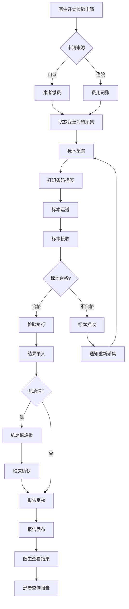
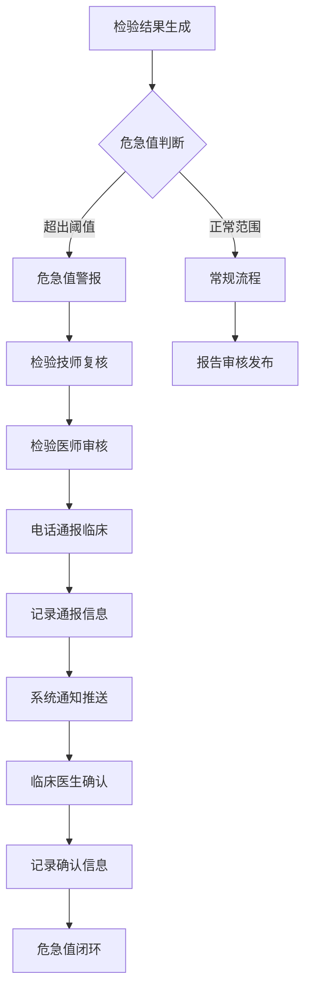

# M04 检验管理子系统(LIS) - 产品需求文档(PRD)

> **文档编号**: YUDAO-HIS-PRD-M04
> **版本**: V1.0
> **创建日期**: 2026-06-19
> **所属系统**: YUDAO-AI-HIS智慧医疗信息系统
> **子系统优先级**: P1 (重要功能)
> **参考文档**: YUDAO-HIS-PRD-001, YUDAO-HIS-FML-001, YUDAO-HIS-BPF-001, YUDAO-HIS-DD-001, YUDAO-HIS-MDD-001

---

## 1. 子系统概述

### 1.1 子系统定位

检验管理子系统(LIS)是YUDAO-AI-HIS的核心医疗辅助模块之一，覆盖检验全流程：申请→标本采集→运送→接收→检验→报告发布。系统支持标本条码全程追踪，实现危急值15分钟通报机制，符合HIMSS EMRAM Stage 5+标准要求。

### 1.2 业务目标

| 目标类型 | 目标描述 | 衡量指标 |
|----------|----------|----------|
| 安全目标 | 实现危急值15分钟通报机制 | 危急值通报时间≤15分钟 |
| 效率目标 | 标本全程条码追踪 | 标本追踪覆盖率100% |
| 质量目标 | 检验报告审核发布 | 报告审核覆盖率100% |
| 集成目标 | 检验仪器数据自动采集 | 仪器对接覆盖率≥80% |

### 1.3 功能范围

```
M04 检验管理(LIS)
├── M04-01 检验申请管理
│   ├── 申请接收（门诊/住院）
│   ├── 申请查询
│   ├── 申请状态追踪
│   ├── 申请单打印
│   └── 申请撤回处理
├── M04-02 标本管理
│   ├── 标本采集登记
│   ├── 标本条码生成/打印
│   ├── 标本运送管理
│   ├── 标本接收确认
│   ├── 标本拒收处理
│   ├── 标本追踪查询
│   └── 标本销毁记录
├── M04-03 检验执行
│   ├── 检验任务分配
│   ├── 检验仪器对接
│   ├── 检验结果录入
│   ├── 结果审核确认
│   ├── 结果修改记录
│   └── 检验进度查询
├── M04-04 报告管理
│   ├── 报告生成
│   ├── 报告审核发布
│   ├── 异常结果标识
│   ├── 危急值识别与通报
│   ├── 危急值确认回复
│   ├── 报告打印
│   ├── 报告查询
│   └── 报告历史版本
├── M04-05 检验项目管理
│   ├── 检验项目配置
│   ├── 参考范围配置
│   ├── 危急值阈值配置
│   ├── 检验套餐管理
│   ├── 检验仪器配置
│   └── 检验科室管理
```

### 1.4 用户角色

| 角色 | 主要职责 | 使用功能 |
|------|----------|----------|
| 检验技师 | 标本接收、检验执行、结果录入 | 检验执行、报告管理 |
| 检验医师 | 报告审核、危急值通报 | 报告管理、危急值处理 |
| 标本采集员 | 标本采集、条码打印、运送 | 标本管理 |
| 护士 | 住院标本采集、运送 | 标本管理 |
| 门诊医生 | 开立检验申请、查看结果 | 申请管理、结果查询 |
| 住院医生 | 开立检验申请、查看结果、危急值确认 | 申请管理、结果查询、危急值确认 |
| 患者 | 查询检验报告 | 患者门户报告查询 |

### 1.5 依赖关系

**上游依赖**:
- M09 系统管理：用户、角色、权限、数据字典
- M01 门诊管理：检验申请来源
- M02 住院管理：检验申请来源

**下游影响**:
- M03 电子病历：检验报告引用
- M08 财务管理：检验费用记账
- M10 集成平台：检验数据交换
- M11 患者服务：检验报告查询
- M13 AI辅助：检验结果AI分析

---

## 2. 功能模块详细设计

### 2.1 M04-01 检验申请管理

#### 2.1.1 功能概述

检验申请管理模块接收门诊/住院的检验申请，管理申请状态流转，支持申请查询和追踪。

#### 2.1.2 申请流程

```
门诊/住院医生开立检验申请
    │
    ↓
检验申请推送至LIS系统
    │
    ↓
创建检验申请单（状态：待缴费）
    │
    ├── 门诊 ──→ 患者缴费 ──→ 状态变更为"待采集"
    │
    └── 住院 ──→ 费用记账 ──→ 状态变更为"待采集"
    │
    ↓
标本采集 ──→ 状态变更为"已采集"
    │
    ↓
标本运送 ──→ 状态变更为"运送中"
    │
    ↓
标本接收 ──→ 状态变更为"已接收"
    │
    ↓
检验执行 ──→ 状态变更为"检验中"
    │
    ↓
报告发布 ──→ 状态变更为"已完成"
```

#### 2.1.3 页面设计 - 检验申请接收

```
页面布局：
┌─────────────────────────────────────────────────────────────┐
│ 检验申请管理                                                 │
├─────────────────────────────────────────────────────────────┤
│ 筛选条件                                                     │
│ ┌─────────────────────────────────────────────────────────┐ │
│ │ 申请来源: [门诊/住院 ▼]                                  │ │
│ │ 申请状态: [待缴费/待采集/已采集/运送中/已接收/检验中/已完成 ▼] │ │
│ │ 申请日期: [2026-06-19] 至 [2026-06-19]                  │ │
│ │ 患者编号: [__________]                                  │ │
│ │ [查询] [重置]                                           │ │
│ └─────────────────────────────────────────────────────────┘ │
│                                                              │
│ 申请列表                                                     │
│ ┌────┬──────────┬──────────┬──────────┬────────┬────────┐ │
│ │选择│申请编号  │患者信息  │申请科室  │检验项目│状态    │ │
│ ├────┼──────────┼──────────┼──────────┼────────┼────────┤ │
│ │ ☑ │LJ202606190001│张三/男/35│内科    │血常规  │待缴费  │ │
│ │ ☑ │LJ202606190002│李四/女/28│外科    │肝功能  │待采集  │ │
│ │ ☑ │LJ202606190003│王五/男/45│住院-心内│生化全套│已接收  │ │
│ └────┴──────────┴──────────┴──────────┴────────┴────────┘ │
│                                                              │
│                              [查看详情] [打印申请单] [撤回]  │
└─────────────────────────────────────────────────────────────┘
```

#### 2.1.4 字段定义 - 检验申请

| 字段名 | 字段类型 | 必填 | 说明 |
|--------|----------|------|------|
| request_id | BIGINT | 是 | 检验申请ID（主键） |
| request_no | VARCHAR(30) | 是 | 检验申请编号 |
| patient_id | BIGINT | 是 | 患者ID |
| patient_name | VARCHAR(50) | 是 | 患者姓名 |
| patient_gender | VARCHAR(10) | 是 | 患者性别 |
| patient_age | INT | 是 | 患者年龄 |
| source_type | TINYINT | 是 | 申请来源：1门诊/2住院 |
| encounter_id | BIGINT | 是 | 就诊/住院ID |
| dept_id | BIGINT | 是 | 申请科室ID |
| dept_name | VARCHAR(100) | 是 | 申请科室名称 |
| doctor_id | BIGINT | 是 | 申请医生ID |
| doctor_name | VARCHAR(50) | 是 | 申请医生姓名 |
| request_time | DATETIME | 是 | 申请时间 |
| request_status | TINYINT | 是 | 状态：1待缴费/2待采集/3已采集/4运送中/5已接收/6检验中/7已完成/8已撤回 |
| specimen_type | VARCHAR(50) | 是 | 标本类型：血液/尿液/粪便等 |
| specimen_container | VARCHAR(50) | 是 | 标本容器：试管/尿杯等 |
| is_urgent | TINYINT | 否 | 是否急诊：0普通/1急诊 |
| clinical_diagnosis | VARCHAR(200) | 否 | 临床诊断 |
| clinical_info | VARCHAR(500) | 否 | 临床信息 |
| create_time | DATETIME | 是 | 创建时间 |
| create_by | VARCHAR(50) | 是 | 创建人 |

#### 2.1.5 接口设计

##### 检验申请接收接口

```
接口路径: POST /api/lis/request/receive
请求体:
{
  "sourceType": 1,  // 1门诊/2住院
  "encounterId": 1001,
  "patientId": 100,
  "deptId": 10,
  "doctorId": 50,
  "items": [
    {
      "labItemId": 1001,
      "labItemCode": "CBC",
      "labItemName": "血常规",
      "specimenType": "血液",
      "specimenContainer": "紫盖试管",
      "isUrgent": 0
    }
  ],
  "clinicalDiagnosis": "上呼吸道感染",
  "clinicalInfo": "发热3天，需排除感染"
}

响应格式:
{
  "code": 200,
  "msg": "检验申请接收成功",
  "data": {
    "requestId": 10001,
    "requestNo": "LJ202606190001",
    "requestStatus": 1,  // 待缴费
    "itemCount": 1,
    "estimatedAmount": 25.00
  }
}
```

---

### 2.2 M04-02 标本管理

#### 2.2.1 功能概述

标本管理模块实现标本采集、条码生成、运送、接收、拒收、追踪的全流程管理，支持标本条码全程追溯。

#### 2.2.2 标本流程

```
标本采集
    │
    ├── 打印标本条码标签
    ├── 确认患者身份（腕带核对）
    ├── 标本采集操作
    ├── 标本条码扫描登记
    │
    ↓
标本运送
    │
    ├── 运送员接收标本
    ├── 标本条码扫描
    ├── 运送状态记录
    │
    ↓
标本接收（检验科）
    │
    ├── 检验技师接收标本
    ├── 标本条码扫描
    ├── 标本质量检查
    │
    ├── 合格 ──→ 接收确认
    │
    └── 不合格 ──→ 拒收处理（注明拒收原因）
```

#### 2.2.3 页面设计 - 标本采集

```
页面布局：
┌─────────────────────────────────────────────────────────────┐
│ 标本采集管理                                                 │
├─────────────────────────────────────────────────────────────┤
│ 待采集标本列表                                               │
│ ┌────┬──────────┬──────────┬──────────┬────────┬────────┐ │
│ │选择│申请编号  │患者信息  │标本类型  │检验项目│急诊标识│ │
│ ├────┼──────────┼──────────┼──────────┼────────┼────────┤ │
│ │ ☑ │LJ202606190002│张三/男/35│血液    │血常规  │        │ │
│ │ ☑ │LJ202606190003│李四/女/28│尿液    │尿常规  │急诊⚠️ │ │
│ └────┴──────────┴──────────┴──────────┴────────┴────────┘ │
│                                                              │
│ 标本采集操作                                                 │
│ ┌─────────────────────────────────────────────────────────┐ │
│ │ 患者确认:                                                │ │
│ │ 患者姓名: [________]  腕带扫描: [扫描腕带]              │ │
│ │ 就诊卡号: [________]  身份验证: [验证]                  │ │
│ │                                                         │ │
│ │ 标本信息:                                                │ │
│ │ 标本类型: 血液                                          │ │
│ │ 标本容器: 紫盖试管                                      │ │
│ │ 采集时间: [2026-06-19 10:30]                           │ │
│ │                                                         │ │
│ │ [生成条码] [打印标签] [采集确认] [取消]                 │ │
│ └─────────────────────────────────────────────────────────┘ │
│                                                              │
│ 已采集标本                                                   │
│ ┌────────────┬────────────┬────────────┬────────┬────────┐ │
│ │标本条码    │申请编号    │患者        │采集时间│状态    │ │
│ ├────────────┼────────────┼────────────┼────────┼────────┤ │
│ │BB202606190001│LJ202606190002│张三    │10:30   │已采集  │ │
│ │BB202606190002│LJ202606190003│李四    │10:35   │运送中  │ │
│ └────────────┴────────────┴────────────┴────────┴────────┘ │
│                                                              │
│                              [查看追踪] [打印运送单] [运送]  │
└─────────────────────────────────────────────────────────────┘
```

#### 2.2.4 标本条码标签

```
标签格式：
┌─────────────────────────────┐
│ ██████████████████████████ │  ← 条码区域
│        BB202606190001      │
├─────────────────────────────┤
│ 患者姓名: 张三              │
│ 性别: 男    年龄: 35岁      │
│ 患者编号: P202606190001     │
├─────────────────────────────┤
│ 检验项目: 血常规            │
│ 标本类型: 血液              │
│ 采集时间: 2026-06-19 10:30  │
│ 采集人员: 护士A             │
├─────────────────────────────┤
│ 申请科室: 内科              │
│ 检验科室: 检验科            │
│ 急诊标识: [普通]            │
└─────────────────────────────┘
```

#### 2.2.5 字段定义 - 标本记录

| 字段名 | 字段类型 | 必填 | 说明 |
|--------|----------|------|------|
| specimen_id | BIGINT | 是 | 标本ID（主键） |
| specimen_no | VARCHAR(30) | 是 | 标本条码编号 |
| request_id | BIGINT | 是 | 检验申请ID |
| request_no | VARCHAR(30) | 是 | 检验申请编号 |
| patient_id | BIGINT | 是 | 患者ID |
| patient_name | VARCHAR(50) | 是 | 患者姓名 |
| specimen_type | VARCHAR(50) | 是 | 标本类型 |
| specimen_container | VARCHAR(50) | 是 | 标本容器 |
| specimen_status | TINYINT | 是 | 状态：1已采集/2运送中/3已接收/4已拒收/5已销毁 |
| collection_time | DATETIME | 是 | 采集时间 |
| collection_by | VARCHAR(50) | 是 | 采集人 |
| collection_location | VARCHAR(100) | 是 | 采集地点 |
| transport_time | DATETIME | 否 | 运送时间 |
| transport_by | VARCHAR(50) | 否 | 运送人 |
| receive_time | DATETIME | 否 | 接收时间 |
| receive_by | VARCHAR(50) | 否 | 接收人 |
| reject_time | DATETIME | 否 | 拒收时间 |
| reject_reason | VARCHAR(200) | 否 | 拒收原因 |
| is_urgent | TINYINT | 是 | 是否急诊 |
| create_time | DATETIME | 是 | 创建时间 |

---

### 2.3 M04-03 检验执行

#### 2.3.1 功能概述

检验执行模块实现检验任务分配、仪器对接、结果录入和审核。支持检验仪器自动数据采集，也支持手工录入结果。

#### 2.3.2 页面设计 - 检验执行

```
页面布局：
┌─────────────────────────────────────────────────────────────┐
│ 检验执行工作站                               技师: 技师A     │
├────────────┬────────────────────────────────────────────────┤
│ 待检验任务 │ 检验任务详情                                  │
│ ┌────────┐│ ┌──────────────────────────────────────────┐  │
│ │标本条码││ │ 标本条码: BB202606190001                  │  │
│ │BB0001  ││ │ 患者: 张三  男  35岁                     │  │
│ │血常规  ││ │ 申请科室: 内科                            │  │
│ │急诊⚠️ ││ │ 检验项目: 血常规                          │  │
│ │[执行]  ││ │                                          │  │
│ ├────────┤│ │ 仪器状态: 生化分析仪-在线                 │  │
│ │BB0002  ││ │                                          │  │
│ │生化全套││ │ 检验结果录入:                            │  │
│ │普通    ││ │ ┌───────────────────────────────────┐    │  │
│ │[执行]  ││ │ │ 项目      │结果│单位│参考范围│状态│    │  │
│ ├────────┤│ │ ├───────────────────────────────────┤    │  │
│ │BB0003  ││ │ │ 白细胞    │8.5 │10^9/L│4-10   │正常│    │  │
│ │肝功能  ││ │ │ 红细胞    │4.8 │10^12/L│4-5.5 │正常│    │  │
│ │普通    ││ │ │ 血小板    │220│10^9/L│100-300│正常│    │  │
│ │[执行]  ││ │ │血红蛋白 │145│g/L │120-160│正常│    │  │
│ └────────┘│ │ └───────────────────────────────────┘    │  │
│            │ │                                         │  │
│            │ │ [仪器采集] [手工录入] [审核结果] [提交] │  │
│            │ └──────────────────────────────────────────┘  │
│            │                                               │
│            │ 已完成任务                                    │
│            │ 今日已完成: 15  危急值: 2                     │
└────────────┴────────────────────────────────────────────────┘
```

#### 2.3.3 检验结果字段定义

| 字段名 | 字段类型 | 必填 | 说明 |
|--------|----------|------|------|
| result_id | BIGINT | 是 | 结果ID（主键） |
| specimen_id | BIGINT | 是 | 标本ID |
| request_id | BIGINT | 是 | 申请ID |
| patient_id | BIGINT | 是 | 患者ID |
| lab_item_id | BIGINT | 是 | 检验项目ID |
| lab_item_code | VARCHAR(30) | 是 | 检验项目编码 |
| lab_item_name | VARCHAR(100) | 是 | 检验项目名称 |
| result_value | VARCHAR(50) | 是 | 检验结果值 |
| result_unit | VARCHAR(20) | 是 | 结果单位 |
| reference_low | DECIMAL(10,2) | 是 | 参考范围下限 |
| reference_high | DECIMAL(10,2) | 是 | 参考范围上限 |
| result_status | TINYINT | 是 | 结果状态：1正常/2偏高/3偏低/4危急值 |
| is_abnormal | TINYINT | 是 | 是否异常：0正常/1异常 |
| is_critical | TINYINT | 是 | 是否危急值：0否/1是 |
| instrument_id | BIGINT | 否 | 检验仪器ID |
| instrument_name | VARCHAR(100) | 否 | 检验仪器名称 |
| test_time | DATETIME | 是 | 检验时间 |
| test_by | VARCHAR(50) | 是 | 检验技师 |
| audit_time | DATETIME | 否 | 审核时间 |
| audit_by | VARCHAR(50) | 否 | 审核人 |
| create_time | DATETIME | 是 | 创建时间 |

---

### 2.4 M04-04 报告管理

#### 2.4.1 功能概述

报告管理模块实现检验报告生成、审核发布、危急值通报机制。危急值必须15分钟内通报临床，临床医生必须在规定时间内确认回复。

#### 2.4.2 危急值通报流程

```
检验结果生成
    │
    ↓
危急值判断（超出危急值阈值）
    │
    ↓
危急值警报触发
    │
    ├── 检验技师复核危急值
    ├── 检验医师审核确认
    │
    ↓
危急值通报（电话+系统通知）
    │
    ├── 记录通报时间
    ├── 记录通报人
    ├── 记录接收人
    │
    ↓
临床医生确认回复
    │
    ├── 记录确认时间
    ├── 记录确认人
    ├── 记录处理措施
    │
    ↓
危急值闭环完成
```

#### 2.4.3 页面设计 - 危急值管理

```
页面布局：
┌─────────────────────────────────────────────────────────────┐
│ 危急值管理                                   当前危急值: 3   │
├─────────────────────────────────────────────────────────────┤
│ 待通报危急值                                                 │
│ ┌────┬──────────┬──────────┬──────────┬────────┬────────┐ │
│ │序号│标本条码  │患者信息  │危急项目  │结果值  │阈值    │ │
│ ├────┼──────────┼──────────┼──────────┼────────┼────────┤ │
│ │ 1  │BB202606190001│张三/男/35│血糖    │35.2  │>28.0   │ │
│ │ 2  │BB202606190002│李四/女/28│钾离子 │6.8   │>6.0    │ │
│ │ 3  │BB202606190003│王五/男/45│白细胞 │1.2   │<2.0    │ │
│ └────┴──────────┴──────────┴──────────┴────────┴────────┘ │
│                                                              │
│ 危急值通报操作                                               │
│ ┌─────────────────────────────────────────────────────────┐ │
│ │ 选择危急值: [1]                                          │ │
│ │ 危急值项目: 血糖                                         │ │
│ │ 危急值结果: 35.2 mmol/L (危急值阈值: >28.0)             │ │
│ │                                                         │ │
│ │ 通报对象:                                                │ │
│ │ 申请科室: 内科                                          │ │
│ │ 申请医生: 李主任                                        │ │
│ │ 联系电话: 138****0000                                   │ │
│ │                                                         │ │
│ │ 通报方式: [电话通报] + [系统通知]                       │ │
│ │                                                         │ │
│ │ 通报记录:                                                │ │
│ │ 通报时间: [2026-06-19 10:35]                           │ │
│ │ 通报人员: [检验医师A]                                   │ │
│ │ 接收人员: [李主任]                                      │ │
│ │                                                         │ │
│ │ [通报] [打印危急值报告] [查看历史]                      │ │
│ └─────────────────────────────────────────────────────────┘ │
│                                                              │
│ 已通报待确认危急值                                           │
│ ┌────────────┬────────────┬────────────┬────────┬────────┐ │
│ │通报时间    │患者        │危急项目    │科室    │状态    │ │
│ ├────────────┼────────────┼────────────┼────────┼────────┤ │
│ │10:35       │张三        │血糖        │内科    │待确认⚠️│ │
│ │10:40       │李四        │钾离子      │心内科  │已确认  │ │
│ └────────────┴────────────┴────────────┴────────┴────────┘ │
│                                                              │
│ 危急值通报时效统计                                           │
│ 今日危急值: 5  平均通报时间: 8分钟  平均确认时间: 12分钟   │
└─────────────────────────────────────────────────────────────┘
```

#### 2.4.4 危急值记录字段定义

| 字段名 | 字段类型 | 必填 | 说明 |
|--------|----------|------|------|
| critical_id | BIGINT | 是 | 危急值记录ID（主键） |
| specimen_id | BIGINT | 是 | 标本ID |
| request_id | BIGINT | 是 | 申请ID |
| patient_id | BIGINT | 是 | 患者ID |
| lab_item_id | BIGINT | 是 | 检验项目ID |
| lab_item_name | VARCHAR(100) | 是 | 检验项目名称 |
| critical_value | VARCHAR(50) | 是 | 危急值结果 |
| critical_threshold | VARCHAR(50) | 是 | 危急值阈值 |
| critical_time | DATETIME | 是 | 危急值发现时间 |
| notify_time | DATETIME | 是 | 通报时间 |
| notify_by | VARCHAR(50) | 是 | 通报人 |
| notify_to | VARCHAR(50) | 是 | 接收人 |
| notify_method | VARCHAR(50) | 是 | 通报方式 |
| confirm_time | DATETIME | 否 | 确认时间 |
| confirm_by | VARCHAR(50) | 否 | 确认人 |
| confirm_action | VARCHAR(200) | 否 | 处理措施 |
| critical_status | TINYINT | 是 | 状态：1待通报/2已通报/3已确认 |
| time_elapsed | INT | 否 | 通报耗时（分钟） |

---

### 2.5 M04-05 检验项目管理

#### 2.5.1 功能概述

检验项目管理模块配置检验项目、参考范围、危急值阈值、检验仪器等基础数据。

#### 2.5.2 检验项目配置

| 配置项 | 说明 |
|--------|------|
| 项目编码 | 检验项目唯一编码 |
| 项目名称 | 检验项目名称 |
| 项目分类 | 生化/免疫/血液/微生物等 |
| 标本类型 | 血液/尿液/粪便等 |
| 标本容器 | 试管类型、尿杯等 |
| 参考范围 | 按年龄/性别分组设置 |
| 危急值阈值 | 高限/低限设置 |
| 检验仪器 | 关联检验仪器 |
| 检验科室 | 关联检验科室 |
| 收费项目 | 关联收费项目编码 |

---

## 3. 业务流程

### 3.1 检验全流程



### 3.2 危急值通报流程



---

## 4. 非功能需求

### 4.1 性能需求

| 指标 | 要求 |
|------|------|
| 标本条码扫描响应 | ≤1秒 |
| 检验结果录入响应 | ≤2秒 |
| 报告生成时间 | ≤5秒 |
| 危急值通报时效 | ≤15分钟 |
| 日检验量支持 | ≥1000标本 |

### 4.2 安全需求

| 需求 | 标准 |
|------|------|
| 危急值通报覆盖 | 100%危急值必须通报 |
| 危急值确认时限 | 临床必须在规定时间确认 |
| 标本追踪覆盖 | 100%标本条码追踪 |
| 结果修改记录 | 所有结果修改需记录 |

---

## 5. 开发计划

### 5.1 Sprint规划

| Sprint | 内容 | 工期 |
|--------|------|------|
| Sprint 6-1 | 检验申请管理、标本管理 | 2周 |
| Sprint 6-2 | 检验执行、报告管理、危急值 | 3周 |
| Sprint 6-3 | 检验项目配置、仪器对接 | 2周 |

---

> **编制**: YUDAO-AI-HIS产品组
> **最后更新**: 2026-06-19