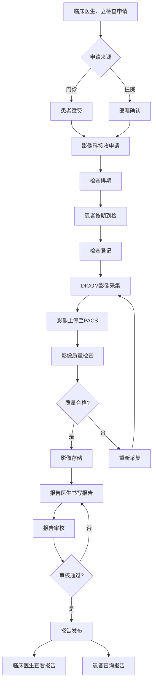

# M05 影像管理子系统(RIS/PACS) - 产品需求文档(PRD)

> **文档编号**: YUDAO-HIS-PRD-M05
> **版本**: V1.0
> **创建日期**: 2026-06-19
> **所属系统**: YUDAO-AI-HIS智慧医疗信息系统
> **子系统优先级**: P1 (重要功能)
> **参考文档**: YUDAO-HIS-PRD-001, YUDAO-HIS-FML-001, YUDAO-HIS-BPF-001, YUDAO-HIS-DD-001

---

## 1. 子系统概述

### 1.1 子系统定位

影像管理子系统(RIS/PACS)是YUDAO-AI-HIS的核心医技模块之一，覆盖影像检查全流程：申请接收、检查排期、DICOM影像采集与存储、影像查看、报告发布。系统遵循DICOM 3.0标准，支持三级存储架构（在线、近线、离线），与门诊/住院系统无缝集成。

### 1.2 业务目标

| 目标类型 | 目标描述 | 衡量指标 |
|----------|----------|----------|
| 效率目标 | 缩短影像检查周转时间 | 平均报告出具时间≤24小时 |
| 标准目标 | 实现DICOM标准对接 | DICOM设备对接成功率100% |
| 质量目标 | 提升影像诊断质量 | 影像质量合格率≥98% |
| 存储目标 | 保障影像长期安全存储 | 影像数据保存期限≥30年 |

### 1.3 功能范围

```
M05 影像管理(RIS/PACS)
├── M05-01 影像申请管理
│   ├── 申请接收（门诊/住院）
│   ├── 申请查询
│   ├── 检查排期
│   ├── 申请状态追踪
│   └── 申请取消/修改
├── M05-02 影像检查执行
│   ├── 检查登记
│   ├── DICOM影像采集
│   ├── 影像上传
│   ├── 影像质量检查
│   └── 检查完成确认
├── M05-03 影像存储管理
│   ├── 影像存储（在线）
│   ├── 影像归档（近线）
│   ├── 影像迁移（离线）
│   ├── 存储容量管理
│   └── 影像备份恢复
├── M05-04 影像查看
│   ├── 影像调阅
│   ├── 窗宽窗位调整
│   ├── 测量标注
│   ├── 影像序列浏览
│   ├── 多序列对比
│   └── 影像导出
└── M05-05 影像报告
    ├── 报告书写
    ├── 报告模板管理
    ├── 报告审核发布
    ├── 报告打印
    └── 报告修改/撤回
```

### 1.4 用户角色

| 角色 | 主要职责 | 使用功能 |
|------|----------|----------|
| 影像科技师 | 检查登记、影像采集、影像上传 | 检查执行、影像存储 |
| 影像科医生 | 影像诊断、报告书写 | 影像查看、报告管理 |
| 报告审核医师 | 报告审核、质量把控 | 报告审核发布 |
| 影像科主任 | 科室管理、统计查询 | 全部功能 |
| 临床医生 | 申请检查、查看报告 | 申请管理、报告查询 |
| 患者 | 查询报告 | 患者门户报告查询 |

### 1.5 依赖关系

**上游依赖**:
- M09 系统管理：用户、角色、权限、数据字典
- M10 集成平台：EMPI患者主索引

**下游影响**:
- M01 门诊管理：影像申请来源
- M02 住院管理：影像申请来源
- M11 患者服务：患者报告查询

---

## 2. 功能模块详细设计

### 2.1 M05-01 影像申请管理

#### 2.1.1 功能概述

影像申请管理模块负责接收来自门诊/住院的影像检查申请，支持检查排期、申请查询、状态追踪等功能。

#### 2.1.2 申请接收流程

```
临床医生开立检查申请
    │
    ├── 门诊申请 ──→ 患者缴费 ──┐
    │                          │
    └── 住院申请 ──→ 医嘱执行 ──┼──→ 影像科接收申请
                                  │
                                  ↓
                             检查排期
                                  │
                                  ↓
                             患者到检
```

#### 2.1.3 页面设计 - 申请列表

```
页面布局：
┌─────────────────────────────────────────────────────────────┐
│ 影像检查申请管理                                             │
├─────────────────────────────────────────────────────────────┤
│ 查询条件                                                     │
│ ┌─────────────────────────────────────────────────────────┐ │
│ │ 申请日期: [2026-06-19] 至 [2026-06-19]                  │ │
│ │ 申请状态: [全部      ▼] 检查类型: [全部    ▼]           │ │
│ │ 患者姓名: [__________] 申请科室: [全部    ▼]            │ │
│ │                                          [查询] [重置]  │ │
│ └─────────────────────────────────────────────────────────┘ │
│                                                              │
│ 申请列表                                                     │
│ ┌────┬────────┬──────┬────────┬────────┬────────┬────────┐ │
│ │选择│申请编号│患者  │检查类型│申请科室│申请医生│状态    │ │
│ ├────┼────────┼──────┼────────┼────────┼────────┼────────┤ │
│ │ □ │IA00001 │张三  │胸部CT  │内科    │李医生  │待排期  │ │
│ │ □ │IA00002 │李四  │腹部B超 │外科    │王医生  │已排期  │ │
│ │ □ │IA00003 │王五  │头颅MRI│神经内科│赵医生  │待缴费  │ │
│ │ □ │IA00004 │赵六  │胸部X线│急诊科  │孙医生  │已完成  │ │
│ └────┴────────┴──────┴────────┴────────┴────────┴────────┘ │
│                                                              │
│                    [排期] [详情] [导出]  共4条  第1/1页      │
└─────────────────────────────────────────────────────────────┘
```

#### 2.1.4 字段定义 - 影像申请

| 字段名 | 字段类型 | 必填 | 说明 |
|--------|----------|------|------|
| request_id | BIGINT | 是 | 申请ID（主键） |
| request_no | VARCHAR(30) | 是 | 申请编号 |
| patient_id | BIGINT | 是 | 患者ID |
| patient_name | VARCHAR(50) | 是 | 患者姓名 |
| encounter_id | BIGINT | 是 | 就诊ID（门诊/住院） |
| exam_type_code | VARCHAR(20) | 是 | 检查类型编码 |
| exam_type_name | VARCHAR(100) | 是 | 检查类型名称 |
| exam_part | VARCHAR(100) | 是 | 检查部位 |
| clinical_diagnosis | VARCHAR(200) | 否 | 临床诊断 |
| exam_purpose | VARCHAR(200) | 否 | 检查目的 |
| urgency_level | TINYINT | 是 | 紧急程度：1普通/2急诊/3特急 |
| request_dept_id | BIGINT | 是 | 申请科室ID |
| request_dept_name | VARCHAR(100) | 是 | 申请科室名称 |
| request_doctor_id | BIGINT | 是 | 申请医生ID |
| request_doctor_name | VARCHAR(50) | 是 | 申请医生姓名 |
| request_time | DATETIME | 是 | 申请时间 |
| schedule_time | DATETIME | 否 | 排期时间 |
| perform_dept_id | BIGINT | 是 | 执行科室ID |
| perform_dept_name | VARCHAR(100) | 是 | 执行科室名称 |
| request_status | TINYINT | 是 | 状态：1待缴费/2待排期/3已排期/4已到检/5检查中/6已完成/7已取消 |
| payment_status | TINYINT | 是 | 缴费状态：0未缴费/1已缴费 |
| create_time | DATETIME | 是 | 创建时间 |
| create_by | VARCHAR(50) | 是 | 创建人 |

#### 2.1.5 接口设计

##### 接收影像申请接口

```
接口路径: POST /api/ris/request
请求体:
{
  "encounterId": 1001,
  "patientId": 100,
  "examTypeCode": "CT_CHEST",
  "examTypeName": "胸部CT",
  "examPart": "胸部",
  "clinicalDiagnosis": "肺炎",
  "examPurpose": "排除肺部占位",
  "urgencyLevel": 1,
  "requestDeptId": 10,
  "requestDoctorId": 100
}

响应格式:
{
  "code": 200,
  "msg": "申请接收成功",
  "data": {
    "requestId": 10001,
    "requestNo": "IA202606190001",
    "requestStatus": 1
  }
}
```

##### 检查排期接口

```
接口路径: POST /api/ris/request/schedule
请求体:
{
  "requestId": 10001,
  "scheduleTime": "2026-06-19 14:00:00",
  "performDeptId": 20,
  "roomNo": "CT室1"
}

响应格式:
{
  "code": 200,
  "msg": "排期成功",
  "data": {
    "scheduleId": 5001,
    "queueNo": 15
  }
}
```

---

### 2.2 M05-02 影像检查执行

#### 2.2.1 功能概述

影像检查执行模块负责检查登记、DICOM影像采集、影像上传、质量检查等功能，是RIS与PACS的核心连接模块。

#### 2.2.2 页面设计 - 检查登记

```
页面布局：
┌─────────────────────────────────────────────────────────────┐
│ 检查登记                                                     │
├─────────────────────────────────────────────────────────────┤
│ 患者信息                                                     │
│ ┌─────────────────────────────────────────────────────────┐ │
│ │ 申请编号: [__________] [查询]                           │ │
│ │                                                         │ │
│ │ 患者姓名: 张三        性别: 男        年龄: 45岁        │ │
│ │ 患者编号: P202606190001  检查类型: 胸部CT              │ │
│ │ 临床诊断: 肺炎                                          │ │
│ │ 检查部位: 胸部                                          │ │
│ └─────────────────────────────────────────────────────────┘ │
│                                                              │
│ 检查信息                                                     │
│ ┌─────────────────────────────────────────────────────────┐ │
│ │ 检查设备: [CT设备1  ▼]                                  │ │
│ │ 检查房间: [CT室1    ▼]                                  │ │
│ │ 检查技师: [技师A    ▼]                                  │ │
│ │ 检查时间: 2026-06-19 14:30                             │ │
│ │                                                         │ │
│ │ 备注信息: [                                          ] │ │
│ └─────────────────────────────────────────────────────────┘ │
│                                                              │
│                              [确认登记] [取消] [打印检查单]  │
└─────────────────────────────────────────────────────────────┘
```

#### 2.2.3 DICOM影像采集流程

```
检查登记
    │
    ↓
设备扫码关联
    │
    ↓
影像采集 ──→ DICOM影像生成
    │
    ↓
影像上传至PACS服务器
    │
    ├── 自动校验（DICOM标准、完整性）
    │
    ├── 影像存储
    │
    └── 关联检查记录
```

#### 2.2.4 DICOM标准字段映射

| HIS字段 | DICOM Tag | 说明 |
|---------|-----------|------|
| patient_id | (0010,0020) | 患者ID |
| patient_name | (0010,0010) | 患者姓名 |
| patient_birth_date | (0010,0030) | 出生日期 |
| patient_sex | (0010,0040) | 性别 |
| study_instance_uid | (0020,000D) | 检查实例UID |
| study_id | (0020,0010) | 检查ID |
| study_date | (0008,0020) | 检查日期 |
| study_time | (0008,0030) | 检查时间 |
| modality | (0008,0060) | 检查类型 |
| study_description | (0008,1030) | 检查描述 |
| institution_name | (0008,0080) | 机构名称 |

---

### 2.3 M05-03 影像存储管理

#### 2.3.1 功能概述

影像存储管理模块实现DICOM影像的三级存储架构：在线存储（热数据）、近线归档（温数据）、离线迁移（冷数据），保障影像数据长期安全保存。

#### 2.3.2 三级存储架构

```
┌─────────────────────────────────────────────────────────────┐
│                     三级存储架构                             │
├─────────────────────────────────────────────────────────────┤
│                                                             │
│  在线存储（Online）                                          │
│  ┌─────────────────────────────────────────────────────┐   │
│  │ 存储: 高性能SSD/NVMe                                 │   │
│  │ 容量: 近3个月数据                                    │   │
│  │ 访问: 毫秒级响应                                     │   │
│  │ 适用: 活跃检查、急诊检查                             │   │
│  └─────────────────────────────────────────────────────┘   │
│                          ↓ 自动迁移                         │
│                                                             │
│  近线归档（Nearline）                                        │
│  ┌─────────────────────────────────────────────────────┐   │
│  │ 存储: 大容量SATA HDD                                 │   │
│  │ 容量: 近1年数据                                      │   │
│  │ 访问: 秒级响应                                       │   │
│  │ 适用: 历史检查查询                                   │   │
│  └─────────────────────────────────────────────────────┘   │
│                          ↓ 自动迁移                         │
│                                                             │
│  离线存储（Offline）                                         │
│  ┌─────────────────────────────────────────────────────┐   │
│  │ 存储: 磁带库/对象存储                                │   │
│  │ 容量: 长期保存（≥30年）                              │   │
│  │ 访问: 分钟级响应                                     │   │
│  │ 适用: 长期归档、合规保存                             │   │
│  └─────────────────────────────────────────────────────┘   │
│                                                             │
└─────────────────────────────────────────────────────────────┘
```

#### 2.3.3 存储容量规划

| 存储层级 | 容量估算 | 增长率 | 说明 |
|----------|----------|--------|------|
| 在线存储 | 10TB | 约100GB/月 | 近3个月检查影像 |
| 近线归档 | 50TB | 约1.2TB/年 | 近1年检查影像 |
| 离线存储 | 200TB+ | 约1.2TB/年 | 长期归档保存 |

#### 2.3.4 影像存储策略

| 检查类型 | 在线保留 | 近线保留 | 离线保留 |
|----------|----------|----------|----------|
| X线检查 | 3个月 | 1年 | 永久 |
| CT检查 | 3个月 | 2年 | 永久 |
| MRI检查 | 3个月 | 2年 | 永久 |
| 超声检查 | 3个月 | 1年 | 永久 |
| 核医学检查 | 3个月 | 2年 | 永久 |

---

### 2.4 M05-04 影像查看

#### 2.4.1 功能概述

影像查看模块提供专业的DICOM影像查看器，支持窗宽窗位调整、测量标注、序列浏览、多序列对比等功能，满足影像诊断需求。

#### 2.4.2 页面设计 - 影像查看器

```
页面布局：
┌─────────────────────────────────────────────────────────────┐
│ 影像查看器 - 胸部CT                              [全屏][导出]│
├────────────┬────────────────────────────────────────────────┤
│ 序列列表   │ 影像显示区                                    │
│ ┌────────┐│ ┌──────────────────────────────────────────┐  │
│ │序列1   ││ │                                          │  │
│ │CT定位像││ │          [DICOM影像显示]                 │  │
│ │[10张]  ││ │                                          │  │
│ ├────────┤│ │    窗宽: 350  窗位: 50                   │  │
│ │序列2   ││ │    测量: 距离=12.5mm                     │  │
│ │CT平扫  ││ │                                          │  │
│ │[120张] ││ │                                          │  │
│ ├────────┤│ └──────────────────────────────────────────┘  │
│ │序列3   ││                                               │
│ │CT增强  ││ 工具栏                                        │
│ │[120张] ││ ┌──────────────────────────────────────────┐  │
│ └────────┘│ │ [放大] [移动] [窗宽窗位] [测量] [标注]   │  │
│            │ │ [CT值] [角度] [面积] [ROI] [清除]       │  │
│ 患者信息   │ │                                          │  │
│ ┌────────┐│ │ 预设: [肺部▼] [纵隔] [骨窗] [软组织]    │  │
│ │张三 男 ││ └──────────────────────────────────────────┘  │
│ │45岁    ││                                               │
│ │检查:CT ││ 影像导航                                      │
│ │日期:...││ ┌──────────────────────────────────────────┐  │
│ └────────┘│ │ << < [1/120] > >>  播放速度: [5帧/秒▼]  │  │
│            │ └──────────────────────────────────────────┘  │
└────────────┴────────────────────────────────────────────────┘
```

#### 2.4.3 窗宽窗位预设

| 检查类型 | 预设名称 | 窗宽(WW) | 窗位(WL) | 适用场景 |
|----------|----------|----------|----------|----------|
| CT | 肺窗 | 1500 | -600 | 肺实质观察 |
| CT | 纵隔窗 | 350 | 50 | 纵隔结构观察 |
| CT | 骨窗 | 2000 | 400 | 骨骼观察 |
| CT | 软组织窗 | 400 | 50 | 软组织观察 |
| CT | 脑窗 | 80 | 40 | 脑组织观察 |
| CT | 腹部窗 | 400 | 50 | 腹部脏器观察 |

#### 2.4.4 测量标注功能

| 功能 | 说明 |
|------|------|
| 距离测量 | 测量两点间距离（mm） |
| 角度测量 | 测量角度（度） |
| 面积测量 | 测量封闭区域面积（mm²） |
| ROI勾画 | 感兴趣区域勾画，计算平均CT值 |
| CT值测量 | 点测量或区域测量CT值 |
| 标注工具 | 文字标注、箭头标注、自由绘制 |

---

### 2.5 M05-05 影像报告

#### 2.5.1 功能概述

影像报告模块提供报告书写、模板管理、审核发布、打印等功能，支持结构化报告和自由文本报告两种模式。

#### 2.5.2 页面设计 - 报告书写

```
页面布局：
┌─────────────────────────────────────────────────────────────┐
│ 影像报告书写                                                 │
├────────────┬────────────────────────────────────────────────┤
│ 影像预览   │ 报告内容                                      │
│ ┌────────┐│ ┌──────────────────────────────────────────┐  │
│ │        ││ │ 检查信息:                                │  │
│ │[影像]  ││ │ 检查类型: 胸部CT平扫                     │  │
│ │        ││ │ 检查日期: 2026-06-19                     │  │
│ │        ││ │ 检查设备: CT设备1                        │  │
│ │        ││ │                                          │  │
│ │        ││ │ 影像所见:                                │  │
│ │        ││ │ ┌────────────────────────────────────┐  │  │
│ │        ││ │ │ 双肺纹理清晰，肺野透亮度正常。     │  │  │
│ │        ││ │ │ 气管居中，纵隔无偏移。             │  │  │
│ │        ││ │ │ 心脏大小形态正常，心包无积液。     │  │  │
│ │        ││ │ │ 双侧胸腔未见积液。                 │  │  │
│ │        ││ │ └────────────────────────────────────┘  │  │
│ │        ││ │                                          │  │
│ │        ││ │ 诊断意见:                                │  │
│ │        ││ │ ┌────────────────────────────────────┐  │  │
│ │        ││ │ │ 1. 双肺未见明显异常                 │  │  │
│ │        ││ │ │ 2. 心脏大小形态正常                 │  │  │
│ │        ││ │ └────────────────────────────────────┘  │  │
│ └────────┘│ └──────────────────────────────────────────┘  │
│            │                                               │
│ 模板选择   │ 报告操作                                      │
│ ┌────────┐│ ┌──────────────────────────────────────────┐  │
│ │胸部CT  ││ │ [保存草稿] [提交审核] [打印预览] [模板]  │  │
│ │正常模板││ └──────────────────────────────────────────┘  │
│ │肺结节  ││                                               │
│ │肺炎模板││ 报告信息                                      │
│ │...     ││ 报告医生: 李医生  报告时间: 2026-06-19 15:30│
│ └────────┘│ 审核状态: 待审核                             │
└────────────┴────────────────────────────────────────────────┘
```

#### 2.5.3 报告字段定义

| 字段名 | 字段类型 | 必填 | 说明 |
|--------|----------|------|------|
| report_id | BIGINT | 是 | 报告ID（主键） |
| report_no | VARCHAR(30) | 是 | 报告编号 |
| request_id | BIGINT | 是 | 申请ID |
| patient_id | BIGINT | 是 | 患者ID |
| study_instance_uid | VARCHAR(64) | 是 | DICOM检查实例UID |
| exam_type_name | VARCHAR(100) | 是 | 检查类型 |
| exam_part | VARCHAR(100) | 是 | 检查部位 |
| imaging_findings | TEXT | 是 | 影像所见 |
| diagnosis_opinion | TEXT | 是 | 诊断意见 |
| report_type | TINYINT | 是 | 报告类型：1结构化/2自由文本 |
| template_id | BIGINT | 否 | 模板ID |
| report_doctor_id | BIGINT | 是 | 报告医生ID |
| report_doctor_name | VARCHAR(50) | 是 | 报告医生姓名 |
| report_time | DATETIME | 是 | 报告时间 |
| audit_doctor_id | BIGINT | 否 | 审核医生ID |
| audit_doctor_name | VARCHAR(50) | 否 | 审核医生姓名 |
| audit_time | DATETIME | 否 | 审核时间 |
| report_status | TINYINT | 是 | 状态：1草稿/2待审核/3已发布/4已撤回 |
| create_time | DATETIME | 是 | 创建时间 |

---

## 3. 业务流程

### 3.1 影像检查全流程



### 3.2 DICOM影像存储流程

```
影像设备采集
    │
    ↓
DICOM影像生成
    │
    ↓
DICOM网关接收
    │
    ├── 解析DICOM头信息
    │
    ├── 校验DICOM标准合规性
    │
    ├── 校验影像完整性
    │
    ↓
影像存储服务
    │
    ├── 生成存储路径
    │
    ├── 写入在线存储
    │
    ├── 更新数据库索引
    │
    └── 发送存储成功通知
```

---

## 4. 非功能需求

### 4.1 性能需求

| 指标 | 要求 |
|------|------|
| 影像调阅响应时间 | ≤3秒（在线存储） |
| 影像上传时间 | ≤10秒/检查 |
| 报告查询响应时间 | ≤2秒 |
| 并发用户支持 | ≥100用户 |
| 影像存储容量 | ≥200TB |

### 4.2 标准合规需求

| 需求 | 标准 |
|------|------|
| 影像格式 | DICOM 3.0 |
| 影像传输 | DICOM C-STORE/C-FIND/C-MOVE |
| 数据交换 | HL7 FHIR R4 |
| 数据安全 | 等保三级要求 |

### 4.3 存储需求

| 需求 | 标准 |
|------|------|
| 影像保存期限 | ≥30年 |
| 数据备份 | 每日增量备份，每周全量备份 |
| 灾难恢复 | RTO≤24小时，RPO≤1小时 |
| 存储冗余 | RAID 6或更高 |

---

## 5. 开发计划

### 5.1 Sprint规划

| Sprint | 内容 | 工期 |
|--------|------|------|
| Sprint 7-1 | 申请管理、检查排期 | 2周 |
| Sprint 7-2 | 检查执行、DICOM采集对接 | 3周 |
| Sprint 7-3 | 影像存储、影像查看 | 2周 |
| Sprint 7-4 | 报告管理、审核发布 | 2周 |

---

> **编制**: YUDAO-AI-HIS产品组
> **最后更新**: 2026-06-19
