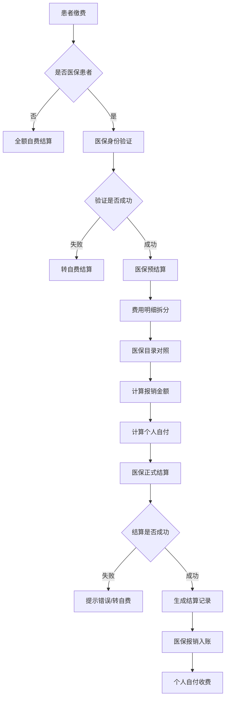

# M08 财务管理子系统 - 产品需求文档(PRD)

> **文档编号**: YUDAO-HIS-PRD-M08
> **版本**: V1.0
> **创建日期**: 2026-06-19
> **所属系统**: YUDAO-AI-HIS智慧医疗信息系统
> **子系统优先级**: P1 (重要功能)
> **参考文档**: YUDAO-HIS-PRD-001, YUDAO-HIS-FML-001, YUDAO-HIS-BPF-001, YUDAO-HIS-DD-001, YUDAO-HIS-MDD-001

---

## 1. 子系统概述

### 1.1 子系统定位

财务管理子系统是YUDAO-AI-HIS的核心支撑模块之一，覆盖全院费用管理：收费项目维护、价格管理、医保结算对接、费用记账、财务报表生成。系统支持门诊和住院的费用结算，实现医保实时结算对接，提供财务日结、月结和收入统计报表，支撑医院财务管理和决策分析。

### 1.2 业务目标

| 目标类型 | 目标描述 | 衡量指标 |
|----------|----------|----------|
| 效率目标 | 实现费用自动记账和实时结算 | 费用记账响应时间≤2秒 |
| 合规目标 | 符合医保结算规范和财务制度 | 医保实时结算成功率≥98% |
| 准确目标 | 保证费用计算准确无误 | 费用计算准确率100% |
| 安全目标 | 保证财务数据安全可追溯 | 财务操作审计覆盖率100% |

### 1.3 功能范围

```
M08 财务管理
├── M08-01 收费项目管理
│   ├── 收费项目维护（新增、修改、删除、查询）
│   ├── 价格管理（定价、调价、价格历史）
│   ├── 价格历史记录
│   ├── 医保目录对照（甲/乙/丙类对照）
│   └── 项目分类管理（诊疗类、药品类、材料类、服务类）
├── M08-02 医保结算
│   ├── 医保身份验证（实时对接医保平台）
│   ├── 医保费用结算（预结算、正式结算）
│   ├── 医保对账（日报、月报对账）
│   ├── 医保结算查询
│   └── 医保撤销处理
│   └── 医保目录维护（药品目录、诊疗项目目录）
├── M08-03 费用记账
│   ├── 门诊费用记账（挂号费、诊查费、处方费、检查费）
│   ├── 住院费用记账（床位费、护理费、治疗费、药品费）
│   ├── 费用明细查询（按患者、按科室、按时间）
│   ├── 费用调整（退费调整、补收调整）
│   └── 费用汇总计算
│   └── 退费记账处理
└── M08-04 财务报表
    ├── 日结报表（收费员日结、科室日结）
    ├── 月结报表（月度收入汇总）
    ├── 收入统计（按科室、按项目、按支付方式）
    ├── 科室收入分析
    ├── 财务对账报表
    └── 应收应付报表
```

### 1.4 用户角色

| 角色 | 主要职责 | 使用功能 |
|------|----------|----------|
| 财务管理员 | 收费项目管理、价格管理 | 收费项目管理 |
| 收费员 | 收费结算、日结对账 | 费用记账、日结报表 |
| 财务会计 | 财务报表、月结对账 | 财务报表 |
| 医保专员 | 医保结算、医保对账 | 医保结算、医保对账 |
| 科室管理员 | 科室收入查看 | 收入统计查询 |

### 1.5 依赖关系

**上游依赖**:
- M09 系统管理：用户、角色、权限、数据字典
- M10 集成平台：医保接口对接

**下游影响**:
- M01 门诊管理：门诊收费结算
- M02 住院管理：住院费用记账、出院结算
- M12 运营管理：财务数据分析

---

## 2. 功能模块详细设计

### 2.1 M08-01 收费项目管理

#### 2.1.1 功能概述

收费项目管理模块实现全院收费项目的统一管理，包括收费项目维护、价格管理、医保目录对照等功能。收费项目涵盖诊疗类、药品类、材料类、服务类等多种类型，支持价格调整和价格历史记录。

#### 2.1.2 收费项目分类

| 项目类型 | 项目范围 | 计价方式 |
|----------|----------|----------|
| 诊疗类 | 诊查费、手术费、治疗费 | 按次计价 |
| 药品类 | 西药费、中药费、材料费 | 按量计价 |
| 检查类 | 检验费、影像费、病理费 | 按项计价 |
| 服务类 | 挂号费、床位费、护理费 | 按天计价 |
| 材料类 | 医用材料、耗材 | 按量计价 |

#### 2.1.3 页面设计 - 收费项目维护

```
页面布局：
┌─────────────────────────────────────────────────────────────┐
│ 收费项目管理                                                 │
├─────────────────────────────────────────────────────────────┤
│ 查询条件                                                     │
│ ┌─────────────────────────────────────────────────────────┐ │
│ │ 项目编码: [__________] 项目名称: [__________]            │ │
│ │ 项目类型: [全部    ▼] 医保类别: [全部    ▼]               │ │
│ │ 状态:     [全部    ▼]                   [查询] [新增]    │ │
│ └─────────────────────────────────────────────────────────┘ │
│                                                              │
│ 项目列表                                                     │
│ ┌────┬──────────┬──────────┬──────┬──────┬──────┬──────┐  │
│ │序号│项目编码  │项目名称  │类型  │单价  │医保类│状态  │  │
│ ├────┼──────────┼──────────┼──────┼──────┼──────┼──────┤  │
│ │ 1  │ZX001    │门诊诊查费│诊疗类│ 20.00│甲类  │启用  │  │
│ │ 2  │GH001    │挂号费    │服务类│  5.00│自费  │启用  │  │
│ │ 3  │JC001    │血常规检验│检查类│ 25.00│乙类  │启用  │  │
│ │ 4  │YP001    │阿莫西林  │药品类│  2.00│甲类  │启用  │  │
│ └────┴──────────┴──────────┴──────┴──────┴──────┴──────┘  │
│                                                              │
│                              [导出] [批量调整价格]           │
└─────────────────────────────────────────────────────────────┘
```

#### 2.1.4 字段定义 - 收费项目

| 字段名 | 字段类型 | 必填 | 说明 |
|--------|----------|------|------|
| item_id | BIGINT | 是 | 项目ID（主键） |
| item_code | VARCHAR(30) | 是 | 项目编码 |
| item_name | VARCHAR(100) | 是 | 项目名称 |
| item_type | TINYINT | 是 | 项目类型：1诊疗/2药品/3检查/4服务/5材料 |
| item_category | VARCHAR(50) | 否 | 项目分类 |
| unit | VARCHAR(20) | 是 | 计价单位 |
| price | DECIMAL(10,2) | 是 | 当前价格 |
| insurance_type | TINYINT | 是 | 医保类别：1甲类/2乙类/3丙类/4自费 |
| insurance_code | VARCHAR(50) | 否 | 医保编码 |
| coverage_ratio | DECIMAL(5,2) | 否 | 医保报销比例（乙类） |
| dept_id | BIGINT | 否 | 执行科室 |
| status | TINYINT | 是 | 状态：1启用/2停用 |
| create_time | DATETIME | 是 | 创建时间 |
| create_by | VARCHAR(50) | 是 | 创建人 |
| update_time | DATETIME | 否 | 更新时间 |
| update_by | VARCHAR(50) | 否 | 更新人 |

#### 2.1.5 接口设计

##### 收费项目查询接口

```
接口路径: GET /api/finance/item/list
请求参数:
{
  "itemCode": "ZX",
  "itemName": "",
  "itemType": 1,
  "insuranceType": null,
  "status": 1,
  "pageNum": 1,
  "pageSize": 20
}

响应格式:
{
  "code": 200,
  "msg": "查询成功",
  "data": {
    "total": 100,
    "list": [
      {
        "itemId": 1,
        "itemCode": "ZX001",
        "itemName": "门诊诊查费",
        "itemType": 1,
        "unit": "次",
        "price": 20.00,
        "insuranceType": 1,
        "insuranceCode": "110100001",
        "status": 1
      }
    ]
  }
}
```

##### 收费项目创建接口

```
接口路径: POST /api/finance/item
请求体:
{
  "itemCode": "ZX002",
  "itemName": "专家诊查费",
  "itemType": 1,
  "unit": "次",
  "price": 50.00,
  "insuranceType": 1,
  "insuranceCode": "110100002",
  "deptId": 10
}

响应格式:
{
  "code": 200,
  "msg": "创建成功",
  "data": {
    "itemId": 100
  }
}
```

##### 价格调整接口

```
接口路径: PUT /api/finance/item/{itemId}/price
请求体:
{
  "newPrice": 25.00,
  "effectiveDate": "2026-07-01",
  "reason": "物价调整"
}

响应格式:
{
  "code": 200,
  "msg": "价格调整成功"
}
```

---

### 2.2 M08-02 医保结算

#### 2.2.1 功能概述

医保结算模块实现与医保平台的实时对接，包括医保身份验证、医保费用结算、医保对账等功能。系统支持城镇职工医保、城乡居民医保等多种医保类型，实现医保目录对照和费用自动拆分。

#### 2.2.2 医保结算流程

```
费用汇总
    │
    ↓
判断是否医保患者 ──→ 否 ──→ 全额自费
    │
    ↓ 是
医保身份验证（调用医保接口）
    │
    ↓
医保预结算（调用医保接口）
    │
    ↓
医保目录对照
    │
    ├── 甲类项目 ──→ 全额纳入报销
    ├── 乙类项目 ──→ 按比例纳入报销（自付比例）
    └── 丙类项目 ──→ 全额自费
    │
    ↓
计算报销金额
    │
    ↓
计算个人自付（自付段+自费段）
    │
    ↓
医保正式结算
    │
    ↓
生成医保结算记录
```

#### 2.2.3 页面设计 - 医保结算

```
页面布局：
┌─────────────────────────────────────────────────────────────┐
│ 医保结算                                                     │
├─────────────────────────────────────────────────────────────┤
│ 患者信息                                                     │
│ ┌─────────────────────────────────────────────────────────┐ │
│ │ 患者姓名: 张三    医保类型: 城镇职工医保                   │ │
│ │ 医保卡号: 1234567890   医保状态: 有效                     │ │
│ │ 本年累计: 5000.00元   年度限额: 30000.00元               │ │
│ └─────────────────────────────────────────────────────────┘ │
│                                                              │
│ 费用明细                                                     │
│ ┌────┬──────────┬──────┬──────┬──────┬──────┬──────┐      │
│ │序号│项目名称  │单价  │数量  │金额  │医保类│报销额│      │
│ ├────┼──────────┼──────┼──────┼──────┼──────┼──────┤      │
│ │ 1  │挂号费    │ 5.00 │  1   │ 5.00 │自费  │ 0.00 │      │
│ │ 2  │诊查费    │20.00 │  1   │20.00 │甲类  │20.00 │      │
│ │ 3  │血常规    │25.00 │  1   │25.00 │乙类  │22.50 │      │
│ │ 4  │阿莫西林  │ 2.00 │ 24   │48.00 │甲类  │48.00 │      │
│ └────┴──────────┴──────┴──────┴──────┴──────┴──────┤      │
│ 费用汇总                                                     │
│ ┌─────────────────────────────────────────────────────────┐ │
│ │ 总金额:     98.00元                                     │ │
│ │ 医保报销:   90.50元                                     │ │
│ │ 个人自付:    7.50元                                     │ │
│ │ ───────────────────────────────────────────────────────│ │
│ │ 起付线:     0.00元（已达到）                             │ │
│ │ 共付段:     7.50元                                      │ │
│ │ 自费段:     0.00元                                      │ │
│ └─────────────────────────────────────────────────────────┘ │
│                                                              │
│                              [医保结算] [取消]               │
└─────────────────────────────────────────────────────────────┘
```

#### 2.2.4 字段定义 - 医保结算记录

| 字段名 | 字段类型 | 必填 | 说明 |
|--------|----------|------|------|
| settlement_id | BIGINT | 是 | 结算ID（主键） |
| settlement_no | VARCHAR(30) | 是 | 结算编号 |
| patient_id | BIGINT | 是 | 患者ID |
| patient_name | VARCHAR(50) | 是 | 患者姓名 |
| insurance_type | VARCHAR(30) | 是 | 医保类型 |
| insurance_card_no | VARCHAR(30) | 是 | 医保卡号 |
| visit_type | TINYINT | 是 | 就诊类型：1门诊/2住院 |
| visit_id | BIGINT | 是 | 就诊ID |
| total_amount | DECIMAL(12,2) | 是 | 总金额 |
| insurance_amount | DECIMAL(12,2) | 是 | 医保报销金额 |
| personal_amount | DECIMAL(12,2) | 是 | 个人自付金额 |
| deductible | DECIMAL(10,2) | 否 | 起付线 |
| copay_amount | DECIMAL(10,2) | 否 | 共付段金额 |
| selfpay_amount | DECIMAL(10,2) | 否 | 自费段金额 |
| settlement_time | DATETIME | 是 | 结算时间 |
| settlement_status | TINYINT | 是 | 状态：1待结算/2已结算/3已撤销 |
| insurance_serial | VARCHAR(50) | 否 | 医保流水号 |
| create_time | DATETIME | 是 | 创建时间 |

#### 2.2.5 接口设计

##### 医保身份验证接口

```
接口路径: POST /api/finance/insurance/verify
请求体:
{
  "insuranceCardNo": "1234567890",
  "patientName": "张三",
  "idCardNo": "123456789012345678"
}

响应格式:
{
  "code": 200,
  "msg": "验证成功",
  "data": {
    "insuranceType": "城镇职工医保",
    "insuranceStatus": "有效",
    "yearTotal": 5000.00,
    "yearLimit": 30000.00,
    "deductibleMet": true
  }
}
```

##### 医保预结算接口

```
接口路径: POST /api/finance/insurance/preSettle
请求体:
{
  "patientId": 1001,
  "visitType": 1,
  "visitId": 100,
  "items": [
    {"itemId": 1, "itemName": "诊查费", "amount": 20.00, "insuranceType": 1},
    {"itemId": 2, "itemName": "血常规", "amount": 25.00, "insuranceType": 2}
  ]
}

响应格式:
{
  "code": 200,
  "msg": "预结算成功",
  "data": {
    "totalAmount": 45.00,
    "insuranceAmount": 42.50,
    "personalAmount": 2.50,
    "deductible": 0.00,
    "copayAmount": 2.50,
    "selfpayAmount": 0.00
  }
}
```

##### 医保正式结算接口

```
接口路径: POST /api/finance/insurance/settle
请求体:
{
  "patientId": 1001,
  "visitType": 1,
  "visitId": 100,
  "preSettleResult": {...}
}

响应格式:
{
  "code": 200,
  "msg": "结算成功",
  "data": {
    "settlementId": 10001,
    "settlementNo": "YB202606190001",
    "insuranceSerial": "1234567890",
    "insuranceAmount": 42.50,
    "personalAmount": 2.50
  }
}
```

---

### 2.3 M08-03 费用记账

#### 2.3.1 功能概述

费用记账模块实现门诊和住院费用的自动记账和明细管理。门诊费用在收费时自动记账，住院费用在医嘱执行时自动记账。系统支持费用明细查询、费用调整和退费记账处理。

#### 2.3.2 费用记账流程

```
费用产生来源
    │
    ├── 门诊挂号 ──→ 自动记账挂号费、诊查费
    ├── 门诊处方 ──→ 处方提交时记账药品费
    ├── 门诊检查 ──→ 检查申请时记账检查费
    │
    ├── 住院床位 ──→ 每日自动记账床位费
    ├── 住院护理 ──→ 每日自动记账护理费
    ├── 住院医嘱 ──→ 医嘱执行时记账相关费用
    │
    ↓
费用明细记录
    │
    ↓
费用汇总计算
    │
    ↓
结算收费
```

#### 2.3.3 页面设计 - 费用明细查询

```
页面布局：
┌─────────────────────────────────────────────────────────────┐
│ 费用明细查询                                                 │
├─────────────────────────────────────────────────────────────┤
│ 查询条件                                                     │
│ ┌─────────────────────────────────────────────────────────┐ │
│ │ 患者编号: [__________] [查询]                            │ │
│ │ 科室:     [全部    ▼] 时间范围: [2026-06-01]至[2026-06-19]│ │
│ │ 费用状态: [全部    ▼]                                   │ │
│ └─────────────────────────────────────────────────────────┘ │
│                                                              │
│ 患者信息                                                     │
│ 姓名: 张三  性别: 男  年龄: 35岁  就诊类型: 住院             │
│ 住院号: ZY202606190001  科室: 内科  床号: 101              │
│                                                              │
│ 费用明细                                                     │
│ ┌────┬──────────┬──────────┬──────┬──────┬──────┬──────┐  │
│ │序号│记账时间  │项目名称  │单价  │数量  │金额  │状态  │  │
│ ├────┼──────────┼──────────┼──────┼──────┼──────┼──────┤  │
│ │ 1  │06-19 08:00│床位费    │50.00 │  1   │50.00 │已记账│  │
│ │ 2  │06-19 08:00│护理费    │30.00 │  1   │30.00 │已记账│  │
│ │ 3  │06-19 10:00│诊查费    │20.00 │  1   │20.00 │已记账│  │
│ │ 4  │06-19 11:00│阿莫西林  │ 2.00 │ 24   │48.00 │已记账│  │
│ │ 5  │06-19 14:00│血常规    │25.00 │  1   │25.00 │已记账│  │
│ └────┴──────────┴──────────┴──────┴──────┴──────┴──────┤  │
│ 费用汇总                                                     │
│ ┌─────────────────────────────────────────────────────────┐ │
│ │ 总费用:    173.00元                                     │ │
│ │ 已缴费:    100.00元（预交金）                            │ │
│ │ 待缴费:     73.00元                                     │ │
│ └─────────────────────────────────────────────────────────┘ │
│                                                              │
│                              [费用调整] [导出明细]           │
└─────────────────────────────────────────────────────────────┘
```

#### 2.3.4 字段定义 - 费用明细

| 字段名 | 字段类型 | 必填 | 说明 |
|--------|----------|------|------|
| detail_id | BIGINT | 是 | 明细ID（主键） |
| patient_id | BIGINT | 是 | 患者ID |
| visit_type | TINYINT | 是 | 就诊类型：1门诊/2住院 |
| visit_id | BIGINT | 是 | 就诊ID |
| item_id | BIGINT | 是 | 收费项目ID |
| item_code | VARCHAR(30) | 是 | 项目编码 |
| item_name | VARCHAR(100) | 是 | 项目名称 |
| item_type | TINYINT | 是 | 项目类型 |
| unit_price | DECIMAL(10,2) | 是 | 单价 |
| quantity | DECIMAL(10,2) | 是 | 数量 |
| amount | DECIMAL(12,2) | 是 | 金额 |
| dept_id | BIGINT | 是 | 执行科室 |
| dept_name | VARCHAR(100) | 是 | 科室名称 |
| doctor_id | BIGINT | 否 | 开单医生 |
| doctor_name | VARCHAR(50) | 否 | 医生姓名 |
| charge_time | DATETIME | 是 | 记账时间 |
| charge_by | VARCHAR(50) | 是 | 记账人 |
| charge_status | TINYINT | 是 | 状态：1已记账/2已收费/3已退费 |
| payment_id | BIGINT | 否 | 收费记录ID |
| insurance_type | TINYINT | 是 | 医保类别 |
| insurance_amount | DECIMAL(10,2) | 否 | 医保报销金额 |
| personal_amount | DECIMAL(10,2) | 否 | 个人支付金额 |
| create_time | DATETIME | 是 | 创建时间 |

#### 2.3.5 接口设计

##### 费用记账接口

```
接口路径: POST /api/finance/charge
请求体:
{
  "patientId": 1001,
  "visitType": 2,
  "visitId": 100,
  "items": [
    {
      "itemId": 1,
      "itemCode": "CW001",
      "itemName": "床位费",
      "unitPrice": 50.00,
      "quantity": 1,
      "deptId": 10,
      "doctorId": null
    }
  ]
}

响应格式:
{
  "code": 200,
  "msg": "记账成功",
  "data": {
    "detailIds": [10001, 10002],
    "totalAmount": 50.00
  }
}
```

##### 费用明细查询接口

```
接口路径: GET /api/finance/detail/list
请求参数:
{
  "patientId": 1001,
  "visitType": 2,
  "visitId": 100,
  "chargeStatus": null,
  "startDate": "2026-06-01",
  "endDate": "2026-06-19"
}

响应格式:
{
  "code": 200,
  "msg": "查询成功",
  "data": {
    "total": 10,
    "list": [...],
    "totalAmount": 173.00,
    "paidAmount": 100.00,
    "unpaidAmount": 73.00
  }
}
```

---

### 2.4 M08-04 财务报表

#### 2.4.1 功能概述

财务报表模块实现财务数据的汇总统计和报表生成，包括日结报表、月结报表、收入统计等。系统支持按科室、按项目、按支付方式等多维度统计分析，为财务管理和决策提供数据支撑。

#### 2.4.2 报表类型

| 报表类型 | 报表内容 | 生成频率 |
|----------|----------|----------|
| 日结报表 | 收费员当日收费汇总、退费汇总、发票使用情况 | 每日 |
| 科室日结 | 科室当日收入汇总、费用分类统计 | 每日 |
| 月结报表 | 月度收入汇总、医保结算汇总、科室收入分析 | 每月 |
| 收入统计 | 按科室/项目/支付方式的收入统计 | 按需 |
| 对账报表 | 与医保平台对账、与银行对账 | 每月 |

#### 2.4.3 页面设计 - 日结报表

```
页面布局：
┌─────────────────────────────────────────────────────────────┐
│ 收费员日结报表                                               │
├─────────────────────────────────────────────────────────────┤
│ 报表信息                                                     │
│ ┌─────────────────────────────────────────────────────────┐ │
│ │ 收费员: 李收费员                                         │ │
│ │ 日结日期: 2026-06-19                                     │ │
│ │ 日结状态: 待确认                                         │ │
│ └─────────────────────────────────────────────────────────┘ │
│                                                              │
│ 收费汇总                                                     │
│ ┌─────────────────────────────────────────────────────────┐ │
│ │ 收费笔数:     50笔                                       │ │
│ │ 收费总额:   5000.00元                                    │ │
│ │ ─────────────────────────────────────────────────────── │ │
│ │ 现金收费:   1000.00元                                    │ │
│ │ 微信收费:   2000.00元                                    │ │
│ │ 支付宝收费: 1500.00元                                    │ │
│ │ 医保收费:    500.00元                                    │ │
│ └─────────────────────────────────────────────────────────┘ │
│                                                              │
│ 退费汇总                                                     │
│ ┌─────────────────────────────────────────────────────────┐ │
│ │ 退费笔数:      5笔                                       │ │
│ │ 退费总额:    200.00元                                    │ │
│ │ ─────────────────────────────────────────────────────── │ │
│ │ 现金退费:     50.00元                                    │ │
│ │ 微信退费:    100.00元                                    │ │
│ │ 支付宝退费:   50.00元                                    │ │
│ └─────────────────────────────────────────────────────────┘ │
│                                                              │
│ 发票统计                                                     │
│ ┌─────────────────────────────────────────────────────────┐ │
│ │ 发票使用数:   50张                                       │ │
│ │ 发票作废数:    2张                                       │ │
│ │ 发票重打数:    1张                                       │ │
│ └─────────────────────────────────────────────────────────┘ │
│                                                              │
│ 实收金额: 4800.00元                                          │
│                                                              │
│                              [确认日结] [导出报表]           │
└─────────────────────────────────────────────────────────────┘
```

#### 2.4.4 字段定义 - 日结报表

| 字段名 | 字段类型 | 必填 | 说明 |
|--------|----------|------|------|
| report_id | BIGINT | 是 | 报表ID（主键） |
| report_no | VARCHAR(30) | 是 | 报表编号 |
| report_type | TINYINT | 是 | 报表类型：1收费员日结/2科室日结/3月结 |
| report_date | DATE | 是 | 报表日期 |
| cashier_id | BIGINT | 是 | 收费员ID（日结报表） |
| dept_id | BIGINT | 否 | 科室ID（科室日结） |
| collection_count | INT | 是 | 收费笔数 |
| collection_amount | DECIMAL(12,2) | 是 | 收费总额 |
| cash_amount | DECIMAL(12,2) | 是 | 现金收费 |
| wechat_amount | DECIMAL(12,2) | 是 | 微信收费 |
| alipay_amount | DECIMAL(12,2) | 是 | 支付宝收费 |
| insurance_amount | DECIMAL(12,2) | 是 | 医保收费 |
| refund_count | INT | 是 | 退费笔数 |
| refund_amount | DECIMAL(12,2) | 是 | 退费总额 |
| invoice_count | INT | 是 | 发票使用数 |
| invoice_void_count | INT | 是 | 发票作废数 |
| net_amount | DECIMAL(12,2) | 是 | 实收金额 |
| status | TINYINT | 是 | 状态：1待确认/2已确认 |
| confirm_time | DATETIME | 否 | 确认时间 |
| confirm_by | VARCHAR(50) | 否 | 确认人 |
| create_time | DATETIME | 是 | 创建时间 |

---

## 3. 业务流程

### 3.1 医保结算完整流程



### 3.2 费用记账流程

```
费用产生事件
    │
    ├── 门诊挂号成功 ──→ 记账：挂号费、诊查费
    ├── 处方提交成功 ──→ 记账：药品费
    ├── 检查申请提交 ──→ 记账：检查费
    │
    ├── 住院每日零点 ──→ 记账：床位费、护理费
    ├── 医嘱执行确认 ──→ 记账：治疗费、药品费
    ├── 手术完成确认 ──→ 记账：手术费、材料费
    │
    ↓
费用明细记录创建
    │
    ├── 记录：项目编码、项目名称、单价、数量、金额
    ├── 记录：执行科室、开单医生、记账时间
    ├── 记录：医保类别、报销比例
    │
    ↓
费用状态：已记账
    │
    ↓
等待收费结算
```

### 3.3 收费员日结流程

```
每日下班前
    │
    ↓
触发日结操作
    │
    ↓
统计当日收费
    │
    ├── 按支付方式汇总：现金、微信、支付宝、医保
    ├── 计算收费总额
    │
    ↓
统计当日退费
    │
    ├── 按支付方式汇总退费
    ├── 计算退费总额
    │
    ↓
统计发票使用
    │
    ├── 发票使用数量
    ├── 发票作废数量
    ├── 发票重打数量
    │
    ↓
计算实收金额
    │
    实收金额 = 收费总额 - 退费总额
    │
    ↓
生成日结报表
    │
    ↓
收费员确认日结
    │
    ↓
日结状态：已确认
    │
    ↓
报表归档
```

---

## 4. 非功能需求

### 4.1 性能需求

| 指标 | 要求 |
|------|------|
| 收费项目查询响应 | ≤1秒 |
| 费用记账响应 | ≤2秒 |
| 医保结算响应 | ≤3秒（含医保接口调用） |
| 日结报表生成 | ≤10秒 |
| 日均费用记录处理 | ≥5000条 |

### 4.2 安全需求

| 需求 | 标准 |
|------|------|
| 价格修改审批 | 价格调整需审批流程 |
| 医保结算安全 | 实时对接医保平台，数据加密传输 |
| 财务数据审计 | 所有财务操作记录审计日志 |
| 数据备份 | 财务数据每日备份 |

---

## 5. 开发计划

### 5.1 Sprint规划

| Sprint | 内容 | 工期 |
|--------|------|------|
| Sprint 7 | 收费项目管理、价格管理 | 1周 |
| Sprint 7 | 医保结算对接 | 2周 |
| Sprint 7 | 费用记账、财务报表 | 1周 |

---

> **编制**: YUDAO-AI-HIS产品组
> **最后更新**: 2026-06-19