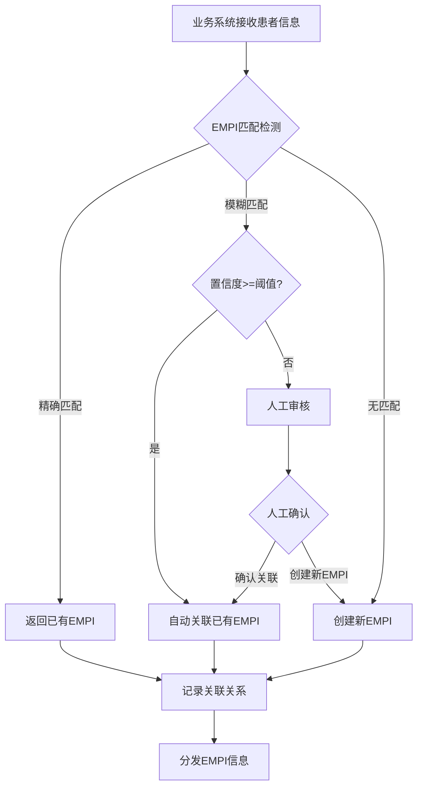
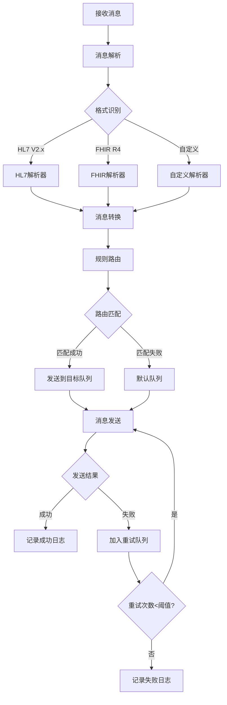
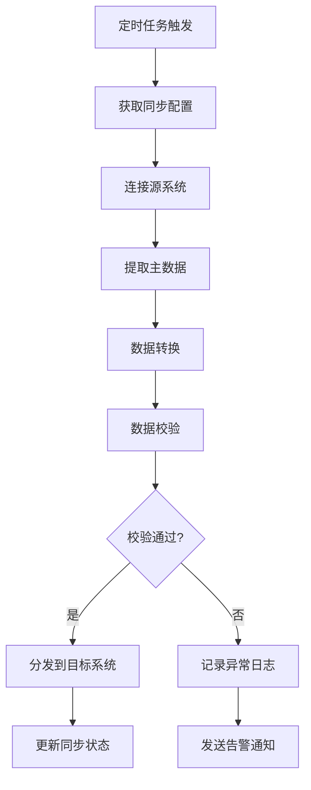

# M10 集成平台子系统 - 产品需求文档(PRD)

> **文档编号**: YUDAO-HIS-PRD-M10
> **版本**: V1.0
> **创建日期**: 2026-06-19
> **所属系统**: YUDAO-AI-HIS智慧医疗信息系统
> **子系统优先级**: P1 (重要功能)
> **参考文档**: YUDAO-HIS-PRD-001, YUDAO-HIS-FML-001, YUDAO-HIS-BPF-001, YUDAO-HIS-DD-001

---

## 1. 子系统概述

### 1.1 子系统定位

集成平台子系统是YUDAO-AI-HIS的公共服务层核心模块，提供院内/院间互联互通能力。系统实现EMPI患者主索引、主数据管理、消息引擎、接口适配器，遵循HL7 FHIR R4标准，支撑检验、影像、财务、患者服务、AI辅助等业务模块的数据交换需求。

### 1.2 业务目标

| 目标类型 | 目标描述 | 衡量指标 |
|----------|----------|----------|
| 互操作性目标 | 实现院内系统互联互通 | 接口标准化率≥95% |
| 数据一致目标 | 患者主索引准确匹配 | EMPI匹配准确率≥99% |
| 效率目标 | 消息传递实时可靠 | 消息传递延迟≤500ms |
| 合规目标 | 符合互联互通测评标准 | 通过互联互通四级甲等测评 |

### 1.3 功能范围

```
M10 集成平台
├── M10-01 EMPI管理
│   ├── 患者主索引创建（唯一标识生成）
│   ├── 重复患者检测（多维度匹配算法）
│   ├── 患者信息合并（数据融合与去重）
│   ├── EMPI查询服务（FHIR Patient资源）
│   └── 主索引同步（多系统数据同步）
├── M10-02 主数据管理
│   ├── 科室数据同步（HIS-外部系统同步）
│   ├── 人员数据同步（医生护士信息同步）
│   ├── 诊断编码同步（ICD-10编码同步）
│   ├── 主数据分发（变更事件推送）
│   └── 主数据版本管理（历史版本追溯）
├── M10-03 消息引擎
│   ├── HL7消息解析（V2.x消息解析）
│   ├── FHIR资源转换（V2转FHIR R4）
│   ├── 消息路由（基于规则的智能路由）
│   ├── 消息队列管理（RabbitMQ集成）
│   └── 消息重试与补偿（失败处理机制）
└── M10-04 接口适配
    ├── 接口配置管理（适配器配置）
    ├── 接口日志管理（全链路日志）
    ├── 接口监控告警（性能与异常监控）
    └── 外部系统对接（区域平台、医保等）
```

### 1.4 用户角色

| 角色 | 主要职责 | 使用功能 |
|------|----------|----------|
| 系统管理员 | 平台配置、监控运维 | 接口配置、日志查询、监控告警 |
| 数据管理员 | 主数据管理、数据治理 | 主数据同步、EMPI管理 |
| 运维工程师 | 系统运维、故障处理 | 接口监控、日志分析 |
| 开发人员 | 接口对接、系统集成 | 接口文档、调试工具 |

### 1.5 依赖关系

**上游依赖**:
- M09 系统管理：用户、角色、权限、数据字典

**下游影响**:
- M04 检验管理：检验数据交换
- M05 影像管理：影像数据交换
- M08 财务管理：医保接口对接
- M11 患者服务：患者门户数据交换
- M13 AI辅助：AI接口对接

---

## 2. 功能模块详细设计

### 2.1 M10-01 EMPI管理

#### 2.1.1 功能概述

EMPI（Enterprise Master Patient Index）患者主索引管理模块，为全院各业务系统提供统一的患者唯一标识服务，实现跨系统患者信息的准确匹配和数据融合。

#### 2.1.2 EMPI架构设计

```
                    ┌─────────────────────────────────────┐
                    │           EMPI服务层                 │
                    │  ┌──────────┐  ┌──────────┐         │
                    │  │ EMPI创建 │  │ EMPI查询 │         │
                    │  └──────────┘  └──────────┘         │
                    │  ┌──────────┐  ┌──────────┐         │
                    │  │ 重复检测 │  │ 信息合并 │         │
                    │  └──────────┘  └──────────┘         │
                    └─────────────────────────────────────┘
                                    │
                    ┌─────────────────────────────────────┐
                    │           匹配引擎层                 │
                    │  ┌──────────────────────────────┐  │
                    │  │ 多维度匹配算法                  │  │
                    │  │ - 身份证号精确匹配              │  │
                    │  │ - 姓名+出生日期模糊匹配         │  │
                    │  │ - 手机号辅助匹配               │  │
                    │  │ - 地址相似度匹配               │  │
                    │  └──────────────────────────────┘  │
                    └─────────────────────────────────────┘
                                    │
                    ┌─────────────────────────────────────┐
                    │           数据存储层                 │
                    │  ┌──────────┐  ┌──────────┐         │
                    │  │ EMPI主表 │  │ 匹配记录 │         │
                    │  └──────────┘  └──────────┘         │
                    │  ┌──────────┐  ┌──────────┐         │
                    │  │ 合并记录 │  │ 操作日志 │         │
                    │  └──────────┘  └──────────┘         │
                    └─────────────────────────────────────┘
```

#### 2.1.3 页面设计 - EMPI管理

```
页面布局：
┌─────────────────────────────────────────────────────────────┐
│ EMPI患者主索引管理                                           │
├─────────────────────────────────────────────────────────────┤
│ 查询条件                                                     │
│ ┌─────────────────────────────────────────────────────────┐ │
│ │ 身份证号: [__________________] 姓名: [____________]     │ │
│ │ 手机号:   [______________]   EMPI编号: [__________]     │ │
│ │ 状态:     [全部 ▼]            [查询] [重置]              │ │
│ └─────────────────────────────────────────────────────────┘ │
│                                                              │
│ 患者列表                                                     │
│ ┌────┬──────────┬────────┬──────┬──────────┬────────┬────┐ │
│ │选择│EMPI编号  │姓名    │身份证│手机号    │创建时间│状态│ │
│ ├────┼──────────┼────────┼──────┼──────────┼────────┼────┤ │
│ │ ☑ │E202606001│张三    │110***│138****000│2026-06-│有效│ │
│ │ ☐ │E202606002│李四    │310***│139****111│2026-06-│有效│ │
│ │ ☐ │E202606003│王五    │440***│137****222│2026-06-│有效│ │
│ └────┴──────────┴────────┴──────┴──────────┴────────┴────┘ │
│                                                              │
│ 操作按钮: [创建EMPI] [合并选中] [导出] [刷新]                │
│                                                              │
│ ┌─────────────────────────────────────────────────────────┐ │
│ │ EMPI详情 - E202606001                                   │ │
│ │ ┌─────────────────┬─────────────────────────────────────┐│ │
│ │ │ 基本信息        │ 关联系统                           ││ │
│ │ │ EMPI编号: E20260│ ┌────────┬──────────┬──────────┐   ││ │
│ │ │ 姓名: 张三      │ │系统    │本地ID    │关联时间  │   ││ │
│ │ │ 性别: 男        │ ├────────┼──────────┼──────────┤   ││ │
│ │ │ 出生日期:1990-01│ │HIS门诊 │P2026001  │2026-06-01│   ││ │
│ │ │ 身份证: 110***  │ │HIS住院 │I2026015  │2026-06-10│   ││ │
│ │ │ 手机号: 138**** │ │LIS     │L2026100  │2026-06-05│   ││ │
│ │ │ 地址: 北京市***  │ └────────┴──────────┴──────────┘   ││ │
│ │ └─────────────────┴─────────────────────────────────────┘│ │
│ │ [编辑] [查看合并历史] [查看操作日志] [同步到外部系统]    │ │
│ └─────────────────────────────────────────────────────────┘ │
└─────────────────────────────────────────────────────────────┘
```

#### 2.1.4 字段定义 - EMPI主索引

| 字段名 | 字段类型 | 必填 | 说明 |
|--------|----------|------|------|
| empi_id | BIGINT | 是 | EMPI主键ID（系统生成） |
| empi_no | VARCHAR(30) | 是 | EMPI编号（对外唯一标识） |
| patient_name | VARCHAR(50) | 是 | 患者姓名 |
| gender | TINYINT | 是 | 性别：1男/2女/9未知 |
| birth_date | DATE | 是 | 出生日期 |
| id_card_no | VARCHAR(18) | 否 | 身份证号（加密存储） |
| phone | VARCHAR(20) | 否 | 手机号 |
| address | VARCHAR(200) | 否 | 地址 |
| match_score | DECIMAL(5,2) | 否 | 匹配置信度分数 |
| empi_status | TINYINT | 是 | 状态：1有效/2已合并/3已注销 |
| merged_to | BIGINT | 否 | 合并目标EMPI_ID |
| create_time | DATETIME | 是 | 创建时间 |
| update_time | DATETIME | 否 | 更新时间 |

#### 2.1.5 接口设计

##### EMPI创建接口

```
接口路径: POST /api/empi
请求体:
{
  "patientName": "张三",
  "gender": 1,
  "birthDate": "1990-01-15",
  "idCardNo": "110101199001150011",
  "phone": "13800138000",
  "address": "北京市朝阳区",
  "sourceSystem": "HIS_OUTPATIENT",
  "sourcePatientId": "P2026001"
}

响应格式:
{
  "code": 200,
  "msg": "EMPI创建成功",
  "data": {
    "empiId": 10001,
    "empiNo": "E202606190001",
    "matchResult": "NEW",
    "matchScore": null,
    "existingEmpi": null
  }
}
```

##### EMPI重复检测接口

```
接口路径: POST /api/empi/match
请求体:
{
  "patientName": "张三",
  "gender": 1,
  "birthDate": "1990-01-15",
  "idCardNo": "110101199001150011",
  "phone": "13800138000"
}

响应格式:
{
  "code": 200,
  "msg": "匹配检测完成",
  "data": {
    "matchResult": "MATCHED",
    "matchScore": 0.98,
    "matchedEmpi": {
      "empiId": 10001,
      "empiNo": "E202606190001",
      "patientName": "张三"
    },
    "potentialMatches": []
  }
}
```

##### FHIR Patient资源查询接口

```
接口路径: GET /fhir/Patient/{id}
响应格式: FHIR R4 Patient资源
{
  "resourceType": "Patient",
  "id": "E202606190001",
  "identifier": [
    {
      "system": "http://hospital.com/empi",
      "value": "E202606190001"
    }
  ],
  "name": [
    {
      "use": "official",
      "text": "张三"
    }
  ],
  "gender": "male",
  "birthDate": "1990-01-15",
  "telecom": [
    {
      "system": "phone",
      "value": "13800138000",
      "use": "mobile"
    }
  ]
}
```

---

### 2.2 M10-02 主数据管理

#### 2.2.1 功能概述

主数据管理模块负责院内核心主数据（科室、人员、诊断编码等）的统一管理和分发，确保各业务系统主数据的一致性和准确性。

#### 2.2.2 页面设计 - 主数据同步

```
页面布局：
┌─────────────────────────────────────────────────────────────┐
│ 主数据管理                                                   │
├────────────┬────────────────────────────────────────────────┤
│ 数据类型   │ 同步配置                                      │
│ ┌────────┐│ ┌──────────────────────────────────────────┐  │
│ │ ☑ 科室 ││ │ 科室数据同步                              │  │
│ │ ☑ 人员 ││ │ ────────────────────────────────────────│  │
│ │ ☑ 诊断 ││ │ 同步源: [HIS主系统 ▼]                     │  │
│ │ ☐ 药品 ││ │ 同步周期: [每小时 ▼]  [立即同步]          │  │
│ │ ☐ 项目 ││ │ 目标系统: ☑ LIS ☑ PACS ☐ HIS住院 ☐ 区域  │  │
│ └────────┘│ │                                          │  │
│            │ │ 字段映射:                                 │  │
│            │ │ ┌────────────┬────────────┐             │  │
│            │ │ │ HIS字段     │ 标准字段    │             │  │
│            │ │ ├────────────┼────────────┤             │  │
│            │ │ │ dept_code   │ code       │             │  │
│            │ │ │ dept_name   │ name       │             │  │
│            │ │ │ parent_id   │ parentId   │             │  │
│            │ │ └────────────┴────────────┘             │  │
│            │ └──────────────────────────────────────────┘  │
│            │                                               │
│            │ 同步记录                                       │
│            │ ┌────┬────────┬────────┬──────┬────────┐      │
│            │ │序号│同步时间│目标系统│状态  │记录数  │      │
│            │ ├────┼────────┼────────┼──────┼────────┤      │
│            │ │ 1  │10:00:00│ LIS    │成功  │ 156    │      │
│            │ │ 2  │10:00:01│ PACS   │成功  │ 156    │      │
│            │ │ 3  │09:00:00│ LIS    │成功  │ 155    │      │
│            │ └────┴────────┴────────┴──────┴────────┘      │
└────────────┴────────────────────────────────────────────────┘
```

#### 2.2.3 字段定义 - 主数据同步配置

| 字段名 | 字段类型 | 必填 | 说明 |
|--------|----------|------|------|
| config_id | BIGINT | 是 | 配置ID |
| data_type | VARCHAR(30) | 是 | 数据类型：DEPT/STAFF/DIAG/DRUG |
| source_system | VARCHAR(50) | 是 | 源系统编码 |
| sync_period | VARCHAR(20) | 是 | 同步周期：HOURLY/DAILY/MANUAL |
| target_systems | VARCHAR(500) | 是 | 目标系统列表（JSON数组） |
| field_mapping | TEXT | 是 | 字段映射配置（JSON） |
| last_sync_time | DATETIME | 否 | 最后同步时间 |
| sync_status | TINYINT | 是 | 状态：1启用/2禁用 |
| create_time | DATETIME | 是 | 创建时间 |

---

### 2.3 M10-03 消息引擎

#### 2.3.1 功能概述

消息引擎模块提供医疗消息的标准解析、格式转换、智能路由功能，支持HL7 V2.x消息解析和FHIR R4资源转换，实现异构系统间的消息互联互通。

#### 2.3.2 消息处理流程

```
消息发送方
    │
    ↓
┌─────────────────────────────────────────────────────────────┐
│                      消息引擎                                │
│  ┌─────────────────────────────────────────────────────┐   │
│  │ 1. 消息接收                                          │   │
│  │    - TCP/HTTP/WebService                            │   │
│  │    - 消息格式识别                                    │   │
│  └─────────────────────────────────────────────────────┘   │
│                         ↓                                   │
│  ┌─────────────────────────────────────────────────────┐   │
│  │ 2. 消息解析                                          │   │
│  │    - HL7 V2.x解析                                    │   │
│  │    - FHIR R4解析                                     │   │
│  │    - 自定义格式解析                                   │   │
│  └─────────────────────────────────────────────────────┘   │
│                         ↓                                   │
│  ┌─────────────────────────────────────────────────────┐   │
│  │ 3. 格式转换                                          │   │
│  │    - HL7 V2.x → FHIR R4                             │   │
│  │    - FHIR R4 → HL7 V2.x                             │   │
│  │    - JSON/XML转换                                    │   │
│  └─────────────────────────────────────────────────────┘   │
│                         ↓                                   │
│  ┌─────────────────────────────────────────────────────┐   │
│  │ 4. 消息路由                                          │   │
│  │    - 基于消息类型路由                                │   │
│  │    - 基于内容路由                                    │   │
│  │    - 基于规则路由                                    │   │
│  └─────────────────────────────────────────────────────┘   │
│                         ↓                                   │
│  ┌─────────────────────────────────────────────────────┐   │
│  │ 5. 消息发送                                          │   │
│  │    - RabbitMQ消息队列                                │   │
│  │    - HTTP推送                                        │   │
│  │    - 失败重试与补偿                                  │   │
│  └─────────────────────────────────────────────────────┘   │
└─────────────────────────────────────────────────────────────┘
    │
    ↓
消息接收方
```

#### 2.3.3 页面设计 - 消息监控

```
页面布局：
┌─────────────────────────────────────────────────────────────┐
│ 消息引擎监控                                                  │
├─────────────────────────────────────────────────────────────┤
│ 消息统计                                                     │
│ ┌──────────┬──────────┬──────────┬──────────┬──────────┐  │
│ │今日消息  │成功      │失败      │待处理    │平均延迟  │  │
│ │ 12,580   │ 12,450   │ 130      │ 15       │ 120ms    │  │
│ └──────────┴──────────┴──────────┴──────────┴──────────┘  │
│                                                              │
│ 消息列表                                                     │
│ ┌────┬────────┬────────┬──────────┬──────┬──────┬──────┐ │
│ │序号│消息ID  │类型    │发送方    │接收方│状态  │延迟  │ │
│ ├────┼────────┼────────┼──────────┼──────┼──────┼──────┤ │
│ │ 1  │M001   │ADT^A01 │HIS门诊   │LIS   │成功  │ 85ms │ │
│ │ 2  │M002   │ORM^O01 │HIS门诊   │PACS  │成功  │ 92ms │ │
│ │ 3  │M003   │ORU^R01 │LIS       │HIS   │成功  │110ms │ │
│ │ 4  │M004   │ADT^A01 │HIS住院   │LIS   │失败  │ -    │ │
│ └────┴────────┴────────┴──────────┴──────┴──────┴──────┘ │
│                                                              │
│ 失败消息详情                                                 │
│ ┌─────────────────────────────────────────────────────────┐ │
│ │ 消息ID: M004                                            │ │
│ │ 类型: ADT^A01 (患者入院)                                │ │
│ │ 发送方: HIS住院系统                                     │ │
│ │ 接收方: LIS                                             │ │
│ │ 失败原因: 目标系统连接超时                               │ │
│ │ 重试次数: 3次                                            │ │
│ │ [查看原文] [重新发送] [标记已处理]                       │ │
│ └─────────────────────────────────────────────────────────┘ │
└─────────────────────────────────────────────────────────────┘
```

#### 2.3.4 字段定义 - 消息队列表

| 字段名 | 字段类型 | 必填 | 说明 |
|--------|----------|------|------|
| message_id | BIGINT | 是 | 消息ID |
| message_no | VARCHAR(30) | 是 | 消息编号 |
| message_type | VARCHAR(20) | 是 | 消息类型：ADT/ORM/ORU等 |
| trigger_event | VARCHAR(10) | 是 | 触发事件：A01/O01/R01等 |
| sender_system | VARCHAR(50) | 是 | 发送方系统 |
| receiver_system | VARCHAR(50) | 是 | 接收方系统 |
| original_message | TEXT | 是 | 原始消息内容 |
| transformed_message | TEXT | 否 | 转换后消息 |
| message_status | TINYINT | 是 | 状态：1待处理/2成功/3失败/4重试中 |
| retry_count | INT | 否 | 重试次数 |
| error_message | VARCHAR(500) | 否 | 错误信息 |
| process_time | DATETIME | 否 | 处理时间 |
| latency_ms | INT | 否 | 处理延迟（毫秒） |
| create_time | DATETIME | 是 | 创建时间 |

---

### 2.4 M10-04 接口适配

#### 2.4.1 功能概述

接口适配模块提供外部系统对接的适配器管理，包括接口配置、日志记录、监控告警等功能，支持多种协议和格式的接口适配。

#### 2.4.2 页面设计 - 接口配置

```
页面布局：
┌─────────────────────────────────────────────────────────────┐
│ 接口适配管理                                                  │
├────────────┬────────────────────────────────────────────────┤
│ 外部系统   │ 接口配置                                      │
│ ┌────────┐│ ┌──────────────────────────────────────────┐  │
│ │ ☑ 区域 ││ │ 区域平台接口                              │  │
│ │ ☐ 医保 ││ │ ────────────────────────────────────────│  │
│ │ ☐ 银行 ││ │ 接口类型: [HL7 CDA ▼]                     │  │
│ │ ☐ AI   ││ │ 服务地址: [http://region.health.gov.cn]  │  │
│ │ ☐ LIS  ││ │ 超时设置: [30] 秒                         │  │
│ │ ☐ PACS ││ │                                          │  │
│ └────────┘│ │ 接口列表:                                 │  │
│            │ │ ┌──────────┬────────┬────────┬────────┐    │  │
│            │ │ │接口编码  │名称    │方法    │状态    │    │  │
│            │ │ ├──────────┼────────┼────────┼────────┤    │  │
│            │ │ │IF-005-001│患者注册│POST    │启用    │    │  │
│            │ │ │IF-005-002│门诊上传│POST    │启用    │    │  │
│            │ │ │IF-005-003│住院上传│POST    │启用    │    │  │
│            │ │ │IF-005-004│检验查询│GET     │启用    │    │  │
│            │ │ └──────────┴────────┴────────┴────────┘    │  │
│            │ └──────────────────────────────────────────┘  │
│            │                                               │
│            │ [新增接口] [测试连接] [保存配置]              │
└────────────┴────────────────────────────────────────────────┘
```

#### 2.4.3 字段定义 - 接口配置表

| 字段名 | 字段类型 | 必填 | 说明 |
|--------|----------|------|------|
| interface_id | BIGINT | 是 | 接口ID |
| interface_code | VARCHAR(30) | 是 | 接口编码 |
| interface_name | VARCHAR(100) | 是 | 接口名称 |
| system_code | VARCHAR(50) | 是 | 所属系统编码 |
| interface_type | VARCHAR(20) | 是 | 接口类型：REST/SOAP/HL7/DICOM |
| service_url | VARCHAR(200) | 是 | 服务地址 |
| method | VARCHAR(10) | 是 | 请求方法：GET/POST/PUT/DELETE |
| timeout | INT | 是 | 超时时间（秒） |
| request_template | TEXT | 否 | 请求模板 |
| response_mapping | TEXT | 否 | 响应映射配置 |
| interface_status | TINYINT | 是 | 状态：1启用/2禁用 |
| create_time | DATETIME | 是 | 创建时间 |

---

## 3. 业务流程

### 3.1 EMPI创建与匹配流程



### 3.2 消息处理流程



### 3.3 主数据同步流程



---

## 4. 非功能需求

### 4.1 性能需求

| 指标 | 要求 |
|------|------|
| EMPI查询响应时间 | ≤200ms |
| 消息处理延迟 | ≤500ms |
| 消息吞吐量 | ≥1000条/秒 |
| 接口并发支持 | ≥100并发连接 |
| EMPI匹配准确率 | ≥99% |

### 4.2 安全需求

| 需求 | 标准 |
|------|------|
| 数据加密 | 敏感信息（身份证、手机号）加密存储 |
| 传输安全 | HTTPS/TLS加密传输 |
| 访问控制 | 基于RBAC的接口访问权限 |
| 审计日志 | 所有操作记录审计日志 |
| 数据备份 | 每日增量备份，每周全量备份 |

### 4.3 可用性需求

| 需求 | 标准 |
|------|------|
| 系统可用性 | ≥99.9% |
| 故障恢复时间 | ≤30分钟 |
| 数据一致性 | 消息投递保证At Least Once |
| 监控告警 | 实时监控，异常告警 |

---

## 5. 开发计划

### 5.1 Sprint规划

| Sprint | 内容 | 工期 |
|--------|------|------|
| Sprint 8 | EMPI管理（创建、匹配、合并） | 2周 |
| Sprint 8 | 主数据管理（科室、人员、诊断同步） | 1周 |
| Sprint 8 | 消息引擎（解析、转换、路由） | 2周 |
| Sprint 8 | 接口适配（配置、日志、监控） | 1周 |

---

> **编制**: YUDAO-AI-HIS产品组
> **最后更新**: 2026-06-19
