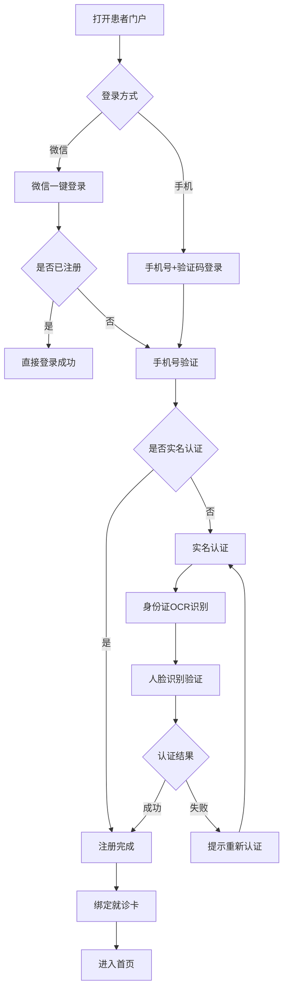
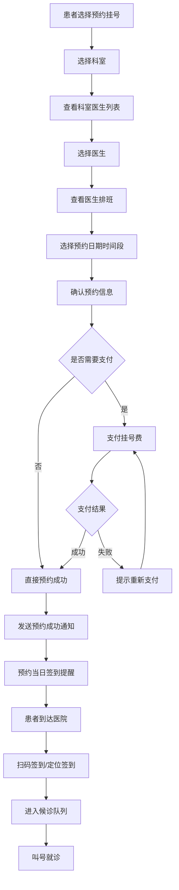

# M11 患者服务子系统 - 产品需求文档(PRD)

> **文档编号**: YUDAO-HIS-PRD-M11
> **版本**: V1.0
> **创建日期**: 2026-06-19
> **所属系统**: YUDAO-AI-HIS智慧医疗信息系统
> **子系统优先级**: P1 (重要功能)
> **参考文档**: YUDAO-HIS-PRD-001, YUDAO-HIS-FML-001, YUDAO-HIS-BPF-001, YUDAO-HIS-DD-001

---

## 1. 子系统概述

### 1.1 子系统定位

患者服务子系统是YUDAO-AI-HIS的患者自助服务入口，面向患者用户提供患者门户、预约挂号、报告查询、在线缴费、健康档案查看等自助服务功能。系统支持微信小程序、H5网页、自助机等多种接入渠道，实现患者"指尖上的医院"体验。

### 1.2 业务目标

| 目标类型 | 目标描述 | 衡量指标 |
|----------|----------|----------|
| 便捷目标 | 减少患者现场排队等待 | 线上挂号占比≥50% |
| 效率目标 | 提升医院运营效率 | 线上缴费占比≥60% |
| 体验目标 | 提升患者就医体验 | 患者满意度≥90分 |
| 数字化目标 | 建立患者健康档案 | 健康档案覆盖率100% |

### 1.3 功能范围

```
M11 患者服务
├── M11-01 患者门户
│   ├── 患者注册登录（微信授权、手机验证）
│   ├── 患者实名认证（身份证OCR、人脸识别）
│   ├── 患者信息管理（个人信息、就诊卡绑定）
│   ├── 家庭成员管理（老人、儿童代管）
│   ├── 就诊记录查询（门诊、住院历史）
│   ├── 就诊卡管理（绑卡、解绑、切换）
│   ├── 消息通知中心（预约提醒、报告通知、缴费提醒）
│   └── 常见问题FAQ
├── M11-02 预约挂号
│   ├── 科室列表查询（科室介绍、医生列表）
│   ├── 号源查询（日期、时间段、剩余号源）
│   ├── 预约挂号（选择医生、时间段、确认预约）
│   ├── 预约记录管理（查看预约、取消预约、预约提醒）
│   ├── 预约签到（扫码签到、定位签到）
│   ├── 智能分诊推荐（症状输入、科室推荐）
│   └── 预约评价（就诊后评价）
├── M11-03 报告查询
│   ├── 检验报告查询（结果查看、趋势图、异常标识）
│   ├── 影像报告查询（报告详情、影像调阅）
│   ├── 报告推送通知（报告发布自动推送）
│   ├── 报告解读（AI辅助解读）
│   ├── 报告分享（分享给家属、医生）
│   └── 报告打印预约（预约打印时间）
├── M11-04 在线缴费
│   ├── 待缴费查询（挂号费、药品费、检查费）
│   ├── 在线支付（微信支付、支付宝）
│   ├── 支付记录查询（缴费历史、电子发票）
│   ├── 费用明细查看（费用分类、医保明细）
│   ├── 退费申请（在线申请、进度查询）
│   └── 费用预警（余额不足提醒）
└── M11-05 健康档案
    ├── 健康档案查看（诊疗历史、用药记录）
    ├── 过敏史查看（过敏药物、过敏食物）
    ├── 既往病史（慢性病、手术史）
    ├── 健康指标记录（血压、血糖、体重）
    ├── 健康趋势分析（指标变化趋势）
    └── 健康建议（AI健康建议）
```

### 1.4 用户角色

| 角色 | 主要职责 | 使用功能 |
|------|----------|----------|
| 患者 | 预约挂号、缴费、查报告 | 患者门户全部功能 |
| 家属代理 | 代老人/儿童挂号缴费 | 家庭成员管理、代挂号 |
| 医院管理员 | 管理患者门户配置 | 门户配置、FAQ管理 |

### 1.5 依赖关系

**上游依赖**:
- M01 门诊管理：预约挂号执行
- M04 检验管理：检验报告查询
- M05 影像管理：影像报告查询
- M08 财务管理：在线缴费
- M09 系统管理：用户认证、消息推送
- M10 集成平台：EMPI患者主索引

**下游影响**:
- 无（患者服务为独立入口）

---

## 2. 功能模块详细设计

### 2.1 M11-01 患者门户

#### 2.1.1 功能概述

患者门户是患者服务的入口，提供患者注册登录、实名认证、信息管理、家庭成员管理、就诊记录查询等功能。

#### 2.1.2 患者注册登录流程

```
患者打开微信小程序
    │
    ├── 微信一键登录 ──→ 获取微信OpenID ──→ 判断是否已注册
    │                                      │
    │                                      ├── 已注册 ──→ 直接登录
    │                                      │
    │                                      └── 未注册 ──→ 手机号验证 ──→ 实名认证 ──→ 注册完成
    │
    └── 手机号登录 ──→ 输入手机号 ──→ 验证码验证 ──→ 登录
```

#### 2.1.3 页面设计 - 患者门户首页

```
页面布局：
┌─────────────────────────────────────────────────────────────┐
│ 患者服务                    [消息] [设置]                     │
├─────────────────────────────────────────────────────────────┤
│                                                              │
│ ┌─────────────────────────────────────────────────────────┐ │
│ │  患者: 张三              就诊卡: 12345678               │ │
│ │  [切换就诊卡]            [绑定新卡]                     │ │
│ └─────────────────────────────────────────────────────────┘ │
│                                                              │
│ ┌──────┐ ┌──────┐ ┌──────┐ ┌──────┐ ┌──────┐              │
│ │预约  │ │缴费  │ │报告  │ │档案  │ │家人  │              │
│ │挂号  │ │      │ │查询  │ │      │ │管理  │              │
│ └──────┘ └──────┘ └──────┘ └──────┘ └──────┘              │
│                                                              │
│ 今日待办                                                     │
│ ┌─────────────────────────────────────────────────────────┐ │
│ │ 预约提醒: 09:00-09:30 内科 李主任      [签到] [取消]     │ │
│ │ 待缴费: 178.00元 (挂号费+药品费)        [立即缴费]       │ │
│ │ 报告已出: 血常规(2026-06-19)            [查看详情]       │ │
│ └─────────────────────────────────────────────────────────┘ │
│                                                              │
│ 最近就诊                                                     │
│ ┌─────────────────────────────────────────────────────────┐ │
│ │ 2026-06-19 内科 诊断:上呼吸道感染                        │ │
│ │ 2026-06-15 外科 诊断:软组织挫伤                          │ │
│ │ [查看更多]                                              │ │
│ └─────────────────────────────────────────────────────────┘ │
│                                                              │
│ 消息通知                                                     │
│ ┌─────────────────────────────────────────────────────────┐ │
│ │ [预约成功] 您已成功预约内科李主任...                      │ │
│ │ [报告通知] 您的检验报告已出，请查看...                    │ │
│ │ [缴费提醒] 您有未缴费项目，请及时缴费...                  │ │
│ └─────────────────────────────────────────────────────────┘ │
│                                                              │
└─────────────────────────────────────────────────────────────┘
```

#### 2.1.4 字段定义 - 患者用户表

| 字段名 | 字段类型 | 必填 | 说明 |
|--------|----------|------|------|
| patient_user_id | BIGINT | 是 | 患者用户ID（主键） |
| wx_openid | VARCHAR(64) | 否 | 微信OpenID |
| wx_unionid | VARCHAR(64) | 否 | 微信UnionID |
| phone | VARCHAR(20) | 是 | 手机号 |
| phone_verified | TINYINT | 是 | 手机验证状态：0未验证/1已验证 |
| real_name | VARCHAR(50) | 是 | 真实姓名（实名认证后） |
| id_card_no | VARCHAR(18) | 是 | 身份证号（实名认证后） |
| real_name_verified | TINYINT | 是 | 实名认证状态：0未认证/1已认证 |
| face_verified | TINYINT | 否 | 人脸认证状态：0未认证/1已认证 |
| gender | TINYINT | 否 | 性别：1男/2女 |
| birthday | DATE | 否 | 出生日期 |
| avatar_url | VARCHAR(255) | 否 | 头像URL |
| default_card_id | BIGINT | 否 | 默认就诊卡ID |
| user_status | TINYINT | 是 | 状态：1正常/2冻结/3注销 |
| create_time | DATETIME | 是 | 创建时间 |
| last_login_time | DATETIME | 否 | 最后登录时间 |

#### 2.1.5 接口设计

##### 患者登录接口

```
接口路径: POST /api/patient/login
请求体:
{
  "loginType": "wechat",  // wechat/phone
  "wxCode": "xxx",        // 微信登录时传入
  "phone": "13800000000", // 手机登录时传入
  "verifyCode": "123456"  // 手机登录验证码
}

响应格式:
{
  "code": 200,
  "msg": "登录成功",
  "data": {
    "userId": 1001,
    "token": "xxx",
    "isNewUser": false,
    "realNameVerified": true
  }
}
```

##### 实名认证接口

```
接口路径: POST /api/patient/realname/verify
请求体:
{
  "userId": 1001,
  "realName": "张三",
  "idCardNo": "123456789012345678",
  "idCardImageFront": "base64...",
  "idCardImageBack": "base64...",
  "faceImage": "base64..."  // 人脸识别时传入
}

响应格式:
{
  "code": 200,
  "msg": "实名认证成功",
  "data": {
    "verified": true,
    "empiId": "P202606190001"  // 患者主索引ID
  }
}
```

---

### 2.2 M11-02 预约挂号

#### 2.2.1 功能概述

预约挂号模块为患者提供在线预约挂号服务，支持科室查询、号源查询、预约挂号、预约管理、预约签到等功能。

#### 2.2.2 预约挂号流程

```
患者选择预约挂号
    │
    ├── 选择科室 ──→ 查看科室介绍和医生列表
    │
    ├── 选择医生 ──→ 查看医生排班和可用号源
    │
    ├── 选择时间段 ──→ 查看号源详情（费用、剩余数量）
    │
    ├── 确认预约 ──→ 填写就诊卡、确认信息
    │
    ├── 支付挂号费 ──→ 微信支付/支付宝支付
    │
    └── 预约成功 ──→ 接收预约成功通知
    │
    └── 就诊当日 ──→ 签到 ──→ 进入候诊队列
```

#### 2.2.3 页面设计 - 预约挂号

```
页面布局：
┌─────────────────────────────────────────────────────────────┐
│ 预约挂号                                                     │
├─────────────────────────────────────────────────────────────┤
│                                                              │
│ 选择科室                                                     │
│ ┌─────────────────────────────────────────────────────────┐ │
│ │ [内科] [外科] [儿科] [妇产科] [骨科] [眼科] ...          │ │
│ │                                                         │ │
│ │ 内科                                                    │ │
│ │ ├── 消化内科 (专家号:50元 普通号:20元)                   │ │
│ │ ├── 心血管内科                                          │ │
│ │ ├── 呼吸内科                                            │ │
│ │ └── 神经内科                                            │ │
│ └─────────────────────────────────────────────────────────┘ │
│                                                              │
│ 选择医生 - 消化内科                                          │
│ ┌─────────────────────────────────────────────────────────┐ │
│ │ 李主任 (主任医师)                                       │ │
│ │ 简介: 消化系统疾病诊治专家，从事临床工作30年             │ │
│ │ ┌─────────────────────────────────────────────────────┐ │ │
│ │ │ 日期      │ 上午        │ 下午                      │ │ │
│ │ │ 2026-06-20│ 剩余10号    │ 剩余5号                   │ │ │
│ │ │ 2026-06-21│ 剩余15号    │ 已约满                    │ │ │
│ │ │ 2026-06-22│ 剩余8号     │ 剩余12号                  │ │ │
│ │ └─────────────────────────────────────────────────────┘ │ │
│ │ [选择预约]                                              │ │
│ ├─────────────────────────────────────────────────────────┤ │
│ │ 王医生 (副主任医师)                                     │ │
│ │ 简介: 胃肠疾病诊治专家                                  │ │
│ │ ┌─────────────────────────────────────────────────────┐ │ │
│ │ │ 日期      │ 上午        │ 下午                      │ │ │
│ │ │ 2026-06-20│ 剩余20号    │ 剩余15号                  │ │ │
│ │ │ 2026-06-21│ 剩余25号    │ 剩余10号                  │ │ │
│ │ └─────────────────────────────────────────────────────┘ │ │
│ │ [选择预约]                                              │ │
│ └─────────────────────────────────────────────────────────┘ │
│                                                              │
└─────────────────────────────────────────────────────────────┘
```

#### 2.2.4 字段定义 - 预约记录表

| 字段名 | 字段类型 | 必填 | 说明 |
|--------|----------|------|------|
| appointment_id | BIGINT | 是 | 预约ID（主键） |
| appointment_no | VARCHAR(30) | 是 | 预约编号 |
| patient_id | BIGINT | 是 | 患者ID |
| patient_name | VARCHAR(50) | 是 | 患者姓名 |
| patient_phone | VARCHAR(20) | 是 | 患者手机号 |
| schedule_id | BIGINT | 是 | 排班ID |
| dept_id | BIGINT | 是 | 科室ID |
| dept_name | VARCHAR(100) | 是 | 科室名称 |
| doctor_id | BIGINT | 是 | 医生ID |
| doctor_name | VARCHAR(50) | 是 | 医生姓名 |
| appointment_date | DATE | 是 | 预约日期 |
| time_slot | VARCHAR(20) | 是 | 时间段：09:00-09:30 |
| register_type | TINYINT | 是 | 挂号类型：1普通/2专家 |
| register_fee | DECIMAL(10,2) | 是 | 挂号费 |
| pay_status | TINYINT | 是 | 支付状态：0未支付/1已支付 |
| pay_time | DATETIME | 否 | 支付时间 |
| appointment_status | TINYINT | 是 | 状态：1已预约/2已签到/3已取消/4已过期 |
| sign_time | DATETIME | 否 | 签到时间 |
| cancel_time | DATETIME | 否 | 取消时间 |
| cancel_reason | VARCHAR(200) | 否 | 取消原因 |
| source | VARCHAR(20) | 是 | 预约来源：wechat/app/selfservice |
| create_time | DATETIME | 是 | 创建时间 |

#### 2.2.5 接口设计

##### 号源查询接口

```
接口路径: GET /api/patient/appointment/schedule
请求参数:
{
  "deptId": 10,
  "doctorId": 100,  // 可选，不传则查询科室所有医生
  "startDate": "2026-06-20",
  "endDate": "2026-06-27"
}

响应格式:
{
  "code": 200,
  "msg": "查询成功",
  "data": [
    {
      "doctorId": 100,
      "doctorName": "李主任",
      "doctorLevel": "主任医师",
      "schedules": [
        {
          "scheduleId": 501,
          "scheduleDate": "2026-06-20",
          "timePeriod": "上午",
          "registerType": "专家",
          "registerFee": 50.00,
          "remainingCount": 10
        }
      ]
    }
  ]
}
```

##### 创建预约接口

```
接口路径: POST /api/patient/appointment
请求体:
{
  "patientId": 100,
  "scheduleId": 501,
  "timeSlot": "09:00-09:30",
  "payType": "wechat"
}

响应格式:
{
  "code": 200,
  "msg": "预约成功",
  "data": {
    "appointmentId": 1001,
    "appointmentNo": "YY202606200001",
    "appointmentDate": "2026-06-20",
    "timeSlot": "09:00-09:30",
    "deptName": "消化内科",
    "doctorName": "李主任",
    "registerFee": 50.00
  }
}
```

---

### 2.3 M11-03 报告查询

#### 2.3.1 功能概述

报告查询模块为患者提供检验报告、影像报告的在线查询服务，支持报告详情查看、报告推送、报告解读等功能。

#### 2.3.2 报告查询流程

```
患者选择报告查询
    │
    ├── 检验报告 ──→ 查看检验报告列表
    │                │
    │                ├── 选择报告 ──→ 查看报告详情
    │                │                │
    │                │                ├── 查看结果明细（项目、结果、参考范围）
    │                │                ├── 查看异常标识（偏高/偏低）
    │                │                ├── 查看趋势图（历史对比）
    │                │                └── AI报告解读
    │
    └── 影像报告 ──→ 查看影像报告列表
                     │
                     ├── 选择报告 ──→ 查看报告详情
                     │                │
                     │                ├── 查看报告内容
                     │                ├── 查看影像图片（DICOM影像）
                     │                └── AI辅助解读
```

#### 2.3.3 页面设计 - 检验报告详情

```
页面布局：
┌─────────────────────────────────────────────────────────────┐
│ 检验报告详情                                                 │
├─────────────────────────────────────────────────────────────┤
│                                                              │
│ ┌─────────────────────────────────────────────────────────┐ │
│ │ 报告编号: LJ202606190001                                │ │
│ │ 患者姓名: 张三                                          │ │
│ │ 检验项目: 血常规                                        │ │
│ │ 检验日期: 2026-06-19                                    │ │
│ │ 报告状态: 已发布                                        │ │
│ │ 检验科室: 检验科                                        │ │
│ └─────────────────────────────────────────────────────────┘ │
│                                                              │
│ 检验结果                                                     │
│ ┌─────────────────────────────────────────────────────────┐ │
│ │ ┌────┬──────────┬──────┬────────────┬────────┬──────┐ │ │
│ │ │序号│项目名称  │结果  │参考范围    │单位    │状态  │ │ │
│ │ ├────┼──────────┼──────┼────────────┼────────┼──────┤ │ │
│ │ │ 1  │白细胞    │ 12.5 │ 4.0-10.0   │10^9/L  │偏高↑ │ │ │
│ │ │ 2  │红细胞    │ 4.5  │ 3.5-5.5    │10^12/L │正常  │ │ │
│ │ │ 3  │血红蛋白  │ 130  │ 110-160    │g/L     │正常  │ │ │
│ │ │ 4  │血小板    │ 180  │ 100-300    │10^9/L  │正常  │ │ │
│ │ │ 5  │中性粒细胞│ 8.2  │ 2.0-7.0    │10^9/L  │偏高↑ │ │ │
│ │ │ 6  │淋巴细胞  │ 1.8  │ 0.8-4.0    │10^9/L  │正常  │ │ │
│ │ └────┴──────────┴──────┴────────────┴────────┴──────┘ │ │
│ │                                                         │ │
│ │ 异常提示: 白细胞、中性粒细胞偏高，提示可能存在感染       │ │
│ └─────────────────────────────────────────────────────────┘ │
│                                                              │
│ 历史趋势                                                     │
│ ┌─────────────────────────────────────────────────────────┐ │
│ │ [白细胞趋势图]                                          │ │
│ │                                                         │ │
│ │     2026-06-15  2026-06-18  2026-06-19                  │ │
│ │        8.5        10.0       12.5  ↑                    │ │
│ └─────────────────────────────────────────────────────────┘ │
│                                                              │
│ AI报告解读                                                   │
│ ┌─────────────────────────────────────────────────────────┐ │
│ │ 根据您的检验结果，白细胞和中性粒细胞偏高，               │ │
│ │ 提示可能存在感染。建议咨询医生进行进一步检查。           │ │
│ └─────────────────────────────────────────────────────────┘ │
│                                                              │
│ [分享给家属] [预约打印] [咨询医生]                           │
│                                                              │
└─────────────────────────────────────────────────────────────┘
```

#### 2.3.4 接口设计

##### 检验报告查询接口

```
接口路径: GET /api/patient/report/lab
请求参数:
{
  "patientId": 100,
  "startDate": "2026-01-01",  // 可选
  "endDate": "2026-06-19",    // 可选
  "status": "published"       // 可选：published/all
}

响应格式:
{
  "code": 200,
  "msg": "查询成功",
  "data": [
    {
      "reportId": 1001,
      "reportNo": "LJ202606190001",
      "reportType": "血常规",
      "reportDate": "2026-06-19",
      "status": "已发布",
      "abnormalCount": 2,  // 异常项目数
      "deptName": "检验科"
    }
  ]
}
```

##### 检验报告详情接口

```
接口路径: GET /api/patient/report/lab/{reportId}
响应格式:
{
  "code": 200,
  "msg": "查询成功",
  "data": {
    "reportId": 1001,
    "reportNo": "LJ202606190001",
    "patientName": "张三",
    "reportType": "血常规",
    "reportDate": "2026-06-19",
    "items": [
      {
        "itemName": "白细胞",
        "resultCode": "WBC",
        "resultValue": "12.5",
        "unit": "10^9/L",
        "referenceMin": "4.0",
        "referenceMax": "10.0",
        "abnormalFlag": "HIGH",  // HIGH/LOW/NORMAL
        "abnormalDesc": "偏高"
      }
    ],
    "aiInterpretation": "根据您的检验结果，白细胞和中性粒细胞偏高..."
  }
}
```

---

### 2.4 M11-04 在线缴费

#### 2.4.1 功能概述

在线缴费模块为患者提供便捷的线上缴费服务，支持待缴费查询、在线支付、缴费记录查询、费用明细查看等功能。

#### 2.4.2 在线缴费流程

```
患者选择在线缴费
    │
    ├── 查看待缴费项目 ──→ 显示挂号费、药品费、检查费等
    │
    ├── 选择缴费项目 ──→ 全部缴费/部分缴费
    │
    ├── 确认缴费金额 ──→ 显示费用明细、医保报销明细
    │
    ├── 选择支付方式 ──→ 微信支付/支付宝支付
    │
    ├── 完成支付 ──→ 调用支付接口
    │
    └── 支付成功 ──→ 显示支付结果、推送电子发票
```

#### 2.4.3 页面设计 - 在线缴费

```
页面布局：
┌─────────────────────────────────────────────────────────────┐
│ 在线缴费                                                     │
├─────────────────────────────────────────────────────────────┤
│                                                              │
│ 患者: 张三      就诊卡: 12345678                             │
│                                                              │
│ 待缴费项目                                                   │
│ ┌─────────────────────────────────────────────────────────┐ │
│ │ ┌────┬────────────┬──────┬──────┬────────┬────────┐    │ │
│ │ │选择│项目名称    │单价  │数量  │金额    │类型    │    │ │
│ │ ├────┼────────────┼──────┼──────┼────────┼────────┤    │ │
│ │ │ ☑ │挂号费      │50.00 │ 1    │ 50.00  │挂号费  │    │ │
│ │ │ ☑ │诊查费      │20.00 │ 1    │ 20.00  │诊查费  │    │ │
│ │ │ ☑ │阿莫西林胶囊│ 2.00 │ 24   │ 48.00  │药品费  │    │ │
│ │ │ ☑ │布洛芬缓释胶囊│35.00│ 1   │ 35.00  │药品费  │    │ │
│ │ │ ☑ │血常规      │25.00 │ 1    │ 25.00  │检验费  │    │ │
│ │ └────┴────────────┴──────┴──────┴────────┴────────┘    │ │
│ │                                                         │ │
│ │ ┌─────────────────────────────────────────────────────┐ │ │
│ │ │费用合计: 178.00元                                   │ │ │
│ │ │医保报销: 95.00元（城镇职工医保）                     │ │ │
│ │ │个人自付: 83.00元                                    │ │ │
│ │ └─────────────────────────────────────────────────────┘ │ │
│ └─────────────────────────────────────────────────────────┘ │
│                                                              │
│ 支付方式                                                     │
│ ┌──────┐ ┌──────┐                                           │
│ │微信支付│ │支付宝│                                           │
│ └──────┘ └──────┘                                           │
│                                                              │
│                              [确认支付 83.00元]              │
│                                                              │
└─────────────────────────────────────────────────────────────┘
```

#### 2.4.4 字段定义 - 支付记录表

| 字段名 | 字段类型 | 必填 | 说明 |
|--------|----------|------|------|
| payment_id | BIGINT | 是 | 支付ID（主键） |
| payment_no | VARCHAR(30) | 是 | 支付流水号 |
| patient_id | BIGINT | 是 | 患者ID |
| patient_name | VARCHAR(50) | 是 | 患者姓名 |
| visit_id | BIGINT | 是 | 就诊ID |
| total_amount | DECIMAL(12,2) | 是 | 费用总额 |
| insurance_pay | DECIMAL(12,2) | 否 | 医保支付金额 |
| personal_pay | DECIMAL(12,2) | 是 | 个人支付金额 |
| pay_type | TINYINT | 是 | 支付方式：1微信/2支付宝/3银行卡 |
| pay_channel | VARCHAR(20) | 是 | 支付渠道：wechat/alipay |
| pay_status | TINYINT | 是 | 支付状态：0待支付/1已支付/2已退款 |
| pay_time | DATETIME | 否 | 支付时间 |
| transaction_id | VARCHAR(64) | 否 | 第三方交易号 |
| invoice_status | TINYINT | 否 | 发票状态：0未生成/1已生成 |
| invoice_no | VARCHAR(30) | 否 | 电子发票号 |
| create_time | DATETIME | 是 | 创建时间 |

#### 2.4.5 接口设计

##### 待缴费查询接口

```
接口路径: GET /api/patient/payment/pending
请求参数:
{
  "patientId": 100
}

响应格式:
{
  "code": 200,
  "msg": "查询成功",
  "data": {
    "items": [
      {
        "itemId": 1001,
        "itemName": "挂号费",
        "itemType": "REGISTRATION",
        "unitPrice": 50.00,
        "quantity": 1,
        "amount": 50.00,
        "visitId": 2001,
        "visitDate": "2026-06-19"
      }
    ],
    "totalAmount": 178.00,
    "insurancePay": 95.00,
    "personalPay": 83.00
  }
}
```

##### 在线支付接口

```
接口路径: POST /api/patient/pay
请求体:
{
  "patientId": 100,
  "itemIds": [1001, 1002, 1003],
  "payType": "wechat",
  "totalAmount": 83.00
}

响应格式:
{
  "code": 200,
  "msg": "支付发起成功",
  "data": {
    "paymentId": 1001,
    "paymentNo": "PAY202606190001",
    "payUrl": "weixin://wxpay...",  // 微信支付链接
    "qrCodeUrl": "https://..."     // 二维码链接（支付宝）
  }
}
```

---

### 2.5 M11-05 健康档案

#### 2.5.1 功能概述

健康档案模块为患者提供个人健康档案查看服务，包括诊疗历史、用药记录、过敏史、既往病史、健康指标记录等功能。

#### 2.5.3 页面设计 - 健康档案

```
页面布局：
┌─────────────────────────────────────────────────────────────┐
│ 健康档案                                                     │
├─────────────────────────────────────────────────────────────┤
│                                                              │
│ 个人信息                                                     │
│ ┌─────────────────────────────────────────────────────────┐ │
│ │ 姓名: 张三    性别: 男    年龄: 35岁                    │ │
│ │ 血型: A型     过敏史: 青霉素过敏                        │ │
│ └─────────────────────────────────────────────────────────┘ │
│                                                              │
│ 过敏史                                                       │
│ ┌─────────────────────────────────────────────────────────┐ │
│ │ 药物过敏: 青霉素、头孢类                                │ │
│ │ 食物过敏: 无                                            │ │
│ │ 其他过敏: 无                                            │ │
│ └─────────────────────────────────────────────────────────┘ │
│                                                              │
│ 既往病史                                                     │
│ ┌─────────────────────────────────────────────────────────┐ │
│ │ 慢性病: 高血压（5年）、糖尿病（3年）                     │ │
│ │ 手术史: 无                                              │ │
│ │ 住院史: 2025-12 内科住院7天                             │ │
│ └─────────────────────────────────────────────────────────┘ │
│                                                              │
│ 健康指标                                                     │
│ ┌─────────────────────────────────────────────────────────┐ │
│ │ ┌──────┬──────┬──────┬──────┬──────┬──────┬──────┐     │ │
│ │ │日期  │血压  │心率  │血糖  │体重  │BMI   │状态 │     │ │
│ │ ├──────┼──────┼──────┼──────┼──────┼──────┼──────┤     │ │
│ │ │06-19 │130/85│ 72   │ 6.5  │ 75   │24.5  │正常 │     │ │
│ │ │06-18 │125/80│ 70   │ 6.8  │ 75   │24.5  │正常 │     │ │
│ │ │06-15 │135/90│ 75   │ 7.2  │ 76   │25.0  │偏高 │     │ │
│ │ └──────┴──────┴──────┴──────┴──────┴──────┴──────┘     │ │
│ │                                                         │ │
│ │ [血压趋势图] [血糖趋势图]                               │ │
│ └─────────────────────────────────────────────────────────┘ │
│                                                              │
│ 用药记录                                                     │
│ ┌─────────────────────────────────────────────────────────┐ │
│ │ 2026-06-19 阿莫西林胶囊 0.5g 口服 每日三次 3天           │ │
│ │ 2026-06-19 布洛芬缓释胶囊 0.3g 口服 每日两次 3天         │ │
│ │ 2026-01-15 降压药 络活喜 5mg 口服 每日一次 长期          │ │
│ │ [查看更多]                                              │ │
│ └─────────────────────────────────────────────────────────┘ │
│                                                              │
│ AI健康建议                                                   │
│ ┌─────────────────────────────────────────────────────────┐ │
│ │ 根据您的健康档案分析：                                  │ │
│ │ 1. 血压近期波动较大，建议加强监测                       │ │
│ │ 2. 血糖控制良好，继续保持                               │ │
│ │ 3. BMI接近超重临界，建议控制饮食                        │ │
│ └─────────────────────────────────────────────────────────┘ │
│                                                              │
│ [记录健康指标] [导出健康档案]                                 │
│                                                              │
└─────────────────────────────────────────────────────────────┘
```

#### 2.5.4 接口设计

##### 健康档案查询接口

```
接口路径: GET /api/patient/health/profile
请求参数:
{
  "patientId": 100
}

响应格式:
{
  "code": 200,
  "msg": "查询成功",
  "data": {
    "patientId": 100,
    "patientName": "张三",
    "gender": "男",
    "age": 35,
    "bloodType": "A型",
    "allergies": [
      {
        "allergyType": "药物",
        "allergen": "青霉素",
        "severity": "高"
      }
    ],
    "chronicDiseases": [
      {
        "diseaseName": "高血压",
        "diagnosisDate": "2021-06-01",
        "duration": "5年"
      }
    ],
    "healthIndicators": [
      {
        "recordDate": "2026-06-19",
        "bloodPressure": "130/85",
        "heartRate": 72,
        "bloodGlucose": 6.5,
        "weight": 75,
        "bmi": 24.5
      }
    ]
  }
}
```

---

## 3. 业务流程

### 3.1 患者注册登录全流程



### 3.2 预约挂号流程



---

## 4. 非功能需求

### 4.1 性能需求

| 指标 | 要求 |
|------|------|
| 预约响应时间 | ≤2秒 |
| 支付响应时间 | ≤3秒 |
| 报告查询响应 | ≤2秒 |
| 并发用户支持 | ≥10000用户 |
| 日活跃用户 | ≥50000人次 |

### 4.2 安全需求

| 需求 | 标准 |
|------|------|
| 实名认证 | 必须完成实名认证才能挂号缴费 |
| 数据隐私 | 患者数据加密存储，符合隐私保护法规 |
| 支付安全 | 支付接口符合金融安全标准 |
| 登录安全 | 支持微信授权登录和短信验证码登录 |

### 4.3 渠道支持

| 渠道 | 支持方式 |
|------|----------|
| 微信小程序 | 主要渠道，全功能支持 |
| H5网页 | 全功能支持 |
| 自助机 | 部分功能支持（挂号、缴费、报告打印） |

---

## 5. 开发计划

### 5.1 Sprint规划

| Sprint | 内容 | 工期 |
|--------|------|------|
| Sprint 8-1 | 患者门户（注册登录、实名认证、信息管理） | 1周 |
| Sprint 8-2 | 预约挂号（科室查询、号源查询、预约管理） | 1.5周 |
| Sprint 8-3 | 报告查询（检验报告、影像报告） | 1周 |
| Sprint 8-4 | 在线缴费（待缴费查询、在线支付、缴费记录） | 1周 |
| Sprint 8-5 | 健康档案（档案查看、健康指标、AI建议） | 0.5周 |

---

> **编制**: YUDAO-AI-HIS产品组
> **最后更新**: 2026-06-19