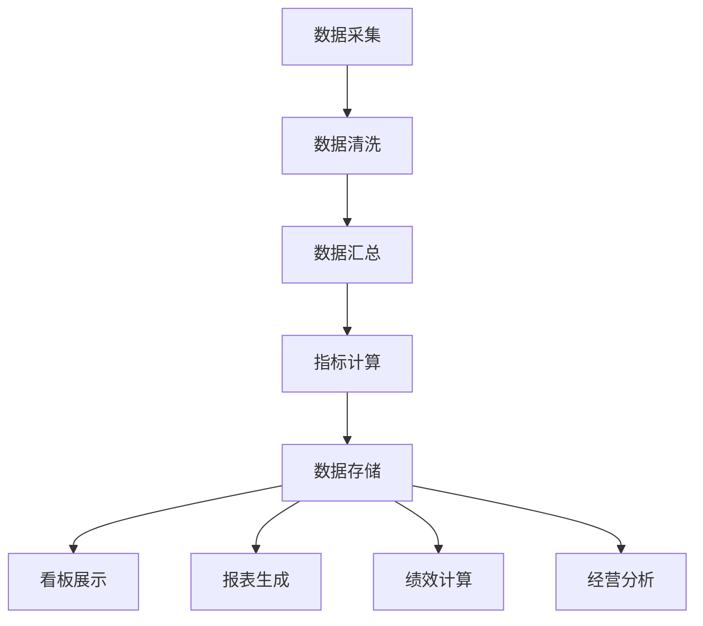

# M12 运营管理子系统 - 产品需求文档(PRD)

> **文档编号**: YUDAO-HIS-PRD-M12
> **版本**: V1.0
> **创建日期**: 2026-06-19
> **所属系统**: YUDAO-AI-HIS智慧医疗信息系统
> **子系统优先级**: P2 (增强功能)
> **参考文档**: YUDAO-HIS-PRD-001, YUDAO-HIS-FML-001, YUDAO-HIS-BPF-001, YUDAO-HIS-DD-001

---

## 1. 子系统概述

### 1.1 子系统定位

运营管理子系统面向医院管理者，提供运营数据分析、绩效管理、决策支持能力。系统整合门诊、住院、财务等业务数据，构建运营数据看板，支持多维度统计报表和绩效考评，为医院经营决策提供数据支撑。

### 1.2 业务目标

| 目标类型 | 目标描述 | 衡量指标 |
|----------|----------|----------|
| 效率目标 | 提升医院运营决策效率 | 数据查询响应时间≤5秒 |
| 管理目标 | 实现绩效数据量化管理 | 绩效数据自动采集率≥95% |
| 决策目标 | 为经营决策提供数据支撑 | 关键指标实时更新 |
| 合规目标 | 数据统计符合卫健委要求 | 报表格式符合规范 |

### 1.3 功能范围

```
M12 运营管理
├── M12-01 运营看板
│   ├── 门诊数据看板（门诊量、就诊结构、候诊时间）
│   ├── 住院数据看板（在院人数、入院/出院、床位使用）
│   ├── 床位使用率监控
│   └── 收入统计看板
├── M12-02 统计报表
│   ├── 科室工作量统计
│   ├── 医生工作量统计
│   ├── 药品消耗统计
│   └── 手术统计报表
├── M12-03 绩效管理
│   ├── 绩效指标配置
│   ├── 绩效评分计算
│   └── 绩效报表生成
└── M12-04 经营分析
    ├── 收入分析（收入构成、趋势分析）
    └── 成本分析（科室成本、项目成本）
```

### 1.4 用户角色

| 角色 | 主要职责 | 使用功能 |
|------|----------|----------|
| 院长/副院长 | 全院运营决策 | 运营看板、经营分析 |
| 科室主任 | 科室运营管理 | 科室统计、绩效管理 |
| 财务人员 | 财务数据分析 | 收入报表、成本分析 |
| 绩效专员 | 绩效考核管理 | 绩效配置、绩效评分 |
| 统计人员 | 数据统计分析 | 统计报表 |

### 1.5 依赖关系

**上游依赖**:
- M09 系统管理：用户、角色、权限、数据字典
- M01 门诊管理：门诊数据来源
- M02 住院管理：住院数据来源
- M08 财务管理：财务数据来源

**下游影响**:
- 无（数据消费方，不向其他模块推送数据）

---

## 2. 功能模块详细设计

### 2.1 M12-01 运营看板

#### 2.1.1 功能概述

运营看板模块为医院管理者提供全院运营数据的可视化展示，包括门诊数据、住院数据、床位使用率、收入统计等核心指标，支持实时监控和历史趋势分析。

#### 2.1.2 页面设计 - 运营数据看板

```
页面布局：
┌─────────────────────────────────────────────────────────────┐
│ 运营数据看板                        更新时间: 2026-06-19 10:00│
├─────────────────────────────────────────────────────────────┤
│ 核心指标                                                     │
│ ┌──────────┐ ┌──────────┐ ┌──────────┐ ┌──────────┐        │
│ │ 今日门诊 │ │ 在院人数 │ │ 床位使用率│ │ 今日收入 │        │
│ │  3,256   │ │   856    │ │  87.5%   │ │ 158.6万  │        │
│ │ ↑12.5%   │ │ ↑23人    │ │ ↑2.3%    │ │ ↑8.5%    │        │
│ └──────────┘ └──────────┘ └──────────┘ └──────────┘        │
│                                                              │
│ 门诊数据趋势（近7天）        住院数据趋势（近7天）          │
│ ┌───────────────────────┐  ┌───────────────────────┐       │
│ │      ╭─────╮          │  │      ╭─────╮          │       │
│ │ 3000─│     │          │  │ 900 ─│     │          │       │
│ │      │     │╭──╮      │  │      │     │          │       │
│ │ 2500─│     ││  │╭──╮  │  │ 800 ─│     │╭──╮      │       │
│ │      └─────┴┴──┴┴──┴──│  │      └─────┴┴──┴──────│       │
│ │   06-13 06-15 06-17   │  │   06-13 06-15 06-17   │       │
│ └───────────────────────┘  └───────────────────────┘       │
│                                                              │
│ 科室床位使用率TOP10          科室门诊量TOP10                │
│ ┌────────────────────────┐  ┌────────────────────────┐     │
│ │ 科室        使用率     │  │ 科室       门诊量      │     │
│ │ 内科一病区   98.5%    │  │ 内科门诊    856       │     │
│ │ 外科一病区   95.2%    │  │ 外科门诊    623       │     │
│ │ 妇产科       92.8%    │  │ 妇产科      512       │     │
│ │ 儿科         88.5%    │  │ 儿科        489       │     │
│ │ 骨科         85.3%    │  │ 骨科        423       │     │
│ └────────────────────────┘  └────────────────────────┘     │
│                                                              │
│ [查看更多] [导出报表] [自定义看板]                           │
└─────────────────────────────────────────────────────────────┘
```

#### 2.1.3 数据指标定义

##### 门诊数据指标

| 指标名称 | 计算公式 | 数据来源 | 更新频率 |
|----------|----------|----------|----------|
| 今日门诊量 | COUNT(挂号记录) WHERE register_date = TODAY | M01挂号管理 | 实时 |
| 日均门诊量 | AVG(门诊量) WHERE register_date IN 近7天 | M01挂号管理 | 每日 |
| 门诊增长率 | (今日门诊量 - 昨日门诊量) / 昨日门诊量 × 100% | M01挂号管理 | 每日 |
| 平均候诊时间 | AVG(就诊时间 - 挂号时间) | M01挂号管理 | 实时 |
| 门诊复诊率 | 复诊患者数 / 门诊总量 × 100% | M01挂号管理 | 每日 |

##### 住院数据指标

| 指标名称 | 计算公式 | 数据来源 | 更新频率 |
|----------|----------|----------|----------|
| 在院人数 | COUNT(住院记录) WHERE status = '在院' | M02住院管理 | 实时 |
| 今日入院 | COUNT(入院记录) WHERE admission_date = TODAY | M02住院管理 | 实时 |
| 今日出院 | COUNT(出院记录) WHERE discharge_date = TODAY | M02住院管理 | 实时 |
| 床位使用率 | 在院人数 / 开放床位数 × 100% | M02住院管理 | 实时 |
| 平均住院日 | SUM(住院天数) / 出院人数 | M02住院管理 | 每日 |

##### 收入数据指标

| 指标名称 | 计算公式 | 数据来源 | 更新频率 |
|----------|----------|----------|----------|
| 今日收入 | SUM(收费金额) WHERE payment_date = TODAY | M08财务管理 | 实时 |
| 门诊收入 | SUM(门诊收费) WHERE payment_date = TODAY | M08财务管理 | 实时 |
| 住院收入 | SUM(住院收费) WHERE payment_date = TODAY | M08财务管理 | 实时 |
| 药品收入 | SUM(药品收费) WHERE payment_date = TODAY | M08财务管理 | 实时 |
| 收入增长率 | (今日收入 - 昨日收入) / 昨日收入 × 100% | M08财务管理 | 每日 |

#### 2.1.4 接口设计

##### 运营数据查询接口

```
接口路径: GET /api/ops/dashboard
请求参数:
{
  "dataType": "OUTPATIENT|INPATIENT|BED|REVENUE",
  "period": "TODAY|WEEK|MONTH|YEAR",
  "deptId": "可选，科室ID"
}

响应格式:
{
  "code": 200,
  "msg": "查询成功",
  "data": {
    "updateTime": "2026-06-19 10:00:00",
    "indicators": [
      {
        "name": "今日门诊量",
        "value": 3256,
        "unit": "人次",
        "trend": "UP",
        "changeRate": 12.5
      }
    ],
    "trendData": [
      {"date": "2026-06-13", "value": 2856},
      {"date": "2026-06-14", "value": 3012},
      {"date": "2026-06-15", "value": 2956},
      {"date": "2026-06-16", "value": 3123},
      {"date": "2026-06-17", "value": 3089},
      {"date": "2026-06-18", "value": 2893},
      {"date": "2026-06-19", "value": 3256}
    ]
  }
}
```

---

### 2.2 M12-02 统计报表

#### 2.2.1 功能概述

统计报表模块提供多维度的业务统计分析，包括科室工作量、医生工作量、药品消耗、手术统计等，支持自定义报表和报表导出。

#### 2.2.2 页面设计 - 统计报表中心

```
页面布局：
┌─────────────────────────────────────────────────────────────┐
│ 统计报表中心                                                 │
├────────────┬────────────────────────────────────────────────┤
│ 报表分类   │ 报表列表                                      │
│ ┌────────┐│ ┌──────────────────────────────────────────┐  │
│ │ 常用报表││ │ 科室工作量统计报表                        │  │
│ ├────────┤│ │ 统计周期: [2026-06-01] 至 [2026-06-19]   │  │
│ │ 工作量  ││ │ 科室范围: [全部科室    ▼]                 │  │
│ │ 报表    ││ │                                          │  │
│ ├────────┤│ │ ┌────┬────────┬────────┬────────┬──────┐│  │
│ │ 药品   ││ │ │科室│门诊人次│住院人次│手术台次│总收入 ││  │
│ │ 报表   ││ │ ├────┼────────┼────────┼────────┼──────┤│  │
│ ├────────┤│ │ │内科│ 12,560 │  856   │   -    │256万 ││  │
│ │ 手术   ││ │ │外科│  8,960 │  623   │  456   │189万 ││  │
│ │ 报表   ││ │ │妇科│  6,230 │  412   │  234   │123万 ││  │
│ ├────────┤│ │ │儿科│  5,890 │  389   │   -    │98万  ││  │
│ │ 财务   ││ │ └────┴────────┴────────┴────────┴──────┘│  │
│ │ 报表   ││ │                                          │  │
│ └────────┘│ │ 合计: 门诊33,640人次 住院2,280人次        │  │
│            │ │                                          │  │
│            │ │ [导出Excel] [导出PDF] [打印] [保存模板]  │  │
│            │ └──────────────────────────────────────────┘  │
└────────────┴────────────────────────────────────────────────┘
```

#### 2.2.3 报表类型定义

##### 科室工作量统计报表

| 报表编号 | 报表名称 | 统计维度 | 统计指标 |
|----------|----------|----------|----------|
| RPT-DEPT-001 | 科室工作量日报 | 科室、日期 | 门诊人次、住院人次、手术台次 |
| RPT-DEPT-002 | 科室工作量月报 | 科室、月份 | 门诊人次、住院人次、平均住院日 |
| RPT-DEPT-003 | 科室收入统计 | 科室、日期 | 门诊收入、住院收入、药品收入 |

##### 医生工作量统计报表

| 报表编号 | 报表名称 | 统计维度 | 统计指标 |
|----------|----------|----------|----------|
| RPT-DOC-001 | 医生工作量日报 | 医生、科室 | 接诊人次、处方数、检查申请数 |
| RPT-DOC-002 | 医生工作量月报 | 医生、科室 | 接诊人次、手术台次、会诊次数 |
| RPT-DOC-003 | 医生排班统计 | 医生、科室 | 出勤天数、加班时长 |

##### 药品消耗统计报表

| 报表编号 | 报表名称 | 统计维度 | 统计指标 |
|----------|----------|----------|----------|
| RPT-DRUG-001 | 药品消耗日报 | 药品、科室 | 发药量、销售金额、库存量 |
| RPT-DRUG-002 | 药品消耗月报 | 药品、科室 | 消耗量、消耗金额、周转率 |
| RPT-DRUG-003 | 抗菌药物统计 | 科室、医生 | 使用量、使用率、DDD值 |

##### 手术统计报表

| 报表编号 | 报表名称 | 统计维度 | 统计指标 |
|----------|----------|----------|----------|
| RPT-SUR-001 | 手术量日报 | 科室、术者 | 手术台次、手术时长 |
| RPT-SUR-002 | 手术量月报 | 科室、术者 | 手术台次、三四级手术占比 |
| RPT-SUR-003 | 手术分级统计 | 科室、级别 | 一至四级手术台次、占比 |

#### 2.2.4 接口设计

##### 报表生成接口

```
接口路径: POST /api/ops/report/generate
请求体:
{
  "reportType": "RPT-DEPT-001",
  "startDate": "2026-06-01",
  "endDate": "2026-06-19",
  "deptIds": [10, 20, 30],
  "groupBy": "DEPT",
  "format": "JSON|EXCEL|PDF"
}

响应格式:
{
  "code": 200,
  "msg": "报表生成成功",
  "data": {
    "reportId": "RPT202606190001",
    "reportName": "科室工作量统计报表",
    "generateTime": "2026-06-19 10:30:00",
    "data": [
      {
        "deptName": "内科",
        "outpatientCount": 12560,
        "inpatientCount": 856,
        "surgeryCount": 0,
        "totalRevenue": 2560000.00
      }
    ]
  }
}
```

---

### 2.3 M12-03 绩效管理

#### 2.3.1 功能概述

绩效管理模块支持绩效指标配置、绩效评分计算、绩效报表生成，实现医护人员工作绩效的量化考核。

#### 2.3.2 页面设计 - 绩效管理

```
页面布局：
┌─────────────────────────────────────────────────────────────┐
│ 绩效管理                                         [配置] [计算]│
├─────────────────────────────────────────────────────────────┤
│ 绩效周期: [2026年6月    ▼]     考核对象: [内科      ▼]      │
├─────────────────────────────────────────────────────────────┤
│ 绩效指标权重配置                                             │
│ ┌─────────────────────────────────────────────────────────┐ │
│ │ 指标类型          指标名称            权重    目标值    │ │
│ ├─────────────────────────────────────────────────────────┤ │
│ │ 工作量指标        门诊接诊人次        30%     ≥400人次 │ │
│ │ 工作量指标        住院管理人次        20%     ≥50人次  │ │
│ │ 质量指标          病历书写合格率      15%     ≥95%     │ │
│ │ 质量指标          处方合格率          10%     ≥98%     │ │
│ │ 服务指标          患者满意度          15%     ≥90%     │ │
│ │ 效率指标          平均住院日控制      10%     ≤8天     │ │
│ └─────────────────────────────────────────────────────────┘ │
│                                                              │
│ 绩效评分结果                                                 │
│ ┌────┬────────┬────────┬────────┬────────┬────────┬──────┐│
│ │排名│ 姓名   │工作量  │ 质量   │ 服务   │ 效率   │总分  ││
│ ├────┼────────┼────────┼────────┼────────┼────────┼──────┤│
│ │ 1  │张医生  │ 28.5   │ 23.8   │ 13.5   │ 9.2    │75.0  ││
│ │ 2  │李医生  │ 26.3   │ 24.1   │ 12.8   │ 8.9    │72.1  ││
│ │ 3  │王医生  │ 25.8   │ 22.5   │ 13.2   │ 8.5    │70.0  ││
│ └────┴────────┴────────┴────────┴────────┴────────┴──────┘│
│                                                              │
│ [查看详情] [导出报表] [绩效申诉]                             │
└─────────────────────────────────────────────────────────────┘
```

#### 2.3.3 绩效指标定义

| 指标类型 | 指标名称 | 数据来源 | 计算方式 | 权重范围 |
|----------|----------|----------|----------|----------|
| 工作量 | 门诊接诊人次 | M01门诊管理 | COUNT(接诊记录) | 20-40% |
| 工作量 | 住院管理人次 | M02住院管理 | COUNT(住院记录) | 15-30% |
| 工作量 | 手术台次 | M07手术麻醉 | COUNT(手术记录) | 10-20% |
| 质量 | 病历书写合格率 | M03电子病历 | 合格病历数/总病历数 | 10-20% |
| 质量 | 处方合格率 | M06药品管理 | 合格处方数/总处方数 | 5-15% |
| 质量 | 危急值处理及时率 | M04检验管理 | 及时处理数/总数 | 5-10% |
| 服务 | 患者满意度 | M11患者服务 | 满意评分均值 | 10-20% |
| 服务 | 投诉次数 | M09系统管理 | COUNT(投诉记录) | 5-10% |
| 效率 | 平均住院日控制 | M02住院管理 | AVG(住院天数) | 5-15% |
| 效率 | 床位周转次数 | M02住院管理 | 出院人次/平均开放床位 | 5-10% |

#### 2.3.4 绩效评分计算规则

```
绩效总分 = Σ(指标得分 × 指标权重)

指标得分计算：
- 达到目标值：得分 = 满分
- 超过目标值：得分 = 满分 × (1 + 超额比例 × 奖励系数)
- 未达目标值：得分 = 满分 × (实际值 / 目标值) × 完成系数

特殊规则：
- 投诉次数为负向指标，超过目标扣分
- 危急值未及时处理按次扣分
- 医疗事故一票否决
```

---

### 2.4 M12-04 经营分析

#### 2.4.1 功能概述

经营分析模块提供收入分析、成本分析等经营决策支持功能，帮助医院管理层了解经营状况、发现经营问题、制定经营策略。

#### 2.4.2 页面设计 - 经营分析

```
页面布局：
┌─────────────────────────────────────────────────────────────┐
│ 经营分析                                                     │
├─────────────────────────────────────────────────────────────┤
│ 分析周期: [2026年上半年  ▼]     分析维度: [按科室    ▼]     │
├─────────────────────────────────────────────────────────────┤
│ 收入分析                                                     │
│ ┌─────────────────────────────────────────────────────────┐ │
│ │ 收入构成分析                    收入趋势分析             │ │
│ │ ┌─────────────────┐           ┌─────────────────────┐   │ │
│ │ │ 门诊收入 35%    │           │ 月度收入趋势图      │   │ │
│ │ │ ████████████    │           │ ╭───────────────╮   │   │ │
│ │ │ 住院收入 45%    │           │ │    ╭──╮       │   │   │ │
│ │ │ ███████████████ │           │ │    │  │╭──╮   │   │   │ │
│ │ │ 药品收入 15%    │           │ │────┴──┴┴──┴───│   │   │ │
│ │ │ █████          │           │ 1月  3月  5月      │   │ │
│ │ │ 其他收入 5%     │           └─────────────────────┘   │ │
│ │ │ ██              │                                     │ │
│ │ └─────────────────┘                                     │ │
│ └─────────────────────────────────────────────────────────┘ │
│                                                              │
│ 成本分析                                                     │
│ ┌─────────────────────────────────────────────────────────┐ │
│ │ 科室成本TOP5                    成本结构分析             │ │
│ │ ┌────────────────────────┐     ┌─────────────────────┐  │ │
│ │ │ 科室       成本(万元)  │     │ 人力成本   45%      │  │ │
│ │ │ 内科        256.8      │     │ 药品成本   30%      │  │ │
│ │ │ 外科        234.5      │     │ 设备折旧   15%      │  │ │
│ │ │ 妇科        178.3      │     │ 管理费用   10%      │  │ │
│ │ │ 儿科        156.2      │     └─────────────────────┘  │ │
│ │ │ 骨科        145.8      │                              │ │
│ │ └────────────────────────┘                              │ │
│ └─────────────────────────────────────────────────────────┘ │
│                                                              │
│ [导出分析报告] [趋势预测] [同业对比]                         │
└─────────────────────────────────────────────────────────────┘
```

#### 2.4.3 分析指标定义

##### 收入分析指标

| 指标名称 | 计算公式 | 说明 |
|----------|----------|------|
| 总收入 | 门诊收入 + 住院收入 + 其他收入 | 医院总收入 |
| 门诊收入占比 | 门诊收入 / 总收入 × 100% | 门诊收入贡献度 |
| 住院收入占比 | 住院收入 / 总收入 × 100% | 住院收入贡献度 |
| 药品收入占比 | 药品收入 / 总收入 × 100% | 药品收入依赖度 |
| 人均门诊费用 | 门诊收入 / 门诊人次 | 平均门诊消费水平 |
| 人均住院费用 | 住院收入 / 出院人次 | 平均住院消费水平 |
| 收入增长率 | (本期收入 - 上期收入) / 上期收入 × 100% | 收入增长趋势 |

##### 成本分析指标

| 指标名称 | 计算公式 | 说明 |
|----------|----------|------|
| 总成本 | 人力成本 + 药品成本 + 设备成本 + 管理成本 | 医院总成本 |
| 科室成本 | 科室人力 + 科室药品 + 科室设备 + 分摊成本 | 科室总成本 |
| 成本结构 | 各项成本 / 总成本 × 100% | 成本构成分析 |
| 收支结余 | 总收入 - 总成本 | 医院盈亏状况 |
| 成本收益率 | 总收入 / 总成本 × 100% | 投入产出比 |

---

## 3. 业务流程

### 3.1 运营数据分析流程



### 3.2 绩效管理流程

```
绩效周期开始
    │
    ├── 配置绩效指标和权重
    │
    ├── 数据采集（自动/手动）
    │       │
    │       ├── 门诊数据 → 工作量指标
    │       ├── 住院数据 → 工作量指标
    │       ├── 质量数据 → 质量指标
    │       └── 满意度数据 → 服务指标
    │
    ├── 绩效评分计算
    │       │
    │       ├── 计算各指标得分
    │       ├── 加权汇总总分
    │       └── 生成排名
    │
    ├── 绩效结果审核
    │       │
    │       ├── 科室主任确认
    │       └── 绩效委员会审批
    │
    ├── 绩效结果发布
    │       │
    │       ├── 通知相关人员
    │       └── 接受申诉
    │
    └── 绩效归档
```

---

## 4. 非功能需求

### 4.1 性能需求

| 指标 | 要求 |
|------|------|
| 看板数据加载 | ≤5秒 |
| 报表生成响应 | 日报≤30秒，月报≤60秒 |
| 绩效计算响应 | ≤3分钟（全院） |
| 数据查询响应 | ≤3秒 |
| 并发用户支持 | ≥50用户 |

### 4.2 安全需求

| 需求 | 标准 |
|------|------|
| 数据访问权限 | 按科室/角色授权 |
| 敏感数据脱敏 | 患者隐私数据脱敏展示 |
| 操作审计 | 所有查询和导出操作记录日志 |
| 数据备份 | 每日增量备份，每周全量备份 |

### 4.3 数据质量需求

| 需求 | 标准 |
|------|------|
| 数据准确性 | 统计误差≤0.1% |
| 数据时效性 | 看板数据延迟≤5分钟 |
| 数据完整性 | 核心指标缺失率≤0.5% |
| 数据一致性 | 跨模块数据一致 |

---

## 5. 开发计划

### 5.1 Sprint规划

| Sprint | 内容 | 工期 |
|--------|------|------|
| Sprint 9-1 | 运营看板（门诊、住院、床位） | 1.5周 |
| Sprint 9-2 | 统计报表（工作量、药品、手术） | 1.5周 |
| Sprint 9-3 | 绩效管理 | 1周 |

---

> **编制**: YUDAO-AI-HIS产品组
> **最后更新**: 2026-06-19
