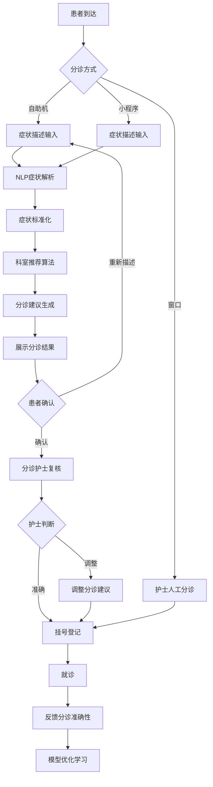

# M13 AI辅助子系统 - 产品需求文档(PRD)

> **文档编号**: YUDAO-HIS-PRD-M13
> **版本**: V1.0
> **创建日期**: 2026-06-19
> **所属系统**: YUDAO-AI-HIS智慧医疗信息系统
> **子系统优先级**: P2 (增强功能)
> **参考文档**: YUDAO-HIS-PRD-001, YUDAO-HIS-FML-001, YUDAO-HIS-MDD-001

---

## 1. 子系统概述

### 1.1 子系统定位

AI辅助子系统是YUDAO-AI-HIS的智慧医疗能力模块，提供智能分诊、影像AI辅助诊断、病历质控AI等AI辅助功能。系统利用人工智能技术提升医疗服务效率和准确性，辅助医护人员进行临床决策，但不替代医生诊断。

### 1.2 业务目标

| 目标类型 | 目标描述 | 衡量指标 |
|----------|----------|----------|
| 效率目标 | 提升分诊准确率，减少患者无效就诊 | 分诊准确率≥85% |
| 安全目标 | AI辅助检测异常，降低漏诊误诊风险 | 影像异常检出率≥95% |
| 质量目标 | 自动病历质控，提高病历规范性 | 病历缺陷检出率≥90% |
| 体验目标 | 缩短患者就诊等待时间 | 平均分诊时间≤2分钟 |

### 1.3 功能范围

```
M13 AI辅助
├── M13-01 智能分诊
│   ├── 症状智能录入（自然语言理解）
│   ├── 科室智能推荐（基于症状+历史）
│   ├── 分诊建议生成（就诊优先级）
│   ├── 分诊结果确认（人工复核）
│   └── 分诊历史学习（模型优化）
├── M13-02 影像AI
│   ├── DICOM影像AI分析
│   ├── 病灶自动识别（标注定位）
│   ├── 病灶自动测量（体积/面积）
│   ├── AI辅助报告生成（草稿）
│   ├── 影像AI结果复核（人工确认）
│   └── 影像AI置信度展示
├── M13-03 病历质控AI
│   ├── 病历完整性检查（必填项检测）
│   ├── 病历规范性检查（格式规范）
│   ├── 病历逻辑性检查（诊断一致性）
│   ├── 质控建议生成（整改建议）
│   ├── 质控评分计算（自动评分）
│   └── 质控报告生成
├── M13-04 辅助诊断建议
│   ├── 基于症状的疾病预测
│   ├── 基于检验结果的辅助诊断
│   ├── 鉴别诊断建议
│   ├── 治疗方案参考
│   └── 辅助诊断结果复核
└── M13-05 AI模型管理
    ├── AI模型配置（模型参数）
    ├── 模型版本管理（版本控制）
    ├── 模型效果评估（准确率统计）
    ├── 模型切换控制（模型启用/禁用）
    └── AI服务监控（性能监控）
```

### 1.4 用户角色

| 角色 | 主要职责 | 使用功能 |
|------|----------|----------|
| 患者 | 描述症状、获取分诊建议 | 智能分诊（小程序/自助机） |
| 分诊护士 | 确认分诊结果、调整分诊 | 智能分诊复核 |
| 医生 | 查看AI辅助结果、确认诊断 | 影像AI、辅助诊断建议 |
| 影像技师 | 执行影像检查、查看AI结果 | 影像AI |
| 放射科医生 | 复核AI结果、书写报告 | 影像AI辅助报告 |
| 质控管理员 | 病历质控管理、整改审核 | 病历质控AI |
| AI管理员 | 配置和管理AI模型 | AI模型管理 |

### 1.5 依赖关系

**上游依赖**:
- M03 电子病历：病历数据来源
- M04 检验管理：检验数据来源
- M05 影像管理：影像数据来源
- M10 集成平台：AI接口对接

**下游影响**:
- M01 门诊管理：智能分诊结果
- M02 住院管理：病历质控反馈
- M03 电子病历：质控建议

### 1.6 AI辅助原则

| 原则 | 说明 |
|------|------|
| 辅助而非替代 | AI结果仅供参考，医生必须独立判断并确认 |
| 置信度透明 | 所有AI结果必须展示置信度/可信度指标 |
| 必须人工复核 | 关键AI结果必须经人工复核确认后生效 |
| 结果可追溯 | AI分析过程和结果必须完整记录，可追溯 |
| 模型可解释 | AI模型应具备可解释性，提供决策依据 |
| 持续学习优化 | AI模型应根据反馈数据持续优化改进 |

---

## 2. 功能模块详细设计

### 2.1 M13-01 智能分诊

#### 2.1.1 功能概述

智能分诊模块利用自然语言处理(NLP)和机器学习技术，根据患者描述的症状智能推荐就诊科室，提供分诊建议。支持多种输入方式（文字、语音），提供分诊优先级建议。

#### 2.1.2 智能分诊流程

```
患者到达
    │
    ├── 自助机/小程序 ──→ 症状描述输入
    │                       │
    │                       ↓
    │                  NLP症状解析
    │                       │
    │                       ↓
    │                  症状标准化映射
    │                       │
    │                       ↓
    │                  科室推荐算法
    │                       │
    │                       ↓
    │                  分诊建议生成
    │                       │
    │                       ↓
    │                  分诊护士确认
    │                       │
    ├── 窗口人工分诊 ────────┤
    │                       │
    │                       ↓
    │                   挂号登记
```

#### 2.1.3 页面设计 - 智能分诊（患者端）

```
页面布局（微信小程序/自助机）：
┌─────────────────────────────────────────────────────────────┐
│ 智能分诊助手                                                 │
├─────────────────────────────────────────────────────────────┤
│ 请描述您的症状                                               │
│ ┌─────────────────────────────────────────────────────────┐ │
│ │ 您哪里不舒服？请详细描述症状...                          │ │
│ │                                                         │ │
│ │ [语音输入] 🎤                                           │ │
│ │                                                         │ │
│ │ 示例：我最近几天头痛，有点发烧，还咳嗽                   │ │
│ └─────────────────────────────────────────────────────────┘ │
│                                                              │
│ 常见症状快速选择                                             │
│ ┌──────┐ ┌──────┐ ┌──────┐ ┌──────┐ ┌──────┐             │
│ │头痛  │ │发热  │ │咳嗽  │ │腹痛  │ │恶心  │             │
│ └──────┘ └──────┘ └──────┘ └──────┘ └──────┘             │
│ ┌──────┐ ┌──────┐ ┌──────┐ ┌──────┐ ┌──────┐             │
│ │胸闷  │ │腹泻  │ │皮疹  │ │头晕  │ │腰痛  │             │
│ └──────┘ └──────┘ └──────┘ └──────┘ └──────┘             │
│                                                              │
│                              [开始智能分诊]                  │
└─────────────────────────────────────────────────────────────┘

分诊结果页面：
┌─────────────────────────────────────────────────────────────┐
│ 分诊建议                                                     │
├─────────────────────────────────────────────────────────────┤
│ 根据您描述的症状分析：                                       │
│                                                              │
│ 主要症状：发热、咳嗽、头痛                                   │
│ 伴随症状：可能的上呼吸道感染                                 │
│                                                              │
│ 推荐科室：                                                   │
│ ┌─────────────────────────────────────────────────────────┐ │
│ │ ★ 内科（推荐指数：95%）                                 │ │
│ │   适合：发热、咳嗽等呼吸道症状                           │ │
│ │   [选择内科挂号]                                         │ │
│ └─────────────────────────────────────────────────────────┘ │
│                                                              │
│ 其他可选科室：                                               │
│ ┌─────────────────────────────────────────────────────────┐ │
│ │ ○ 呼吸内科（推荐指数：80%）                             │ │
│ │ ○ 发热门诊（推荐指数：70%）                             │ │
│ └─────────────────────────────────────────────────────────┘ │
│                                                              │
│ 分诊优先级：普通                                             │
│ AI置信度：95%                                                │
│                                                              │
│ ⚠️ 提示：AI分诊仅供参考，如有紧急情况请直接就诊急诊         │
│                                                              │
│ [确认分诊] [重新描述症状] [人工咨询]                         │
└─────────────────────────────────────────────────────────────┘
```

#### 2.1.4 字段定义 - 分诊记录

| 字段名 | 字段类型 | 必填 | 说明 |
|--------|----------|------|------|
| triage_id | BIGINT | 是 | 分诊ID（主键） |
| triage_no | VARCHAR(30) | 是 | 分诊编号 |
| patient_id | BIGINT | 是 | 患者ID |
| patient_name | VARCHAR(50) | 是 | 患者姓名 |
| symptom_text | TEXT | 是 | 原始症状描述文本 |
| symptom_codes | VARCHAR(500) | 否 | 标准化症状编码（JSON数组） |
| symptom_entities | TEXT | 否 | NLP提取的症状实体（JSON） |
| recommended_dept_id | BIGINT | 是 | 推荐科室ID |
| recommended_dept_name | VARCHAR(100) | 是 | 推荐科室名称 |
| confidence_score | DECIMAL(5,2) | 是 | AI置信度（0-100） |
| alternative_depts | TEXT | 否 | 可选科室列表（JSON） |
| triage_level | TINYINT | 是 | 分诊优先级：1普通/2优先/3紧急 |
| ai_model_id | BIGINT | 是 | AI模型ID |
| ai_model_version | VARCHAR(20) | 是 | 模型版本 |
| nurse_confirm | TINYINT | 否 | 护士确认：0未确认/1已确认 |
| nurse_id | BIGINT | 否 | 确认护士ID |
| confirm_time | DATETIME | 否 | 确认时间 |
| actual_dept_id | BIGINT | 否 | 实际挂号科室ID |
| is_correct | TINYINT | 否 | 分诊是否正确：0否/1是 |
| feedback_text | VARCHAR(500) | 否 | 反馈意见 |
| create_time | DATETIME | 是 | 创建时间 |
| channel | TINYINT | 是 | 分诊渠道：1小程序/2自助机/3窗口 |

#### 2.1.5 接口设计

##### 智能分诊接口

```
接口路径: POST /api/ai/triage
请求体:
{
  "patientId": 1001,
  "symptomText": "我最近几天头痛，有点发烧，还咳嗽",
  "channel": 1
}

响应格式:
{
  "code": 200,
  "msg": "分诊分析完成",
  "data": {
    "triageId": 10001,
    "triageNo": "TR202606190001",
    "symptomEntities": [
      {"entity": "头痛", "code": "S001", "confidence": 0.95},
      {"entity": "发热", "code": "S002", "confidence": 0.90},
      {"entity": "咳嗽", "code": "S003", "confidence": 0.92}
    ],
    "recommendedDept": {
      "deptId": 10,
      "deptName": "内科",
      "confidenceScore": 95.0
    },
    "alternativeDepts": [
      {"deptId": 15, "deptName": "呼吸内科", "confidenceScore": 80.0},
      {"deptId": 20, "deptName": "发热门诊", "confidenceScore": 70.0}
    ],
    "triageLevel": 1,
    "aiModelVersion": "v2.1.0"
  }
}
```

##### 分诊确认接口

```
接口路径: POST /api/ai/triage/confirm/{triageId}
请求体:
{
  "nurseId": 100,
  "actualDeptId": 10,
  "isCorrect": true,
  "feedbackText": "分诊准确"
}
```

---

### 2.2 M13-02 影像AI

#### 2.2.1 功能概述

影像AI模块对DICOM影像进行自动分析，识别病灶并标注定位，计算病灶尺寸，生成AI辅助报告草稿。支持多种影像类型（CT、MRI、X线、超声），检测结果供影像医生复核确认。

#### 2.2.2 影像AI分析流程

```
影像上传
    │
    ↓
影像预处理（标准化、增强）
    │
    ↓
AI模型推理（病灶检测）
    │
    ├── 病灶识别 ──→ 类型分类
    │
    ├── 病灶定位 ──→ 位置标注
    │
    ├── 病灶测量 ──→ 体积/面积计算
    │
    ↓
AI结果置信度计算
    │
    ↓
AI辅助报告草稿生成
    │
    ↓
影像医生复核确认
    │
    ├── 确认 ──→ 合并入正式报告
    │
    └── 修改 ──→ 调整AI结果
```

#### 2.2.3 页面设计 - 影像AI分析

```
页面布局：
┌─────────────────────────────────────────────────────────────┐
│ 影像AI辅助诊断                               影像ID: CT001 │
├─────────────────────────────────────────────────────────────┤
│ 影像查看                     │ AI分析结果                  │
│ ┌─────────────────────────┐│ ┌──────────────────────────┐│
│ │                         ││ │ AI检测结果：              ││
│ │   [DICOM影像显示]       ││ │                          ││
│ │                         ││ │ 检测到 2 个可疑病灶：     ││
│ │   病灶标注 overlay      ││ │                          ││
│ │                         ││ │ 1. 右肺上叶结节           ││
│ │   [病灶1] 红色标注      ││ │    位置：右肺上叶         ││
│ │   [病灶2] 黄色标注      ││ │    大小：12mm×10mm       ││
│ │                         ││ │    AI判断：可疑恶性      ││
│ │                         ││ │    置信度：85%            ││
│ │                         ││ │                          ││
│ │                         ││ │ 2. 左肺下叶斑片影         ││
│ │                         ││ │    位置：左肺下叶         ││
│ │                         ││ │    大小：8mm×6mm         ││
│ │                         ││ │    AI判断：炎症可能      ││
│ │                         ││ │    罹信度：75%            ││
│ └─────────────────────────┘│ │                          ││
│                              │ │ AI辅助报告草稿：          ││
│ [窗宽窗位调整] [测量工具]   │ │ ┌────────────────────┐   ││
│ [标注开关] [原始影像]       │ │ │ 检查所见：          │   ││
│                              │ │ │ 右肺上叶可见结节影 │   ││
│                              │ │ │ 大小约12mm×10mm... │   ││
│                              │ │ │                    │   ││
│                              │ │ │ 诊断建议：          │   ││
│                              │ │ │ 1. 右肺结节，建议 │   ││
│                              │ │ │    进一步检查...   │   ││
│                              │ │ └────────────────────┘   ││
│                              │ │                          ││
│                              │ │ [采用AI报告] [手动编辑] ││
│                              │ └──────────────────────────┘│
│                              │                              │
│                              │ 复核确认                     │
│                              │ ┌──────────────────────────┐│
│                              │ │ 医生复核意见：            ││
│                              │ │ [____________________]    ││
│                              │ │                          ││
│                              │ │ [确认AI结果] [调整结果] ││
│                              │ │ [忽略AI结果]             ││
│                              │ └──────────────────────────┘│
└─────────────────────────────┴────────────────────────────────┘
```

#### 2.2.4 字段定义 - 影像AI结果

| 字段名 | 字段类型 | 必填 | 说明 |
|--------|----------|------|------|
| ai_result_id | BIGINT | 是 | AI结果ID（主键） |
| study_id | BIGINT | 是 | 影像检查ID |
| series_id | BIGINT | 否 | 影像序列ID |
| ai_model_id | BIGINT | 是 | AI模型ID |
| ai_model_type | VARCHAR(50) | 是 | 模型类型：LUNG_NODULE/CT_BRAIN等 |
| ai_model_version | VARCHAR(20) | 是 | 模型版本 |
| lesion_count | INT | 是 | 检测病灶数量 |
| lesion_details | TEXT | 是 | 病灶详情（JSON数组） |
| ai_report_draft | TEXT | 否 | AI辅助报告草稿 |
| overall_confidence | DECIMAL(5,2) | 是 | 总体置信度 |
| analysis_time | DATETIME | 是 | 分析时间 |
| analysis_duration | INT | 是 | 分析耗时（秒） |
| doctor_confirm | TINYINT | 否 | 医生确认：0未确认/1已确认/2已调整 |
| doctor_id | BIGINT | 否 | 确认医生ID |
| confirm_time | DATETIME | 否 | 确认时间 |
| confirm_notes | VARCHAR(500) | 否 | 确认备注 |
| is_adopted | TINYINT | 否 | 是否采用：0否/1部分采用/2完全采用 |
| feedback_score | TINYINT | 否 | 反馈评分：1-5分 |
| create_time | DATETIME | 是 | 创建时间 |

#### 2.2.5 接口设计

##### 影像AI分析接口

```
接口路径: POST /api/ai/imaging
请求体:
{
  "studyId": 1001,
  "seriesId": 100,
  "imageType": "CT_CHEST",
  "priority": "NORMAL"
}

响应格式:
{
  "code": 200,
  "msg": "AI分析完成",
  "data": {
    "aiResultId": 10001,
    "lesionCount": 2,
    "lesionDetails": [
      {
        "lesionId": 1,
        "type": "NODULE",
        "location": "右肺上叶",
        "size": {"width": 12.0, "height": 10.0, "unit": "mm"},
        "aiJudgment": "可疑恶性",
        "confidence": 85.0,
        "coordinates": {"x": 120, "y": 80, "z": 45}
      },
      {
        "lesionId": 2,
        "type": "PATCH",
        "location": "左肺下叶",
        "size": {"width": 8.0, "height": 6.0, "unit": "mm"},
        "aiJudgment": "炎症可能",
        "confidence": 75.0,
        "coordinates": {"x": 200, "y": 150, "z": 60}
      }
    ],
    "aiReportDraft": "检查所见：右肺上叶可见结节影...",
    "overallConfidence": 80.0,
    "analysisDuration": 5
  }
}
```

##### AI结果确认接口

```
接口路径: POST /api/ai/imaging/confirm/{aiResultId}
请求体:
{
  "doctorId": 100,
  "confirmStatus": 1,
  "isAdopted": 2,
  "confirmNotes": "AI分析结果准确",
  "feedbackScore": 5
}
```

---

### 2.3 M13-03 病历质控AI

#### 2.3.1 功能概述

病历质控AI模块对病历进行自动质量检查，包括完整性检查、规范性检查、逻辑性检查，生成质控建议和质控评分，辅助质控管理员进行病历质量管理。

#### 2.3.2 病历质控流程

```
病历提交
    │
    ↓
AI质控分析
    │
    ├── 完整性检查 ──→ 必填项检测
    │
    ├── 规范性检查 ──→ 格式规范检测
    │
    ├── 逻辑性检查 ──→ 诊断一致性检测
    │
    ↓
质控缺陷识别
    │
    ↓
质控建议生成
    │
    ↓
质控评分计算
    │
    ↓
质控报告生成
    │
    ↓
质控管理员审核
    │
    ├── 通过 ──→ 病历归档
    │
    └── 整改 ──→ 返回医生修改
```

#### 2.3.3 页面设计 - 病历质控AI

```
页面布局：
┌─────────────────────────────────────────────────────────────┐
│ 病历质控AI分析                               病历ID: EMR001│
├─────────────────────────────────────────────────────────────┤
│ 病历内容                     │ AI质控结果                  │
│ ┌─────────────────────────┐│ ┌──────────────────────────┐│
│ │ 主诉：发热3天，咳嗽2天 ││ │ 质控评分：85分            ││
│ │                         ││ │ 质控等级：良好            ││
│ │ 现病史：患者3天前出现 ││ │                          ││
│ │ 发热，体温最高38.5℃...││ │ 完整性检查：              ││
│ │                         ││ │ ┌────────────────────┐   ││
│ │ 既往史：高血压病史5年 ││ │ │ ✓ 主诉：完整       │   ││
│ │                         ││ │ │ ✓ 现病史：完整     │   ││
│ │ 体格检查：体温38.5℃...││ │ │ ✓ 既往史：完整     │   ││
│ │                         ││ │ │ ⚠ 过敏史：缺失     │   ││
│ │ 诊断：急性上呼吸道感染 ││ │ │ ✓ 体格检查：完整   │   ││
│ │                         ││ │ │ ✓ 诊断：完整       │   ││
│ │ 处方：阿莫西林胶囊... ││ │ └────────────────────┘   ││
│ │                         ││ │                          ││
│ │                         ││ │ 规范性检查：              ││
│ │                         ││ │ ┌────────────────────┐   ││
│ │                         ││ │ │ ⚠ 主诉格式不规范  │   ││
│ │                         ││ │ │   建议：主诉应包 │   ││
│ │                         ││ │ │   含部位、性质、 │   ││
│ │                         ││ │ │   时间三要素      │   ││
│ │                         ││ │ │ ✓ 现病史格式规范  │   ││
│ │                         ││ │ │ ✓ 诊断编码正确    │   ││
│ │                         ││ │ └────────────────────┘   ││
│ │                         ││ │                          ││
│ │                         ││ │ 逻辑性检查：              ││
│ │                         ││ │ ┌────────────────────┐   ││
│ │                         ││ │ │ ✓ 诊断与症状一致  │   ││
│ │                         ││ │ │ ⚠ 处方与诊断需 │   ││
│ │                         ││ │ │   关联说明        │   ││
│ │                         ││ │ └────────────────────┘   ││
│ └─────────────────────────┘│ │                          ││
│                              │ │ 质控建议：                ││
│                              │ │ 1. 补充过敏史信息         ││
│                              │ │ 2. 规范主诉书写格式       ││
│                              │ │ 3. 加强处方诊断关联       ││
│                              │ │                          ││
│                              │ │ [查看详细报告]            ││
│                              │ └──────────────────────────┘│
│                              │                              │
│                              │ 复核操作                     │
│                              │ ┌──────────────────────────┐│
│                              │ │ [通过] [整改] [忽略]     ││
│                              │ │ 整改意见：[__]           ││
│                              │ │ [提交复核结果]           ││
│                              │ └──────────────────────────┘│
└─────────────────────────────┴────────────────────────────────┘
```

#### 2.3.4 字段定义 - 病历质控AI结果

| 字段名 | 字段类型 | 必填 | 说明 |
|--------|----------|------|------|
| qc_result_id | BIGINT | 是 | 质控结果ID（主键） |
| emr_id | BIGINT | 是 | 病历ID |
| patient_id | BIGINT | 是 | 患者ID |
| encounter_id | BIGINT | 是 | 就诊ID |
| ai_model_id | BIGINT | 是 | AI模型ID |
| ai_model_version | VARCHAR(20) | 是 | 模型版本 |
| qc_score | DECIMAL(5,2) | 是 | 质控评分（0-100） |
| qc_level | TINYINT | 是 | 质控等级：1优秀/2良好/3合格/4不合格 |
| completeness_check | TEXT | 是 | 完整性检查结果（JSON） |
| conformity_check | TEXT | 是 | 规范性检查结果（JSON） |
| logic_check | TEXT | 是 | 逻辑性检查结果（JSON） |
| defect_count | INT | 是 | 缺陷数量 |
| defect_details | TEXT | 是 | 缺陷详情（JSON数组） |
| qc_suggestions | TEXT | 是 | 质控建议（JSON数组） |
| qc_report | TEXT | 否 | 质控报告 |
| analysis_time | DATETIME | 是 | 分析时间 |
| qc_admin_confirm | TINYINT | 否 | 质控员确认：0未确认/1已确认 |
| qc_admin_id | BIGINT | 否 | 确认质控员ID |
| confirm_time | DATETIME | 否 | 确认时间 |
| qc_status | TINYINT | 是 | 状态：1待审核/2通过/3整改 |
| create_time | DATETIME | 是 | 创建时间 |

#### 2.3.5 接口设计

##### 病历质控AI分析接口

```
接口路径: POST /api/ai/emr/qc
请求体:
{
  "emrId": 1001,
  "encounterId": 100
}

响应格式:
{
  "code": 200,
  "msg": "质控分析完成",
  "data": {
    "qcResultId": 10001,
    "qcScore": 85.0,
    "qcLevel": 2,
    "completenessCheck": {
      "passed": ["主诉", "现病史", "既往史", "体格检查", "诊断"],
      "failed": ["过敏史"]
    },
    "conformityCheck": {
      "passed": ["现病史格式", "诊断编码"],
      "failed": [{"item": "主诉格式", "reason": "缺少部位描述", "suggestion": "主诉应包含部位、性质、时间三要素"}]
    },
    "logicCheck": {
      "passed": ["诊断与症状一致性"],
      "failed": [{"item": "处方诊断关联", "reason": "处方药品与诊断缺少直接关联说明"}]
    },
    "defectCount": 3,
    "qcSuggestions": [
      "补充过敏史信息",
      "规范主诉书写格式",
      "加强处方诊断关联说明"
    ]
  }
}
```

---

### 2.4 M13-04 辅助诊断建议

#### 2.4.1 功能概述

辅助诊断建议模块基于患者的症状、检验结果、影像结果等信息，提供可能的诊断建议、鉴别诊断参考，辅助医生进行临床诊断决策。所有建议仅供参考，医生必须独立判断确认。

#### 2.4.2 辅助诊断流程

```
患者就诊
    │
    ↓
数据采集（症状、检验、影像）
    │
    ↓
AI综合分析
    │
    ├── 症状分析 ──→ 症状特征提取
    │
    ├── 检验分析 ──→ 异常指标识别
    │
    ├── 影像分析 ──→ 影像特征关联
    │
    ↓
疾病预测模型
    │
    ↓
诊断建议生成
    │
    ├── 可能诊断列表
    │
    ├── 鉴别诊断建议
    │
    ├── 诊断置信度
    │
    ↓
医生查看并判断
    │
    ├── 确认 ──→ 记录AI辅助结果
    │
    └── 忽略 ──→ 医生独立诊断
```

#### 2.4.3 页面设计 - 辅助诊断建议

```
页面布局（医生工作站侧边栏）：
┌─────────────────────────────────────────────────────────────┐
│ AI辅助诊断建议                                               │
├─────────────────────────────────────────────────────────────┤
│ 患者信息                                                     │
│ 张三 男 35岁 门诊号：OP202606190001                         │
│                                                              │
│ 分析依据                                                     │
│ ┌─────────────────────────────────────────────────────────┐ │
│ │ 症状：发热、咳嗽、头痛                                   │ │
│ │ 检验：白细胞升高、中性粒细胞升高                         │ │
│ │ 影像：胸部X线未见明显异常                               │ │
│ └─────────────────────────────────────────────────────────┘ │
│                                                              │
│ 诊断建议                                                     │
│ ┌─────────────────────────────────────────────────────────┐ │
│ │ ★ 急性上呼吸道感染（置信度：90%）                       │ │
│ │   ICD-10: J00                                           │ │
│ │   [采用此诊断]                                          │ │
│ │                                                         │ │
│ │ ○ 急性支气管炎（置信度：75%）                           │ │
│ │   ICD-10: J20                                           │ │
│ │   [查看详情]                                            │ │
│ │                                                         │ │
│ │ ○ 流行性感冒（置信度：60%）                             │ │
│ │   ICD-10: J11                                           │ │
│ │   [查看详情]                                            │ │
│ └─────────────────────────────────────────────────────────┘ │
│                                                              │
│ 鉴别诊断建议                                                 │
│ ┌─────────────────────────────────────────────────────────┐ │
│ │ 1. 细菌性肺炎：建议胸部CT进一步排查                     │ │
│ │ 2. 支原体感染：建议支原体抗体检测                       │ │
│ └─────────────────────────────────────────────────────────┘ │
│                                                              │
│ 治疗方案参考                                                 │
│ ┌─────────────────────────────────────────────────────────┐ │
│ │ 休息、多饮水                                            │ │
│ │ 对症治疗：解热镇痛、止咳化痰                            │ │
│ │ 抗感染治疗（如有细菌感染证据）                          │ │
│ └─────────────────────────────────────────────────────────┘ │
│                                                              │
│ ⚠️ 提示：AI诊断仅供参考，请医生独立判断确认                 │
│                                                              │
│ [采用AI建议] [忽略AI建议] [反馈AI结果]                       │
└─────────────────────────────────────────────────────────────┘
```

---

### 2.5 M13-05 AI模型管理

#### 2.5.1 功能概述

AI模型管理模块提供AI模型的配置、版本管理、效果评估、启用禁用控制等功能，确保AI服务的稳定性和可控性。

#### 2.5.2 页面设计 - AI模型管理

```
页面布局：
┌─────────────────────────────────────────────────────────────┐
│ AI模型管理                                                   │
├─────────────────────────────────────────────────────────────┤
│ 模型列表                                                     │
│ ┌────┬────────────┬────────┬──────┬──────┬────────┬────┐ │
│ │编号│模型名称    │类型    │版本  │状态  │准确率  │操作│ │
│ ├────┼────────────┼────────┼──────┼──────┼────────┼────┤ │
│ │001 │智能分诊模型│分诊    │v2.1.0│启用  │92.5%   │详情│ │
│ │002 │肺结节检测 │影像    │v1.3.0│启用  │95.0%   │详情│ │
│ │003 │脑卒中检测 │影像    │v1.2.0│启用  │93.5%   │详情│ │
│ │004 │病历质控   │质控    │v1.0.0│启用  │90.0%   │详情│ │
│ │005 │辅助诊断   │诊断    │v2.0.0│测试  │85.0%   │详情│ │
│ └────┴────────────┴────────┴──────┴──────┴────────┴────┘ │
│                                                              │
│ 模型详情                                                     │
│ ┌─────────────────────────────────────────────────────────┐ │
│ │ 模型名称：智能分诊模型                                   │ │
│ │ 模型类型：TRIAGE                                         │ │
│ │ 当前版本：v2.1.0                                         │ │
│ │ 启用状态：启用                                           │ │
│ │                                                         │ │
│ │ 性能指标：                                               │ │
│ │ ┌────────────────────────────────────────────────────┐ │ │
│ │ │ 准确率：92.5%                                      │ │ │
│ │ │ 置信度分布：高置信度(>80%)占比85%                  │ │ │
│ │ │ 日均调用：500次                                    │ │ │
│ │ │ 平均响应时间：1.5秒                                │ │ │
│ │ │ 用户满意度：4.2/5.0                                │ │ │
│ │ └────────────────────────────────────────────────────┘ │ │
│ │                                                         │ │
│ │ 版本历史：                                               │ │
│ │ v2.1.0 (当前) - 优化分诊准确率                         │ │
│ │ v2.0.0 - 增加科室推荐置信度                             │ │
│ │ v1.0.0 - 初始版本                                       │ │
│ │                                                         │ │
│ │ [启用/禁用] [切换版本] [效果评估] [配置参数]            │ │
│ └─────────────────────────────────────────────────────────┘ │
│                                                              │
│ [新增模型] [刷新统计]                                        │
└─────────────────────────────────────────────────────────────┘
```

#### 2.5.3 字段定义 - AI模型配置

| 字段名 | 字段类型 | 必填 | 说明 |
|--------|----------|------|------|
| model_id | BIGINT | 是 | 模型ID（主键） |
| model_name | VARCHAR(100) | 是 | 模型名称 |
| model_type | VARCHAR(50) | 是 | 模型类型：TRIAGE/IMAGING/QC/DIAGNOSIS |
| model_version | VARCHAR(20) | 是 | 当前版本 |
| model_status | TINYINT | 是 | 状态：1启用/2禁用/3测试 |
| model_endpoint | VARCHAR(200) | 是 | API端点地址 |
| model_params | TEXT | 否 | 模型参数配置（JSON） |
| accuracy_rate | DECIMAL(5,2) | 否 | 准确率 |
| avg_response_time | INT | 否 | 平均响应时间（毫秒） |
| daily_call_count | INT | 否 | 日均调用次数 |
| user_satisfaction | DECIMAL(3,2) | 否 | 用户满意度（1-5） |
| create_time | DATETIME | 是 | 创建时间 |
| update_time | DATETIME | 否 | 更新时间 |

---

## 3. 业务流程

### 3.1 智能分诊全流程



### 3.2 影像AI分析流程

```
影像检查完成
    │
    ↓
影像上传至PACS
    │
    ↓
触发AI分析请求
    │
    ↓
影像预处理
    │
    ├── 格式标准化
    │
    ├── 图像增强
    │
    ↓
AI模型推理
    │
    ├── 病灶检测
    │
    ├── 分类判断
    │
    ├── 位置标注
    │
    ├── 尺寸测量
    │
    ↓
置信度计算
    │
    ↓
AI辅助报告草稿生成
    │
    ↓
结果返回至影像工作站
    │
    ↓
影像医生查看AI结果
    │
    ├── 确认采用 ──→ 合并入正式报告
    │
    ├── 部分采用 ──→ 修改后合并
    │
    ├── 全部忽略 ──→ 医生独立书写报告
    │
    ↓
反馈AI结果准确性
    │
    ↓
模型效果记录
```

---

## 4. 非功能需求

### 4.1 性能需求

| 指标 | 要求 |
|------|------|
| 智能分诊响应时间 | ≤3秒 |
| 影像AI分析时间 | ≤30秒（单序列） |
| 病历质控AI分析时间 | ≤10秒 |
| AI服务可用性 | ≥99.5% |
| 并发请求支持 | ≥100并发 |

### 4.2 安全需求

| 需求 | 标准 |
|------|------|
| AI结果必须人工复核 | 关键AI结果100%人工复核 |
| 置信度低于阈值提示 | 置信度<70%时需特别提示 |
| AI结果追溯记录 | 所有AI调用和结果完整记录 |
| 医生独立判断责任 | AI不替代医生诊断责任 |

### 4.3 AI模型质量要求

| 指标 | 要求 |
|------|------|
| 智能分诊准确率 | ≥90% |
| 影像病灶检出率 | ≥95% |
| 病历缺陷检出率 | ≥90% |
| 辅助诊断准确率 | ≥85% |

---

## 5. 开发计划

### 5.1 Sprint规划

| Sprint | 内容 | 工期 |
|--------|------|------|
| Sprint 9 | 智能分诊模块 | 2周 |
| Sprint 10 | 影像AI模块 | 3周 |
| Sprint 11 | 病历质控AI模块 | 2周 |
| Sprint 12 | 辅助诊断建议模块 | 2周 |
| Sprint 13 | AI模型管理模块 | 1周 |

---

## 6. AI服务接口规范

### 6.1 AI服务调用规范

| 规范项 | 说明 |
|--------|------|
| 请求超时 | 智能分诊5秒，影像AI60秒，质控AI20秒 |
| 重试策略 | 失败后重试2次，间隔1秒 |
| 置信度阈值 | 分诊≥70%，影像≥80%，质控≥85% |
| 结果缓存 | 影像AI结果缓存24小时 |
| 异常处理 | AI服务不可用时，提示人工处理 |

### 6.2 AI服务监控指标

| 指标 | 监控频率 | 告警阈值 |
|------|----------|----------|
| 服务可用性 | 每分钟 | <99%告警 |
| 平均响应时间 | 每分钟 | >阈值告警 |
| 错误率 | 每分钟 | >5%告警 |
| 模型准确率 | 每日 | <90%告警 |

---

> **编制**: YUDAO-AI-HIS产品组
> **最后更新**: 2026-06-19