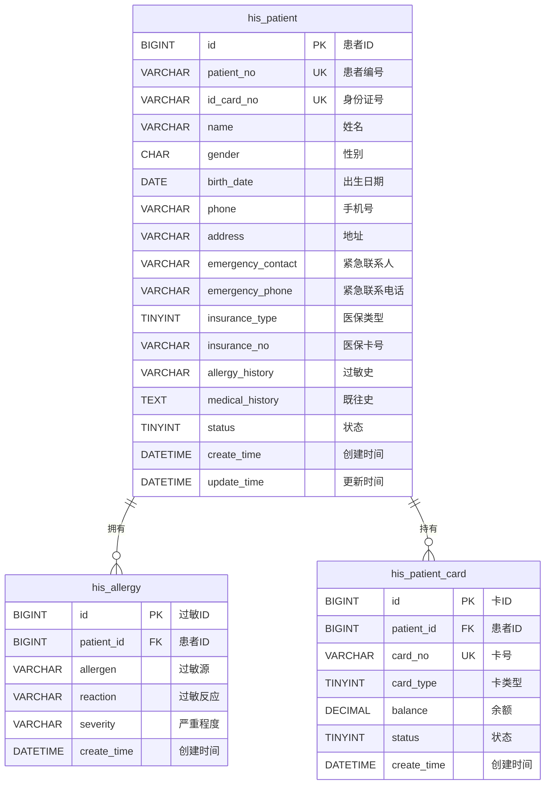
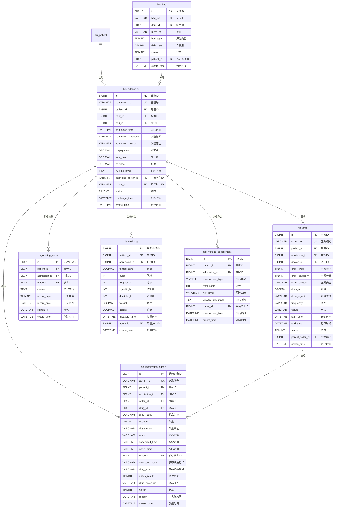
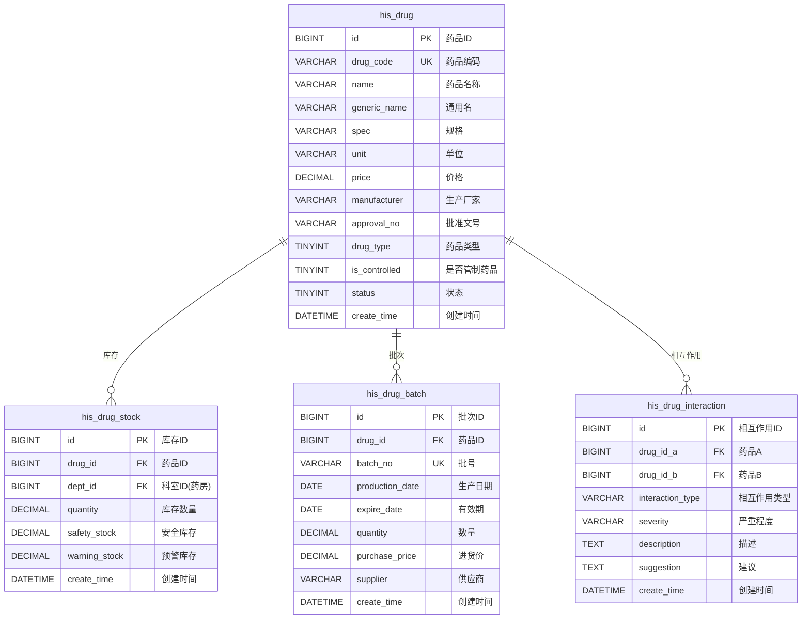
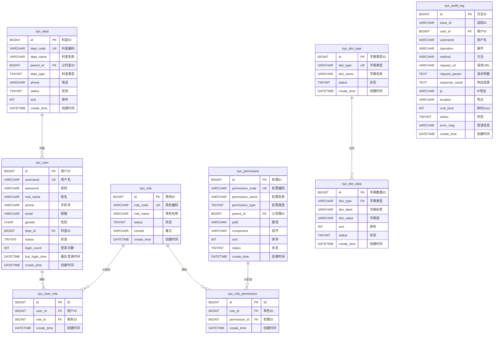

# YUDAO-AI-HIS 智慧医疗信息系统 - 数据库设计文档

> **文档编号**: YUDAO-HIS-DB-001
> **版本**: V1.0
> **创建日期**: 2026-06-16
> **状态**: 设计中
> **参考文档**: YUDAO-HIS-PRD-001, YUDAO-HIS-BR-001, YUDAO-HIS-FP-M01-01, YUDAO-HIS-FP-M02-03

---

## 1. 设计概述

### 1.1 设计原则

| 原则 | 说明 |
|------|------|
| 标准化 | 遵循HL7 FHIR R4资源映射标准 |
| 规范化 | 遵循数据库第三范式(3NF)，减少数据冗余 |
| 扩展性 | 支持分表策略，适应大数据量场景 |
| 安全性 | 敏感数据加密存储，审计日志完整记录 |
| 性能优化 | 合理设计索引，优化查询性能 |

### 1.2 数据库选型

| 项目 | 选择 | 说明 |
|------|------|------|
| 主数据库 | MySQL 8.0+ | 支持事务、行级锁、JSON类型 |
| 字符集 | utf8mb4 | 支持emoji和特殊字符 |
| 排序规则 | utf8mb4_unicode_ci | 支持多语言排序 |
| 存储引擎 | InnoDB | 支持事务和外键 |

### 1.3 命名规范

| 对象类型 | 命名规则 | 示例 |
|----------|----------|------|
| 表名 | 小写下划线，模块前缀 | his_patient, op_register |
| 主键 | id 或 表名_id | id, register_id |
| 外键 | 关联表名_id | patient_id, doctor_id |
| 索引 | idx_表名_字段名 | idx_patient_name |
| 唯一索引 | uk_表名_字段名 | uk_patient_id_card |
| 联合索引 | idx_表名_字段1_字段2 | idx_register_date_status |

---

## 2. ER图设计

### 2.1 患者域 ER图



### 2.2 门诊域 ER图

```mermaid
erDiagram
    op_schedule {
        BIGINT id PK "排班ID"
        BIGINT dept_id FK "科室ID"
        BIGINT doctor_id FK "医生ID"
        DATE schedule_date "排班日期"
        VARCHAR time_period "时段"
        TIME time_start "开始时间"
        TIME time_end "结束时间"
        INT expert_total "专家号总数"
        INT expert_remaining "专家号剩余"
        INT normal_total "普通号总数"
        INT normal_remaining "普通号剩余"
        TINYINT status "状态"
        DATETIME create_time "创建时间"
    }
    
    op_appointment {
        BIGINT id PK "预约ID"
        VARCHAR appointment_no UK "预约编号"
        BIGINT patient_id FK "患者ID"
        DATE appointment_date "预约日期"
        TIME time_slot_start "时间段开始"
        TIME time_slot_end "时间段结束"
        BIGINT dept_id FK "科室ID"
        BIGINT doctor_id FK "医生ID"
        BIGINT schedule_id FK "排班ID"
        TINYINT register_type "挂号类型"
        TINYINT status "状态"
        BIGINT register_id FK "挂号ID"
        TINYINT create_channel "创建渠道"
        DATETIME create_time "创建时间"
    }
    
    op_register {
        BIGINT id PK "挂号ID"
        VARCHAR register_no UK "挂号编号"
        BIGINT patient_id FK "患者ID"
        DATE register_date "挂号日期"
        BIGINT dept_id FK "科室ID"
        BIGINT doctor_id FK "医生ID"
        BIGINT schedule_id FK "排班ID"
        TINYINT register_type "挂号类型"
        VARCHAR queue_no "排队序号"
        DECIMAL register_fee "挂号费"
        DECIMAL diagnose_fee "诊查费"
        DECIMAL total_fee "费用合计"
        DECIMAL insurance_pay "医保支付"
        DECIMAL personal_pay "个人支付"
        TINYINT pay_type "支付方式"
        DATETIME pay_time "支付时间"
        TINYINT status "状态"
        TINYINT is_appointment "是否预约"
        BIGINT appointment_id FK "预约ID"
        TINYINT triage_level "急诊分级"
        DATETIME create_time "创建时间"
    }
    
    op_prescription {
        BIGINT id PK "处方ID"
        VARCHAR prescription_no UK "处方编号"
        BIGINT register_id FK "挂号ID"
        BIGINT patient_id FK "患者ID"
        BIGINT doctor_id FK "医生ID"
        DECIMAL total_amount "总金额"
        TINYINT status "状态"
        DATETIME create_time "创建时间"
    }
    
    op_prescription_item {
        BIGINT id PK "处方明细ID"
        BIGINT prescription_id FK "处方ID"
        BIGINT drug_id FK "药品ID"
        VARCHAR drug_name "药品名称"
        VARCHAR spec "规格"
        DECIMAL quantity "数量"
        VARCHAR unit "单位"
        DECIMAL unit_price "单价"
        DECIMAL amount "金额"
        VARCHAR usage "用法"
        VARCHAR frequency "频次"
        INT days "天数"
    }
    
    op_schedule ||--o{ op_appointment : "预约"
    op_schedule ||--o{ op_register : "挂号"
    op_appointment ||--o| op_register : "签到"
    op_register ||--o{ op_prescription : "开处方"
    op_prescription ||--o{ op_prescription_item : "包含"
```



### 2.3 住院域 ER图



### 2.4 药品域 ER图



### 2.5 系统域 ER图



### 2.6 全局 ER图

```mermaid
erDiagram
    his_patient {
        BIGINT id PK "患者ID"
        VARCHAR patient_no UK "患者编号"
        VARCHAR name "姓名"
    }
    
    his_admission {
        BIGINT id PK "住院ID"
        BIGINT patient_id FK "患者ID"
    }
    
    op_register {
        BIGINT id PK "挂号ID"
        BIGINT patient_id FK "患者ID"
    }
    
    his_order {
        BIGINT id PK "医嘱ID"
        BIGINT patient_id FK "患者ID"
    }
    
    his_prescription {
        BIGINT id PK "处方ID"
        BIGINT patient_id FK "患者ID"
    }
    
    his_diagnosis {
        BIGINT id PK "诊断ID"
        BIGINT patient_id FK "患者ID"
    }
    
    his_lab_result {
        BIGINT id PK "检验ID"
        BIGINT patient_id FK "患者ID"
    }
    
    his_imaging_study {
        BIGINT id PK "影像ID"
        BIGINT patient_id FK "患者ID"
    }
    
    his_charge_detail {
        BIGINT id PK "费用ID"
        BIGINT patient_id FK "患者ID"
    }
    
    his_medication_admin {
        BIGINT id PK "给药ID"
        BIGINT patient_id FK "患者ID"
    }
    
    sys_user {
        BIGINT id PK "用户ID"
        VARCHAR username UK "用户名"
    }
    
    sys_dept {
        BIGINT id PK "科室ID"
        VARCHAR dept_name "科室名称"
    }
    
    his_drug {
        BIGINT id PK "药品ID"
        VARCHAR name "药品名称"
    }
    
    his_patient ||--o{ op_register : "挂号"
    his_patient ||--o{ his_admission : "住院"
    his_patient ||--o{ his_order : "医嘱"
    his_patient ||--o{ his_prescription : "处方"
    his_patient ||--o{ his_diagnosis : "诊断"
    his_patient ||--o{ his_lab_result : "检验"
    his_patient ||--o{ his_imaging_study : "影像"
    his_patient ||--o{ his_charge_detail : "费用"
    his_patient ||--o{ his_medication_admin : "给药"
    his_patient }o--|| sys_user : "主治医生"
    his_patient }o--|| sys_dept : "所属科室"
    his_order }o--|| his_drug : "药品医嘱"
```



---

## 3. DDL脚本设计

### 3.1 数据库创建语句

```sql
-- =============================================
-- 数据库创建
-- =============================================
CREATE DATABASE IF NOT EXISTS `yudao_his` 
DEFAULT CHARACTER SET utf8mb4 
COLLATE utf8mb4_unicode_ci;

USE `yudao_his`;

-- =============================================
-- 通用字段说明（基于 ruoyi-vue-pro 框架规范）
-- 所有表均包含以下通用字段：
-- creator VARCHAR(64) DEFAULT '' COMMENT '创建者'
-- create_time DATETIME NOT NULL DEFAULT CURRENT_TIMESTAMP COMMENT '创建时间'
-- updater VARCHAR(64) DEFAULT '' COMMENT '更新者'
-- update_time DATETIME NOT NULL DEFAULT CURRENT_TIMESTAMP ON UPDATE CURRENT_TIMESTAMP COMMENT '更新时间'
-- deleted BIT(1) NOT NULL DEFAULT b'0' COMMENT '是否删除'
-- tenant_id BIGINT NOT NULL DEFAULT 0 COMMENT '租户编号'(多租户表)
-- =============================================
```

### 3.2 患者域表结构

#### 3.2.1 患者主索引表 (his_patient)

```sql
-- =============================================
-- 患者主索引表
-- 对应FHIR资源: Patient
-- 年增量估算: 约50万条
-- =============================================
CREATE TABLE `his_patient` (
    `id` BIGINT NOT NULL AUTO_INCREMENT COMMENT '患者ID',
    `patient_no` VARCHAR(20) NOT NULL COMMENT '患者编号',
    `id_card_no` VARCHAR(18) NOT NULL COMMENT '身份证号',
    `name` VARCHAR(50) NOT NULL COMMENT '姓名',
    `gender` CHAR(1) NOT NULL DEFAULT '1' COMMENT '性别: 1男/2女/9未知',
    `birth_date` DATE COMMENT '出生日期',
    `phone` VARCHAR(20) COMMENT '手机号',
    `phone_encrypt` VARCHAR(100) COMMENT '手机号加密',
    `address` VARCHAR(200) COMMENT '地址',
    `province_code` VARCHAR(10) COMMENT '省编码',
    `city_code` VARCHAR(10) COMMENT '市编码',
    `district_code` VARCHAR(10) COMMENT '区编码',
    `emergency_contact` VARCHAR(50) COMMENT '紧急联系人',
    `emergency_phone` VARCHAR(20) COMMENT '紧急联系电话',
    `emergency_relation` VARCHAR(20) COMMENT '紧急联系人关系',
    `insurance_type` TINYINT DEFAULT 0 COMMENT '医保类型: 0自费/1城镇职工/2城镇居民/3新农合',
    `insurance_no` VARCHAR(30) COMMENT '医保卡号',
    `insurance_org` VARCHAR(100) COMMENT '医保机构',
    `allergy_history` VARCHAR(500) COMMENT '过敏史',
    `medical_history` TEXT COMMENT '既往史',
    `family_history` TEXT COMMENT '家族史',
    `blood_type` VARCHAR(5) COMMENT '血型: A/B/AB/O',
    `rh_factor` CHAR(1) COMMENT 'Rh因子: +/−',
    `marital_status` TINYINT COMMENT '婚姻状况: 1未婚/2已婚/3离异/4丧偶',
    `occupation` VARCHAR(50) COMMENT '职业',
    `nation` VARCHAR(20) DEFAULT '汉族' COMMENT '民族',
    `photo_url` VARCHAR(200) COMMENT '照片URL',
    `status` TINYINT NOT NULL DEFAULT 1 COMMENT '状态: 0禁用/1正常',
    `remark` VARCHAR(500) COMMENT '备注',
    `creator` VARCHAR(64) DEFAULT '' COMMENT '创建者',
    `create_time` DATETIME NOT NULL DEFAULT CURRENT_TIMESTAMP COMMENT '创建时间',
    `updater` VARCHAR(64) DEFAULT '' COMMENT '更新者',
    `update_time` DATETIME NOT NULL DEFAULT CURRENT_TIMESTAMP ON UPDATE CURRENT_TIMESTAMP COMMENT '更新时间',
    `deleted` BIT(1) NOT NULL DEFAULT b'0' COMMENT '是否删除',
    `tenant_id` BIGINT NOT NULL DEFAULT 0 COMMENT '租户编号',
    PRIMARY KEY (`id`),
    UNIQUE KEY `uk_patient_no` (`patient_no`),
    UNIQUE KEY `uk_id_card_no` (`id_card_no`),
    KEY `idx_patient_name` (`name`),
    KEY `idx_patient_phone` (`phone`),
    KEY `idx_patient_insurance` (`insurance_no`)
) ENGINE=InnoDB DEFAULT CHARSET=utf8mb4 COLLATE=utf8mb4_unicode_ci COMMENT='患者主索引表';
```

#### 3.2.2 患者过敏记录表 (his_allergy)

```sql
-- =============================================
-- 患者过敏记录表
-- 对应FHIR资源: AllergyIntolerance
-- =============================================
CREATE TABLE `his_allergy` (
    `id` BIGINT NOT NULL AUTO_INCREMENT COMMENT '过敏ID',
    `patient_id` BIGINT NOT NULL COMMENT '患者ID',
    `allergen_type` VARCHAR(20) NOT NULL COMMENT '过敏源类型: 药物/食物/环境/其他',
    `allergen_code` VARCHAR(50) COMMENT '过敏源编码',
    `allergen_name` VARCHAR(100) NOT NULL COMMENT '过敏源名称',
    `reaction` VARCHAR(200) COMMENT '过敏反应',
    `severity` VARCHAR(20) COMMENT '严重程度: 轻度/中度/重度',
    `onset_date` DATE COMMENT '发生日期',
    `source` VARCHAR(50) COMMENT '信息来源: 患者自述/医生诊断/家属描述',
    `status` TINYINT NOT NULL DEFAULT 1 COMMENT '状态: 0无效/1有效',
    `verify_status` TINYINT DEFAULT 0 COMMENT '验证状态: 0未验证/1已验证',
    `creator` VARCHAR(64) DEFAULT '' COMMENT '创建者',
    `create_time` DATETIME NOT NULL DEFAULT CURRENT_TIMESTAMP COMMENT '创建时间',
    `updater` VARCHAR(64) DEFAULT '' COMMENT '更新者',
    `update_time` DATETIME NOT NULL DEFAULT CURRENT_TIMESTAMP ON UPDATE CURRENT_TIMESTAMP COMMENT '更新时间',
    `deleted` BIT(1) NOT NULL DEFAULT b'0' COMMENT '是否删除',
    `tenant_id` BIGINT NOT NULL DEFAULT 0 COMMENT '租户编号',
    PRIMARY KEY (`id`),
    KEY `idx_allergy_patient` (`patient_id`),
    KEY `idx_allergen_type` (`allergen_type`),
    CONSTRAINT `fk_allergy_patient` FOREIGN KEY (`patient_id`) REFERENCES `his_patient` (`id`)
) ENGINE=InnoDB DEFAULT CHARSET=utf8mb4 COLLATE=utf8mb4_unicode_ci COMMENT='患者过敏记录表';
```

### 3.3 门诊域表结构

#### 3.3.1 门诊排班表 (op_schedule)

```sql
-- =============================================
-- 门诊排班表
-- =============================================
CREATE TABLE `op_schedule` (
    `id` BIGINT NOT NULL AUTO_INCREMENT COMMENT '排班ID',
    `schedule_no` VARCHAR(30) COMMENT '排班编号',
    `dept_id` BIGINT NOT NULL COMMENT '科室ID',
    `dept_name` VARCHAR(100) NOT NULL COMMENT '科室名称',
    `doctor_id` BIGINT NOT NULL COMMENT '医生ID',
    `doctor_name` VARCHAR(50) NOT NULL COMMENT '医生姓名',
    `schedule_date` DATE NOT NULL COMMENT '排班日期',
    `time_period` VARCHAR(10) NOT NULL COMMENT '时段: AM上午/PM下午',
    `time_start` TIME NOT NULL COMMENT '开始时间',
    `time_end` TIME NOT NULL COMMENT '结束时间',
    `expert_total` INT NOT NULL DEFAULT 0 COMMENT '专家号总数',
    `expert_remaining` INT NOT NULL DEFAULT 0 COMMENT '专家号剩余',
    `expert_used` INT NOT NULL DEFAULT 0 COMMENT '专家号已用',
    `normal_total` INT NOT NULL DEFAULT 0 COMMENT '普通号总数',
    `normal_remaining` INT NOT NULL DEFAULT 0 COMMENT '普通号剩余',
    `normal_used` INT NOT NULL DEFAULT 0 COMMENT '普通号已用',
    `register_fee` DECIMAL(10,2) NOT NULL DEFAULT 0.00 COMMENT '挂号费',
    `diagnose_fee` DECIMAL(10,2) NOT NULL DEFAULT 0.00 COMMENT '诊查费',
    `status` TINYINT NOT NULL DEFAULT 1 COMMENT '状态: 1正常/2停诊/3已结束',
    `suspend_reason` VARCHAR(200) COMMENT '停诊原因',
    `suspend_time` DATETIME COMMENT '停诊时间',
    `suspend_by` VARCHAR(50) COMMENT '停诊操作人',
    `remark` VARCHAR(500) COMMENT '备注',
    `creator` VARCHAR(64) DEFAULT '' COMMENT '创建者',
    `create_time` DATETIME NOT NULL DEFAULT CURRENT_TIMESTAMP COMMENT '创建时间',
    `updater` VARCHAR(64) DEFAULT '' COMMENT '更新者',
    `update_time` DATETIME NOT NULL DEFAULT CURRENT_TIMESTAMP ON UPDATE CURRENT_TIMESTAMP COMMENT '更新时间',
    `deleted` BIT(1) NOT NULL DEFAULT b'0' COMMENT '是否删除',
    `tenant_id` BIGINT NOT NULL DEFAULT 0 COMMENT '租户编号',
    PRIMARY KEY (`id`),
    UNIQUE KEY `uk_schedule` (`doctor_id`, `schedule_date`, `time_period`),
    KEY `idx_schedule_date` (`schedule_date`),
    KEY `idx_schedule_dept` (`dept_id`),
    KEY `idx_schedule_doctor` (`doctor_id`),
    KEY `idx_schedule_status` (`status`)
) ENGINE=InnoDB DEFAULT CHARSET=utf8mb4 COLLATE=utf8mb4_unicode_ci COMMENT='门诊排班表';
```

#### 3.3.2 预约挂号表 (op_appointment)

```sql
-- =============================================
-- 预约挂号表
-- =============================================
CREATE TABLE `op_appointment` (
    `id` BIGINT NOT NULL AUTO_INCREMENT COMMENT '预约ID',
    `appointment_no` VARCHAR(30) NOT NULL COMMENT '预约编号',
    `patient_id` BIGINT NOT NULL COMMENT '患者ID',
    `patient_name` VARCHAR(50) NOT NULL COMMENT '患者姓名',
    `patient_phone` VARCHAR(20) NOT NULL COMMENT '患者手机号',
    `appointment_date` DATE NOT NULL COMMENT '预约日期',
    `time_slot_start` TIME NOT NULL COMMENT '时间段开始',
    `time_slot_end` TIME NOT NULL COMMENT '时间段结束',
    `dept_id` BIGINT NOT NULL COMMENT '科室ID',
    `dept_name` VARCHAR(100) NOT NULL COMMENT '科室名称',
    `doctor_id` BIGINT NOT NULL COMMENT '医生ID',
    `doctor_name` VARCHAR(50) NOT NULL COMMENT '医生姓名',
    `schedule_id` BIGINT NOT NULL COMMENT '排班ID',
    `register_type` TINYINT NOT NULL COMMENT '挂号类型: 1普通/2专家',
    `register_fee` DECIMAL(10,2) COMMENT '挂号费',
    `diagnose_fee` DECIMAL(10,2) COMMENT '诊查费',
    `status` TINYINT NOT NULL DEFAULT 1 COMMENT '状态: 1已预约/2已签到/3已取消/4已过期',
    `register_id` BIGINT COMMENT '签到后生成的挂号ID',
    `create_channel` TINYINT NOT NULL COMMENT '创建渠道: 1微信/2APP/3网站/4电话',
    `source_ip` VARCHAR(50) COMMENT '来源IP',
    `cancel_time` DATETIME COMMENT '取消时间',
    `cancel_reason` VARCHAR(200) COMMENT '取消原因',
    `cancel_by` VARCHAR(50) COMMENT '取消人',
    `expire_time` DATETIME COMMENT '过期时间',
    `reminder_sent` TINYINT DEFAULT 0 COMMENT '是否已发送提醒: 0否/1是',
    `creator` VARCHAR(64) DEFAULT '' COMMENT '创建者',
    `create_time` DATETIME NOT NULL DEFAULT CURRENT_TIMESTAMP COMMENT '创建时间',
    `updater` VARCHAR(64) DEFAULT '' COMMENT '更新者',
    `update_time` DATETIME NOT NULL DEFAULT CURRENT_TIMESTAMP ON UPDATE CURRENT_TIMESTAMP COMMENT '更新时间',
    `deleted` BIT(1) NOT NULL DEFAULT b'0' COMMENT '是否删除',
    `tenant_id` BIGINT NOT NULL DEFAULT 0 COMMENT '租户编号',
    PRIMARY KEY (`id`),
    UNIQUE KEY `uk_appointment_no` (`appointment_no`),
    KEY `idx_appointment_patient` (`patient_id`),
    KEY `idx_appointment_date` (`appointment_date`),
    KEY `idx_appointment_dept` (`dept_id`),
    KEY `idx_appointment_doctor` (`doctor_id`),
    KEY `idx_appointment_schedule` (`schedule_id`),
    KEY `idx_appointment_status` (`status`),
    KEY `idx_appointment_phone` (`patient_phone`),
    CONSTRAINT `fk_appointment_patient` FOREIGN KEY (`patient_id`) REFERENCES `his_patient` (`id`)
) ENGINE=InnoDB DEFAULT CHARSET=utf8mb4 COLLATE=utf8mb4_unicode_ci COMMENT='预约挂号表';
```

#### 3.3.3 挂号记录表 (op_register)

```sql
-- =============================================
-- 挂号记录表
-- 对应FHIR资源: Encounter(门诊)
-- 年增量估算: 约200万条
-- =============================================
CREATE TABLE `op_register` (
    `id` BIGINT NOT NULL AUTO_INCREMENT COMMENT '挂号ID',
    `register_no` VARCHAR(30) NOT NULL COMMENT '挂号编号',
    `patient_id` BIGINT NOT NULL COMMENT '患者ID',
    `patient_name` VARCHAR(50) NOT NULL COMMENT '患者姓名',
    `patient_phone` VARCHAR(20) COMMENT '患者手机号',
    `id_card_no` VARCHAR(18) COMMENT '身份证号',
    `register_date` DATE NOT NULL COMMENT '挂号日期',
    `dept_id` BIGINT NOT NULL COMMENT '科室ID',
    `dept_name` VARCHAR(100) NOT NULL COMMENT '科室名称',
    `doctor_id` BIGINT NOT NULL COMMENT '医生ID',
    `doctor_name` VARCHAR(50) NOT NULL COMMENT '医生姓名',
    `schedule_id` BIGINT NOT NULL COMMENT '排班ID',
    `register_type` TINYINT NOT NULL COMMENT '挂号类型: 1普通/2专家/3急诊',
    `queue_no` VARCHAR(10) COMMENT '排队序号',
    `register_fee` DECIMAL(10,2) NOT NULL DEFAULT 0.00 COMMENT '挂号费',
    `diagnose_fee` DECIMAL(10,2) NOT NULL DEFAULT 0.00 COMMENT '诊查费',
    `total_fee` DECIMAL(10,2) NOT NULL DEFAULT 0.00 COMMENT '费用合计',
    `insurance_pay` DECIMAL(10,2) DEFAULT 0.00 COMMENT '医保支付',
    `personal_pay` DECIMAL(10,2) NOT NULL DEFAULT 0.00 COMMENT '个人支付',
    `pay_type` TINYINT NOT NULL COMMENT '支付方式: 1现金/2医保/3微信/4支付宝/5银行卡',
    `pay_time` DATETIME COMMENT '支付时间',
    `pay_trade_no` VARCHAR(50) COMMENT '支付流水号',
    `status` TINYINT NOT NULL DEFAULT 1 COMMENT '状态: 1已挂号/2已就诊/3已退号/4已取消',
    `visit_time` DATETIME COMMENT '就诊时间',
    `finish_time` DATETIME COMMENT '就诊结束时间',
    `is_appointment` TINYINT NOT NULL DEFAULT 0 COMMENT '是否预约: 0现场/1预约',
    `appointment_id` BIGINT COMMENT '预约ID',
    `is_priority` TINYINT DEFAULT 0 COMMENT '是否优先: 0普通/1优先',
    `triage_level` VARCHAR(2) COMMENT '急诊分级: I/II/III/IV',
    `is_missed` TINYINT DEFAULT 0 COMMENT '是否过号: 0正常/1过号',
    `missed_time` DATETIME COMMENT '过号时间',
    `refund_time` DATETIME COMMENT '退号时间',
    `refund_by` VARCHAR(50) COMMENT '退号操作人',
    `refund_reason` VARCHAR(200) COMMENT '退号原因',
    `remark` VARCHAR(500) COMMENT '备注',
    `creator` VARCHAR(64) DEFAULT '' COMMENT '创建者',
    `create_time` DATETIME NOT NULL DEFAULT CURRENT_TIMESTAMP COMMENT '创建时间',
    `updater` VARCHAR(64) DEFAULT '' COMMENT '更新者',
    `update_time` DATETIME NOT NULL DEFAULT CURRENT_TIMESTAMP ON UPDATE CURRENT_TIMESTAMP COMMENT '更新时间',
    `deleted` BIT(1) NOT NULL DEFAULT b'0' COMMENT '是否删除',
    `tenant_id` BIGINT NOT NULL DEFAULT 0 COMMENT '租户编号',
    PRIMARY KEY (`id`),
    UNIQUE KEY `uk_register_no` (`register_no`),
    KEY `idx_register_patient` (`patient_id`),
    KEY `idx_register_date` (`register_date`),
    KEY `idx_register_dept` (`dept_id`),
    KEY `idx_register_doctor` (`doctor_id`),
    KEY `idx_register_status` (`status`),
    KEY `idx_register_date_status` (`register_date`, `status`),
    KEY `idx_register_type` (`register_type`),
    KEY `idx_register_appointment` (`appointment_id`),
    CONSTRAINT `fk_register_patient` FOREIGN KEY (`patient_id`) REFERENCES `his_patient` (`id`)
) ENGINE=InnoDB DEFAULT CHARSET=utf8mb4 COLLATE=utf8mb4_unicode_ci COMMENT='挂号记录表';
```

#### 3.3.4 门诊处方表 (op_prescription)

```sql
-- =============================================
-- 门诊处方表
-- 对应FHIR资源: MedicationRequest
-- =============================================
CREATE TABLE `op_prescription` (
    `id` BIGINT NOT NULL AUTO_INCREMENT COMMENT '处方ID',
    `prescription_no` VARCHAR(30) NOT NULL COMMENT '处方编号',
    `register_id` BIGINT NOT NULL COMMENT '挂号ID',
    `patient_id` BIGINT NOT NULL COMMENT '患者ID',
    `patient_name` VARCHAR(50) NOT NULL COMMENT '患者姓名',
    `doctor_id` BIGINT NOT NULL COMMENT '医生ID',
    `doctor_name` VARCHAR(50) NOT NULL COMMENT '医生姓名',
    `dept_id` BIGINT NOT NULL COMMENT '科室ID',
    `dept_name` VARCHAR(100) NOT NULL COMMENT '科室名称',
    `prescription_type` TINYINT NOT NULL COMMENT '处方类型: 1西药/2中药/3草药',
    `total_amount` DECIMAL(10,2) NOT NULL DEFAULT 0.00 COMMENT '总金额',
    `item_count` INT NOT NULL DEFAULT 0 COMMENT '药品数量',
    `status` TINYINT NOT NULL DEFAULT 1 COMMENT '状态: 1开立/2审核中/3审核通过/4审核退回/5已调配/6已发药/7已退药',
    `audit_pharmacist_id` BIGINT COMMENT '审核药师ID',
    `audit_pharmacist_name` VARCHAR(50) COMMENT '审核药师姓名',
    `audit_time` DATETIME COMMENT '审核时间',
    `audit_opinion` VARCHAR(500) COMMENT '审核意见',
    `dispense_pharmacist_id` BIGINT COMMENT '调配药师ID',
    `dispense_pharmacist_name` VARCHAR(50) COMMENT '调配药师姓名',
    `dispense_time` DATETIME COMMENT '调配时间',
    `send_pharmacist_id` BIGINT COMMENT '发药药师ID',
    `send_pharmacist_name` VARCHAR(50) COMMENT '发药药师姓名',
    `send_time` DATETIME COMMENT '发药时间',
    `diagnosis_code` VARCHAR(50) COMMENT '诊断编码(ICD-10)',
    `diagnosis_name` VARCHAR(200) COMMENT '诊断名称',
    `remark` VARCHAR(500) COMMENT '医嘱备注',
    `creator` VARCHAR(64) DEFAULT '' COMMENT '创建者',
    `create_time` DATETIME NOT NULL DEFAULT CURRENT_TIMESTAMP COMMENT '创建时间',
    `updater` VARCHAR(64) DEFAULT '' COMMENT '更新者',
    `update_time` DATETIME NOT NULL DEFAULT CURRENT_TIMESTAMP ON UPDATE CURRENT_TIMESTAMP COMMENT '更新时间',
    `deleted` BIT(1) NOT NULL DEFAULT b'0' COMMENT '是否删除',
    `tenant_id` BIGINT NOT NULL DEFAULT 0 COMMENT '租户编号',
    PRIMARY KEY (`id`),
    UNIQUE KEY `uk_prescription_no` (`prescription_no`),
    KEY `idx_prescription_register` (`register_id`),
    KEY `idx_prescription_patient` (`patient_id`),
    KEY `idx_prescription_doctor` (`doctor_id`),
    KEY `idx_prescription_status` (`status`),
    KEY `idx_prescription_create_time` (`create_time`),
    CONSTRAINT `fk_prescription_register` FOREIGN KEY (`register_id`) REFERENCES `op_register` (`id`)
) ENGINE=InnoDB DEFAULT CHARSET=utf8mb4 COLLATE=utf8mb4_unicode_ci COMMENT='门诊处方表';
```

#### 3.3.5 处方明细表 (op_prescription_item)

```sql
-- =============================================
-- 处方明细表
-- =============================================
CREATE TABLE `op_prescription_item` (
    `id` BIGINT NOT NULL AUTO_INCREMENT COMMENT '处方明细ID',
    `prescription_id` BIGINT NOT NULL COMMENT '处方ID',
    `item_no` INT NOT NULL COMMENT '序号',
    `drug_id` BIGINT NOT NULL COMMENT '药品ID',
    `drug_code` VARCHAR(50) NOT NULL COMMENT '药品编码',
    `drug_name` VARCHAR(100) NOT NULL COMMENT '药品名称',
    `generic_name` VARCHAR(100) COMMENT '通用名',
    `spec` VARCHAR(50) COMMENT '规格',
    `quantity` DECIMAL(10,2) NOT NULL COMMENT '数量',
    `unit` VARCHAR(20) COMMENT '单位',
    `unit_price` DECIMAL(10,2) NOT NULL COMMENT '单价',
    `amount` DECIMAL(10,2) NOT NULL COMMENT '金额',
    `dosage` DECIMAL(10,2) COMMENT '单次剂量',
    `dosage_unit` VARCHAR(20) COMMENT '剂量单位',
    `frequency` VARCHAR(50) COMMENT '频次',
    `usage` VARCHAR(50) COMMENT '用法',
    `days` INT COMMENT '天数',
    `skin_test` TINYINT DEFAULT 0 COMMENT '是否皮试: 0否/1是',
    `skin_test_result` TINYINT COMMENT '皮试结果: 1阴性/2阳性',
    `batch_no` VARCHAR(50) COMMENT '批号',
    `expire_date` DATE COMMENT '有效期',
    `remark` VARCHAR(200) COMMENT '备注',
    `creator` VARCHAR(64) DEFAULT '' COMMENT '创建者',
    `create_time` DATETIME NOT NULL DEFAULT CURRENT_TIMESTAMP COMMENT '创建时间',
    `updater` VARCHAR(64) DEFAULT '' COMMENT '更新者',
    `update_time` DATETIME NOT NULL DEFAULT CURRENT_TIMESTAMP ON UPDATE CURRENT_TIMESTAMP COMMENT '更新时间',
    `deleted` BIT(1) NOT NULL DEFAULT b'0' COMMENT '是否删除',
    `tenant_id` BIGINT NOT NULL DEFAULT 0 COMMENT '租户编号',
    PRIMARY KEY (`id`),
    KEY `idx_prescription_item_prescription` (`prescription_id`),
    KEY `idx_prescription_item_drug` (`drug_id`),
    CONSTRAINT `fk_prescription_item_prescription` FOREIGN KEY (`prescription_id`) REFERENCES `op_prescription` (`id`)
) ENGINE=InnoDB DEFAULT CHARSET=utf8mb4 COLLATE=utf8mb4_unicode_ci COMMENT='处方明细表';
```

### 3.4 住院域表结构

#### 3.4.1 住院信息表 (his_admission)

```sql
-- =============================================
-- 住院信息表
-- 对应FHIR资源: Encounter(住院)
-- 年增量估算: 约30万条
-- =============================================
CREATE TABLE `his_admission` (
    `id` BIGINT NOT NULL AUTO_INCREMENT COMMENT '住院ID',
    `admission_no` VARCHAR(30) NOT NULL COMMENT '住院号',
    `patient_id` BIGINT NOT NULL COMMENT '患者ID',
    `patient_name` VARCHAR(50) NOT NULL COMMENT '患者姓名',
    `gender` CHAR(1) COMMENT '性别',
    `age` INT COMMENT '年龄',
    `dept_id` BIGINT NOT NULL COMMENT '科室ID',
    `dept_name` VARCHAR(100) NOT NULL COMMENT '科室名称',
    `ward_id` BIGINT COMMENT '病区ID',
    `ward_name` VARCHAR(100) COMMENT '病区名称',
    `bed_id` BIGINT COMMENT '床位ID',
    `bed_no` VARCHAR(20) COMMENT '床位号',
    `room_no` VARCHAR(20) COMMENT '房间号',
    `admission_time` DATETIME NOT NULL COMMENT '入院时间',
    `admission_type` TINYINT NOT NULL COMMENT '入院方式: 1门诊入院/2急诊入院/3转院/4其他',
    `admission_diagnosis` VARCHAR(500) COMMENT '入院诊断',
    `admission_diagnosis_code` VARCHAR(50) COMMENT '入院诊断编码(ICD-10)',
    `admission_reason` VARCHAR(500) COMMENT '入院原因',
    `register_id` BIGINT COMMENT '门诊挂号ID(门诊入院时)',
    `prepayment` DECIMAL(12,2) NOT NULL DEFAULT 0.00 COMMENT '预交金',
    `total_cost` DECIMAL(12,2) NOT NULL DEFAULT 0.00 COMMENT '累计费用',
    `balance` DECIMAL(12,2) NOT NULL DEFAULT 0.00 COMMENT '余额',
    `deposit_amount` DECIMAL(12,2) DEFAULT 0.00 COMMENT '押金',
    `nursing_level` TINYINT NOT NULL DEFAULT 1 COMMENT '护理等级: 1特级/2一级/3二级/3三级',
    `diet_type` VARCHAR(50) COMMENT '饮食类型',
    `attending_doctor_id` BIGINT NOT NULL COMMENT '主治医生ID',
    `attending_doctor_name` VARCHAR(50) NOT NULL COMMENT '主治医生姓名',
    `director_doctor_id` BIGINT COMMENT '主任医生ID',
    `director_doctor_name` VARCHAR(50) COMMENT '主任医生姓名',
    `nurse_id` BIGINT COMMENT '责任护士ID',
    `nurse_name` VARCHAR(50) COMMENT '责任护士姓名',
    `status` TINYINT NOT NULL DEFAULT 1 COMMENT '状态: 1在院/2出院/3转科/4死亡',
    `discharge_time` DATETIME COMMENT '出院时间',
    `discharge_type` TINYINT COMMENT '出院方式: 1医嘱出院/2自动出院/3转院/4死亡',
    `discharge_diagnosis` VARCHAR(500) COMMENT '出院诊断',
    `discharge_diagnosis_code` VARCHAR(50) COMMENT '出院诊断编码',
    `discharge_summary` TEXT COMMENT '出院小结',
    `is_surgery` TINYINT DEFAULT 0 COMMENT '是否手术: 0否/1是',
    `is_critical` TINYINT DEFAULT 0 COMMENT '是否危重: 0否/1是',
    `allergy_alert` VARCHAR(500) COMMENT '过敏警示',
    `remark` VARCHAR(500) COMMENT '备注',
    `creator` VARCHAR(64) DEFAULT '' COMMENT '创建者',
    `create_time` DATETIME NOT NULL DEFAULT CURRENT_TIMESTAMP COMMENT '创建时间',
    `updater` VARCHAR(64) DEFAULT '' COMMENT '更新者',
    `update_time` DATETIME NOT NULL DEFAULT CURRENT_TIMESTAMP ON UPDATE CURRENT_TIMESTAMP COMMENT '更新时间',
    `deleted` BIT(1) NOT NULL DEFAULT b'0' COMMENT '是否删除',
    `tenant_id` BIGINT NOT NULL DEFAULT 0 COMMENT '租户编号',
    PRIMARY KEY (`id`),
    UNIQUE KEY `uk_admission_no` (`admission_no`),
    KEY `idx_admission_patient` (`patient_id`),
    KEY `idx_admission_dept` (`dept_id`),
    KEY `idx_admission_bed` (`bed_id`),
    KEY `idx_admission_status` (`status`),
    KEY `idx_admission_time` (`admission_time`),
    KEY `idx_admission_doctor` (`attending_doctor_id`),
    KEY `idx_admission_nurse` (`nurse_id`),
    CONSTRAINT `fk_admission_patient` FOREIGN KEY (`patient_id`) REFERENCES `his_patient` (`id`)
) ENGINE=InnoDB DEFAULT CHARSET=utf8mb4 COLLATE=utf8mb4_unicode_ci COMMENT='住院信息表';
```

#### 3.4.2 医嘱表 (his_order)

```sql
-- =============================================
-- 医嘱表
-- 对应FHIR资源: ServiceRequest/MedicationRequest
-- 年增量估算: 约1000万条
-- =============================================
CREATE TABLE `his_order` (
    `id` BIGINT NOT NULL AUTO_INCREMENT COMMENT '医嘱ID',
    `order_no` VARCHAR(30) NOT NULL COMMENT '医嘱编号',
    `patient_id` BIGINT NOT NULL COMMENT '患者ID',
    `patient_name` VARCHAR(50) NOT NULL COMMENT '患者姓名',
    `admission_id` BIGINT NOT NULL COMMENT '住院ID',
    `doctor_id` BIGINT NOT NULL COMMENT '医生ID',
    `doctor_name` VARCHAR(50) NOT NULL COMMENT '医生姓名',
    `dept_id` BIGINT NOT NULL COMMENT '科室ID',
    `order_type` TINYINT NOT NULL COMMENT '医嘱类型: 1药品/2检查/3检验/4护理/5饮食/6其他',
    `order_category` TINYINT NOT NULL COMMENT '医嘱分类: 1长期/2临时',
    `order_content` VARCHAR(500) NOT NULL COMMENT '医嘱内容',
    `drug_id` BIGINT COMMENT '药品ID',
    `drug_code` VARCHAR(50) COMMENT '药品编码',
    `drug_name` VARCHAR(100) COMMENT '药品名称',
    `spec` VARCHAR(50) COMMENT '规格',
    `dosage` DECIMAL(10,2) COMMENT '剂量',
    `dosage_unit` VARCHAR(20) COMMENT '剂量单位',
    `frequency` VARCHAR(50) COMMENT '频次',
    `usage` VARCHAR(50) COMMENT '用法',
    `route` VARCHAR(50) COMMENT '给药途径',
    `days` INT COMMENT '天数',
    `skin_test` TINYINT DEFAULT 0 COMMENT '是否皮试: 0否/1是',
    `skin_test_result` TINYINT COMMENT '皮试结果: 1阴性/2阳性',
    `start_time` DATETIME NOT NULL COMMENT '开始时间',
    `end_time` DATETIME COMMENT '结束时间',
    `execute_time` TIME COMMENT '执行时间',
    `status` TINYINT NOT NULL DEFAULT 1 COMMENT '状态: 1开立/2审核/3执行中/4已完成/5已作废/6已停止',
    `audit_nurse_id` BIGINT COMMENT '审核护士ID',
    `audit_nurse_name` VARCHAR(50) COMMENT '审核护士姓名',
    `audit_time` DATETIME COMMENT '审核时间',
    `stop_doctor_id` BIGINT COMMENT '停止医生ID',
    `stop_doctor_name` VARCHAR(50) COMMENT '停止医生姓名',
    `stop_time` DATETIME COMMENT '停止时间',
    `stop_reason` VARCHAR(200) COMMENT '停止原因',
    `cancel_doctor_id` BIGINT COMMENT '作废医生ID',
    `cancel_doctor_name` VARCHAR(50) COMMENT '作废医生姓名',
    `cancel_time` DATETIME COMMENT '作废时间',
    `cancel_reason` VARCHAR(200) COMMENT '作废原因',
    `parent_order_id` BIGINT COMMENT '父医嘱ID(子医嘱)',
    `is_stat` TINYINT DEFAULT 0 COMMENT '是否急用: 0否/1是',
    `is_prn` TINYINT DEFAULT 0 COMMENT '是否必要时: 0否/1是',
    `cds_check_result` TEXT COMMENT 'CDS校验结果(JSON)',
    `cds_warning_level` TINYINT COMMENT 'CDS警告级别: 0无/1提示/2警告/3禁止',
    `remark` VARCHAR(500) COMMENT '备注',
    `creator` VARCHAR(64) DEFAULT '' COMMENT '创建者',
    `create_time` DATETIME NOT NULL DEFAULT CURRENT_TIMESTAMP COMMENT '创建时间',
    `updater` VARCHAR(64) DEFAULT '' COMMENT '更新者',
    `update_time` DATETIME NOT NULL DEFAULT CURRENT_TIMESTAMP ON UPDATE CURRENT_TIMESTAMP COMMENT '更新时间',
    `deleted` BIT(1) NOT NULL DEFAULT b'0' COMMENT '是否删除',
    `tenant_id` BIGINT NOT NULL DEFAULT 0 COMMENT '租户编号',
    PRIMARY KEY (`id`),
    UNIQUE KEY `uk_order_no` (`order_no`),
    KEY `idx_order_patient` (`patient_id`),
    KEY `idx_order_admission` (`admission_id`),
    KEY `idx_order_doctor` (`doctor_id`),
    KEY `idx_order_status` (`status`),
    KEY `idx_order_type` (`order_type`),
    KEY `idx_order_category` (`order_category`),
    KEY `idx_order_start_time` (`start_time`),
    KEY `idx_order_drug` (`drug_id`),
    KEY `idx_order_parent` (`parent_order_id`),
    CONSTRAINT `fk_order_patient` FOREIGN KEY (`patient_id`) REFERENCES `his_patient` (`id`),
    CONSTRAINT `fk_order_admission` FOREIGN KEY (`admission_id`) REFERENCES `his_admission` (`id`)
) ENGINE=InnoDB DEFAULT CHARSET=utf8mb4 COLLATE=utf8mb4_unicode_ci COMMENT='医嘱表';
```

#### 3.4.3 给药记录表(eMAR) (his_medication_admin)

```sql
-- =============================================
-- 给药记录表(eMAR)
-- 对应FHIR资源: MedicationAdministration
-- 年增量估算: 约2000万条
-- 分表策略: 按年分表
-- HIMSS EMRAM Stage 5核心表
-- =============================================
CREATE TABLE `his_medication_admin` (
    `id` BIGINT NOT NULL AUTO_INCREMENT COMMENT '给药记录ID',
    `admin_no` VARCHAR(30) NOT NULL COMMENT '记录编号',
    `patient_id` BIGINT NOT NULL COMMENT '患者ID',
    `patient_name` VARCHAR(50) NOT NULL COMMENT '患者姓名',
    `admission_id` BIGINT NOT NULL COMMENT '住院ID',
    `admission_no` VARCHAR(30) COMMENT '住院号',
    `order_id` BIGINT NOT NULL COMMENT '医嘱ID',
    `order_no` VARCHAR(30) COMMENT '医嘱编号',
    `drug_id` BIGINT NOT NULL COMMENT '药品ID',
    `drug_code` VARCHAR(50) COMMENT '药品编码',
    `drug_name` VARCHAR(100) NOT NULL COMMENT '药品名称',
    `spec` VARCHAR(50) COMMENT '规格',
    `dosage` DECIMAL(10,2) NOT NULL COMMENT '剂量',
    `dosage_unit` VARCHAR(20) COMMENT '剂量单位',
    `route` VARCHAR(50) COMMENT '给药途径',
    `scheduled_time` DATETIME NOT NULL COMMENT '预定执行时间',
    `actual_time` DATETIME COMMENT '实际执行时间',
    `nurse_id` BIGINT NOT NULL COMMENT '执行护士ID',
    `nurse_name` VARCHAR(50) NOT NULL COMMENT '执行护士姓名',
    `wristband_scan_status` TINYINT NOT NULL DEFAULT 0 COMMENT '腕带扫描状态: 0未扫描/1匹配/2不匹配',
    `wristband_scan_time` DATETIME COMMENT '腕带扫描时间',
    `wristband_scan_result` VARCHAR(200) COMMENT '腕带扫描结果',
    `drug_scan_status` TINYINT NOT NULL DEFAULT 0 COMMENT '药品扫描状态: 0未扫描/1匹配/2不匹配',
    `drug_scan_time` DATETIME COMMENT '药品扫描时间',
    `drug_scan_result` VARCHAR(200) COMMENT '药品扫描结果',
    `drug_batch_no` VARCHAR(50) COMMENT '药品批号',
    `drug_expire_date` DATE COMMENT '药品有效期',
    `check_result` TINYINT NOT NULL COMMENT '核对结果: 1通过/2不通过',
    `status` TINYINT NOT NULL DEFAULT 1 COMMENT '状态: 1待执行/2已执行/3未执行/4延迟执行',
    `reason` VARCHAR(200) COMMENT '未执行/延迟原因',
    `reason_type` VARCHAR(50) COMMENT '原因类型: 患者拒绝/病情变化/药品问题/其他',
    `notify_doctor` TINYINT DEFAULT 0 COMMENT '是否通知医生: 0否/1是',
    `charge_status` TINYINT DEFAULT 0 COMMENT '记账状态: 0未记账/1已记账',
    `charge_time` DATETIME COMMENT '记账时间',
    `remark` VARCHAR(500) COMMENT '备注',
    `creator` VARCHAR(64) DEFAULT '' COMMENT '创建者',
    `create_time` DATETIME NOT NULL DEFAULT CURRENT_TIMESTAMP COMMENT '创建时间',
    `updater` VARCHAR(64) DEFAULT '' COMMENT '更新者',
    `update_time` DATETIME NOT NULL DEFAULT CURRENT_TIMESTAMP ON UPDATE CURRENT_TIMESTAMP COMMENT '更新时间',
    `deleted` BIT(1) NOT NULL DEFAULT b'0' COMMENT '是否删除',
    `tenant_id` BIGINT NOT NULL DEFAULT 0 COMMENT '租户编号',
    PRIMARY KEY (`id`),
    UNIQUE KEY `uk_admin_no` (`admin_no`),
    KEY `idx_med_admin_patient` (`patient_id`),
    KEY `idx_med_admin_admission` (`admission_id`),
    KEY `idx_med_admin_order` (`order_id`),
    KEY `idx_med_admin_nurse` (`nurse_id`),
    KEY `idx_med_admin_status` (`status`),
    KEY `idx_med_admin_scheduled` (`scheduled_time`),
    KEY `idx_med_admin_actual` (`actual_time`),
    KEY `idx_med_admin_drug` (`drug_id`),
    KEY `idx_med_admin_check` (`check_result`),
    KEY `idx_med_admin_year` (YEAR(`create_time`)),
    CONSTRAINT `fk_med_admin_patient` FOREIGN KEY (`patient_id`) REFERENCES `his_patient` (`id`),
    CONSTRAINT `fk_med_admin_admission` FOREIGN KEY (`admission_id`) REFERENCES `his_admission` (`id`),
    CONSTRAINT `fk_med_admin_order` FOREIGN KEY (`order_id`) REFERENCES `his_order` (`id`)
) ENGINE=InnoDB DEFAULT CHARSET=utf8mb4 COLLATE=utf8mb4_unicode_ci COMMENT='给药记录表(eMAR)';
```

#### 3.4.4 护理记录表 (his_nursing_record)

```sql
-- =============================================
-- 护理记录表
-- 分表策略: 按年分表
-- =============================================
CREATE TABLE `his_nursing_record` (
    `id` BIGINT NOT NULL AUTO_INCREMENT COMMENT '护理记录ID',
    `record_no` VARCHAR(30) COMMENT '记录编号',
    `patient_id` BIGINT NOT NULL COMMENT '患者ID',
    `patient_name` VARCHAR(50) NOT NULL COMMENT '患者姓名',
    `admission_id` BIGINT NOT NULL COMMENT '住院ID',
    `nurse_id` BIGINT NOT NULL COMMENT '护士ID',
    `nurse_name` VARCHAR(50) NOT NULL COMMENT '护士姓名',
    `record_type` TINYINT NOT NULL COMMENT '记录类型: 1一般护理记录/2危重护理记录/3手术护理记录/4交接班记录',
    `title` VARCHAR(200) COMMENT '标题',
    `content` TEXT NOT NULL COMMENT '护理内容',
    `record_time` DATETIME NOT NULL COMMENT '记录时间',
    `signature_status` TINYINT DEFAULT 0 COMMENT '签名状态: 0未签名/1已签名',
    `signature_time` DATETIME COMMENT '签名时间',
    `signature` VARCHAR(100) COMMENT '电子签名',
    `audit_status` TINYINT DEFAULT 0 COMMENT '审核状态: 0未审核/1已审核',
    `audit_nurse_id` BIGINT COMMENT '审核护士ID',
    `audit_time` DATETIME COMMENT '审核时间',
    `creator` VARCHAR(64) DEFAULT '' COMMENT '创建者',
    `create_time` DATETIME NOT NULL DEFAULT CURRENT_TIMESTAMP COMMENT '创建时间',
    `updater` VARCHAR(64) DEFAULT '' COMMENT '更新者',
    `update_time` DATETIME NOT NULL DEFAULT CURRENT_TIMESTAMP ON UPDATE CURRENT_TIMESTAMP COMMENT '更新时间',
    `deleted` BIT(1) NOT NULL DEFAULT b'0' COMMENT '是否删除',
    `tenant_id` BIGINT NOT NULL DEFAULT 0 COMMENT '租户编号',
    PRIMARY KEY (`id`),
    KEY `idx_nursing_record_patient` (`patient_id`),
    KEY `idx_nursing_record_admission` (`admission_id`),
    KEY `idx_nursing_record_nurse` (`nurse_id`),
    KEY `idx_nursing_record_type` (`record_type`),
    KEY `idx_nursing_record_time` (`record_time`),
    KEY `idx_nursing_record_year` (YEAR(`create_time`)),
    CONSTRAINT `fk_nursing_record_patient` FOREIGN KEY (`patient_id`) REFERENCES `his_patient` (`id`),
    CONSTRAINT `fk_nursing_record_admission` FOREIGN KEY (`admission_id`) REFERENCES `his_admission` (`id`)
) ENGINE=InnoDB DEFAULT CHARSET=utf8mb4 COLLATE=utf8mb4_unicode_ci COMMENT='护理记录表';
```

#### 3.4.5 生命体征表 (his_vital_sign)

```sql
-- =============================================
-- 生命体征表
-- =============================================
CREATE TABLE `his_vital_sign` (
    `id` BIGINT NOT NULL AUTO_INCREMENT COMMENT '生命体征ID',
    `patient_id` BIGINT NOT NULL COMMENT '患者ID',
    `patient_name` VARCHAR(50) NOT NULL COMMENT '患者姓名',
    `admission_id` BIGINT NOT NULL COMMENT '住院ID',
    `temperature` DECIMAL(4,1) COMMENT '体温(°C)',
    `pulse` INT COMMENT '脉搏(次/分)',
    `respiration` INT COMMENT '呼吸(次/分)',
    `systolic_bp` INT COMMENT '收缩压(mmHg)',
    `diastolic_bp` INT COMMENT '舒张压(mmHg)',
    `oxygen_saturation` DECIMAL(5,2) COMMENT '血氧饱和度(%)',
    `weight` DECIMAL(5,2) COMMENT '体重(kg)',
    `height` DECIMAL(5,2) COMMENT '身高(cm)',
    `bmi` DECIMAL(5,2) COMMENT 'BMI指数',
    `pain_score` INT COMMENT '疼痛评分(0-10)',
    `consciousness` VARCHAR(20) COMMENT '意识状态: 清醒/嗜睡/昏迷',
    `measure_time` DATETIME NOT NULL COMMENT '测量时间',
    `nurse_id` BIGINT NOT NULL COMMENT '测量护士ID',
    `nurse_name` VARCHAR(50) COMMENT '测量护士姓名',
    `abnormal_flag` TINYINT DEFAULT 0 COMMENT '异常标识: 0正常/1异常',
    `abnormal_items` VARCHAR(200) COMMENT '异常项目',
    `remark` VARCHAR(500) COMMENT '备注',
    `creator` VARCHAR(64) DEFAULT '' COMMENT '创建者',
    `create_time` DATETIME NOT NULL DEFAULT CURRENT_TIMESTAMP COMMENT '创建时间',
    `updater` VARCHAR(64) DEFAULT '' COMMENT '更新者',
    `update_time` DATETIME NOT NULL DEFAULT CURRENT_TIMESTAMP ON UPDATE CURRENT_TIMESTAMP COMMENT '更新时间',
    `deleted` BIT(1) NOT NULL DEFAULT b'0' COMMENT '是否删除',
    `tenant_id` BIGINT NOT NULL DEFAULT 0 COMMENT '租户编号',
    PRIMARY KEY (`id`),
    KEY `idx_vital_sign_patient` (`patient_id`),
    KEY `idx_vital_sign_admission` (`admission_id`),
    KEY `idx_vital_sign_measure_time` (`measure_time`),
    KEY `idx_vital_sign_abnormal` (`abnormal_flag`),
    CONSTRAINT `fk_vital_sign_patient` FOREIGN KEY (`patient_id`) REFERENCES `his_patient` (`id`),
    CONSTRAINT `fk_vital_sign_admission` FOREIGN KEY (`admission_id`) REFERENCES `his_admission` (`id`)
) ENGINE=InnoDB DEFAULT CHARSET=utf8mb4 COLLATE=utf8mb4_unicode_ci COMMENT='生命体征表';
```

#### 3.4.6 护理评估表 (his_nursing_assessment)

```sql
-- =============================================
-- 护理评估表
-- =============================================
CREATE TABLE `his_nursing_assessment` (
    `id` BIGINT NOT NULL AUTO_INCREMENT COMMENT '评估ID',
    `assessment_no` VARCHAR(30) COMMENT '评估编号',
    `patient_id` BIGINT NOT NULL COMMENT '患者ID',
    `patient_name` VARCHAR(50) NOT NULL COMMENT '患者姓名',
    `admission_id` BIGINT NOT NULL COMMENT '住院ID',
    `assessment_type` TINYINT NOT NULL COMMENT '评估类型: 1跌倒评估/2压疮评估/3疼痛评估/4自理能力/5营养评估',
    `assessment_name` VARCHAR(50) NOT NULL COMMENT '评估名称',
    `total_score` INT NOT NULL COMMENT '总分',
    `risk_level` VARCHAR(20) NOT NULL COMMENT '风险等级: 无风险/低风险/中风险/高风险',
    `assessment_detail` TEXT COMMENT '评估详情(JSON格式)',
    `items` TEXT COMMENT '评估项目明细(JSON格式)',
    `nurse_id` BIGINT NOT NULL COMMENT '评估护士ID',
    `nurse_name` VARCHAR(50) NOT NULL COMMENT '评估护士姓名',
    `assessment_time` DATETIME NOT NULL COMMENT '评估时间',
    `next_assessment_time` DATETIME COMMENT '下次评估时间',
    `measure_suggestion` TEXT COMMENT '护理措施建议',
    `creator` VARCHAR(64) DEFAULT '' COMMENT '创建者',
    `create_time` DATETIME NOT NULL DEFAULT CURRENT_TIMESTAMP COMMENT '创建时间',
    `updater` VARCHAR(64) DEFAULT '' COMMENT '更新者',
    `update_time` DATETIME NOT NULL DEFAULT CURRENT_TIMESTAMP ON UPDATE CURRENT_TIMESTAMP COMMENT '更新时间',
    `deleted` BIT(1) NOT NULL DEFAULT b'0' COMMENT '是否删除',
    `tenant_id` BIGINT NOT NULL DEFAULT 0 COMMENT '租户编号',
    PRIMARY KEY (`id`),
    KEY `idx_nursing_assess_patient` (`patient_id`),
    KEY `idx_nursing_assess_admission` (`admission_id`),
    KEY `idx_nursing_assess_type` (`assessment_type`),
    KEY `idx_nursing_assess_risk` (`risk_level`),
    KEY `idx_nursing_assess_time` (`assessment_time`),
    CONSTRAINT `fk_nursing_assess_patient` FOREIGN KEY (`patient_id`) REFERENCES `his_patient` (`id`),
    CONSTRAINT `fk_nursing_assess_admission` FOREIGN KEY (`admission_id`) REFERENCES `his_admission` (`id`)
) ENGINE=InnoDB DEFAULT CHARSET=utf8mb4 COLLATE=utf8mb4_unicode_ci COMMENT='护理评估表';
```

#### 3.4.7 床位表 (his_bed)

```sql
-- =============================================
-- 床位表
-- =============================================
CREATE TABLE `his_bed` (
    `id` BIGINT NOT NULL AUTO_INCREMENT COMMENT '床位ID',
    `bed_no` VARCHAR(20) NOT NULL COMMENT '床位号',
    `dept_id` BIGINT NOT NULL COMMENT '科室ID',
    `dept_name` VARCHAR(100) COMMENT '科室名称',
    `ward_id` BIGINT COMMENT '病区ID',
    `ward_name` VARCHAR(100) COMMENT '病区名称',
    `room_no` VARCHAR(20) COMMENT '房间号',
    `bed_type` TINYINT NOT NULL COMMENT '床位类型: 1普通床/2监护床/3婴儿床',
    `daily_rate` DECIMAL(10,2) NOT NULL DEFAULT 0.00 COMMENT '日费用',
    `status` TINYINT NOT NULL DEFAULT 1 COMMENT '状态: 1空闲/2占用/3维修/4预留',
    `patient_id` BIGINT COMMENT '当前患者ID',
    `patient_name` VARCHAR(50) COMMENT '当前患者姓名',
    `admission_id` BIGINT COMMENT '当前住院ID',
    `gender_limit` CHAR(1) COMMENT '性别限制: 1男/2女/NULL不限',
    `infection_flag` TINYINT DEFAULT 0 COMMENT '感染标识: 0非感染/1感染',
    `remark` VARCHAR(200) COMMENT '备注',
    `creator` VARCHAR(64) DEFAULT '' COMMENT '创建者',
    `create_time` DATETIME NOT NULL DEFAULT CURRENT_TIMESTAMP COMMENT '创建时间',
    `updater` VARCHAR(64) DEFAULT '' COMMENT '更新者',
    `update_time` DATETIME NOT NULL DEFAULT CURRENT_TIMESTAMP ON UPDATE CURRENT_TIMESTAMP COMMENT '更新时间',
    `deleted` BIT(1) NOT NULL DEFAULT b'0' COMMENT '是否删除',
    `tenant_id` BIGINT NOT NULL DEFAULT 0 COMMENT '租户编号',
    PRIMARY KEY (`id`),
    UNIQUE KEY `uk_bed_no` (`bed_no`),
    KEY `idx_bed_dept` (`dept_id`),
    KEY `idx_bed_ward` (`ward_id`),
    KEY `idx_bed_status` (`status`),
    KEY `idx_bed_patient` (`patient_id`)
) ENGINE=InnoDB DEFAULT CHARSET=utf8mb4 COLLATE=utf8mb4_unicode_ci COMMENT='床位表';
```

### 3.5 药品域表结构

#### 3.5.1 药品目录表 (his_drug)

```sql
-- =============================================
-- 药品目录表
-- 年增量估算: 约5万条
-- =============================================
CREATE TABLE `his_drug` (
    `id` BIGINT NOT NULL AUTO_INCREMENT COMMENT '药品ID',
    `drug_code` VARCHAR(50) NOT NULL COMMENT '药品编码',
    `name` VARCHAR(100) NOT NULL COMMENT '药品名称',
    `generic_name` VARCHAR(100) COMMENT '通用名',
    `pinyin_code` VARCHAR(50) COMMENT '拼音码',
    `spec` VARCHAR(50) COMMENT '规格',
    `unit` VARCHAR(20) COMMENT '单位',
    `pack_unit` VARCHAR(20) COMMENT '包装单位',
    `pack_quantity` DECIMAL(10,2) COMMENT '包装数量',
    `price` DECIMAL(10,2) NOT NULL COMMENT '价格',
    `manufacturer` VARCHAR(100) COMMENT '生产厂家',
    `approval_no` VARCHAR(50) COMMENT '批准文号',
    `drug_type` TINYINT NOT NULL COMMENT '药品类型: 1西药/2中成药/3中草药/4生物制品',
    `drug_form` VARCHAR(50) COMMENT '剂型',
    `drug_category` TINYINT COMMENT '药品分类: 1处方药/2非处方药',
    `is_controlled` TINYINT DEFAULT 0 COMMENT '是否管制药品: 0否/1麻醉药品/2精神药品/3毒性药品',
    `is_antibiotic` TINYINT DEFAULT 0 COMMENT '是否抗菌药物: 0否/1是',
    `antibiotic_level` TINYINT COMMENT '抗菌药物级别: 1非限制/2限制/3特殊',
    `storage_condition` VARCHAR(50) COMMENT '储存条件',
    `is_insurance` TINYINT DEFAULT 1 COMMENT '是否医保药品: 0否/1是',
    `insurance_type` VARCHAR(20) COMMENT '医保类型: 甲类/乙类/丙类',
    `insurance_code` VARCHAR(50) COMMENT '医保编码',
    `status` TINYINT NOT NULL DEFAULT 1 COMMENT '状态: 0停用/1正常',
    `remark` VARCHAR(500) COMMENT '备注',
    `creator` VARCHAR(64) DEFAULT '' COMMENT '创建者',
    `create_time` DATETIME NOT NULL DEFAULT CURRENT_TIMESTAMP COMMENT '创建时间',
    `updater` VARCHAR(64) DEFAULT '' COMMENT '更新者',
    `update_time` DATETIME NOT NULL DEFAULT CURRENT_TIMESTAMP ON UPDATE CURRENT_TIMESTAMP COMMENT '更新时间',
    `deleted` BIT(1) NOT NULL DEFAULT b'0' COMMENT '是否删除',
    `tenant_id` BIGINT NOT NULL DEFAULT 0 COMMENT '租户编号',
    PRIMARY KEY (`id`),
    UNIQUE KEY `uk_drug_code` (`drug_code`),
    KEY `idx_drug_name` (`name`),
    KEY `idx_drug_generic` (`generic_name`),
    KEY `idx_drug_pinyin` (`pinyin_code`),
    KEY `idx_drug_type` (`drug_type`),
    KEY `idx_drug_controlled` (`is_controlled`)
) ENGINE=InnoDB DEFAULT CHARSET=utf8mb4 COLLATE=utf8mb4_unicode_ci COMMENT='药品目录表';
```

#### 3.5.2 药品库存表 (his_drug_stock)

```sql
-- =============================================
-- 药品库存表
-- =============================================
CREATE TABLE `his_drug_stock` (
    `id` BIGINT NOT NULL AUTO_INCREMENT COMMENT '库存ID',
    `drug_id` BIGINT NOT NULL COMMENT '药品ID',
    `drug_code` VARCHAR(50) COMMENT '药品编码',
    `drug_name` VARCHAR(100) COMMENT '药品名称',
    `dept_id` BIGINT NOT NULL COMMENT '科室ID(药房)',
    `dept_name` VARCHAR(100) COMMENT '科室名称',
    `quantity` DECIMAL(10,2) NOT NULL DEFAULT 0.00 COMMENT '库存数量',
    `frozen_quantity` DECIMAL(10,2) DEFAULT 0.00 COMMENT '冻结数量',
    `available_quantity` DECIMAL(10,2) DEFAULT 0.00 COMMENT '可用数量',
    `safety_stock` DECIMAL(10,2) COMMENT '安全库存',
    `warning_stock` DECIMAL(10,2) COMMENT '预警库存',
    `max_stock` DECIMAL(10,2) COMMENT '最大库存',
    `min_stock` DECIMAL(10,2) COMMENT '最小库存',
    `warning_status` TINYINT DEFAULT 0 COMMENT '预警状态: 0正常/1低库存预警/2超库存预警',
    `last_in_time` DATETIME COMMENT '最后入库时间',
    `last_out_time` DATETIME COMMENT '最后出库时间',
    `creator` VARCHAR(64) DEFAULT '' COMMENT '创建者',
    `create_time` DATETIME NOT NULL DEFAULT CURRENT_TIMESTAMP COMMENT '创建时间',
    `updater` VARCHAR(64) DEFAULT '' COMMENT '更新者',
    `update_time` DATETIME NOT NULL DEFAULT CURRENT_TIMESTAMP ON UPDATE CURRENT_TIMESTAMP COMMENT '更新时间',
    `deleted` BIT(1) NOT NULL DEFAULT b'0' COMMENT '是否删除',
    `tenant_id` BIGINT NOT NULL DEFAULT 0 COMMENT '租户编号',
    PRIMARY KEY (`id`),
    UNIQUE KEY `uk_drug_stock` (`drug_id`, `dept_id`),
    KEY `idx_drug_stock_drug` (`drug_id`),
    KEY `idx_drug_stock_dept` (`dept_id`),
    KEY `idx_drug_stock_warning` (`warning_status`),
    CONSTRAINT `fk_drug_stock_drug` FOREIGN KEY (`drug_id`) REFERENCES `his_drug` (`id`)
) ENGINE=InnoDB DEFAULT CHARSET=utf8mb4 COLLATE=utf8mb4_unicode_ci COMMENT='药品库存表';
```

#### 3.5.3 药品批次表 (his_drug_batch)

```sql
-- =============================================
-- 药品批次表
-- =============================================
CREATE TABLE `his_drug_batch` (
    `id` BIGINT NOT NULL AUTO_INCREMENT COMMENT '批次ID',
    `drug_id` BIGINT NOT NULL COMMENT '药品ID',
    `drug_code` VARCHAR(50) COMMENT '药品编码',
    `drug_name` VARCHAR(100) COMMENT '药品名称',
    `batch_no` VARCHAR(50) NOT NULL COMMENT '批号',
    `production_date` DATE COMMENT '生产日期',
    `expire_date` DATE NOT NULL COMMENT '有效期',
    `quantity` DECIMAL(10,2) NOT NULL COMMENT '数量',
    `available_quantity` DECIMAL(10,2) COMMENT '可用数量',
    `purchase_price` DECIMAL(10,2) COMMENT '进货价',
    `retail_price` DECIMAL(10,2) COMMENT '零售价',
    `supplier_id` BIGINT COMMENT '供应商ID',
    `supplier_name` VARCHAR(100) COMMENT '供应商名称',
    `purchase_order_no` VARCHAR(30) COMMENT '采购单号',
    `dept_id` BIGINT NOT NULL COMMENT '科室ID(药房)',
    `dept_name` VARCHAR(100) COMMENT '科室名称',
    `location` VARCHAR(50) COMMENT '存放位置',
    `status` TINYINT NOT NULL DEFAULT 1 COMMENT '状态: 1正常/2近效期/3过期/4已用完',
    `expire_warning` TINYINT DEFAULT 0 COMMENT '效期预警: 0正常/1近效期(≤90天)',
    `creator` VARCHAR(64) DEFAULT '' COMMENT '创建者',
    `create_time` DATETIME NOT NULL DEFAULT CURRENT_TIMESTAMP COMMENT '创建时间',
    `updater` VARCHAR(64) DEFAULT '' COMMENT '更新者',
    `update_time` DATETIME NOT NULL DEFAULT CURRENT_TIMESTAMP ON UPDATE CURRENT_TIMESTAMP COMMENT '更新时间',
    `deleted` BIT(1) NOT NULL DEFAULT b'0' COMMENT '是否删除',
    `tenant_id` BIGINT NOT NULL DEFAULT 0 COMMENT '租户编号',
    PRIMARY KEY (`id`),
    UNIQUE KEY `uk_drug_batch` (`drug_id`, `batch_no`, `dept_id`),
    KEY `idx_drug_batch_drug` (`drug_id`),
    KEY `idx_drug_batch_expire` (`expire_date`),
    KEY `idx_drug_batch_dept` (`dept_id`),
    KEY `idx_drug_batch_status` (`status`),
    CONSTRAINT `fk_drug_batch_drug` FOREIGN KEY (`drug_id`) REFERENCES `his_drug` (`id`)
) ENGINE=InnoDB DEFAULT CHARSET=utf8mb4 COLLATE=utf8mb4_unicode_ci COMMENT='药品批次表';
```

#### 3.5.4 药物相互作用表 (his_drug_interaction)

```sql
-- =============================================
-- 药物相互作用表
-- CDS校验核心表
-- =============================================
CREATE TABLE `his_drug_interaction` (
    `id` BIGINT NOT NULL AUTO_INCREMENT COMMENT '相互作用ID',
    `drug_id_a` BIGINT NOT NULL COMMENT '药品A的ID',
    `drug_code_a` VARCHAR(50) COMMENT '药品A编码',
    `drug_name_a` VARCHAR(100) COMMENT '药品A名称',
    `drug_id_b` BIGINT NOT NULL COMMENT '药品B的ID',
    `drug_code_b` VARCHAR(50) COMMENT '药品B编码',
    `drug_name_b` VARCHAR(100) COMMENT '药品B名称',
    `interaction_type` VARCHAR(50) NOT NULL COMMENT '相互作用类型',
    `severity` VARCHAR(20) NOT NULL COMMENT '严重程度: 轻度/中度/重度/禁忌',
    `mechanism` TEXT COMMENT '作用机制',
    `description` TEXT NOT NULL COMMENT '相互作用描述',
    `clinical_effect` TEXT COMMENT '临床影响',
    `suggestion` TEXT COMMENT '处置建议',
    `reference` VARCHAR(500) COMMENT '参考文献',
    `status` TINYINT NOT NULL DEFAULT 1 COMMENT '状态: 0停用/1正常',
    `creator` VARCHAR(64) DEFAULT '' COMMENT '创建者',
    `create_time` DATETIME NOT NULL DEFAULT CURRENT_TIMESTAMP COMMENT '创建时间',
    `updater` VARCHAR(64) DEFAULT '' COMMENT '更新者',
    `update_time` DATETIME NOT NULL DEFAULT CURRENT_TIMESTAMP ON UPDATE CURRENT_TIMESTAMP COMMENT '更新时间',
    `deleted` BIT(1) NOT NULL DEFAULT b'0' COMMENT '是否删除',
    `tenant_id` BIGINT NOT NULL DEFAULT 0 COMMENT '租户编号',
    PRIMARY KEY (`id`),
    UNIQUE KEY `uk_drug_interaction` (`drug_id_a`, `drug_id_b`),
    KEY `idx_interaction_drug_a` (`drug_id_a`),
    KEY `idx_interaction_drug_b` (`drug_id_b`),
    KEY `idx_interaction_severity` (`severity`)
) ENGINE=InnoDB DEFAULT CHARSET=utf8mb4 COLLATE=utf8mb4_unicode_ci COMMENT='药物相互作用表';
```

### 3.6 诊断与检查表结构

#### 3.6.1 诊断记录表 (his_diagnosis)

```sql
-- =============================================
-- 诊断记录表
-- 对应FHIR资源: Condition
-- 年增量估算: 约200万条
-- =============================================
CREATE TABLE `his_diagnosis` (
    `id` BIGINT NOT NULL AUTO_INCREMENT COMMENT '诊断ID',
    `diagnosis_no` VARCHAR(30) COMMENT '诊断编号',
    `patient_id` BIGINT NOT NULL COMMENT '患者ID',
    `patient_name` VARCHAR(50) COMMENT '患者姓名',
    `admission_id` BIGINT COMMENT '住院ID',
    `register_id` BIGINT COMMENT '挂号ID',
    `diagnosis_type` TINYINT NOT NULL COMMENT '诊断类型: 1门诊诊断/2入院诊断/3出院诊断/4术后诊断',
    `diagnosis_order` TINYINT NOT NULL DEFAULT 1 COMMENT '诊断顺序: 1主诊断/2副诊断',
    `diagnosis_code` VARCHAR(50) NOT NULL COMMENT '诊断编码(ICD-10)',
    `diagnosis_name` VARCHAR(200) NOT NULL COMMENT '诊断名称',
    `diagnosis_status` TINYINT DEFAULT 1 COMMENT '诊断状态: 1疑似/2确诊/3排除',
    `onset_date` DATE COMMENT '发病日期',
    `diagnosis_time` DATETIME NOT NULL COMMENT '诊断时间',
    `doctor_id` BIGINT NOT NULL COMMENT '诊断医生ID',
    `doctor_name` VARCHAR(50) COMMENT '诊断医生姓名',
    `dept_id` BIGINT COMMENT '科室ID',
    `dept_name` VARCHAR(100) COMMENT '科室名称',
    `remark` VARCHAR(500) COMMENT '备注',
    `creator` VARCHAR(64) DEFAULT '' COMMENT '创建者',
    `create_time` DATETIME NOT NULL DEFAULT CURRENT_TIMESTAMP COMMENT '创建时间',
    `updater` VARCHAR(64) DEFAULT '' COMMENT '更新者',
    `update_time` DATETIME NOT NULL DEFAULT CURRENT_TIMESTAMP ON UPDATE CURRENT_TIMESTAMP COMMENT '更新时间',
    `deleted` BIT(1) NOT NULL DEFAULT b'0' COMMENT '是否删除',
    `tenant_id` BIGINT NOT NULL DEFAULT 0 COMMENT '租户编号',
    PRIMARY KEY (`id`),
    KEY `idx_diagnosis_patient` (`patient_id`),
    KEY `idx_diagnosis_admission` (`admission_id`),
    KEY `idx_diagnosis_register` (`register_id`),
    KEY `idx_diagnosis_code` (`diagnosis_code`),
    KEY `idx_diagnosis_time` (`diagnosis_time`),
    KEY `idx_diagnosis_type` (`diagnosis_type`),
    CONSTRAINT `fk_diagnosis_patient` FOREIGN KEY (`patient_id`) REFERENCES `his_patient` (`id`)
) ENGINE=InnoDB DEFAULT CHARSET=utf8mb4 COLLATE=utf8mb4_unicode_ci COMMENT='诊断记录表';
```

#### 3.6.2 检验结果表 (his_lab_result)

```sql
-- =============================================
-- 检验结果表
-- 对应FHIR资源: Observation
-- 年增量估算: 约500万条
-- 分表策略: 按年分表
-- =============================================
CREATE TABLE `his_lab_result` (
    `id` BIGINT NOT NULL AUTO_INCREMENT COMMENT '检验ID',
    `lab_no` VARCHAR(30) NOT NULL COMMENT '检验编号',
    `patient_id` BIGINT NOT NULL COMMENT '患者ID',
    `patient_name` VARCHAR(50) COMMENT '患者姓名',
    `admission_id` BIGINT COMMENT '住院ID',
    `register_id` BIGINT COMMENT '挂号ID',
    `order_id` BIGINT COMMENT '医嘱ID',
    `sample_no` VARCHAR(30) COMMENT '标本编号',
    `sample_type` VARCHAR(50) COMMENT '标本类型',
    `sample_time` DATETIME COMMENT '采集时间',
    `receive_time` DATETIME COMMENT '接收时间',
    `report_time` DATETIME COMMENT '报告时间',
    `test_item_code` VARCHAR(50) NOT NULL COMMENT '检验项目编码',
    `test_item_name` VARCHAR(100) NOT NULL COMMENT '检验项目名称',
    `test_value` VARCHAR(100) COMMENT '检验结果值',
    `test_value_num` DECIMAL(20,6) COMMENT '数值型结果',
    `unit` VARCHAR(20) COMMENT '单位',
    `ref_range` VARCHAR(100) COMMENT '参考范围',
    `ref_low` DECIMAL(20,6) COMMENT '参考下限',
    `ref_high` DECIMAL(20,6) COMMENT '参考上限',
    `result_flag` TINYINT COMMENT '结果标识: 1正常/2偏高/3偏低/4危急值',
    `is_critical` TINYINT DEFAULT 0 COMMENT '是否危急值: 0否/1是',
    `critical_notify_time` DATETIME COMMENT '危急值通知时间',
    `critical_confirm_time` DATETIME COMMENT '危急值确认时间',
    `critical_confirm_user` VARCHAR(50) COMMENT '危急值确认人',
    `technician_id` BIGINT COMMENT '检验技师ID',
    `technician_name` VARCHAR(50) COMMENT '检验技师姓名',
    `auditor_id` BIGINT COMMENT '审核医生ID',
    `auditor_name` VARCHAR(50) COMMENT '审核医生姓名',
    `status` TINYINT NOT NULL DEFAULT 1 COMMENT '状态: 1待检/2检验中/3已报告/4已取消',
    `creator` VARCHAR(64) DEFAULT '' COMMENT '创建者',
    `create_time` DATETIME NOT NULL DEFAULT CURRENT_TIMESTAMP COMMENT '创建时间',
    `updater` VARCHAR(64) DEFAULT '' COMMENT '更新者',
    `update_time` DATETIME NOT NULL DEFAULT CURRENT_TIMESTAMP ON UPDATE CURRENT_TIMESTAMP COMMENT '更新时间',
    `deleted` BIT(1) NOT NULL DEFAULT b'0' COMMENT '是否删除',
    `tenant_id` BIGINT NOT NULL DEFAULT 0 COMMENT '租户编号',
    PRIMARY KEY (`id`),
    UNIQUE KEY `uk_lab_no` (`lab_no`),
    KEY `idx_lab_result_patient` (`patient_id`),
    KEY `idx_lab_result_admission` (`admission_id`),
    KEY `idx_lab_result_register` (`register_id`),
    KEY `idx_lab_result_order` (`order_id`),
    KEY `idx_lab_result_sample` (`sample_no`),
    KEY `idx_lab_result_item` (`test_item_code`),
    KEY `idx_lab_result_critical` (`is_critical`),
    KEY `idx_lab_result_time` (`report_time`),
    KEY `idx_lab_result_year` (YEAR(`create_time`)),
    CONSTRAINT `fk_lab_result_patient` FOREIGN KEY (`patient_id`) REFERENCES `his_patient` (`id`)
) ENGINE=InnoDB DEFAULT CHARSET=utf8mb4 COLLATE=utf8mb4_unicode_ci COMMENT='检验结果表';
```

#### 3.6.3 影像检查表 (his_imaging_study)

```sql
-- =============================================
-- 影像检查表
-- 对应FHIR资源: ImagingStudy
-- 年增量估算: 约100万条
-- =============================================
CREATE TABLE `his_imaging_study` (
    `id` BIGINT NOT NULL AUTO_INCREMENT COMMENT '影像ID',
    `study_no` VARCHAR(30) NOT NULL COMMENT '检查编号',
    `accession_no` VARCHAR(30) COMMENT '检查号(DICOM)',
    `patient_id` BIGINT NOT NULL COMMENT '患者ID',
    `patient_name` VARCHAR(50) COMMENT '患者姓名',
    `admission_id` BIGINT COMMENT '住院ID',
    `register_id` BIGINT COMMENT '挂号ID',
    `order_id` BIGINT COMMENT '医嘱ID',
    `modality` VARCHAR(20) NOT NULL COMMENT '检查类型: CT/MR/US/DR/CR/RF等',
    `modality_name` VARCHAR(50) COMMENT '检查类型名称',
    `body_part` VARCHAR(100) COMMENT '检查部位',
    `study_desc` VARCHAR(200) COMMENT '检查描述',
    `study_time` DATETIME COMMENT '检查时间',
    `report_time` DATETIME COMMENT '报告时间',
    `report_result` TEXT COMMENT '报告结果',
    `report_conclusion` VARCHAR(500) COMMENT '报告结论',
    `radiologist_id` BIGINT COMMENT '报告医生ID',
    `radiologist_name` VARCHAR(50) COMMENT '报告医生姓名',
    `auditor_id` BIGINT COMMENT '审核医生ID',
    `auditor_name` VARCHAR(50) COMMENT '审核医生姓名',
    `image_count` INT COMMENT '图像数量',
    `storage_path` VARCHAR(200) COMMENT '存储路径',
    `pacs_url` VARCHAR(200) COMMENT 'PACS访问URL',
    `status` TINYINT NOT NULL DEFAULT 1 COMMENT '状态: 1预约/2检查中/3已报告/4已取消',
    `creator` VARCHAR(64) DEFAULT '' COMMENT '创建者',
    `create_time` DATETIME NOT NULL DEFAULT CURRENT_TIMESTAMP COMMENT '创建时间',
    `updater` VARCHAR(64) DEFAULT '' COMMENT '更新者',
    `update_time` DATETIME NOT NULL DEFAULT CURRENT_TIMESTAMP ON UPDATE CURRENT_TIMESTAMP COMMENT '更新时间',
    `deleted` BIT(1) NOT NULL DEFAULT b'0' COMMENT '是否删除',
    `tenant_id` BIGINT NOT NULL DEFAULT 0 COMMENT '租户编号',
    PRIMARY KEY (`id`),
    UNIQUE KEY `uk_study_no` (`study_no`),
    KEY `idx_imaging_patient` (`patient_id`),
    KEY `idx_imaging_admission` (`admission_id`),
    KEY `idx_imaging_register` (`register_id`),
    KEY `idx_imaging_modality` (`modality`),
    KEY `idx_imaging_study_time` (`study_time`),
    KEY `idx_imaging_status` (`status`),
    CONSTRAINT `fk_imaging_patient` FOREIGN KEY (`patient_id`) REFERENCES `his_patient` (`id`)
) ENGINE=InnoDB DEFAULT CHARSET=utf8mb4 COLLATE=utf8mb4_unicode_ci COMMENT='影像检查表';
```

### 3.7 费用管理表结构

#### 3.7.1 费用明细表 (his_charge_detail)

```sql
-- =============================================
-- 费用明细表
-- 年增量估算: 约3000万条
-- 分表策略: 按年分表
-- =============================================
CREATE TABLE `his_charge_detail` (
    `id` BIGINT NOT NULL AUTO_INCREMENT COMMENT '费用ID',
    `charge_no` VARCHAR(30) COMMENT '费用编号',
    `patient_id` BIGINT NOT NULL COMMENT '患者ID',
    `patient_name` VARCHAR(50) COMMENT '患者姓名',
    `admission_id` BIGINT COMMENT '住院ID',
    `register_id` BIGINT COMMENT '挂号ID',
    `order_id` BIGINT COMMENT '医嘱ID',
    `charge_date` DATE NOT NULL COMMENT '费用日期',
    `charge_time` DATETIME NOT NULL COMMENT '费用时间',
    `item_code` VARCHAR(50) NOT NULL COMMENT '收费项目编码',
    `item_name` VARCHAR(100) NOT NULL COMMENT '收费项目名称',
    `item_type` TINYINT NOT NULL COMMENT '项目类型: 1西药/2中药/3检查/4检验/5治疗/6护理/7床位/8其他',
    `spec` VARCHAR(50) COMMENT '规格',
    `unit` VARCHAR(20) COMMENT '单位',
    `quantity` DECIMAL(10,2) NOT NULL COMMENT '数量',
    `unit_price` DECIMAL(10,2) NOT NULL COMMENT '单价',
    `amount` DECIMAL(10,2) NOT NULL COMMENT '金额',
    `discount_rate` DECIMAL(5,2) DEFAULT 100.00 COMMENT '折扣率(%)',
    `discount_amount` DECIMAL(10,2) DEFAULT 0.00 COMMENT '折扣金额',
    `pay_amount` DECIMAL(10,2) NOT NULL COMMENT '应付金额',
    `insurance_amount` DECIMAL(10,2) DEFAULT 0.00 COMMENT '医保支付',
    `personal_amount` DECIMAL(10,2) NOT NULL COMMENT '个人支付',
    `dept_id` BIGINT COMMENT '执行科室ID',
    `dept_name` VARCHAR(100) COMMENT '执行科室名称',
    `doctor_id` BIGINT COMMENT '开单医生ID',
    `doctor_name` VARCHAR(50) COMMENT '开单医生姓名',
    `status` TINYINT NOT NULL DEFAULT 1 COMMENT '状态: 1未结算/2已结算/3已退费',
    `settlement_id` BIGINT COMMENT '结算ID',
    `settlement_time` DATETIME COMMENT '结算时间',
    `refund_time` DATETIME COMMENT '退费时间',
    `refund_reason` VARCHAR(200) COMMENT '退费原因',
    `creator` VARCHAR(64) DEFAULT '' COMMENT '创建者',
    `create_time` DATETIME NOT NULL DEFAULT CURRENT_TIMESTAMP COMMENT '创建时间',
    `updater` VARCHAR(64) DEFAULT '' COMMENT '更新者',
    `update_time` DATETIME NOT NULL DEFAULT CURRENT_TIMESTAMP ON UPDATE CURRENT_TIMESTAMP COMMENT '更新时间',
    `deleted` BIT(1) NOT NULL DEFAULT b'0' COMMENT '是否删除',
    `tenant_id` BIGINT NOT NULL DEFAULT 0 COMMENT '租户编号',
    PRIMARY KEY (`id`),
    KEY `idx_charge_patient` (`patient_id`),
    KEY `idx_charge_admission` (`admission_id`),
    KEY `idx_charge_register` (`register_id`),
    KEY `idx_charge_date` (`charge_date`),
    KEY `idx_charge_item` (`item_code`),
    KEY `idx_charge_status` (`status`),
    KEY `idx_charge_settlement` (`settlement_id`),
    KEY `idx_charge_year` (YEAR(`create_time`)),
    CONSTRAINT `fk_charge_patient` FOREIGN KEY (`patient_id`) REFERENCES `his_patient` (`id`)
) ENGINE=InnoDB DEFAULT CHARSET=utf8mb4 COLLATE=utf8mb4_unicode_ci COMMENT='费用明细表';
```

### 3.8 系统管理表结构

#### 3.8.1 用户表 (sys_user)

```sql
-- =============================================
-- 用户表
-- =============================================
CREATE TABLE `sys_user` (
    `id` BIGINT NOT NULL AUTO_INCREMENT COMMENT '用户ID',
    `username` VARCHAR(50) NOT NULL COMMENT '用户名',
    `password` VARCHAR(100) NOT NULL COMMENT '密码(加密)',
    `salt` VARCHAR(50) COMMENT '盐值',
    `real_name` VARCHAR(50) NOT NULL COMMENT '姓名',
    `gender` CHAR(1) DEFAULT '1' COMMENT '性别: 1男/2女',
    `phone` VARCHAR(20) COMMENT '手机号',
    `email` VARCHAR(100) COMMENT '邮箱',
    `avatar` VARCHAR(200) COMMENT '头像URL',
    `dept_id` BIGINT COMMENT '科室ID',
    `title` VARCHAR(50) COMMENT '职称',
    `position` VARCHAR(50) COMMENT '职务',
    `employee_no` VARCHAR(50) COMMENT '工号',
    `id_card_no` VARCHAR(18) COMMENT '身份证号',
    `signature_url` VARCHAR(200) COMMENT '电子签名URL',
    `status` TINYINT NOT NULL DEFAULT 1 COMMENT '状态: 0禁用/1正常',
    `login_count` INT DEFAULT 0 COMMENT '登录次数',
    `last_login_time` DATETIME COMMENT '最后登录时间',
    `last_login_ip` VARCHAR(50) COMMENT '最后登录IP',
    `fail_count` INT DEFAULT 0 COMMENT '连续登录失败次数',
    `lock_time` DATETIME COMMENT '锁定时间',
    `password_update_time` DATETIME COMMENT '密码修改时间',
    `remark` VARCHAR(500) COMMENT '备注',
    `creator` VARCHAR(64) DEFAULT '' COMMENT '创建者',
    `create_time` DATETIME NOT NULL DEFAULT CURRENT_TIMESTAMP COMMENT '创建时间',
    `updater` VARCHAR(64) DEFAULT '' COMMENT '更新者',
    `update_time` DATETIME NOT NULL DEFAULT CURRENT_TIMESTAMP ON UPDATE CURRENT_TIMESTAMP COMMENT '更新时间',
    `deleted` BIT(1) NOT NULL DEFAULT b'0' COMMENT '是否删除',
    `tenant_id` BIGINT NOT NULL DEFAULT 0 COMMENT '租户编号',
    PRIMARY KEY (`id`),
    UNIQUE KEY `uk_username` (`username`),
    UNIQUE KEY `uk_employee_no` (`employee_no`),
    KEY `idx_user_dept` (`dept_id`),
    KEY `idx_user_status` (`status`),
    KEY `idx_user_phone` (`phone`)
) ENGINE=InnoDB DEFAULT CHARSET=utf8mb4 COLLATE=utf8mb4_unicode_ci COMMENT='用户表';
```

#### 3.8.2 角色表 (sys_role)

```sql
-- =============================================
-- 角色表
-- =============================================
CREATE TABLE `sys_role` (
    `id` BIGINT NOT NULL AUTO_INCREMENT COMMENT '角色ID',
    `role_code` VARCHAR(50) NOT NULL COMMENT '角色编码',
    `role_name` VARCHAR(50) NOT NULL COMMENT '角色名称',
    `role_type` TINYINT DEFAULT 1 COMMENT '角色类型: 1系统角色/2业务角色/3自定义角色',
    `data_scope` TINYINT DEFAULT 1 COMMENT '数据权限: 1全部/2本部门/3本部门及下级/4仅本人/5自定义',
    `status` TINYINT NOT NULL DEFAULT 1 COMMENT '状态: 0禁用/1正常',
    `sort` INT DEFAULT 0 COMMENT '排序',
    `remark` VARCHAR(500) COMMENT '备注',
    `creator` VARCHAR(64) DEFAULT '' COMMENT '创建者',
    `create_time` DATETIME NOT NULL DEFAULT CURRENT_TIMESTAMP COMMENT '创建时间',
    `updater` VARCHAR(64) DEFAULT '' COMMENT '更新者',
    `update_time` DATETIME NOT NULL DEFAULT CURRENT_TIMESTAMP ON UPDATE CURRENT_TIMESTAMP COMMENT '更新时间',
    `deleted` BIT(1) NOT NULL DEFAULT b'0' COMMENT '是否删除',
    `tenant_id` BIGINT NOT NULL DEFAULT 0 COMMENT '租户编号',
    PRIMARY KEY (`id`),
    UNIQUE KEY `uk_role_code` (`role_code`),
    KEY `idx_role_status` (`status`)
) ENGINE=InnoDB DEFAULT CHARSET=utf8mb4 COLLATE=utf8mb4_unicode_ci COMMENT='角色表';
```

#### 3.8.3 权限表 (sys_permission)

```sql
-- =============================================
-- 权限表(菜单/按钮权限)
-- =============================================
CREATE TABLE `sys_permission` (
    `id` BIGINT NOT NULL AUTO_INCREMENT COMMENT '权限ID',
    `permission_code` VARCHAR(100) NOT NULL COMMENT '权限编码',
    `permission_name` VARCHAR(50) NOT NULL COMMENT '权限名称',
    `permission_type` TINYINT NOT NULL COMMENT '权限类型: 1菜单/2按钮/3接口',
    `parent_id` BIGINT DEFAULT 0 COMMENT '父权限ID',
    `path` VARCHAR(200) COMMENT '路由路径',
    `component` VARCHAR(200) COMMENT '组件路径',
    `redirect` VARCHAR(200) COMMENT '重定向路径',
    `icon` VARCHAR(50) COMMENT '图标',
    `sort` INT DEFAULT 0 COMMENT '排序',
    `visible` TINYINT DEFAULT 1 COMMENT '是否可见: 0否/1是',
    `status` TINYINT NOT NULL DEFAULT 1 COMMENT '状态: 0禁用/1正常',
    `cache` TINYINT DEFAULT 0 COMMENT '是否缓存: 0否/1是',
    `external` TINYINT DEFAULT 0 COMMENT '是否外链: 0否/1是',
    `remark` VARCHAR(500) COMMENT '备注',
    `creator` VARCHAR(64) DEFAULT '' COMMENT '创建者',
    `create_time` DATETIME NOT NULL DEFAULT CURRENT_TIMESTAMP COMMENT '创建时间',
    `updater` VARCHAR(64) DEFAULT '' COMMENT '更新者',
    `update_time` DATETIME NOT NULL DEFAULT CURRENT_TIMESTAMP ON UPDATE CURRENT_TIMESTAMP COMMENT '更新时间',
    `deleted` BIT(1) NOT NULL DEFAULT b'0' COMMENT '是否删除',
    `tenant_id` BIGINT NOT NULL DEFAULT 0 COMMENT '租户编号',
    PRIMARY KEY (`id`),
    UNIQUE KEY `uk_permission_code` (`permission_code`),
    KEY `idx_permission_parent` (`parent_id`),
    KEY `idx_permission_type` (`permission_type`),
    KEY `idx_permission_status` (`status`)
) ENGINE=InnoDB DEFAULT CHARSET=utf8mb4 COLLATE=utf8mb4_unicode_ci COMMENT='权限表';
```

#### 3.8.4 用户角色关联表 (sys_user_role)

```sql
-- =============================================
-- 用户角色关联表
-- =============================================
CREATE TABLE `sys_user_role` (
    `id` BIGINT NOT NULL AUTO_INCREMENT COMMENT 'ID',
    `user_id` BIGINT NOT NULL COMMENT '用户ID',
    `role_id` BIGINT NOT NULL COMMENT '角色ID',
    `creator` VARCHAR(64) DEFAULT '' COMMENT '创建者',
    `create_time` DATETIME NOT NULL DEFAULT CURRENT_TIMESTAMP COMMENT '创建时间',
    `updater` VARCHAR(64) DEFAULT '' COMMENT '更新者',
    `update_time` DATETIME NOT NULL DEFAULT CURRENT_TIMESTAMP ON UPDATE CURRENT_TIMESTAMP COMMENT '更新时间',
    `deleted` BIT(1) NOT NULL DEFAULT b'0' COMMENT '是否删除',
    `tenant_id` BIGINT NOT NULL DEFAULT 0 COMMENT '租户编号',
    PRIMARY KEY (`id`),
    UNIQUE KEY `uk_user_role` (`user_id`, `role_id`),
    KEY `idx_user_role_user` (`user_id`),
    KEY `idx_user_role_role` (`role_id`),
    CONSTRAINT `fk_user_role_user` FOREIGN KEY (`user_id`) REFERENCES `sys_user` (`id`),
    CONSTRAINT `fk_user_role_role` FOREIGN KEY (`role_id`) REFERENCES `sys_role` (`id`)
) ENGINE=InnoDB DEFAULT CHARSET=utf8mb4 COLLATE=utf8mb4_unicode_ci COMMENT='用户角色关联表';
```

#### 3.8.5 角色权限关联表 (sys_role_permission)

```sql
-- =============================================
-- 角色权限关联表
-- =============================================
CREATE TABLE `sys_role_permission` (
    `id` BIGINT NOT NULL AUTO_INCREMENT COMMENT 'ID',
    `role_id` BIGINT NOT NULL COMMENT '角色ID',
    `permission_id` BIGINT NOT NULL COMMENT '权限ID',
    `creator` VARCHAR(64) DEFAULT '' COMMENT '创建者',
    `create_time` DATETIME NOT NULL DEFAULT CURRENT_TIMESTAMP COMMENT '创建时间',
    `updater` VARCHAR(64) DEFAULT '' COMMENT '更新者',
    `update_time` DATETIME NOT NULL DEFAULT CURRENT_TIMESTAMP ON UPDATE CURRENT_TIMESTAMP COMMENT '更新时间',
    `deleted` BIT(1) NOT NULL DEFAULT b'0' COMMENT '是否删除',
    `tenant_id` BIGINT NOT NULL DEFAULT 0 COMMENT '租户编号',
    PRIMARY KEY (`id`),
    UNIQUE KEY `uk_role_permission` (`role_id`, `permission_id`),
    KEY `idx_role_permission_role` (`role_id`),
    KEY `idx_role_permission_permission` (`permission_id`),
    CONSTRAINT `fk_role_permission_role` FOREIGN KEY (`role_id`) REFERENCES `sys_role` (`id`),
    CONSTRAINT `fk_role_permission_permission` FOREIGN KEY (`permission_id`) REFERENCES `sys_permission` (`id`)
) ENGINE=InnoDB DEFAULT CHARSET=utf8mb4 COLLATE=utf8mb4_unicode_ci COMMENT='角色权限关联表';
```

#### 3.8.6 科室表 (sys_dept)

```sql
-- =============================================
-- 科室表
-- 对应FHIR资源: Organization
-- =============================================
CREATE TABLE `sys_dept` (
    `id` BIGINT NOT NULL AUTO_INCREMENT COMMENT '科室ID',
    `dept_code` VARCHAR(50) NOT NULL COMMENT '科室编码',
    `dept_name` VARCHAR(100) NOT NULL COMMENT '科室名称',
    `dept_short_name` VARCHAR(50) COMMENT '科室简称',
    `parent_id` BIGINT DEFAULT 0 COMMENT '父科室ID',
    `dept_type` TINYINT NOT NULL COMMENT '科室类型: 1临床科室/2医技科室/3行政科室/4后勤科室',
    `dept_category` VARCHAR(50) COMMENT '科室分类: 内科/外科/妇科/儿科等',
    `phone` VARCHAR(20) COMMENT '电话',
    `fax` VARCHAR(20) COMMENT '传真',
    `email` VARCHAR(100) COMMENT '邮箱',
    `address` VARCHAR(200) COMMENT '地址',
    `leader_id` BIGINT COMMENT '科室主任ID',
    `leader_name` VARCHAR(50) COMMENT '科室主任姓名',
    `nurse_leader_id` BIGINT COMMENT '护士长ID',
    `nurse_leader_name` VARCHAR(50) COMMENT '护士长姓名',
    `bed_count` INT DEFAULT 0 COMMENT '床位数',
    `sort` INT DEFAULT 0 COMMENT '排序',
    `status` TINYINT NOT NULL DEFAULT 1 COMMENT '状态: 0禁用/1正常',
    `remark` VARCHAR(500) COMMENT '备注',
    `creator` VARCHAR(64) DEFAULT '' COMMENT '创建者',
    `create_time` DATETIME NOT NULL DEFAULT CURRENT_TIMESTAMP COMMENT '创建时间',
    `updater` VARCHAR(64) DEFAULT '' COMMENT '更新者',
    `update_time` DATETIME NOT NULL DEFAULT CURRENT_TIMESTAMP ON UPDATE CURRENT_TIMESTAMP COMMENT '更新时间',
    `deleted` BIT(1) NOT NULL DEFAULT b'0' COMMENT '是否删除',
    `tenant_id` BIGINT NOT NULL DEFAULT 0 COMMENT '租户编号',
    PRIMARY KEY (`id`),
    UNIQUE KEY `uk_dept_code` (`dept_code`),
    KEY `idx_dept_parent` (`parent_id`),
    KEY `idx_dept_type` (`dept_type`),
    KEY `idx_dept_status` (`status`)
) ENGINE=InnoDB DEFAULT CHARSET=utf8mb4 COLLATE=utf8mb4_unicode_ci COMMENT='科室表';
```

#### 3.8.7 数据字典类型表 (sys_dict_type)

```sql
-- =============================================
-- 数据字典类型表
-- =============================================
CREATE TABLE `sys_dict_type` (
    `id` BIGINT NOT NULL AUTO_INCREMENT COMMENT '字典类型ID',
    `dict_type` VARCHAR(100) NOT NULL COMMENT '字典类型',
    `dict_name` VARCHAR(100) NOT NULL COMMENT '字典名称',
    `status` TINYINT NOT NULL DEFAULT 1 COMMENT '状态: 0禁用/1正常',
    `remark` VARCHAR(500) COMMENT '备注',
    `creator` VARCHAR(64) DEFAULT '' COMMENT '创建者',
    `create_time` DATETIME NOT NULL DEFAULT CURRENT_TIMESTAMP COMMENT '创建时间',
    `updater` VARCHAR(64) DEFAULT '' COMMENT '更新者',
    `update_time` DATETIME NOT NULL DEFAULT CURRENT_TIMESTAMP ON UPDATE CURRENT_TIMESTAMP COMMENT '更新时间',
    `deleted` BIT(1) NOT NULL DEFAULT b'0' COMMENT '是否删除',
    `tenant_id` BIGINT NOT NULL DEFAULT 0 COMMENT '租户编号',
    PRIMARY KEY (`id`),
    UNIQUE KEY `uk_dict_type` (`dict_type`),
    KEY `idx_dict_type_status` (`status`)
) ENGINE=InnoDB DEFAULT CHARSET=utf8mb4 COLLATE=utf8mb4_unicode_ci COMMENT='数据字典类型表';
```

#### 3.8.8 数据字典数据表 (sys_dict_data)

```sql
-- =============================================
-- 数据字典数据表
-- =============================================
CREATE TABLE `sys_dict_data` (
    `id` BIGINT NOT NULL AUTO_INCREMENT COMMENT '字典数据ID',
    `dict_type` VARCHAR(100) NOT NULL COMMENT '字典类型',
    `dict_label` VARCHAR(100) NOT NULL COMMENT '字典标签',
    `dict_value` VARCHAR(100) NOT NULL COMMENT '字典值',
    `dict_code` VARCHAR(100) COMMENT '字典编码(用于程序判断)',
    `css_class` VARCHAR(50) COMMENT 'CSS样式',
    `list_class` VARCHAR(50) COMMENT '列表样式',
    `is_default` TINYINT DEFAULT 0 COMMENT '是否默认: 0否/1是',
    `sort` INT DEFAULT 0 COMMENT '排序',
    `status` TINYINT NOT NULL DEFAULT 1 COMMENT '状态: 0禁用/1正常',
    `remark` VARCHAR(500) COMMENT '备注',
    `creator` VARCHAR(64) DEFAULT '' COMMENT '创建者',
    `create_time` DATETIME NOT NULL DEFAULT CURRENT_TIMESTAMP COMMENT '创建时间',
    `updater` VARCHAR(64) DEFAULT '' COMMENT '更新者',
    `update_time` DATETIME NOT NULL DEFAULT CURRENT_TIMESTAMP ON UPDATE CURRENT_TIMESTAMP COMMENT '更新时间',
    `deleted` BIT(1) NOT NULL DEFAULT b'0' COMMENT '是否删除',
    `tenant_id` BIGINT NOT NULL DEFAULT 0 COMMENT '租户编号',
    PRIMARY KEY (`id`),
    KEY `idx_dict_data_type` (`dict_type`),
    KEY `idx_dict_data_value` (`dict_value`),
    KEY `idx_dict_data_status` (`status`)
) ENGINE=InnoDB DEFAULT CHARSET=utf8mb4 COLLATE=utf8mb4_unicode_ci COMMENT='数据字典数据表';
```

#### 3.8.9 审计日志表 (sys_audit_log)

```sql
-- =============================================
-- 审计日志表
-- 分表策略: 按月分表
-- 保留期限: ≥3年(等保要求)
-- 日志不可删除、不可修改
-- =============================================
CREATE TABLE `sys_audit_log` (
    `id` BIGINT NOT NULL AUTO_INCREMENT COMMENT '日志ID',
    `trace_id` VARCHAR(64) COMMENT '追踪ID',
    `span_id` VARCHAR(64) COMMENT '跨度ID',
    `user_id` BIGINT COMMENT '用户ID',
    `username` VARCHAR(50) COMMENT '用户名',
    `real_name` VARCHAR(50) COMMENT '姓名',
    `dept_id` BIGINT COMMENT '科室ID',
    `dept_name` VARCHAR(100) COMMENT '科室名称',
    `operation` VARCHAR(100) COMMENT '操作名称',
    `method` VARCHAR(200) COMMENT '方法名称',
    `request_url` VARCHAR(500) COMMENT '请求URL',
    `request_method` VARCHAR(10) COMMENT '请求方式: GET/POST/PUT/DELETE',
    `request_param` TEXT COMMENT '请求参数',
    `response_result` TEXT COMMENT '响应结果',
    `ip` VARCHAR(50) COMMENT 'IP地址',
    `location` VARCHAR(100) COMMENT '操作地点',
    `browser` VARCHAR(100) COMMENT '浏览器',
    `os` VARCHAR(100) COMMENT '操作系统',
    `device` VARCHAR(100) COMMENT '设备类型',
    `cost_time` INT COMMENT '耗时(毫秒)',
    `status` TINYINT DEFAULT 1 COMMENT '状态: 1成功/2失败',
    `error_msg` TEXT COMMENT '错误信息',
    `business_type` VARCHAR(50) COMMENT '业务类型',
    `business_id` VARCHAR(100) COMMENT '业务ID',
    `before_data` TEXT COMMENT '操作前数据',
    `after_data` TEXT COMMENT '操作后数据',
    `create_time` DATETIME NOT NULL DEFAULT CURRENT_TIMESTAMP COMMENT '创建时间',
    PRIMARY KEY (`id`),
    KEY `idx_audit_log_user` (`user_id`),
    KEY `idx_audit_log_time` (`create_time`),
    KEY `idx_audit_log_operation` (`operation`),
    KEY `idx_audit_log_ip` (`ip`),
    KEY `idx_audit_log_status` (`status`),
    KEY `idx_audit_log_trace` (`trace_id`),
    KEY `idx_audit_log_business` (`business_type`, `business_id`),
    KEY `idx_audit_log_month` (DATE_FORMAT(`create_time`, '%Y%m'))
) ENGINE=InnoDB DEFAULT CHARSET=utf8mb4 COLLATE=utf8mb4_unicode_ci COMMENT='审计日志表';
```

---

## 4. 分表策略

### 4.1 分表规则

| 数据表 | 分表策略 | 分表字段 | 分表数量 | 说明 |
|--------|----------|----------|----------|------|
| his_charge_detail | 按年分表 | create_time | 每年1张 | 费用明细数据量大，约3000万条/年 |
| his_lab_result | 按年分表 | create_time | 每年1张 | 检验结果数据量大，约500万条/年 |
| his_nursing_record | 按年分表 | create_time | 每年1张 | 护理记录数据量大 |
| sys_audit_log | 按月分表 | create_time | 每月1张 | 审计日志数据量极大，等保要求保留≥3年 |
| his_medication_admin | 按年分表 | create_time | 每年1张 | 给药记录数据量大，约2000万条/年 |

### 4.2 分表实现示例

```sql
-- =============================================
-- 费用明细分表示例(按年)
-- =============================================
-- 2026年费用明细表
CREATE TABLE `his_charge_detail_2026` LIKE `his_charge_detail`;

-- 2027年费用明细表
CREATE TABLE `his_charge_detail_2027` LIKE `his_charge_detail`;

-- =============================================
-- 审计日志分表示例(按月)
-- =============================================
-- 2026年6月审计日志表
CREATE TABLE `sys_audit_log_202606` LIKE `sys_audit_log`;

-- 2026年7月审计日志表
CREATE TABLE `sys_audit_log_202607` LIKE `sys_audit_log`;
```

### 4.3 分表路由规则

```java
// 分表路由配置示例(ShardingSphere)
// his_charge_detail按年分表
spring.shardingsphere.sharding.tables.his_charge_detail.actual-data-nodes=ds0.his_charge_detail_$->{2026..2030}
spring.shardingsphere.sharding.tables.his_charge_detail.table-strategy.standard.sharding-column=create_time
spring.shardingsphere.sharding.tables.his_charge_detail.table-strategy.standard.precise-algorithm-class-name=com.yudao.his.sharding.YearShardingAlgorithm

// sys_audit_log按月分表
spring.shardingsphere.sharding.tables.sys_audit_log.actual-data-nodes=ds0.sys_audit_log_$->{202601..202612}
spring.shardingsphere.sharding.tables.sys_audit_log.table-strategy.standard.sharding-column=create_time
spring.shardingsphere.sharding.tables.sys_audit_log.table-strategy.standard.precise-algorithm-class-name=com.yudao.his.sharding.MonthShardingAlgorithm
```

---

## 5. 索引设计

### 5.1 索引设计原则

1. **主键索引**: 所有表必须定义主键，使用自增BIGINT类型
2. **外键索引**: 所有外键字段必须建立索引
3. **常用查询字段索引**: 高频查询字段建立单列索引
4. **联合索引**: 根据查询条件组合建立联合索引，遵循最左前缀原则
5. **覆盖索引**: 对于只查询索引字段的场景，使用覆盖索引
6. **唯一索引**: 业务唯一性字段建立唯一索引

### 5.2 索引汇总表

| 表名 | 索引名 | 索引类型 | 索引字段 | 说明 |
|------|--------|----------|----------|------|
| his_patient | uk_patient_no | 唯一 | patient_no | 患者编号唯一 |
| his_patient | uk_id_card_no | 唯一 | id_card_no | 身份证号唯一 |
| his_patient | idx_patient_name | 普通 | name | 按姓名查询 |
| op_register | idx_register_date_status | 联合 | register_date, status | 按日期和状态查询 |
| op_register | idx_register_patient | 普通 | patient_id | 按患者查询 |
| his_order | idx_order_admission | 普通 | admission_id | 按住院查询医嘱 |
| his_order | idx_order_status | 普通 | status | 按状态查询 |
| his_medication_admin | idx_med_admin_scheduled | 普通 | scheduled_time | 按预定时间查询 |
| his_medication_admin | idx_med_admin_check | 普通 | check_result | 按核对结果查询 |
| his_charge_detail | idx_charge_date | 普通 | charge_date | 按费用日期查询 |
| sys_audit_log | idx_audit_log_time | 普通 | create_time | 按时间查询日志 |

---

## 6. 数据字典初始化

### 6.1 基础数据字典

```sql
-- =============================================
-- 数据字典类型初始化
-- =============================================
INSERT INTO `sys_dict_type` (`dict_type`, `dict_name`, `status`, `creator`) VALUES
('gender', '性别', 1, 'admin'),
('insurance_type', '医保类型', 1, 'admin'),
('register_type', '挂号类型', 1, 'admin'),
('pay_type', '支付方式', 1, 'admin'),
('register_status', '挂号状态', 1, 'admin'),
('appointment_status', '预约状态', 1, 'admin'),
('order_type', '医嘱类型', 1, 'admin'),
('order_category', '医嘱分类', 1, 'admin'),
('order_status', '医嘱状态', 1, 'admin'),
('nursing_level', '护理等级', 1, 'admin'),
('drug_type', '药品类型', 1, 'admin'),
('drug_category', '药品分类', 1, 'admin'),
('controlled_drug', '管制药品类型', 1, 'admin'),
('antibiotic_level', '抗菌药物级别', 1, 'admin'),
('triage_level', '急诊分级', 1, 'admin'),
('assessment_type', '评估类型', 1, 'admin'),
('risk_level', '风险等级', 1, 'admin');

-- =============================================
-- 数据字典数据初始化
-- =============================================

-- 性别
INSERT INTO `sys_dict_data` (`dict_type`, `dict_label`, `dict_value`, `sort`, `status`, `creator`) VALUES
('gender', '男', '1', 1, 1, 'admin'),
('gender', '女', '2', 2, 1, 'admin'),
('gender', '未知', '9', 3, 1, 'admin');

-- 医保类型
INSERT INTO `sys_dict_data` (`dict_type`, `dict_label`, `dict_value`, `sort`, `status`, `creator`) VALUES
('insurance_type', '自费', '0', 1, 1, 'admin'),
('insurance_type', '城镇职工医保', '1', 2, 1, 'admin'),
('insurance_type', '城镇居民医保', '2', 3, 1, 'admin'),
('insurance_type', '新农合', '3', 4, 1, 'admin');

-- 挂号类型
INSERT INTO `sys_dict_data` (`dict_type`, `dict_label`, `dict_value`, `sort`, `status`, `creator`) VALUES
('register_type', '普通号', '1', 1, 1, 'admin'),
('register_type', '专家号', '2', 2, 1, 'admin'),
('register_type', '急诊号', '3', 3, 1, 'admin');

-- 支付方式
INSERT INTO `sys_dict_data` (`dict_type`, `dict_label`, `dict_value`, `sort`, `status`, `creator`) VALUES
('pay_type', '现金', '1', 1, 1, 'admin'),
('pay_type', '医保', '2', 2, 1, 'admin'),
('pay_type', '微信', '3', 3, 1, 'admin'),
('pay_type', '支付宝', '4', 4, 1, 'admin'),
('pay_type', '银行卡', '5', 5, 1, 'admin');

-- 挂号状态
INSERT INTO `sys_dict_data` (`dict_type`, `dict_label`, `dict_value`, `sort`, `status`, `creator`) VALUES
('register_status', '已挂号', '1', 1, 1, 'admin'),
('register_status', '已就诊', '2', 2, 1, 'admin'),
('register_status', '已退号', '3', 3, 1, 'admin'),
('register_status', '已取消', '4', 4, 1, 'admin');

-- 医嘱类型
INSERT INTO `sys_dict_data` (`dict_type`, `dict_label`, `dict_value`, `sort`, `status`, `creator`) VALUES
('order_type', '药品医嘱', '1', 1, 1, 'admin'),
('order_type', '检查医嘱', '2', 2, 1, 'admin'),
('order_type', '检验医嘱', '3', 3, 1, 'admin'),
('order_type', '护理医嘱', '4', 4, 1, 'admin'),
('order_type', '饮食医嘱', '5', 5, 1, 'admin'),
('order_type', '其他医嘱', '6', 6, 1, 'admin');

-- 医嘱分类
INSERT INTO `sys_dict_data` (`dict_type`, `dict_label`, `dict_value`, `sort`, `status`, `creator`) VALUES
('order_category', '长期医嘱', '1', 1, 1, 'admin'),
('order_category', '临时医嘱', '2', 2, 1, 'admin');

-- 医嘱状态
INSERT INTO `sys_dict_data` (`dict_type`, `dict_label`, `dict_value`, `sort`, `status`, `creator`) VALUES
('order_status', '开立', '1', 1, 1, 'admin'),
('order_status', '审核', '2', 2, 1, 'admin'),
('order_status', '执行中', '3', 3, 1, 'admin'),
('order_status', '已完成', '4', 4, 1, 'admin'),
('order_status', '已作废', '5', 5, 1, 'admin'),
('order_status', '已停止', '6', 6, 1, 'admin');

-- 护理等级
INSERT INTO `sys_dict_data` (`dict_type`, `dict_label`, `dict_value`, `sort`, `status`, `creator`) VALUES
('nursing_level', '特级护理', '1', 1, 1, 'admin'),
('nursing_level', '一级护理', '2', 2, 1, 'admin'),
('nursing_level', '二级护理', '3', 3, 1, 'admin'),
('nursing_level', '三级护理', '4', 4, 1, 'admin');

-- 急诊分级
INSERT INTO `sys_dict_data` (`dict_type`, `dict_label`, `dict_value`, `sort`, `status`, `creator`) VALUES
('triage_level', 'I级-濒危', 'I', 1, 1, 'admin'),
('triage_level', 'II级-危重', 'II', 2, 1, 'admin'),
('triage_level', 'III级-急症', 'III', 3, 1, 'admin'),
('triage_level', 'IV级-非急症', 'IV', 4, 1, 'admin');

-- 风险等级
INSERT INTO `sys_dict_data` (`dict_type`, `dict_label`, `dict_value`, `sort`, `status`, `creator`) VALUES
('risk_level', '无风险', '0', 1, 1, 'admin'),
('risk_level', '低风险', '1', 2, 1, 'admin'),
('risk_level', '中风险', '2', 3, 1, 'admin'),
('risk_level', '高风险', '3', 4, 1, 'admin');
```

### 6.2 角色权限初始化

```sql
-- =============================================
-- 角色初始化
-- =============================================
INSERT INTO `sys_role` (`role_code`, `role_name`, `role_type`, `data_scope`, `status`, `creator`) VALUES
('SYS_ADMIN', '系统管理员', 1, 1, 1, 'admin'),
('OP_DOCTOR', '门诊医生', 2, 3, 1, 'admin'),
('IP_DOCTOR', '住院医生', 2, 3, 1, 'admin'),
('NURSE', '护士', 2, 3, 1, 'admin'),
('PHARMACIST', '药剂师', 2, 3, 1, 'admin'),
('CASHIER', '收费员', 2, 3, 1, 'admin'),
('LAB_TECH', '检验技师', 2, 3, 1, 'admin'),
('HOSPITAL_MGR', '医院管理者', 2, 1, 1, 'admin');
```

---

## 7. 表清单汇总

### 7.1 按域分类

| 域 | 表名 | 中文名 | FHIR映射 | 年增量估算 |
|----|------|--------|----------|------------|
| **患者域** | his_patient | 患者主索引 | Patient | 约50万条 |
| | his_allergy | 患者过敏记录 | AllergyIntolerance | 约100万条 |
| | his_patient_card | 患者就诊卡 | - | 约50万条 |
| **门诊域** | op_schedule | 门诊排班 | - | 约10万条 |
| | op_appointment | 预约挂号 | - | 约100万条 |
| | op_register | 挂号记录 | Encounter | 约200万条 |
| | op_prescription | 门诊处方 | MedicationRequest | 约300万条 |
| | op_prescription_item | 处方明细 | - | 约1000万条 |
| **住院域** | his_admission | 住院信息 | Encounter | 约30万条 |
| | his_order | 医嘱 | ServiceRequest | 约1000万条 |
| | his_medication_admin | 给药记录(eMAR) | MedicationAdministration | 约2000万条 |
| | his_nursing_record | 护理记录 | - | 约500万条 |
| | his_vital_sign | 生命体征 | Observation | 约300万条 |
| | his_nursing_assessment | 护理评估 | - | 约100万条 |
| | his_bed | 床位 | - | 约1万条 |
| **药品域** | his_drug | 药品目录 | - | 约5万条 |
| | his_drug_stock | 药品库存 | - | 约10万条 |
| | his_drug_batch | 药品批次 | - | 约50万条 |
| | his_drug_interaction | 药物相互作用 | - | 约10万条 |
| **诊断检查域** | his_diagnosis | 诊断记录 | Condition | 约200万条 |
| | his_lab_result | 检验结果 | Observation | 约500万条 |
| | his_imaging_study | 影像检查 | ImagingStudy | 约100万条 |
| **费用域** | his_charge_detail | 费用明细 | - | 约3000万条 |
| **系统域** | sys_user | 用户 | Practitioner | 约1万条 |
| | sys_role | 角色 | - | 约100条 |
| | sys_permission | 权限 | - | 约1000条 |
| | sys_user_role | 用户角色关联 | - | 约5万条 |
| | sys_role_permission | 角色权限关联 | - | 约5万条 |
| | sys_dept | 科室 | Organization | 约500条 |
| | sys_dict_type | 数据字典类型 | - | 约200条 |
| | sys_dict_data | 数据字典数据 | - | 约5000条 |
| | sys_audit_log | 审计日志 | - | 约1亿条/年 |

### 7.2 按优先级分类

| 优先级 | 表名 | 说明 |
|--------|------|------|
| **P0 (MVP必需)** | his_patient | 患者核心数据 |
| | op_register | 挂号核心数据 |
| | op_schedule | 排班核心数据 |
| | his_admission | 住院核心数据 |
| | his_order | 医嘱核心数据 |
| | his_medication_admin | 闭环给药核心 |
| | his_drug | 药品核心数据 |
| | his_charge_detail | 费用核心数据 |
| | sys_user | 用户核心数据 |
| | sys_role | 角色核心数据 |
| | sys_permission | 权限核心数据 |
| | sys_dept | 科室核心数据 |
| | sys_audit_log | 审计核心数据 |
| **P1 (重要)** | op_appointment | 预约功能 |
| | op_prescription | 处方功能 |
| | his_nursing_record | 护理记录 |
| | his_vital_sign | 生命体征 |
| | his_nursing_assessment | 护理评估 |
| | his_lab_result | 检验结果 |
| | his_imaging_study | 影像检查 |
| | his_diagnosis | 诊断记录 |

---

## 8. 变更历史

| 版本 | 日期 | 变更内容 | 变更人 |
|------|------|----------|--------|
| V1.0 | 2026-06-16 | 初始版本，完成核心表设计 | YUDAO-AI-HIS数据库设计师 |
| V1.1 | 2026-06-16 | 统一通用字段命名规范，与后端框架(ruoyi-vue-pro)保持一致：creator/updater/create_time/update_time/deleted/tenant_id | Claude AI |

---

> **数据库设计师**: ________________
> **技术负责人**: ________________
> **最后更新**: 2026-06-16
