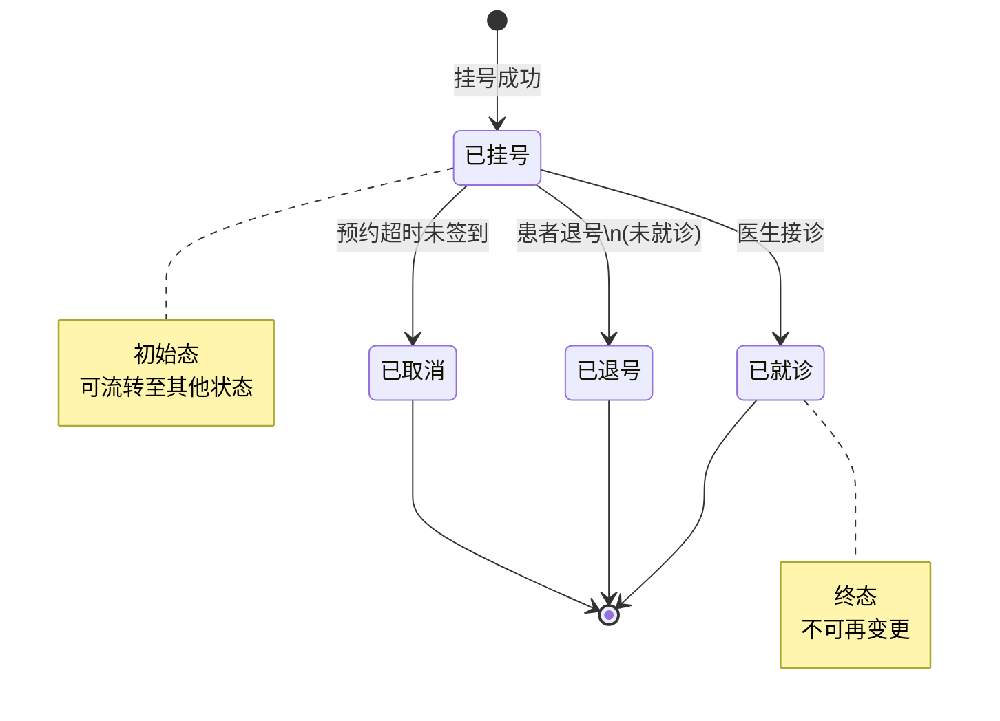
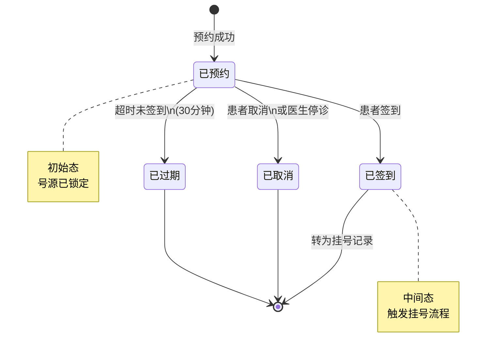
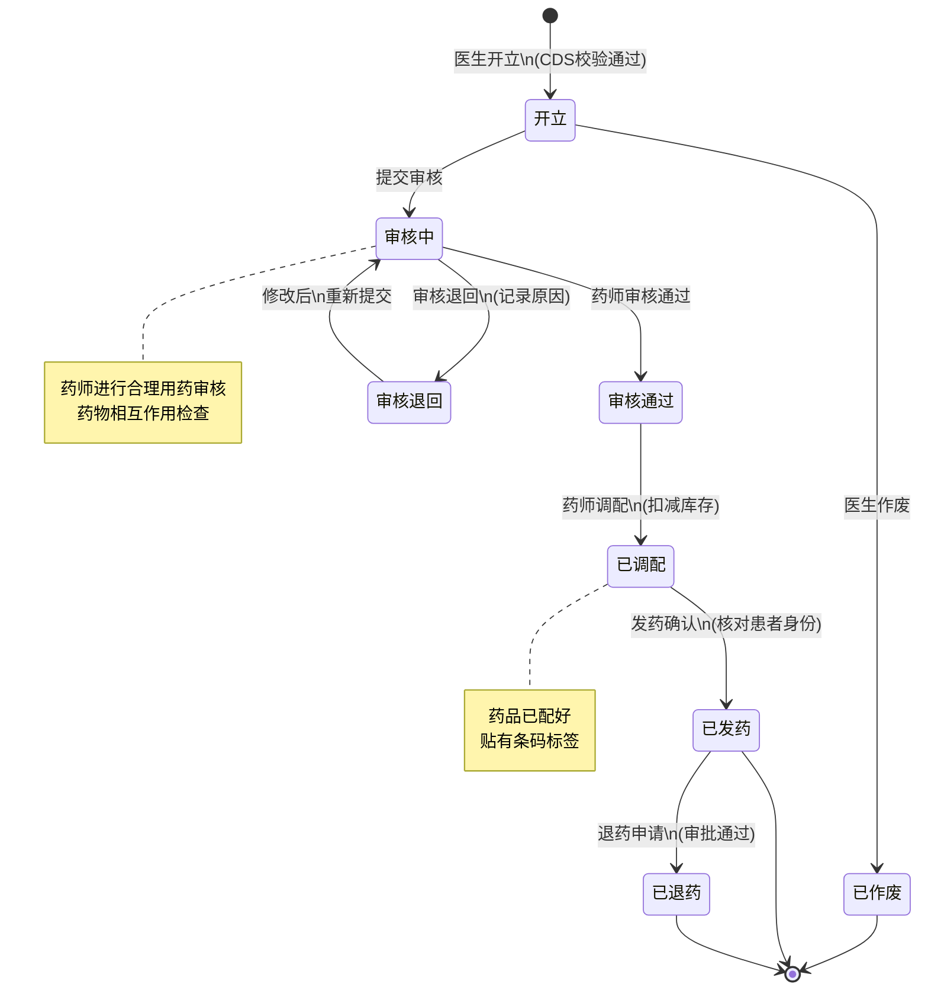

# M01-门诊管理 - 状态机设计文档

> **文档编号**: YUDAO-HIS-SM-M01
> **版本**: V1.0
> **创建日期**: 2026-06-17
> **状态**: 设计中
> **关联文档**: YUDAO-HIS-SM-001 (全局状态机设计文档)

---

## 1. 概述

本文档定义门诊管理模块(M01)核心业务对象的状态机设计，包括挂号状态机、预约状态机和处方状态机。

### 1.1 状态机清单

| 序号 | 状态机编号 | 状态机名称 | 适用对象 | 优先级 | 业务规则 |
|------|------------|----------|----------|--------|----------|
| 1 | SM-001 | 挂号状态机 | op_register | P0 | BR-OP-033 |
| 2 | SM-002 | 预约状态机 | op_appointment | P0 | BR-OP-034 |
| 3 | SM-003 | 处方状态机 | his_prescription | P0 | BR-PHARM-005 |

---

## 2. 挂号状态机 (SM-001)

### 2.1 基本信息

| 属性 | 内容 |
|------|------|
| 状态机编号 | SM-001 |
| 状态机名称 | 挂号状态机 |
| 适用对象 | op_register（挂号记录表） |
| 状态字段 | register_status |
| 业务规则 | BR-OP-033: 挂号状态流转规则 |
| 优先级 | P0（MVP必需） |

### 2.2 状态列表

| 状态编码 | 状态名称 | 状态描述 | 状态类型 | 允许操作 |
|----------|----------|----------|----------|----------|
| 1 | 已挂号 | 挂号成功，等待就诊 | 初始态 | 就诊、退号、取消 |
| 2 | 已就诊 | 医生完成接诊 | 终态 | 无 |
| 3 | 已退号 | 挂号已退，费用退还 | 终态 | 无 |
| 4 | 已取消 | 预约挂号未签到取消 | 终态 | 无 |

### 2.3 状态流转表

| 当前状态 | 触发事件 | 目标状态 | 前置条件 | 执行操作 | 关联规则 |
|----------|----------|----------|----------|----------|----------|
| - | 挂号成功 | 已挂号(1) | 号源可用、支付成功 | 创建挂号记录、分配排队号、扣减号源 | BR-OP-001~003 |
| 已挂号(1) | 医生接诊 | 已就诊(2) | 医生确认接诊 | 更新就诊时间、生成就诊记录 | - |
| 已挂号(1) | 患者退号 | 已退号(3) | 未就诊、在退号时限内 | 原路退款、释放号源、记录退号日志 | BR-OP-003 |
| 已挂号(1) | 预约超时 | 已取消(4) | 预约挂号未签到 | 释放号源、发送取消通知 | BR-OP-052 |

### 2.4 状态流转图



### 2.5 状态约束规则

1. **已就诊不可退号**: 状态为"已就诊"的挂号记录不可执行退号操作
2. **退号时限约束**: 当日挂号超过规定时限需审批方可退号（BR-OP-003）
3. **医保退号同步**: 医保挂号退号需同步撤销医保结算
4. **号源释放**: 退号或取消后自动释放号源

### 2.6 Java枚举定义

```java
/**
 * 挂号状态枚举
 */
public enum RegisterStatusEnum implements StatusEnum {

    REGISTERED(1, "已挂号", "挂号成功，等待就诊"),
    VISITED(2, "已就诊", "医生完成接诊"),
    REFUNDED(3, "已退号", "挂号已退，费用退还"),
    CANCELLED(4, "已取消", "预约挂号未签到取消");

    private final Integer code;
    private final String name;
    private final String description;

    RegisterStatusEnum(Integer code, String name, String description) {
        this.code = code;
        this.name = name;
        this.description = description;
    }

    @Override
    public Integer getCode() {
        return code;
    }

    @Override
    public String getName() {
        return name;
    }

    @Override
    public String getDescription() {
        return description;
    }

    /**
     * 判断是否可以退号
     */
    public boolean canRefund() {
        return this == REGISTERED;
    }

    /**
     * 判断是否为终态
     */
    public boolean isFinal() {
        return this == VISITED || this == REFUNDED || this == CANCELLED;
    }
}
```

---

## 3. 预约状态机 (SM-002)

### 3.1 基本信息

| 属性 | 内容 |
|------|------|
| 状态机编号 | SM-002 |
| 状态机名称 | 预约状态机 |
| 适用对象 | op_appointment（预约记录表） |
| 状态字段 | appointment_status |
| 业务规则 | BR-OP-034: 预约状态流转规则 |
| 优先级 | P0（MVP必需） |

### 3.2 状态列表

| 状态编码 | 状态名称 | 状态描述 | 状态类型 | 允许操作 |
|----------|----------|----------|----------|----------|
| 1 | 已预约 | 预约成功，等待签到 | 初始态 | 签到、取消、过期 |
| 2 | 已签到 | 患者到院签到 | 中间态 | 转挂号 |
| 3 | 已取消 | 患者主动取消或停诊取消 | 终态 | 无 |
| 4 | 已过期 | 超时未签到自动过期 | 终态 | 无 |

### 3.3 状态流转表

| 当前状态 | 触发事件 | 目标状态 | 前置条件 | 执行操作 | 关联规则 |
|----------|----------|----------|----------|----------|----------|
| - | 预约成功 | 已预约(1) | 号源可用、在预约范围内 | 锁定号源、发送预约通知 | BR-OP-001~002 |
| 已预约(1) | 患者签到 | 已签到(2) | 在预约时间段内 | 创建挂号记录、分配排队号 | - |
| 已预约(1) | 患者取消 | 已取消(3) | 取消时间符合规定 | 释放号源、发送取消通知 | BR-OP-015 |
| 已预约(1) | 医生停诊 | 已取消(3) | 管理员确认停诊 | 释放号源、发送停诊通知 | BR-OP-042 |
| 已预约(1) | 超时未签到 | 已过期(4) | 超过预约时间30分钟 | 释放号源、记录过期 | BR-OP-052 |

### 3.4 状态流转图



### 3.5 状态约束规则

1. **预约时间范围**: 只能预约7天内的号源（BR-OP-002）
2. **预约限次**: 每人每科室每日限预约1次（BR-OP-001）
3. **取消时限**: 预约时间前24小时内不可取消
4. **过期处理**: 预约时间段结束后30分钟自动过期

### 3.6 Java枚举定义

```java
/**
 * 预约状态枚举
 */
public enum AppointmentStatusEnum implements StatusEnum {

    APPOINTED(1, "已预约", "预约成功，等待签到"),
    CHECKED_IN(2, "已签到", "患者到院签到"),
    CANCELLED(3, "已取消", "患者主动取消或停诊取消"),
    EXPIRED(4, "已过期", "超时未签到自动过期");

    private final Integer code;
    private final String name;
    private final String description;

    AppointmentStatusEnum(Integer code, String name, String description) {
        this.code = code;
        this.name = name;
        this.description = description;
    }

    @Override
    public Integer getCode() {
        return code;
    }

    @Override
    public String getName() {
        return name;
    }

    @Override
    public String getDescription() {
        return description;
    }

    /**
     * 判断是否可以取消
     */
    public boolean canCancel() {
        return this == APPOINTED;
    }

    /**
     * 判断是否可以签到
     */
    public boolean canCheckIn() {
        return this == APPOINTED;
    }
}
```

---

## 4. 处方状态机 (SM-003)

### 4.1 基本信息

| 属性 | 内容 |
|------|------|
| 状态机编号 | SM-003 |
| 状态机名称 | 处方状态机 |
| 适用对象 | his_prescription（处方记录表） |
| 状态字段 | prescription_status |
| 业务规则 | BR-PHARM-005: 处方必须经审核方可调配 |
| 优先级 | P0（MVP必需） |

### 4.2 状态列表

| 状态编码 | 状态名称 | 状态描述 | 状态类型 | 允许操作 |
|----------|----------|----------|----------|----------|
| 1 | 开立 | 医生已开立处方 | 初始态 | 提交审核、作废 |
| 2 | 审核中 | 药师审核中 | 中间态 | 审核通过、审核退回 |
| 3 | 审核通过 | 药师审核通过 | 中间态 | 调配 |
| 4 | 审核退回 | 审核不通过，退回修改 | 中间态 | 修改后重新提交 |
| 5 | 已调配 | 药品已调配完成 | 中间态 | 发药 |
| 6 | 已发药 | 药品已发放给患者 | 终态 | 退药申请 |
| 7 | 已退药 | 药品已退回 | 终态 | 无 |
| 8 | 已作废 | 处方已作废 | 终态 | 无 |

### 4.3 状态流转表

| 当前状态 | 触发事件 | 目标状态 | 前置条件 | 执行操作 | 关联规则 |
|----------|----------|----------|----------|----------|----------|
| - | 医生开立 | 开立(1) | CDS校验通过 | 创建处方记录 | BR-OP-006 |
| 开立(1) | 提交审核 | 审核中(2) | 处方信息完整 | 发送审核通知 | - |
| 开立(1) | 医生作废 | 已作废(8) | 未开始审核 | 记录作废原因 | - |
| 审核中(2) | 审核通过 | 审核通过(3) | 合理用药检查通过 | 记录审核药师、时间 | BR-PHARM-006 |
| 审核中(2) | 审核退回 | 审核退回(4) | 发现问题 | 记录退回原因、通知医生 | - |
| 审核退回(4) | 修改提交 | 审核中(2) | 医生修改完成 | 重新进入审核流程 | - |
| 审核通过(3) | 药师调配 | 已调配(5) | 库存充足 | 扣减库存、贴标签 | BR-PHARM-009 |
| 已调配(5) | 发药确认 | 已发药(6) | 核对患者身份 | 记录发药时间、药师 | BR-OP-012 |
| 已发药(6) | 退药申请 | 已退药(7) | 审批通过 | 回补库存、记录退药 | - |

### 4.4 状态流转图



### 4.5 状态约束规则

1. **CDS校验**: 处方开立时必须进行CDS校验（BR-OP-006）
2. **审核强制**: 所有处方必须经过药师审核方可调配（BR-PHARM-005）
3. **大额确认**: 处方金额超过500元需医生二次确认（BR-OP-007）
4. **麻醉药品**: 麻醉药品处方需专项管理（BR-PHARM-004）
5. **库存扣减**: 发药确认时库存扣减必须原子操作（BR-PHARM-009）

### 4.6 Java枚举定义

```java
/**
 * 处方状态枚举
 */
public enum PrescriptionStatusEnum implements StatusEnum {

    CREATED(1, "开立", "医生已开立处方"),
    AUDITING(2, "审核中", "药师审核中"),
    AUDIT_PASSED(3, "审核通过", "药师审核通过"),
    AUDIT_REJECTED(4, "审核退回", "审核不通过，退回修改"),
    DISPENSED(5, "已调配", "药品已调配完成"),
    DISPENSED_OUT(6, "已发药", "药品已发放给患者"),
    RETURNED(7, "已退药", "药品已退回"),
    VOIDED(8, "已作废", "处方已作废");

    private final Integer code;
    private final String name;
    private final String description;

    PrescriptionStatusEnum(Integer code, String name, String description) {
        this.code = code;
        this.name = name;
        this.description = description;
    }

    @Override
    public Integer getCode() {
        return code;
    }

    @Override
    public String getName() {
        return name;
    }

    @Override
    public String getDescription() {
        return description;
    }

    /**
     * 判断是否可以调配
     */
    public boolean canDispense() {
        return this == AUDIT_PASSED;
    }

    /**
     * 判断是否可以发药
     */
    public boolean canDispenseOut() {
        return this == DISPENSED;
    }

    /**
     * 判断是否为终态
     */
    public boolean isFinal() {
        return this == DISPENSED_OUT || this == RETURNED || this == VOIDED;
    }
}
```

---

## 附录: 变更历史

| 版本 | 日期 | 变更内容 | 变更人 |
|------|------|----------|--------|
| V1.0 | 2026-06-17 | 从全局状态机设计文档拆分 | YUDAO-AI-HIS架构组 |

---

> **最后更新**: 2026-06-17
