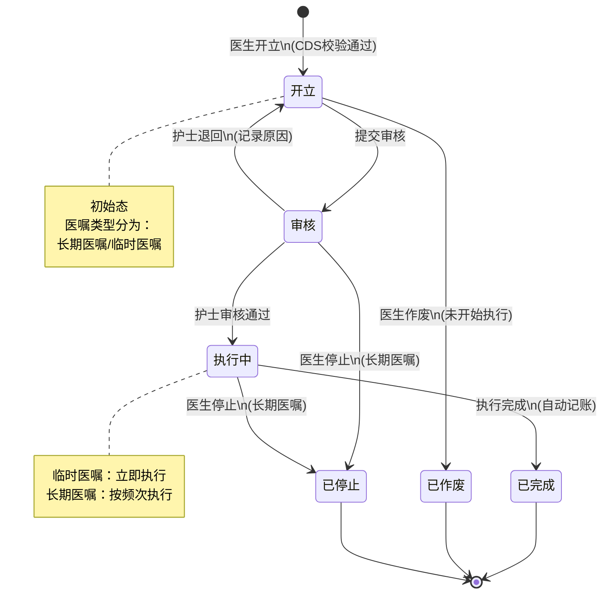
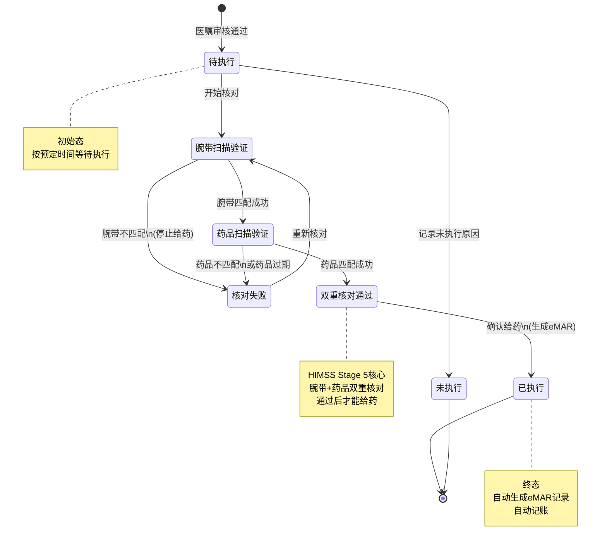
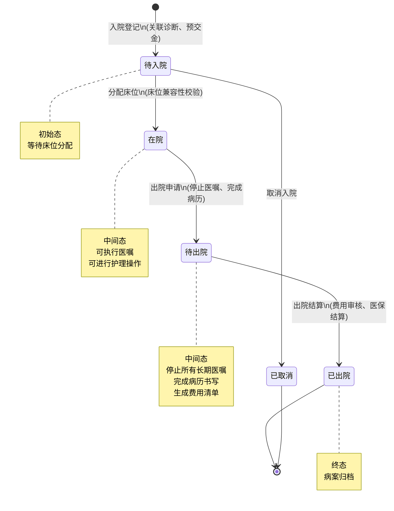

# M02-住院管理 - 状态机设计文档

> **文档编号**: YUDAO-HIS-SM-M02
> **版本**: V1.0
> **创建日期**: 2026-06-17
> **状态**: 设计中
> **关联文档**: YUDAO-HIS-SM-001 (全局状态机设计文档)

---

## 1. 概述

本文档定义住院管理模块(M02)核心业务对象的状态机设计，包括医嘱状态机、eMAR给药状态机和出入院状态机。

### 1.1 状态机清单

| 序号 | 状态机编号 | 状态机名称 | 适用对象 | 优先级 | 业务规则 |
|------|------------|----------|----------|--------|----------|
| 1 | SM-004 | 医嘱状态机 | his_order | P0 | BR-IP-007 |
| 2 | SM-005 | eMAR给药状态机 | his_medication_admin | P0 | BR-EMAR-001~008 |
| 3 | SM-009 | 出入院状态机 | his_admission | P0 | BR-IP-001~014 |

---

## 2. 医嘱状态机 (SM-004)

### 2.1 基本信息

| 属性 | 内容 |
|------|------|
| 状态机编号 | SM-004 |
| 状态机名称 | 医嘱状态机 |
| 适用对象 | his_order（医嘱记录表） |
| 状态字段 | order_status |
| 业务规则 | BR-IP-007: 医嘱状态流转规则 |
| 优先级 | P0（MVP必需） |

### 2.2 状态列表

| 状态编码 | 状态名称 | 状态描述 | 状态类型 | 允许操作 |
|----------|----------|----------|----------|----------|
| 1 | 开立 | 医生已开立医嘱 | 初始态 | 提交审核、作废 |
| 2 | 审核 | 护士审核中 | 中间态 | 审核通过、退回 |
| 3 | 执行中 | 医嘱正在执行 | 中间态 | 执行完成、停止 |
| 4 | 已完成 | 医嘱执行完成 | 终态 | 无 |
| 5 | 已作废 | 医嘱已作废 | 终态 | 无 |
| 6 | 已停止 | 长期医嘱已停止 | 终态 | 无 |

### 2.3 状态流转表

| 当前状态 | 触发事件 | 目标状态 | 前置条件 | 执行操作 | 关联规则 |
|----------|----------|----------|----------|----------|----------|
| - | 医生开立 | 开立(1) | CDS校验通过 | 创建医嘱记录 | BR-IP-005 |
| 开立(1) | 提交审核 | 审核(2) | 医嘱信息完整 | 发送护士站通知 | - |
| 开立(1) | 医生作废 | 已作废(5) | 未开始执行 | 记录作废原因 | - |
| 审核(2) | 审核通过 | 执行中(3) | 护士确认 | 开始执行、临时医嘱立即执行 | - |
| 审核(2) | 护士退回 | 开立(1) | 发现问题 | 记录退回原因、通知医生 | - |
| 执行中(3) | 执行完成 | 已完成(4) | 执行完毕 | 记录执行结果、自动记账 | BR-FIN-004 |
| 执行中(3) | 医生停止 | 已停止(6) | 长期医嘱 | 记录停止原因、时间 | BR-IP-006 |
| 审核(2) | 医生停止 | 已停止(6) | 长期医嘱 | 记录停止信息 | BR-IP-006 |

### 2.4 状态流转图



### 2.5 状态约束规则

1. **CDS校验**: 医嘱开立必须进行CDS校验（BR-IP-005）
2. **长期医嘱停止**: 长期医嘱停止需提前一天（BR-IP-006）
3. **临时医嘱**: 临时医嘱立即执行
4. **出院停止**: 出院前必须停止所有长期医嘱（BR-IP-012）
5. **自动记账**: 医嘱执行完成时自动记账（BR-FIN-004）

### 2.6 Java枚举定义

```java
/**
 * 医嘱状态枚举
 */
public enum OrderStatusEnum implements StatusEnum {

    CREATED(1, "开立", "医生已开立医嘱"),
    AUDITING(2, "审核", "护士审核中"),
    EXECUTING(3, "执行中", "医嘱正在执行"),
    COMPLETED(4, "已完成", "医嘱执行完成"),
    VOIDED(5, "已作废", "医嘱已作废"),
    STOPPED(6, "已停止", "长期医嘱已停止");

    private final Integer code;
    private final String name;
    private final String description;

    OrderStatusEnum(Integer code, String name, String description) {
        this.code = code;
        this.name = name;
        this.description = description;
    }

    @Override
    public Integer getCode() {
        return code;
    }

    @Override
    public String getName() {
        return name;
    }

    @Override
    public String getDescription() {
        return description;
    }

    /**
     * 判断是否可以停止
     */
    public boolean canStop() {
        return this == AUDITING || this == EXECUTING;
    }

    /**
     * 判断是否可以作废
     */
    public boolean canVoid() {
        return this == CREATED;
    }

    /**
     * 判断是否为终态
     */
    public boolean isFinal() {
        return this == COMPLETED || this == VOIDED || this == STOPPED;
    }
}
```

---

## 3. eMAR给药状态机 (SM-005)

### 3.1 基本信息

| 属性 | 内容 |
|------|------|
| 状态机编号 | SM-005 |
| 状态机名称 | eMAR给药状态机 |
| 适用对象 | his_medication_admin（给药记录表） |
| 状态字段 | admin_status |
| 业务规则 | BR-EMAR-001~008: 闭环给药规则 |
| 优先级 | P0（MVP必需） |
| HIMSS要求 | EMRAM Stage 5核心功能 |

### 3.2 状态列表

| 状态编码 | 状态名称 | 状态描述 | 状态类型 | 允许操作 |
|----------|----------|----------|----------|----------|
| 1 | 待执行 | 医嘱已审核，等待执行 | 初始态 | 开始核对、未执行 |
| 2 | 腕带扫描验证 | 正在扫描患者腕带 | 中间态 | 确认匹配、不匹配 |
| 3 | 药品扫描验证 | 正在扫描药品条码 | 中间态 | 确认匹配、不匹配 |
| 4 | 双重核对通过 | 腕带和药品双重核对通过 | 中间态 | 确认给药 |
| 5 | 已执行 | 给药完成 | 终态 | 无 |
| 6 | 未执行 | 未执行给药（记录原因） | 终态 | 补执行 |
| 7 | 核对失败 | 核对不匹配，停止给药 | 中间态 | 重新核对 |

### 3.3 状态流转表

| 当前状态 | 触发事件 | 目标状态 | 前置条件 | 执行操作 | 关联规则 |
|----------|----------|----------|----------|----------|----------|
| - | 医嘱审核通过 | 待执行(1) | 给药医嘱 | 创建给药计划 | - |
| 待执行(1) | 开始核对 | 腕带扫描验证(2) | 护士开始执行 | 记录开始时间 | BR-EMAR-002 |
| 待执行(1) | 记录未执行 | 未执行(6) | 选择未执行原因 | 记录原因、通知医生 | BR-EMAR-008 |
| 腕带扫描验证(2) | 腕带匹配 | 药品扫描验证(3) | 患者身份匹配 | 记录腕带信息 | BR-EMAR-003 |
| 腕带扫描验证(2) | 腕带不匹配 | 核对失败(7) | 患者身份不匹配 | 停止给药、记录异常 | BR-EMAR-003 |
| 药品扫描验证(3) | 药品匹配 | 双重核对通过(4) | 药品信息匹配 | 记录药品批号 | BR-EMAR-006 |
| 药品扫描验证(3) | 药品不匹配 | 核对失败(7) | 药品不匹配 | 停止给药、联系药师 | BR-EMAR-003 |
| 药品扫描验证(3) | 药品过期 | 核对失败(7) | 药品已过期 | 停止给药、记录过期 | BR-EMAR-005 |
| 双重核对通过(4) | 确认给药 | 已执行(5) | 护士确认 | 生成eMAR记录、自动记账 | BR-EMAR-004 |
| 核对失败(7) | 重新核对 | 腕带扫描验证(2) | 重新开始 | 重置核对状态 | - |

### 3.4 状态流转图



### 3.5 状态约束规则

1. **双重核对强制**: 给药前必须完成腕带和药品双重核对（BR-EMAR-001）
2. **扫描顺序**: 必须先扫描腕带再扫描药品（BR-EMAR-002）
3. **核对失败阻止**: 任一核对不匹配即阻止给药（BR-EMAR-003）
4. **eMAR必填项**: 记录必须包含时间、剂量、途径、护士、核对结果（BR-EMAR-004）
5. **药品过期检查**: 过期药品禁止使用（BR-EMAR-005）
6. **批号追溯**: 给药记录必须关联药品批号（BR-EMAR-006）
7. **未执行通知**: 给药未执行需通知医生（BR-EMAR-008）

### 3.6 Java枚举定义

```java
/**
 * eMAR给药状态枚举
 */
public enum MedicationAdminStatusEnum implements StatusEnum {

    PENDING(1, "待执行", "医嘱已审核，等待执行"),
    WRISTBAND_SCANNING(2, "腕带扫描验证", "正在扫描患者腕带"),
    DRUG_SCANNING(3, "药品扫描验证", "正在扫描药品条码"),
    DOUBLE_CHECK_PASSED(4, "双重核对通过", "腕带和药品双重核对通过"),
    ADMINISTERED(5, "已执行", "给药完成"),
    NOT_ADMINISTERED(6, "未执行", "未执行给药（记录原因）"),
    CHECK_FAILED(7, "核对失败", "核对不匹配，停止给药");

    private final Integer code;
    private final String name;
    private final String description;

    MedicationAdminStatusEnum(Integer code, String name, String description) {
        this.code = code;
        this.name = name;
        this.description = description;
    }

    @Override
    public Integer getCode() {
        return code;
    }

    @Override
    public String getName() {
        return name;
    }

    @Override
    public String getDescription() {
        return description;
    }

    /**
     * 判断是否可以给药
     */
    public boolean canAdminister() {
        return this == DOUBLE_CHECK_PASSED;
    }

    /**
     * 判断是否为终态
     */
    public boolean isFinal() {
        return this == ADMINISTERED || this == NOT_ADMINISTERED;
    }

    /**
     * 判断是否需要重新核对
     */
    public boolean canRetry() {
        return this == CHECK_FAILED;
    }
}
```

---

## 4. 出入院状态机 (SM-009)

### 4.1 基本信息

| 属性 | 内容 |
|------|------|
| 状态机编号 | SM-009 |
| 状态机名称 | 出入院状态机 |
| 适用对象 | his_admission（住院记录表） |
| 状态字段 | admission_status |
| 业务规则 | BR-IP-001~014: 住院管理规则 |
| 优先级 | P0（MVP必需） |

### 4.2 状态列表

| 状态编码 | 状态名称 | 状态描述 | 状态类型 | 允许操作 |
|----------|----------|----------|----------|----------|
| 1 | 待入院 | 已办理入院登记，等待床位 | 初始态 | 分配床位、取消 |
| 2 | 在院 | 已入院在院治疗 | 中间态 | 医嘱、出院申请 |
| 3 | 待出院 | 已申请出院，等待结算 | 中间态 | 结算 |
| 4 | 已出院 | 出院结算完成 | 终态 | 无 |
| 5 | 已取消 | 入院登记已取消 | 终态 | 无 |

### 4.3 状态流转表

| 当前状态 | 触发事件 | 目标状态 | 前置条件 | 执行操作 | 关联规则 |
|----------|----------|----------|----------|----------|----------|
| - | 入院登记 | 待入院(1) | 关联诊断、预交金缴纳 | 创建住院记录 | BR-IP-001~002 |
| 待入院(1) | 分配床位 | 在院(2) | 床位可用、床位兼容性校验 | 分配床位、开始医嘱 | BR-IP-003 |
| 待入院(1) | 取消入院 | 已取消(5) | 未分配床位 | 退还预交金 | - |
| 在院(2) | 出院申请 | 待出院(3) | 停止长期医嘱、完成病历 | 停止医嘱、生成费用清单 | BR-IP-012~013 |
| 待出院(3) | 出院结算 | 已出院(4) | 费用审核完成、无未结费用 | 结算、医保结算、病案归档 | BR-IP-014~017 |

### 4.4 状态流转图



### 4.5 状态约束规则

1. **入院关联诊断**: 入院必须关联门诊诊断或急诊诊断（BR-IP-001）
2. **预交金管理**: 预交金不足时提醒，欠费超阈值限制记账（BR-IP-002）
3. **床位分配**: 需考虑性别、病种、感染等因素（BR-IP-003）
4. **入院评估**: 入院护理评估必须在4小时内完成（BR-IP-004）
5. **出院停止医嘱**: 出院前必须停止所有长期医嘱（BR-IP-012）
6. **出院费用审核**: 必须完成费用审核，无未结费用（BR-IP-013）
7. **病案归档**: 归档后不可修改（BR-IP-014）

### 4.6 Java枚举定义

```java
/**
 * 出入院状态枚举
 */
public enum AdmissionStatusEnum implements StatusEnum {

    PENDING(1, "待入院", "已办理入院登记，等待床位"),
    IN_HOSPITAL(2, "在院", "已入院在院治疗"),
    PENDING_DISCHARGE(3, "待出院", "已申请出院，等待结算"),
    DISCHARGED(4, "已出院", "出院结算完成"),
    CANCELLED(5, "已取消", "入院登记已取消");

    private final Integer code;
    private final String name;
    private final String description;

    AdmissionStatusEnum(Integer code, String name, String description) {
        this.code = code;
        this.name = name;
        this.description = description;
    }

    @Override
    public Integer getCode() {
        return code;
    }

    @Override
    public String getName() {
        return name;
    }

    @Override
    public String getDescription() {
        return description;
    }

    /**
     * 判断是否可以出院
     */
    public boolean canDischarge() {
        return this == IN_HOSPITAL;
    }

    /**
     * 判断是否为终态
     */
    public boolean isFinal() {
        return this == DISCHARGED || this == CANCELLED;
    }
}
```

---

## 附录: 变更历史

| 版本 | 日期 | 变更内容 | 变更人 |
|------|------|----------|--------|
| V1.0 | 2026-06-17 | 从全局状态机设计文档拆分 | YUDAO-AI-HIS架构组 |

---

> **最后更新**: 2026-06-17
