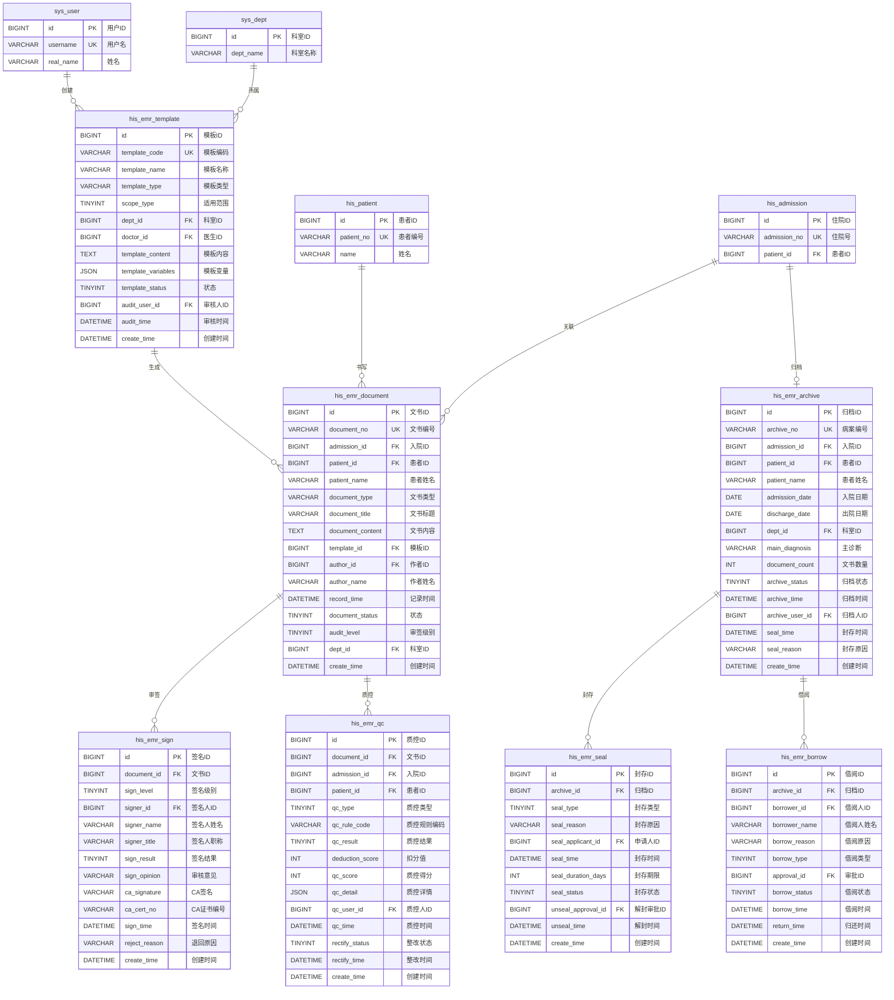

# M03 电子病历子系统 - 数据库设计文档

> **文档编号**: YUDAO-HIS-DB-M03
> **版本**: V1.0
> **创建日期**: 2026-06-22
> **状态**: 设计中
> **参考文档**: YUDAO-HIS-PRD-M03, YUDAO-HIS-DB-001

---

## 1. 设计概述

### 1.1 设计原则

| 原则 | 说明 |
|------|------|
| 标准化 | 遵循HL7 FHIR R4资源映射标准，符合国家电子病历应用水平分级评价标准 |
| 规范化 | 遵循数据库第三范式(3NF)，减少数据冗余 |
| 安全性 | 病历数据加密存储，CA电子签名认证，审计日志完整记录 |
| 可追溯 | 完整记录病历审签、质控、归档全过程 |
| 长期保存 | 病历保存期限>=30年，支持PDF/A长期保存格式 |

### 1.2 命名规范

| 对象类型 | 命名规则 | 示例 |
|----------|----------|------|
| 表名 | 小写下划线，模块前缀his_emr_ | his_emr_template, his_emr_document |
| 主键 | id 或 表名_id | id, document_id |
| 外键 | 关联表名_id | patient_id, admission_id |
| 索引 | idx_表名_字段名 | idx_emr_document_patient |
| 唯一索引 | uk_表名_字段名 | uk_emr_template_code |

### 1.3 通用字段规范

基于 ruoyi-vue-pro 框架规范，所有表均包含以下通用字段：

| 字段名 | 类型 | 说明 |
|--------|------|------|
| creator | VARCHAR(64) | 创建者 |
| create_time | DATETIME | 创建时间 |
| updater | VARCHAR(64) | 更新者 |
| update_time | DATETIME | 更新时间 |
| deleted | BIT(1) | 是否删除 |
| tenant_id | BIGINT | 租户编号 |

---

## 2. ER图设计

### 2.1 电子病历域 ER图



### 2.2 实体关系说明

| 关系 | 说明 |
|------|------|
| 患者 -> 病历文书 | 一对多，一个患者可以有多份病历文书 |
| 入院记录 -> 病历文书 | 一对多，一次入院可以有多份病历文书 |
| 病历模板 -> 病历文书 | 一对多，一个模板可以生成多份病历 |
| 病历文书 -> 签名记录 | 一对多，一份病历可以有多级签名记录 |
| 病历文书 -> 质控记录 | 一对多，一份病历可以有多次质控记录 |
| 入院记录 -> 病案归档 | 一对一，一次入院对应一份归档病案 |
| 病案归档 -> 封存记录 | 一对多，一份病案可以多次封存/解封 |
| 病案归档 -> 借阅记录 | 一对多，一份病案可以多次借阅 |

---

## 3. DDL脚本设计

### 3.1 病历模板表 (his_emr_template)

```sql
-- =============================================
-- 病历模板表
-- 功能说明: 管理入院记录、病程记录、出院记录等病历模板
-- 支持全院模板、科室模板、个人模板三级管理
-- =============================================
CREATE TABLE `his_emr_template` (
    `id` BIGINT NOT NULL AUTO_INCREMENT COMMENT '模板ID',
    `template_code` VARCHAR(30) NOT NULL COMMENT '模板编码',
    `template_name` VARCHAR(100) NOT NULL COMMENT '模板名称',
    `template_type` VARCHAR(50) NOT NULL COMMENT '模板类型: EMR-ADMISSION入院记录/EMR-FIRST-PROGRESS首次病程/EMR-DAILY-PROGRESS日常病程/EMR-ROUND查房记录/EMR-DISCHARGE出院记录/EMR-DEATH死亡记录/EMR-CONSENT知情同意书',
    `template_category` VARCHAR(50) COMMENT '模板分类: 入院记录类/病程记录类/出院记录类/知情同意书类/专科记录类',
    `scope_type` TINYINT NOT NULL COMMENT '适用范围: 1全院/2科室/3个人',
    `dept_id` BIGINT COMMENT '适用科室ID(科室模板时必填)',
    `dept_name` VARCHAR(100) COMMENT '适用科室名称',
    `doctor_id` BIGINT COMMENT '创建医生ID(个人模板时必填)',
    `doctor_name` VARCHAR(50) COMMENT '创建医生姓名',
    `disease_code` VARCHAR(50) COMMENT '病种编码(按病种分类时)',
    `disease_name` VARCHAR(100) COMMENT '病种名称',
    `template_content` TEXT NOT NULL COMMENT '模板内容(HTML/JSON格式)',
    `template_variables` JSON COMMENT '模板变量定义(JSON格式)',
    `template_elements` JSON COMMENT '结构化元素定义(JSON格式)',
    `template_status` TINYINT NOT NULL DEFAULT 1 COMMENT '状态: 1草稿/2待审核/3已发布/4已停用',
    `version_no` INT NOT NULL DEFAULT 1 COMMENT '版本号',
    `parent_id` BIGINT COMMENT '父模板ID(版本管理)',
    `audit_user_id` BIGINT COMMENT '审核人ID',
    `audit_user_name` VARCHAR(50) COMMENT '审核人姓名',
    `audit_time` DATETIME COMMENT '审核时间',
    `audit_opinion` VARCHAR(500) COMMENT '审核意见',
    `use_count` INT NOT NULL DEFAULT 0 COMMENT '使用次数',
    `sort` INT DEFAULT 0 COMMENT '排序',
    `remark` VARCHAR(500) COMMENT '备注',
    `creator` VARCHAR(64) DEFAULT '' COMMENT '创建者',
    `create_time` DATETIME NOT NULL DEFAULT CURRENT_TIMESTAMP COMMENT '创建时间',
    `updater` VARCHAR(64) DEFAULT '' COMMENT '更新者',
    `update_time` DATETIME NOT NULL DEFAULT CURRENT_TIMESTAMP ON UPDATE CURRENT_TIMESTAMP COMMENT '更新时间',
    `deleted` BIT(1) NOT NULL DEFAULT b'0' COMMENT '是否删除',
    `tenant_id` BIGINT NOT NULL DEFAULT 0 COMMENT '租户编号',
    PRIMARY KEY (`id`),
    UNIQUE KEY `uk_template_code` (`template_code`),
    KEY `idx_emr_template_name` (`template_name`),
    KEY `idx_emr_template_type` (`template_type`),
    KEY `idx_emr_template_scope` (`scope_type`),
    KEY `idx_emr_template_dept` (`dept_id`),
    KEY `idx_emr_template_doctor` (`doctor_id`),
    KEY `idx_emr_template_status` (`template_status`)
) ENGINE=InnoDB DEFAULT CHARSET=utf8mb4 COLLATE=utf8mb4_unicode_ci COMMENT='病历模板表';
```

### 3.2 病历文书表 (his_emr_document)

```sql
-- =============================================
-- 病历文书表
-- 功能说明: 存储入院记录、病程记录、出院记录等病历文书
-- 支持结构化录入和自由文本编辑
-- 年增量估算: 约300万条
-- =============================================
CREATE TABLE `his_emr_document` (
    `id` BIGINT NOT NULL AUTO_INCREMENT COMMENT '病历文书ID',
    `document_no` VARCHAR(30) NOT NULL COMMENT '病历文书编号',
    `admission_id` BIGINT NOT NULL COMMENT '入院记录ID',
    `admission_no` VARCHAR(30) COMMENT '住院号',
    `patient_id` BIGINT NOT NULL COMMENT '患者ID',
    `patient_name` VARCHAR(50) NOT NULL COMMENT '患者姓名',
    `gender` CHAR(1) COMMENT '性别',
    `age` INT COMMENT '年龄',
    `document_type` VARCHAR(50) NOT NULL COMMENT '文书类型编码: EMR-ADMISSION入院记录/EMR-FIRST-PROGRESS首次病程/EMR-DAILY-PROGRESS日常病程/EMR-ROUND查房记录/EMR-HANDOVER交接班/EMR-CONSULTATION会诊记录/EMR-DISCHARGE出院记录/EMR-DEATH死亡记录/EMR-CONSENT知情同意书',
    `document_title` VARCHAR(100) NOT NULL COMMENT '文书标题',
    `document_content` TEXT NOT NULL COMMENT '文书内容(HTML格式)',
    `document_content_text` TEXT COMMENT '文书纯文本内容(用于检索)',
    `structured_data` JSON COMMENT '结构化数据(JSON格式)',
    `template_id` BIGINT COMMENT '使用模板ID',
    `template_name` VARCHAR(100) COMMENT '模板名称',
    `author_id` BIGINT NOT NULL COMMENT '作者ID(住院医师)',
    `author_name` VARCHAR(50) NOT NULL COMMENT '作者姓名',
    `author_title` VARCHAR(50) COMMENT '作者职称',
    `record_time` DATETIME NOT NULL COMMENT '记录时间',
    `document_status` TINYINT NOT NULL DEFAULT 1 COMMENT '状态: 1草稿/2待审签/3已审签/4已归档/5已封存',
    `audit_level` TINYINT NOT NULL DEFAULT 3 COMMENT '审签级别: 1一级/2二级/3三级',
    `current_audit_level` TINYINT DEFAULT 0 COMMENT '当前审签级别: 0未提交/1一级审签中/2二级审签中/3三级审签中/4审签完成',
    `dept_id` BIGINT NOT NULL COMMENT '科室ID',
    `dept_name` VARCHAR(100) COMMENT '科室名称',
    `word_count` INT DEFAULT 0 COMMENT '字数统计',
    `complete_time` DATETIME COMMENT '完成时间(提交审签时间)',
    `lock_time` DATETIME COMMENT '锁定时间(审签完成后锁定)',
    `lock_by` BIGINT COMMENT '锁定操作人ID',
    `is_printed` TINYINT DEFAULT 0 COMMENT '是否打印: 0否/1是',
    `print_count` INT DEFAULT 0 COMMENT '打印次数',
    `last_print_time` DATETIME COMMENT '最后打印时间',
    `is_modified` TINYINT DEFAULT 0 COMMENT '是否修改过: 0否/1是',
    `modify_count` INT DEFAULT 0 COMMENT '修改次数',
    `is_timeout` TINYINT DEFAULT 0 COMMENT '是否超时: 0否/1是',
    `timeout_hours` DECIMAL(10,1) DEFAULT 0.0 COMMENT '超时小时数',
    `remark` VARCHAR(500) COMMENT '备注',
    `creator` VARCHAR(64) DEFAULT '' COMMENT '创建者',
    `create_time` DATETIME NOT NULL DEFAULT CURRENT_TIMESTAMP COMMENT '创建时间',
    `updater` VARCHAR(64) DEFAULT '' COMMENT '更新者',
    `update_time` DATETIME NOT NULL DEFAULT CURRENT_TIMESTAMP ON UPDATE CURRENT_TIMESTAMP COMMENT '更新时间',
    `deleted` BIT(1) NOT NULL DEFAULT b'0' COMMENT '是否删除',
    `tenant_id` BIGINT NOT NULL DEFAULT 0 COMMENT '租户编号',
    PRIMARY KEY (`id`),
    UNIQUE KEY `uk_document_no` (`document_no`),
    KEY `idx_emr_document_admission` (`admission_id`),
    KEY `idx_emr_document_patient` (`patient_id`),
    KEY `idx_emr_document_type` (`document_type`),
    KEY `idx_emr_document_author` (`author_id`),
    KEY `idx_emr_document_status` (`document_status`),
    KEY `idx_emr_document_dept` (`dept_id`),
    KEY `idx_emr_document_time` (`record_time`),
    KEY `idx_emr_document_template` (`template_id`),
    KEY `idx_emr_document_audit_level` (`current_audit_level`)
) ENGINE=InnoDB DEFAULT CHARSET=utf8mb4 COLLATE=utf8mb4_unicode_ci COMMENT='病历文书表';
```

### 3.3 病历签名记录表 (his_emr_sign)

```sql
-- =============================================
-- 病历签名记录表
-- 功能说明: 记录病历三级医师审签过程
-- 集成CA电子签名，确保病历真实性和法律效力
-- =============================================
CREATE TABLE `his_emr_sign` (
    `id` BIGINT NOT NULL AUTO_INCREMENT COMMENT '签名记录ID',
    `sign_no` VARCHAR(30) COMMENT '签名记录编号',
    `document_id` BIGINT NOT NULL COMMENT '病历文书ID',
    `document_no` VARCHAR(30) COMMENT '病历文书编号',
    `admission_id` BIGINT COMMENT '入院记录ID',
    `patient_id` BIGINT COMMENT '患者ID',
    `patient_name` VARCHAR(50) COMMENT '患者姓名',
    `sign_level` TINYINT NOT NULL COMMENT '签名级别: 1一级(主治医师)/2二级(副主任医师)/3三级(主任医师/科主任)',
    `sign_role` VARCHAR(50) COMMENT '签名角色: 主治医师/副主任医师/主任医师/科主任/医疗院长',
    `signer_id` BIGINT NOT NULL COMMENT '签名人ID',
    `signer_name` VARCHAR(50) NOT NULL COMMENT '签名人姓名',
    `signer_title` VARCHAR(50) COMMENT '签名人职称',
    `signer_dept_id` BIGINT COMMENT '签名人科室ID',
    `signer_dept_name` VARCHAR(100) COMMENT '签名人科室名称',
    `sign_result` TINYINT NOT NULL COMMENT '签名结果: 1通过/2退回',
    `sign_opinion` VARCHAR(500) COMMENT '审核意见',
    `ca_signature` VARCHAR(500) COMMENT 'CA签名数据',
    `ca_cert_no` VARCHAR(50) COMMENT 'CA证书编号',
    `ca_sign_time` DATETIME COMMENT 'CA签名时间',
    `ca_verify_result` TINYINT COMMENT 'CA验证结果: 0未验证/1验证通过/2验证失败',
    `sign_time` DATETIME NOT NULL COMMENT '签名时间',
    `reject_reason` VARCHAR(500) COMMENT '退回原因',
    `reject_time` DATETIME COMMENT '退回时间',
    `resign_count` INT DEFAULT 0 COMMENT '重签次数',
    `is_valid` TINYINT DEFAULT 1 COMMENT '是否有效: 0无效/1有效',
    `remark` VARCHAR(500) COMMENT '备注',
    `creator` VARCHAR(64) DEFAULT '' COMMENT '创建者',
    `create_time` DATETIME NOT NULL DEFAULT CURRENT_TIMESTAMP COMMENT '创建时间',
    `updater` VARCHAR(64) DEFAULT '' COMMENT '更新者',
    `update_time` DATETIME NOT NULL DEFAULT CURRENT_TIMESTAMP ON UPDATE CURRENT_TIMESTAMP COMMENT '更新时间',
    `deleted` BIT(1) NOT NULL DEFAULT b'0' COMMENT '是否删除',
    `tenant_id` BIGINT NOT NULL DEFAULT 0 COMMENT '租户编号',
    PRIMARY KEY (`id`),
    KEY `idx_emr_sign_document` (`document_id`),
    KEY `idx_emr_sign_admission` (`admission_id`),
    KEY `idx_emr_sign_patient` (`patient_id`),
    KEY `idx_emr_sign_level` (`sign_level`),
    KEY `idx_emr_sign_signer` (`signer_id`),
    KEY `idx_emr_sign_result` (`sign_result`),
    KEY `idx_emr_sign_time` (`sign_time`)
) ENGINE=InnoDB DEFAULT CHARSET=utf8mb4 COLLATE=utf8mb4_unicode_ci COMMENT='病历签名记录表';
```

### 3.4 病历质控记录表 (his_emr_qc)

```sql
-- =============================================
-- 病历质控记录表
-- 功能说明: 记录病历时限质控和完整性质控结果
-- 支持质控评分、整改通知、整改确认闭环管理
-- =============================================
CREATE TABLE `his_emr_qc` (
    `id` BIGINT NOT NULL AUTO_INCREMENT COMMENT '质控记录ID',
    `qc_no` VARCHAR(30) COMMENT '质控记录编号',
    `document_id` BIGINT NOT NULL COMMENT '病历文书ID',
    `document_no` VARCHAR(30) COMMENT '病历文书编号',
    `admission_id` BIGINT NOT NULL COMMENT '入院记录ID',
    `patient_id` BIGINT NOT NULL COMMENT '患者ID',
    `patient_name` VARCHAR(50) COMMENT '患者姓名',
    `document_type` VARCHAR(50) COMMENT '文书类型',
    `author_id` BIGINT COMMENT '作者ID',
    `author_name` VARCHAR(50) COMMENT '作者姓名',
    `qc_type` TINYINT NOT NULL COMMENT '质控类型: 1时限质控/2完整性质控/3逻辑质控/4综合质控',
    `qc_rule_code` VARCHAR(30) NOT NULL COMMENT '质控规则编码',
    `qc_rule_name` VARCHAR(100) COMMENT '质控规则名称',
    `qc_result` TINYINT NOT NULL COMMENT '质控结果: 1合格/2不合格',
    `deduction_score` INT NOT NULL DEFAULT 0 COMMENT '扣分值',
    `qc_score` INT NOT NULL DEFAULT 100 COMMENT '质控得分(百分制)',
    `qc_detail` JSON NOT NULL COMMENT '质控详情(检查项列表JSON格式)',
    `qc_items` JSON COMMENT '质控项目明细(JSON格式)',
    `timeout_detail` JSON COMMENT '超时详情(JSON格式)',
    `incomplete_items` JSON COMMENT '缺失项列表(JSON格式)',
    `qc_user_id` BIGINT NOT NULL COMMENT '质控人ID',
    `qc_user_name` VARCHAR(50) COMMENT '质控人姓名',
    `qc_time` DATETIME NOT NULL COMMENT '质控时间',
    `qc_method` TINYINT DEFAULT 1 COMMENT '质控方式: 1系统自动/2人工质控',
    `rectify_status` TINYINT NOT NULL DEFAULT 1 COMMENT '整改状态: 1待整改/2整改中/3已整改/4已确认',
    `rectify_user_id` BIGINT COMMENT '整改人ID',
    `rectify_user_name` VARCHAR(50) COMMENT '整改人姓名',
    `rectify_time` DATETIME COMMENT '整改时间',
    `rectify_content` TEXT COMMENT '整改内容',
    `confirm_user_id` BIGINT COMMENT '确认人ID',
    `confirm_user_name` VARCHAR(50) COMMENT '确认人姓名',
    `confirm_time` DATETIME COMMENT '确认时间',
    `notify_status` TINYINT DEFAULT 0 COMMENT '通知状态: 0未通知/1已通知',
    `notify_time` DATETIME COMMENT '通知时间',
    `remark` VARCHAR(500) COMMENT '备注',
    `creator` VARCHAR(64) DEFAULT '' COMMENT '创建者',
    `create_time` DATETIME NOT NULL DEFAULT CURRENT_TIMESTAMP COMMENT '创建时间',
    `updater` VARCHAR(64) DEFAULT '' COMMENT '更新者',
    `update_time` DATETIME NOT NULL DEFAULT CURRENT_TIMESTAMP ON UPDATE CURRENT_TIMESTAMP COMMENT '更新时间',
    `deleted` BIT(1) NOT NULL DEFAULT b'0' COMMENT '是否删除',
    `tenant_id` BIGINT NOT NULL DEFAULT 0 COMMENT '租户编号',
    PRIMARY KEY (`id`),
    KEY `idx_emr_qc_document` (`document_id`),
    KEY `idx_emr_qc_admission` (`admission_id`),
    KEY `idx_emr_qc_patient` (`patient_id`),
    KEY `idx_emr_qc_type` (`qc_type`),
    KEY `idx_emr_qc_result` (`qc_result`),
    KEY `idx_emr_qc_rectify` (`rectify_status`),
    KEY `idx_emr_qc_user` (`qc_user_id`),
    KEY `idx_emr_qc_time` (`qc_time`),
    KEY `idx_emr_qc_author` (`author_id`)
) ENGINE=InnoDB DEFAULT CHARSET=utf8mb4 COLLATE=utf8mb4_unicode_ci COMMENT='病历质控记录表';
```

### 3.5 病案归档表 (his_emr_archive)

```sql
-- =============================================
-- 病案归档表
-- 功能说明: 管理病历归档，归档后病历不可修改
-- 支持病案检索、病历封存、借阅管理
-- 年增量估算: 约30万条
-- =============================================
CREATE TABLE `his_emr_archive` (
    `id` BIGINT NOT NULL AUTO_INCREMENT COMMENT '归档记录ID',
    `archive_no` VARCHAR(30) NOT NULL COMMENT '病案编号',
    `admission_id` BIGINT NOT NULL COMMENT '入院记录ID',
    `admission_no` VARCHAR(30) COMMENT '住院号',
    `patient_id` BIGINT NOT NULL COMMENT '患者ID',
    `patient_name` VARCHAR(50) NOT NULL COMMENT '患者姓名',
    `gender` CHAR(1) COMMENT '性别',
    `age` INT COMMENT '年龄',
    `id_card_no` VARCHAR(18) COMMENT '身份证号',
    `admission_date` DATE NOT NULL COMMENT '入院日期',
    `discharge_date` DATE COMMENT '出院日期',
    `dept_id` BIGINT NOT NULL COMMENT '科室ID',
    `dept_name` VARCHAR(100) COMMENT '科室名称',
    `ward_id` BIGINT COMMENT '病区ID',
    `ward_name` VARCHAR(100) COMMENT '病区名称',
    `attending_doctor_id` BIGINT COMMENT '主治医生ID',
    `attending_doctor_name` VARCHAR(50) COMMENT '主治医生姓名',
    `main_diagnosis` VARCHAR(200) NOT NULL COMMENT '主诊断',
    `main_diagnosis_code` VARCHAR(50) COMMENT '主诊断编码(ICD-10)',
    `secondary_diagnosis` TEXT COMMENT '次诊断(JSON格式)',
    `operation_name` VARCHAR(200) COMMENT '手术名称',
    `operation_code` VARCHAR(50) COMMENT '手术编码(ICD-9-CM)',
    `operation_date` DATE COMMENT '手术日期',
    `document_count` INT NOT NULL DEFAULT 0 COMMENT '文书数量',
    `document_list` JSON COMMENT '文书清单(JSON格式)',
    `archive_status` TINYINT NOT NULL DEFAULT 1 COMMENT '归档状态: 1待归档/2已归档/3已封存',
    `archive_time` DATETIME COMMENT '归档时间',
    `archive_user_id` BIGINT COMMENT '归档人ID',
    `archive_user_name` VARCHAR(50) COMMENT '归档人姓名',
    `archive_type` TINYINT DEFAULT 1 COMMENT '归档方式: 1电子归档/2纸质归档/3混合归档',
    `storage_location` VARCHAR(100) COMMENT '存放位置',
    `storage_box_no` VARCHAR(50) COMMENT '档案盒编号',
    `seal_status` TINYINT DEFAULT 0 COMMENT '封存状态: 0未封存/1已封存/2已解封',
    `seal_time` DATETIME COMMENT '封存时间',
    `seal_reason` VARCHAR(500) COMMENT '封存原因',
    `seal_approval_id` BIGINT COMMENT '封存审批ID',
    `is_borrowed` TINYINT DEFAULT 0 COMMENT '是否借出: 0否/1是',
    `borrow_count` INT DEFAULT 0 COMMENT '借阅次数',
    `quality_score` INT COMMENT '病历质量评分',
    `quality_level` VARCHAR(20) COMMENT '病历质量等级: 甲级/乙级/丙级',
    `remark` VARCHAR(500) COMMENT '备注',
    `creator` VARCHAR(64) DEFAULT '' COMMENT '创建者',
    `create_time` DATETIME NOT NULL DEFAULT CURRENT_TIMESTAMP COMMENT '创建时间',
    `updater` VARCHAR(64) DEFAULT '' COMMENT '更新者',
    `update_time` DATETIME NOT NULL DEFAULT CURRENT_TIMESTAMP ON UPDATE CURRENT_TIMESTAMP COMMENT '更新时间',
    `deleted` BIT(1) NOT NULL DEFAULT b'0' COMMENT '是否删除',
    `tenant_id` BIGINT NOT NULL DEFAULT 0 COMMENT '租户编号',
    PRIMARY KEY (`id`),
    UNIQUE KEY `uk_archive_no` (`archive_no`),
    KEY `idx_emr_archive_admission` (`admission_id`),
    KEY `idx_emr_archive_patient` (`patient_id`),
    KEY `idx_emr_archive_dept` (`dept_id`),
    KEY `idx_emr_archive_status` (`archive_status`),
    KEY `idx_emr_archive_date` (`admission_date`),
    KEY `idx_emr_archive_discharge` (`discharge_date`),
    KEY `idx_emr_archive_diagnosis` (`main_diagnosis_code`),
    KEY `idx_emr_archive_seal` (`seal_status`)
) ENGINE=InnoDB DEFAULT CHARSET=utf8mb4 COLLATE=utf8mb4_unicode_ci COMMENT='病案归档表';
```

### 3.6 病历封存记录表 (his_emr_seal)

```sql
-- =============================================
-- 病历封存记录表
-- 功能说明: 记录病历封存和解封过程
-- 用于医疗纠纷等特殊情况下的病历封存管理
-- =============================================
CREATE TABLE `his_emr_seal` (
    `id` BIGINT NOT NULL AUTO_INCREMENT COMMENT '封存记录ID',
    `seal_no` VARCHAR(30) COMMENT '封存记录编号',
    `archive_id` BIGINT NOT NULL COMMENT '归档记录ID',
    `archive_no` VARCHAR(30) COMMENT '病案编号',
    `patient_id` BIGINT COMMENT '患者ID',
    `patient_name` VARCHAR(50) COMMENT '患者姓名',
    `seal_type` TINYINT NOT NULL COMMENT '封存类型: 1医疗纠纷封存/2行政封存/3司法封存/4其他',
    `seal_reason` VARCHAR(500) NOT NULL COMMENT '封存原因',
    `seal_applicant_id` BIGINT NOT NULL COMMENT '申请封存人ID',
    `seal_applicant_name` VARCHAR(50) NOT NULL COMMENT '申请封存人姓名',
    `seal_applicant_phone` VARCHAR(20) COMMENT '申请人联系电话',
    `seal_applicant_relation` VARCHAR(50) COMMENT '申请人与患者关系',
    `seal_time` DATETIME NOT NULL COMMENT '封存时间',
    `seal_user_id` BIGINT NOT NULL COMMENT '封存操作人ID',
    `seal_user_name` VARCHAR(50) NOT NULL COMMENT '封存操作人姓名',
    `seal_duration_days` INT NOT NULL COMMENT '封存期限(天)',
    `seal_expire_date` DATE COMMENT '封存到期日期',
    `seal_status` TINYINT NOT NULL DEFAULT 1 COMMENT '封存状态: 1已封存/2已解封',
    `seal_condition` VARCHAR(500) COMMENT '封存条件',
    `witness_name` VARCHAR(50) COMMENT '见证人姓名',
    `witness_phone` VARCHAR(20) COMMENT '见证人电话',
    `unseal_approval_id` BIGINT COMMENT '解封审批ID',
    `unseal_approval_no` VARCHAR(30) COMMENT '解封审批编号',
    `unseal_reason` VARCHAR(500) COMMENT '解封原因',
    `unseal_time` DATETIME COMMENT '解封时间',
    `unseal_user_id` BIGINT COMMENT '解封操作人ID',
    `unseal_user_name` VARCHAR(50) COMMENT '解封操作人姓名',
    `unseal_approver_id` BIGINT COMMENT '解封审批人ID',
    `unseal_approver_name` VARCHAR(50) COMMENT '解封审批人姓名',
    `document_list` JSON COMMENT '封存文书清单(JSON格式)',
    `seal_location` VARCHAR(100) COMMENT '封存存放位置',
    `remark` VARCHAR(500) COMMENT '备注',
    `creator` VARCHAR(64) DEFAULT '' COMMENT '创建者',
    `create_time` DATETIME NOT NULL DEFAULT CURRENT_TIMESTAMP COMMENT '创建时间',
    `updater` VARCHAR(64) DEFAULT '' COMMENT '更新者',
    `update_time` DATETIME NOT NULL DEFAULT CURRENT_TIMESTAMP ON UPDATE CURRENT_TIMESTAMP COMMENT '更新时间',
    `deleted` BIT(1) NOT NULL DEFAULT b'0' COMMENT '是否删除',
    `tenant_id` BIGINT NOT NULL DEFAULT 0 COMMENT '租户编号',
    PRIMARY KEY (`id`),
    KEY `idx_emr_seal_archive` (`archive_id`),
    KEY `idx_emr_seal_patient` (`patient_id`),
    KEY `idx_emr_seal_type` (`seal_type`),
    KEY `idx_emr_seal_status` (`seal_status`),
    KEY `idx_emr_seal_applicant` (`seal_applicant_id`),
    KEY `idx_emr_seal_time` (`seal_time`)
) ENGINE=InnoDB DEFAULT CHARSET=utf8mb4 COLLATE=utf8mb4_unicode_ci COMMENT='病历封存记录表';
```

### 3.7 病历借阅记录表 (his_emr_borrow)

```sql
-- =============================================
-- 病历借阅记录表
-- 功能说明: 管理病历借阅申请、审批、归还
-- 支持查阅、复印、借出三种借阅类型
-- =============================================
CREATE TABLE `his_emr_borrow` (
    `id` BIGINT NOT NULL AUTO_INCREMENT COMMENT '借阅记录ID',
    `borrow_no` VARCHAR(30) COMMENT '借阅记录编号',
    `archive_id` BIGINT NOT NULL COMMENT '归档记录ID',
    `archive_no` VARCHAR(30) COMMENT '病案编号',
    `patient_id` BIGINT COMMENT '患者ID',
    `patient_name` VARCHAR(50) COMMENT '患者姓名',
    `borrower_id` BIGINT NOT NULL COMMENT '借阅人ID',
    `borrower_name` VARCHAR(50) NOT NULL COMMENT '借阅人姓名',
    `borrower_dept_id` BIGINT COMMENT '借阅人科室ID',
    `borrower_dept_name` VARCHAR(100) COMMENT '借阅人科室名称',
    `borrower_phone` VARCHAR(20) COMMENT '借阅人联系电话',
    `borrow_reason` VARCHAR(500) NOT NULL COMMENT '借阅原因',
    `borrow_type` TINYINT NOT NULL COMMENT '借阅类型: 1查阅/2复印/3借出',
    `borrow_document_list` JSON COMMENT '借阅文书清单(JSON格式)',
    `apply_time` DATETIME NOT NULL COMMENT '申请时间',
    `plan_return_time` DATETIME COMMENT '计划归还时间',
    `approval_id` BIGINT COMMENT '审批ID',
    `approval_no` VARCHAR(30) COMMENT '审批编号',
    `approval_user_id` BIGINT COMMENT '审批人ID',
    `approval_user_name` VARCHAR(50) COMMENT '审批人姓名',
    `approval_time` DATETIME COMMENT '审批时间',
    `approval_opinion` VARCHAR(500) COMMENT '审批意见',
    `borrow_status` TINYINT NOT NULL DEFAULT 1 COMMENT '借阅状态: 1待审批/2已批准/3已拒绝/4借出中/5已归还/6已逾期',
    `borrow_time` DATETIME COMMENT '实际借出时间',
    `borrow_user_id` BIGINT COMMENT '借出操作人ID',
    `borrow_user_name` VARCHAR(50) COMMENT '借出操作人姓名',
    `return_time` DATETIME COMMENT '归还时间',
    `return_user_id` BIGINT COMMENT '归还操作人ID',
    `return_user_name` VARCHAR(50) COMMENT '归还操作人姓名',
    `return_check` TINYINT COMMENT '归还检查: 1完整/2缺失/3损坏',
    `return_remark` VARCHAR(500) COMMENT '归还备注',
    `is_overdue` TINYINT DEFAULT 0 COMMENT '是否逾期: 0否/1是',
    `overdue_days` INT DEFAULT 0 COMMENT '逾期天数',
    `overdue_fine` DECIMAL(10,2) DEFAULT 0.00 COMMENT '逾期罚款',
    `copy_count` INT DEFAULT 0 COMMENT '复印份数',
    `copy_fee` DECIMAL(10,2) DEFAULT 0.00 COMMENT '复印费用',
    `remark` VARCHAR(500) COMMENT '备注',
    `creator` VARCHAR(64) DEFAULT '' COMMENT '创建者',
    `create_time` DATETIME NOT NULL DEFAULT CURRENT_TIMESTAMP COMMENT '创建时间',
    `updater` VARCHAR(64) DEFAULT '' COMMENT '更新者',
    `update_time` DATETIME NOT NULL DEFAULT CURRENT_TIMESTAMP ON UPDATE CURRENT_TIMESTAMP COMMENT '更新时间',
    `deleted` BIT(1) NOT NULL DEFAULT b'0' COMMENT '是否删除',
    `tenant_id` BIGINT NOT NULL DEFAULT 0 COMMENT '租户编号',
    PRIMARY KEY (`id`),
    KEY `idx_emr_borrow_archive` (`archive_id`),
    KEY `idx_emr_borrow_patient` (`patient_id`),
    KEY `idx_emr_borrow_borrower` (`borrower_id`),
    KEY `idx_emr_borrow_status` (`borrow_status`),
    KEY `idx_emr_borrow_type` (`borrow_type`),
    KEY `idx_emr_borrow_time` (`borrow_time`),
    KEY `idx_emr_borrow_return` (`return_time`)
) ENGINE=InnoDB DEFAULT CHARSET=utf8mb4 COLLATE=utf8mb4_unicode_ci COMMENT='病历借阅记录表';
```

---

## 4. 辅助表设计

### 4.1 质控规则表 (his_emr_qc_rule)

```sql
-- =============================================
-- 质控规则表
-- 功能说明: 定义病历质控规则，包括时限质控和完整性质控规则
-- =============================================
CREATE TABLE `his_emr_qc_rule` (
    `id` BIGINT NOT NULL AUTO_INCREMENT COMMENT '规则ID',
    `rule_code` VARCHAR(30) NOT NULL COMMENT '规则编码',
    `rule_name` VARCHAR(100) NOT NULL COMMENT '规则名称',
    `rule_type` TINYINT NOT NULL COMMENT '规则类型: 1时限质控/2完整性质控/3逻辑质控',
    `document_type` VARCHAR(50) NOT NULL COMMENT '适用文书类型',
    `check_item` VARCHAR(100) NOT NULL COMMENT '检查项名称',
    `check_condition` VARCHAR(500) COMMENT '检查条件(JSON格式)',
    `check_expression` VARCHAR(500) COMMENT '检查表达式',
    `time_limit` INT COMMENT '时限要求(小时)',
    `time_limit_type` TINYINT COMMENT '时限类型: 1入院后/2出院后/3手术后',
    `required_flag` TINYINT DEFAULT 0 COMMENT '是否必填: 0否/1是',
    `min_length` INT COMMENT '最小字符数',
    `deduction_score` INT NOT NULL DEFAULT 0 COMMENT '扣分值',
    `deduction_type` TINYINT DEFAULT 1 COMMENT '扣分方式: 1固定扣分/2按时扣分',
    `deduction_per_hour` INT COMMENT '每小时扣分(按时扣分时)',
    `max_deduction` INT COMMENT '最大扣分上限',
    `rule_level` TINYINT DEFAULT 2 COMMENT '规则级别: 1严重/2一般/3提示',
    `rule_status` TINYINT NOT NULL DEFAULT 1 COMMENT '状态: 0停用/1启用',
    `sort` INT DEFAULT 0 COMMENT '排序',
    `remark` VARCHAR(500) COMMENT '备注',
    `creator` VARCHAR(64) DEFAULT '' COMMENT '创建者',
    `create_time` DATETIME NOT NULL DEFAULT CURRENT_TIMESTAMP COMMENT '创建时间',
    `updater` VARCHAR(64) DEFAULT '' COMMENT '更新者',
    `update_time` DATETIME NOT NULL DEFAULT CURRENT_TIMESTAMP ON UPDATE CURRENT_TIMESTAMP COMMENT '更新时间',
    `deleted` BIT(1) NOT NULL DEFAULT b'0' COMMENT '是否删除',
    `tenant_id` BIGINT NOT NULL DEFAULT 0 COMMENT '租户编号',
    PRIMARY KEY (`id`),
    UNIQUE KEY `uk_qc_rule_code` (`rule_code`),
    KEY `idx_qc_rule_type` (`rule_type`),
    KEY `idx_qc_rule_document` (`document_type`),
    KEY `idx_qc_rule_status` (`rule_status`)
) ENGINE=InnoDB DEFAULT CHARSET=utf8mb4 COLLATE=utf8mb4_unicode_ci COMMENT='质控规则表';
```

### 4.2 病历修改记录表 (his_emr_modify_log)

```sql
-- =============================================
-- 病历修改记录表
-- 功能说明: 记录病历修改历史，保证病历可追溯
-- =============================================
CREATE TABLE `his_emr_modify_log` (
    `id` BIGINT NOT NULL AUTO_INCREMENT COMMENT '记录ID',
    `log_no` VARCHAR(30) COMMENT '记录编号',
    `document_id` BIGINT NOT NULL COMMENT '病历文书ID',
    `document_no` VARCHAR(30) COMMENT '病历文书编号',
    `modify_type` TINYINT NOT NULL COMMENT '修改类型: 1创建/2修改/3删除/4打印',
    `modify_user_id` BIGINT NOT NULL COMMENT '修改人ID',
    `modify_user_name` VARCHAR(50) NOT NULL COMMENT '修改人姓名',
    `modify_time` DATETIME NOT NULL COMMENT '修改时间',
    `before_content` TEXT COMMENT '修改前内容',
    `after_content` TEXT COMMENT '修改后内容',
    `modify_reason` VARCHAR(500) COMMENT '修改原因',
    `ip_address` VARCHAR(50) COMMENT 'IP地址',
    `browser` VARCHAR(100) COMMENT '浏览器',
    `os` VARCHAR(100) COMMENT '操作系统',
    `remark` VARCHAR(500) COMMENT '备注',
    `creator` VARCHAR(64) DEFAULT '' COMMENT '创建者',
    `create_time` DATETIME NOT NULL DEFAULT CURRENT_TIMESTAMP COMMENT '创建时间',
    `updater` VARCHAR(64) DEFAULT '' COMMENT '更新者',
    `update_time` DATETIME NOT NULL DEFAULT CURRENT_TIMESTAMP ON UPDATE CURRENT_TIMESTAMP COMMENT '更新时间',
    `deleted` BIT(1) NOT NULL DEFAULT b'0' COMMENT '是否删除',
    `tenant_id` BIGINT NOT NULL DEFAULT 0 COMMENT '租户编号',
    PRIMARY KEY (`id`),
    KEY `idx_modify_log_document` (`document_id`),
    KEY `idx_modify_log_user` (`modify_user_id`),
    KEY `idx_modify_log_time` (`modify_time`),
    KEY `idx_modify_log_type` (`modify_type`)
) ENGINE=InnoDB DEFAULT CHARSET=utf8mb4 COLLATE=utf8mb4_unicode_ci COMMENT='病历修改记录表';
```

---

## 5. 索引设计

### 5.1 索引汇总表

| 表名 | 索引名 | 索引类型 | 索引字段 | 说明 |
|------|--------|----------|----------|------|
| his_emr_template | uk_template_code | 唯一 | template_code | 模板编码唯一 |
| his_emr_template | idx_emr_template_type | 普通 | template_type | 按类型查询 |
| his_emr_template | idx_emr_template_scope | 普通 | scope_type | 按适用范围查询 |
| his_emr_template | idx_emr_template_dept | 普通 | dept_id | 按科室查询 |
| his_emr_document | uk_document_no | 唯一 | document_no | 文书编号唯一 |
| his_emr_document | idx_emr_document_admission | 普通 | admission_id | 按入院记录查询 |
| his_emr_document | idx_emr_document_patient | 普通 | patient_id | 按患者查询 |
| his_emr_document | idx_emr_document_status | 普通 | document_status | 按状态查询 |
| his_emr_document | idx_emr_document_time | 普通 | record_time | 按记录时间查询 |
| his_emr_sign | idx_emr_sign_document | 普通 | document_id | 按文书查询签名 |
| his_emr_sign | idx_emr_sign_level | 普通 | sign_level | 按签名级别查询 |
| his_emr_qc | idx_emr_qc_document | 普通 | document_id | 按文书查询质控 |
| his_emr_qc | idx_emr_qc_rectify | 普通 | rectify_status | 按整改状态查询 |
| his_emr_archive | uk_archive_no | 唯一 | archive_no | 病案编号唯一 |
| his_emr_archive | idx_emr_archive_patient | 普通 | patient_id | 按患者查询 |
| his_emr_archive | idx_emr_archive_date | 普通 | admission_date | 按入院日期查询 |
| his_emr_seal | idx_emr_seal_archive | 普通 | archive_id | 按归档记录查询 |
| his_emr_seal | idx_emr_seal_status | 普通 | seal_status | 按封存状态查询 |
| his_emr_borrow | idx_emr_borrow_archive | 普通 | archive_id | 按归档记录查询 |
| his_emr_borrow | idx_emr_borrow_borrower | 普通 | borrower_id | 按借阅人查询 |

---

## 6. 数据字典

### 6.1 文书类型字典

```sql
-- =============================================
-- 文书类型数据字典
-- =============================================
INSERT INTO `sys_dict_type` (`dict_type`, `dict_name`, `status`, `creator`) VALUES
('emr_document_type', '病历文书类型', 1, 'admin'),
('emr_template_scope', '模板适用范围', 1, 'admin'),
('emr_document_status', '病历文书状态', 1, 'admin'),
('emr_sign_level', '签名级别', 1, 'admin'),
('emr_sign_result', '签名结果', 1, 'admin'),
('emr_qc_type', '质控类型', 1, 'admin'),
('emr_qc_result', '质控结果', 1, 'admin'),
('emr_rectify_status', '整改状态', 1, 'admin'),
('emr_archive_status', '归档状态', 1, 'admin'),
('emr_seal_type', '封存类型', 1, 'admin'),
('emr_seal_status', '封存状态', 1, 'admin'),
('emr_borrow_type', '借阅类型', 1, 'admin'),
('emr_borrow_status', '借阅状态', 1, 'admin');

-- 文书类型
INSERT INTO `sys_dict_data` (`dict_type`, `dict_label`, `dict_value`, `sort`, `status`, `creator`) VALUES
('emr_document_type', '入院记录', 'EMR-ADMISSION', 1, 1, 'admin'),
('emr_document_type', '首次病程记录', 'EMR-FIRST-PROGRESS', 2, 1, 'admin'),
('emr_document_type', '日常病程记录', 'EMR-DAILY-PROGRESS', 3, 1, 'admin'),
('emr_document_type', '上级医师查房记录', 'EMR-ROUND', 4, 1, 'admin'),
('emr_document_type', '交接班记录', 'EMR-HANDOVER', 5, 1, 'admin'),
('emr_document_type', '会诊记录', 'EMR-CONSULTATION', 6, 1, 'admin'),
('emr_document_type', '出院记录', 'EMR-DISCHARGE', 7, 1, 'admin'),
('emr_document_type', '死亡记录', 'EMR-DEATH', 8, 1, 'admin'),
('emr_document_type', '知情同意书', 'EMR-CONSENT', 9, 1, 'admin');

-- 模板适用范围
INSERT INTO `sys_dict_data` (`dict_type`, `dict_label`, `dict_value`, `sort`, `status`, `creator`) VALUES
('emr_template_scope', '全院模板', '1', 1, 1, 'admin'),
('emr_template_scope', '科室模板', '2', 2, 1, 'admin'),
('emr_template_scope', '个人模板', '3', 3, 1, 'admin');

-- 病历文书状态
INSERT INTO `sys_dict_data` (`dict_type`, `dict_label`, `dict_value`, `sort`, `status`, `creator`) VALUES
('emr_document_status', '草稿', '1', 1, 1, 'admin'),
('emr_document_status', '待审签', '2', 2, 1, 'admin'),
('emr_document_status', '已审签', '3', 3, 1, 'admin'),
('emr_document_status', '已归档', '4', 4, 1, 'admin'),
('emr_document_status', '已封存', '5', 5, 1, 'admin');

-- 签名级别
INSERT INTO `sys_dict_data` (`dict_type`, `dict_label`, `dict_value`, `sort`, `status`, `creator`) VALUES
('emr_sign_level', '一级审签(主治医师)', '1', 1, 1, 'admin'),
('emr_sign_level', '二级审签(副主任医师)', '2', 2, 1, 'admin'),
('emr_sign_level', '三级审签(主任医师/科主任)', '3', 3, 1, 'admin');

-- 签名结果
INSERT INTO `sys_dict_data` (`dict_type`, `dict_label`, `dict_value`, `sort`, `status`, `creator`) VALUES
('emr_sign_result', '通过', '1', 1, 1, 'admin'),
('emr_sign_result', '退回', '2', 2, 1, 'admin');

-- 质控类型
INSERT INTO `sys_dict_data` (`dict_type`, `dict_label`, `dict_value`, `sort`, `status`, `creator`) VALUES
('emr_qc_type', '时限质控', '1', 1, 1, 'admin'),
('emr_qc_type', '完整性质控', '2', 2, 1, 'admin'),
('emr_qc_type', '逻辑质控', '3', 3, 1, 'admin'),
('emr_qc_type', '综合质控', '4', 4, 1, 'admin');

-- 质控结果
INSERT INTO `sys_dict_data` (`dict_type`, `dict_label`, `dict_value`, `sort`, `status`, `creator`) VALUES
('emr_qc_result', '合格', '1', 1, 1, 'admin'),
('emr_qc_result', '不合格', '2', 2, 1, 'admin');

-- 整改状态
INSERT INTO `sys_dict_data` (`dict_type`, `dict_label`, `dict_value`, `sort`, `status`, `creator`) VALUES
('emr_rectify_status', '待整改', '1', 1, 1, 'admin'),
('emr_rectify_status', '整改中', '2', 2, 1, 'admin'),
('emr_rectify_status', '已整改', '3', 3, 1, 'admin'),
('emr_rectify_status', '已确认', '4', 4, 1, 'admin');

-- 归档状态
INSERT INTO `sys_dict_data` (`dict_type`, `dict_label`, `dict_value`, `sort`, `status`, `creator`) VALUES
('emr_archive_status', '待归档', '1', 1, 1, 'admin'),
('emr_archive_status', '已归档', '2', 2, 1, 'admin'),
('emr_archive_status', '已封存', '3', 3, 1, 'admin');

-- 封存类型
INSERT INTO `sys_dict_data` (`dict_type`, `dict_label`, `dict_value`, `sort`, `status`, `creator`) VALUES
('emr_seal_type', '医疗纠纷封存', '1', 1, 1, 'admin'),
('emr_seal_type', '行政封存', '2', 2, 1, 'admin'),
('emr_seal_type', '司法封存', '3', 3, 1, 'admin'),
('emr_seal_type', '其他', '4', 4, 1, 'admin');

-- 封存状态
INSERT INTO `sys_dict_data` (`dict_type`, `dict_label`, `dict_value`, `sort`, `status`, `creator`) VALUES
('emr_seal_status', '已封存', '1', 1, 1, 'admin'),
('emr_seal_status', '已解封', '2', 2, 1, 'admin');

-- 借阅类型
INSERT INTO `sys_dict_data` (`dict_type`, `dict_label`, `dict_value`, `sort`, `status`, `creator`) VALUES
('emr_borrow_type', '查阅', '1', 1, 1, 'admin'),
('emr_borrow_type', '复印', '2', 2, 1, 'admin'),
('emr_borrow_type', '借出', '3', 3, 1, 'admin');

-- 借阅状态
INSERT INTO `sys_dict_data` (`dict_type`, `dict_label`, `dict_value`, `sort`, `status`, `creator`) VALUES
('emr_borrow_status', '待审批', '1', 1, 1, 'admin'),
('emr_borrow_status', '已批准', '2', 2, 1, 'admin'),
('emr_borrow_status', '已拒绝', '3', 3, 1, 'admin'),
('emr_borrow_status', '借出中', '4', 4, 1, 'admin'),
('emr_borrow_status', '已归还', '5', 5, 1, 'admin'),
('emr_borrow_status', '已逾期', '6', 6, 1, 'admin');
```

### 6.2 质控规则初始化数据

```sql
-- =============================================
-- 质控规则初始化
-- =============================================
INSERT INTO `his_emr_qc_rule` (`rule_code`, `rule_name`, `rule_type`, `document_type`, `check_item`, `time_limit`, `time_limit_type`, `deduction_score`, `deduction_type`, `deduction_per_hour`, `max_deduction`, `rule_level`, `rule_status`, `creator`) VALUES
-- 时限质控规则
('QC-TIME-001', '入院记录24小时内完成', 1, 'EMR-ADMISSION', '入院记录完成时限', 24, 1, 5, 2, 5, 30, 1, 1, 'admin'),
('QC-TIME-002', '首次病程8小时内完成', 1, 'EMR-FIRST-PROGRESS', '首次病程完成时限', 8, 1, 5, 2, 5, 20, 1, 1, 'admin'),
('QC-TIME-003', '出院记录48小时内完成', 1, 'EMR-DISCHARGE', '出院记录完成时限', 48, 2, 5, 2, 5, 20, 1, 1, 'admin'),
('QC-TIME-004', '死亡记录24小时内完成', 1, 'EMR-DEATH', '死亡记录完成时限', 24, 2, 10, 2, 10, 30, 1, 1, 'admin'),
-- 完整性质控规则
('QC-COMP-001', '入院记录-主诉必填', 2, 'EMR-ADMISSION', '主诉', NULL, NULL, 10, 1, NULL, NULL, 1, 1, 'admin'),
('QC-COMP-002', '入院记录-主诉>=10字符', 2, 'EMR-ADMISSION', '主诉长度', NULL, NULL, 5, 1, NULL, NULL, 2, 1, 'admin'),
('QC-COMP-003', '入院记录-现病史必填', 2, 'EMR-ADMISSION', '现病史', NULL, NULL, 20, 1, NULL, NULL, 1, 1, 'admin'),
('QC-COMP-004', '入院记录-现病史>=100字符', 2, 'EMR-ADMISSION', '现病史长度', NULL, NULL, 10, 1, NULL, NULL, 2, 1, 'admin'),
('QC-COMP-005', '入院记录-既往史必填', 2, 'EMR-ADMISSION', '既往史', NULL, NULL, 10, 1, NULL, NULL, 1, 1, 'admin'),
('QC-COMP-006', '入院记录-体格检查必填', 2, 'EMR-ADMISSION', '体格检查', NULL, NULL, 10, 1, NULL, NULL, 1, 1, 'admin'),
('QC-COMP-007', '入院记录-初步诊断必填', 2, 'EMR-ADMISSION', '初步诊断', NULL, NULL, 15, 1, NULL, NULL, 1, 1, 'admin'),
('QC-COMP-008', '首次病程-病例特点必填', 2, 'EMR-FIRST-PROGRESS', '病例特点', NULL, NULL, 10, 1, NULL, NULL, 1, 1, 'admin'),
('QC-COMP-009', '首次病程-诊断依据必填', 2, 'EMR-FIRST-PROGRESS', '诊断依据', NULL, NULL, 10, 1, NULL, NULL, 1, 1, 'admin'),
('QC-COMP-010', '首次病程-鉴别诊断必填', 2, 'EMR-FIRST-PROGRESS', '鉴别诊断', NULL, NULL, 10, 1, NULL, NULL, 1, 1, 'admin'),
('QC-COMP-011', '首次病程-诊疗计划必填', 2, 'EMR-FIRST-PROGRESS', '诊疗计划', NULL, NULL, 10, 1, NULL, NULL, 1, 1, 'admin'),
('QC-COMP-012', '出院记录-出院医嘱必填', 2, 'EMR-DISCHARGE', '出院医嘱', NULL, NULL, 10, 1, NULL, NULL, 1, 1, 'admin');
```

---

## 7. 表清单汇总

| 序号 | 表名 | 中文名 | 说明 | 年增量估算 |
|------|------|--------|------|------------|
| 1 | his_emr_template | 病历模板表 | 管理病历模板，支持三级模板管理 | 约1万条 |
| 2 | his_emr_document | 病历文书表 | 存储病历文书内容，支持结构化录入 | 约300万条 |
| 3 | his_emr_sign | 病历签名记录表 | 记录三级医师审签过程 | 约600万条 |
| 4 | his_emr_qc | 病历质控记录表 | 记录质控结果和整改过程 | 约300万条 |
| 5 | his_emr_archive | 病案归档表 | 管理病历归档和检索 | 约30万条 |
| 6 | his_emr_seal | 病历封存记录表 | 管理病历封存和解封 | 约1万条 |
| 7 | his_emr_borrow | 病历借阅记录表 | 管理病历借阅申请和归还 | 约5万条 |
| 8 | his_emr_qc_rule | 质控规则表 | 定义病历质控规则 | 约100条 |
| 9 | his_emr_modify_log | 病历修改记录表 | 记录病历修改历史 | 约500万条 |

---

## 8. 变更历史

| 版本 | 日期 | 变更内容 | 变更人 |
|------|------|----------|--------|
| V1.0 | 2026-06-22 | 初始版本，完成M03电子病历模块数据库设计 | Claude AI |

---

> **数据库设计师**: ________________
> **技术负责人**: ________________
> **最后更新**: 2026-06-22
