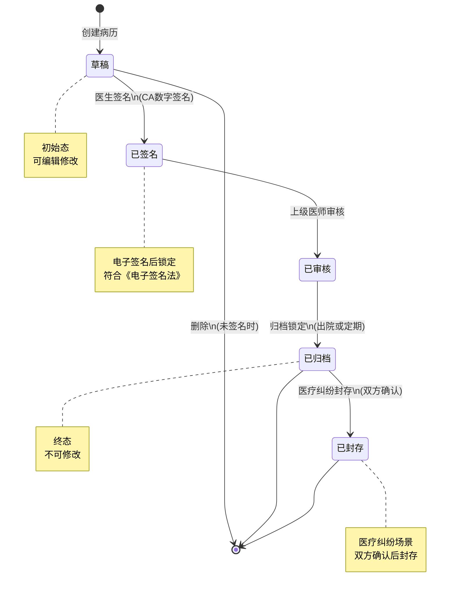

# M03-电子病历 - 状态机设计文档

> **文档编号**: YUDAO-HIS-SM-M03
> **版本**: V1.0
> **创建日期**: 2026-06-17
> **状态**: 设计中
> **关联文档**: YUDAO-HIS-SM-001 (全局状态机设计文档)

---

## 1. 概述

本文档定义电子病历模块(M03)核心业务对象的状态机设计，包括病历状态机。

### 1.1 状态机清单

| 序号 | 状态机编号 | 状态机名称 | 适用对象 | 优先级 | 业务规则 |
|------|------------|----------|----------|--------|----------|
| 1 | SM-008 | 病历状态机 | his_medical_record | P0 | BR-EMR-001~003 |

---

## 2. 病历状态机 (SM-008)

### 2.1 基本信息

| 属性 | 内容 |
|------|------|
| 状态机编号 | SM-008 |
| 状态机名称 | 病历状态机 |
| 适用对象 | his_medical_record（病历文书表） |
| 状态字段 | record_status |
| 业务规则 | BR-EMR-001~003: 病历管理规则 |
| 优先级 | P0（MVP必需） |

### 2.2 状态列表

| 状态编码 | 状态名称 | 状态描述 | 状态类型 | 允许操作 |
|----------|----------|----------|----------|----------|
| 1 | 草稿 | 病历正在编辑中 | 初始态 | 编辑、提交、删除 |
| 2 | 已签名 | 医生已签名 | 中间态 | 提交审核 |
| 3 | 已审核 | 上级医师已审核 | 中间态 | 归档 |
| 4 | 已归档 | 病历已归档锁定 | 终态 | 封存 |
| 5 | 已封存 | 医疗纠纷场景封存 | 终态 | 无 |

### 2.3 状态流转表

| 当前状态 | 触发事件 | 目标状态 | 前置条件 | 执行操作 | 关联规则 |
|----------|----------|----------|----------|----------|----------|
| - | 创建病历 | 草稿(1) | 就诊记录存在 | 创建病历记录 | BR-EMR-001 |
| 草稿(1) | 医生签名 | 已签名(2) | 内容填写完整 | 记录电子签名、锁定修改 | BR-EMR-002 |
| 草稿(1) | 删除 | - | 未签名 | 删除病历记录 | - |
| 已签名(2) | 提交审核 | 已审核(3) | 上级医师审核 | 记录审核人、时间 | - |
| 已审核(3) | 归档 | 已归档(4) | 出院或定期归档 | 锁定病历、不可修改 | BR-EMR-001 |
| 已归档(4) | 医疗纠纷封存 | 已封存(5) | 双方确认签字 | 生成副本、记录封存日志 | BR-EMR-003 |

### 2.4 状态流转图



### 2.5 状态约束规则

1. **归档锁定**: 病历归档后不可修改（BR-EMR-001）
2. **电子签名**: 电子签名必须符合《电子签名法》（BR-EMR-002）
3. **病历封存**: 医疗纠纷时病历封存需双方确认（BR-EMR-003）
4. **完成时限**: 入院记录24小时内完成、首次病程8小时内完成（BR-IP-008）

### 2.6 Java枚举定义

```java
/**
 * 病历状态枚举
 */
public enum MedicalRecordStatusEnum implements StatusEnum {

    DRAFT(1, "草稿", "病历正在编辑中"),
    SIGNED(2, "已签名", "医生已签名"),
    AUDITED(3, "已审核", "上级医师已审核"),
    ARCHIVED(4, "已归档", "病历已归档锁定"),
    SEALED(5, "已封存", "医疗纠纷场景封存");

    private final Integer code;
    private final String name;
    private final String description;

    MedicalRecordStatusEnum(Integer code, String name, String description) {
        this.code = code;
        this.name = name;
        this.description = description;
    }

    @Override
    public Integer getCode() {
        return code;
    }

    @Override
    public String getName() {
        return name;
    }

    @Override
    public String getDescription() {
        return description;
    }

    /**
     * 判断是否可编辑
     */
    public boolean canEdit() {
        return this == DRAFT;
    }

    /**
     * 判断是否为终态
     */
    public boolean isFinal() {
        return this == ARCHIVED || this == SEALED;
    }
}
```

---

## 附录: 变更历史

| 版本 | 日期 | 变更内容 | 变更人 |
|------|------|----------|--------|
| V1.0 | 2026-06-17 | 从全局状态机设计文档拆分 | YUDAO-AI-HIS架构组 |

---

> **最后更新**: 2026-06-17
