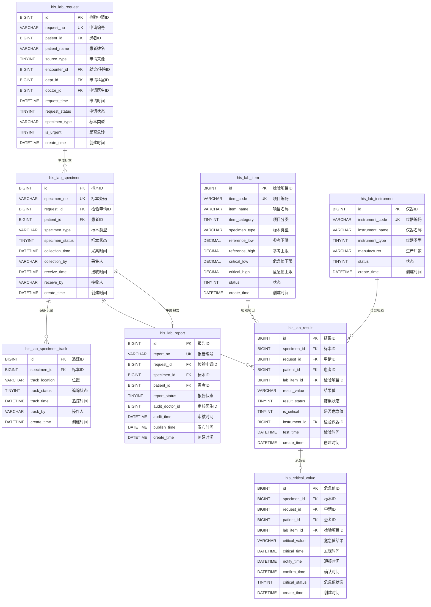
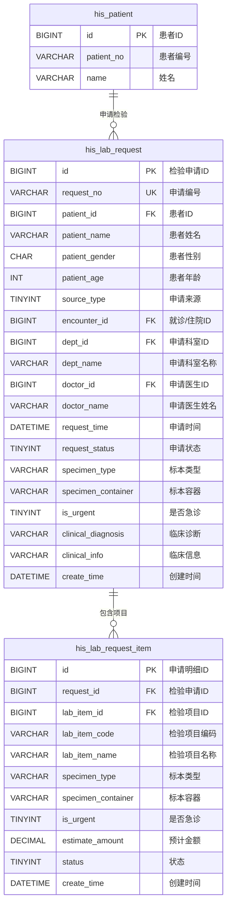
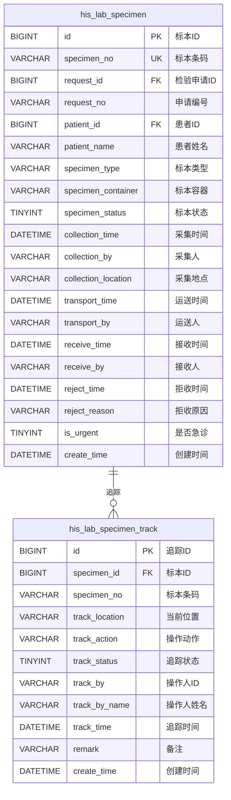

# M04-检验管理 - 数据库设计文档

> **文档编号**: YUDAO-HIS-DB-M04
> **版本**: V1.0
> **创建日期**: 2026-06-22
> **状态**: 设计中
> **参考文档**: YUDAO-HIS-DB-001, YUDAO-HIS-PRD-M04

---

## 1. 模块概述

### 1.1 模块范围

本模块包含检验管理子系统(LIS)相关的数据库表设计，包括：
- 检验申请管理
- 标本管理（采集、运送、接收）
- 检验项目管理
- 检验结果管理
- 检验报告管理
- 危急值管理
- 检验仪器管理

### 1.2 模块表清单

| 表名 | 中文名 | FHIR映射 | 年增量估算 |
|------|--------|----------|------------|
| his_lab_request | 检验申请表 | ServiceRequest | 约200万条 |
| his_lab_specimen | 标本记录表 | Specimen | 约300万条 |
| his_lab_specimen_track | 标本追踪表 | - | 约900万条 |
| his_lab_item | 检验项目表 | ObservationDefinition | 约1万条 |
| his_lab_result | 检验结果表 | Observation | 约1000万条 |
| his_lab_report | 检验报告表 | DiagnosticReport | 约200万条 |
| his_critical_value | 危急值记录表 | - | 约5万条 |
| his_lab_instrument | 检验仪器表 | Device | 约1000条 |

---

## 2. ER图设计

### 2.1 检验管理核心ER图



### 2.2 检验申请域ER图



### 2.3 标本管理域ER图



---

## 3. DDL脚本设计

### 3.1 检验申请表 (his_lab_request)

```sql
-- =============================================
-- 检验申请表
-- 对应FHIR资源: ServiceRequest
-- 年增量估算: 约200万条
-- =============================================
CREATE TABLE `his_lab_request` (
    `id` BIGINT NOT NULL AUTO_INCREMENT COMMENT '检验申请ID',
    `request_no` VARCHAR(30) NOT NULL COMMENT '检验申请编号',
    `patient_id` BIGINT NOT NULL COMMENT '患者ID',
    `patient_name` VARCHAR(50) NOT NULL COMMENT '患者姓名',
    `patient_gender` CHAR(1) NOT NULL COMMENT '患者性别: 1男/2女',
    `patient_age` INT NOT NULL COMMENT '患者年龄',
    `source_type` TINYINT NOT NULL COMMENT '申请来源: 1门诊/2住院',
    `encounter_id` BIGINT NOT NULL COMMENT '就诊/住院ID',
    `dept_id` BIGINT NOT NULL COMMENT '申请科室ID',
    `dept_name` VARCHAR(100) NOT NULL COMMENT '申请科室名称',
    `doctor_id` BIGINT NOT NULL COMMENT '申请医生ID',
    `doctor_name` VARCHAR(50) NOT NULL COMMENT '申请医生姓名',
    `request_time` DATETIME NOT NULL COMMENT '申请时间',
    `request_status` TINYINT NOT NULL DEFAULT 1 COMMENT '状态: 1待缴费/2待采集/3已采集/4运送中/5已接收/6检验中/7已完成/8已撤回',
    `specimen_type` VARCHAR(50) COMMENT '标本类型: 血液/尿液/粪便等',
    `specimen_container` VARCHAR(50) COMMENT '标本容器: 试管/尿杯等',
    `is_urgent` TINYINT NOT NULL DEFAULT 0 COMMENT '是否急诊: 0普通/1急诊',
    `clinical_diagnosis` VARCHAR(200) COMMENT '临床诊断',
    `clinical_info` VARCHAR(500) COMMENT '临床信息',
    `pay_status` TINYINT DEFAULT 0 COMMENT '缴费状态: 0未缴费/1已缴费',
    `pay_time` DATETIME COMMENT '缴费时间',
    `total_amount` DECIMAL(10,2) DEFAULT 0.00 COMMENT '总金额',
    `withdraw_time` DATETIME COMMENT '撤回时间',
    `withdraw_by` VARCHAR(50) COMMENT '撤回人',
    `withdraw_reason` VARCHAR(200) COMMENT '撤回原因',
    `complete_time` DATETIME COMMENT '完成时间',
    `remark` VARCHAR(500) COMMENT '备注',
    `creator` VARCHAR(64) DEFAULT '' COMMENT '创建者',
    `create_time` DATETIME NOT NULL DEFAULT CURRENT_TIMESTAMP COMMENT '创建时间',
    `updater` VARCHAR(64) DEFAULT '' COMMENT '更新者',
    `update_time` DATETIME NOT NULL DEFAULT CURRENT_TIMESTAMP ON UPDATE CURRENT_TIMESTAMP COMMENT '更新时间',
    `deleted` BIT(1) NOT NULL DEFAULT b'0' COMMENT '是否删除',
    `tenant_id` BIGINT NOT NULL DEFAULT 0 COMMENT '租户编号',
    PRIMARY KEY (`id`),
    UNIQUE KEY `uk_request_no` (`request_no`),
    KEY `idx_lab_request_patient` (`patient_id`),
    KEY `idx_lab_request_encounter` (`encounter_id`),
    KEY `idx_lab_request_dept` (`dept_id`),
    KEY `idx_lab_request_doctor` (`doctor_id`),
    KEY `idx_lab_request_status` (`request_status`),
    KEY `idx_lab_request_time` (`request_time`),
    KEY `idx_lab_request_source` (`source_type`),
    KEY `idx_lab_request_urgent` (`is_urgent`)
) ENGINE=InnoDB DEFAULT CHARSET=utf8mb4 COLLATE=utf8mb4_unicode_ci COMMENT='检验申请表';
```

### 3.2 检验申请明细表 (his_lab_request_item)

```sql
-- =============================================
-- 检验申请明细表
-- =============================================
CREATE TABLE `his_lab_request_item` (
    `id` BIGINT NOT NULL AUTO_INCREMENT COMMENT '申请明细ID',
    `request_id` BIGINT NOT NULL COMMENT '检验申请ID',
    `request_no` VARCHAR(30) NOT NULL COMMENT '检验申请编号',
    `lab_item_id` BIGINT NOT NULL COMMENT '检验项目ID',
    `lab_item_code` VARCHAR(50) NOT NULL COMMENT '检验项目编码',
    `lab_item_name` VARCHAR(100) NOT NULL COMMENT '检验项目名称',
    `specimen_type` VARCHAR(50) NOT NULL COMMENT '标本类型',
    `specimen_container` VARCHAR(50) COMMENT '标本容器',
    `is_urgent` TINYINT NOT NULL DEFAULT 0 COMMENT '是否急诊: 0普通/1急诊',
    `estimate_amount` DECIMAL(10,2) DEFAULT 0.00 COMMENT '预计金额',
    `status` TINYINT NOT NULL DEFAULT 1 COMMENT '状态: 1待检/2检验中/3已完成',
    `specimen_id` BIGINT COMMENT '关联标本ID',
    `result_id` BIGINT COMMENT '关联结果ID',
    `report_id` BIGINT COMMENT '关联报告ID',
    `remark` VARCHAR(200) COMMENT '备注',
    `creator` VARCHAR(64) DEFAULT '' COMMENT '创建者',
    `create_time` DATETIME NOT NULL DEFAULT CURRENT_TIMESTAMP COMMENT '创建时间',
    `updater` VARCHAR(64) DEFAULT '' COMMENT '更新者',
    `update_time` DATETIME NOT NULL DEFAULT CURRENT_TIMESTAMP ON UPDATE CURRENT_TIMESTAMP COMMENT '更新时间',
    `deleted` BIT(1) NOT NULL DEFAULT b'0' COMMENT '是否删除',
    `tenant_id` BIGINT NOT NULL DEFAULT 0 COMMENT '租户编号',
    PRIMARY KEY (`id`),
    KEY `idx_lab_req_item_request` (`request_id`),
    KEY `idx_lab_req_item_lab_item` (`lab_item_id`),
    KEY `idx_lab_req_item_specimen` (`specimen_id`),
    CONSTRAINT `fk_lab_req_item_request` FOREIGN KEY (`request_id`) REFERENCES `his_lab_request` (`id`)
) ENGINE=InnoDB DEFAULT CHARSET=utf8mb4 COLLATE=utf8mb4_unicode_ci COMMENT='检验申请明细表';
```

### 3.3 标本记录表 (his_lab_specimen)

```sql
-- =============================================
-- 标本记录表
-- 对应FHIR资源: Specimen
-- 年增量估算: 约300万条
-- 标本条码全程追踪，符合HIMSS EMRAM Stage 5+标准
-- =============================================
CREATE TABLE `his_lab_specimen` (
    `id` BIGINT NOT NULL AUTO_INCREMENT COMMENT '标本ID',
    `specimen_no` VARCHAR(30) NOT NULL COMMENT '标本条码编号',
    `request_id` BIGINT NOT NULL COMMENT '检验申请ID',
    `request_no` VARCHAR(30) NOT NULL COMMENT '检验申请编号',
    `patient_id` BIGINT NOT NULL COMMENT '患者ID',
    `patient_name` VARCHAR(50) NOT NULL COMMENT '患者姓名',
    `patient_gender` CHAR(1) COMMENT '患者性别',
    `patient_age` INT COMMENT '患者年龄',
    `specimen_type` VARCHAR(50) NOT NULL COMMENT '标本类型: 血液/尿液/粪便/痰液/脑脊液/胸腹水等',
    `specimen_container` VARCHAR(50) COMMENT '标本容器: 紫盖试管/红盖试管/尿杯等',
    `specimen_status` TINYINT NOT NULL DEFAULT 1 COMMENT '状态: 1已采集/2运送中/3已接收/4已拒收/5已销毁',
    `collection_time` DATETIME NOT NULL COMMENT '采集时间',
    `collection_by` VARCHAR(50) NOT NULL COMMENT '采集人',
    `collection_by_id` BIGINT COMMENT '采集人ID',
    `collection_location` VARCHAR(100) COMMENT '采集地点',
    `collection_method` VARCHAR(50) COMMENT '采集方式: 静脉穿刺/指尖采血/中段尿等',
    `transport_time` DATETIME COMMENT '运送时间',
    `transport_by` VARCHAR(50) COMMENT '运送人',
    `transport_by_id` BIGINT COMMENT '运送人ID',
    `receive_time` DATETIME COMMENT '接收时间',
    `receive_by` VARCHAR(50) COMMENT '接收人',
    `receive_by_id` BIGINT COMMENT '接收人ID',
    `receive_location` VARCHAR(100) COMMENT '接收科室',
    `reject_time` DATETIME COMMENT '拒收时间',
    `reject_by` VARCHAR(50) COMMENT '拒收人',
    `reject_reason_type` VARCHAR(50) COMMENT '拒收原因类型: 标本溶血/标本量不足/容器错误/标识不清等',
    `reject_reason` VARCHAR(200) COMMENT '拒收原因详细说明',
    `destroy_time` DATETIME COMMENT '销毁时间',
    `destroy_by` VARCHAR(50) COMMENT '销毁人',
    `destroy_method` VARCHAR(50) COMMENT '销毁方式',
    `is_urgent` TINYINT NOT NULL DEFAULT 0 COMMENT '是否急诊: 0普通/1急诊',
    `specimen_quality` TINYINT COMMENT '标本质量: 1合格/2不合格',
    `volume` DECIMAL(10,2) COMMENT '标本量(ml)',
    `remark` VARCHAR(500) COMMENT '备注',
    `creator` VARCHAR(64) DEFAULT '' COMMENT '创建者',
    `create_time` DATETIME NOT NULL DEFAULT CURRENT_TIMESTAMP COMMENT '创建时间',
    `updater` VARCHAR(64) DEFAULT '' COMMENT '更新者',
    `update_time` DATETIME NOT NULL DEFAULT CURRENT_TIMESTAMP ON UPDATE CURRENT_TIMESTAMP COMMENT '更新时间',
    `deleted` BIT(1) NOT NULL DEFAULT b'0' COMMENT '是否删除',
    `tenant_id` BIGINT NOT NULL DEFAULT 0 COMMENT '租户编号',
    PRIMARY KEY (`id`),
    UNIQUE KEY `uk_specimen_no` (`specimen_no`),
    KEY `idx_lab_specimen_request` (`request_id`),
    KEY `idx_lab_specimen_patient` (`patient_id`),
    KEY `idx_lab_specimen_status` (`specimen_status`),
    KEY `idx_lab_specimen_collection_time` (`collection_time`),
    KEY `idx_lab_specimen_urgent` (`is_urgent`),
    KEY `idx_lab_specimen_receive_time` (`receive_time`),
    CONSTRAINT `fk_lab_specimen_request` FOREIGN KEY (`request_id`) REFERENCES `his_lab_request` (`id`)
) ENGINE=InnoDB DEFAULT CHARSET=utf8mb4 COLLATE=utf8mb4_unicode_ci COMMENT='标本记录表';
```

### 3.4 标本追踪表 (his_lab_specimen_track)

```sql
-- =============================================
-- 标本追踪表
-- 年增量估算: 约900万条（每标本平均3次追踪记录）
-- 标本条码全程追踪，符合HIMSS EMRAM Stage 5+标准
-- =============================================
CREATE TABLE `his_lab_specimen_track` (
    `id` BIGINT NOT NULL AUTO_INCREMENT COMMENT '追踪ID',
    `specimen_id` BIGINT NOT NULL COMMENT '标本ID',
    `specimen_no` VARCHAR(30) NOT NULL COMMENT '标本条码',
    `track_location` VARCHAR(100) NOT NULL COMMENT '当前位置: 采集点/运送中/检验科/检验仪器等',
    `track_action` VARCHAR(50) NOT NULL COMMENT '操作动作: 采集/运送/接收/拒收/检验/销毁等',
    `track_status` TINYINT NOT NULL COMMENT '追踪状态: 1已采集/2运送中/3已接收/4已拒收/5已销毁',
    `track_by_id` BIGINT COMMENT '操作人ID',
    `track_by_name` VARCHAR(50) COMMENT '操作人姓名',
    `track_time` DATETIME NOT NULL COMMENT '追踪时间',
    `track_device` VARCHAR(100) COMMENT '追踪设备: PDA/扫码枪/工作站等',
    `latitude` DECIMAL(10,6) COMMENT '纬度(GPS定位)',
    `longitude` DECIMAL(10,6) COMMENT '经度(GPS定位)',
    `remark` VARCHAR(200) COMMENT '备注',
    `creator` VARCHAR(64) DEFAULT '' COMMENT '创建者',
    `create_time` DATETIME NOT NULL DEFAULT CURRENT_TIMESTAMP COMMENT '创建时间',
    `updater` VARCHAR(64) DEFAULT '' COMMENT '更新者',
    `update_time` DATETIME NOT NULL DEFAULT CURRENT_TIMESTAMP ON UPDATE CURRENT_TIMESTAMP COMMENT '更新时间',
    `deleted` BIT(1) NOT NULL DEFAULT b'0' COMMENT '是否删除',
    `tenant_id` BIGINT NOT NULL DEFAULT 0 COMMENT '租户编号',
    PRIMARY KEY (`id`),
    KEY `idx_specimen_track_specimen` (`specimen_id`),
    KEY `idx_specimen_track_specimen_no` (`specimen_no`),
    KEY `idx_specimen_track_status` (`track_status`),
    KEY `idx_specimen_track_time` (`track_time`),
    KEY `idx_specimen_track_action` (`track_action`),
    KEY `idx_specimen_track_year` (YEAR(`create_time`)),
    CONSTRAINT `fk_specimen_track_specimen` FOREIGN KEY (`specimen_id`) REFERENCES `his_lab_specimen` (`id`)
) ENGINE=InnoDB DEFAULT CHARSET=utf8mb4 COLLATE=utf8mb4_unicode_ci COMMENT='标本追踪表';
```

### 3.5 检验项目表 (his_lab_item)

```sql
-- =============================================
-- 检验项目表
-- 对应FHIR资源: ObservationDefinition
-- 年增量估算: 约1万条（基础数据，增量稳定）
-- =============================================
CREATE TABLE `his_lab_item` (
    `id` BIGINT NOT NULL AUTO_INCREMENT COMMENT '检验项目ID',
    `item_code` VARCHAR(50) NOT NULL COMMENT '检验项目编码',
    `item_name` VARCHAR(100) NOT NULL COMMENT '检验项目名称',
    `item_short_name` VARCHAR(50) COMMENT '项目简称',
    `pinyin_code` VARCHAR(50) COMMENT '拼音码',
    `item_category` TINYINT NOT NULL COMMENT '项目分类: 1生化/2免疫/3血液/4微生物/5尿液/6粪便/7其他',
    `item_type` TINYINT NOT NULL DEFAULT 1 COMMENT '项目类型: 1单项/2组合项目',
    `parent_item_id` BIGINT COMMENT '父项目ID(组合项目)',
    `specimen_type` VARCHAR(50) COMMENT '标本类型: 血液/尿液/粪便等',
    `specimen_container` VARCHAR(50) COMMENT '标本容器',
    `unit` VARCHAR(20) COMMENT '结果单位',
    `result_type` TINYINT DEFAULT 1 COMMENT '结果类型: 1数值型/2文本型/3定性型',
    `reference_low` DECIMAL(20,4) COMMENT '参考范围下限',
    `reference_high` DECIMAL(20,4) COMMENT '参考范围上限',
    `reference_text` VARCHAR(100) COMMENT '参考范围文本(定性)',
    `critical_low` DECIMAL(20,4) COMMENT '危急值下限',
    `critical_high` DECIMAL(20,4) COMMENT '危急值上限',
    `is_critical` TINYINT DEFAULT 0 COMMENT '是否有危急值: 0否/1是',
    `price` DECIMAL(10,2) DEFAULT 0.00 COMMENT '价格',
    `turnaround_time` INT COMMENT '报告时限(分钟)',
    `test_method` VARCHAR(100) COMMENT '检验方法',
    `instrument_id` BIGINT COMMENT '默认检验仪器ID',
    `lab_dept_id` BIGINT COMMENT '检验科室ID',
    `sort` INT DEFAULT 0 COMMENT '排序',
    `status` TINYINT NOT NULL DEFAULT 1 COMMENT '状态: 0停用/1正常',
    `remark` VARCHAR(500) COMMENT '备注',
    `creator` VARCHAR(64) DEFAULT '' COMMENT '创建者',
    `create_time` DATETIME NOT NULL DEFAULT CURRENT_TIMESTAMP COMMENT '创建时间',
    `updater` VARCHAR(64) DEFAULT '' COMMENT '更新者',
    `update_time` DATETIME NOT NULL DEFAULT CURRENT_TIMESTAMP ON UPDATE CURRENT_TIMESTAMP COMMENT '更新时间',
    `deleted` BIT(1) NOT NULL DEFAULT b'0' COMMENT '是否删除',
    `tenant_id` BIGINT NOT NULL DEFAULT 0 COMMENT '租户编号',
    PRIMARY KEY (`id`),
    UNIQUE KEY `uk_item_code` (`item_code`),
    KEY `idx_lab_item_name` (`item_name`),
    KEY `idx_lab_item_pinyin` (`pinyin_code`),
    KEY `idx_lab_item_category` (`item_category`),
    KEY `idx_lab_item_critical` (`is_critical`),
    KEY `idx_lab_item_status` (`status`),
    KEY `idx_lab_item_parent` (`parent_item_id`)
) ENGINE=InnoDB DEFAULT CHARSET=utf8mb4 COLLATE=utf8mb4_unicode_ci COMMENT='检验项目表';
```

### 3.6 检验结果表 (his_lab_result)

```sql
-- =============================================
-- 检验结果表
-- 对应FHIR资源: Observation
-- 年增量估算: 约1000万条
-- 分表策略: 按年分表
-- =============================================
CREATE TABLE `his_lab_result` (
    `id` BIGINT NOT NULL AUTO_INCREMENT COMMENT '结果ID',
    `result_no` VARCHAR(30) COMMENT '结果编号',
    `specimen_id` BIGINT NOT NULL COMMENT '标本ID',
    `specimen_no` VARCHAR(30) COMMENT '标本条码',
    `request_id` BIGINT NOT NULL COMMENT '申请ID',
    `request_no` VARCHAR(30) COMMENT '申请编号',
    `patient_id` BIGINT NOT NULL COMMENT '患者ID',
    `patient_name` VARCHAR(50) COMMENT '患者姓名',
    `lab_item_id` BIGINT NOT NULL COMMENT '检验项目ID',
    `lab_item_code` VARCHAR(50) NOT NULL COMMENT '检验项目编码',
    `lab_item_name` VARCHAR(100) NOT NULL COMMENT '检验项目名称',
    `result_value` VARCHAR(100) COMMENT '检验结果值',
    `result_value_num` DECIMAL(20,6) COMMENT '数值型结果',
    `result_unit` VARCHAR(20) COMMENT '结果单位',
    `result_flag` TINYINT COMMENT '结果标识: 1正常/2偏高/3偏低/4阳性/5阴性',
    `reference_low` DECIMAL(20,4) COMMENT '参考范围下限',
    `reference_high` DECIMAL(20,4) COMMENT '参考范围上限',
    `reference_range` VARCHAR(100) COMMENT '参考范围文本',
    `result_status` TINYINT NOT NULL DEFAULT 1 COMMENT '结果状态: 1待审/2已审核/3已修改/4已作废',
    `is_abnormal` TINYINT DEFAULT 0 COMMENT '是否异常: 0正常/1异常',
    `is_critical` TINYINT DEFAULT 0 COMMENT '是否危急值: 0否/1是',
    `critical_notified` TINYINT DEFAULT 0 COMMENT '危急值是否已通报: 0否/1是',
    `instrument_id` BIGINT COMMENT '检验仪器ID',
    `instrument_name` VARCHAR(100) COMMENT '检验仪器名称',
    `test_method` VARCHAR(100) COMMENT '检验方法',
    `test_time` DATETIME NOT NULL COMMENT '检验时间',
    `test_by_id` BIGINT NOT NULL COMMENT '检验技师ID',
    `test_by_name` VARCHAR(50) NOT NULL COMMENT '检验技师姓名',
    `audit_time` DATETIME COMMENT '审核时间',
    `audit_by_id` BIGINT COMMENT '审核人ID',
    `audit_by_name` VARCHAR(50) COMMENT '审核人姓名',
    `modify_time` DATETIME COMMENT '修改时间',
    `modify_by_id` BIGINT COMMENT '修改人ID',
    `modify_by_name` VARCHAR(50) COMMENT '修改人姓名',
    `modify_reason` VARCHAR(200) COMMENT '修改原因',
    `original_value` VARCHAR(100) COMMENT '原始结果值(修改前)',
    `report_id` BIGINT COMMENT '关联报告ID',
    `remark` VARCHAR(500) COMMENT '备注',
    `creator` VARCHAR(64) DEFAULT '' COMMENT '创建者',
    `create_time` DATETIME NOT NULL DEFAULT CURRENT_TIMESTAMP COMMENT '创建时间',
    `updater` VARCHAR(64) DEFAULT '' COMMENT '更新者',
    `update_time` DATETIME NOT NULL DEFAULT CURRENT_TIMESTAMP ON UPDATE CURRENT_TIMESTAMP COMMENT '更新时间',
    `deleted` BIT(1) NOT NULL DEFAULT b'0' COMMENT '是否删除',
    `tenant_id` BIGINT NOT NULL DEFAULT 0 COMMENT '租户编号',
    PRIMARY KEY (`id`),
    UNIQUE KEY `uk_result_no` (`result_no`),
    KEY `idx_lab_result_specimen` (`specimen_id`),
    KEY `idx_lab_result_request` (`request_id`),
    KEY `idx_lab_result_patient` (`patient_id`),
    KEY `idx_lab_result_item` (`lab_item_id`),
    KEY `idx_lab_result_status` (`result_status`),
    KEY `idx_lab_result_critical` (`is_critical`),
    KEY `idx_lab_result_abnormal` (`is_abnormal`),
    KEY `idx_lab_result_test_time` (`test_time`),
    KEY `idx_lab_result_instrument` (`instrument_id`),
    KEY `idx_lab_result_year` (YEAR(`create_time`)),
    CONSTRAINT `fk_lab_result_specimen` FOREIGN KEY (`specimen_id`) REFERENCES `his_lab_specimen` (`id`),
    CONSTRAINT `fk_lab_result_request` FOREIGN KEY (`request_id`) REFERENCES `his_lab_request` (`id`)
) ENGINE=InnoDB DEFAULT CHARSET=utf8mb4 COLLATE=utf8mb4_unicode_ci COMMENT='检验结果表';
```

### 3.7 检验报告表 (his_lab_report)

```sql
-- =============================================
-- 检验报告表
-- 对应FHIR资源: DiagnosticReport
-- 年增量估算: 约200万条
-- =============================================
CREATE TABLE `his_lab_report` (
    `id` BIGINT NOT NULL AUTO_INCREMENT COMMENT '报告ID',
    `report_no` VARCHAR(30) NOT NULL COMMENT '报告编号',
    `request_id` BIGINT NOT NULL COMMENT '检验申请ID',
    `request_no` VARCHAR(30) COMMENT '检验申请编号',
    `specimen_id` BIGINT NOT NULL COMMENT '标本ID',
    `specimen_no` VARCHAR(30) COMMENT '标本条码',
    `patient_id` BIGINT NOT NULL COMMENT '患者ID',
    `patient_name` VARCHAR(50) NOT NULL COMMENT '患者姓名',
    `patient_gender` CHAR(1) COMMENT '患者性别',
    `patient_age` INT COMMENT '患者年龄',
    `source_type` TINYINT COMMENT '申请来源: 1门诊/2住院',
    `dept_id` BIGINT COMMENT '申请科室ID',
    `dept_name` VARCHAR(100) COMMENT '申请科室名称',
    `doctor_name` VARCHAR(50) COMMENT '申请医生姓名',
    `clinical_diagnosis` VARCHAR(200) COMMENT '临床诊断',
    `report_type` TINYINT NOT NULL DEFAULT 1 COMMENT '报告类型: 1常规报告/2急诊报告/3危急值报告',
    `report_status` TINYINT NOT NULL DEFAULT 1 COMMENT '报告状态: 1草稿/2待审核/3已审核/4已发布/5已打印/6已作废',
    `sample_time` DATETIME COMMENT '采集时间',
    `receive_time` DATETIME COMMENT '接收时间',
    `test_time` DATETIME COMMENT '检验时间',
    `audit_doctor_id` BIGINT COMMENT '审核医生ID',
    `audit_doctor_name` VARCHAR(50) COMMENT '审核医生姓名',
    `audit_time` DATETIME COMMENT '审核时间',
    `publish_time` DATETIME COMMENT '发布时间',
    `publish_by_id` BIGINT COMMENT '发布人ID',
    `publish_by_name` VARCHAR(50) COMMENT '发布人姓名',
    `print_time` DATETIME COMMENT '打印时间',
    `print_by` VARCHAR(50) COMMENT '打印人',
    `print_count` INT DEFAULT 0 COMMENT '打印次数',
    `has_critical` TINYINT DEFAULT 0 COMMENT '是否包含危急值: 0否/1是',
    `critical_count` INT DEFAULT 0 COMMENT '危急值数量',
    `is_interpreted` TINYINT DEFAULT 0 COMMENT '是否已解读: 0否/1是',
    `interpretation` TEXT COMMENT '报告解读',
    `report_url` VARCHAR(200) COMMENT '报告文件URL',
    `pdf_url` VARCHAR(200) COMMENT 'PDF文件URL',
    `version` INT DEFAULT 1 COMMENT '版本号',
    `parent_report_id` BIGINT COMMENT '原报告ID(修改时关联)',
    `remark` VARCHAR(500) COMMENT '备注',
    `creator` VARCHAR(64) DEFAULT '' COMMENT '创建者',
    `create_time` DATETIME NOT NULL DEFAULT CURRENT_TIMESTAMP COMMENT '创建时间',
    `updater` VARCHAR(64) DEFAULT '' COMMENT '更新者',
    `update_time` DATETIME NOT NULL DEFAULT CURRENT_TIMESTAMP ON UPDATE CURRENT_TIMESTAMP COMMENT '更新时间',
    `deleted` BIT(1) NOT NULL DEFAULT b'0' COMMENT '是否删除',
    `tenant_id` BIGINT NOT NULL DEFAULT 0 COMMENT '租户编号',
    PRIMARY KEY (`id`),
    UNIQUE KEY `uk_report_no` (`report_no`),
    KEY `idx_lab_report_request` (`request_id`),
    KEY `idx_lab_report_specimen` (`specimen_id`),
    KEY `idx_lab_report_patient` (`patient_id`),
    KEY `idx_lab_report_status` (`report_status`),
    KEY `idx_lab_report_type` (`report_type`),
    KEY `idx_lab_report_publish_time` (`publish_time`),
    KEY `idx_lab_report_critical` (`has_critical`),
    KEY `idx_lab_report_parent` (`parent_report_id`),
    CONSTRAINT `fk_lab_report_request` FOREIGN KEY (`request_id`) REFERENCES `his_lab_request` (`id`),
    CONSTRAINT `fk_lab_report_specimen` FOREIGN KEY (`specimen_id`) REFERENCES `his_lab_specimen` (`id`)
) ENGINE=InnoDB DEFAULT CHARSET=utf8mb4 COLLATE=utf8mb4_unicode_ci COMMENT='检验报告表';
```

### 3.8 危急值记录表 (his_critical_value)

```sql
-- =============================================
-- 危急值记录表
-- 危急值15分钟通报机制，符合HIMSS EMRAM Stage 5+标准
-- 年增量估算: 约5万条
-- =============================================
CREATE TABLE `his_critical_value` (
    `id` BIGINT NOT NULL AUTO_INCREMENT COMMENT '危急值记录ID',
    `critical_no` VARCHAR(30) COMMENT '危急值编号',
    `specimen_id` BIGINT NOT NULL COMMENT '标本ID',
    `specimen_no` VARCHAR(30) COMMENT '标本条码',
    `request_id` BIGINT NOT NULL COMMENT '申请ID',
    `request_no` VARCHAR(30) COMMENT '申请编号',
    `patient_id` BIGINT NOT NULL COMMENT '患者ID',
    `patient_name` VARCHAR(50) NOT NULL COMMENT '患者姓名',
    `lab_item_id` BIGINT NOT NULL COMMENT '检验项目ID',
    `lab_item_name` VARCHAR(100) NOT NULL COMMENT '检验项目名称',
    `lab_item_code` VARCHAR(50) COMMENT '检验项目编码',
    `critical_value` VARCHAR(100) NOT NULL COMMENT '危急值结果',
    `critical_unit` VARCHAR(20) COMMENT '结果单位',
    `critical_threshold` VARCHAR(100) NOT NULL COMMENT '危急值阈值',
    `critical_type` VARCHAR(10) COMMENT '危急值类型: 高限/低限',
    `result_id` BIGINT COMMENT '关联结果ID',
    `report_id` BIGINT COMMENT '关联报告ID',
    `critical_time` DATETIME NOT NULL COMMENT '危急值发现时间',
    `critical_by_id` BIGINT NOT NULL COMMENT '发现人ID',
    `critical_by_name` VARCHAR(50) NOT NULL COMMENT '发现人姓名',
    `review_time` DATETIME COMMENT '复核时间',
    `review_by_id` BIGINT COMMENT '复核人ID',
    `review_by_name` VARCHAR(50) COMMENT '复核人姓名',
    `critical_status` TINYINT NOT NULL DEFAULT 1 COMMENT '状态: 1待通报/2已通报/3已确认/4已处理/5已关闭',
    `notify_time` DATETIME COMMENT '通报时间',
    `notify_by_id` BIGINT COMMENT '通报人ID',
    `notify_by_name` VARCHAR(50) COMMENT '通报人姓名',
    `notify_to_dept_id` BIGINT COMMENT '通报科室ID',
    `notify_to_dept_name` VARCHAR(100) COMMENT '通报科室名称',
    `notify_to_doctor_id` BIGINT COMMENT '通报医生ID',
    `notify_to_doctor_name` VARCHAR(50) COMMENT '通报医生姓名',
    `notify_to_phone` VARCHAR(20) COMMENT '通报电话',
    `notify_method` VARCHAR(50) COMMENT '通报方式: 电话/系统通知/短信',
    `notify_result` VARCHAR(200) COMMENT '通报结果',
    `confirm_time` DATETIME COMMENT '确认时间',
    `confirm_by_id` BIGINT COMMENT '确认人ID',
    `confirm_by_name` VARCHAR(50) COMMENT '确认人姓名',
    `confirm_action` VARCHAR(200) COMMENT '处理措施',
    `time_elapsed` INT COMMENT '通报耗时(分钟)',
    `confirm_elapsed` INT COMMENT '确认耗时(分钟)',
    `close_time` DATETIME COMMENT '关闭时间',
    `close_by` VARCHAR(50) COMMENT '关闭人',
    `remark` VARCHAR(500) COMMENT '备注',
    `creator` VARCHAR(64) DEFAULT '' COMMENT '创建者',
    `create_time` DATETIME NOT NULL DEFAULT CURRENT_TIMESTAMP COMMENT '创建时间',
    `updater` VARCHAR(64) DEFAULT '' COMMENT '更新者',
    `update_time` DATETIME NOT NULL DEFAULT CURRENT_TIMESTAMP ON UPDATE CURRENT_TIMESTAMP COMMENT '更新时间',
    `deleted` BIT(1) NOT NULL DEFAULT b'0' COMMENT '是否删除',
    `tenant_id` BIGINT NOT NULL DEFAULT 0 COMMENT '租户编号',
    PRIMARY KEY (`id`),
    UNIQUE KEY `uk_critical_no` (`critical_no`),
    KEY `idx_critical_specimen` (`specimen_id`),
    KEY `idx_critical_request` (`request_id`),
    KEY `idx_critical_patient` (`patient_id`),
    KEY `idx_critical_status` (`critical_status`),
    KEY `idx_critical_time` (`critical_time`),
    KEY `idx_critical_item` (`lab_item_id`),
    KEY `idx_critical_notify_time` (`notify_time`),
    KEY `idx_critical_confirm_time` (`confirm_time`),
    CONSTRAINT `fk_critical_specimen` FOREIGN KEY (`specimen_id`) REFERENCES `his_lab_specimen` (`id`),
    CONSTRAINT `fk_critical_request` FOREIGN KEY (`request_id`) REFERENCES `his_lab_request` (`id`)
) ENGINE=InnoDB DEFAULT CHARSET=utf8mb4 COLLATE=utf8mb4_unicode_ci COMMENT='危急值记录表';
```

### 3.9 检验仪器表 (his_lab_instrument)

```sql
-- =============================================
-- 检验仪器表
-- 对应FHIR资源: Device
-- 年增量估算: 约1000条（基础数据，增量稳定）
-- =============================================
CREATE TABLE `his_lab_instrument` (
    `id` BIGINT NOT NULL AUTO_INCREMENT COMMENT '仪器ID',
    `instrument_code` VARCHAR(50) NOT NULL COMMENT '仪器编码',
    `instrument_name` VARCHAR(100) NOT NULL COMMENT '仪器名称',
    `instrument_model` VARCHAR(100) COMMENT '仪器型号',
    `instrument_type` TINYINT NOT NULL COMMENT '仪器类型: 1生化分析仪/2血细胞分析仪/3凝血分析仪/4尿液分析仪/5免疫分析仪/6微生物分析仪/7其他',
    `manufacturer` VARCHAR(100) COMMENT '生产厂家',
    `serial_no` VARCHAR(50) COMMENT '序列号',
    `purchase_date` DATE COMMENT '购置日期',
    `install_date` DATE COMMENT '安装日期',
    `warranty_expire` DATE COMMENT '保修到期日',
    `lab_dept_id` BIGINT COMMENT '所属检验科室ID',
    `lab_dept_name` VARCHAR(100) COMMENT '所属检验科室名称',
    `location` VARCHAR(100) COMMENT '存放位置',
    `ip_address` VARCHAR(50) COMMENT 'IP地址',
    `port` INT COMMENT '端口号',
    `communication_protocol` VARCHAR(50) COMMENT '通讯协议: HL7/ASTM/RS232/TCP/IP等',
    `interface_type` VARCHAR(50) COMMENT '接口类型',
    `max_throughput` INT COMMENT '最大吞吐量(标本/小时)',
    `status` TINYINT NOT NULL DEFAULT 1 COMMENT '状态: 1在线/2离线/3维修中/4已报废',
    `last_maintenance` DATE COMMENT '上次维护日期',
    `next_maintenance` DATE COMMENT '下次维护日期',
    `calibration_date` DATE COMMENT '校准日期',
    `qc_status` TINYINT COMMENT '质控状态: 1通过/2不通过',
    `qc_date` DATE COMMENT '质控日期',
    `remark` VARCHAR(500) COMMENT '备注',
    `creator` VARCHAR(64) DEFAULT '' COMMENT '创建者',
    `create_time` DATETIME NOT NULL DEFAULT CURRENT_TIMESTAMP COMMENT '创建时间',
    `updater` VARCHAR(64) DEFAULT '' COMMENT '更新者',
    `update_time` DATETIME NOT NULL DEFAULT CURRENT_TIMESTAMP ON UPDATE CURRENT_TIMESTAMP COMMENT '更新时间',
    `deleted` BIT(1) NOT NULL DEFAULT b'0' COMMENT '是否删除',
    `tenant_id` BIGINT NOT NULL DEFAULT 0 COMMENT '租户编号',
    PRIMARY KEY (`id`),
    UNIQUE KEY `uk_instrument_code` (`instrument_code`),
    KEY `idx_lab_instrument_type` (`instrument_type`),
    KEY `idx_lab_instrument_status` (`status`),
    KEY `idx_lab_instrument_dept` (`lab_dept_id`)
) ENGINE=InnoDB DEFAULT CHARSET=utf8mb4 COLLATE=utf8mb4_unicode_ci COMMENT='检验仪器表';
```

### 3.10 检验参考范围表 (his_lab_reference)

```sql
-- =============================================
-- 检验参考范围表
-- 支持按年龄、性别分组设置参考范围
-- =============================================
CREATE TABLE `his_lab_reference` (
    `id` BIGINT NOT NULL AUTO_INCREMENT COMMENT '参考范围ID',
    `lab_item_id` BIGINT NOT NULL COMMENT '检验项目ID',
    `lab_item_code` VARCHAR(50) COMMENT '检验项目编码',
    `lab_item_name` VARCHAR(100) COMMENT '检验项目名称',
    `gender` CHAR(1) COMMENT '性别: 1男/2女/NULL通用',
    `age_min` INT COMMENT '年龄下限',
    `age_max` INT COMMENT '年龄上限',
    `age_unit` VARCHAR(10) COMMENT '年龄单位: 岁/月/天',
    `pregnant` TINYINT DEFAULT 0 COMMENT '是否孕妇: 0否/1是',
    `reference_low` DECIMAL(20,4) COMMENT '参考范围下限',
    `reference_high` DECIMAL(20,4) COMMENT '参考范围上限',
    `reference_text` VARCHAR(100) COMMENT '参考范围文本(定性)',
    `critical_low` DECIMAL(20,4) COMMENT '危急值下限',
    `critical_high` DECIMAL(20,4) COMMENT '危急值上限',
    `is_default` TINYINT DEFAULT 0 COMMENT '是否默认: 0否/1是',
    `status` TINYINT NOT NULL DEFAULT 1 COMMENT '状态: 0停用/1正常',
    `remark` VARCHAR(200) COMMENT '备注',
    `creator` VARCHAR(64) DEFAULT '' COMMENT '创建者',
    `create_time` DATETIME NOT NULL DEFAULT CURRENT_TIMESTAMP COMMENT '创建时间',
    `updater` VARCHAR(64) DEFAULT '' COMMENT '更新者',
    `update_time` DATETIME NOT NULL DEFAULT CURRENT_TIMESTAMP ON UPDATE CURRENT_TIMESTAMP COMMENT '更新时间',
    `deleted` BIT(1) NOT NULL DEFAULT b'0' COMMENT '是否删除',
    `tenant_id` BIGINT NOT NULL DEFAULT 0 COMMENT '租户编号',
    PRIMARY KEY (`id`),
    KEY `idx_lab_reference_item` (`lab_item_id`),
    KEY `idx_lab_reference_gender` (`gender`),
    KEY `idx_lab_reference_age` (`age_min`, `age_max`),
    CONSTRAINT `fk_lab_reference_item` FOREIGN KEY (`lab_item_id`) REFERENCES `his_lab_item` (`id`)
) ENGINE=InnoDB DEFAULT CHARSET=utf8mb4 COLLATE=utf8mb4_unicode_ci COMMENT='检验参考范围表';
```

### 3.11 检验套餐表 (his_lab_package)

```sql
-- =============================================
-- 检验套餐表
-- =============================================
CREATE TABLE `his_lab_package` (
    `id` BIGINT NOT NULL AUTO_INCREMENT COMMENT '套餐ID',
    `package_code` VARCHAR(50) NOT NULL COMMENT '套餐编码',
    `package_name` VARCHAR(100) NOT NULL COMMENT '套餐名称',
    `package_category` TINYINT COMMENT '套餐分类: 1体检套餐/2临床套餐/3其他',
    `description` VARCHAR(500) COMMENT '套餐描述',
    `total_price` DECIMAL(10,2) DEFAULT 0.00 COMMENT '套餐总价',
    `item_count` INT DEFAULT 0 COMMENT '包含项目数',
    `sort` INT DEFAULT 0 COMMENT '排序',
    `status` TINYINT NOT NULL DEFAULT 1 COMMENT '状态: 0停用/1正常',
    `remark` VARCHAR(500) COMMENT '备注',
    `creator` VARCHAR(64) DEFAULT '' COMMENT '创建者',
    `create_time` DATETIME NOT NULL DEFAULT CURRENT_TIMESTAMP COMMENT '创建时间',
    `updater` VARCHAR(64) DEFAULT '' COMMENT '更新者',
    `update_time` DATETIME NOT NULL DEFAULT CURRENT_TIMESTAMP ON UPDATE CURRENT_TIMESTAMP COMMENT '更新时间',
    `deleted` BIT(1) NOT NULL DEFAULT b'0' COMMENT '是否删除',
    `tenant_id` BIGINT NOT NULL DEFAULT 0 COMMENT '租户编号',
    PRIMARY KEY (`id`),
    UNIQUE KEY `uk_package_code` (`package_code`),
    KEY `idx_lab_package_category` (`package_category`),
    KEY `idx_lab_package_status` (`status`)
) ENGINE=InnoDB DEFAULT CHARSET=utf8mb4 COLLATE=utf8mb4_unicode_ci COMMENT='检验套餐表';
```

### 3.12 检验套餐项目关联表 (his_lab_package_item)

```sql
-- =============================================
-- 检验套餐项目关联表
-- =============================================
CREATE TABLE `his_lab_package_item` (
    `id` BIGINT NOT NULL AUTO_INCREMENT COMMENT 'ID',
    `package_id` BIGINT NOT NULL COMMENT '套餐ID',
    `lab_item_id` BIGINT NOT NULL COMMENT '检验项目ID',
    `lab_item_code` VARCHAR(50) COMMENT '检验项目编码',
    `lab_item_name` VARCHAR(100) COMMENT '检验项目名称',
    `sort` INT DEFAULT 0 COMMENT '排序',
    `creator` VARCHAR(64) DEFAULT '' COMMENT '创建者',
    `create_time` DATETIME NOT NULL DEFAULT CURRENT_TIMESTAMP COMMENT '创建时间',
    `updater` VARCHAR(64) DEFAULT '' COMMENT '更新者',
    `update_time` DATETIME NOT NULL DEFAULT CURRENT_TIMESTAMP ON UPDATE CURRENT_TIMESTAMP COMMENT '更新时间',
    `deleted` BIT(1) NOT NULL DEFAULT b'0' COMMENT '是否删除',
    `tenant_id` BIGINT NOT NULL DEFAULT 0 COMMENT '租户编号',
    PRIMARY KEY (`id`),
    UNIQUE KEY `uk_package_item` (`package_id`, `lab_item_id`),
    KEY `idx_lab_pkg_item_package` (`package_id`),
    KEY `idx_lab_pkg_item_item` (`lab_item_id`),
    CONSTRAINT `fk_lab_pkg_item_package` FOREIGN KEY (`package_id`) REFERENCES `his_lab_package` (`id`),
    CONSTRAINT `fk_lab_pkg_item_item` FOREIGN KEY (`lab_item_id`) REFERENCES `his_lab_item` (`id`)
) ENGINE=InnoDB DEFAULT CHARSET=utf8mb4 COLLATE=utf8mb4_unicode_ci COMMENT='检验套餐项目关联表';
```

---

## 4. 索引设计

### 4.1 索引汇总表

| 表名 | 索引名 | 索引类型 | 索引字段 | 说明 |
|------|--------|----------|----------|------|
| his_lab_request | uk_request_no | 唯一 | request_no | 申请编号唯一 |
| his_lab_request | idx_lab_request_patient | 普通 | patient_id | 按患者查询申请 |
| his_lab_request | idx_lab_request_status | 普通 | request_status | 按状态查询 |
| his_lab_request | idx_lab_request_time | 普通 | request_time | 按申请时间查询 |
| his_lab_request | idx_lab_request_urgent | 普通 | is_urgent | 查询急诊申请 |
| his_lab_specimen | uk_specimen_no | 唯一 | specimen_no | 标本条码唯一 |
| his_lab_specimen | idx_lab_specimen_request | 普通 | request_id | 按申请查询标本 |
| his_lab_specimen | idx_lab_specimen_status | 普通 | specimen_status | 按标本状态查询 |
| his_lab_specimen_track | idx_specimen_track_specimen | 普通 | specimen_id | 按标本查询追踪 |
| his_lab_specimen_track | idx_specimen_track_time | 普通 | track_time | 按追踪时间查询 |
| his_lab_item | uk_item_code | 唯一 | item_code | 检验项目编码唯一 |
| his_lab_item | idx_lab_item_category | 普通 | item_category | 按分类查询项目 |
| his_lab_item | idx_lab_item_critical | 普通 | is_critical | 查询有危急值的项目 |
| his_lab_result | uk_result_no | 唯一 | result_no | 结果编号唯一 |
| his_lab_result | idx_lab_result_specimen | 普通 | specimen_id | 按标本查询结果 |
| his_lab_result | idx_lab_result_critical | 普通 | is_critical | 查询危急值结果 |
| his_lab_result | idx_lab_result_test_time | 普通 | test_time | 按检验时间查询 |
| his_lab_report | uk_report_no | 唯一 | report_no | 报告编号唯一 |
| his_lab_report | idx_lab_report_patient | 普通 | patient_id | 按患者查询报告 |
| his_lab_report | idx_lab_report_status | 普通 | report_status | 按报告状态查询 |
| his_critical_value | uk_critical_no | 唯一 | critical_no | 危急值编号唯一 |
| his_critical_value | idx_critical_status | 普通 | critical_status | 按危急值状态查询 |
| his_critical_value | idx_critical_time | 普通 | critical_time | 按发现时间查询 |
| his_lab_instrument | uk_instrument_code | 唯一 | instrument_code | 仪器编码唯一 |
| his_lab_instrument | idx_lab_instrument_status | 普通 | status | 按仪器状态查询 |

---

## 5. 分表策略

### 5.1 分表规则

| 数据表 | 分表策略 | 分表字段 | 说明 |
|--------|----------|----------|------|
| his_lab_result | 按年分表 | create_time | 检验结果数据量大，约1000万条/年 |
| his_lab_specimen_track | 按年分表 | create_time | 标本追踪记录数据量大，约900万条/年 |

### 5.2 分表实现示例

```sql
-- =============================================
-- 检验结果分表示例(按年)
-- =============================================
-- 2026年检验结果表
CREATE TABLE `his_lab_result_2026` LIKE `his_lab_result`;

-- 2027年检验结果表
CREATE TABLE `his_lab_result_2027` LIKE `his_lab_result`;

-- =============================================
-- 标本追踪分表示例(按年)
-- =============================================
-- 2026年标本追踪表
CREATE TABLE `his_lab_specimen_track_2026` LIKE `his_lab_specimen_track`;

-- 2027年标本追踪表
CREATE TABLE `his_lab_specimen_track_2027` LIKE `his_lab_specimen_track`;
```

---

## 6. FHIR资源映射

| HIS实体 | FHIR资源 | 映射说明 |
|---------|----------|----------|
| his_lab_request | ServiceRequest | 检验申请，对应检验医嘱 |
| his_lab_specimen | Specimen | 标本信息，包含采集、处理信息 |
| his_lab_item | ObservationDefinition | 检验项目定义，包含参考范围 |
| his_lab_result | Observation | 检验结果，单个检验项目的结果 |
| his_lab_report | DiagnosticReport | 检验报告，综合多个检验结果 |
| his_lab_instrument | Device | 检验仪器设备信息 |

---

## 7. 数据字典初始化

### 7.1 检验相关字典类型

```sql
-- =============================================
-- 数据字典类型初始化
-- =============================================
INSERT INTO `sys_dict_type` (`dict_type`, `dict_name`, `status`, `creator`) VALUES
('lab_request_status', '检验申请状态', 1, 'admin'),
('lab_specimen_status', '标本状态', 1, 'admin'),
('lab_specimen_type', '标本类型', 1, 'admin'),
('lab_item_category', '检验项目分类', 1, 'admin'),
('lab_result_status', '检验结果状态', 1, 'admin'),
('lab_result_flag', '结果标识', 1, 'admin'),
('lab_report_status', '检验报告状态', 1, 'admin'),
('lab_report_type', '检验报告类型', 1, 'admin'),
('critical_value_status', '危急值状态', 1, 'admin'),
('lab_instrument_status', '检验仪器状态', 1, 'admin'),
('lab_instrument_type', '检验仪器类型', 1, 'admin'),
('critical_notify_method', '危急值通报方式', 1, 'admin'),
('reject_reason_type', '标本拒收原因', 1, 'admin');

-- =============================================
-- 数据字典数据初始化
-- =============================================

-- 检验申请状态
INSERT INTO `sys_dict_data` (`dict_type`, `dict_label`, `dict_value`, `sort`, `status`, `creator`) VALUES
('lab_request_status', '待缴费', '1', 1, 1, 'admin'),
('lab_request_status', '待采集', '2', 2, 1, 'admin'),
('lab_request_status', '已采集', '3', 3, 1, 'admin'),
('lab_request_status', '运送中', '4', 4, 1, 'admin'),
('lab_request_status', '已接收', '5', 5, 1, 'admin'),
('lab_request_status', '检验中', '6', 6, 1, 'admin'),
('lab_request_status', '已完成', '7', 7, 1, 'admin'),
('lab_request_status', '已撤回', '8', 8, 1, 'admin');

-- 标本状态
INSERT INTO `sys_dict_data` (`dict_type`, `dict_label`, `dict_value`, `sort`, `status`, `creator`) VALUES
('lab_specimen_status', '已采集', '1', 1, 1, 'admin'),
('lab_specimen_status', '运送中', '2', 2, 1, 'admin'),
('lab_specimen_status', '已接收', '3', 3, 1, 'admin'),
('lab_specimen_status', '已拒收', '4', 4, 1, 'admin'),
('lab_specimen_status', '已销毁', '5', 5, 1, 'admin');

-- 标本类型
INSERT INTO `sys_dict_data` (`dict_type`, `dict_label`, `dict_value`, `sort`, `status`, `creator`) VALUES
('lab_specimen_type', '血液', 'blood', 1, 1, 'admin'),
('lab_specimen_type', '尿液', 'urine', 2, 1, 'admin'),
('lab_specimen_type', '粪便', 'stool', 3, 1, 'admin'),
('lab_specimen_type', '痰液', 'sputum', 4, 1, 'admin'),
('lab_specimen_type', '脑脊液', 'csf', 5, 1, 'admin'),
('lab_specimen_type', '胸腹水', 'pleural', 6, 1, 'admin'),
('lab_specimen_type', '精液', 'semen', 7, 1, 'admin'),
('lab_specimen_type', '前列腺液', 'prostatic', 8, 1, 'admin'),
('lab_specimen_type', '阴道分泌物', 'vaginal', 9, 1, 'admin'),
('lab_specimen_type', '伤口分泌物', 'wound', 10, 1, 'admin');

-- 检验项目分类
INSERT INTO `sys_dict_data` (`dict_type`, `dict_label`, `dict_value`, `sort`, `status`, `creator`) VALUES
('lab_item_category', '生化检验', '1', 1, 1, 'admin'),
('lab_item_category', '免疫检验', '2', 2, 1, 'admin'),
('lab_item_category', '血液检验', '3', 3, 1, 'admin'),
('lab_item_category', '微生物检验', '4', 4, 1, 'admin'),
('lab_item_category', '尿液检验', '5', 5, 1, 'admin'),
('lab_item_category', '粪便检验', '6', 6, 1, 'admin'),
('lab_item_category', '其他检验', '7', 7, 1, 'admin');

-- 结果标识
INSERT INTO `sys_dict_data` (`dict_type`, `dict_label`, `dict_value`, `sort`, `status`, `creator`) VALUES
('lab_result_flag', '正常', '1', 1, 1, 'admin'),
('lab_result_flag', '偏高', '2', 2, 1, 'admin'),
('lab_result_flag', '偏低', '3', 3, 1, 'admin'),
('lab_result_flag', '阳性', '4', 4, 1, 'admin'),
('lab_result_flag', '阴性', '5', 5, 1, 'admin');

-- 检验报告状态
INSERT INTO `sys_dict_data` (`dict_type`, `dict_label`, `dict_value`, `sort`, `status`, `creator`) VALUES
('lab_report_status', '草稿', '1', 1, 1, 'admin'),
('lab_report_status', '待审核', '2', 2, 1, 'admin'),
('lab_report_status', '已审核', '3', 3, 1, 'admin'),
('lab_report_status', '已发布', '4', 4, 1, 'admin'),
('lab_report_status', '已打印', '5', 5, 1, 'admin'),
('lab_report_status', '已作废', '6', 6, 1, 'admin');

-- 危急值状态
INSERT INTO `sys_dict_data` (`dict_type`, `dict_label`, `dict_value`, `sort`, `status`, `creator`) VALUES
('critical_value_status', '待通报', '1', 1, 1, 'admin'),
('critical_value_status', '已通报', '2', 2, 1, 'admin'),
('critical_value_status', '已确认', '3', 3, 1, 'admin'),
('critical_value_status', '已处理', '4', 4, 1, 'admin'),
('critical_value_status', '已关闭', '5', 5, 1, 'admin');

-- 检验仪器类型
INSERT INTO `sys_dict_data` (`dict_type`, `dict_label`, `dict_value`, `sort`, `status`, `creator`) VALUES
('lab_instrument_type', '生化分析仪', '1', 1, 1, 'admin'),
('lab_instrument_type', '血细胞分析仪', '2', 2, 1, 'admin'),
('lab_instrument_type', '凝血分析仪', '3', 3, 1, 'admin'),
('lab_instrument_type', '尿液分析仪', '4', 4, 1, 'admin'),
('lab_instrument_type', '免疫分析仪', '5', 5, 1, 'admin'),
('lab_instrument_type', '微生物分析仪', '6', 6, 1, 'admin'),
('lab_instrument_type', '其他仪器', '7', 7, 1, 'admin');

-- 检验仪器状态
INSERT INTO `sys_dict_data` (`dict_type`, `dict_label`, `dict_value`, `sort`, `status`, `creator`) VALUES
('lab_instrument_status', '在线', '1', 1, 1, 'admin'),
('lab_instrument_status', '离线', '2', 2, 1, 'admin'),
('lab_instrument_status', '维修中', '3', 3, 1, 'admin'),
('lab_instrument_status', '已报废', '4', 4, 1, 'admin');

-- 危急值通报方式
INSERT INTO `sys_dict_data` (`dict_type`, `dict_label`, `dict_value`, `sort`, `status`, `creator`) VALUES
('critical_notify_method', '电话通报', 'phone', 1, 1, 'admin'),
('critical_notify_method', '系统通知', 'system', 2, 1, 'admin'),
('critical_notify_method', '短信通知', 'sms', 3, 1, 'admin'),
('critical_notify_method', '企业微信', 'wechat', 4, 1, 'admin');

-- 标本拒收原因
INSERT INTO `sys_dict_data` (`dict_type`, `dict_label`, `dict_value`, `sort`, `status`, `creator`) VALUES
('reject_reason_type', '标本溶血', 'hemolysis', 1, 1, 'admin'),
('reject_reason_type', '标本量不足', 'insufficient', 2, 1, 'admin'),
('reject_reason_type', '容器错误', 'container', 3, 1, 'admin'),
('reject_reason_type', '标识不清', 'labeling', 4, 1, 'admin'),
('reject_reason_type', '标本凝固', 'clotting', 5, 1, 'admin'),
('reject_reason_type', '标本污染', 'contamination', 6, 1, 'admin'),
('reject_reason_type', '送检超时', 'timeout', 7, 1, 'admin'),
('reject_reason_type', '患者信息不符', 'mismatch', 8, 1, 'admin');
```

---

## 8. 表清单汇总

### 8.1 核心业务表

| 表名 | 中文名 | 年增量估算 | 存储引擎 | 分表策略 |
|------|--------|------------|----------|----------|
| his_lab_request | 检验申请表 | 约200万条 | InnoDB | 无 |
| his_lab_request_item | 检验申请明细表 | 约500万条 | InnoDB | 无 |
| his_lab_specimen | 标本记录表 | 约300万条 | InnoDB | 无 |
| his_lab_specimen_track | 标本追踪表 | 约900万条 | InnoDB | 按年分表 |
| his_lab_item | 检验项目表 | 约1万条 | InnoDB | 无 |
| his_lab_result | 检验结果表 | 约1000万条 | InnoDB | 按年分表 |
| his_lab_report | 检验报告表 | 约200万条 | InnoDB | 无 |
| his_critical_value | 危急值记录表 | 约5万条 | InnoDB | 无 |
| his_lab_instrument | 检验仪器表 | 约1000条 | InnoDB | 无 |

### 8.2 配置管理表

| 表名 | 中文名 | 年增量估算 | 说明 |
|------|--------|------------|------|
| his_lab_reference | 检验参考范围表 | 约2万条 | 按年龄性别分组 |
| his_lab_package | 检验套餐表 | 约500条 | 套餐配置 |
| his_lab_package_item | 检验套餐项目关联表 | 约5000条 | 套餐项目关联 |

---

## 9. 变更历史

| 版本 | 日期 | 变更内容 | 变更人 |
|------|------|----------|--------|
| V1.0 | 2026-06-22 | 初始版本，完成检验管理模块数据库设计 | Claude AI |

---

> **模块负责人**: ________________
> **最后更新**: 2026-06-22
