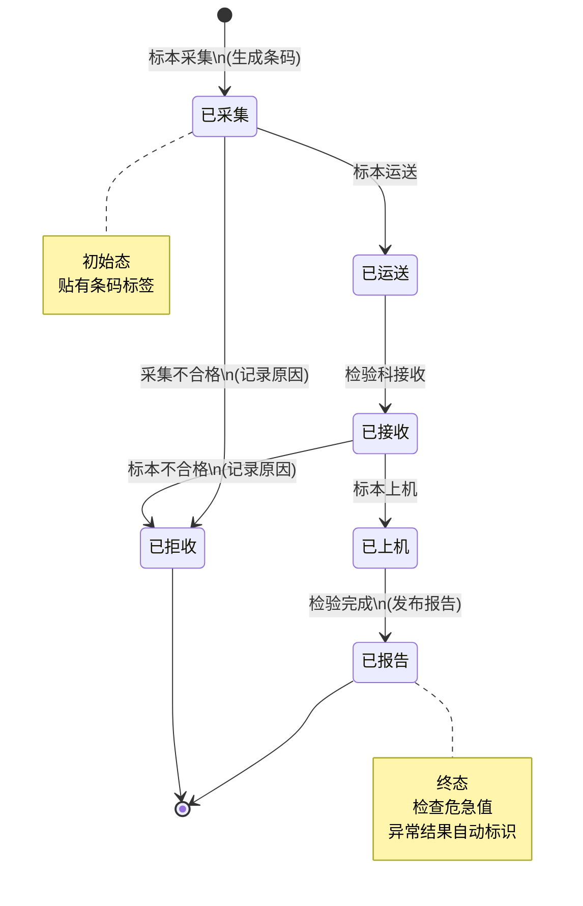
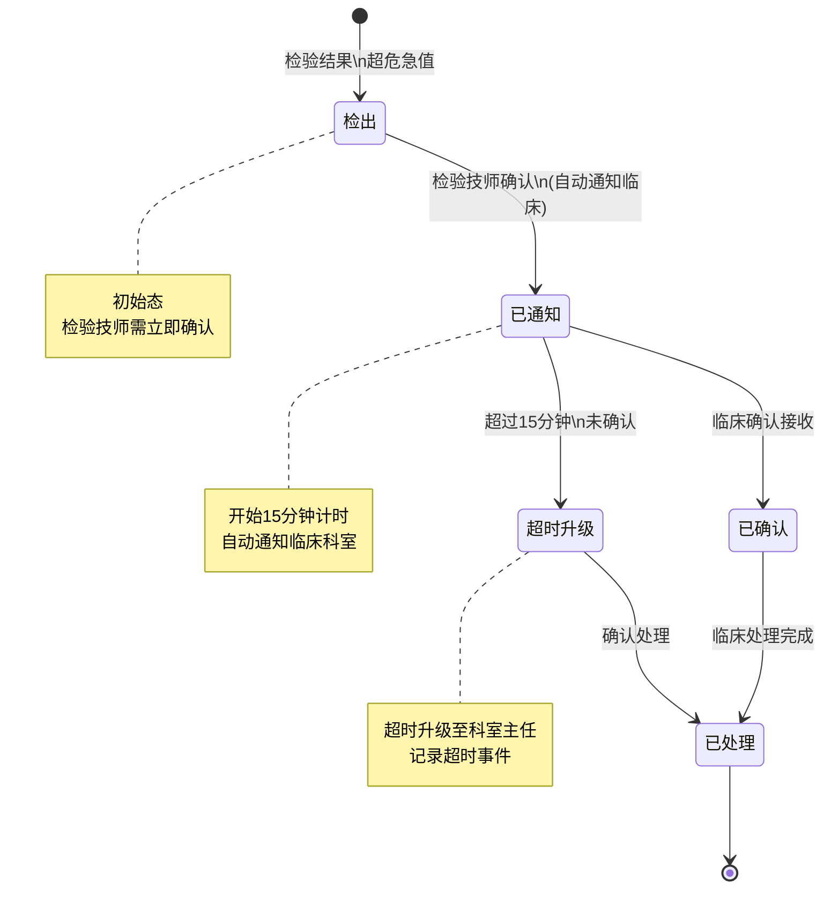

# M04-检验管理 - 状态机设计文档

> **文档编号**: YUDAO-HIS-SM-M04
> **版本**: V1.0
> **创建日期**: 2026-06-17
> **状态**: 设计中
> **关联文档**: YUDAO-HIS-SM-001 (全局状态机设计文档)

---

## 1. 概述

本文档定义检验管理模块(M04)核心业务对象的状态机设计，包括检验标本状态机和危急值处理状态机。

### 1.1 状态机清单

| 序号 | 状态机编号 | 状态机名称 | 适用对象 | 优先级 | 业务规则 |
|------|------------|----------|----------|--------|----------|
| 1 | SM-006 | 检验标本状态机 | his_specimen | P0 | BR-LIS-001 |
| 2 | SM-007 | 危急值处理状态机 | his_critical_value | P0 | BR-LIS-002 |

---

## 2. 检验标本状态机 (SM-006)

### 2.1 基本信息

| 属性 | 内容 |
|------|------|
| 状态机编号 | SM-006 |
| 状态机名称 | 检验标本状态机 |
| 适用对象 | his_specimen（检验标本表） |
| 状态字段 | specimen_status |
| 业务规则 | BR-LIS-001: 标本全程条码追踪 |
| 优先级 | P0（MVP必需） |

### 2.2 状态列表

| 状态编码 | 状态名称 | 状态描述 | 状态类型 | 允许操作 |
|----------|----------|----------|----------|----------|
| 1 | 已采集 | 标本已采集 | 初始态 | 运送、拒收 |
| 2 | 已运送 | 标本运送中 | 中间态 | 接收 |
| 3 | 已接收 | 检验科已接收 | 中间态 | 上机、拒收 |
| 4 | 已上机 | 标本正在检验 | 中间态 | 报告 |
| 5 | 已报告 | 检验报告已发布 | 终态 | 无 |
| 6 | 已拒收 | 标本不合格已拒收 | 终态 | 无 |

### 2.3 状态流转表

| 当前状态 | 触发事件 | 目标状态 | 前置条件 | 执行操作 | 关联规则 |
|----------|----------|----------|----------|----------|----------|
| - | 标本采集 | 已采集(1) | 采集信息完整 | 生成条码、记录采集人时间 | - |
| 已采集(1) | 标本运送 | 已运送(2) | 采集完成 | 记录运送人、时间 | BR-LIS-001 |
| 已采集(1) | 标本拒收 | 已拒收(6) | 采集不合格 | 记录拒收原因、通知重采 | BR-LIS-005 |
| 已运送(2) | 标本接收 | 已接收(3) | 标本完好 | 记录接收人、时间 | - |
| 已接收(3) | 标本上机 | 已上机(4) | 设备就绪 | 记录上机时间 | - |
| 已接收(3) | 标本拒收 | 已拒收(6) | 标本不合格 | 记录拒收原因、通知重采 | BR-LIS-005 |
| 已上机(4) | 检验完成 | 已报告(5) | 检验结果录入 | 发布报告、检查危急值 | BR-LIS-002~004 |

### 2.4 状态流转图



### 2.5 状态约束规则

1. **全程追踪**: 标本必须全程条码追踪（BR-LIS-001）
2. **拒收处理**: 不合格标本拒收并通知重新采集（BR-LIS-005）
3. **报告时限**: 常规检验报告时间<=2小时（BR-LIS-003）
4. **异常标识**: 检验结果异常自动标识（BR-LIS-004）
5. **危急值检查**: 检验完成后检查危急值并通报（BR-LIS-002）

### 2.6 Java枚举定义

```java
/**
 * 检验标本状态枚举
 */
public enum SpecimenStatusEnum implements StatusEnum {

    COLLECTED(1, "已采集", "标本已采集"),
    TRANSPORTING(2, "已运送", "标本运送中"),
    RECEIVED(3, "已接收", "检验科已接收"),
    TESTING(4, "已上机", "标本正在检验"),
    REPORTED(5, "已报告", "检验报告已发布"),
    REJECTED(6, "已拒收", "标本不合格已拒收");

    private final Integer code;
    private final String name;
    private final String description;

    SpecimenStatusEnum(Integer code, String name, String description) {
        this.code = code;
        this.name = name;
        this.description = description;
    }

    @Override
    public Integer getCode() {
        return code;
    }

    @Override
    public String getName() {
        return name;
    }

    @Override
    public String getDescription() {
        return description;
    }

    /**
     * 判断是否为终态
     */
    public boolean isFinal() {
        return this == REPORTED || this == REJECTED;
    }
}
```

---

## 3. 危急值处理状态机 (SM-007)

### 3.1 基本信息

| 属性 | 内容 |
|------|------|
| 状态机编号 | SM-007 |
| 状态机名称 | 危急值处理状态机 |
| 适用对象 | his_critical_value（危急值记录表） |
| 状态字段 | critical_status |
| 业务规则 | BR-LIS-002: 危急值15分钟内通报 |
| 优先级 | P0（MVP必需） |

### 3.2 状态列表

| 状态编码 | 状态名称 | 状态描述 | 状态类型 | 允许操作 |
|----------|----------|----------|----------|----------|
| 1 | 检出 | 检验结果检出危急值 | 初始态 | 确认、通知 |
| 2 | 已通知 | 已通知临床科室 | 中间态 | 确认接收 |
| 3 | 已确认 | 临床已确认接收 | 中间态 | 处理 |
| 4 | 已处理 | 临床已处理 | 终态 | 无 |
| 5 | 超时升级 | 超时未确认，已升级 | 中间态 | 确认处理 |

### 3.3 状态流转表

| 当前状态 | 触发事件 | 目标状态 | 前置条件 | 执行操作 | 关联规则 |
|----------|----------|----------|----------|----------|----------|
| - | 检出危急值 | 检出(1) | 检验结果超危急值 | 创建危急值记录 | BR-LIS-004 |
| 检出(1) | 检验技师确认 | 已通知(2) | 检验技师确认 | 自动通知临床、记录通知时间 | BR-LIS-002 |
| 已通知(2) | 临床确认接收 | 已确认(3) | 临床确认 | 记录确认人、时间 | - |
| 已通知(2) | 超时未确认 | 超时升级(5) | 超过15分钟未确认 | 升级通知科室主任 | BR-LIS-002 |
| 已确认(3) | 临床处理 | 已处理(4) | 处理完成 | 记录处理结果 | - |
| 超时升级(5) | 确认处理 | 已处理(4) | 处理完成 | 记录处理结果 | - |

### 3.4 状态流转图



### 3.5 状态约束规则

1. **15分钟通报**: 危急值必须15分钟内通知临床并确认接收（BR-LIS-002）
2. **超时升级**: 超时未确认自动升级通知科室主任
3. **完整记录**: 记录检出、通知、确认、处理全流程时间
4. **双重确认**: 检验技师确认+临床确认

### 3.6 Java枚举定义

```java
/**
 * 危急值处理状态枚举
 */
public enum CriticalValueStatusEnum implements StatusEnum {

    DETECTED(1, "检出", "检验结果检出危急值"),
    NOTIFIED(2, "已通知", "已通知临床科室"),
    CONFIRMED(3, "已确认", "临床已确认接收"),
    PROCESSED(4, "已处理", "临床已处理"),
    TIMEOUT_ESCALATED(5, "超时升级", "超时未确认，已升级");

    private final Integer code;
    private final String name;
    private final String description;

    CriticalValueStatusEnum(Integer code, String name, String description) {
        this.code = code;
        this.name = name;
        this.description = description;
    }

    @Override
    public Integer getCode() {
        return code;
    }

    @Override
    public String getName() {
        return name;
    }

    @Override
    public String getDescription() {
        return description;
    }

    /**
     * 判断是否需要升级
     */
    public boolean needEscalate() {
        return this == NOTIFIED;
    }

    /**
     * 判断是否为终态
     */
    public boolean isFinal() {
        return this == PROCESSED;
    }
}
```

---

## 附录: 变更历史

| 版本 | 日期 | 变更内容 | 变更人 |
|------|------|----------|--------|
| V1.0 | 2026-06-17 | 从全局状态机设计文档拆分 | YUDAO-AI-HIS架构组 |

---

> **最后更新**: 2026-06-17
