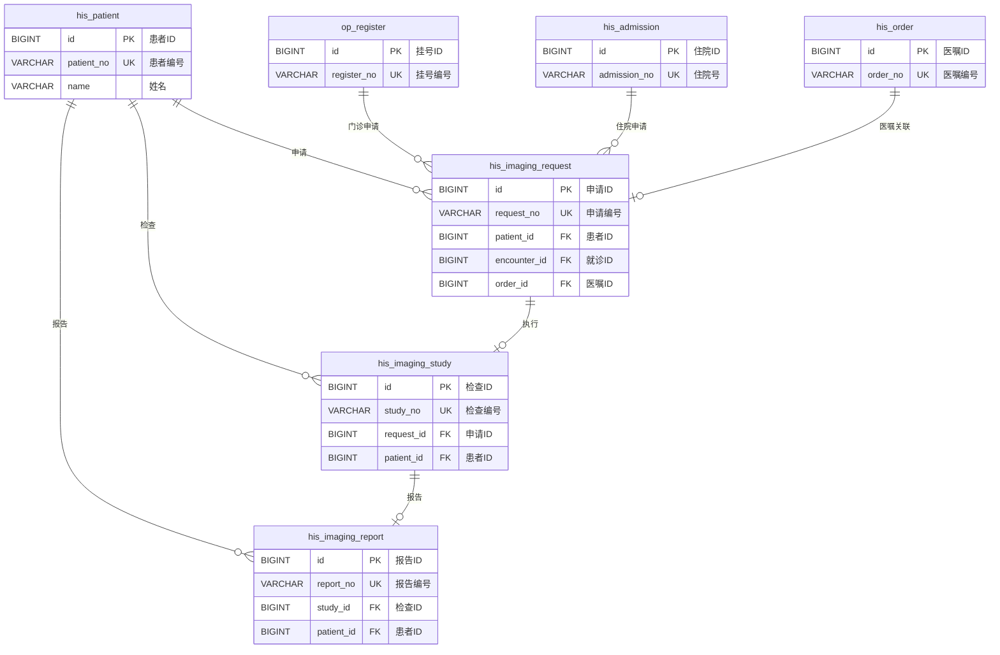

# M05-影像管理 - 数据库设计文档

> **文档编号**: YUDAO-HIS-DB-M05
> **版本**: V1.0
> **创建日期**: 2026-06-22
> **状态**: 设计中
> **参考文档**: YUDAO-HIS-DB-001, YUDAO-HIS-PRD-M05

---

## 1. 模块概述

### 1.1 模块范围

本模块包含影像管理子系统(RIS/PACS)相关的数据库表设计，包括：
- 影像申请管理
- 影像检查执行
- 影像存储管理
- 影像查看
- 影像报告管理

### 1.2 模块表清单

| 表名 | 中文名 | FHIR映射 | 年增量估算 |
|------|--------|----------|------------|
| his_imaging_request | 影像申请表 | ServiceRequest | 约50万条 |
| his_imaging_study | 影像检查记录表 | ImagingStudy | 约50万条 |
| his_imaging_series | 影像序列表 | ImagingStudy.series | 约200万条 |
| his_imaging_image | 影像图像表 | ImagingStudy.series.instance | 约5000万条 |
| his_imaging_report | 影像报告表 | DiagnosticReport | 约50万条 |
| his_imaging_storage | 影像存储位置表 | - | 约5000万条 |
| his_imaging_instrument | 影像设备表 | Device | 约100条 |

---

## 2. ER图设计

### 2.1 影像管理域 ER图

```mermaid
erDiagram
    his_imaging_request {
        BIGINT id PK "申请ID"
        VARCHAR request_no UK "申请编号"
        BIGINT patient_id FK "患者ID"
        VARCHAR patient_name "患者姓名"
        BIGINT encounter_id FK "就诊ID"
        VARCHAR exam_type_code "检查类型编码"
        VARCHAR exam_type_name "检查类型名称"
        VARCHAR exam_part "检查部位"
        VARCHAR clinical_diagnosis "临床诊断"
        TINYINT urgency_level "紧急程度"
        BIGINT request_dept_id FK "申请科室ID"
        VARCHAR request_dept_name "申请科室名称"
        BIGINT request_doctor_id FK "申请医生ID"
        VARCHAR request_doctor_name "申请医生姓名"
        DATETIME request_time "申请时间"
        DATETIME schedule_time "排期时间"
        BIGINT perform_dept_id FK "执行科室ID"
        VARCHAR perform_dept_name "执行科室名称"
        TINYINT request_status "申请状态"
        TINYINT payment_status "缴费状态"
        DATETIME create_time "创建时间"
    }
    
    his_imaging_study {
        BIGINT id PK "检查ID"
        VARCHAR study_no UK "检查编号"
        VARCHAR study_instance_uid UK "DICOM检查UID"
        VARCHAR accession_no "检查号(DICOM)"
        BIGINT request_id FK "申请ID"
        BIGINT patient_id FK "患者ID"
        VARCHAR patient_name "患者姓名"
        BIGINT encounter_id FK "就诊ID"
        VARCHAR modality "检查类型"
        VARCHAR modality_name "检查类型名称"
        VARCHAR body_part "检查部位"
        VARCHAR study_desc "检查描述"
        DATETIME study_time "检查时间"
        BIGINT instrument_id FK "设备ID"
        VARCHAR instrument_name "设备名称"
        VARCHAR room_no "检查室"
        BIGINT technician_id FK "技师ID"
        VARCHAR technician_name "技师姓名"
        INT series_count "序列数"
        INT image_count "图像数"
        BIGINT storage_size "存储大小"
        TINYINT storage_tier "存储层级"
        TINYINT study_status "检查状态"
        DATETIME create_time "创建时间"
    }
    
    his_imaging_series {
        BIGINT id PK "序列ID"
        VARCHAR series_instance_uid UK "DICOM序列UID"
        BIGINT study_id FK "检查ID"
        BIGINT patient_id FK "患者ID"
        VARCHAR series_no "序列号"
        VARCHAR modality "检查类型"
        VARCHAR series_desc "序列描述"
        VARCHAR body_part "检查部位"
        INT image_count "图像数"
        INT frame_count "帧数"
        VARCHAR window_width "窗宽"
        VARCHAR window_level "窗位"
        DECIMAL slice_thickness "层厚"
        DECIMAL slice_spacing "层间距"
        VARCHAR series_status "序列状态"
        DATETIME create_time "创建时间"
    }
    
    his_imaging_image {
        BIGINT id PK "图像ID"
        VARCHAR sop_instance_uid UK "DICOM图像UID"
        BIGINT series_id FK "序列ID"
        BIGINT study_id FK "检查ID"
        BIGINT patient_id FK "患者ID"
        VARCHAR image_no "图像号"
        INT frame_no "帧号"
        VARCHAR image_type "图像类型"
        INT rows "图像行数"
        INT columns "图像列数"
        DECIMAL pixel_spacing "像素间距"
        VARCHAR photometric_interp "光度解释"
        INT bits_allocated "分配位数"
        INT bits_stored "存储位数"
        INT high_bit "高位"
        BIGINT storage_id FK "存储ID"
        TINYINT image_status "图像状态"
        DATETIME create_time "创建时间"
    }
    
    his_imaging_report {
        BIGINT id PK "报告ID"
        VARCHAR report_no UK "报告编号"
        BIGINT request_id FK "申请ID"
        BIGINT study_id FK "检查ID"
        BIGINT patient_id FK "患者ID"
        VARCHAR patient_name "患者姓名"
        VARCHAR study_instance_uid "DICOM检查UID"
        VARCHAR exam_type_name "检查类型"
        VARCHAR exam_part "检查部位"
        TEXT imaging_findings "影像所见"
        TEXT diagnosis_opinion "诊断意见"
        TINYINT report_type "报告类型"
        BIGINT template_id FK "模板ID"
        BIGINT report_doctor_id FK "报告医生ID"
        VARCHAR report_doctor_name "报告医生姓名"
        DATETIME report_time "报告时间"
        BIGINT audit_doctor_id FK "审核医生ID"
        VARCHAR audit_doctor_name "审核医生姓名"
        DATETIME audit_time "审核时间"
        TINYINT report_status "报告状态"
        DATETIME create_time "创建时间"
    }
    
    his_imaging_storage {
        BIGINT id PK "存储ID"
        BIGINT study_id FK "检查ID"
        BIGINT series_id FK "序列ID"
        BIGINT image_id FK "图像ID"
        VARCHAR storage_path "存储路径"
        VARCHAR storage_url "访问URL"
        VARCHAR storage_type "存储类型"
        VARCHAR file_format "文件格式"
        BIGINT file_size "文件大小"
        VARCHAR checksum "校验值"
        TINYINT storage_tier "存储层级"
        DATETIME archive_time "归档时间"
        TINYINT storage_status "存储状态"
        DATETIME create_time "创建时间"
    }
    
    his_imaging_instrument {
        BIGINT id PK "设备ID"
        VARCHAR instrument_code UK "设备编码"
        VARCHAR instrument_name "设备名称"
        VARCHAR instrument_type "设备类型"
        VARCHAR modality "检查类型"
        VARCHAR manufacturer "生产厂家"
        VARCHAR model "型号"
        VARCHAR serial_no "序列号"
        VARCHAR aetitle "DICOM AE Title"
        VARCHAR ip_address "IP地址"
        INT port "端口"
        BIGINT dept_id FK "所属科室ID"
        VARCHAR dept_name "所属科室名称"
        VARCHAR room_no "检查室"
        TINYINT status "设备状态"
        DATETIME create_time "创建时间"
    }
    
    his_imaging_request ||--o| his_imaging_study : "执行"
    his_imaging_study ||--o{ his_imaging_series : "包含"
    his_imaging_series ||--o{ his_imaging_image : "包含"
    his_imaging_study ||--o| his_imaging_report : "报告"
    his_imaging_image ||--o| his_imaging_storage : "存储"
    his_imaging_instrument ||--o{ his_imaging_study : "检查"
```



### 2.2 影像申请与检查 ER图



---

## 3. DDL脚本设计

### 3.1 影像申请表 (his_imaging_request)

```sql
-- =============================================
-- 影像申请表
-- 对应FHIR资源: ServiceRequest
-- 年增量估算: 约50万条
-- =============================================
CREATE TABLE `his_imaging_request` (
    `id` BIGINT NOT NULL AUTO_INCREMENT COMMENT '申请ID',
    `request_no` VARCHAR(30) NOT NULL COMMENT '申请编号',
    `patient_id` BIGINT NOT NULL COMMENT '患者ID',
    `patient_name` VARCHAR(50) NOT NULL COMMENT '患者姓名',
    `gender` CHAR(1) COMMENT '性别: 1男/2女',
    `age` INT COMMENT '年龄',
    `phone` VARCHAR(20) COMMENT '手机号',
    `id_card_no` VARCHAR(18) COMMENT '身份证号',
    `encounter_id` BIGINT COMMENT '就诊ID(门诊挂号ID/住院ID)',
    `encounter_type` TINYINT COMMENT '就诊类型: 1门诊/2住院/3急诊',
    `register_id` BIGINT COMMENT '门诊挂号ID',
    `admission_id` BIGINT COMMENT '住院ID',
    `order_id` BIGINT COMMENT '医嘱ID(住院)',
    `order_no` VARCHAR(30) COMMENT '医嘱编号',
    `exam_type_code` VARCHAR(20) NOT NULL COMMENT '检查类型编码',
    `exam_type_name` VARCHAR(100) NOT NULL COMMENT '检查类型名称',
    `exam_class` VARCHAR(50) COMMENT '检查分类: CT/MR/US/DR/CR/RF/PT/NM等',
    `exam_part` VARCHAR(100) NOT NULL COMMENT '检查部位',
    `exam_part_code` VARCHAR(50) COMMENT '检查部位编码',
    `exam_method` VARCHAR(100) COMMENT '检查方法: 平扫/增强/造影等',
    `clinical_diagnosis` VARCHAR(500) COMMENT '临床诊断',
    `diagnosis_code` VARCHAR(50) COMMENT '诊断编码(ICD-10)',
    `exam_purpose` VARCHAR(500) COMMENT '检查目的',
    `clinical_history` TEXT COMMENT '病史摘要',
    `allergy_history` VARCHAR(500) COMMENT '过敏史',
    `contrast_medium` TINYINT DEFAULT 0 COMMENT '是否造影: 0否/1是',
    `contrast_type` VARCHAR(50) COMMENT '造影剂类型',
    `contrast_dose` DECIMAL(10,2) COMMENT '造影剂剂量',
    `is_enhanced` TINYINT DEFAULT 0 COMMENT '是否增强: 0否/1是',
    `urgency_level` TINYINT NOT NULL DEFAULT 1 COMMENT '紧急程度: 1普通/2急诊/3特急',
    `is_stat` TINYINT DEFAULT 0 COMMENT '是否加急: 0否/1是',
    `request_dept_id` BIGINT NOT NULL COMMENT '申请科室ID',
    `request_dept_name` VARCHAR(100) NOT NULL COMMENT '申请科室名称',
    `request_doctor_id` BIGINT NOT NULL COMMENT '申请医生ID',
    `request_doctor_name` VARCHAR(50) NOT NULL COMMENT '申请医生姓名',
    `request_time` DATETIME NOT NULL COMMENT '申请时间',
    `schedule_time` DATETIME COMMENT '排期时间',
    `schedule_no` VARCHAR(10) COMMENT '预约序号',
    `queue_no` VARCHAR(10) COMMENT '排队序号',
    `perform_dept_id` BIGINT COMMENT '执行科室ID',
    `perform_dept_name` VARCHAR(100) COMMENT '执行科室名称',
    `perform_room` VARCHAR(50) COMMENT '执行检查室',
    `instrument_id` BIGINT COMMENT '检查设备ID',
    `instrument_name` VARCHAR(100) COMMENT '检查设备名称',
    `request_status` TINYINT NOT NULL DEFAULT 1 COMMENT '申请状态: 1待缴费/2待排期/3已排期/4已到检/5检查中/6已完成/7已取消',
    `payment_status` TINYINT DEFAULT 0 COMMENT '缴费状态: 0未缴费/1已缴费',
    `payment_time` DATETIME COMMENT '缴费时间',
    `payment_amount` DECIMAL(12,2) COMMENT '缴费金额',
    `cancel_time` DATETIME COMMENT '取消时间',
    `cancel_reason` VARCHAR(500) COMMENT '取消原因',
    `cancel_by` VARCHAR(50) COMMENT '取消人',
    `remark` VARCHAR(500) COMMENT '备注',
    `creator` VARCHAR(64) DEFAULT '' COMMENT '创建者',
    `create_time` DATETIME NOT NULL DEFAULT CURRENT_TIMESTAMP COMMENT '创建时间',
    `updater` VARCHAR(64) DEFAULT '' COMMENT '更新者',
    `update_time` DATETIME NOT NULL DEFAULT CURRENT_TIMESTAMP ON UPDATE CURRENT_TIMESTAMP COMMENT '更新时间',
    `deleted` BIT(1) NOT NULL DEFAULT b'0' COMMENT '是否删除',
    `tenant_id` BIGINT NOT NULL DEFAULT 0 COMMENT '租户编号',
    PRIMARY KEY (`id`),
    UNIQUE KEY `uk_request_no` (`request_no`),
    KEY `idx_imaging_request_patient` (`patient_id`),
    KEY `idx_imaging_request_encounter` (`encounter_id`),
    KEY `idx_imaging_request_register` (`register_id`),
    KEY `idx_imaging_request_admission` (`admission_id`),
    KEY `idx_imaging_request_order` (`order_id`),
    KEY `idx_imaging_request_status` (`request_status`),
    KEY `idx_imaging_request_time` (`request_time`),
    KEY `idx_imaging_request_schedule` (`schedule_time`),
    KEY `idx_imaging_request_dept` (`request_dept_id`),
    KEY `idx_imaging_request_urgency` (`urgency_level`)
) ENGINE=InnoDB DEFAULT CHARSET=utf8mb4 COLLATE=utf8mb4_unicode_ci COMMENT='影像申请表';
```

### 3.2 影像检查记录表 (his_imaging_study)

```sql
-- =============================================
-- 影像检查记录表
-- 对应FHIR资源: ImagingStudy
-- 年增量估算: 约50万条
-- =============================================
CREATE TABLE `his_imaging_study` (
    `id` BIGINT NOT NULL AUTO_INCREMENT COMMENT '检查ID',
    `study_no` VARCHAR(30) NOT NULL COMMENT '检查编号',
    `study_instance_uid` VARCHAR(64) NOT NULL COMMENT 'DICOM检查实例UID(0020,000D)',
    `accession_no` VARCHAR(50) COMMENT '检查号(DICOM Accession Number)',
    `request_id` BIGINT COMMENT '申请ID',
    `request_no` VARCHAR(30) COMMENT '申请编号',
    `patient_id` BIGINT NOT NULL COMMENT '患者ID',
    `patient_name` VARCHAR(50) COMMENT '患者姓名',
    `patient_birth_date` DATE COMMENT '患者出生日期',
    `patient_gender` CHAR(1) COMMENT '患者性别',
    `patient_age` VARCHAR(20) COMMENT '患者年龄(DICOM格式)',
    `patient_weight` DECIMAL(5,2) COMMENT '患者体重(kg)',
    `encounter_id` BIGINT COMMENT '就诊ID',
    `encounter_type` TINYINT COMMENT '就诊类型: 1门诊/2住院/3急诊',
    `register_id` BIGINT COMMENT '门诊挂号ID',
    `admission_id` BIGINT COMMENT '住院ID',
    `modality` VARCHAR(20) NOT NULL COMMENT '检查类型(DICOM Modality): CT/MR/US/DR/CR/RF/PT/NM等',
    `modality_name` VARCHAR(50) COMMENT '检查类型名称',
    `body_part` VARCHAR(100) COMMENT '检查部位',
    `body_part_code` VARCHAR(50) COMMENT '检查部位编码',
    `study_desc` VARCHAR(500) COMMENT '检查描述(DICOM Study Description)',
    `study_datetime` DATETIME COMMENT '检查日期时间(DICOM Study Date/Time)',
    `study_time` DATETIME COMMENT '实际检查时间',
    `study_duration` INT COMMENT '检查时长(分钟)',
    `instrument_id` BIGINT COMMENT '检查设备ID',
    `instrument_name` VARCHAR(100) COMMENT '检查设备名称',
    `instrument_model` VARCHAR(100) COMMENT '设备型号',
    `room_no` VARCHAR(50) COMMENT '检查室',
    `technician_id` BIGINT COMMENT '技师ID',
    `technician_name` VARCHAR(50) COMMENT '技师姓名',
    `performing_physician_id` BIGINT COMMENT '检查医生ID',
    `performing_physician_name` VARCHAR(50) COMMENT '检查医生姓名',
    `series_count` INT DEFAULT 0 COMMENT '序列数量',
    `image_count` INT DEFAULT 0 COMMENT '图像总数',
    `storage_size` BIGINT DEFAULT 0 COMMENT '存储大小(字节)',
    `storage_path` VARCHAR(500) COMMENT '存储路径',
    `pacs_url` VARCHAR(500) COMMENT 'PACS访问URL',
    `storage_tier` TINYINT DEFAULT 1 COMMENT '存储层级: 1在线/2近线/3离线',
    `archive_status` TINYINT DEFAULT 0 COMMENT '归档状态: 0未归档/1归档中/2已归档',
    `archive_time` DATETIME COMMENT '归档时间',
    `study_status` TINYINT NOT NULL DEFAULT 1 COMMENT '检查状态: 1登记/2检查中/3已完成/4已取消',
    `quality_status` TINYINT DEFAULT 0 COMMENT '质量状态: 0待检/1合格/2不合格',
    `quality_remark` VARCHAR(500) COMMENT '质量备注',
    `is_contrast` TINYINT DEFAULT 0 COMMENT '是否造影: 0否/1是',
    `contrast_agent` VARCHAR(100) COMMENT '造影剂名称',
    `contrast_dose` DECIMAL(10,2) COMMENT '造影剂剂量(ml)',
    `contrast_route` VARCHAR(50) COMMENT '造影剂给药途径',
    `radiation_dose` DECIMAL(10,2) COMMENT '辐射剂量(mSv)',
    `dap_value` DECIMAL(10,2) COMMENT '剂量面积积(DAP)',
    `ctdi_vol` DECIMAL(10,2) COMMENT 'CT剂量指数(CTDIvol)',
    `dlp` DECIMAL(10,2) COMMENT '剂量长度乘积(DLP)',
    `institution_name` VARCHAR(100) COMMENT '机构名称',
    `institution_code` VARCHAR(50) COMMENT '机构编码',
    `referring_physician_id` BIGINT COMMENT '申请医生ID',
    `referring_physician_name` VARCHAR(50) COMMENT '申请医生姓名',
    `remark` VARCHAR(500) COMMENT '备注',
    `creator` VARCHAR(64) DEFAULT '' COMMENT '创建者',
    `create_time` DATETIME NOT NULL DEFAULT CURRENT_TIMESTAMP COMMENT '创建时间',
    `updater` VARCHAR(64) DEFAULT '' COMMENT '更新者',
    `update_time` DATETIME NOT NULL DEFAULT CURRENT_TIMESTAMP ON UPDATE CURRENT_TIMESTAMP COMMENT '更新时间',
    `deleted` BIT(1) NOT NULL DEFAULT b'0' COMMENT '是否删除',
    `tenant_id` BIGINT NOT NULL DEFAULT 0 COMMENT '租户编号',
    PRIMARY KEY (`id`),
    UNIQUE KEY `uk_study_no` (`study_no`),
    UNIQUE KEY `uk_study_instance_uid` (`study_instance_uid`),
    KEY `idx_imaging_study_patient` (`patient_id`),
    KEY `idx_imaging_study_request` (`request_id`),
    KEY `idx_imaging_study_accession` (`accession_no`),
    KEY `idx_imaging_study_modality` (`modality`),
    KEY `idx_imaging_study_status` (`study_status`),
    KEY `idx_imaging_study_time` (`study_time`),
    KEY `idx_imaging_study_instrument` (`instrument_id`),
    KEY `idx_imaging_study_tier` (`storage_tier`),
    KEY `idx_imaging_study_register` (`register_id`),
    KEY `idx_imaging_study_admission` (`admission_id`)
) ENGINE=InnoDB DEFAULT CHARSET=utf8mb4 COLLATE=utf8mb4_unicode_ci COMMENT='影像检查记录表';
```

### 3.3 影像序列表 (his_imaging_series)

```sql
-- =============================================
-- 影像序列表
-- 对应FHIR资源: ImagingStudy.series
-- 年增量估算: 约200万条
-- =============================================
CREATE TABLE `his_imaging_series` (
    `id` BIGINT NOT NULL AUTO_INCREMENT COMMENT '序列ID',
    `series_instance_uid` VARCHAR(64) NOT NULL COMMENT 'DICOM序列实例UID(0020,000E)',
    `series_no` INT COMMENT '序列号(DICOM Series Number)',
    `study_id` BIGINT NOT NULL COMMENT '检查ID',
    `study_no` VARCHAR(30) COMMENT '检查编号',
    `study_instance_uid` VARCHAR(64) COMMENT 'DICOM检查实例UID',
    `patient_id` BIGINT NOT NULL COMMENT '患者ID',
    `modality` VARCHAR(20) COMMENT '检查类型(DICOM Modality)',
    `modality_name` VARCHAR(50) COMMENT '检查类型名称',
    `series_desc` VARCHAR(500) COMMENT '序列描述(DICOM Series Description)',
    `body_part` VARCHAR(100) COMMENT '检查部位',
    `body_part_code` VARCHAR(50) COMMENT '检查部位编码',
    `laterality` VARCHAR(10) COMMENT '侧别: L左/R右',
    `series_datetime` DATETIME COMMENT '序列日期时间',
    `performing_physician_name` VARCHAR(50) COMMENT '检查医生姓名',
    `operator_name` VARCHAR(50) COMMENT '操作者姓名',
    `image_count` INT DEFAULT 0 COMMENT '图像数量',
    `frame_count` INT DEFAULT 0 COMMENT '帧数量',
    `window_width` VARCHAR(100) COMMENT '窗宽(Window Width)',
    `window_level` VARCHAR(100) COMMENT '窗位(Window Center/Level)',
    `slice_thickness` DECIMAL(8,2) COMMENT '层厚(mm)',
    `slice_spacing` DECIMAL(8,2) COMMENT '层间距(mm)',
    `slice_location` DECIMAL(10,2) COMMENT '层位置',
    `pixel_spacing` VARCHAR(100) COMMENT '像素间距',
    `imager_pixel_spacing` VARCHAR(100) COMMENT '成像器像素间距',
    `kvp` DECIMAL(8,2) COMMENT '管电压(kV)',
    `mas` DECIMAL(10,2) COMMENT '管电流(mAs)',
    `exposure_time` INT COMMENT '曝光时间(ms)',
    `exposure` INT COMMENT '曝光量',
    `acquisition_matrix` VARCHAR(50) COMMENT '采集矩阵',
    `repetition_time` DECIMAL(10,2) COMMENT '重复时间TR(ms)',
    `echo_time` DECIMAL(10,2) COMMENT '回波时间TE(ms)',
    `magnetic_field_strength` DECIMAL(4,2) COMMENT '磁场强度(T)',
    `flip_angle` DECIMAL(5,2) COMMENT '翻转角(度)',
    `echo_numbers` INT COMMENT '回波数',
    `protocol_name` VARCHAR(200) COMMENT '协议名称',
    `contrast_agent` VARCHAR(100) COMMENT '造影剂',
    `radiation_dose` DECIMAL(10,2) COMMENT '辐射剂量(mSv)',
    `series_status` TINYINT DEFAULT 1 COMMENT '序列状态: 1正常/2删除/3异常',
    `storage_size` BIGINT DEFAULT 0 COMMENT '存储大小(字节)',
    `storage_path` VARCHAR(500) COMMENT '存储路径',
    `creator` VARCHAR(64) DEFAULT '' COMMENT '创建者',
    `create_time` DATETIME NOT NULL DEFAULT CURRENT_TIMESTAMP COMMENT '创建时间',
    `updater` VARCHAR(64) DEFAULT '' COMMENT '更新者',
    `update_time` DATETIME NOT NULL DEFAULT CURRENT_TIMESTAMP ON UPDATE CURRENT_TIMESTAMP COMMENT '更新时间',
    `deleted` BIT(1) NOT NULL DEFAULT b'0' COMMENT '是否删除',
    `tenant_id` BIGINT NOT NULL DEFAULT 0 COMMENT '租户编号',
    PRIMARY KEY (`id`),
    UNIQUE KEY `uk_series_instance_uid` (`series_instance_uid`),
    KEY `idx_imaging_series_study` (`study_id`),
    KEY `idx_imaging_series_patient` (`patient_id`),
    KEY `idx_imaging_series_modality` (`modality`),
    KEY `idx_imaging_series_status` (`series_status`),
    KEY `idx_imaging_series_time` (`series_datetime`)
) ENGINE=InnoDB DEFAULT CHARSET=utf8mb4 COLLATE=utf8mb4_unicode_ci COMMENT='影像序列表';
```

### 3.4 影像图像表 (his_imaging_image)

```sql
-- =============================================
-- 影像图像表
-- 对应FHIR资源: ImagingStudy.series.instance
-- 年增量估算: 约5000万条
-- 分表策略: 按年分表
-- =============================================
CREATE TABLE `his_imaging_image` (
    `id` BIGINT NOT NULL AUTO_INCREMENT COMMENT '图像ID',
    `sop_instance_uid` VARCHAR(64) NOT NULL COMMENT 'DICOM SOP实例UID(0008,0018)',
    `image_no` INT COMMENT '图像号(DICOM Instance Number)',
    `series_id` BIGINT NOT NULL COMMENT '序列ID',
    `series_instance_uid` VARCHAR(64) COMMENT 'DICOM序列实例UID',
    `study_id` BIGINT NOT NULL COMMENT '检查ID',
    `study_no` VARCHAR(30) COMMENT '检查编号',
    `study_instance_uid` VARCHAR(64) COMMENT 'DICOM检查实例UID',
    `patient_id` BIGINT NOT NULL COMMENT '患者ID',
    `frame_no` INT COMMENT '帧号(多帧图像)',
    `image_type` VARCHAR(100) COMMENT '图像类型(DICOM Image Type)',
    `image_datetime` DATETIME COMMENT '图像日期时间',
    `acquisition_datetime` DATETIME COMMENT '采集日期时间',
    `content_datetime` DATETIME COMMENT '内容日期时间',
    `rows` INT COMMENT '图像行数(高度)',
    `columns` INT COMMENT '图像列数(宽度)',
    `bits_allocated` INT COMMENT '分配位数',
    `bits_stored` INT COMMENT '存储位数',
    `high_bit` INT COMMENT '高位',
    `pixel_representation` INT COMMENT '像素表示: 0无符号/1有符号',
    `samples_per_pixel` INT DEFAULT 1 COMMENT '每像素采样数',
    `photometric_interp` VARCHAR(50) COMMENT '光度解释(DICOM Photometric Interpretation)',
    `pixel_spacing` VARCHAR(100) COMMENT '像素间距',
    `slice_thickness` DECIMAL(8,2) COMMENT '层厚(mm)',
    `slice_location` DECIMAL(10,2) COMMENT '层位置',
    `image_position` VARCHAR(200) COMMENT '图像位置(患者坐标系)',
    `image_orientation` VARCHAR(200) COMMENT '图像方向',
    `window_width` DECIMAL(10,2) COMMENT '窗宽',
    `window_level` DECIMAL(10,2) COMMENT '窗位',
    `rescale_intercept` DECIMAL(10,2) COMMENT '重新标定截距',
    `rescale_slope` DECIMAL(10,4) COMMENT '重新标定斜率',
    `rescale_type` VARCHAR(50) COMMENT '重新标定类型',
    `lossy_image_compression` VARCHAR(10) COMMENT '有损压缩: 01是/00否',
    `lossy_compression_method` VARCHAR(50) COMMENT '有损压缩方法',
    `lossy_compression_ratio` DECIMAL(10,2) COMMENT '压缩比',
    `storage_id` BIGINT COMMENT '存储ID',
    `storage_path` VARCHAR(500) COMMENT '存储路径',
    `storage_size` BIGINT COMMENT '文件大小(字节)',
    `file_format` VARCHAR(20) COMMENT '文件格式: DICOM/JPEG/PNG',
    `image_status` TINYINT DEFAULT 1 COMMENT '图像状态: 1正常/2删除/3异常',
    `creator` VARCHAR(64) DEFAULT '' COMMENT '创建者',
    `create_time` DATETIME NOT NULL DEFAULT CURRENT_TIMESTAMP COMMENT '创建时间',
    `updater` VARCHAR(64) DEFAULT '' COMMENT '更新者',
    `update_time` DATETIME NOT NULL DEFAULT CURRENT_TIMESTAMP ON UPDATE CURRENT_TIMESTAMP COMMENT '更新时间',
    `deleted` BIT(1) NOT NULL DEFAULT b'0' COMMENT '是否删除',
    `tenant_id` BIGINT NOT NULL DEFAULT 0 COMMENT '租户编号',
    PRIMARY KEY (`id`),
    UNIQUE KEY `uk_sop_instance_uid` (`sop_instance_uid`),
    KEY `idx_imaging_image_series` (`series_id`),
    KEY `idx_imaging_image_study` (`study_id`),
    KEY `idx_imaging_image_patient` (`patient_id`),
    KEY `idx_imaging_image_status` (`image_status`),
    KEY `idx_imaging_image_storage` (`storage_id`),
    KEY `idx_imaging_image_time` (`image_datetime`),
    KEY `idx_imaging_image_year` (YEAR(`create_time`))
) ENGINE=InnoDB DEFAULT CHARSET=utf8mb4 COLLATE=utf8mb4_unicode_ci COMMENT='影像图像表';
```

### 3.5 影像报告表 (his_imaging_report)

```sql
-- =============================================
-- 影像报告表
-- 对应FHIR资源: DiagnosticReport
-- 年增量估算: 约50万条
-- =============================================
CREATE TABLE `his_imaging_report` (
    `id` BIGINT NOT NULL AUTO_INCREMENT COMMENT '报告ID',
    `report_no` VARCHAR(30) NOT NULL COMMENT '报告编号',
    `request_id` BIGINT COMMENT '申请ID',
    `request_no` VARCHAR(30) COMMENT '申请编号',
    `study_id` BIGINT NOT NULL COMMENT '检查ID',
    `study_no` VARCHAR(30) COMMENT '检查编号',
    `study_instance_uid` VARCHAR(64) COMMENT 'DICOM检查实例UID',
    `patient_id` BIGINT NOT NULL COMMENT '患者ID',
    `patient_name` VARCHAR(50) COMMENT '患者姓名',
    `gender` CHAR(1) COMMENT '性别',
    `age` INT COMMENT '年龄',
    `encounter_id` BIGINT COMMENT '就诊ID',
    `encounter_type` TINYINT COMMENT '就诊类型: 1门诊/2住院/3急诊',
    `exam_type_code` VARCHAR(20) COMMENT '检查类型编码',
    `exam_type_name` VARCHAR(100) NOT NULL COMMENT '检查类型名称',
    `exam_part` VARCHAR(100) COMMENT '检查部位',
    `exam_method` VARCHAR(100) COMMENT '检查方法',
    `study_datetime` DATETIME COMMENT '检查日期时间',
    `report_type` TINYINT NOT NULL DEFAULT 1 COMMENT '报告类型: 1结构化/2自由文本',
    `template_id` BIGINT COMMENT '报告模板ID',
    `template_name` VARCHAR(100) COMMENT '报告模板名称',
    `imaging_findings` TEXT COMMENT '影像所见',
    `imaging_findings_json` JSON COMMENT '影像所见(结构化JSON)',
    `diagnosis_opinion` TEXT COMMENT '诊断意见',
    `diagnosis_opinion_json` JSON COMMENT '诊断意见(结构化JSON)',
    `conclusion_code` VARCHAR(50) COMMENT '诊断编码',
    `conclusion_name` VARCHAR(200) COMMENT '诊断名称',
    `conclusion_level` TINYINT COMMENT '诊断级别: 1确诊/2可能/3待排',
    `comparison_study` TEXT COMMENT '与历史检查对比',
    `recommendation` TEXT COMMENT '建议',
    `report_doctor_id` BIGINT NOT NULL COMMENT '报告医生ID',
    `report_doctor_name` VARCHAR(50) NOT NULL COMMENT '报告医生姓名',
    `report_doctor_title` VARCHAR(50) COMMENT '报告医生职称',
    `report_time` DATETIME COMMENT '报告时间',
    `report_datetime` DATETIME COMMENT '报告日期时间',
    `audit_doctor_id` BIGINT COMMENT '审核医生ID',
    `audit_doctor_name` VARCHAR(50) COMMENT '审核医生姓名',
    `audit_doctor_title` VARCHAR(50) COMMENT '审核医生职称',
    `audit_time` DATETIME COMMENT '审核时间',
    `audit_opinion` VARCHAR(500) COMMENT '审核意见',
    `report_status` TINYINT NOT NULL DEFAULT 1 COMMENT '报告状态: 1草稿/2待审核/3已发布/4已撤回/5已作废',
    `publish_time` DATETIME COMMENT '发布时间',
    `retract_time` DATETIME COMMENT '撤回时间',
    `retract_reason` VARCHAR(500) COMMENT '撤回原因',
    `retract_by` VARCHAR(50) COMMENT '撤回人',
    `print_count` INT DEFAULT 0 COMMENT '打印次数',
    `last_print_time` DATETIME COMMENT '最后打印时间',
    `is_critical` TINYINT DEFAULT 0 COMMENT '是否危急值: 0否/1是',
    `critical_notify_time` DATETIME COMMENT '危急值通知时间',
    `critical_confirm_time` DATETIME COMMENT '危急值确认时间',
    `critical_confirm_user` VARCHAR(50) COMMENT '危急值确认人',
    `attachment_url` VARCHAR(500) COMMENT '附件URL',
    `remark` VARCHAR(500) COMMENT '备注',
    `creator` VARCHAR(64) DEFAULT '' COMMENT '创建者',
    `create_time` DATETIME NOT NULL DEFAULT CURRENT_TIMESTAMP COMMENT '创建时间',
    `updater` VARCHAR(64) DEFAULT '' COMMENT '更新者',
    `update_time` DATETIME NOT NULL DEFAULT CURRENT_TIMESTAMP ON UPDATE CURRENT_TIMESTAMP COMMENT '更新时间',
    `deleted` BIT(1) NOT NULL DEFAULT b'0' COMMENT '是否删除',
    `tenant_id` BIGINT NOT NULL DEFAULT 0 COMMENT '租户编号',
    PRIMARY KEY (`id`),
    UNIQUE KEY `uk_report_no` (`report_no`),
    KEY `idx_imaging_report_patient` (`patient_id`),
    KEY `idx_imaging_report_request` (`request_id`),
    KEY `idx_imaging_report_study` (`study_id`),
    KEY `idx_imaging_report_status` (`report_status`),
    KEY `idx_imaging_report_time` (`report_time`),
    KEY `idx_imaging_report_doctor` (`report_doctor_id`),
    KEY `idx_imaging_report_critical` (`is_critical`)
) ENGINE=InnoDB DEFAULT CHARSET=utf8mb4 COLLATE=utf8mb4_unicode_ci COMMENT='影像报告表';
```

### 3.6 影像存储位置表 (his_imaging_storage)

```sql
-- =============================================
-- 影像存储位置表
-- 年增量估算: 约5000万条
-- 分表策略: 按年分表
-- =============================================
CREATE TABLE `his_imaging_storage` (
    `id` BIGINT NOT NULL AUTO_INCREMENT COMMENT '存储ID',
    `study_id` BIGINT NOT NULL COMMENT '检查ID',
    `study_no` VARCHAR(30) COMMENT '检查编号',
    `study_instance_uid` VARCHAR(64) COMMENT 'DICOM检查实例UID',
    `series_id` BIGINT COMMENT '序列ID',
    `series_instance_uid` VARCHAR(64) COMMENT 'DICOM序列实例UID',
    `image_id` BIGINT COMMENT '图像ID',
    `sop_instance_uid` VARCHAR(64) COMMENT 'DICOM SOP实例UID',
    `patient_id` BIGINT COMMENT '患者ID',
    `storage_path` VARCHAR(500) NOT NULL COMMENT '存储路径',
    `storage_url` VARCHAR(500) COMMENT '访问URL',
    `storage_type` VARCHAR(20) NOT NULL COMMENT '存储类型: FILE/OBJECT/PACS',
    `storage_server` VARCHAR(100) COMMENT '存储服务器',
    `storage_bucket` VARCHAR(100) COMMENT '存储桶(对象存储)',
    `file_path` VARCHAR(500) COMMENT '文件路径',
    `file_name` VARCHAR(200) COMMENT '文件名',
    `file_format` VARCHAR(20) COMMENT '文件格式: DICOM/JPEG/PNG/NIfTI',
    `file_size` BIGINT COMMENT '文件大小(字节)',
    `checksum` VARCHAR(64) COMMENT '校验值(MD5/SHA256)',
    `checksum_type` VARCHAR(20) COMMENT '校验类型: MD5/SHA256',
    `compression_type` VARCHAR(20) COMMENT '压缩类型: NONE/JPEG/JPEG2000/RLE',
    `compression_ratio` DECIMAL(10,2) COMMENT '压缩比',
    `is_compressed` TINYINT DEFAULT 0 COMMENT '是否压缩: 0否/1是',
    `is_encrypted` TINYINT DEFAULT 0 COMMENT '是否加密: 0否/1是',
    `encryption_type` VARCHAR(50) COMMENT '加密类型',
    `storage_tier` TINYINT NOT NULL DEFAULT 1 COMMENT '存储层级: 1在线/2近线/3离线',
    `storage_media` VARCHAR(50) COMMENT '存储介质: SSD/HDD/TAPE/OBJECT',
    `archive_status` TINYINT DEFAULT 0 COMMENT '归档状态: 0未归档/1归档中/2已归档',
    `archive_time` DATETIME COMMENT '归档时间',
    `archive_location` VARCHAR(200) COMMENT '归档位置',
    `retrieve_status` TINYINT DEFAULT 0 COMMENT '取回状态: 0在存储/1取回中/2已取回',
    `retrieve_time` DATETIME COMMENT '取回时间',
    `last_access_time` DATETIME COMMENT '最后访问时间',
    `access_count` INT DEFAULT 0 COMMENT '访问次数',
    `backup_status` TINYINT DEFAULT 0 COMMENT '备份状态: 0未备份/1备份中/2已备份',
    `backup_time` DATETIME COMMENT '备份时间',
    `backup_location` VARCHAR(200) COMMENT '备份位置',
    `retention_days` INT COMMENT '保留天数',
    `expire_date` DATE COMMENT '过期日期',
    `storage_status` TINYINT DEFAULT 1 COMMENT '存储状态: 1正常/2迁移中/3已删除/4异常',
    `delete_time` DATETIME COMMENT '删除时间',
    `delete_reason` VARCHAR(200) COMMENT '删除原因',
    `remark` VARCHAR(500) COMMENT '备注',
    `creator` VARCHAR(64) DEFAULT '' COMMENT '创建者',
    `create_time` DATETIME NOT NULL DEFAULT CURRENT_TIMESTAMP COMMENT '创建时间',
    `updater` VARCHAR(64) DEFAULT '' COMMENT '更新者',
    `update_time` DATETIME NOT NULL DEFAULT CURRENT_TIMESTAMP ON UPDATE CURRENT_TIMESTAMP COMMENT '更新时间',
    `deleted` BIT(1) NOT NULL DEFAULT b'0' COMMENT '是否删除',
    `tenant_id` BIGINT NOT NULL DEFAULT 0 COMMENT '租户编号',
    PRIMARY KEY (`id`),
    KEY `idx_imaging_storage_study` (`study_id`),
    KEY `idx_imaging_storage_series` (`series_id`),
    KEY `idx_imaging_storage_image` (`image_id`),
    KEY `idx_imaging_storage_patient` (`patient_id`),
    KEY `idx_imaging_storage_tier` (`storage_tier`),
    KEY `idx_imaging_storage_status` (`storage_status`),
    KEY `idx_imaging_storage_archive` (`archive_status`),
    KEY `idx_imaging_storage_time` (`create_time`),
    KEY `idx_imaging_storage_year` (YEAR(`create_time`))
) ENGINE=InnoDB DEFAULT CHARSET=utf8mb4 COLLATE=utf8mb4_unicode_ci COMMENT='影像存储位置表';
```

### 3.7 影像设备表 (his_imaging_instrument)

```sql
-- =============================================
-- 影像设备表
-- 对应FHIR资源: Device
-- =============================================
CREATE TABLE `his_imaging_instrument` (
    `id` BIGINT NOT NULL AUTO_INCREMENT COMMENT '设备ID',
    `instrument_code` VARCHAR(50) NOT NULL COMMENT '设备编码',
    `instrument_name` VARCHAR(100) NOT NULL COMMENT '设备名称',
    `instrument_alias` VARCHAR(100) COMMENT '设备别名',
    `instrument_type` VARCHAR(50) NOT NULL COMMENT '设备类型: CT/MR/US/DR/CR/RF/DSA/PET/ECT/NM等',
    `modality` VARCHAR(20) NOT NULL COMMENT '检查类型(DICOM Modality)',
    `modality_name` VARCHAR(50) COMMENT '检查类型名称',
    `manufacturer` VARCHAR(100) COMMENT '生产厂家',
    `model` VARCHAR(100) COMMENT '设备型号',
    `serial_no` VARCHAR(50) COMMENT '设备序列号',
    `asset_no` VARCHAR(50) COMMENT '资产编号',
    `aetitle` VARCHAR(50) COMMENT 'DICOM AE Title',
    `ip_address` VARCHAR(50) COMMENT 'IP地址',
    `port` INT COMMENT 'DICOM端口',
    `scp_port` INT COMMENT 'DICOM SCP端口',
    `scu_port` INT COMMENT 'DICOM SCU端口',
    `station_name` VARCHAR(50) COMMENT '工作站名称(DICOM Station Name)',
    `institution_name` VARCHAR(100) COMMENT '机构名称',
    `institution_code` VARCHAR(50) COMMENT '机构编码',
    `dept_id` BIGINT COMMENT '所属科室ID',
    `dept_name` VARCHAR(100) COMMENT '所属科室名称',
    `room_no` VARCHAR(50) COMMENT '检查室',
    `location` VARCHAR(200) COMMENT '设备位置',
    `purchase_date` DATE COMMENT '购置日期',
    `install_date` DATE COMMENT '安装日期',
    `warranty_expire_date` DATE COMMENT '保修到期日期',
    `magnetic_field_strength` DECIMAL(4,2) COMMENT '磁场强度(T)-MR设备',
    `detector_rows` INT COMMENT '探测器行数-CT设备',
    `detector_columns` INT COMMENT '探测器列数-CT设备',
    `max_spatial_resolution` DECIMAL(6,2) COMMENT '最大空间分辨率(mm)',
    `max_temporal_resolution` INT COMMENT '最大时间分辨率(ms)',
    `kv_range` VARCHAR(50) COMMENT '管电压范围(kV)',
    `ma_range` VARCHAR(50) COMMENT '管电流范围(mA)',
    `support_3d` TINYINT DEFAULT 0 COMMENT '是否支持3D重建: 0否/1是',
    `support_4d` TINYINT DEFAULT 0 COMMENT '是否支持4D成像: 0否/1是',
    `support_enhanced` TINYINT DEFAULT 0 COMMENT '是否支持增强扫描: 0否/1是',
    `support_dose_report` TINYINT DEFAULT 0 COMMENT '是否支持剂量报告: 0否/1是',
    `pacs_integration` TINYINT DEFAULT 1 COMMENT 'PACS集成: 0未集成/1已集成',
    `ris_integration` TINYINT DEFAULT 1 COMMENT 'RIS集成: 0未集成/1已集成',
    `worklist_support` TINYINT DEFAULT 1 COMMENT '支持DICOM MWL: 0否/1是',
    `mpps_support` TINYINT DEFAULT 1 COMMENT '支持DICOM MPPS: 0否/1是',
    `storage_commit_support` TINYINT DEFAULT 1 COMMENT '支持Storage Commit: 0否/1是',
    `status` TINYINT NOT NULL DEFAULT 1 COMMENT '设备状态: 0停用/1正常/2维护/3故障',
    `status_time` DATETIME COMMENT '状态变更时间',
    `status_reason` VARCHAR(200) COMMENT '状态原因',
    `maintenance_cycle` INT COMMENT '维护周期(天)',
    `last_maintenance_date` DATE COMMENT '上次维护日期',
    `next_maintenance_date` DATE COMMENT '下次维护日期',
    `daily_check` TINYINT DEFAULT 1 COMMENT '每日开机检查: 0否/1是',
    `last_check_date` DATE COMMENT '最后检查日期',
    `last_check_user` VARCHAR(50) COMMENT '最后检查人',
    `remark` VARCHAR(500) COMMENT '备注',
    `creator` VARCHAR(64) DEFAULT '' COMMENT '创建者',
    `create_time` DATETIME NOT NULL DEFAULT CURRENT_TIMESTAMP COMMENT '创建时间',
    `updater` VARCHAR(64) DEFAULT '' COMMENT '更新者',
    `update_time` DATETIME NOT NULL DEFAULT CURRENT_TIMESTAMP ON UPDATE CURRENT_TIMESTAMP COMMENT '更新时间',
    `deleted` BIT(1) NOT NULL DEFAULT b'0' COMMENT '是否删除',
    `tenant_id` BIGINT NOT NULL DEFAULT 0 COMMENT '租户编号',
    PRIMARY KEY (`id`),
    UNIQUE KEY `uk_instrument_code` (`instrument_code`),
    KEY `idx_imaging_instrument_type` (`instrument_type`),
    KEY `idx_imaging_instrument_modality` (`modality`),
    KEY `idx_imaging_instrument_dept` (`dept_id`),
    KEY `idx_imaging_instrument_status` (`status`),
    KEY `idx_imaging_instrument_aetitle` (`aetitle`)
) ENGINE=InnoDB DEFAULT CHARSET=utf8mb4 COLLATE=utf8mb4_unicode_ci COMMENT='影像设备表';
```

---

## 4. 索引设计

### 4.1 索引汇总表

| 表名 | 索引名 | 索引类型 | 索引字段 | 说明 |
|------|--------|----------|----------|------|
| his_imaging_request | uk_request_no | 唯一 | request_no | 申请编号唯一 |
| his_imaging_request | idx_imaging_request_patient | 普通 | patient_id | 按患者查询申请 |
| his_imaging_request | idx_imaging_request_status | 普通 | request_status | 按状态查询 |
| his_imaging_request | idx_imaging_request_time | 普通 | request_time | 按申请时间查询 |
| his_imaging_request | idx_imaging_request_schedule | 普通 | schedule_time | 按排期时间查询 |
| his_imaging_study | uk_study_no | 唯一 | study_no | 检查编号唯一 |
| his_imaging_study | uk_study_instance_uid | 唯一 | study_instance_uid | DICOM检查UID唯一 |
| his_imaging_study | idx_imaging_study_patient | 普通 | patient_id | 按患者查询检查 |
| his_imaging_study | idx_imaging_study_accession | 普通 | accession_no | 按DICOM检查号查询 |
| his_imaging_study | idx_imaging_study_modality | 普通 | modality | 按检查类型查询 |
| his_imaging_study | idx_imaging_study_time | 普通 | study_time | 按检查时间查询 |
| his_imaging_series | uk_series_instance_uid | 唯一 | series_instance_uid | DICOM序列UID唯一 |
| his_imaging_series | idx_imaging_series_study | 普通 | study_id | 按检查查询序列 |
| his_imaging_image | uk_sop_instance_uid | 唯一 | sop_instance_uid | DICOM图像UID唯一 |
| his_imaging_image | idx_imaging_image_series | 普通 | series_id | 按序列查询图像 |
| his_imaging_image | idx_imaging_image_study | 普通 | study_id | 按检查查询图像 |
| his_imaging_report | uk_report_no | 唯一 | report_no | 报告编号唯一 |
| his_imaging_report | idx_imaging_report_patient | 普通 | patient_id | 按患者查询报告 |
| his_imaging_report | idx_imaging_report_study | 普通 | study_id | 按检查查询报告 |
| his_imaging_report | idx_imaging_report_status | 普通 | report_status | 按状态查询 |
| his_imaging_storage | idx_imaging_storage_study | 普通 | study_id | 按检查查询存储 |
| his_imaging_storage | idx_imaging_storage_tier | 普通 | storage_tier | 按存储层级查询 |
| his_imaging_instrument | uk_instrument_code | 唯一 | instrument_code | 设备编码唯一 |
| his_imaging_instrument | idx_imaging_instrument_modality | 普通 | modality | 按检查类型查询 |

---

## 5. 分表策略

| 数据表 | 分表策略 | 分表字段 | 说明 |
|--------|----------|----------|------|
| his_imaging_image | 按年分表 | create_time | 图像数据量大，约5000万条/年 |
| his_imaging_storage | 按年分表 | create_time | 存储位置数据量大，约5000万条/年 |

```sql
-- =============================================
-- 影像图像分表示例(按年)
-- =============================================
-- 2026年影像图像表
CREATE TABLE `his_imaging_image_2026` LIKE `his_imaging_image`;

-- 2027年影像图像表
CREATE TABLE `his_imaging_image_2027` LIKE `his_imaging_image`;

-- =============================================
-- 影像存储分表示例(按年)
-- =============================================
-- 2026年影像存储表
CREATE TABLE `his_imaging_storage_2026` LIKE `his_imaging_storage`;

-- 2027年影像存储表
CREATE TABLE `his_imaging_storage_2027` LIKE `his_imaging_storage`;
```

---

## 6. DICOM标准字段映射

### 6.1 核心DICOM Tag映射表

| HIS字段 | DICOM Tag | Tag名称 | 说明 |
|---------|-----------|---------|------|
| patient_id | (0010,0020) | Patient ID | 患者ID |
| patient_name | (0010,0010) | Patient's Name | 患者姓名 |
| patient_birth_date | (0010,0030) | Patient's Birth Date | 出生日期 |
| patient_gender | (0010,0040) | Patient's Sex | 性别 |
| patient_age | (0010,1010) | Patient's Age | 年龄 |
| patient_weight | (0010,1030) | Patient's Weight | 体重 |
| study_instance_uid | (0020,000D) | Study Instance UID | 检查实例UID |
| study_id | (0020,0010) | Study ID | 检查ID |
| accession_no | (0008,0050) | Accession Number | 检查号 |
| study_desc | (0008,1030) | Study Description | 检查描述 |
| study_datetime | (0008,0020)/(0008,0030) | Study Date/Time | 检查日期时间 |
| modality | (0008,0060) | Modality | 检查类型 |
| body_part | (0018,0015) | Body Part Examined | 检查部位 |
| series_instance_uid | (0020,000E) | Series Instance UID | 序列实例UID |
| series_no | (0020,0011) | Series Number | 序列号 |
| series_desc | (0008,103E) | Series Description | 序列描述 |
| sop_instance_uid | (0008,0018) | SOP Instance UID | 图像实例UID |
| instance_number | (0020,0013) | Instance Number | 图像号 |
| rows | (0028,0010) | Rows | 图像行数 |
| columns | (0028,0011) | Columns | 图像列数 |
| bits_allocated | (0028,0100) | Bits Allocated | 分配位数 |
| bits_stored | (0028,0101) | Bits Stored | 存储位数 |
| window_width | (0028,1051) | Window Width | 窗宽 |
| window_level | (0028,1050) | Window Center | 窗位 |
| slice_thickness | (0018,0050) | Slice Thickness | 层厚 |
| kvp | (0018,0060) | KVP | 管电压 |
| mas | (0018,1152) | Exposure in mAs | 管电流 |
| institution_name | (0008,0080) | Institution Name | 机构名称 |
| station_name | (0008,1010) | Station Name | 工作站名称 |
| manufacturer | (0008,0070) | Manufacturer | 生产厂家 |
| referring_physician_name | (0008,0090) | Referring Physician's Name | 申请医生 |

---

## 7. FHIR资源映射

### 7.1 资源映射表

| HIS实体 | FHIR资源 | 映射说明 |
|---------|----------|----------|
| his_imaging_request | ServiceRequest | 影像检查申请，type=imaging |
| his_imaging_study | ImagingStudy | 影像检查记录，包含序列和图像 |
| his_imaging_series | ImagingStudy.series | 影像序列，作为ImagingStudy的组成部分 |
| his_imaging_image | ImagingStudy.series.instance | 影像图像，作为Series的组成部分 |
| his_imaging_report | DiagnosticReport | 影像诊断报告 |
| his_imaging_instrument | Device | 影像设备信息 |

### 7.2 ImagingStudy资源结构映射

```json
{
  "resourceType": "ImagingStudy",
  "id": "{study_id}",
  "identifier": [
    {
      "system": "urn:dicom:uid",
      "value": "{study_instance_uid}"
    },
    {
      "type": {
        "coding": [{"code": "ACSN"}]
      },
      "value": "{accession_no}"
    }
  ],
  "status": "available",
  "subject": {
    "reference": "Patient/{patient_id}"
  },
  "encounter": {
    "reference": "Encounter/{encounter_id}"
  },
  "started": "{study_datetime}",
  "modality": [
    {
      "system": "http://dicom.nema.org/resources/ontology/DCM",
      "code": "{modality}"
    }
  ],
  "bodySite": [
    {
      "coding": [{"code": "{body_part_code}", "display": "{body_part}"}]
    }
  ],
  "numberOfSeries": "{series_count}",
  "numberOfInstances": "{image_count}",
  "series": [
    {
      "uid": "{series_instance_uid}",
      "number": "{series_no}",
      "modality": {
        "system": "http://dicom.nema.org/resources/ontology/DCM",
        "code": "{modality}"
      },
      "description": "{series_desc}",
      "numberOfInstances": "{image_count}",
      "instance": [
        {
          "uid": "{sop_instance_uid}",
          "sopClass": {"code": "1.2.840.10008.5.1.4.1.1.2"},
          "number": "{image_no}"
        }
      ]
    }
  ]
}
```

---

## 8. 数据字典初始化

```sql
-- =============================================
-- 影像管理数据字典初始化
-- =============================================

-- 检查类型(Modality)
INSERT INTO `sys_dict_type` (`dict_type`, `dict_name`, `status`, `creator`) VALUES
('imaging_modality', '检查类型', 1, 'admin'),
('imaging_status', '检查状态', 1, 'admin'),
('imaging_request_status', '申请状态', 1, 'admin'),
('imaging_report_status', '报告状态', 1, 'admin'),
('imaging_storage_tier', '存储层级', 1, 'admin'),
('imaging_urgency', '紧急程度', 1, 'admin');

-- 检查类型(Modality)
INSERT INTO `sys_dict_data` (`dict_type`, `dict_label`, `dict_value`, `dict_code`, `sort`, `status`, `creator`) VALUES
('imaging_modality', 'CT', 'CT', 'CT', 1, 1, 'admin'),
('imaging_modality', 'MR', 'MR', 'MR', 2, 1, 'admin'),
('imaging_modality', 'US', 'US', 'US', 3, 1, 'admin'),
('imaging_modality', 'DR', 'DR', 'DR', 4, 1, 'admin'),
('imaging_modality', 'CR', 'CR', 'CR', 5, 1, 'admin'),
('imaging_modality', 'RF', 'RF', 'RF', 6, 1, 'admin'),
('imaging_modality', 'DSA', 'DSA', 'DSA', 7, 1, 'admin'),
('imaging_modality', 'PET', 'PET', 'PET', 8, 1, 'admin'),
('imaging_modality', 'NM', 'NM', 'NM', 9, 1, 'admin'),
('imaging_modality', 'XA', 'XA', 'XA', 10, 1, 'admin'),
('imaging_modality', 'PT', 'PT', 'PT', 11, 1, 'admin'),
('imaging_modality', 'MG', 'MG', 'MG', 12, 1, 'admin');

-- 检查状态
INSERT INTO `sys_dict_data` (`dict_type`, `dict_label`, `dict_value`, `dict_code`, `sort`, `status`, `creator`) VALUES
('imaging_status', '登记', '1', 'REGISTERED', 1, 1, 'admin'),
('imaging_status', '检查中', '2', 'IN_PROGRESS', 2, 1, 'admin'),
('imaging_status', '已完成', '3', 'COMPLETED', 3, 1, 'admin'),
('imaging_status', '已取消', '4', 'CANCELLED', 4, 1, 'admin');

-- 申请状态
INSERT INTO `sys_dict_data` (`dict_type`, `dict_label`, `dict_value`, `dict_code`, `sort`, `status`, `creator`) VALUES
('imaging_request_status', '待缴费', '1', 'PENDING_PAYMENT', 1, 1, 'admin'),
('imaging_request_status', '待排期', '2', 'PENDING_SCHEDULE', 2, 1, 'admin'),
('imaging_request_status', '已排期', '3', 'SCHEDULED', 3, 1, 'admin'),
('imaging_request_status', '已到检', '4', 'ARRIVED', 4, 1, 'admin'),
('imaging_request_status', '检查中', '5', 'IN_PROGRESS', 5, 1, 'admin'),
('imaging_request_status', '已完成', '6', 'COMPLETED', 6, 1, 'admin'),
('imaging_request_status', '已取消', '7', 'CANCELLED', 7, 1, 'admin');

-- 报告状态
INSERT INTO `sys_dict_data` (`dict_type`, `dict_label`, `dict_value`, `dict_code`, `sort`, `status`, `creator`) VALUES
('imaging_report_status', '草稿', '1', 'DRAFT', 1, 1, 'admin'),
('imaging_report_status', '待审核', '2', 'PENDING_REVIEW', 2, 1, 'admin'),
('imaging_report_status', '已发布', '3', 'PUBLISHED', 3, 1, 'admin'),
('imaging_report_status', '已撤回', '4', 'RETRACTED', 4, 1, 'admin'),
('imaging_report_status', '已作废', '5', 'CANCELLED', 5, 1, 'admin');

-- 存储层级
INSERT INTO `sys_dict_data` (`dict_type`, `dict_label`, `dict_value`, `dict_code`, `sort`, `status`, `creator`) VALUES
('imaging_storage_tier', '在线存储', '1', 'ONLINE', 1, 1, 'admin'),
('imaging_storage_tier', '近线存储', '2', 'NEARLINE', 2, 1, 'admin'),
('imaging_storage_tier', '离线存储', '3', 'OFFLINE', 3, 1, 'admin');

-- 紧急程度
INSERT INTO `sys_dict_data` (`dict_type`, `dict_label`, `dict_value`, `dict_code`, `sort`, `status`, `creator`) VALUES
('imaging_urgency', '普通', '1', 'ROUTINE', 1, 1, 'admin'),
('imaging_urgency', '急诊', '2', 'URGENT', 2, 1, 'admin'),
('imaging_urgency', '特急', '3', 'STAT', 3, 1, 'admin');
```

---

## 9. 变更历史

| 版本 | 日期 | 变更内容 | 变更人 |
|------|------|----------|--------|
| V1.0 | 2026-06-22 | 初始版本，完成影像管理核心表设计 | Claude AI |

---

> **模块负责人**: ________________
> **最后更新**: 2026-06-22
