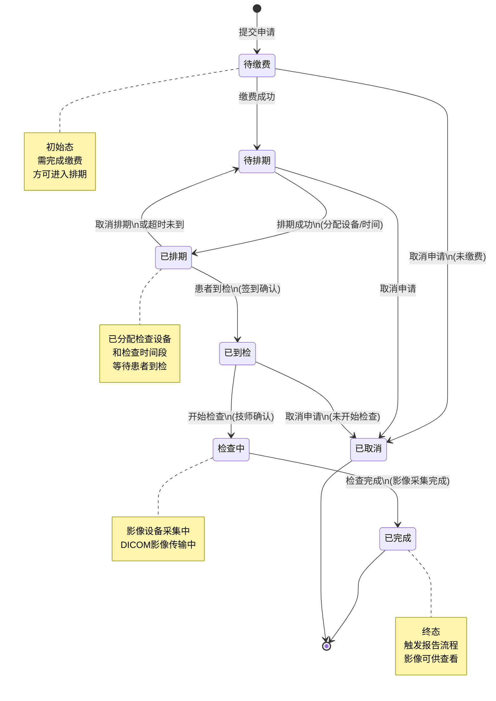
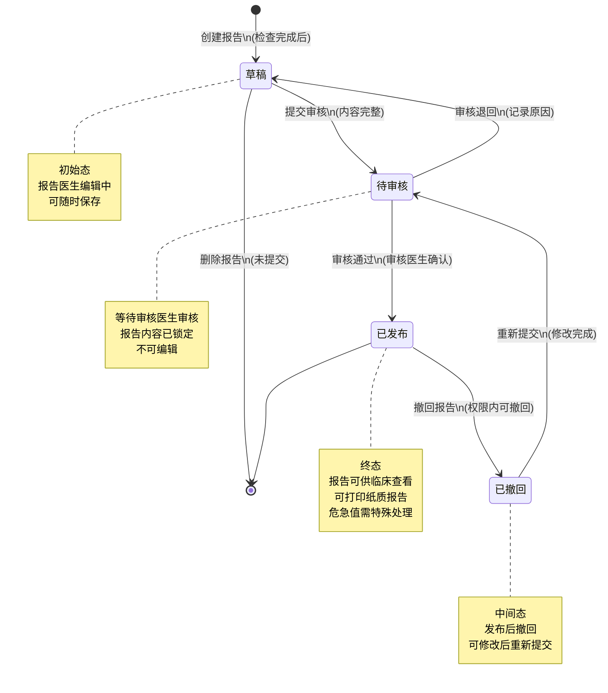
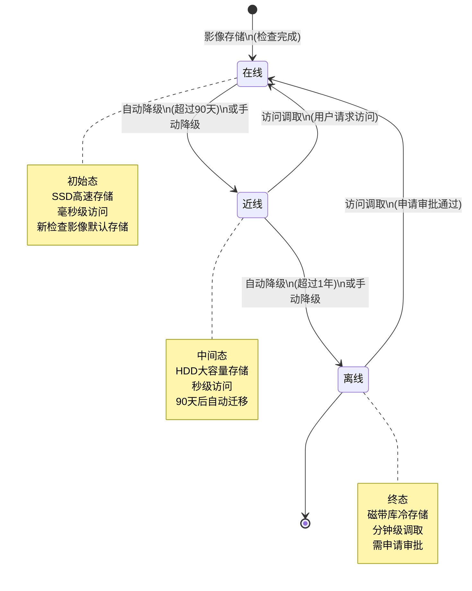
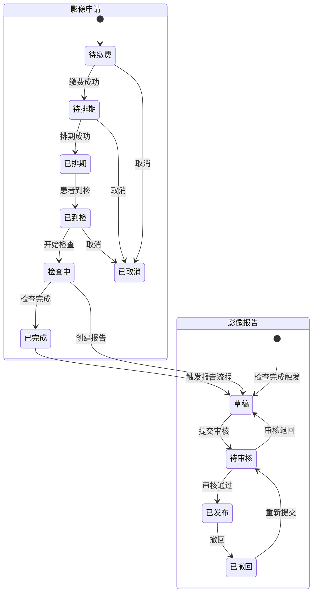

# M05-影像管理 - 状态机设计文档

> **文档编号**: YUDAO-HIS-SM-M05
> **版本**: V1.0
> **创建日期**: 2026-06-22
> **状态**: 设计中
> **关联文档**: YUDAO-HIS-SM-001 (全局状态机设计文档), YUDAO-HIS-DB-M05 (影像管理数据库设计)

---

## 1. 概述

本文档定义影像管理模块(M05)核心业务对象的状态机设计，包括影像申请状态机、影像报告状态机和DICOM影像存储状态机。

### 1.1 状态机清单

| 序号 | 状态机编号 | 状态机名称 | 适用对象 | 优先级 | 业务规则 |
|------|------------|----------|----------|--------|----------|
| 1 | SM-001 | 影像申请状态机 | his_imaging_request | P0 | BR-IMG-001 |
| 2 | SM-002 | 影像报告状态机 | his_imaging_report | P0 | BR-IMG-002 |
| 3 | SM-003 | DICOM影像存储状态机 | his_imaging_storage | P0 | BR-IMG-003 |

---

## 2. 影像申请状态机 (SM-001)

### 2.1 基本信息

| 属性 | 内容 |
|------|------|
| 状态机编号 | SM-001 |
| 状态机名称 | 影像申请状态机 |
| 适用对象 | his_imaging_request（影像申请表） |
| 状态字段 | request_status |
| 业务规则 | BR-IMG-001: 影像申请状态流转规则 |
| 优先级 | P0（MVP必需） |

### 2.2 状态列表

| 状态编码 | 状态名称 | 状态描述 | 状态类型 | 允许操作 |
|----------|----------|----------|----------|----------|
| 1 | 待缴费 | 申请已提交，等待缴费 | 初始态 | 缴费、取消 |
| 2 | 待排期 | 已缴费，等待排期 | 中间态 | 排期、取消 |
| 3 | 已排期 | 已排期，等待到检 | 中间态 | 到检、取消排期 |
| 4 | 已到检 | 患者已到达，等待检查 | 中间态 | 开始检查、取消 |
| 5 | 检查中 | 影像检查进行中 | 中间态 | 完成检查 |
| 6 | 已完成 | 影像检查已完成 | 终态 | 无 |
| 7 | 已取消 | 申请已取消 | 终态 | 无 |

### 2.3 状态流转表

| 当前状态 | 触发事件 | 目标状态 | 前置条件 | 执行操作 | 关联规则 |
|----------|----------|----------|----------|----------|----------|
| - | 提交申请 | 待缴费(1) | 医生开立医嘱、申请信息完整 | 创建影像申请记录、生成申请编号 | BR-IMG-010 |
| 待缴费(1) | 缴费成功 | 待排期(2) | 支付成功、费用确认 | 更新缴费状态、发送待排期通知 | BR-IMG-011 |
| 待缴费(1) | 取消申请 | 已取消(7) | 未缴费、在取消时限内 | 记录取消原因、通知申请科室 | BR-IMG-012 |
| 待排期(2) | 排期成功 | 已排期(3) | 设备可用、时间段可预约 | 分配检查时间、设备、检查室 | BR-IMG-020 |
| 待排期(2) | 取消申请 | 已取消(7) | 未开始排期 | 记录取消原因、处理退款 | BR-IMG-012 |
| 已排期(3) | 患者到检 | 已到检(4) | 患者签到确认 | 更新到检时间、发送检查通知 | BR-IMG-030 |
| 已排期(3) | 取消排期 | 待排期(2) | 未到检、在取消时限内 | 释放排期、通知患者 | BR-IMG-021 |
| 已排期(3) | 超时未到 | 待排期(2) | 超过预约时间30分钟 | 释放排期、发送超时通知 | BR-IMG-031 |
| 已到检(4) | 开始检查 | 检查中(5) | 设备就绪、技师确认 | 更新检查状态、记录开始时间 | BR-IMG-040 |
| 已到检(4) | 取消申请 | 已取消(7) | 未开始检查 | 记录取消原因、处理退款 | BR-IMG-012 |
| 检查中(5) | 检查完成 | 已完成(6) | 影像采集完成、质量合格 | 更新检查状态、生成检查记录、触发报告流程 | BR-IMG-041 |
| 检查中(5) | 检查异常 | 已完成(6) | 影像质量问题需备注 | 标记异常、记录异常原因、通知医生 | BR-IMG-042 |

### 2.4 状态流转图



### 2.5 状态约束规则

1. **缴费前置**: 必须完成缴费才能进入排期流程（BR-IMG-011）
2. **排期时效**: 急诊申请优先排期，普通申请按先来先服务原则
3. **超时处理**: 预约时间后30分钟未到检自动释放排期（BR-IMG-031）
4. **取消退款**: 已缴费但取消的申请需走退款流程
5. **检查关联**: 检查完成后自动创建his_imaging_study记录
6. **医保同步**: 医保患者的申请状态变更需同步医保平台

### 2.6 Java枚举定义

```java
/**
 * 影像申请状态枚举
 */
public enum ImagingRequestStatusEnum implements StatusEnum {

    PENDING_PAYMENT(1, "待缴费", "申请已提交，等待缴费"),
    PENDING_SCHEDULE(2, "待排期", "已缴费，等待排期"),
    SCHEDULED(3, "已排期", "已排期，等待到检"),
    ARRIVED(4, "已到检", "患者已到达，等待检查"),
    IN_PROGRESS(5, "检查中", "影像检查进行中"),
    COMPLETED(6, "已完成", "影像检查已完成"),
    CANCELLED(7, "已取消", "申请已取消");

    private final Integer code;
    private final String name;
    private final String description;

    ImagingRequestStatusEnum(Integer code, String name, String description) {
        this.code = code;
        this.name = name;
        this.description = description;
    }

    @Override
    public Integer getCode() {
        return code;
    }

    @Override
    public String getName() {
        return name;
    }

    @Override
    public String getDescription() {
        return description;
    }

    /**
     * 判断是否可以取消
     */
    public boolean canCancel() {
        return this == PENDING_PAYMENT 
            || this == PENDING_SCHEDULE 
            || this == ARRIVED;
    }

    /**
     * 判断是否可以排期
     */
    public boolean canSchedule() {
        return this == PENDING_SCHEDULE;
    }

    /**
     * 判断是否可以开始检查
     */
    public boolean canStartExam() {
        return this == ARRIVED;
    }

    /**
     * 判断是否为终态
     */
    public boolean isFinal() {
        return this == COMPLETED || this == CANCELLED;
    }

    /**
     * 判断是否需要缴费
     */
    public boolean needPayment() {
        return this == PENDING_PAYMENT;
    }
}
```

---

## 3. 影像报告状态机 (SM-002)

### 3.1 基本信息

| 属性 | 内容 |
|------|------|
| 状态机编号 | SM-002 |
| 状态机名称 | 影像报告状态机 |
| 适用对象 | his_imaging_report（影像报告表） |
| 状态字段 | report_status |
| 业务规则 | BR-IMG-002: 影像报告状态流转规则 |
| 优先级 | P0（MVP必需） |

### 3.2 状态列表

| 状态编码 | 状态名称 | 状态描述 | 状态类型 | 允许操作 |
|----------|----------|----------|----------|----------|
| 1 | 草稿 | 报告撰写中，可编辑 | 初始态 | 编辑、提交审核、删除 |
| 2 | 待审核 | 已提交，等待审核 | 中间态 | 审核通过、审核退回 |
| 3 | 已发布 | 审核通过，已发布 | 终态 | 撤回、打印 |
| 4 | 已撤回 | 已发布后撤回，可修改 | 中间态 | 编辑、重新提交 |

### 3.3 状态流转表

| 当前状态 | 触发事件 | 目标状态 | 前置条件 | 执行操作 | 关联规则 |
|----------|----------|----------|----------|----------|----------|
| - | 创建报告 | 草稿(1) | 检查已完成 | 创建报告记录、关联检查 | BR-IMG-050 |
| 草稿(1) | 提交审核 | 待审核(2) | 报告内容完整 | 发送审核通知、锁定编辑 | BR-IMG-051 |
| 草稿(1) | 删除报告 | - | 未提交审核 | 删除报告记录 | - |
| 待审核(2) | 审核通过 | 已发布(3) | 审核医生确认 | 更新发布时间、通知临床医生 | BR-IMG-052 |
| 待审核(2) | 审核退回 | 草稿(1) | 审核医生退回 | 记录退回原因、解锁编辑 | BR-IMG-053 |
| 已发布(3) | 撤回报告 | 已撤回(4) | 权限内可撤回 | 记录撤回原因、通知相关人员 | BR-IMG-054 |
| 已撤回(4) | 重新提交 | 待审核(2) | 修改完成 | 发送审核通知 | BR-IMG-055 |

### 3.4 状态流转图



### 3.5 状态约束规则

1. **报告时限**: 普通检查报告应在24小时内完成，急诊6小时内完成（BR-IMG-050）
2. **审核权限**: 只有具有审核权限的医生才能审核报告（BR-IMG-052）
3. **危急值处理**: 发现危急值必须立即通知临床并记录（BR-IMG-060）
4. **撤回权限**: 报告发布后24小时内可撤回，需上级审批（BR-IMG-054）
5. **报告签名**: 发布的报告必须有报告医生和审核医生的电子签名
6. **历史对比**: 报告应提供与历史检查对比的结论

### 3.6 Java枚举定义

```java
/**
 * 影像报告状态枚举
 */
public enum ImagingReportStatusEnum implements StatusEnum {

    DRAFT(1, "草稿", "报告撰写中，可编辑"),
    PENDING_REVIEW(2, "待审核", "已提交，等待审核"),
    PUBLISHED(3, "已发布", "审核通过，已发布"),
    RETRACTED(4, "已撤回", "已发布后撤回，可修改");

    private final Integer code;
    private final String name;
    private final String description;

    ImagingReportStatusEnum(Integer code, String name, String description) {
        this.code = code;
        this.name = name;
        this.description = description;
    }

    @Override
    public Integer getCode() {
        return code;
    }

    @Override
    public String getName() {
        return name;
    }

    @Override
    public String getDescription() {
        return description;
    }

    /**
     * 判断是否可以编辑
     */
    public boolean canEdit() {
        return this == DRAFT || this == RETRACTED;
    }

    /**
     * 判断是否可以提交审核
     */
    public boolean canSubmit() {
        return this == DRAFT || this == RETRACTED;
    }

    /**
     * 判断是否可以审核
     */
    public boolean canReview() {
        return this == PENDING_REVIEW;
    }

    /**
     * 判断是否可以撤回
     */
    public boolean canRetract() {
        return this == PUBLISHED;
    }

    /**
     * 判断是否为终态
     */
    public boolean isFinal() {
        return this == PUBLISHED;
    }

    /**
     * 判断是否可供临床查看
     */
    public boolean isViewable() {
        return this == PUBLISHED;
    }
}
```

---

## 4. DICOM影像存储状态机 (SM-003)

### 4.1 基本信息

| 属性 | 内容 |
|------|------|
| 状态机编号 | SM-003 |
| 状态机名称 | DICOM影像存储状态机 |
| 适用对象 | his_imaging_storage（影像存储位置表） |
| 状态字段 | storage_tier |
| 业务规则 | BR-IMG-003: DICOM影像存储层级流转规则 |
| 优先级 | P0（MVP必需） |

### 4.2 状态列表

| 状态编码 | 状态名称 | 状态描述 | 状态类型 | 存储介质 |
|----------|----------|----------|----------|----------|
| 1 | 在线 | 影像在线存储，可即时访问 | 初始态 | SSD/NVMe高速存储 |
| 2 | 近线 | 影像近线存储，访问需短暂等待 | 中间态 | HDD大容量存储 |
| 3 | 离线 | 影像离线存储，需申请调取 | 终态 | 磁带库/冷存储 |

### 4.3 状态流转表

| 当前状态 | 触发事件 | 目标状态 | 前置条件 | 执行操作 | 关联规则 |
|----------|----------|----------|----------|----------|----------|
| - | 影像存储 | 在线(1) | 检查完成、影像上传成功 | 存储到在线存储、生成访问URL | BR-IMG-070 |
| 在线(1) | 自动降级 | 近线(2) | 超过在线保留期(默认90天) | 迁移到近线存储、更新访问路径 | BR-IMG-071 |
| 在线(1) | 手动降级 | 近线(2) | 管理员操作 | 迁移到近线存储、记录操作日志 | BR-IMG-072 |
| 近线(2) | 自动降级 | 离线(3) | 超过近线保留期(默认1年) | 迁移到离线存储、更新元数据 | BR-IMG-073 |
| 近线(2) | 手动降级 | 离线(3) | 管理员操作 | 迁移到离线存储、记录操作日志 | BR-IMG-074 |
| 近线(2) | 访问调取 | 在线(1) | 用户访问请求 | 从近线存储调取、迁移到在线 | BR-IMG-075 |
| 离线(3) | 访问调取 | 在线(1) | 用户访问申请、审批通过 | 从离线存储调取、迁移到在线 | BR-IMG-076 |

### 4.4 状态流转图



### 4.5 状态约束规则

1. **存储期限**: 在线存储默认保留90天，近线存储默认保留1年（BR-IMG-071）
2. **自动迁移**: 系统自动执行存储层级迁移，不影响影像访问
3. **访问优先**: 用户访问近线或离线影像时，自动提升到在线存储
4. **容量监控**: 在线存储容量超过80%时触发告警
5. **数据完整性**: 迁移过程必须保证数据完整性，校验成功后删除源文件
6. **合规保留**: 医学影像必须按法规要求保留至少15年

### 4.6 Java枚举定义

```java
/**
 * DICOM影像存储层级枚举
 */
public enum ImagingStorageTierEnum implements StatusEnum {

    ONLINE(1, "在线", "影像在线存储，可即时访问"),
    NEARLINE(2, "近线", "影像近线存储，访问需短暂等待"),
    OFFLINE(3, "离线", "影像离线存储，需申请调取");

    private final Integer code;
    private final String name;
    private final String description;

    ImagingStorageTierEnum(Integer code, String name, String description) {
        this.code = code;
        this.name = name;
        this.description = description;
    }

    @Override
    public Integer getCode() {
        return code;
    }

    @Override
    public String getName() {
        return name;
    }

    @Override
    public String getDescription() {
        return description;
    }

    /**
     * 判断是否需要调取
     */
    public boolean needRetrieve() {
        return this == NEARLINE || this == OFFLINE;
    }

    /**
     * 判断是否可以即时访问
     */
    public boolean isInstantAccess() {
        return this == ONLINE;
    }

    /**
     * 判断是否为离线状态
     */
    public boolean isOffline() {
        return this == OFFLINE;
    }

    /**
     * 获取预计访问延迟(秒)
     */
    public int getAccessDelaySeconds() {
        switch (this) {
            case ONLINE: return 0;
            case NEARLINE: return 5;
            case OFFLINE: return 300;
            default: return 0;
        }
    }
}
```

---

## 5. 状态机关联关系

### 5.1 影像申请与报告状态关联



### 5.2 影像存储与检查状态关联

| 检查状态 | 推荐存储层级 | 访问频率 | 备注 |
|----------|--------------|----------|------|
| 检查中 | 在线 | 高 | 实时采集，频繁访问 |
| 已完成(30天内) | 在线 | 高 | 报告撰写、临床查看 |
| 已完成(30-90天) | 在线 | 中 | 可能的历史对比 |
| 已完成(90天-1年) | 近线 | 低 | 归档存储 |
| 已完成(1年以上) | 离线 | 极低 | 长期保存 |

---

## 6. 状态机配置参数

### 6.1 影像申请参数配置

| 参数编码 | 参数名称 | 默认值 | 说明 |
|----------|----------|--------|------|
| IMG_SCHEDULE_TIMEOUT | 排期超时时间 | 24小时 | 超过时限未排期自动告警 |
| IMG_ARRIVE_TIMEOUT | 到检超时时间 | 30分钟 | 超过预约时间未到检自动释放 |
| IMG_CANCEL_LIMIT | 取消时限 | 检查前2小时 | 超过时限需审批方可取消 |
| IMG_EMERGENCY_PRIORITY | 急诊优先级 | 99 | 急诊申请自动优先排期 |

### 6.2 影像报告参数配置

| 参数编码 | 参数名称 | 默认值 | 说明 |
|----------|----------|--------|------|
| IMG_REPORT_ROUTINE_DEADLINE | 普通报告时限 | 24小时 | 超过时限告警 |
| IMG_REPORT_URGENT_DEADLINE | 急诊报告时限 | 6小时 | 超过时限告警 |
| IMG_RETRACT_DEADLINE | 撤回时限 | 24小时 | 发布后超过时限不可撤回 |
| IMG_CRITICAL_NOTIFY | 危急值通知时限 | 10分钟 | 发现危急值后通知时限 |

### 6.3 影像存储参数配置

| 参数编码 | 参数名称 | 默认值 | 说明 |
|----------|----------|--------|------|
| IMG_ONLINE_RETENTION | 在线保留天数 | 90天 | 超过天数自动迁移到近线 |
| IMG_NEARLINE_RETENTION | 近线保留天数 | 365天 | 超过天数自动迁移到离线 |
| IMG_OFFLINE_RETENTION | 离线保留天数 | 15年 | 按法规要求最低保留期 |
| IMG_STORAGE_WARNING | 存储告警阈值 | 80% | 超过阈值触发容量告警 |

---

## 7. 状态变更审计日志

所有状态变更必须记录审计日志，包含以下信息：

| 字段 | 说明 |
|------|------|
| business_id | 业务ID（申请ID/报告ID/存储ID） |
| business_type | 业务类型（IMAGING_REQUEST/IMAGING_REPORT/IMAGING_STORAGE） |
| from_status | 原状态编码 |
| to_status | 目标状态编码 |
| trigger_event | 触发事件 |
| operator_id | 操作人ID |
| operator_name | 操作人姓名 |
| operate_time | 操作时间 |
| remark | 备注说明 |

---

## 附录: 变更历史

| 版本 | 日期 | 变更内容 | 变更人 |
|------|------|----------|--------|
| V1.0 | 2026-06-22 | 初始版本，完成影像管理模块状态机设计 | Claude AI |

---

> **最后更新**: 2026-06-22
