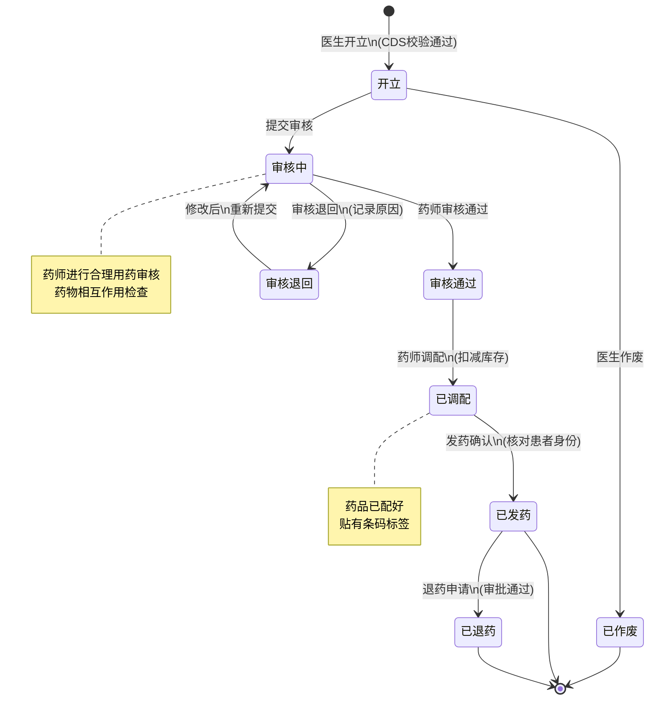

# M06-药品管理 - 状态机设计文档

> **文档编号**: YUDAO-HIS-SM-M06
> **版本**: V1.0
> **创建日期**: 2026-06-17
> **状态**: 设计中
> **关联文档**: YUDAO-HIS-SM-001 (全局状态机设计文档)

---

## 1. 概述

本文档定义药品管理模块(M06)核心业务对象的状态机设计，主要涉及处方状态机在药品管理场景下的相关部分。

处方状态机的完整定义参见：
- `M01-门诊管理-状态机设计.md` (SM-003 处方状态机)

### 1.1 状态机清单

| 序号 | 状态机编号 | 状态机名称 | 适用对象 | 优先级 | 业务规则 |
|------|------------|----------|----------|--------|----------|
| 1 | SM-003 | 处方状态机 | his_prescription | P0 | BR-PHARM-005 |

---

## 2. 处方状态机 (SM-003) - 药品管理视角

### 2.1 基本信息

| 属性 | 内容 |
|------|------|
| 状态机编号 | SM-003 |
| 状态机名称 | 处方状态机 |
| 适用对象 | his_prescription（处方记录表） |
| 状态字段 | prescription_status |
| 业务规则 | BR-PHARM-005: 处方必须经审核方可调配 |
| 优先级 | P0（MVP必需） |

### 2.2 状态列表

| 状态编码 | 状态名称 | 状态描述 | 状态类型 | 允许操作 |
|----------|----------|----------|----------|----------|
| 1 | 开立 | 医生已开立处方 | 初始态 | 提交审核、作废 |
| 2 | 审核中 | 药师审核中 | 中间态 | 审核通过、审核退回 |
| 3 | 审核通过 | 药师审核通过 | 中间态 | 调配 |
| 4 | 审核退回 | 审核不通过，退回修改 | 中间态 | 修改后重新提交 |
| 5 | 已调配 | 药品已调配完成 | 中间态 | 发药 |
| 6 | 已发药 | 药品已发放给患者 | 终态 | 退药申请 |
| 7 | 已退药 | 药品已退回 | 终态 | 无 |
| 8 | 已作废 | 处方已作废 | 终态 | 无 |

### 2.3 药品管理关注的状态流转

从药品管理视角，重点关注以下状态流转（标注*为重点关注）：

| 当前状态 | 触发事件 | 目标状态 | 前置条件 | 执行操作 | 关联规则 |
|----------|----------|----------|----------|----------|----------|
| - | 医生开立 | 开立(1) | CDS校验通过 | 创建处方记录 | BR-OP-006 |
| 开立(1) | 提交审核 | 审核中(2) | 处方信息完整 | 发送审核通知 | - |
| 开立(1) | 医生作废 | 已作废(8) | 未开始审核 | 记录作废原因 | - |
| 审核中(2) | 审核通过 | 审核通过(3) | 合理用药检查通过 | 记录审核药师、时间 | BR-PHARM-006 |
| 审核中(2) | 审核退回 | 审核退回(4) | 发现问题 | 记录退回原因、通知医生 | - |
| 审核退回(4) | 修改提交 | 审核中(2) | 医生修改完成 | 重新进入审核流程 | - |
| *审核通过(3) | *药师调配 | *已调配(5) | *库存充足 | *扣减库存、贴标签 | *BR-PHARM-009 |
| *已调配(5) | *发药确认 | *已发药(6) | *核对患者身份 | *记录发药时间、药师 | *BR-OP-012 |
| *已发药(6) | *退药申请 | *已退药(7) | *审批通过 | *回补库存、记录退药 | - |

### 2.4 状态流转图



### 2.5 药品管理相关约束规则

从药品管理视角，重点关注以下约束规则：

1. **审核强制**: 所有处方必须经过药师审核方可调配（BR-PHARM-005）
2. **库存扣减**: 发药确认时库存扣减必须原子操作（BR-PHARM-009）
3. **麻醉药品**: 麻醉药品处方需专项管理（BR-PHARM-004）
4. **合理用药检查**: 审核时进行药物相互作用检查（BR-PHARM-006）
5. **退药处理**: 退药审批通过后需回补库存

### 2.6 Java枚举定义

```java
/**
 * 处方状态枚举
 */
public enum PrescriptionStatusEnum implements StatusEnum {

    CREATED(1, "开立", "医生已开立处方"),
    AUDITING(2, "审核中", "药师审核中"),
    AUDIT_PASSED(3, "审核通过", "药师审核通过"),
    AUDIT_REJECTED(4, "审核退回", "审核不通过，退回修改"),
    DISPENSED(5, "已调配", "药品已调配完成"),
    DISPENSED_OUT(6, "已发药", "药品已发放给患者"),
    RETURNED(7, "已退药", "药品已退回"),
    VOIDED(8, "已作废", "处方已作废");

    private final Integer code;
    private final String name;
    private final String description;

    PrescriptionStatusEnum(Integer code, String name, String description) {
        this.code = code;
        this.name = name;
        this.description = description;
    }

    @Override
    public Integer getCode() {
        return code;
    }

    @Override
    public String getName() {
        return name;
    }

    @Override
    public String getDescription() {
        return description;
    }

    /**
     * 判断是否可以调配
     */
    public boolean canDispense() {
        return this == AUDIT_PASSED;
    }

    /**
     * 判断是否可以发药
     */
    public boolean canDispenseOut() {
        return this == DISPENSED;
    }

    /**
     * 判断是否为终态
     */
    public boolean isFinal() {
        return this == DISPENSED_OUT || this == RETURNED || this == VOIDED;
    }
}
```

---

## 3. 药品管理模块相关业务流程

### 3.1 处方审核流程

1. 处方从门诊/住院模块提交后进入审核中状态
2. 药师进行合理用药审核：
   - 药物相互作用检查
   - 剂量合理性检查
   - 禁忌症检查
3. 审核通过后进入审核通过状态，可进行调配
4. 审核不通过则退回，记录退回原因并通知医生

### 3.2 调配发药流程

1. 处方审核通过后，药师进行药品调配
2. 调配时检查库存是否充足
3. 调配完成后贴条码标签，进入已调配状态
4. 发药时核对患者身份，确认后进入已发药状态
5. 发药确认时执行库存扣减（原子操作）

### 3.3 退药流程

1. 患者申请退药，需经审批
2. 审批通过后，执行退药操作
3. 回补库存，记录退药信息
4. 进入已退药状态

---

## 附录: 变更历史

| 版本 | 日期 | 变更内容 | 变更人 |
|------|------|----------|--------|
| V1.0 | 2026-06-17 | 从全局状态机设计文档拆分 | YUDAO-AI-HIS架构组 |

---

> **最后更新**: 2026-06-17
