# M07-手术麻醉 - 数据库设计文档

> **文档编号**: YUDAO-HIS-DB-M07
> **版本**: V1.0
> **创建日期**: 2026-06-22
> **状态**: 设计中
> **参考文档**: YUDAO-HIS-DB-001, YUDAO-HIS-PRD-M07

---

## 1. 模块概述

### 1.1 模块范围

本模块包含手术麻醉业务相关的数据库表设计，包括：
- 手术申请管理
- 手术室管理
- 手术排期管理
- 手术执行记录
- 麻醉管理
- 术后随访管理
- 手术安全核查管理

### 1.2 模块表清单

| 表名 | 中文名 | FHIR映射 | 年增量估算 |
|------|--------|----------|------------|
| his_surgery_request | 手术申请表 | ServiceRequest | 约10万条 |
| his_operating_room | 手术室表 | Location | 约100条 |
| his_surgery_schedule | 手术排期表 | Appointment | 约10万条 |
| his_surgery_record | 手术记录表 | Procedure | 约10万条 |
| his_anesthesia_record | 麻醉记录表 | Procedure | 约10万条 |
| his_anesthesia_vital | 麻醉生命体征表 | Observation | 约500万条 |
| his_surgery_followup | 术后随访表 | FollowUp | 约30万条 |
| his_surgery_checklist | 手术安全核查表 | - | 约10万条 |

---

## 2. ER图设计

### 2.1 手术麻醉域 ER图

```mermaid
erDiagram
    his_surgery_request {
        BIGINT id PK "申请ID"
        VARCHAR request_no UK "申请编号"
        BIGINT patient_id FK "患者ID"
        BIGINT admission_id FK "住院ID"
        VARCHAR surgery_name "手术名称"
        VARCHAR surgery_code "手术编码(ICD-9)"
        TINYINT surgery_level "手术分级"
        VARCHAR pre_diagnosis "术前诊断"
        VARCHAR pre_diagnosis_code "术前诊断编码"
        BIGINT apply_dept_id FK "申请科室ID"
        BIGINT apply_doctor_id FK "申请医生ID"
        DATETIME apply_time "申请时间"
        TINYINT urgency_level "急缓等级"
        TINYINT status "状态"
        DATETIME create_time "创建时间"
    }
    
    his_operating_room {
        BIGINT id PK "手术室ID"
        VARCHAR room_no UK "手术室编号"
        VARCHAR room_name "手术室名称"
        TINYINT room_type "手术室类型"
        TINYINT status "状态"
        DECIMAL daily_rate "日费用"
        VARCHAR equipment_config "设备配置"
        DATETIME create_time "创建时间"
    }
    
    his_surgery_schedule {
        BIGINT id PK "排期ID"
        VARCHAR schedule_no UK "排期编号"
        BIGINT request_id FK "申请ID"
        BIGINT patient_id FK "患者ID"
        BIGINT admission_id FK "住院ID"
        BIGINT room_id FK "手术室ID"
        DATE surgery_date "手术日期"
        VARCHAR time_period "手术时段"
        DATETIME plan_start_time "计划开始时间"
        DATETIME plan_end_time "计划结束时间"
        BIGINT surgeon_id FK "主刀医生ID"
        BIGINT anesthesiologist_id FK "麻醉医生ID"
        BIGINT scrub_nurse_id FK "洗手护士ID"
        BIGINT circulating_nurse_id FK "巡回护士ID"
        TINYINT status "状态"
        DATETIME create_time "创建时间"
    }
    
    his_surgery_record {
        BIGINT id PK "手术记录ID"
        VARCHAR record_no UK "记录编号"
        BIGINT schedule_id FK "排期ID"
        BIGINT patient_id FK "患者ID"
        BIGINT admission_id FK "住院ID"
        BIGINT room_id FK "手术室ID"
        DATETIME enter_time "入室时间"
        DATETIME anesthesia_start_time "麻醉开始时间"
        DATETIME surgery_start_time "手术开始时间"
        DATETIME surgery_end_time "手术结束时间"
        DATETIME anesthesia_end_time "麻醉结束时间"
        DATETIME leave_time "离室时间"
        VARCHAR surgery_name "手术名称"
        VARCHAR surgery_code "手术编码"
        VARCHAR post_diagnosis "术后诊断"
        VARCHAR surgery_process "手术过程"
        INT blood_loss "出血量(ml)"
        INT transfusion_volume "输血量(ml)"
        INT urine_output "尿量(ml)"
        VARCHAR specimen_info "标本信息"
        VARCHAR complication "并发症"
        TINYINT status "状态"
        DATETIME create_time "创建时间"
    }
    
    his_anesthesia_record {
        BIGINT id PK "麻醉记录ID"
        VARCHAR record_no UK "记录编号"
        BIGINT surgery_record_id FK "手术记录ID"
        BIGINT patient_id FK "患者ID"
        VARCHAR anesthesia_method "麻醉方式"
        VARCHAR anesthesia_plan "麻醉方案"
        TINYINT asa_grade "ASA分级"
        INT anesthesia_duration "麻醉时长(分钟)"
        TEXT induction_drugs "诱导期用药"
        TEXT maintenance_drugs "维持期用药"
        TEXT recovery_drugs "苏醒期用药"
        VARCHAR adverse_event "不良事件"
        TINYINT steward_score "Steward评分"
        BIGINT anesthesiologist_id FK "麻醉医生ID"
        TINYINT status "状态"
        DATETIME create_time "创建时间"
    }
    
    his_anesthesia_vital {
        BIGINT id PK "体征记录ID"
        BIGINT anesthesia_record_id FK "麻醉记录ID"
        BIGINT patient_id FK "患者ID"
        DATETIME measure_time "测量时间"
        TINYINT measure_phase "测量阶段"
        INT heart_rate "心率(次/分)"
        INT systolic_bp "收缩压(mmHg)"
        INT diastolic_bp "舒张压(mmHg)"
        DECIMAL oxygen_saturation "血氧饱和度(%)"
        INT respiration "呼吸(次/分)"
        DECIMAL temperature "体温(C)"
        INT et_co2 "呼气末CO2"
        DECIMAL minute_volume "分钟通气量"
        TINYINT abnormal_flag "异常标识"
        DATETIME create_time "创建时间"
    }
    
    his_surgery_followup {
        BIGINT id PK "随访ID"
        VARCHAR followup_no UK "随访编号"
        BIGINT surgery_record_id FK "手术记录ID"
        BIGINT patient_id FK "患者ID"
        BIGINT admission_id FK "住院ID"
        TINYINT followup_day "随访天数"
        DATE followup_date "随访日期"
        VARCHAR wound_healing "伤口愈合情况"
        VARCHAR recovery_status "恢复情况"
        VARCHAR complication "并发症"
        VARCHAR anesthesia_complication "麻醉相关并发症"
        VARCHAR pain_score "疼痛评分"
        VARCHAR treatment_suggestion "处理建议"
        BIGINT followup_doctor_id FK "随访医生ID"
        TINYINT status "状态"
        DATETIME create_time "创建时间"
    }
    
    his_surgery_checklist {
        BIGINT id PK "核查表ID"
        VARCHAR checklist_no UK "核查表编号"
        BIGINT surgery_record_id FK "手术记录ID"
        BIGINT patient_id FK "患者ID"
        TINYINT check_phase "核查阶段"
        TINYINT patient_identity_check "患者身份核对"
        TINYINT surgery_site_check "手术部位核对"
        TINYINT surgery_name_check "手术名称核对"
        TINYINT anesthesia_method_check "麻醉方式核对"
        TINYINT allergy_check "过敏史核对"
        TINYINT equipment_check "设备器械准备"
        TINYINT specimen_check "标本确认"
        TINYINT item_count_check "物品清点"
        VARCHAR anesthesiologist_sign "麻醉医生签名"
        VARCHAR surgeon_sign "主刀医生签名"
        VARCHAR nurse_sign "巡回护士签名"
        DATETIME check_time "核查时间"
        TINYINT status "状态"
        DATETIME create_time "创建时间"
    }
    
    his_patient ||--o{ his_surgery_request : "申请手术"
    his_admission ||--o{ his_surgery_request : "住院手术申请"
    his_operating_room ||--o{ his_surgery_schedule : "排期分配"
    his_surgery_request ||--o| his_surgery_schedule : "排期"
    his_surgery_schedule ||--o| his_surgery_record : "手术记录"
    his_surgery_record ||--o| his_anesthesia_record : "麻醉记录"
    his_anesthesia_record ||--o{ his_anesthesia_vital : "生命体征"
    his_surgery_record ||--o{ his_surgery_followup : "术后随访"
    his_surgery_record ||--o| his_surgery_checklist : "安全核查"
```



---

## 3. DDL脚本设计

### 3.1 手术申请表 (his_surgery_request)

```sql
-- =============================================
-- 手术申请表
-- 对应FHIR资源: ServiceRequest
-- 年增量估算: 约10万条
-- =============================================
CREATE TABLE `his_surgery_request` (
    `id` BIGINT NOT NULL AUTO_INCREMENT COMMENT '申请ID',
    `request_no` VARCHAR(30) NOT NULL COMMENT '申请编号',
    `patient_id` BIGINT NOT NULL COMMENT '患者ID',
    `patient_name` VARCHAR(50) NOT NULL COMMENT '患者姓名',
    `gender` CHAR(1) COMMENT '性别',
    `age` INT COMMENT '年龄',
    `admission_id` BIGINT COMMENT '住院ID',
    `admission_no` VARCHAR(30) COMMENT '住院号',
    `bed_no` VARCHAR(20) COMMENT '床位号',
    `surgery_name` VARCHAR(200) NOT NULL COMMENT '手术名称',
    `surgery_code` VARCHAR(20) COMMENT '手术编码(ICD-9-CM-3)',
    `surgery_level` TINYINT NOT NULL COMMENT '手术分级: 1一级/2二级/3三级/4四级',
    `surgery_type` TINYINT COMMENT '手术类型: 1择期/2急诊/3日间',
    `pre_diagnosis` VARCHAR(500) COMMENT '术前诊断',
    `pre_diagnosis_code` VARCHAR(50) COMMENT '术前诊断编码(ICD-10)',
    `surgery_site` VARCHAR(100) COMMENT '手术部位',
    `surgery_site_mark` TINYINT DEFAULT 0 COMMENT '手术部位标记: 0未标记/1已标记',
    `anesthesia_method` VARCHAR(50) COMMENT '麻醉方式: 全身麻醉/椎管内麻醉/局部麻醉/复合麻醉',
    `estimated_duration` INT COMMENT '预计手术时长(分钟)',
    `estimated_blood_loss` INT COMMENT '预计出血量(ml)',
    `need_transfusion` TINYINT DEFAULT 0 COMMENT '是否需要备血: 0否/1是',
    `transfusion_type` VARCHAR(100) COMMENT '备血类型',
    `special_equipment` VARCHAR(500) COMMENT '特殊器械需求',
    `special_drugs` VARCHAR(500) COMMENT '特殊药品需求',
    `allergy_history` VARCHAR(500) COMMENT '过敏史',
    `medical_history` TEXT COMMENT '既往病史',
    `lab_check_result` TEXT COMMENT '术前检查结果',
    `lab_check_status` TINYINT DEFAULT 0 COMMENT '术前检查状态: 0未完成/1已完成/2异常',
    `consent_status` TINYINT DEFAULT 0 COMMENT '知情同意状态: 0未签署/1已签署',
    `consent_sign_time` DATETIME COMMENT '知情同意签署时间',
    `apply_dept_id` BIGINT NOT NULL COMMENT '申请科室ID',
    `apply_dept_name` VARCHAR(100) NOT NULL COMMENT '申请科室名称',
    `apply_doctor_id` BIGINT NOT NULL COMMENT '申请医生ID',
    `apply_doctor_name` VARCHAR(50) NOT NULL COMMENT '申请医生姓名',
    `apply_time` DATETIME NOT NULL COMMENT '申请时间',
    `urgency_level` TINYINT NOT NULL DEFAULT 2 COMMENT '急缓等级: 1急诊/2择期/3平诊',
    `plan_surgery_date` DATE COMMENT '计划手术日期',
    `status` TINYINT NOT NULL DEFAULT 1 COMMENT '状态: 1待审核/2已审核/3已排期/4已取消',
    `audit_doctor_id` BIGINT COMMENT '审核医生ID',
    `audit_doctor_name` VARCHAR(50) COMMENT '审核医生姓名',
    `audit_time` DATETIME COMMENT '审核时间',
    `audit_opinion` VARCHAR(500) COMMENT '审核意见',
    `cancel_time` DATETIME COMMENT '取消时间',
    `cancel_reason` VARCHAR(500) COMMENT '取消原因',
    `cancel_by` VARCHAR(50) COMMENT '取消人',
    `remark` VARCHAR(500) COMMENT '备注',
    `creator` VARCHAR(64) DEFAULT '' COMMENT '创建者',
    `create_time` DATETIME NOT NULL DEFAULT CURRENT_TIMESTAMP COMMENT '创建时间',
    `updater` VARCHAR(64) DEFAULT '' COMMENT '更新者',
    `update_time` DATETIME NOT NULL DEFAULT CURRENT_TIMESTAMP ON UPDATE CURRENT_TIMESTAMP COMMENT '更新时间',
    `deleted` BIT(1) NOT NULL DEFAULT b'0' COMMENT '是否删除',
    `tenant_id` BIGINT NOT NULL DEFAULT 0 COMMENT '租户编号',
    PRIMARY KEY (`id`),
    UNIQUE KEY `uk_request_no` (`request_no`),
    KEY `idx_request_patient` (`patient_id`),
    KEY `idx_request_admission` (`admission_id`),
    KEY `idx_request_dept` (`apply_dept_id`),
    KEY `idx_request_doctor` (`apply_doctor_id`),
    KEY `idx_request_status` (`status`),
    KEY `idx_request_level` (`surgery_level`),
    KEY `idx_request_urgency` (`urgency_level`),
    KEY `idx_request_plan_date` (`plan_surgery_date`),
    KEY `idx_request_time` (`apply_time`),
    CONSTRAINT `fk_request_patient` FOREIGN KEY (`patient_id`) REFERENCES `his_patient` (`id`),
    CONSTRAINT `fk_request_admission` FOREIGN KEY (`admission_id`) REFERENCES `his_admission` (`id`)
) ENGINE=InnoDB DEFAULT CHARSET=utf8mb4 COLLATE=utf8mb4_unicode_ci COMMENT='手术申请表';
```

### 3.2 手术室表 (his_operating_room)

```sql
-- =============================================
-- 手术室表
-- 对应FHIR资源: Location
-- =============================================
CREATE TABLE `his_operating_room` (
    `id` BIGINT NOT NULL AUTO_INCREMENT COMMENT '手术室ID',
    `room_no` VARCHAR(20) NOT NULL COMMENT '手术室编号',
    `room_name` VARCHAR(100) NOT NULL COMMENT '手术室名称',
    `room_type` TINYINT NOT NULL COMMENT '手术室类型: 1洁净手术室/2普通手术室/3负压手术室',
    `clean_level` VARCHAR(20) COMMENT '洁净级别: 百级/千级/万级/十万级',
    `dept_id` BIGINT COMMENT '所属科室ID',
    `dept_name` VARCHAR(100) COMMENT '所属科室名称',
    `building` VARCHAR(50) COMMENT '楼栋',
    `floor` INT COMMENT '楼层',
    `area` DECIMAL(10,2) COMMENT '面积(平方米)',
    `bed_count` INT DEFAULT 1 COMMENT '手术床数量',
    `daily_rate` DECIMAL(10,2) NOT NULL DEFAULT 0.00 COMMENT '日费用',
    `hourly_rate` DECIMAL(10,2) DEFAULT 0.00 COMMENT '时费用',
    `equipment_config` TEXT COMMENT '设备配置(JSON格式)',
    `special_function` VARCHAR(200) COMMENT '特殊功能: 心外/神外/骨科等',
    `status` TINYINT NOT NULL DEFAULT 1 COMMENT '状态: 1可用/2占用/3维护/4消毒',
    `status_time` DATETIME COMMENT '状态变更时间',
    `status_reason` VARCHAR(200) COMMENT '状态变更原因',
    `last_disinfect_time` DATETIME COMMENT '最后消毒时间',
    `next_disinfect_time` DATETIME COMMENT '下次消毒时间',
    `maintain_start_time` DATETIME COMMENT '维护开始时间',
    `maintain_end_time` DATETIME COMMENT '维护结束时间',
    `maintain_reason` VARCHAR(200) COMMENT '维护原因',
    `work_start_time` TIME DEFAULT '08:00:00' COMMENT '开放开始时间',
    `work_end_time` TIME DEFAULT '18:00:00' COMMENT '开放结束时间',
    `is_emergency` TINYINT DEFAULT 0 COMMENT '是否急诊专用: 0否/1是',
    `sort` INT DEFAULT 0 COMMENT '排序',
    `remark` VARCHAR(500) COMMENT '备注',
    `creator` VARCHAR(64) DEFAULT '' COMMENT '创建者',
    `create_time` DATETIME NOT NULL DEFAULT CURRENT_TIMESTAMP COMMENT '创建时间',
    `updater` VARCHAR(64) DEFAULT '' COMMENT '更新者',
    `update_time` DATETIME NOT NULL DEFAULT CURRENT_TIMESTAMP ON UPDATE CURRENT_TIMESTAMP COMMENT '更新时间',
    `deleted` BIT(1) NOT NULL DEFAULT b'0' COMMENT '是否删除',
    `tenant_id` BIGINT NOT NULL DEFAULT 0 COMMENT '租户编号',
    PRIMARY KEY (`id`),
    UNIQUE KEY `uk_room_no` (`room_no`),
    KEY `idx_room_type` (`room_type`),
    KEY `idx_room_status` (`status`),
    KEY `idx_room_dept` (`dept_id`)
) ENGINE=InnoDB DEFAULT CHARSET=utf8mb4 COLLATE=utf8mb4_unicode_ci COMMENT='手术室表';
```

### 3.3 手术排期表 (his_surgery_schedule)

```sql
-- =============================================
-- 手术排期表
-- 对应FHIR资源: Appointment
-- 年增量估算: 约10万条
-- =============================================
CREATE TABLE `his_surgery_schedule` (
    `id` BIGINT NOT NULL AUTO_INCREMENT COMMENT '排期ID',
    `schedule_no` VARCHAR(30) NOT NULL COMMENT '排期编号',
    `request_id` BIGINT NOT NULL COMMENT '申请ID',
    `request_no` VARCHAR(30) COMMENT '申请编号',
    `patient_id` BIGINT NOT NULL COMMENT '患者ID',
    `patient_name` VARCHAR(50) NOT NULL COMMENT '患者姓名',
    `gender` CHAR(1) COMMENT '性别',
    `age` INT COMMENT '年龄',
    `admission_id` BIGINT COMMENT '住院ID',
    `admission_no` VARCHAR(30) COMMENT '住院号',
    `bed_no` VARCHAR(20) COMMENT '床位号',
    `dept_id` BIGINT NOT NULL COMMENT '科室ID',
    `dept_name` VARCHAR(100) NOT NULL COMMENT '科室名称',
    `room_id` BIGINT NOT NULL COMMENT '手术室ID',
    `room_no` VARCHAR(20) COMMENT '手术室编号',
    `room_name` VARCHAR(100) COMMENT '手术室名称',
    `operating_table` INT DEFAULT 1 COMMENT '手术台号',
    `surgery_date` DATE NOT NULL COMMENT '手术日期',
    `time_period` VARCHAR(10) NOT NULL COMMENT '手术时段: AM上午/PM下午/Night夜间',
    `sequence_no` INT COMMENT '手术顺序',
    `plan_start_time` DATETIME COMMENT '计划开始时间',
    `plan_end_time` DATETIME COMMENT '计划结束时间',
    `surgery_name` VARCHAR(200) NOT NULL COMMENT '手术名称',
    `surgery_code` VARCHAR(20) COMMENT '手术编码',
    `surgery_level` TINYINT COMMENT '手术分级',
    `anesthesia_method` VARCHAR(50) COMMENT '麻醉方式',
    `surgery_type` TINYINT COMMENT '手术类型: 1择期/2急诊/3日间',
    `surgeon_id` BIGINT NOT NULL COMMENT '主刀医生ID',
    `surgeon_name` VARCHAR(50) NOT NULL COMMENT '主刀医生姓名',
    `surgeon_title` VARCHAR(50) COMMENT '主刀医生职称',
    `assistant_surgeon_id` BIGINT COMMENT '助手医生ID',
    `assistant_surgeon_name` VARCHAR(50) COMMENT '助手医生姓名',
    `anesthesiologist_id` BIGINT COMMENT '麻醉医生ID',
    `anesthesiologist_name` VARCHAR(50) COMMENT '麻醉医生姓名',
    `scrub_nurse_id` BIGINT COMMENT '洗手护士ID',
    `scrub_nurse_name` VARCHAR(50) COMMENT '洗手护士姓名',
    `circulating_nurse_id` BIGINT COMMENT '巡回护士ID',
    `circulating_nurse_name` VARCHAR(50) COMMENT '巡回护士姓名',
    `pre_op_preparation` TEXT COMMENT '术前准备清单(JSON格式)',
    `pre_op_preparation_status` TINYINT DEFAULT 0 COMMENT '术前准备状态: 0未完成/1已完成',
    `special_equipment` VARCHAR(500) COMMENT '特殊器械',
    `special_drugs` VARCHAR(500) COMMENT '特殊药品',
    `status` TINYINT NOT NULL DEFAULT 1 COMMENT '状态: 1已排期/2已入室/3手术中/4已完成/5已取消',
    `adjust_count` INT DEFAULT 0 COMMENT '调整次数',
    `last_adjust_time` DATETIME COMMENT '最后调整时间',
    `adjust_reason` VARCHAR(200) COMMENT '调整原因',
    `cancel_time` DATETIME COMMENT '取消时间',
    `cancel_reason` VARCHAR(500) COMMENT '取消原因',
    `cancel_by` VARCHAR(50) COMMENT '取消人',
    `remark` VARCHAR(500) COMMENT '备注',
    `creator` VARCHAR(64) DEFAULT '' COMMENT '创建者',
    `create_time` DATETIME NOT NULL DEFAULT CURRENT_TIMESTAMP COMMENT '创建时间',
    `updater` VARCHAR(64) DEFAULT '' COMMENT '更新者',
    `update_time` DATETIME NOT NULL DEFAULT CURRENT_TIMESTAMP ON UPDATE CURRENT_TIMESTAMP COMMENT '更新时间',
    `deleted` BIT(1) NOT NULL DEFAULT b'0' COMMENT '是否删除',
    `tenant_id` BIGINT NOT NULL DEFAULT 0 COMMENT '租户编号',
    PRIMARY KEY (`id`),
    UNIQUE KEY `uk_schedule_no` (`schedule_no`),
    KEY `idx_schedule_request` (`request_id`),
    KEY `idx_schedule_patient` (`patient_id`),
    KEY `idx_schedule_admission` (`admission_id`),
    KEY `idx_schedule_room` (`room_id`),
    KEY `idx_schedule_date` (`surgery_date`),
    KEY `idx_schedule_status` (`status`),
    KEY `idx_schedule_dept` (`dept_id`),
    KEY `idx_schedule_surgeon` (`surgeon_id`),
    KEY `idx_schedule_anesthesiologist` (`anesthesiologist_id`),
    KEY `idx_schedule_room_date` (`room_id`, `surgery_date`),
    CONSTRAINT `fk_schedule_request` FOREIGN KEY (`request_id`) REFERENCES `his_surgery_request` (`id`),
    CONSTRAINT `fk_schedule_patient` FOREIGN KEY (`patient_id`) REFERENCES `his_patient` (`id`),
    CONSTRAINT `fk_schedule_room` FOREIGN KEY (`room_id`) REFERENCES `his_operating_room` (`id`)
) ENGINE=InnoDB DEFAULT CHARSET=utf8mb4 COLLATE=utf8mb4_unicode_ci COMMENT='手术排期表';
```

### 3.4 手术记录表 (his_surgery_record)

```sql
-- =============================================
-- 手术记录表
-- 对应FHIR资源: Procedure
-- 年增量估算: 约10万条
-- =============================================
CREATE TABLE `his_surgery_record` (
    `id` BIGINT NOT NULL AUTO_INCREMENT COMMENT '手术记录ID',
    `record_no` VARCHAR(30) NOT NULL COMMENT '记录编号',
    `schedule_id` BIGINT NOT NULL COMMENT '排期ID',
    `schedule_no` VARCHAR(30) COMMENT '排期编号',
    `patient_id` BIGINT NOT NULL COMMENT '患者ID',
    `patient_name` VARCHAR(50) NOT NULL COMMENT '患者姓名',
    `gender` CHAR(1) COMMENT '性别',
    `age` INT COMMENT '年龄',
    `admission_id` BIGINT COMMENT '住院ID',
    `admission_no` VARCHAR(30) COMMENT '住院号',
    `dept_id` BIGINT NOT NULL COMMENT '科室ID',
    `dept_name` VARCHAR(100) COMMENT '科室名称',
    `room_id` BIGINT COMMENT '手术室ID',
    `room_no` VARCHAR(20) COMMENT '手术室编号',
    `room_name` VARCHAR(100) COMMENT '手术室名称',
    `surgery_date` DATE NOT NULL COMMENT '手术日期',
    `surgery_name` VARCHAR(200) NOT NULL COMMENT '手术名称',
    `surgery_code` VARCHAR(20) COMMENT '手术编码(ICD-9-CM-3)',
    `surgery_level` TINYINT COMMENT '手术分级',
    `surgery_type` TINYINT COMMENT '手术类型: 1择期/2急诊/3日间',
    `anesthesia_method` VARCHAR(50) COMMENT '麻醉方式',
    `enter_time` DATETIME COMMENT '入室时间',
    `anesthesia_start_time` DATETIME COMMENT '麻醉开始时间',
    `surgery_start_time` DATETIME COMMENT '手术开始时间',
    `surgery_end_time` DATETIME COMMENT '手术结束时间',
    `anesthesia_end_time` DATETIME COMMENT '麻醉结束时间',
    `leave_time` DATETIME COMMENT '离室时间',
    `surgery_duration` INT COMMENT '手术时长(分钟)',
    `anesthesia_duration` INT COMMENT '麻醉时长(分钟)',
    `in_room_duration` INT COMMENT '在室时长(分钟)',
    `pre_diagnosis` VARCHAR(500) COMMENT '术前诊断',
    `pre_diagnosis_code` VARCHAR(50) COMMENT '术前诊断编码',
    `post_diagnosis` VARCHAR(500) COMMENT '术后诊断',
    `post_diagnosis_code` VARCHAR(50) COMMENT '术后诊断编码',
    `surgery_site` VARCHAR(100) COMMENT '手术部位',
    `incision_type` VARCHAR(50) COMMENT '切口类型',
    `incision_level` TINYINT COMMENT '切口等级: 1清洁/2清洁污染/3污染/4污秽',
    `surgery_process` TEXT COMMENT '手术过程记录',
    `surgery_findings` TEXT COMMENT '术中发现',
    `surgery_steps` TEXT COMMENT '手术步骤(JSON格式)',
    `blood_loss` INT COMMENT '出血量(ml)',
    `blood_loss_estimate` VARCHAR(20) COMMENT '出血量估算: 少量/中等/大量',
    `transfusion_volume` INT COMMENT '输血量(ml)',
    `transfusion_type` VARCHAR(100) COMMENT '输血类型',
    `fluid_volume` INT COMMENT '输液量(ml)',
    `urine_output` INT COMMENT '尿量(ml)',
    `drainage_volume` INT COMMENT '引流量(ml)',
    `specimen_name` VARCHAR(200) COMMENT '标本名称',
    `specimen_count` INT COMMENT '标本数量',
    `specimen_dispose` VARCHAR(50) COMMENT '标本处理: 送检/丢弃/其他',
    `specimen_pathology_no` VARCHAR(30) COMMENT '病理送检号',
    `implant_info` VARCHAR(500) COMMENT '植入物信息',
    `complication` VARCHAR(500) COMMENT '术中并发症',
    `complication_type` TINYINT COMMENT '并发症类型: 1出血/2感染/3脏器损伤/4其他',
    `adverse_event` VARCHAR(500) COMMENT '不良事件',
    `gauze_count_before` INT COMMENT '术前纱布计数',
    `gauze_count_after` INT COMMENT '术后纱布计数',
    `instrument_count_before` INT COMMENT '术前器械计数',
    `instrument_count_after` INT COMMENT '术后器械计数',
    `needle_count_before` INT COMMENT '术前缝针计数',
    `needle_count_after` INT COMMENT '术后缝针计数',
    `count_check_result` TINYINT DEFAULT 1 COMMENT '清点核对结果: 1正确/2异常',
    `surgeon_id` BIGINT NOT NULL COMMENT '主刀医生ID',
    `surgeon_name` VARCHAR(50) NOT NULL COMMENT '主刀医生姓名',
    `surgeon_signature` VARCHAR(100) COMMENT '主刀医生签名',
    `assistant_surgeon_id` BIGINT COMMENT '助手医生ID',
    `assistant_surgeon_name` VARCHAR(50) COMMENT '助手医生姓名',
    `anesthesiologist_id` BIGINT COMMENT '麻醉医生ID',
    `anesthesiologist_name` VARCHAR(50) COMMENT '麻醉医生姓名',
    `scrub_nurse_id` BIGINT COMMENT '洗手护士ID',
    `scrub_nurse_name` VARCHAR(50) COMMENT '洗手护士姓名',
    `circulating_nurse_id` BIGINT COMMENT '巡回护士ID',
    `circulating_nurse_name` VARCHAR(50) COMMENT '巡回护士姓名',
    `video_url` VARCHAR(200) COMMENT '手术录像URL',
    `photo_urls` TEXT COMMENT '手术图片URLs(JSON格式)',
    `status` TINYINT NOT NULL DEFAULT 1 COMMENT '状态: 1手术中/2已完成/3已归档',
    `archive_time` DATETIME COMMENT '归档时间',
    `archive_by` VARCHAR(50) COMMENT '归档人',
    `remark` VARCHAR(500) COMMENT '备注',
    `creator` VARCHAR(64) DEFAULT '' COMMENT '创建者',
    `create_time` DATETIME NOT NULL DEFAULT CURRENT_TIMESTAMP COMMENT '创建时间',
    `updater` VARCHAR(64) DEFAULT '' COMMENT '更新者',
    `update_time` DATETIME NOT NULL DEFAULT CURRENT_TIMESTAMP ON UPDATE CURRENT_TIMESTAMP COMMENT '更新时间',
    `deleted` BIT(1) NOT NULL DEFAULT b'0' COMMENT '是否删除',
    `tenant_id` BIGINT NOT NULL DEFAULT 0 COMMENT '租户编号',
    PRIMARY KEY (`id`),
    UNIQUE KEY `uk_record_no` (`record_no`),
    KEY `idx_record_schedule` (`schedule_id`),
    KEY `idx_record_patient` (`patient_id`),
    KEY `idx_record_admission` (`admission_id`),
    KEY `idx_record_room` (`room_id`),
    KEY `idx_record_date` (`surgery_date`),
    KEY `idx_record_status` (`status`),
    KEY `idx_record_surgeon` (`surgeon_id`),
    KEY `idx_record_anesthesiologist` (`anesthesiologist_id`),
    KEY `idx_record_dept` (`dept_id`),
    CONSTRAINT `fk_record_schedule` FOREIGN KEY (`schedule_id`) REFERENCES `his_surgery_schedule` (`id`),
    CONSTRAINT `fk_record_patient` FOREIGN KEY (`patient_id`) REFERENCES `his_patient` (`id`),
    CONSTRAINT `fk_record_room` FOREIGN KEY (`room_id`) REFERENCES `his_operating_room` (`id`)
) ENGINE=InnoDB DEFAULT CHARSET=utf8mb4 COLLATE=utf8mb4_unicode_ci COMMENT='手术记录表';
```

### 3.5 麻醉记录表 (his_anesthesia_record)

```sql
-- =============================================
-- 麻醉记录表
-- 对应FHIR资源: Procedure(Anesthesia)
-- 年增量估算: 约10万条
-- =============================================
CREATE TABLE `his_anesthesia_record` (
    `id` BIGINT NOT NULL AUTO_INCREMENT COMMENT '麻醉记录ID',
    `record_no` VARCHAR(30) NOT NULL COMMENT '记录编号',
    `surgery_record_id` BIGINT NOT NULL COMMENT '手术记录ID',
    `surgery_record_no` VARCHAR(30) COMMENT '手术记录编号',
    `patient_id` BIGINT NOT NULL COMMENT '患者ID',
    `patient_name` VARCHAR(50) NOT NULL COMMENT '患者姓名',
    `gender` CHAR(1) COMMENT '性别',
    `age` INT COMMENT '年龄',
    `weight` DECIMAL(5,2) COMMENT '体重(kg)',
    `height` DECIMAL(5,2) COMMENT '身高(cm)',
    `bmi` DECIMAL(5,2) COMMENT 'BMI指数',
    `admission_id` BIGINT COMMENT '住院ID',
    `admission_no` VARCHAR(30) COMMENT '住院号',
    `surgery_name` VARCHAR(200) COMMENT '手术名称',
    `anesthesia_method` VARCHAR(50) NOT NULL COMMENT '麻醉方式: 1全身麻醉/2椎管内麻醉/3局部麻醉/4复合麻醉',
    `anesthesia_method_detail` VARCHAR(100) COMMENT '麻醉方式详情',
    `anesthesia_plan` TEXT COMMENT '麻醉方案',
    `asa_grade` TINYINT COMMENT 'ASA分级: I/II/III/IV/V/VI',
    `asa_grade_detail` VARCHAR(100) COMMENT 'ASA分级描述',
    `pre_anesthesia_eval` TEXT COMMENT '术前麻醉评估',
    `airway_assessment` VARCHAR(50) COMMENT '气道评估: 容易/困难',
    `mallampati_class` TINYINT COMMENT 'Mallampati分级: I/II/III/IV',
    `fasting_status` TINYINT COMMENT '禁食状态: 0未禁食/1已禁食',
    `fasting_hours` INT COMMENT '禁食时长(小时)',
    `allergy_drugs` VARCHAR(500) COMMENT '药物过敏史',
    `anesthesia_start_time` DATETIME COMMENT '麻醉开始时间',
    `anesthesia_end_time` DATETIME COMMENT '麻醉结束时间',
    `anesthesia_duration` INT COMMENT '麻醉时长(分钟)',
    `induction_time` DATETIME COMMENT '诱导时间',
    `intubation_time` DATETIME COMMENT '插管时间',
    `extubation_time` DATETIME COMMENT '拔管时间',
    `intubation_difficulty` TINYINT COMMENT '插管难度: 1容易/2一般/3困难',
    `intubation_attempts` INT COMMENT '插管尝试次数',
    `airway_device` VARCHAR(50) COMMENT '气道设备: 气管导管/喉罩/其他',
    `airway_device_size` VARCHAR(20) COMMENT '气道设备型号',
    `ventilation_mode` VARCHAR(50) COMMENT '通气模式',
    `induction_drugs` TEXT COMMENT '诱导期用药(JSON格式)',
    `maintenance_drugs` TEXT COMMENT '维持期用药(JSON格式)',
    `recovery_drugs` TEXT COMMENT '苏醒期用药(JSON格式)',
    `total_anesthesia_drugs` TEXT COMMENT '麻醉用药汇总(JSON格式)',
    `anesthesia_complication` VARCHAR(500) COMMENT '麻醉并发症',
    `adverse_event` VARCHAR(500) COMMENT '不良事件',
    `blood_loss` INT COMMENT '出血量(ml)',
    `urine_output` INT COMMENT '尿量(ml)',
    `fluid_input` INT COMMENT '输液量(ml)',
    `transfusion_volume` INT COMMENT '输血量(ml)',
    `steward_score` TINYINT COMMENT 'Steward评分(0-6)',
    `steward_awake` TINYINT COMMENT 'Steward清醒程度(0-2)',
    `steward_airway` TINYINT COMMENT 'Steward气道通畅(0-2)',
    `steward_activity` TINYINT COMMENT 'Steward活动能力(0-2)',
    `pain_score` INT COMMENT '疼痛评分(0-10)',
    `nausea_vomiting` TINYINT COMMENT '恶心呕吐: 0无/1有',
    `shivering` TINYINT COMMENT '寒战: 0无/1有',
    `respiratory_complication` VARCHAR(200) COMMENT '呼吸系统并发症',
    `cardiovascular_complication` VARCHAR(200) COMMENT '心血管系统并发症',
    `recovery_status` TINYINT COMMENT '苏醒状态: 1未苏醒/2苏醒中/3已苏醒',
    `transfer_time` DATETIME COMMENT '转出时间',
    `transfer_destination` VARCHAR(50) COMMENT '转出去向: 病房/PACU/ICU',
    `anesthesiologist_id` BIGINT NOT NULL COMMENT '麻醉医生ID',
    `anesthesiologist_name` VARCHAR(50) NOT NULL COMMENT '麻醉医生姓名',
    `anesthesiologist_signature` VARCHAR(100) COMMENT '麻醉医生签名',
    `assistant_id` BIGINT COMMENT '麻醉助手ID',
    `assistant_name` VARCHAR(50) COMMENT '麻醉助手姓名',
    `status` TINYINT NOT NULL DEFAULT 1 COMMENT '状态: 1麻醉中/2已完成/3已归档',
    `archive_time` DATETIME COMMENT '归档时间',
    `archive_by` VARCHAR(50) COMMENT '归档人',
    `remark` VARCHAR(500) COMMENT '备注',
    `creator` VARCHAR(64) DEFAULT '' COMMENT '创建者',
    `create_time` DATETIME NOT NULL DEFAULT CURRENT_TIMESTAMP COMMENT '创建时间',
    `updater` VARCHAR(64) DEFAULT '' COMMENT '更新者',
    `update_time` DATETIME NOT NULL DEFAULT CURRENT_TIMESTAMP ON UPDATE CURRENT_TIMESTAMP COMMENT '更新时间',
    `deleted` BIT(1) NOT NULL DEFAULT b'0' COMMENT '是否删除',
    `tenant_id` BIGINT NOT NULL DEFAULT 0 COMMENT '租户编号',
    PRIMARY KEY (`id`),
    UNIQUE KEY `uk_anesthesia_record_no` (`record_no`),
    KEY `idx_anesthesia_record_surgery` (`surgery_record_id`),
    KEY `idx_anesthesia_record_patient` (`patient_id`),
    KEY `idx_anesthesia_record_anesthesiologist` (`anesthesiologist_id`),
    KEY `idx_anesthesia_record_method` (`anesthesia_method`),
    KEY `idx_anesthesia_record_asa` (`asa_grade`),
    KEY `idx_anesthesia_record_status` (`status`),
    CONSTRAINT `fk_anesthesia_record_surgery` FOREIGN KEY (`surgery_record_id`) REFERENCES `his_surgery_record` (`id`),
    CONSTRAINT `fk_anesthesia_record_patient` FOREIGN KEY (`patient_id`) REFERENCES `his_patient` (`id`)
) ENGINE=InnoDB DEFAULT CHARSET=utf8mb4 COLLATE=utf8mb4_unicode_ci COMMENT='麻醉记录表';
```

### 3.6 麻醉生命体征表 (his_anesthesia_vital)

```sql
-- =============================================
-- 麻醉生命体征表
-- 对应FHIR资源: Observation
-- 年增量估算: 约500万条
-- 分表策略: 按年分表
-- 支持监护仪数据自动采集
-- =============================================
CREATE TABLE `his_anesthesia_vital` (
    `id` BIGINT NOT NULL AUTO_INCREMENT COMMENT '体征记录ID',
    `vital_no` VARCHAR(30) COMMENT '体征记录编号',
    `anesthesia_record_id` BIGINT NOT NULL COMMENT '麻醉记录ID',
    `patient_id` BIGINT NOT NULL COMMENT '患者ID',
    `patient_name` VARCHAR(50) COMMENT '患者姓名',
    `measure_time` DATETIME NOT NULL COMMENT '测量时间',
    `measure_phase` TINYINT NOT NULL COMMENT '测量阶段: 1诱导期/2维持期/3苏醒期',
    `measure_interval` INT COMMENT '距麻醉开始时间(分钟)',
    `data_source` TINYINT DEFAULT 1 COMMENT '数据来源: 1手动录入/2监护仪采集',
    `device_id` VARCHAR(50) COMMENT '监护设备ID',
    `heart_rate` INT COMMENT '心率(次/分)',
    `heart_rate_status` TINYINT COMMENT '心率状态: 0正常/1偏高/2偏低',
    `systolic_bp` INT COMMENT '收缩压(mmHg)',
    `diastolic_bp` INT COMMENT '舒张压(mmHg)',
    `mean_bp` INT COMMENT '平均动脉压(mmHg)',
    `bp_status` TINYINT COMMENT '血压状态: 0正常/1偏高/2偏低',
    `oxygen_saturation` DECIMAL(5,2) COMMENT '血氧饱和度(%)',
    `spo2_status` TINYINT COMMENT '血氧状态: 0正常/1偏低',
    `respiration` INT COMMENT '呼吸频率(次/分)',
    `respiration_status` TINYINT COMMENT '呼吸状态: 0正常/1偏高/2偏低',
    `temperature` DECIMAL(4,1) COMMENT '体温(°C)',
    `temperature_site` VARCHAR(20) COMMENT '测温部位: 口腔/腋下/直肠',
    `temperature_status` TINYINT COMMENT '体温状态: 0正常/1偏高/2偏低',
    `et_co2` INT COMMENT '呼气末CO2(mmHg)',
    `et_co2_status` TINYINT COMMENT 'ETCO2状态: 0正常/1偏高/2偏低',
    `fi_o2` DECIMAL(5,2) COMMENT '吸入氧浓度(%)',
    `minute_volume` DECIMAL(10,2) COMMENT '分钟通气量(L/min)',
    `tidal_volume` INT COMMENT '潮气量(ml)',
    `peak_airway_pressure` INT COMMENT '气道峰压(cmH2O)',
    `peek_airway_pressure` INT COMMENT '气道平台压(cmH2O)',
    `pee_airway_pressure` INT COMMENT 'PEEP(cmH2O)',
    `anesthesia_gas_insp` DECIMAL(5,2) COMMENT '吸入麻醉气体浓度(%)',
    `anesthesia_gas_exp` DECIMAL(5,2) COMMENT '呼出麻醉气体浓度(%)',
    `bis_index` INT COMMENT 'BIS指数(0-100)',
    `bis_status` TINYINT COMMENT 'BIS状态: 0正常/1过浅/2过深',
    `cardiac_output` DECIMAL(10,2) COMMENT '心输出量(L/min)',
    `stroke_volume` INT COMMENT '每搏量(ml)',
    `svv` DECIMAL(5,2) COMMENT '每搏变异率(%)',
    `cvp` INT COMMENT '中心静脉压(mmHg)',
    `nurse_id` BIGINT COMMENT '记录护士ID',
    `nurse_name` VARCHAR(50) COMMENT '记录护士姓名',
    `abnormal_flag` TINYINT DEFAULT 0 COMMENT '异常标识: 0正常/1异常',
    `abnormal_items` VARCHAR(200) COMMENT '异常项目',
    `intervention` VARCHAR(500) COMMENT '处理措施',
    `remark` VARCHAR(500) COMMENT '备注',
    `creator` VARCHAR(64) DEFAULT '' COMMENT '创建者',
    `create_time` DATETIME NOT NULL DEFAULT CURRENT_TIMESTAMP COMMENT '创建时间',
    `updater` VARCHAR(64) DEFAULT '' COMMENT '更新者',
    `update_time` DATETIME NOT NULL DEFAULT CURRENT_TIMESTAMP ON UPDATE CURRENT_TIMESTAMP COMMENT '更新时间',
    `deleted` BIT(1) NOT NULL DEFAULT b'0' COMMENT '是否删除',
    `tenant_id` BIGINT NOT NULL DEFAULT 0 COMMENT '租户编号',
    PRIMARY KEY (`id`),
    KEY `idx_anesthesia_vital_record` (`anesthesia_record_id`),
    KEY `idx_anesthesia_vital_patient` (`patient_id`),
    KEY `idx_anesthesia_vital_time` (`measure_time`),
    KEY `idx_anesthesia_vital_phase` (`measure_phase`),
    KEY `idx_anesthesia_vital_abnormal` (`abnormal_flag`),
    KEY `idx_anesthesia_vital_year` (YEAR(`create_time`)),
    CONSTRAINT `fk_anesthesia_vital_record` FOREIGN KEY (`anesthesia_record_id`) REFERENCES `his_anesthesia_record` (`id`),
    CONSTRAINT `fk_anesthesia_vital_patient` FOREIGN KEY (`patient_id`) REFERENCES `his_patient` (`id`)
) ENGINE=InnoDB DEFAULT CHARSET=utf8mb4 COLLATE=utf8mb4_unicode_ci COMMENT='麻醉生命体征表';
```

### 3.7 术后随访表 (his_surgery_followup)

```sql
-- =============================================
-- 术后随访表
-- 对应FHIR资源: FollowUp
-- 年增量估算: 约30万条
-- =============================================
CREATE TABLE `his_surgery_followup` (
    `id` BIGINT NOT NULL AUTO_INCREMENT COMMENT '随访ID',
    `followup_no` VARCHAR(30) NOT NULL COMMENT '随访编号',
    `surgery_record_id` BIGINT NOT NULL COMMENT '手术记录ID',
    `surgery_record_no` VARCHAR(30) COMMENT '手术记录编号',
    `patient_id` BIGINT NOT NULL COMMENT '患者ID',
    `patient_name` VARCHAR(50) NOT NULL COMMENT '患者姓名',
    `gender` CHAR(1) COMMENT '性别',
    `age` INT COMMENT '年龄',
    `admission_id` BIGINT COMMENT '住院ID',
    `admission_no` VARCHAR(30) COMMENT '住院号',
    `bed_no` VARCHAR(20) COMMENT '床位号',
    `dept_id` BIGINT COMMENT '科室ID',
    `dept_name` VARCHAR(100) COMMENT '科室名称',
    `surgery_name` VARCHAR(200) COMMENT '手术名称',
    `surgery_date` DATE COMMENT '手术日期',
    `followup_day` TINYINT NOT NULL COMMENT '随访天数: 1/3/7/30',
    `followup_date` DATE NOT NULL COMMENT '随访日期',
    `followup_type` TINYINT DEFAULT 1 COMMENT '随访方式: 1床旁/2电话/3门诊',
    `general_status` VARCHAR(100) COMMENT '一般情况',
    `consciousness` VARCHAR(20) COMMENT '意识状态: 清醒/嗜睡/昏迷',
    `vital_signs` TEXT COMMENT '生命体征(JSON格式)',
    `wound_status` TINYINT COMMENT '伤口状态: 1愈合良好/2红肿/3渗液/4感染/5裂开',
    `wound_healing` VARCHAR(50) COMMENT '伤口愈合等级: I/II/III甲/乙/丙',
    `wound_description` VARCHAR(500) COMMENT '伤口情况描述',
    `drainage_status` TINYINT COMMENT '引流状态: 0无引流/1在位通畅/2堵塞/3已拔除',
    `drainage_volume` INT COMMENT '引流量(ml)',
    `drainage_color` VARCHAR(20) COMMENT '引流液颜色',
    `pain_score` INT COMMENT '疼痛评分(0-10)',
    `pain_location` VARCHAR(100) COMMENT '疼痛部位',
    `pain_character` VARCHAR(50) COMMENT '疼痛性质',
    `pain_relief` VARCHAR(200) COMMENT '止痛措施',
    `diet_status` TINYINT COMMENT '饮食状态: 1禁食/2流质/3半流质/4普食',
    `activity_status` TINYINT COMMENT '活动状态: 1卧床/2床边活动/3室内活动/4正常活动',
    `bowel_function` TINYINT COMMENT '肠道功能: 1未恢复/2已排气/3已排便',
    `complication` VARCHAR(500) COMMENT '术后并发症',
    `complication_type` TINYINT COMMENT '并发症类型: 1出血/2感染/3吻合口瘘/4肠梗阻/5其他',
    `anesthesia_complication` VARCHAR(500) COMMENT '麻醉相关并发症',
    `anesthesia_complication_type` TINYINT COMMENT '麻醉并发症类型: 1恶心呕吐/2头痛/3腰背痛/4神经损伤/5其他',
    `medication_use` TEXT COMMENT '用药情况(JSON格式)',
    `lab_check_result` TEXT COMMENT '检验检查结果(JSON格式)',
    `recovery_status` TINYINT COMMENT '恢复情况: 1良好/2一般/3较差',
    `next_followup_date` DATE COMMENT '下次随访日期',
    `treatment_suggestion` TEXT COMMENT '处理建议',
    `followup_doctor_id` BIGINT NOT NULL COMMENT '随访医生ID',
    `followup_doctor_name` VARCHAR(50) NOT NULL COMMENT '随访医生姓名',
    `status` TINYINT NOT NULL DEFAULT 1 COMMENT '状态: 1待随访/2已随访/3已异常上报',
    `remark` VARCHAR(500) COMMENT '备注',
    `creator` VARCHAR(64) DEFAULT '' COMMENT '创建者',
    `create_time` DATETIME NOT NULL DEFAULT CURRENT_TIMESTAMP COMMENT '创建时间',
    `updater` VARCHAR(64) DEFAULT '' COMMENT '更新者',
    `update_time` DATETIME NOT NULL DEFAULT CURRENT_TIMESTAMP ON UPDATE CURRENT_TIMESTAMP COMMENT '更新时间',
    `deleted` BIT(1) NOT NULL DEFAULT b'0' COMMENT '是否删除',
    `tenant_id` BIGINT NOT NULL DEFAULT 0 COMMENT '租户编号',
    PRIMARY KEY (`id`),
    UNIQUE KEY `uk_followup_no` (`followup_no`),
    KEY `idx_followup_surgery` (`surgery_record_id`),
    KEY `idx_followup_patient` (`patient_id`),
    KEY `idx_followup_admission` (`admission_id`),
    KEY `idx_followup_date` (`followup_date`),
    KEY `idx_followup_day` (`followup_day`),
    KEY `idx_followup_doctor` (`followup_doctor_id`),
    KEY `idx_followup_status` (`status`),
    CONSTRAINT `fk_followup_surgery` FOREIGN KEY (`surgery_record_id`) REFERENCES `his_surgery_record` (`id`),
    CONSTRAINT `fk_followup_patient` FOREIGN KEY (`patient_id`) REFERENCES `his_patient` (`id`)
) ENGINE=InnoDB DEFAULT CHARSET=utf8mb4 COLLATE=utf8mb4_unicode_ci COMMENT='术后随访表';
```

### 3.8 手术安全核查表 (his_surgery_checklist)

```sql
-- =============================================
-- 手术安全核查表
-- 符合《手术安全核查制度》三方核查要求
-- 年增量估算: 约10万条
-- =============================================
CREATE TABLE `his_surgery_checklist` (
    `id` BIGINT NOT NULL AUTO_INCREMENT COMMENT '核查表ID',
    `checklist_no` VARCHAR(30) NOT NULL COMMENT '核查表编号',
    `surgery_record_id` BIGINT NOT NULL COMMENT '手术记录ID',
    `surgery_record_no` VARCHAR(30) COMMENT '手术记录编号',
    `patient_id` BIGINT NOT NULL COMMENT '患者ID',
    `patient_name` VARCHAR(50) NOT NULL COMMENT '患者姓名',
    `gender` CHAR(1) COMMENT '性别',
    `age` INT COMMENT '年龄',
    `admission_no` VARCHAR(30) COMMENT '住院号',
    `surgery_name` VARCHAR(200) COMMENT '手术名称',
    `surgery_site` VARCHAR(100) COMMENT '手术部位',
    `anesthesia_method` VARCHAR(50) COMMENT '麻醉方式',
    `check_phase` TINYINT NOT NULL COMMENT '核查阶段: 1麻醉实施前/2手术开始前/3手术结束后',
    -- 麻醉实施前核查(Sign In)
    `patient_identity_check` TINYINT COMMENT '患者身份核对: 0未通过/1已通过',
    `patient_identity_method` VARCHAR(50) COMMENT '身份核对方式: 腕带扫描/口头核对',
    `patient_wristband_scan` TINYINT COMMENT '腕带扫描结果: 0未扫描/1匹配/2不匹配',
    `surgery_site_mark_check` TINYINT COMMENT '手术部位标记确认: 0未确认/1已确认',
    `surgery_name_check` TINYINT COMMENT '手术名称确认: 0未确认/1已确认',
    `anesthesia_method_check` TINYINT COMMENT '麻醉方式确认: 0未确认/1已确认',
    `allergy_check` TINYINT COMMENT '过敏史确认: 0未确认/1已确认/2无过敏',
    `allergy_info` VARCHAR(500) COMMENT '过敏信息',
    `airway_risk_check` TINYINT COMMENT '气道风险评估: 0未评估/1已评估',
    `aspiration_risk_check` TINYINT COMMENT '误吸风险评估: 0未评估/1已评估',
    `blood_loss_risk_check` TINYINT COMMENT '出血风险评估: 0未评估/1已评估',
    `venous_access_check` TINYINT COMMENT '静脉通路确认: 0未确认/1已确认',
    `equipment_check` TINYINT COMMENT '设备器械准备: 0未确认/1已确认',
    `monitor_check` TINYINT COMMENT '监护仪连接: 0未确认/1已确认',
    `pre_op_check_complete` TINYINT COMMENT '术前核查完成: 0未完成/1已完成',
    -- 手术开始前核查(Time Out)
    `patient_confirm_by_team` TINYINT COMMENT '团队确认患者: 0未确认/1已确认',
    `surgery_confirm_by_surgeon` TINYINT COMMENT '主刀确认手术: 0未确认/1已确认',
    `surgery_site_confirm` TINYINT COMMENT '手术部位确认: 0未确认/1已确认',
    `surgery_name_confirm` TINYINT COMMENT '手术名称确认: 0未确认/1已确认',
    `incision_site_confirm` TINYINT COMMENT '切口位置确认: 0未确认/1已确认',
    `safety_equipment_check` TINYINT COMMENT '安全设备确认: 0未确认/1已确认',
    `antibiotic_given` TINYINT COMMENT '预防性抗生素: 0未使用/1已使用/2不适用',
    `antibiotic_name` VARCHAR(100) COMMENT '抗生素名称',
    `antibiotic_time` DATETIME COMMENT '抗生素给药时间',
    `venous_thrombosis_prophy` TINYINT COMMENT '静脉血栓预防: 0未预防/1已预防/2不适用',
    `critical_event_discuss` TINYINT COMMENT '关键事件讨论: 0未讨论/1已讨论',
    `critical_event_content` VARCHAR(500) COMMENT '关键事件内容',
    `time_out_complete` TINYINT COMMENT 'Time Out完成: 0未完成/1已完成',
    -- 手术结束后核查(Sign Out)
    `surgery_name_record_confirm` TINYINT COMMENT '手术名称记录确认: 0未确认/1已确认',
    `instrument_count_check` TINYINT COMMENT '器械清点确认: 0未确认/1已确认',
    `instrument_count_result` TINYINT COMMENT '器械清点结果: 1正确/2异常',
    `gauze_count_check` TINYINT COMMENT '纱布清点确认: 0未确认/1已确认',
    `gauze_count_result` TINYINT COMMENT '纱布清点结果: 1正确/2异常',
    `needle_count_check` TINYINT COMMENT '缝针清点确认: 0未确认/1已确认',
    `needle_count_result` TINYINT COMMENT '缝针清点结果: 1正确/2异常',
    `specimen_confirm` TINYINT COMMENT '标本确认: 0未确认/1已确认/2无标本',
    `specimen_name` VARCHAR(200) COMMENT '标本名称',
    `specimen_count` INT COMMENT '标本数量',
    `specimen_container_check` TINYINT COMMENT '标本容器核对: 0未核对/1已核对',
    `equipment_problem` TINYINT COMMENT '设备问题: 0无/1有',
    `equipment_problem_desc` VARCHAR(500) COMMENT '设备问题描述',
    `key_concerns_discuss` TINYINT COMMENT '重点问题讨论: 0未讨论/1已讨论',
    `key_concerns_content` VARCHAR(500) COMMENT '重点问题内容',
    `sign_out_complete` TINYINT COMMENT 'Sign Out完成: 0未完成/1已完成',
    -- 签名
    `anesthesiologist_sign` VARCHAR(100) COMMENT '麻醉医生签名',
    `anesthesiologist_sign_time` DATETIME COMMENT '麻醉医生签名时间',
    `surgeon_sign` VARCHAR(100) COMMENT '主刀医生签名',
    `surgeon_sign_time` DATETIME COMMENT '主刀医生签名时间',
    `circulating_nurse_sign` VARCHAR(100) COMMENT '巡回护士签名',
    `circulating_nurse_sign_time` DATETIME COMMENT '巡回护士签名时间',
    `anesthesiologist_id` BIGINT COMMENT '麻醉医生ID',
    `anesthesiologist_name` VARCHAR(50) COMMENT '麻醉医生姓名',
    `surgeon_id` BIGINT COMMENT '主刀医生ID',
    `surgeon_name` VARCHAR(50) COMMENT '主刀医生姓名',
    `circulating_nurse_id` BIGINT COMMENT '巡回护士ID',
    `circulating_nurse_name` VARCHAR(50) COMMENT '巡回护士姓名',
    `check_time` DATETIME COMMENT '核查时间',
    `status` TINYINT NOT NULL DEFAULT 1 COMMENT '状态: 1核查中/2已完成/3异常',
    `remark` VARCHAR(500) COMMENT '备注',
    `creator` VARCHAR(64) DEFAULT '' COMMENT '创建者',
    `create_time` DATETIME NOT NULL DEFAULT CURRENT_TIMESTAMP COMMENT '创建时间',
    `updater` VARCHAR(64) DEFAULT '' COMMENT '更新者',
    `update_time` DATETIME NOT NULL DEFAULT CURRENT_TIMESTAMP ON UPDATE CURRENT_TIMESTAMP COMMENT '更新时间',
    `deleted` BIT(1) NOT NULL DEFAULT b'0' COMMENT '是否删除',
    `tenant_id` BIGINT NOT NULL DEFAULT 0 COMMENT '租户编号',
    PRIMARY KEY (`id`),
    UNIQUE KEY `uk_checklist_no` (`checklist_no`),
    KEY `idx_checklist_surgery` (`surgery_record_id`),
    KEY `idx_checklist_patient` (`patient_id`),
    KEY `idx_checklist_phase` (`check_phase`),
    KEY `idx_checklist_status` (`status`),
    KEY `idx_checklist_time` (`check_time`),
    CONSTRAINT `fk_checklist_surgery` FOREIGN KEY (`surgery_record_id`) REFERENCES `his_surgery_record` (`id`),
    CONSTRAINT `fk_checklist_patient` FOREIGN KEY (`patient_id`) REFERENCES `his_patient` (`id`)
) ENGINE=InnoDB DEFAULT CHARSET=utf8mb4 COLLATE=utf8mb4_unicode_ci COMMENT='手术安全核查表';
```

---

## 4. 索引设计

### 4.1 索引汇总表

| 表名 | 索引名 | 索引类型 | 索引字段 | 说明 |
|------|--------|----------|----------|------|
| his_surgery_request | uk_request_no | 唯一 | request_no | 申请编号唯一 |
| his_surgery_request | idx_request_patient | 普通 | patient_id | 按患者查询申请 |
| his_surgery_request | idx_request_status | 普通 | status | 按状态查询 |
| his_surgery_request | idx_request_level | 普通 | surgery_level | 按手术分级查询 |
| his_surgery_request | idx_request_plan_date | 普通 | plan_surgery_date | 按计划日期查询 |
| his_operating_room | uk_room_no | 唯一 | room_no | 手术室编号唯一 |
| his_operating_room | idx_room_status | 普通 | status | 按状态查询 |
| his_surgery_schedule | uk_schedule_no | 唯一 | schedule_no | 排期编号唯一 |
| his_surgery_schedule | idx_schedule_room_date | 联合 | room_id, surgery_date | 按手术室和日期查询 |
| his_surgery_schedule | idx_schedule_date | 普通 | surgery_date | 按手术日期查询 |
| his_surgery_schedule | idx_schedule_status | 普通 | status | 按状态查询 |
| his_surgery_record | uk_record_no | 唯一 | record_no | 记录编号唯一 |
| his_surgery_record | idx_record_schedule | 普通 | schedule_id | 按排期查询 |
| his_surgery_record | idx_record_date | 普通 | surgery_date | 按手术日期查询 |
| his_anesthesia_record | uk_anesthesia_record_no | 唯一 | record_no | 麻醉记录编号唯一 |
| his_anesthesia_record | idx_anesthesia_record_surgery | 普通 | surgery_record_id | 按手术记录查询 |
| his_anesthesia_record | idx_anesthesia_record_asa | 普通 | asa_grade | 按ASA分级查询 |
| his_anesthesia_vital | idx_anesthesia_vital_record | 普通 | anesthesia_record_id | 按麻醉记录查询 |
| his_anesthesia_vital | idx_anesthesia_vital_time | 普通 | measure_time | 按测量时间查询 |
| his_anesthesia_vital | idx_anesthesia_vital_abnormal | 普通 | abnormal_flag | 按异常标识查询 |
| his_surgery_followup | uk_followup_no | 唯一 | followup_no | 随访编号唯一 |
| his_surgery_followup | idx_followup_surgery | 普通 | surgery_record_id | 按手术记录查询 |
| his_surgery_followup | idx_followup_date | 普通 | followup_date | 按随访日期查询 |
| his_surgery_checklist | uk_checklist_no | 唯一 | checklist_no | 核查表编号唯一 |
| his_surgery_checklist | idx_checklist_surgery | 普通 | surgery_record_id | 按手术记录查询 |
| his_surgery_checklist | idx_checklist_phase | 普通 | check_phase | 按核查阶段查询 |

---

## 5. 分表策略

| 数据表 | 分表策略 | 分表字段 | 说明 |
|--------|----------|----------|------|
| his_anesthesia_vital | 按年分表 | create_time | 生命体征数据量大，约500万条/年 |

### 5.1 分表实现示例

```sql
-- =============================================
-- 麻醉生命体征分表示例(按年)
-- =============================================
-- 2026年麻醉生命体征表
CREATE TABLE `his_anesthesia_vital_2026` LIKE `his_anesthesia_vital`;

-- 2027年麻醉生命体征表
CREATE TABLE `his_anesthesia_vital_2027` LIKE `his_anesthesia_vital`;
```

---

## 6. FHIR资源映射

| HIS实体 | FHIR资源 | 映射说明 |
|---------|----------|----------|
| his_surgery_request | ServiceRequest | 手术申请服务请求 |
| his_operating_room | Location | 手术室位置信息 |
| his_surgery_schedule | Appointment | 手术排期预约 |
| his_surgery_record | Procedure | 手术过程记录 |
| his_anesthesia_record | Procedure(Anesthesia) | 麻醉过程记录 |
| his_anesthesia_vital | Observation | 麻醉生命体征观察 |
| his_surgery_followup | FollowUp | 术后随访记录 |

---

## 7. 业务规则约束

### 7.1 手术分级与医生资质对应规则

| 手术分级 | 可主刀医生职称 |
|----------|----------------|
| 一级(简单) | 住院医师及以上 |
| 二级(一般) | 主治医师及以上 |
| 三级(较难) | 副主任医师及以上 |
| 四级(复杂) | 主任医师 |

### 7.2 手术安全核查三方核查规则

- BR-CHECK-001: 麻醉实施前核查必须完成(Sign In)
- BR-CHECK-002: 手术开始前核查必须完成(Time Out)
- BR-CHECK-003: 手术结束后核查必须完成(Sign Out)
- BR-CHECK-004: 三方签字确认(麻醉医生、主刀医生、巡回护士)
- BR-CHECK-005: 核查不通过不可进行手术
- BR-CHECK-006: 物品清点异常必须记录并上报

### 7.3 ASA麻醉风险分级

| ASA分级 | 描述 |
|---------|------|
| I级 | 正常健康 |
| II级 | 轻度系统疾病 |
| III级 | 严重系统疾病，活动受限 |
| IV级 | 威胁生命的系统疾病 |
| V级 | 濒死状态，手术与否24小时内可能死亡 |
| VI级 | 脑死亡，器官捐献 |

### 7.4 术后随访规则

| 随访时间 | 随访内容重点 |
|----------|--------------|
| 术后第1天 | 生命体征、伤口情况、疼痛评估 |
| 术后第3天 | 恢复情况、并发症筛查 |
| 术后第7天 | 拆线评估、功能恢复 |
| 术后第30天(可选) | 远期恢复评估 |

### 7.5 手术申请状态流转

| 状态值 | 状态名称 | 可流转状态 | 触发条件 |
|--------|----------|------------|----------|
| 1 | 待审核 | 2已审核, 4已取消 | 申请提交 |
| 2 | 已审核 | 3已排期, 4已取消 | 审核通过 |
| 3 | 已排期 | - | 排期完成 |
| 4 | 已取消 | - | 取消申请 |

### 7.6 手术排期状态流转

| 状态值 | 状态名称 | 可流转状态 | 触发条件 |
|--------|----------|------------|----------|
| 1 | 已排期 | 2已入室, 5已取消 | 排期完成 |
| 2 | 已入室 | 3手术中 | 患者入室登记 |
| 3 | 手术中 | 4已完成 | 手术开始 |
| 4 | 已完成 | - | 手术完成 |
| 5 | 已取消 | - | 取消排期 |

---

## 8. 数据字典初始化

### 8.1 手术相关数据字典

```sql
-- =============================================
-- 手术麻醉模块数据字典类型
-- =============================================
INSERT INTO `sys_dict_type` (`dict_type`, `dict_name`, `status`, `creator`) VALUES
('surgery_level', '手术分级', 1, 'admin'),
('surgery_type', '手术类型', 1, 'admin'),
('surgery_request_status', '手术申请状态', 1, 'admin'),
('surgery_schedule_status', '手术排期状态', 1, 'admin'),
('surgery_record_status', '手术记录状态', 1, 'admin'),
('operating_room_type', '手术室类型', 1, 'admin'),
('operating_room_status', '手术室状态', 1, 'admin'),
('anesthesia_method', '麻醉方式', 1, 'admin'),
('asa_grade', 'ASA分级', 1, 'admin'),
('anesthesia_record_status', '麻醉记录状态', 1, 'admin'),
('measure_phase', '测量阶段', 1, 'admin'),
('check_phase', '核查阶段', 1, 'admin'),
('wound_healing_grade', '伤口愈合等级', 1, 'admin'),
('incision_level', '切口等级', 1, 'admin'),
('urgency_level', '急缓等级', 1, 'admin'),
('time_period', '手术时段', 1, 'admin'),
('steward_score', 'Steward评分', 1, 'admin');

-- =============================================
-- 手术麻醉模块数据字典数据
-- =============================================

-- 手术分级
INSERT INTO `sys_dict_data` (`dict_type`, `dict_label`, `dict_value`, `sort`, `status`, `creator`) VALUES
('surgery_level', '一级手术(简单)', '1', 1, 1, 'admin'),
('surgery_level', '二级手术(一般)', '2', 2, 1, 'admin'),
('surgery_level', '三级手术(较难)', '3', 3, 1, 'admin'),
('surgery_level', '四级手术(复杂)', '4', 4, 1, 'admin');

-- 手术类型
INSERT INTO `sys_dict_data` (`dict_type`, `dict_label`, `dict_value`, `sort`, `status`, `creator`) VALUES
('surgery_type', '择期手术', '1', 1, 1, 'admin'),
('surgery_type', '急诊手术', '2', 2, 1, 'admin'),
('surgery_type', '日间手术', '3', 3, 1, 'admin');

-- 手术申请状态
INSERT INTO `sys_dict_data` (`dict_type`, `dict_label`, `dict_value`, `sort`, `status`, `creator`) VALUES
('surgery_request_status', '待审核', '1', 1, 1, 'admin'),
('surgery_request_status', '已审核', '2', 2, 1, 'admin'),
('surgery_request_status', '已排期', '3', 3, 1, 'admin'),
('surgery_request_status', '已取消', '4', 4, 1, 'admin');

-- 手术排期状态
INSERT INTO `sys_dict_data` (`dict_type`, `dict_label`, `dict_value`, `sort`, `status`, `creator`) VALUES
('surgery_schedule_status', '已排期', '1', 1, 1, 'admin'),
('surgery_schedule_status', '已入室', '2', 2, 1, 'admin'),
('surgery_schedule_status', '手术中', '3', 3, 1, 'admin'),
('surgery_schedule_status', '已完成', '4', 4, 1, 'admin'),
('surgery_schedule_status', '已取消', '5', 5, 1, 'admin');

-- 手术室类型
INSERT INTO `sys_dict_data` (`dict_type`, `dict_label`, `dict_value`, `sort`, `status`, `creator`) VALUES
('operating_room_type', '洁净手术室', '1', 1, 1, 'admin'),
('operating_room_type', '普通手术室', '2', 2, 1, 'admin'),
('operating_room_type', '负压手术室', '3', 3, 1, 'admin');

-- 手术室状态
INSERT INTO `sys_dict_data` (`dict_type`, `dict_label`, `dict_value`, `sort`, `status`, `creator`) VALUES
('operating_room_status', '可用', '1', 1, 1, 'admin'),
('operating_room_status', '占用', '2', 2, 1, 'admin'),
('operating_room_status', '维护', '3', 3, 1, 'admin'),
('operating_room_status', '消毒', '4', 4, 1, 'admin');

-- 麻醉方式
INSERT INTO `sys_dict_data` (`dict_type`, `dict_label`, `dict_value`, `sort`, `status`, `creator`) VALUES
('anesthesia_method', '全身麻醉', '1', 1, 1, 'admin'),
('anesthesia_method', '椎管内麻醉', '2', 2, 1, 'admin'),
('anesthesia_method', '局部麻醉', '3', 3, 1, 'admin'),
('anesthesia_method', '复合麻醉', '4', 4, 1, 'admin');

-- ASA分级
INSERT INTO `sys_dict_data` (`dict_type`, `dict_label`, `dict_value`, `sort`, `status`, `creator`) VALUES
('asa_grade', 'I级-正常健康', '1', 1, 1, 'admin'),
('asa_grade', 'II级-轻度系统疾病', '2', 2, 1, 'admin'),
('asa_grade', 'III级-严重系统疾病', '3', 3, 1, 'admin'),
('asa_grade', 'IV级-威胁生命的系统疾病', '4', 4, 1, 'admin'),
('asa_grade', 'V级-濒死状态', '5', 5, 1, 'admin'),
('asa_grade', 'VI级-脑死亡', '6', 6, 1, 'admin');

-- 测量阶段
INSERT INTO `sys_dict_data` (`dict_type`, `dict_label`, `dict_value`, `sort`, `status`, `creator`) VALUES
('measure_phase', '诱导期', '1', 1, 1, 'admin'),
('measure_phase', '维持期', '2', 2, 1, 'admin'),
('measure_phase', '苏醒期', '3', 3, 1, 'admin');

-- 核查阶段
INSERT INTO `sys_dict_data` (`dict_type`, `dict_label`, `dict_value`, `sort`, `status`, `creator`) VALUES
('check_phase', '麻醉实施前(Sign In)', '1', 1, 1, 'admin'),
('check_phase', '手术开始前(Time Out)', '2', 2, 1, 'admin'),
('check_phase', '手术结束后(Sign Out)', '3', 3, 1, 'admin');

-- 手术时段
INSERT INTO `sys_dict_data` (`dict_type`, `dict_label`, `dict_value`, `sort`, `status`, `creator`) VALUES
('time_period', '上午', 'AM', 1, 1, 'admin'),
('time_period', '下午', 'PM', 2, 1, 'admin'),
('time_period', '夜间', 'Night', 3, 1, 'admin');

-- 急缓等级
INSERT INTO `sys_dict_data` (`dict_type`, `dict_label`, `dict_value`, `sort`, `status`, `creator`) VALUES
('urgency_level', '急诊', '1', 1, 1, 'admin'),
('urgency_level', '择期', '2', 2, 1, 'admin'),
('urgency_level', '平诊', '3', 3, 1, 'admin');

-- 切口等级
INSERT INTO `sys_dict_data` (`dict_type`, `dict_label`, `dict_value`, `sort`, `status`, `creator`) VALUES
('incision_level', '清洁切口', '1', 1, 1, 'admin'),
('incision_level', '清洁污染切口', '2', 2, 1, 'admin'),
('incision_level', '污染切口', '3', 3, 1, 'admin'),
('incision_level', '污秽切口', '4', 4, 1, 'admin');
```

---

## 9. 变更历史

| 版本 | 日期 | 变更内容 | 变更人 |
|------|------|----------|--------|
| V1.0 | 2026-06-22 | 初始版本，基于M07-手术麻醉PRD创建 | Claude AI |

---

> **模块负责人**: ________________
> **最后更新**: 2026-06-22
