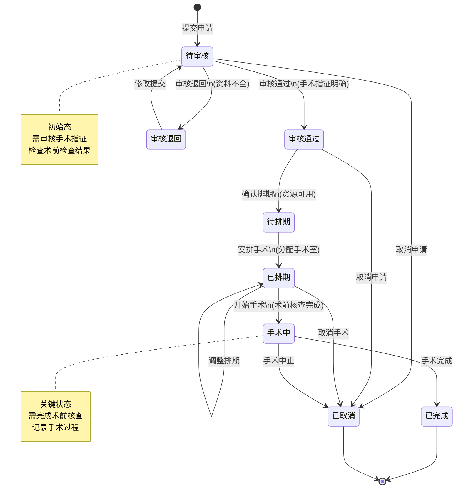
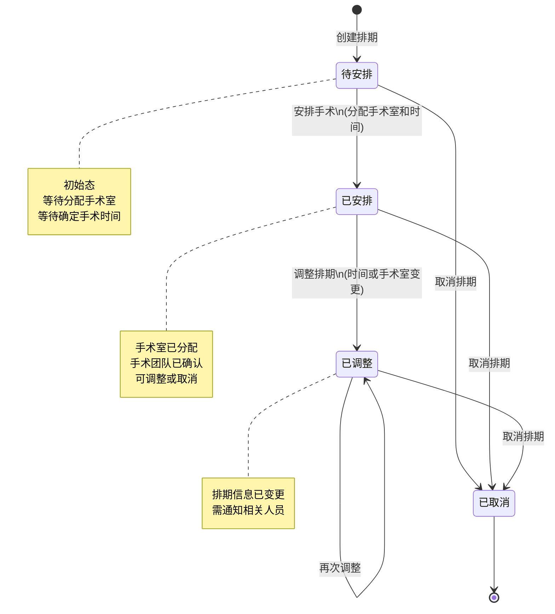
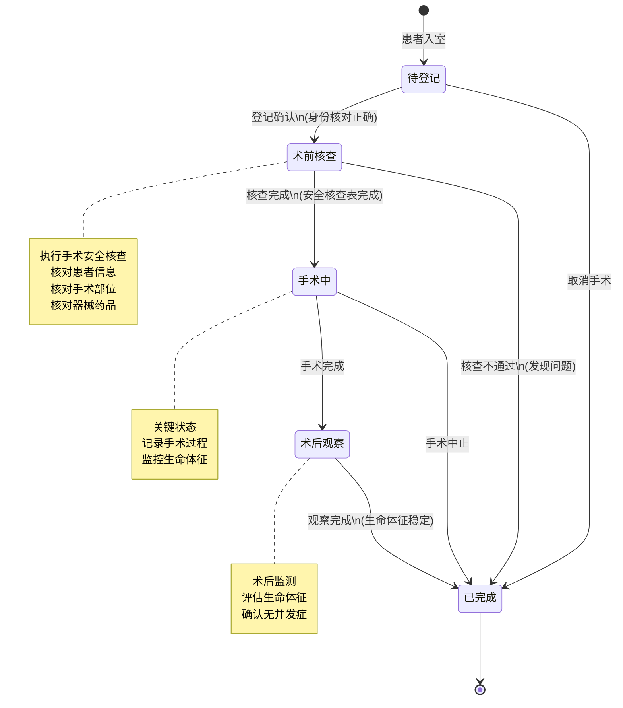
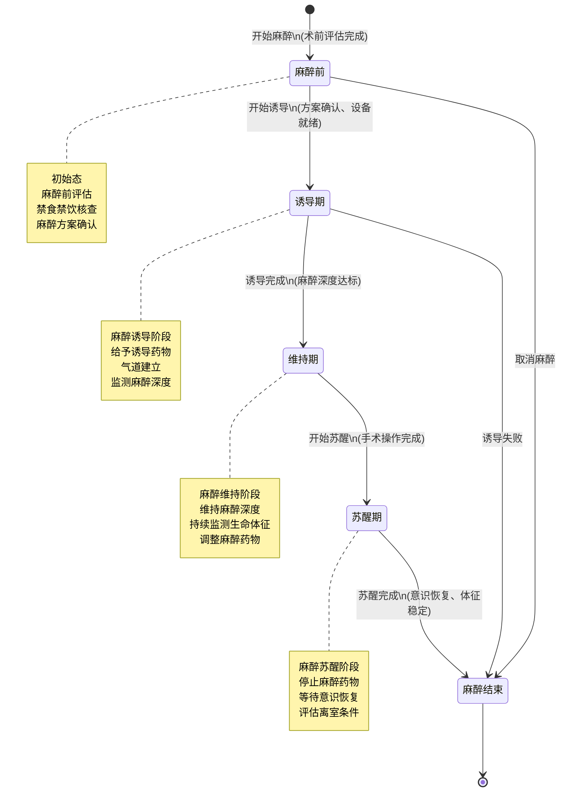
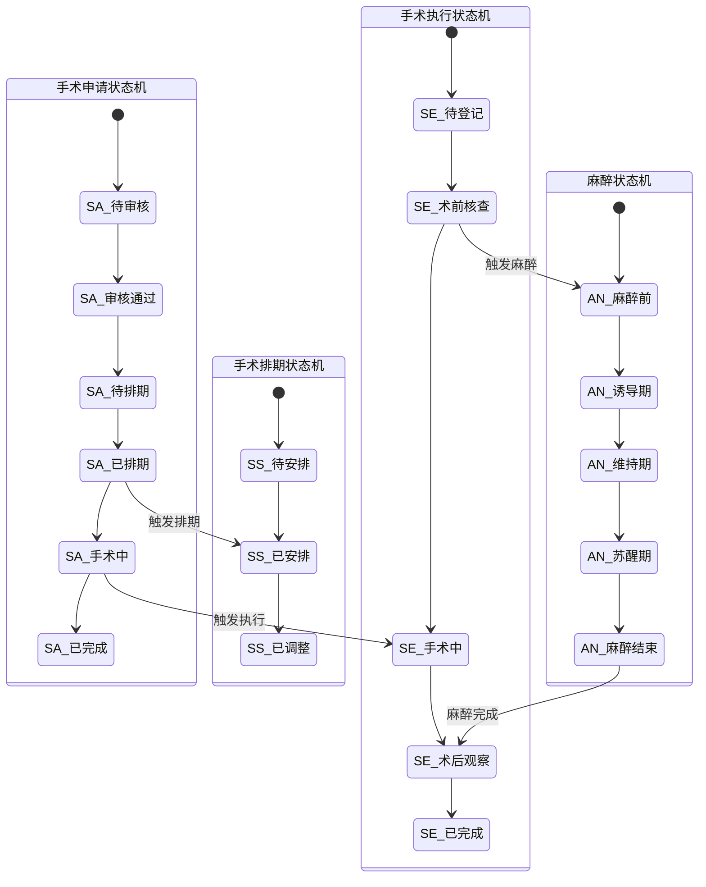

# M07-手术麻醉 - 状态机设计文档

> **文档编号**: YUDAO-HIS-SM-M07
> **版本**: V1.0
> **创建日期**: 2026-06-22
> **状态**: 设计中
> **关联文档**: YUDAO-HIS-SM-001 (全局状态机设计文档)

---

## 1. 概述

本文档定义手术麻醉模块(M07)核心业务对象的状态机设计，包括手术申请状态机、手术排期状态机、手术执行状态机和麻醉状态机。

### 1.1 状态机清单

| 序号 | 状态机编号 | 状态机名称 | 适用对象 | 优先级 | 业务规则 |
|------|------------|----------|----------|--------|----------|
| 1 | SM-007-001 | 手术申请状态机 | surgery_application | P0 | BR-SUR-001 |
| 2 | SM-007-002 | 手术排期状态机 | surgery_schedule | P0 | BR-SUR-002 |
| 3 | SM-007-003 | 手术执行状态机 | surgery_execution | P0 | BR-SUR-003 |
| 4 | SM-007-004 | 麻醉状态机 | anesthesia_record | P0 | BR-ANES-001 |

---

## 2. 手术申请状态机 (SM-007-001)

### 2.1 基本信息

| 属性 | 内容 |
|------|------|
| 状态机编号 | SM-007-001 |
| 状态机名称 | 手术申请状态机 |
| 适用对象 | surgery_application（手术申请表） |
| 状态字段 | application_status |
| 业务规则 | BR-SUR-001: 手术申请状态流转规则 |
| 优先级 | P0（MVP必需） |

### 2.2 状态列表

| 状态编码 | 状态名称 | 状态描述 | 状态类型 | 允许操作 |
|----------|----------|----------|----------|----------|
| 1 | 待审核 | 手术申请已提交，等待审核 | 初始态 | 审核、取消 |
| 2 | 审核通过 | 科室审核通过，等待排期 | 中间态 | 排期、取消 |
| 3 | 审核退回 | 审核不通过，退回修改 | 中间态 | 修改、重新提交 |
| 4 | 待排期 | 已确认手术指征，等待排期 | 中间态 | 安排手术 |
| 5 | 已排期 | 手术已安排时间及手术室 | 中间态 | 调整、执行 |
| 6 | 手术中 | 手术正在进行 | 中间态 | 完成、中止 |
| 7 | 已完成 | 手术已完成 | 终态 | 无 |
| 8 | 已取消 | 手术申请已取消 | 终态 | 无 |

### 2.3 状态流转表

| 当前状态 | 触发事件 | 目标状态 | 前置条件 | 执行操作 | 关联规则 |
|----------|----------|----------|----------|----------|----------|
| - | 提交申请 | 待审核(1) | 患者信息完整、诊断明确 | 创建申请记录、发送审核通知 | BR-SUR-004 |
| 待审核(1) | 审核通过 | 审核通过(2) | 手术指征明确、术前检查完成 | 记录审核意见、通知排期 | BR-SUR-005 |
| 待审核(1) | 审核退回 | 审核退回(3) | 资料不全或手术指征不足 | 记录退回原因、通知医生 | - |
| 待审核(1) | 取消申请 | 已取消(8) | 患者或医生主动取消 | 记录取消原因 | - |
| 审核退回(3) | 修改提交 | 待审核(1) | 修改完成 | 重新进入审核流程 | - |
| 审核通过(2) | 确认排期 | 待排期(4) | 手术室可用、医护团队确认 | 锁定手术资源 | BR-SUR-006 |
| 审核通过(2) | 取消申请 | 已取消(8) | 患者放弃或禁忌症 | 记录取消原因 | - |
| 待排期(4) | 安排手术 | 已排期(5) | 手术室、麻醉师、护士确认 | 分配手术室、通知相关人员 | BR-SUR-007 |
| 已排期(5) | 开始手术 | 手术中(6) | 术前核查完成、患者入室 | 更新开始时间、记录手术团队 | BR-SUR-008 |
| 已排期(5) | 调整排期 | 已排期(5) | 原因合理、审批通过 | 更新排期信息、通知相关人员 | - |
| 已排期(5) | 取消手术 | 已取消(8) | 患者原因或医疗原因 | 释放资源、记录原因 | - |
| 手术中(6) | 手术完成 | 已完成(7) | 手术顺利结束 | 记录手术结果、生成术后医嘱 | BR-SUR-009 |
| 手术中(6) | 手术中止 | 已取消(8) | 紧急情况或患者原因 | 记录中止原因、安排后续处理 | - |

### 2.4 状态流转图



### 2.5 状态约束规则

1. **术前检查要求**: 手术申请必须完成相关术前检查方可审核通过（BR-SUR-005）
2. **手术指征审核**: 所有手术申请必须经过科室主任审核（BR-SUR-004）
3. **资源锁定**: 已排期状态需锁定手术室、麻醉师、护士等资源
4. **取消原因记录**: 所有取消操作必须记录详细原因
5. **急诊通道**: 急诊手术可跳过部分审核流程，但需事后补审

### 2.6 Java枚举定义

```java
/**
 * 手术申请状态枚举
 */
public enum SurgeryApplicationStatusEnum implements StatusEnum {

    PENDING_AUDIT(1, "待审核", "手术申请已提交，等待审核"),
    AUDIT_PASSED(2, "审核通过", "科室审核通过，等待排期"),
    AUDIT_REJECTED(3, "审核退回", "审核不通过，退回修改"),
    PENDING_SCHEDULE(4, "待排期", "已确认手术指征，等待排期"),
    SCHEDULED(5, "已排期", "手术已安排时间及手术室"),
    IN_SURGERY(6, "手术中", "手术正在进行"),
    COMPLETED(7, "已完成", "手术已完成"),
    CANCELLED(8, "已取消", "手术申请已取消");

    private final Integer code;
    private final String name;
    private final String description;

    SurgeryApplicationStatusEnum(Integer code, String name, String description) {
        this.code = code;
        this.name = name;
        this.description = description;
    }

    @Override
    public Integer getCode() {
        return code;
    }

    @Override
    public String getName() {
        return name;
    }

    @Override
    public String getDescription() {
        return description;
    }

    /**
     * 判断是否可以排期
     */
    public boolean canSchedule() {
        return this == AUDIT_PASSED || this == PENDING_SCHEDULE;
    }

    /**
     * 判断是否可以取消
     */
    public boolean canCancel() {
        return this == PENDING_AUDIT || this == AUDIT_PASSED || this == SCHEDULED;
    }

    /**
     * 判断是否为终态
     */
    public boolean isFinal() {
        return this == COMPLETED || this == CANCELLED;
    }
}
```

---

## 3. 手术排期状态机 (SM-007-002)

### 3.1 基本信息

| 属性 | 内容 |
|------|------|
| 状态机编号 | SM-007-002 |
| 状态机名称 | 手术排期状态机 |
| 适用对象 | surgery_schedule（手术排期表） |
| 状态字段 | schedule_status |
| 业务规则 | BR-SUR-002: 手术排期状态流转规则 |
| 优先级 | P0（MVP必需） |

### 3.2 状态列表

| 状态编码 | 状态名称 | 状态描述 | 状态类型 | 允许操作 |
|----------|----------|----------|----------|----------|
| 1 | 待安排 | 手术等待安排时间和手术室 | 初始态 | 安排、取消 |
| 2 | 已安排 | 手术已安排具体时间和手术室 | 中间态 | 调整、取消、执行 |
| 3 | 已调整 | 手术时间或手术室已调整 | 中间态 | 再次调整、取消、执行 |
| 4 | 已取消 | 排期已取消 | 终态 | 无 |

### 3.3 状态流转表

| 当前状态 | 触发事件 | 目标状态 | 前置条件 | 执行操作 | 关联规则 |
|----------|----------|----------|----------|----------|----------|
| - | 创建排期 | 待安排(1) | 手术申请审核通过 | 创建排期记录 | - |
| 待安排(1) | 安排手术 | 已安排(2) | 手术室可用、医护确认 | 分配手术室、时间、通知相关人员 | BR-SUR-010 |
| 待安排(1) | 取消排期 | 已取消(4) | 手术取消 | 记录取消原因 | - |
| 已安排(2) | 调整排期 | 已调整(3) | 原因合理、新时间可用 | 更新排期信息、通知相关人员 | BR-SUR-011 |
| 已安排(2) | 取消排期 | 已取消(4) | 手术取消 | 释放资源、记录原因 | - |
| 已调整(3) | 再次调整 | 已调整(3) | 原因合理、新时间可用 | 更新排期信息、通知相关人员 | - |
| 已调整(3) | 取消排期 | 已取消(4) | 手术取消 | 释放资源、记录原因 | - |

### 3.4 状态流转图



### 3.5 状态约束规则

1. **手术室冲突检查**: 安排手术时需检查手术室时间冲突（BR-SUR-010）
2. **医护团队确认**: 排期需确认主刀医生、麻醉师、护士可用
3. **调整次数限制**: 同一手术排期调整次数不超过3次
4. **提前通知**: 调整排期需提前24小时通知相关人员
5. **资源释放**: 取消排期时自动释放已锁定的资源

### 3.6 Java枚举定义

```java
/**
 * 手术排期状态枚举
 */
public enum SurgeryScheduleStatusEnum implements StatusEnum {

    PENDING_ARRANGE(1, "待安排", "手术等待安排时间和手术室"),
    ARRANGED(2, "已安排", "手术已安排具体时间和手术室"),
    ADJUSTED(3, "已调整", "手术时间或手术室已调整"),
    CANCELLED(4, "已取消", "排期已取消");

    private final Integer code;
    private final String name;
    private final String description;

    SurgeryScheduleStatusEnum(Integer code, String name, String description) {
        this.code = code;
        this.name = name;
        this.description = description;
    }

    @Override
    public Integer getCode() {
        return code;
    }

    @Override
    public String getName() {
        return name;
    }

    @Override
    public String getDescription() {
        return description;
    }

    /**
     * 判断是否可以调整
     */
    public boolean canAdjust() {
        return this == ARRANGED || this == ADJUSTED;
    }

    /**
     * 判断是否可以取消
     */
    public boolean canCancel() {
        return this == PENDING_ARRANGE || this == ARRANGED || this == ADJUSTED;
    }

    /**
     * 判断是否为终态
     */
    public boolean isFinal() {
        return this == CANCELLED;
    }
}
```

---

## 4. 手术执行状态机 (SM-007-003)

### 4.1 基本信息

| 属性 | 内容 |
|------|------|
| 状态机编号 | SM-007-003 |
| 状态机名称 | 手术执行状态机 |
| 适用对象 | surgery_execution（手术执行记录表） |
| 状态字段 | execution_status |
| 业务规则 | BR-SUR-003: 手术执行状态流转规则 |
| 优先级 | P0（MVP必需） |

### 4.2 状态列表

| 状态编码 | 状态名称 | 状态描述 | 状态类型 | 允许操作 |
|----------|----------|----------|----------|----------|
| 1 | 待登记 | 患者到达手术室，等待登记 | 初始态 | 登记、取消 |
| 2 | 术前核查 | 进行术前安全核查 | 中间态 | 核查完成、中止 |
| 3 | 手术中 | 手术正在进行 | 中间态 | 完成、中止 |
| 4 | 术后观察 | 手术完成，术后观察中 | 中间态 | 观察完成 |
| 5 | 已完成 | 手术全流程完成 | 终态 | 无 |

### 4.3 状态流转表

| 当前状态 | 触发事件 | 目标状态 | 前置条件 | 执行操作 | 关联规则 |
|----------|----------|----------|----------|----------|----------|
| - | 患者入室 | 待登记(1) | 患者到达手术室 | 记录入室时间 | - |
| 待登记(1) | 登记确认 | 术前核查(2) | 患者身份核对正确 | 记录登记信息、启动核查流程 | BR-SUR-012 |
| 待登记(1) | 取消手术 | 已完成(5) | 紧急情况 | 记录取消原因 | - |
| 术前核查(2) | 核查完成 | 手术中(3) | 手术安全核查表完成 | 记录核查结果、通知手术团队 | BR-SUR-013 |
| 术前核查(2) | 核查不通过 | 已完成(5) | 发现禁忌或问题 | 记录问题、中止手术 | - |
| 手术中(3) | 手术完成 | 术后观察(4) | 手术操作完成 | 记录手术结果、启动观察 | BR-SUR-014 |
| 手术中(3) | 手术中止 | 已完成(5) | 紧急情况 | 记录中止原因、安排后续 | - |
| 术后观察(4) | 观察完成 | 已完成(5) | 生命体征稳定 | 记录观察结果、生成术后医嘱 | BR-SUR-015 |

### 4.4 状态流转图



### 4.5 状态约束规则

1. **手术安全核查**: 必须完成WHO手术安全核查表方可进入手术中状态（BR-SUR-013）
2. **身份核对**: 登记时必须核对患者身份、手术部位、手术方式
3. **生命体征监控**: 手术中及术后观察需持续监控生命体征
4. **术后医嘱**: 完成后自动生成术后医嘱和护理计划
5. **时间记录**: 各状态转换需准确记录时间节点

### 4.6 Java枚举定义

```java
/**
 * 手术执行状态枚举
 */
public enum SurgeryExecutionStatusEnum implements StatusEnum {

    PENDING_REGISTER(1, "待登记", "患者到达手术室，等待登记"),
    PRE_OP_CHECK(2, "术前核查", "进行术前安全核查"),
    IN_SURGERY(3, "手术中", "手术正在进行"),
    POST_OP_OBSERVATION(4, "术后观察", "手术完成，术后观察中"),
    COMPLETED(5, "已完成", "手术全流程完成");

    private final Integer code;
    private final String name;
    private final String description;

    SurgeryExecutionStatusEnum(Integer code, String name, String description) {
        this.code = code;
        this.name = name;
        this.description = description;
    }

    @Override
    public Integer getCode() {
        return code;
    }

    @Override
    public String getName() {
        return name;
    }

    @Override
    public String getDescription() {
        return description;
    }

    /**
     * 判断是否可以中止
     */
    public boolean canAbort() {
        return this == PENDING_REGISTER || this == PRE_OP_CHECK || this == IN_SURGERY;
    }

    /**
     * 判断是否为终态
     */
    public boolean isFinal() {
        return this == COMPLETED;
    }
}
```

---

## 5. 麻醉状态机 (SM-007-004)

### 5.1 基本信息

| 属性 | 内容 |
|------|------|
| 状态机编号 | SM-007-004 |
| 状态机名称 | 麻醉状态机 |
| 适用对象 | anesthesia_record（麻醉记录表） |
| 状态字段 | anesthesia_status |
| 业务规则 | BR-ANES-001: 麻醉状态流转规则 |
| 优先级 | P0（MVP必需） |

### 5.2 状态列表

| 状态编码 | 状态名称 | 状态描述 | 状态类型 | 允许操作 |
|----------|----------|----------|----------|----------|
| 1 | 麻醉前 | 麻醉准备阶段 | 初始态 | 麻醉诱导、取消 |
| 2 | 诱导期 | 麻醉诱导进行中 | 中间态 | 进入维持、中止 |
| 3 | 维持期 | 麻醉维持阶段 | 中间态 | 进入苏醒 |
| 4 | 苏醒期 | 麻醉苏醒阶段 | 中间态 | 苏醒完成 |
| 5 | 麻醉结束 | 麻醉全流程完成 | 终态 | 无 |

### 5.3 状态流转表

| 当前状态 | 触发事件 | 目标状态 | 前置条件 | 执行操作 | 关联规则 |
|----------|----------|----------|----------|----------|----------|
| - | 开始麻醉 | 麻醉前(1) | 手术开始前 | 创建麻醉记录、评估患者 | BR-ANES-002 |
| 麻醉前(1) | 开始诱导 | 诱导期(2) | 麻醉方案确认、设备准备完成 | 记录诱导开始时间、用药 | BR-ANES-003 |
| 麻醉前(1) | 取消麻醉 | 麻醉结束(5) | 手术取消 | 记录取消原因 | - |
| 诱导期(2) | 诱导完成 | 维持期(3) | 麻醉深度达标 | 记录诱导结束、开始维持 | BR-ANES-004 |
| 诱导期(2) | 诱导失败 | 麻醉结束(5) | 诱导不成功 | 记录失败原因、紧急处理 | - |
| 维持期(3) | 开始苏醒 | 苏醒期(4) | 手术操作完成 | 记录维持结束、开始苏醒 | BR-ANES-005 |
| 苏醒期(4) | 苏醒完成 | 麻醉结束(5) | 患者意识恢复、生命体征稳定 | 记录苏醒结果、评估离室条件 | BR-ANES-006 |

### 5.4 状态流转图



### 5.5 状态约束规则

1. **麻醉前评估**: 必须完成麻醉前评估方可开始诱导（BR-ANES-002）
2. **禁食禁饮核查**: 麻醉前必须核查患者禁食禁饮时间
3. **麻醉深度监测**: 诱导期和维持期需持续监测麻醉深度
4. **生命体征监测**: 全程监测并记录生命体征
5. **离室评估**: 苏醒完成后需评估Steward评分方可离室（BR-ANES-006）
6. **麻醉记录**: 所有用药、操作、生命体征需完整记录

### 5.6 Java枚举定义

```java
/**
 * 麻醉状态枚举
 */
public enum AnesthesiaStatusEnum implements StatusEnum {

    PRE_ANESTHESIA(1, "麻醉前", "麻醉准备阶段"),
    INDUCTION(2, "诱导期", "麻醉诱导进行中"),
    MAINTENANCE(3, "维持期", "麻醉维持阶段"),
    EMERGENCE(4, "苏醒期", "麻醉苏醒阶段"),
    COMPLETED(5, "麻醉结束", "麻醉全流程完成");

    private final Integer code;
    private final String name;
    private final String description;

    AnesthesiaStatusEnum(Integer code, String name, String description) {
        this.code = code;
        this.name = name;
        this.description = description;
    }

    @Override
    public Integer getCode() {
        return code;
    }

    @Override
    public String getName() {
        return name;
    }

    @Override
    public String getDescription() {
        return description;
    }

    /**
     * 判断是否可以中止
     */
    public boolean canAbort() {
        return this == PRE_ANESTHESIA || this == INDUCTION;
    }

    /**
     * 判断是否需要监测
     */
    public boolean needsMonitoring() {
        return this == INDUCTION || this == MAINTENANCE || this == EMERGENCE;
    }

    /**
     * 判断是否为终态
     */
    public boolean isFinal() {
        return this == COMPLETED;
    }
}
```

---

## 6. 状态机关联关系

### 6.1 状态机协同关系图



### 6.2 状态协同规则

| 触发场景 | 源状态机 | 源状态 | 目标状态机 | 目标状态 | 协同规则 |
|----------|----------|--------|----------|----------|----------|
| 手术排期 | 手术申请 | 已排期 | 手术排期 | 已安排 | 排期信息同步 |
| 开始手术 | 手术申请 | 手术中 | 手术执行 | 待登记 | 执行记录创建 |
| 术前核查完成 | 手术执行 | 手术中 | 麻醉 | 麻醉前 | 麻醉流程启动 |
| 麻醉完成 | 麻醉 | 麻醉结束 | 手术执行 | 术后观察 | 触发术后观察 |
| 手术完成 | 手术执行 | 已完成 | 手术申请 | 已完成 | 状态同步完成 |

---

## 附录A: 业务规则索引

| 规则编号 | 规则名称 | 适用状态机 | 规则描述 |
|----------|----------|----------|----------|
| BR-SUR-001 | 手术申请状态流转规则 | SM-007-001 | 定义手术申请各状态间的流转条件 |
| BR-SUR-002 | 手术排期状态流转规则 | SM-007-002 | 定义手术排期各状态间的流转条件 |
| BR-SUR-003 | 手术执行状态流转规则 | SM-007-003 | 定义手术执行各状态间的流转条件 |
| BR-ANES-001 | 麻醉状态流转规则 | SM-007-004 | 定义麻醉各状态间的流转条件 |
| BR-SUR-004 | 手术申请提交规则 | SM-007-001 | 手术申请需患者信息完整、诊断明确 |
| BR-SUR-005 | 手术审核规则 | SM-007-001 | 需手术指征明确、术前检查完成 |
| BR-SUR-006 | 手术资源锁定规则 | SM-007-001 | 确认排期时锁定手术资源 |
| BR-SUR-007 | 手术安排规则 | SM-007-001 | 分配手术室需确认医护团队可用 |
| BR-SUR-008 | 手术开始规则 | SM-007-001 | 需术前核查完成、患者入室 |
| BR-SUR-009 | 手术完成规则 | SM-007-001 | 完成后生成术后医嘱 |
| BR-SUR-010 | 手术室冲突检查 | SM-007-002 | 安排时检查手术室时间冲突 |
| BR-SUR-011 | 排期调整规则 | SM-007-002 | 调整需提前24小时通知 |
| BR-SUR-012 | 患者登记规则 | SM-007-003 | 需核对患者身份正确 |
| BR-SUR-013 | 术前核查规则 | SM-007-003 | 需完成WHO手术安全核查表 |
| BR-SUR-014 | 手术完成规则 | SM-007-003 | 完成后启动术后观察 |
| BR-SUR-015 | 术后观察规则 | SM-007-003 | 需生命体征稳定方可完成 |
| BR-ANES-002 | 麻醉前评估规则 | SM-007-004 | 需完成麻醉前评估 |
| BR-ANES-003 | 麻醉诱导规则 | SM-007-004 | 需方案确认、设备准备完成 |
| BR-ANES-004 | 麻醉维持规则 | SM-007-004 | 需麻醉深度达标 |
| BR-ANES-005 | 麻醉苏醒规则 | SM-007-004 | 需手术操作完成 |
| BR-ANES-006 | 离室评估规则 | SM-007-004 | 需评估Steward评分 |

---

## 附录B: 变更历史

| 版本 | 日期 | 变更内容 | 变更人 |
|------|------|----------|--------|
| V1.0 | 2026-06-22 | 初始创建，定义手术麻醉模块状态机 | YUDAO-AI-HIS架构组 |

---

> **最后更新**: 2026-06-22
