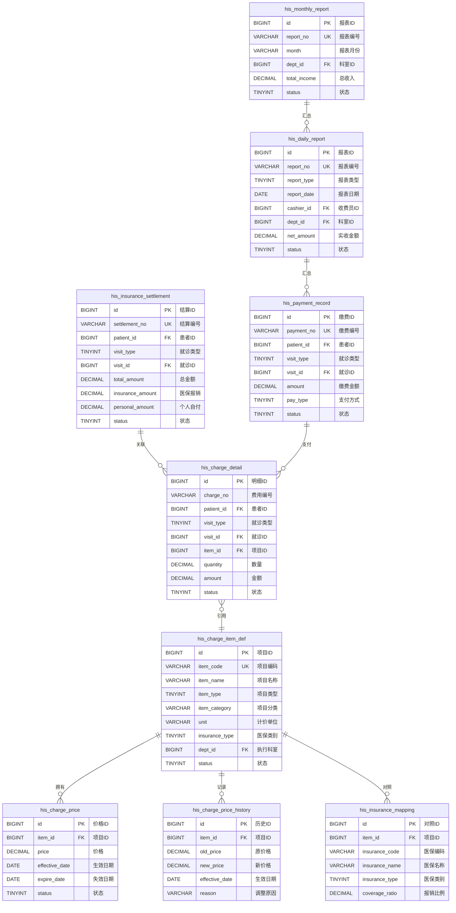
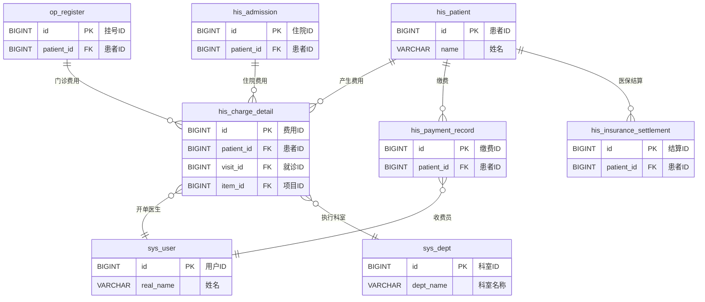

# M08 财务管理子系统 - 数据库设计文档

> **文档编号**: YUDAO-HIS-DB-M08
> **版本**: V1.0
> **创建日期**: 2026-06-22
> **所属系统**: YUDAO-AI-HIS智慧医疗信息系统
> **参考文档**: YUDAO-HIS-PRD-M08, YUDAO-HIS-DB-001
> **状态**: 设计中

---

## 1. 设计概述

### 1.1 模块定位

财务管理子系统是YUDAO-AI-HIS的核心支撑模块之一，覆盖全院费用管理：收费项目维护、价格管理、医保结算对接、费用记账、财务报表生成。本数据库设计支撑门诊和住院的费用结算、医保实时结算对接、财务日结月结和收入统计报表等功能。

### 1.2 设计原则

| 原则 | 说明 |
|------|------|
| 规范化 | 遵循数据库第三范式(3NF)，减少数据冗余 |
| 扩展性 | 支持分表策略，适应大数据量场景 |
| 安全性 | 财务敏感数据加密存储，审计日志完整记录 |
| 性能优化 | 合理设计索引，优化查询性能 |
| 框架兼容 | 使用ruoyi-vue-pro框架通用字段规范 |

### 1.3 表清单概览

| 序号 | 表名 | 中文名 | 说明 |
|------|------|--------|------|
| 1 | his_charge_item_def | 收费项目定义表 | 全院收费项目主数据 |
| 2 | his_charge_price | 收费价格表 | 项目价格信息 |
| 3 | his_charge_price_history | 价格历史表 | 价格变更历史记录 |
| 4 | his_insurance_mapping | 医保目录对照表 | 本院项目与医保目录对照 |
| 5 | his_insurance_settlement | 医保结算记录表 | 医保结算流水记录 |
| 6 | his_charge_detail | 费用明细表 | 患者费用明细记录 |
| 7 | his_payment_record | 缴费记录表 | 患者缴费流水记录 |
| 8 | his_daily_report | 日结报表 | 收费员/科室日结汇总 |
| 9 | his_monthly_report | 月结报表 | 月度收入汇总报表 |

---

## 2. ER图设计

### 2.1 财务管理域 ER图



### 2.2 与其他模块关系 ER图



---

## 3. DDL脚本设计

### 3.1 收费项目定义表 (his_charge_item_def)

```sql
-- =============================================
-- 收费项目定义表
-- 说明: 全院收费项目主数据，涵盖诊疗类、药品类、材料类、服务类等
-- 年增量估算: 约5000条
-- =============================================
CREATE TABLE `his_charge_item_def` (
    `id` BIGINT NOT NULL AUTO_INCREMENT COMMENT '项目ID',
    `item_code` VARCHAR(30) NOT NULL COMMENT '项目编码',
    `item_name` VARCHAR(100) NOT NULL COMMENT '项目名称',
    `item_pinyin` VARCHAR(50) COMMENT '拼音码',
    `item_type` TINYINT NOT NULL COMMENT '项目类型: 1诊疗类/2药品类/3检查类/4服务类/5材料类',
    `item_category` VARCHAR(50) COMMENT '项目分类',
    `item_category_code` VARCHAR(30) COMMENT '分类编码',
    `unit` VARCHAR(20) NOT NULL COMMENT '计价单位',
    `unit_code` VARCHAR(20) COMMENT '单位编码',
    `price` DECIMAL(10,2) NOT NULL DEFAULT 0.00 COMMENT '当前价格',
    `price_type` TINYINT DEFAULT 1 COMMENT '计价方式: 1按次/2按量/3按天/4按时',
    `insurance_type` TINYINT NOT NULL DEFAULT 4 COMMENT '医保类别: 1甲类/2乙类/3丙类/4自费',
    `insurance_code` VARCHAR(50) COMMENT '医保编码',
    `coverage_ratio` DECIMAL(5,2) COMMENT '医保报销比例(乙类)',
    `self_pay_ratio` DECIMAL(5,2) COMMENT '个人自付比例(乙类)',
    `dept_id` BIGINT COMMENT '执行科室ID',
    `dept_name` VARCHAR(100) COMMENT '执行科室名称',
    `is_discount` TINYINT DEFAULT 1 COMMENT '是否允许折扣: 0否/1是',
    `is_refund` TINYINT DEFAULT 1 COMMENT '是否允许退费: 0否/1是',
    `is_stats` TINYINT DEFAULT 1 COMMENT '是否参与统计: 0否/1是',
    `remark` VARCHAR(500) COMMENT '备注',
    `sort` INT DEFAULT 0 COMMENT '排序',
    `status` TINYINT NOT NULL DEFAULT 1 COMMENT '状态: 0停用/1启用',
    `creator` VARCHAR(64) DEFAULT '' COMMENT '创建者',
    `create_time` DATETIME NOT NULL DEFAULT CURRENT_TIMESTAMP COMMENT '创建时间',
    `updater` VARCHAR(64) DEFAULT '' COMMENT '更新者',
    `update_time` DATETIME NOT NULL DEFAULT CURRENT_TIMESTAMP ON UPDATE CURRENT_TIMESTAMP COMMENT '更新时间',
    `deleted` BIT(1) NOT NULL DEFAULT b'0' COMMENT '是否删除',
    `tenant_id` BIGINT NOT NULL DEFAULT 0 COMMENT '租户编号',
    PRIMARY KEY (`id`),
    UNIQUE KEY `uk_item_code` (`item_code`),
    KEY `idx_item_name` (`item_name`),
    KEY `idx_item_pinyin` (`item_pinyin`),
    KEY `idx_item_type` (`item_type`),
    KEY `idx_item_category` (`item_category`),
    KEY `idx_insurance_type` (`insurance_type`),
    KEY `idx_dept_id` (`dept_id`),
    KEY `idx_status` (`status`)
) ENGINE=InnoDB DEFAULT CHARSET=utf8mb4 COLLATE=utf8mb4_unicode_ci COMMENT='收费项目定义表';
```

### 3.2 收费价格表 (his_charge_price)

```sql
-- =============================================
-- 收费价格表
-- 说明: 收费项目价格信息，支持不同时段、不同类型的价格设置
-- =============================================
CREATE TABLE `his_charge_price` (
    `id` BIGINT NOT NULL AUTO_INCREMENT COMMENT '价格ID',
    `item_id` BIGINT NOT NULL COMMENT '项目ID',
    `item_code` VARCHAR(30) NOT NULL COMMENT '项目编码',
    `item_name` VARCHAR(100) NOT NULL COMMENT '项目名称',
    `price_type` TINYINT DEFAULT 1 COMMENT '价格类型: 1标准价/2优惠价/3会员价',
    `price` DECIMAL(10,2) NOT NULL COMMENT '价格',
    `original_price` DECIMAL(10,2) COMMENT '原价',
    `discount_rate` DECIMAL(5,2) DEFAULT 100.00 COMMENT '折扣率(%)',
    `effective_date` DATE NOT NULL COMMENT '生效日期',
    `expire_date` DATE COMMENT '失效日期',
    `price_source` TINYINT DEFAULT 1 COMMENT '价格来源: 1系统定价/2物价局定价/3医院自主',
    `approve_status` TINYINT DEFAULT 1 COMMENT '审批状态: 0待审批/1已通过/2已驳回',
    `approve_time` DATETIME COMMENT '审批时间',
    `approve_by` VARCHAR(50) COMMENT '审批人',
    `remark` VARCHAR(500) COMMENT '备注',
    `status` TINYINT NOT NULL DEFAULT 1 COMMENT '状态: 0无效/1有效',
    `creator` VARCHAR(64) DEFAULT '' COMMENT '创建者',
    `create_time` DATETIME NOT NULL DEFAULT CURRENT_TIMESTAMP COMMENT '创建时间',
    `updater` VARCHAR(64) DEFAULT '' COMMENT '更新者',
    `update_time` DATETIME NOT NULL DEFAULT CURRENT_TIMESTAMP ON UPDATE CURRENT_TIMESTAMP COMMENT '更新时间',
    `deleted` BIT(1) NOT NULL DEFAULT b'0' COMMENT '是否删除',
    `tenant_id` BIGINT NOT NULL DEFAULT 0 COMMENT '租户编号',
    PRIMARY KEY (`id`),
    KEY `idx_price_item` (`item_id`),
    KEY `idx_price_item_code` (`item_code`),
    KEY `idx_price_effective` (`effective_date`),
    KEY `idx_price_expire` (`expire_date`),
    KEY `idx_price_status` (`status`)
) ENGINE=InnoDB DEFAULT CHARSET=utf8mb4 COLLATE=utf8mb4_unicode_ci COMMENT='收费价格表';
```

### 3.3 价格历史表 (his_charge_price_history)

```sql
-- =============================================
-- 价格历史表
-- 说明: 记录收费项目价格变更历史，支持价格追溯
-- 年增量估算: 约10000条
-- =============================================
CREATE TABLE `his_charge_price_history` (
    `id` BIGINT NOT NULL AUTO_INCREMENT COMMENT '历史ID',
    `item_id` BIGINT NOT NULL COMMENT '项目ID',
    `item_code` VARCHAR(30) NOT NULL COMMENT '项目编码',
    `item_name` VARCHAR(100) NOT NULL COMMENT '项目名称',
    `old_price` DECIMAL(10,2) NOT NULL COMMENT '原价格',
    `new_price` DECIMAL(10,2) NOT NULL COMMENT '新价格',
    `price_change` DECIMAL(10,2) COMMENT '价格变动额',
    `change_rate` DECIMAL(5,2) COMMENT '变动比例(%)',
    `effective_date` DATE NOT NULL COMMENT '生效日期',
    `change_type` TINYINT NOT NULL COMMENT '变更类型: 1调价/2新增/3停用',
    `reason` VARCHAR(500) NOT NULL COMMENT '调整原因',
    `approve_status` TINYINT DEFAULT 1 COMMENT '审批状态: 0待审批/1已通过/2已驳回',
    `approve_time` DATETIME COMMENT '审批时间',
    `approve_by` VARCHAR(50) COMMENT '审批人',
    `approve_opinion` VARCHAR(500) COMMENT '审批意见',
    `remark` VARCHAR(500) COMMENT '备注',
    `creator` VARCHAR(64) DEFAULT '' COMMENT '创建者',
    `create_time` DATETIME NOT NULL DEFAULT CURRENT_TIMESTAMP COMMENT '创建时间',
    `updater` VARCHAR(64) DEFAULT '' COMMENT '更新者',
    `update_time` DATETIME NOT NULL DEFAULT CURRENT_TIMESTAMP ON UPDATE CURRENT_TIMESTAMP COMMENT '更新时间',
    `deleted` BIT(1) NOT NULL DEFAULT b'0' COMMENT '是否删除',
    `tenant_id` BIGINT NOT NULL DEFAULT 0 COMMENT '租户编号',
    PRIMARY KEY (`id`),
    KEY `idx_price_history_item` (`item_id`),
    KEY `idx_price_history_item_code` (`item_code`),
    KEY `idx_price_history_effective` (`effective_date`),
    KEY `idx_price_history_create_time` (`create_time`)
) ENGINE=InnoDB DEFAULT CHARSET=utf8mb4 COLLATE=utf8mb4_unicode_ci COMMENT='价格历史表';
```

### 3.4 医保目录对照表 (his_insurance_mapping)

```sql
-- =============================================
-- 医保目录对照表
-- 说明: 本院收费项目与医保目录的对照关系，甲乙丙类分类
-- 年增量估算: 约8000条
-- =============================================
CREATE TABLE `his_insurance_mapping` (
    `id` BIGINT NOT NULL AUTO_INCREMENT COMMENT '对照ID',
    `item_id` BIGINT NOT NULL COMMENT '项目ID',
    `item_code` VARCHAR(30) NOT NULL COMMENT '项目编码',
    `item_name` VARCHAR(100) NOT NULL COMMENT '项目名称',
    `insurance_code` VARCHAR(50) NOT NULL COMMENT '医保编码',
    `insurance_name` VARCHAR(100) NOT NULL COMMENT '医保名称',
    `insurance_type` TINYINT NOT NULL COMMENT '医保类别: 1甲类/2乙类/3丙类/4自费',
    `insurance_category` VARCHAR(50) COMMENT '医保分类',
    `coverage_ratio` DECIMAL(5,2) DEFAULT 100.00 COMMENT '医保报销比例(%)',
    `self_pay_ratio` DECIMAL(5,2) DEFAULT 0.00 COMMENT '个人自付比例(%)',
    `price_limit` DECIMAL(10,2) COMMENT '医保限价',
    `is_limit_price` TINYINT DEFAULT 0 COMMENT '是否限价: 0否/1是',
    `limit_rule` VARCHAR(500) COMMENT '限价规则',
    `valid_start` DATE COMMENT '有效期开始',
    `valid_end` DATE COMMENT '有效期结束',
    `mapping_status` TINYINT DEFAULT 1 COMMENT '对照状态: 0未对照/1已对照/2待确认',
    `remark` VARCHAR(500) COMMENT '备注',
    `status` TINYINT NOT NULL DEFAULT 1 COMMENT '状态: 0无效/1有效',
    `creator` VARCHAR(64) DEFAULT '' COMMENT '创建者',
    `create_time` DATETIME NOT NULL DEFAULT CURRENT_TIMESTAMP COMMENT '创建时间',
    `updater` VARCHAR(64) DEFAULT '' COMMENT '更新者',
    `update_time` DATETIME NOT NULL DEFAULT CURRENT_TIMESTAMP ON UPDATE CURRENT_TIMESTAMP COMMENT '更新时间',
    `deleted` BIT(1) NOT NULL DEFAULT b'0' COMMENT '是否删除',
    `tenant_id` BIGINT NOT NULL DEFAULT 0 COMMENT '租户编号',
    PRIMARY KEY (`id`),
    UNIQUE KEY `uk_insurance_mapping` (`item_id`),
    KEY `idx_mapping_item_code` (`item_code`),
    KEY `idx_mapping_insurance_code` (`insurance_code`),
    KEY `idx_mapping_insurance_type` (`insurance_type`),
    KEY `idx_mapping_status` (`status`)
) ENGINE=InnoDB DEFAULT CHARSET=utf8mb4 COLLATE=utf8mb4_unicode_ci COMMENT='医保目录对照表';
```

### 3.5 医保结算记录表 (his_insurance_settlement)

```sql
-- =============================================
-- 医保结算记录表
-- 说明: 医保结算流水记录，包含预结算和正式结算
-- 对应FHIR资源: Claim
-- 年增量估算: 约100万条
-- 分表策略: 按年分表
-- =============================================
CREATE TABLE `his_insurance_settlement` (
    `id` BIGINT NOT NULL AUTO_INCREMENT COMMENT '结算ID',
    `settlement_no` VARCHAR(30) NOT NULL COMMENT '结算编号',
    `patient_id` BIGINT NOT NULL COMMENT '患者ID',
    `patient_name` VARCHAR(50) NOT NULL COMMENT '患者姓名',
    `insurance_type` VARCHAR(30) NOT NULL COMMENT '医保类型: 城镇职工医保/城镇居民医保/新农合',
    `insurance_card_no` VARCHAR(30) NOT NULL COMMENT '医保卡号',
    `visit_type` TINYINT NOT NULL COMMENT '就诊类型: 1门诊/2住院',
    `visit_id` BIGINT NOT NULL COMMENT '就诊ID(挂号ID/住院ID)',
    `visit_no` VARCHAR(30) COMMENT '就诊编号',
    `total_amount` DECIMAL(12,2) NOT NULL COMMENT '总金额',
    `insurance_amount` DECIMAL(12,2) NOT NULL DEFAULT 0.00 COMMENT '医保报销金额',
    `personal_amount` DECIMAL(12,2) NOT NULL DEFAULT 0.00 COMMENT '个人自付金额',
    `deductible` DECIMAL(10,2) DEFAULT 0.00 COMMENT '起付线金额',
    `copay_amount` DECIMAL(10,2) DEFAULT 0.00 COMMENT '共付段金额',
    `selfpay_amount` DECIMAL(10,2) DEFAULT 0.00 COMMENT '自费段金额',
    `year_total` DECIMAL(12,2) COMMENT '本年累计金额',
    `year_remain` DECIMAL(12,2) COMMENT '年度剩余额度',
    `settlement_type` TINYINT DEFAULT 1 COMMENT '结算类型: 1预结算/2正式结算',
    `settlement_time` DATETIME NOT NULL COMMENT '结算时间',
    `settlement_status` TINYINT NOT NULL DEFAULT 1 COMMENT '状态: 1待结算/2已结算/3已撤销',
    `insurance_serial` VARCHAR(50) COMMENT '医保流水号',
    `insurance_response` TEXT COMMENT '医保返回信息(JSON)',
    `cancel_time` DATETIME COMMENT '撤销时间',
    `cancel_reason` VARCHAR(200) COMMENT '撤销原因',
    `cancel_by` VARCHAR(50) COMMENT '撤销人',
    `cashier_id` BIGINT COMMENT '收费员ID',
    `cashier_name` VARCHAR(50) COMMENT '收费员姓名',
    `remark` VARCHAR(500) COMMENT '备注',
    `creator` VARCHAR(64) DEFAULT '' COMMENT '创建者',
    `create_time` DATETIME NOT NULL DEFAULT CURRENT_TIMESTAMP COMMENT '创建时间',
    `updater` VARCHAR(64) DEFAULT '' COMMENT '更新者',
    `update_time` DATETIME NOT NULL DEFAULT CURRENT_TIMESTAMP ON UPDATE CURRENT_TIMESTAMP COMMENT '更新时间',
    `deleted` BIT(1) NOT NULL DEFAULT b'0' COMMENT '是否删除',
    `tenant_id` BIGINT NOT NULL DEFAULT 0 COMMENT '租户编号',
    PRIMARY KEY (`id`),
    UNIQUE KEY `uk_settlement_no` (`settlement_no`),
    KEY `idx_settlement_patient` (`patient_id`),
    KEY `idx_settlement_visit` (`visit_type`, `visit_id`),
    KEY `idx_settlement_card` (`insurance_card_no`),
    KEY `idx_settlement_time` (`settlement_time`),
    KEY `idx_settlement_status` (`settlement_status`),
    KEY `idx_settlement_serial` (`insurance_serial`),
    KEY `idx_settlement_year` (YEAR(`create_time`))
) ENGINE=InnoDB DEFAULT CHARSET=utf8mb4 COLLATE=utf8mb4_unicode_ci COMMENT='医保结算记录表';
```

### 3.6 费用明细表 (his_charge_detail)

```sql
-- =============================================
-- 费用明细表
-- 说明: 患者费用明细记录，门诊和住院费用统一管理
-- 对应FHIR资源: ChargeItem
-- 年增量估算: 约3000万条
-- 分表策略: 按年分表
-- =============================================
CREATE TABLE `his_charge_detail` (
    `id` BIGINT NOT NULL AUTO_INCREMENT COMMENT '明细ID',
    `charge_no` VARCHAR(30) NOT NULL COMMENT '费用编号',
    `patient_id` BIGINT NOT NULL COMMENT '患者ID',
    `patient_name` VARCHAR(50) NOT NULL COMMENT '患者姓名',
    `visit_type` TINYINT NOT NULL COMMENT '就诊类型: 1门诊/2住院',
    `visit_id` BIGINT NOT NULL COMMENT '就诊ID(挂号ID/住院ID)',
    `visit_no` VARCHAR(30) COMMENT '就诊编号',
    `order_id` BIGINT COMMENT '医嘱ID',
    `order_no` VARCHAR(30) COMMENT '医嘱编号',
    `charge_date` DATE NOT NULL COMMENT '费用日期',
    `charge_time` DATETIME NOT NULL COMMENT '费用时间',
    `item_id` BIGINT NOT NULL COMMENT '收费项目ID',
    `item_code` VARCHAR(50) NOT NULL COMMENT '项目编码',
    `item_name` VARCHAR(100) NOT NULL COMMENT '项目名称',
    `item_type` TINYINT NOT NULL COMMENT '项目类型: 1诊疗/2药品/3检查/4检验/5治疗/6护理/7床位/8材料/9服务/10其他',
    `item_category` VARCHAR(50) COMMENT '项目分类',
    `spec` VARCHAR(50) COMMENT '规格',
    `unit` VARCHAR(20) COMMENT '单位',
    `quantity` DECIMAL(10,2) NOT NULL COMMENT '数量',
    `unit_price` DECIMAL(10,2) NOT NULL COMMENT '单价',
    `amount` DECIMAL(12,2) NOT NULL COMMENT '金额',
    `discount_rate` DECIMAL(5,2) DEFAULT 100.00 COMMENT '折扣率(%)',
    `discount_amount` DECIMAL(10,2) DEFAULT 0.00 COMMENT '折扣金额',
    `pay_amount` DECIMAL(12,2) NOT NULL COMMENT '应付金额',
    `insurance_type` TINYINT NOT NULL DEFAULT 4 COMMENT '医保类别: 1甲类/2乙类/3丙类/4自费',
    `insurance_amount` DECIMAL(10,2) DEFAULT 0.00 COMMENT '医保支付金额',
    `personal_amount` DECIMAL(10,2) NOT NULL COMMENT '个人支付金额',
    `dept_id` BIGINT COMMENT '执行科室ID',
    `dept_name` VARCHAR(100) COMMENT '执行科室名称',
    `doctor_id` BIGINT COMMENT '开单医生ID',
    `doctor_name` VARCHAR(50) COMMENT '开单医生姓名',
    `charge_by` VARCHAR(50) COMMENT '记账人',
    `charge_status` TINYINT NOT NULL DEFAULT 1 COMMENT '状态: 1已记账/2已收费/3已退费/4已作废',
    `settlement_id` BIGINT COMMENT '结算ID',
    `settlement_time` DATETIME COMMENT '结算时间',
    `payment_id` BIGINT COMMENT '缴费记录ID',
    `refund_time` DATETIME COMMENT '退费时间',
    `refund_reason` VARCHAR(200) COMMENT '退费原因',
    `refund_by` VARCHAR(50) COMMENT '退费操作人',
    `batch_no` VARCHAR(50) COMMENT '批号(药品)',
    `expire_date` DATE COMMENT '有效期(药品)',
    `remark` VARCHAR(500) COMMENT '备注',
    `creator` VARCHAR(64) DEFAULT '' COMMENT '创建者',
    `create_time` DATETIME NOT NULL DEFAULT CURRENT_TIMESTAMP COMMENT '创建时间',
    `updater` VARCHAR(64) DEFAULT '' COMMENT '更新者',
    `update_time` DATETIME NOT NULL DEFAULT CURRENT_TIMESTAMP ON UPDATE CURRENT_TIMESTAMP COMMENT '更新时间',
    `deleted` BIT(1) NOT NULL DEFAULT b'0' COMMENT '是否删除',
    `tenant_id` BIGINT NOT NULL DEFAULT 0 COMMENT '租户编号',
    PRIMARY KEY (`id`),
    UNIQUE KEY `uk_charge_no` (`charge_no`),
    KEY `idx_charge_patient` (`patient_id`),
    KEY `idx_charge_visit` (`visit_type`, `visit_id`),
    KEY `idx_charge_order` (`order_id`),
    KEY `idx_charge_date` (`charge_date`),
    KEY `idx_charge_time` (`charge_time`),
    KEY `idx_charge_item` (`item_id`),
    KEY `idx_charge_item_code` (`item_code`),
    KEY `idx_charge_type` (`item_type`),
    KEY `idx_charge_status` (`charge_status`),
    KEY `idx_charge_dept` (`dept_id`),
    KEY `idx_charge_doctor` (`doctor_id`),
    KEY `idx_charge_settlement` (`settlement_id`),
    KEY `idx_charge_payment` (`payment_id`),
    KEY `idx_charge_year` (YEAR(`create_time`))
) ENGINE=InnoDB DEFAULT CHARSET=utf8mb4 COLLATE=utf8mb4_unicode_ci COMMENT='费用明细表';
```

### 3.7 缴费记录表 (his_payment_record)

```sql
-- =============================================
-- 缴费记录表
-- 说明: 患者缴费流水记录，包含预交金和结算缴费
-- 对应FHIR资源: PaymentNotice
-- 年增量估算: 约500万条
-- =============================================
CREATE TABLE `his_payment_record` (
    `id` BIGINT NOT NULL AUTO_INCREMENT COMMENT '缴费ID',
    `payment_no` VARCHAR(30) NOT NULL COMMENT '缴费编号',
    `patient_id` BIGINT NOT NULL COMMENT '患者ID',
    `patient_name` VARCHAR(50) NOT NULL COMMENT '患者姓名',
    `visit_type` TINYINT NOT NULL COMMENT '就诊类型: 1门诊/2住院',
    `visit_id` BIGINT COMMENT '就诊ID(挂号ID/住院ID)',
    `visit_no` VARCHAR(30) COMMENT '就诊编号',
    `payment_type` TINYINT NOT NULL COMMENT '缴费类型: 1预交金/2结算缴费/3补缴/4退费',
    `amount` DECIMAL(12,2) NOT NULL COMMENT '缴费金额',
    `pay_type` TINYINT NOT NULL COMMENT '支付方式: 1现金/2微信/3支付宝/4银行卡/5医保/6预交金',
    `pay_trade_no` VARCHAR(100) COMMENT '支付流水号',
    `pay_time` DATETIME NOT NULL COMMENT '支付时间',
    `pay_status` TINYINT NOT NULL DEFAULT 1 COMMENT '支付状态: 1待支付/2已支付/3已退款/4已取消',
    `invoice_no` VARCHAR(30) COMMENT '发票号码',
    `invoice_status` TINYINT DEFAULT 0 COMMENT '发票状态: 0未开票/1已开票/2已作废/3已重打',
    `invoice_time` DATETIME COMMENT '开票时间',
    `cashier_id` BIGINT NOT NULL COMMENT '收费员ID',
    `cashier_name` VARCHAR(50) NOT NULL COMMENT '收费员姓名',
    `dept_id` BIGINT COMMENT '收费科室ID',
    `dept_name` VARCHAR(100) COMMENT '收费科室名称',
    `terminal_no` VARCHAR(30) COMMENT '终端编号',
    `refund_time` DATETIME COMMENT '退款时间',
    `refund_reason` VARCHAR(200) COMMENT '退款原因',
    `refund_trade_no` VARCHAR(100) COMMENT '退款流水号',
    `remark` VARCHAR(500) COMMENT '备注',
    `creator` VARCHAR(64) DEFAULT '' COMMENT '创建者',
    `create_time` DATETIME NOT NULL DEFAULT CURRENT_TIMESTAMP COMMENT '创建时间',
    `updater` VARCHAR(64) DEFAULT '' COMMENT '更新者',
    `update_time` DATETIME NOT NULL DEFAULT CURRENT_TIMESTAMP ON UPDATE CURRENT_TIMESTAMP COMMENT '更新时间',
    `deleted` BIT(1) NOT NULL DEFAULT b'0' COMMENT '是否删除',
    `tenant_id` BIGINT NOT NULL DEFAULT 0 COMMENT '租户编号',
    PRIMARY KEY (`id`),
    UNIQUE KEY `uk_payment_no` (`payment_no`),
    KEY `idx_payment_patient` (`patient_id`),
    KEY `idx_payment_visit` (`visit_type`, `visit_id`),
    KEY `idx_payment_time` (`pay_time`),
    KEY `idx_payment_type` (`payment_type`),
    KEY `idx_payment_status` (`pay_status`),
    KEY `idx_payment_cashier` (`cashier_id`),
    KEY `idx_payment_dept` (`dept_id`),
    KEY `idx_payment_trade_no` (`pay_trade_no`),
    KEY `idx_payment_invoice` (`invoice_no`)
) ENGINE=InnoDB DEFAULT CHARSET=utf8mb4 COLLATE=utf8mb4_unicode_ci COMMENT='缴费记录表';
```

### 3.8 日结报表 (his_daily_report)

```sql
-- =============================================
-- 日结报表
-- 说明: 收费员日结、科室日结汇总报表
-- 年增量估算: 约10万条
-- =============================================
CREATE TABLE `his_daily_report` (
    `id` BIGINT NOT NULL AUTO_INCREMENT COMMENT '报表ID',
    `report_no` VARCHAR(30) NOT NULL COMMENT '报表编号',
    `report_type` TINYINT NOT NULL COMMENT '报表类型: 1收费员日结/2科室日结/3全院日结',
    `report_date` DATE NOT NULL COMMENT '报表日期',
    `cashier_id` BIGINT COMMENT '收费员ID(收费员日结)',
    `cashier_name` VARCHAR(50) COMMENT '收费员姓名',
    `dept_id` BIGINT COMMENT '科室ID(科室日结)',
    `dept_name` VARCHAR(100) COMMENT '科室名称',
    `collection_count` INT NOT NULL DEFAULT 0 COMMENT '收费笔数',
    `collection_amount` DECIMAL(12,2) NOT NULL DEFAULT 0.00 COMMENT '收费总额',
    `cash_amount` DECIMAL(12,2) DEFAULT 0.00 COMMENT '现金收费',
    `wechat_amount` DECIMAL(12,2) DEFAULT 0.00 COMMENT '微信收费',
    `alipay_amount` DECIMAL(12,2) DEFAULT 0.00 COMMENT '支付宝收费',
    `bankcard_amount` DECIMAL(12,2) DEFAULT 0.00 COMMENT '银行卡收费',
    `insurance_amount` DECIMAL(12,2) DEFAULT 0.00 COMMENT '医保收费',
    `prepaid_amount` DECIMAL(12,2) DEFAULT 0.00 COMMENT '预交金收费',
    `refund_count` INT NOT NULL DEFAULT 0 COMMENT '退费笔数',
    `refund_amount` DECIMAL(12,2) NOT NULL DEFAULT 0.00 COMMENT '退费总额',
    `refund_cash` DECIMAL(12,2) DEFAULT 0.00 COMMENT '现金退费',
    `refund_wechat` DECIMAL(12,2) DEFAULT 0.00 COMMENT '微信退费',
    `refund_alipay` DECIMAL(12,2) DEFAULT 0.00 COMMENT '支付宝退费',
    `refund_bankcard` DECIMAL(12,2) DEFAULT 0.00 COMMENT '银行卡退费',
    `invoice_count` INT NOT NULL DEFAULT 0 COMMENT '发票使用数',
    `invoice_void_count` INT NOT NULL DEFAULT 0 COMMENT '发票作废数',
    `invoice_reprint_count` INT NOT NULL DEFAULT 0 COMMENT '发票重打数',
    `net_amount` DECIMAL(12,2) NOT NULL DEFAULT 0.00 COMMENT '实收金额',
    `report_status` TINYINT NOT NULL DEFAULT 1 COMMENT '状态: 1待确认/2已确认/3已提交',
    `confirm_time` DATETIME COMMENT '确认时间',
    `confirm_by` VARCHAR(50) COMMENT '确认人',
    `submit_time` DATETIME COMMENT '提交时间',
    `submit_by` VARCHAR(50) COMMENT '提交人',
    `remark` VARCHAR(500) COMMENT '备注',
    `creator` VARCHAR(64) DEFAULT '' COMMENT '创建者',
    `create_time` DATETIME NOT NULL DEFAULT CURRENT_TIMESTAMP COMMENT '创建时间',
    `updater` VARCHAR(64) DEFAULT '' COMMENT '更新者',
    `update_time` DATETIME NOT NULL DEFAULT CURRENT_TIMESTAMP ON UPDATE CURRENT_TIMESTAMP COMMENT '更新时间',
    `deleted` BIT(1) NOT NULL DEFAULT b'0' COMMENT '是否删除',
    `tenant_id` BIGINT NOT NULL DEFAULT 0 COMMENT '租户编号',
    PRIMARY KEY (`id`),
    UNIQUE KEY `uk_report_no` (`report_no`),
    UNIQUE KEY `uk_daily_report` (`report_type`, `report_date`, `cashier_id`, `dept_id`),
    KEY `idx_daily_report_date` (`report_date`),
    KEY `idx_daily_report_type` (`report_type`),
    KEY `idx_daily_report_cashier` (`cashier_id`),
    KEY `idx_daily_report_dept` (`dept_id`),
    KEY `idx_daily_report_status` (`report_status`)
) ENGINE=InnoDB DEFAULT CHARSET=utf8mb4 COLLATE=utf8mb4_unicode_ci COMMENT='日结报表';
```

### 3.9 月结报表 (his_monthly_report)

```sql
-- =============================================
-- 月结报表
-- 说明: 月度收入汇总报表，科室收入分析
-- 年增量估算: 约1万条
-- =============================================
CREATE TABLE `his_monthly_report` (
    `id` BIGINT NOT NULL AUTO_INCREMENT COMMENT '报表ID',
    `report_no` VARCHAR(30) NOT NULL COMMENT '报表编号',
    `report_type` TINYINT NOT NULL COMMENT '报表类型: 1全院月结/2科室月结/3收费员月结',
    `report_month` VARCHAR(7) NOT NULL COMMENT '报表月份(YYYY-MM)',
    `dept_id` BIGINT COMMENT '科室ID(科室月结)',
    `dept_name` VARCHAR(100) COMMENT '科室名称',
    `cashier_id` BIGINT COMMENT '收费员ID(收费员月结)',
    `cashier_name` VARCHAR(50) COMMENT '收费员姓名',
    `total_income` DECIMAL(14,2) NOT NULL DEFAULT 0.00 COMMENT '总收入',
    `cash_income` DECIMAL(14,2) DEFAULT 0.00 COMMENT '现金收入',
    `wechat_income` DECIMAL(14,2) DEFAULT 0.00 COMMENT '微信收入',
    `alipay_income` DECIMAL(14,2) DEFAULT 0.00 COMMENT '支付宝收入',
    `bankcard_income` DECIMAL(14,2) DEFAULT 0.00 COMMENT '银行卡收入',
    `insurance_income` DECIMAL(14,2) DEFAULT 0.00 COMMENT '医保收入',
    `prepaid_income` DECIMAL(14,2) DEFAULT 0.00 COMMENT '预交金收入',
    `total_refund` DECIMAL(14,2) DEFAULT 0.00 COMMENT '退费总额',
    `net_income` DECIMAL(14,2) NOT NULL DEFAULT 0.00 COMMENT '净收入',
    `outpatient_income` DECIMAL(14,2) DEFAULT 0.00 COMMENT '门诊收入',
    `inpatient_income` DECIMAL(14,2) DEFAULT 0.00 COMMENT '住院收入',
    `drug_income` DECIMAL(14,2) DEFAULT 0.00 COMMENT '药品收入',
    `exam_income` DECIMAL(14,2) DEFAULT 0.00 COMMENT '检查收入',
    `lab_income` DECIMAL(14,2) DEFAULT 0.00 COMMENT '检验收入',
    `treatment_income` DECIMAL(14,2) DEFAULT 0.00 COMMENT '治疗收入',
    `bed_income` DECIMAL(14,2) DEFAULT 0.00 COMMENT '床位收入',
    `other_income` DECIMAL(14,2) DEFAULT 0.00 COMMENT '其他收入',
    `visit_count` INT DEFAULT 0 COMMENT '就诊人次',
    `outpatient_count` INT DEFAULT 0 COMMENT '门诊人次',
    `inpatient_count` INT DEFAULT 0 COMMENT '住院人次',
    `avg_per_visit` DECIMAL(10,2) COMMENT '人均费用',
    `report_status` TINYINT NOT NULL DEFAULT 1 COMMENT '状态: 1待确认/2已确认/3已归档',
    `confirm_time` DATETIME COMMENT '确认时间',
    `confirm_by` VARCHAR(50) COMMENT '确认人',
    `archive_time` DATETIME COMMENT '归档时间',
    `archive_by` VARCHAR(50) COMMENT '归档人',
    `remark` VARCHAR(500) COMMENT '备注',
    `creator` VARCHAR(64) DEFAULT '' COMMENT '创建者',
    `create_time` DATETIME NOT NULL DEFAULT CURRENT_TIMESTAMP COMMENT '创建时间',
    `updater` VARCHAR(64) DEFAULT '' COMMENT '更新者',
    `update_time` DATETIME NOT NULL DEFAULT CURRENT_TIMESTAMP ON UPDATE CURRENT_TIMESTAMP COMMENT '更新时间',
    `deleted` BIT(1) NOT NULL DEFAULT b'0' COMMENT '是否删除',
    `tenant_id` BIGINT NOT NULL DEFAULT 0 COMMENT '租户编号',
    PRIMARY KEY (`id`),
    UNIQUE KEY `uk_report_no` (`report_no`),
    UNIQUE KEY `uk_monthly_report` (`report_type`, `report_month`, `dept_id`, `cashier_id`),
    KEY `idx_monthly_report_month` (`report_month`),
    KEY `idx_monthly_report_type` (`report_type`),
    KEY `idx_monthly_report_dept` (`dept_id`),
    KEY `idx_monthly_report_cashier` (`cashier_id`),
    KEY `idx_monthly_report_status` (`report_status`)
) ENGINE=InnoDB DEFAULT CHARSET=utf8mb4 COLLATE=utf8mb4_unicode_ci COMMENT='月结报表';
```

---

## 4. 分表策略

### 4.1 分表规则

| 数据表 | 分表策略 | 分表字段 | 分表数量 | 说明 |
|--------|----------|----------|----------|------|
| his_charge_detail | 按年分表 | create_time | 每年1张 | 费用明细数据量大，约3000万条/年 |
| his_insurance_settlement | 按年分表 | create_time | 每年1张 | 医保结算记录数据量大，约100万条/年 |

### 4.2 分表实现示例

```sql
-- =============================================
-- 费用明细分表示例(按年)
-- =============================================
-- 2026年费用明细表
CREATE TABLE `his_charge_detail_2026` LIKE `his_charge_detail`;

-- 2027年费用明细表
CREATE TABLE `his_charge_detail_2027` LIKE `his_charge_detail`;

-- =============================================
-- 医保结算分表示例(按年)
-- =============================================
-- 2026年医保结算表
CREATE TABLE `his_insurance_settlement_2026` LIKE `his_insurance_settlement`;

-- 2027年医保结算表
CREATE TABLE `his_insurance_settlement_2027` LIKE `his_insurance_settlement`;
```

### 4.3 分表路由规则

```java
// 分表路由配置示例(ShardingSphere)
// his_charge_detail按年分表
spring.shardingsphere.sharding.tables.his_charge_detail.actual-data-nodes=ds0.his_charge_detail_$->{2026..2030}
spring.shardingsphere.sharding.tables.his_charge_detail.table-strategy.standard.sharding-column=create_time
spring.shardingsphere.sharding.tables.his_charge_detail.table-strategy.standard.precise-algorithm-class-name=com.yudao.his.sharding.YearShardingAlgorithm

// his_insurance_settlement按年分表
spring.shardingsphere.sharding.tables.his_insurance_settlement.actual-data-nodes=ds0.his_insurance_settlement_$->{2026..2030}
spring.shardingsphere.sharding.tables.his_insurance_settlement.table-strategy.standard.sharding-column=create_time
spring.shardingsphere.sharding.tables.his_insurance_settlement.table-strategy.standard.precise-algorithm-class-name=com.yudao.his.sharding.YearShardingAlgorithm
```

---

## 5. 索引设计

### 5.1 索引设计原则

1. **主键索引**: 所有表必须定义主键，使用自增BIGINT类型
2. **外键索引**: 所有外键字段必须建立索引
3. **常用查询字段索引**: 高频查询字段建立单列索引
4. **联合索引**: 根据查询条件组合建立联合索引，遵循最左前缀原则
5. **覆盖索引**: 对于只查询索引字段的场景，使用覆盖索引
6. **唯一索引**: 业务唯一性字段建立唯一索引

### 5.2 索引汇总表

| 表名 | 索引名 | 索引类型 | 索引字段 | 说明 |
|------|--------|----------|----------|------|
| his_charge_item_def | uk_item_code | 唯一 | item_code | 项目编码唯一 |
| his_charge_item_def | idx_item_name | 普通 | item_name | 按名称查询 |
| his_charge_item_def | idx_item_type | 普通 | item_type | 按类型查询 |
| his_charge_item_def | idx_insurance_type | 普通 | insurance_type | 按医保类别查询 |
| his_charge_price | idx_price_item | 普通 | item_id | 按项目查询价格 |
| his_charge_price | idx_price_effective | 普通 | effective_date | 按生效日期查询 |
| his_charge_price_history | idx_price_history_item | 普通 | item_id | 按项目查询历史 |
| his_insurance_mapping | uk_insurance_mapping | 唯一 | item_id | 项目对照唯一 |
| his_insurance_mapping | idx_mapping_insurance_code | 普通 | insurance_code | 按医保编码查询 |
| his_insurance_settlement | uk_settlement_no | 唯一 | settlement_no | 结算编号唯一 |
| his_insurance_settlement | idx_settlement_patient | 普通 | patient_id | 按患者查询 |
| his_insurance_settlement | idx_settlement_visit | 联合 | visit_type, visit_id | 按就诊查询 |
| his_charge_detail | uk_charge_no | 唯一 | charge_no | 费用编号唯一 |
| his_charge_detail | idx_charge_patient | 普通 | patient_id | 按患者查询 |
| his_charge_detail | idx_charge_visit | 联合 | visit_type, visit_id | 按就诊查询 |
| his_charge_detail | idx_charge_date | 普通 | charge_date | 按日期查询 |
| his_charge_detail | idx_charge_status | 普通 | charge_status | 按状态查询 |
| his_payment_record | uk_payment_no | 唯一 | payment_no | 缴费编号唯一 |
| his_payment_record | idx_payment_patient | 普通 | patient_id | 按患者查询 |
| his_payment_record | idx_payment_time | 普通 | pay_time | 按支付时间查询 |
| his_daily_report | uk_daily_report | 唯一 | report_type, report_date, cashier_id, dept_id | 日结唯一 |
| his_daily_report | idx_daily_report_date | 普通 | report_date | 按日期查询 |
| his_monthly_report | uk_monthly_report | 唯一 | report_type, report_month, dept_id, cashier_id | 月结唯一 |
| his_monthly_report | idx_monthly_report_month | 普通 | report_month | 按月份查询 |

---

## 6. 数据字典初始化

### 6.1 财务管理数据字典

```sql
-- =============================================
-- 数据字典类型初始化
-- =============================================
INSERT INTO `sys_dict_type` (`dict_type`, `dict_name`, `status`, `creator`) VALUES
('charge_item_type', '收费项目类型', 1, 'admin'),
('charge_insurance_type', '收费医保类别', 1, 'admin'),
('charge_price_type', '计价方式', 1, 'admin'),
('charge_status', '费用状态', 1, 'admin'),
('pay_type', '支付方式', 1, 'admin'),
('payment_type', '缴费类型', 1, 'admin'),
('payment_status', '缴费状态', 1, 'admin'),
('settlement_status', '结算状态', 1, 'admin'),
('settlement_type', '结算类型', 1, 'admin'),
('report_type', '报表类型', 1, 'admin'),
('report_status', '报表状态', 1, 'admin'),
('invoice_status', '发票状态', 1, 'admin');

-- =============================================
-- 数据字典数据初始化
-- =============================================

-- 收费项目类型
INSERT INTO `sys_dict_data` (`dict_type`, `dict_label`, `dict_value`, `sort`, `status`, `creator`) VALUES
('charge_item_type', '诊疗类', '1', 1, 1, 'admin'),
('charge_item_type', '药品类', '2', 2, 1, 'admin'),
('charge_item_type', '检查类', '3', 3, 1, 'admin'),
('charge_item_type', '服务类', '4', 4, 1, 'admin'),
('charge_item_type', '材料类', '5', 5, 1, 'admin');

-- 收费医保类别
INSERT INTO `sys_dict_data` (`dict_type`, `dict_label`, `dict_value`, `sort`, `status`, `creator`) VALUES
('charge_insurance_type', '甲类', '1', 1, 1, 'admin'),
('charge_insurance_type', '乙类', '2', 2, 1, 'admin'),
('charge_insurance_type', '丙类', '3', 3, 1, 'admin'),
('charge_insurance_type', '自费', '4', 4, 1, 'admin');

-- 计价方式
INSERT INTO `sys_dict_data` (`dict_type`, `dict_label`, `dict_value`, `sort`, `status`, `creator`) VALUES
('charge_price_type', '按次计价', '1', 1, 1, 'admin'),
('charge_price_type', '按量计价', '2', 2, 1, 'admin'),
('charge_price_type', '按天计价', '3', 3, 1, 'admin'),
('charge_price_type', '按时计价', '4', 4, 1, 'admin');

-- 费用状态
INSERT INTO `sys_dict_data` (`dict_type`, `dict_label`, `dict_value`, `sort`, `status`, `creator`) VALUES
('charge_status', '已记账', '1', 1, 1, 'admin'),
('charge_status', '已收费', '2', 2, 1, 'admin'),
('charge_status', '已退费', '3', 3, 1, 'admin'),
('charge_status', '已作废', '4', 4, 1, 'admin');

-- 支付方式
INSERT INTO `sys_dict_data` (`dict_type`, `dict_label`, `dict_value`, `sort`, `status`, `creator`) VALUES
('pay_type', '现金', '1', 1, 1, 'admin'),
('pay_type', '微信', '2', 2, 1, 'admin'),
('pay_type', '支付宝', '3', 3, 1, 'admin'),
('pay_type', '银行卡', '4', 4, 1, 'admin'),
('pay_type', '医保', '5', 5, 1, 'admin'),
('pay_type', '预交金', '6', 6, 1, 'admin');

-- 缴费类型
INSERT INTO `sys_dict_data` (`dict_type`, `dict_label`, `dict_value`, `sort`, `status`, `creator`) VALUES
('payment_type', '预交金', '1', 1, 1, 'admin'),
('payment_type', '结算缴费', '2', 2, 1, 'admin'),
('payment_type', '补缴', '3', 3, 1, 'admin'),
('payment_type', '退费', '4', 4, 1, 'admin');

-- 缴费状态
INSERT INTO `sys_dict_data` (`dict_type`, `dict_label`, `dict_value`, `sort`, `status`, `creator`) VALUES
('payment_status', '待支付', '1', 1, 1, 'admin'),
('payment_status', '已支付', '2', 2, 1, 'admin'),
('payment_status', '已退款', '3', 3, 1, 'admin'),
('payment_status', '已取消', '4', 4, 1, 'admin');

-- 结算状态
INSERT INTO `sys_dict_data` (`dict_type`, `dict_label`, `dict_value`, `sort`, `status`, `creator`) VALUES
('settlement_status', '待结算', '1', 1, 1, 'admin'),
('settlement_status', '已结算', '2', 2, 1, 'admin'),
('settlement_status', '已撤销', '3', 3, 1, 'admin');

-- 结算类型
INSERT INTO `sys_dict_data` (`dict_type`, `dict_label`, `dict_value`, `sort`, `status`, `creator`) VALUES
('settlement_type', '预结算', '1', 1, 1, 'admin'),
('settlement_type', '正式结算', '2', 2, 1, 'admin');

-- 报表类型
INSERT INTO `sys_dict_data` (`dict_type`, `dict_label`, `dict_value`, `sort`, `status`, `creator`) VALUES
('report_type', '收费员日结', '1', 1, 1, 'admin'),
('report_type', '科室日结', '2', 2, 1, 'admin'),
('report_type', '全院日结', '3', 3, 1, 'admin'),
('report_type', '全院月结', '4', 4, 1, 'admin'),
('report_type', '科室月结', '5', 5, 1, 'admin'),
('report_type', '收费员月结', '6', 6, 1, 'admin');

-- 报表状态
INSERT INTO `sys_dict_data` (`dict_type`, `dict_label`, `dict_value`, `sort`, `status`, `creator`) VALUES
('report_status', '待确认', '1', 1, 1, 'admin'),
('report_status', '已确认', '2', 2, 1, 'admin'),
('report_status', '已提交', '3', 3, 1, 'admin'),
('report_status', '已归档', '4', 4, 1, 'admin');

-- 发票状态
INSERT INTO `sys_dict_data` (`dict_type`, `dict_label`, `dict_value`, `sort`, `status`, `creator`) VALUES
('invoice_status', '未开票', '0', 1, 1, 'admin'),
('invoice_status', '已开票', '1', 2, 1, 'admin'),
('invoice_status', '已作废', '2', 3, 1, 'admin'),
('invoice_status', '已重打', '3', 4, 1, 'admin');
```

---

## 7. 表结构说明

### 7.1 收费项目定义表 (his_charge_item_def)

| 字段名 | 字段类型 | 必填 | 说明 |
|--------|----------|------|------|
| id | BIGINT | 是 | 项目ID（主键，自增） |
| item_code | VARCHAR(30) | 是 | 项目编码（唯一） |
| item_name | VARCHAR(100) | 是 | 项目名称 |
| item_pinyin | VARCHAR(50) | 否 | 拼音码（用于快速查询） |
| item_type | TINYINT | 是 | 项目类型：1诊疗类/2药品类/3检查类/4服务类/5材料类 |
| item_category | VARCHAR(50) | 否 | 项目分类 |
| item_category_code | VARCHAR(30) | 否 | 分类编码 |
| unit | VARCHAR(20) | 是 | 计价单位 |
| unit_code | VARCHAR(20) | 否 | 单位编码 |
| price | DECIMAL(10,2) | 是 | 当前价格 |
| price_type | TINYINT | 否 | 计价方式：1按次/2按量/3按天/4按时 |
| insurance_type | TINYINT | 是 | 医保类别：1甲类/2乙类/3丙类/4自费 |
| insurance_code | VARCHAR(50) | 否 | 医保编码 |
| coverage_ratio | DECIMAL(5,2) | 否 | 医保报销比例（乙类项目） |
| self_pay_ratio | DECIMAL(5,2) | 否 | 个人自付比例（乙类项目） |
| dept_id | BIGINT | 否 | 执行科室ID |
| dept_name | VARCHAR(100) | 否 | 执行科室名称 |
| is_discount | TINYINT | 否 | 是否允许折扣：0否/1是 |
| is_refund | TINYINT | 否 | 是否允许退费：0否/1是 |
| is_stats | TINYINT | 否 | 是否参与统计：0否/1是 |
| remark | VARCHAR(500) | 否 | 备注 |
| sort | INT | 否 | 排序 |
| status | TINYINT | 是 | 状态：0停用/1启用 |
| creator | VARCHAR(64) | 否 | 创建者 |
| create_time | DATETIME | 是 | 创建时间 |
| updater | VARCHAR(64) | 否 | 更新者 |
| update_time | DATETIME | 是 | 更新时间 |
| deleted | BIT(1) | 是 | 是否删除 |
| tenant_id | BIGINT | 是 | 租户编号 |

### 7.2 收费价格表 (his_charge_price)

| 字段名 | 字段类型 | 必填 | 说明 |
|--------|----------|------|------|
| id | BIGINT | 是 | 价格ID（主键，自增） |
| item_id | BIGINT | 是 | 项目ID |
| item_code | VARCHAR(30) | 是 | 项目编码 |
| item_name | VARCHAR(100) | 是 | 项目名称 |
| price_type | TINYINT | 否 | 价格类型：1标准价/2优惠价/3会员价 |
| price | DECIMAL(10,2) | 是 | 价格 |
| original_price | DECIMAL(10,2) | 否 | 原价 |
| discount_rate | DECIMAL(5,2) | 否 | 折扣率(%) |
| effective_date | DATE | 是 | 生效日期 |
| expire_date | DATE | 否 | 失效日期 |
| price_source | TINYINT | 否 | 价格来源：1系统定价/2物价局定价/3医院自主 |
| approve_status | TINYINT | 否 | 审批状态：0待审批/1已通过/2已驳回 |
| approve_time | DATETIME | 否 | 审批时间 |
| approve_by | VARCHAR(50) | 否 | 审批人 |
| remark | VARCHAR(500) | 否 | 备注 |
| status | TINYINT | 是 | 状态：0无效/1有效 |
| creator | VARCHAR(64) | 否 | 创建者 |
| create_time | DATETIME | 是 | 创建时间 |
| updater | VARCHAR(64) | 否 | 更新者 |
| update_time | DATETIME | 是 | 更新时间 |
| deleted | BIT(1) | 是 | 是否删除 |
| tenant_id | BIGINT | 是 | 租户编号 |

### 7.3 价格历史表 (his_charge_price_history)

| 字段名 | 字段类型 | 必填 | 说明 |
|--------|----------|------|------|
| id | BIGINT | 是 | 历史ID（主键，自增） |
| item_id | BIGINT | 是 | 项目ID |
| item_code | VARCHAR(30) | 是 | 项目编码 |
| item_name | VARCHAR(100) | 是 | 项目名称 |
| old_price | DECIMAL(10,2) | 是 | 原价格 |
| new_price | DECIMAL(10,2) | 是 | 新价格 |
| price_change | DECIMAL(10,2) | 否 | 价格变动额 |
| change_rate | DECIMAL(5,2) | 否 | 变动比例(%) |
| effective_date | DATE | 是 | 生效日期 |
| change_type | TINYINT | 是 | 变更类型：1调价/2新增/3停用 |
| reason | VARCHAR(500) | 是 | 调整原因 |
| approve_status | TINYINT | 否 | 审批状态：0待审批/1已通过/2已驳回 |
| approve_time | DATETIME | 否 | 审批时间 |
| approve_by | VARCHAR(50) | 否 | 审批人 |
| approve_opinion | VARCHAR(500) | 否 | 审批意见 |
| remark | VARCHAR(500) | 否 | 备注 |
| creator | VARCHAR(64) | 否 | 创建者 |
| create_time | DATETIME | 是 | 创建时间 |
| updater | VARCHAR(64) | 否 | 更新者 |
| update_time | DATETIME | 是 | 更新时间 |
| deleted | BIT(1) | 是 | 是否删除 |
| tenant_id | BIGINT | 是 | 租户编号 |

### 7.4 医保目录对照表 (his_insurance_mapping)

| 字段名 | 字段类型 | 必填 | 说明 |
|--------|----------|------|------|
| id | BIGINT | 是 | 对照ID（主键，自增） |
| item_id | BIGINT | 是 | 项目ID |
| item_code | VARCHAR(30) | 是 | 项目编码 |
| item_name | VARCHAR(100) | 是 | 项目名称 |
| insurance_code | VARCHAR(50) | 是 | 医保编码 |
| insurance_name | VARCHAR(100) | 是 | 医保名称 |
| insurance_type | TINYINT | 是 | 医保类别：1甲类/2乙类/3丙类/4自费 |
| insurance_category | VARCHAR(50) | 否 | 医保分类 |
| coverage_ratio | DECIMAL(5,2) | 否 | 医保报销比例(%) |
| self_pay_ratio | DECIMAL(5,2) | 否 | 个人自付比例(%) |
| price_limit | DECIMAL(10,2) | 否 | 医保限价 |
| is_limit_price | TINYINT | 否 | 是否限价：0否/1是 |
| limit_rule | VARCHAR(500) | 否 | 限价规则 |
| valid_start | DATE | 否 | 有效期开始 |
| valid_end | DATE | 否 | 有效期结束 |
| mapping_status | TINYINT | 否 | 对照状态：0未对照/1已对照/2待确认 |
| remark | VARCHAR(500) | 否 | 备注 |
| status | TINYINT | 是 | 状态：0无效/1有效 |
| creator | VARCHAR(64) | 否 | 创建者 |
| create_time | DATETIME | 是 | 创建时间 |
| updater | VARCHAR(64) | 否 | 更新者 |
| update_time | DATETIME | 是 | 更新时间 |
| deleted | BIT(1) | 是 | 是否删除 |
| tenant_id | BIGINT | 是 | 租户编号 |

### 7.5 医保结算记录表 (his_insurance_settlement)

| 字段名 | 字段类型 | 必填 | 说明 |
|--------|----------|------|------|
| id | BIGINT | 是 | 结算ID（主键，自增） |
| settlement_no | VARCHAR(30) | 是 | 结算编号（唯一） |
| patient_id | BIGINT | 是 | 患者ID |
| patient_name | VARCHAR(50) | 是 | 患者姓名 |
| insurance_type | VARCHAR(30) | 是 | 医保类型 |
| insurance_card_no | VARCHAR(30) | 是 | 医保卡号 |
| visit_type | TINYINT | 是 | 就诊类型：1门诊/2住院 |
| visit_id | BIGINT | 是 | 就诊ID |
| visit_no | VARCHAR(30) | 否 | 就诊编号 |
| total_amount | DECIMAL(12,2) | 是 | 总金额 |
| insurance_amount | DECIMAL(12,2) | 是 | 医保报销金额 |
| personal_amount | DECIMAL(12,2) | 是 | 个人自付金额 |
| deductible | DECIMAL(10,2) | 否 | 起付线金额 |
| copay_amount | DECIMAL(10,2) | 否 | 共付段金额 |
| selfpay_amount | DECIMAL(10,2) | 否 | 自费段金额 |
| year_total | DECIMAL(12,2) | 否 | 本年累计金额 |
| year_remain | DECIMAL(12,2) | 否 | 年度剩余额度 |
| settlement_type | TINYINT | 否 | 结算类型：1预结算/2正式结算 |
| settlement_time | DATETIME | 是 | 结算时间 |
| settlement_status | TINYINT | 是 | 状态：1待结算/2已结算/3已撤销 |
| insurance_serial | VARCHAR(50) | 否 | 医保流水号 |
| insurance_response | TEXT | 否 | 医保返回信息(JSON) |
| cancel_time | DATETIME | 否 | 撤销时间 |
| cancel_reason | VARCHAR(200) | 否 | 撤销原因 |
| cancel_by | VARCHAR(50) | 否 | 撤销人 |
| cashier_id | BIGINT | 否 | 收费员ID |
| cashier_name | VARCHAR(50) | 否 | 收费员姓名 |
| remark | VARCHAR(500) | 否 | 备注 |
| creator | VARCHAR(64) | 否 | 创建者 |
| create_time | DATETIME | 是 | 创建时间 |
| updater | VARCHAR(64) | 否 | 更新者 |
| update_time | DATETIME | 是 | 更新时间 |
| deleted | BIT(1) | 是 | 是否删除 |
| tenant_id | BIGINT | 是 | 租户编号 |

### 7.6 费用明细表 (his_charge_detail)

| 字段名 | 字段类型 | 必填 | 说明 |
|--------|----------|------|------|
| id | BIGINT | 是 | 明细ID（主键，自增） |
| charge_no | VARCHAR(30) | 是 | 费用编号（唯一） |
| patient_id | BIGINT | 是 | 患者ID |
| patient_name | VARCHAR(50) | 是 | 患者姓名 |
| visit_type | TINYINT | 是 | 就诊类型：1门诊/2住院 |
| visit_id | BIGINT | 是 | 就诊ID |
| visit_no | VARCHAR(30) | 否 | 就诊编号 |
| order_id | BIGINT | 否 | 医嘱ID |
| order_no | VARCHAR(30) | 否 | 医嘱编号 |
| charge_date | DATE | 是 | 费用日期 |
| charge_time | DATETIME | 是 | 费用时间 |
| item_id | BIGINT | 是 | 收费项目ID |
| item_code | VARCHAR(50) | 是 | 项目编码 |
| item_name | VARCHAR(100) | 是 | 项目名称 |
| item_type | TINYINT | 是 | 项目类型 |
| item_category | VARCHAR(50) | 否 | 项目分类 |
| spec | VARCHAR(50) | 否 | 规格 |
| unit | VARCHAR(20) | 否 | 单位 |
| quantity | DECIMAL(10,2) | 是 | 数量 |
| unit_price | DECIMAL(10,2) | 是 | 单价 |
| amount | DECIMAL(12,2) | 是 | 金额 |
| discount_rate | DECIMAL(5,2) | 否 | 折扣率(%) |
| discount_amount | DECIMAL(10,2) | 否 | 折扣金额 |
| pay_amount | DECIMAL(12,2) | 是 | 应付金额 |
| insurance_type | TINYINT | 是 | 医保类别 |
| insurance_amount | DECIMAL(10,2) | 否 | 医保支付金额 |
| personal_amount | DECIMAL(10,2) | 是 | 个人支付金额 |
| dept_id | BIGINT | 否 | 执行科室ID |
| dept_name | VARCHAR(100) | 否 | 执行科室名称 |
| doctor_id | BIGINT | 否 | 开单医生ID |
| doctor_name | VARCHAR(50) | 否 | 开单医生姓名 |
| charge_by | VARCHAR(50) | 否 | 记账人 |
| charge_status | TINYINT | 是 | 状态：1已记账/2已收费/3已退费/4已作废 |
| settlement_id | BIGINT | 否 | 结算ID |
| settlement_time | DATETIME | 否 | 结算时间 |
| payment_id | BIGINT | 否 | 缴费记录ID |
| refund_time | DATETIME | 否 | 退费时间 |
| refund_reason | VARCHAR(200) | 否 | 退费原因 |
| refund_by | VARCHAR(50) | 否 | 退费操作人 |
| batch_no | VARCHAR(50) | 否 | 批号（药品） |
| expire_date | DATE | 否 | 有效期（药品） |
| remark | VARCHAR(500) | 否 | 备注 |
| creator | VARCHAR(64) | 否 | 创建者 |
| create_time | DATETIME | 是 | 创建时间 |
| updater | VARCHAR(64) | 否 | 更新者 |
| update_time | DATETIME | 是 | 更新时间 |
| deleted | BIT(1) | 是 | 是否删除 |
| tenant_id | BIGINT | 是 | 租户编号 |

### 7.7 缴费记录表 (his_payment_record)

| 字段名 | 字段类型 | 必填 | 说明 |
|--------|----------|------|------|
| id | BIGINT | 是 | 缴费ID（主键，自增） |
| payment_no | VARCHAR(30) | 是 | 缴费编号（唯一） |
| patient_id | BIGINT | 是 | 患者ID |
| patient_name | VARCHAR(50) | 是 | 患者姓名 |
| visit_type | TINYINT | 是 | 就诊类型：1门诊/2住院 |
| visit_id | BIGINT | 否 | 就诊ID |
| visit_no | VARCHAR(30) | 否 | 就诊编号 |
| payment_type | TINYINT | 是 | 缴费类型：1预交金/2结算缴费/3补缴/4退费 |
| amount | DECIMAL(12,2) | 是 | 缴费金额 |
| pay_type | TINYINT | 是 | 支付方式：1现金/2微信/3支付宝/4银行卡/5医保/6预交金 |
| pay_trade_no | VARCHAR(100) | 否 | 支付流水号 |
| pay_time | DATETIME | 是 | 支付时间 |
| pay_status | TINYINT | 是 | 支付状态：1待支付/2已支付/3已退款/4已取消 |
| invoice_no | VARCHAR(30) | 否 | 发票号码 |
| invoice_status | TINYINT | 否 | 发票状态：0未开票/1已开票/2已作废/3已重打 |
| invoice_time | DATETIME | 否 | 开票时间 |
| cashier_id | BIGINT | 是 | 收费员ID |
| cashier_name | VARCHAR(50) | 是 | 收费员姓名 |
| dept_id | BIGINT | 否 | 收费科室ID |
| dept_name | VARCHAR(100) | 否 | 收费科室名称 |
| terminal_no | VARCHAR(30) | 否 | 终端编号 |
| refund_time | DATETIME | 否 | 退款时间 |
| refund_reason | VARCHAR(200) | 否 | 退款原因 |
| refund_trade_no | VARCHAR(100) | 否 | 退款流水号 |
| remark | VARCHAR(500) | 否 | 备注 |
| creator | VARCHAR(64) | 否 | 创建者 |
| create_time | DATETIME | 是 | 创建时间 |
| updater | VARCHAR(64) | 否 | 更新者 |
| update_time | DATETIME | 是 | 更新时间 |
| deleted | BIT(1) | 是 | 是否删除 |
| tenant_id | BIGINT | 是 | 租户编号 |

### 7.8 日结报表 (his_daily_report)

| 字段名 | 字段类型 | 必填 | 说明 |
|--------|----------|------|------|
| id | BIGINT | 是 | 报表ID（主键，自增） |
| report_no | VARCHAR(30) | 是 | 报表编号（唯一） |
| report_type | TINYINT | 是 | 报表类型：1收费员日结/2科室日结/3全院日结 |
| report_date | DATE | 是 | 报表日期 |
| cashier_id | BIGINT | 否 | 收费员ID（收费员日结） |
| cashier_name | VARCHAR(50) | 否 | 收费员姓名 |
| dept_id | BIGINT | 否 | 科室ID（科室日结） |
| dept_name | VARCHAR(100) | 否 | 科室名称 |
| collection_count | INT | 是 | 收费笔数 |
| collection_amount | DECIMAL(12,2) | 是 | 收费总额 |
| cash_amount | DECIMAL(12,2) | 否 | 现金收费 |
| wechat_amount | DECIMAL(12,2) | 否 | 微信收费 |
| alipay_amount | DECIMAL(12,2) | 否 | 支付宝收费 |
| bankcard_amount | DECIMAL(12,2) | 否 | 银行卡收费 |
| insurance_amount | DECIMAL(12,2) | 否 | 医保收费 |
| prepaid_amount | DECIMAL(12,2) | 否 | 预交金收费 |
| refund_count | INT | 是 | 退费笔数 |
| refund_amount | DECIMAL(12,2) | 是 | 退费总额 |
| refund_cash | DECIMAL(12,2) | 否 | 现金退费 |
| refund_wechat | DECIMAL(12,2) | 否 | 微信退费 |
| refund_alipay | DECIMAL(12,2) | 否 | 支付宝退费 |
| refund_bankcard | DECIMAL(12,2) | 否 | 银行卡退费 |
| invoice_count | INT | 是 | 发票使用数 |
| invoice_void_count | INT | 是 | 发票作废数 |
| invoice_reprint_count | INT | 是 | 发票重打数 |
| net_amount | DECIMAL(12,2) | 是 | 实收金额 |
| report_status | TINYINT | 是 | 状态：1待确认/2已确认/3已提交 |
| confirm_time | DATETIME | 否 | 确认时间 |
| confirm_by | VARCHAR(50) | 否 | 确认人 |
| submit_time | DATETIME | 否 | 提交时间 |
| submit_by | VARCHAR(50) | 否 | 提交人 |
| remark | VARCHAR(500) | 否 | 备注 |
| creator | VARCHAR(64) | 否 | 创建者 |
| create_time | DATETIME | 是 | 创建时间 |
| updater | VARCHAR(64) | 否 | 更新者 |
| update_time | DATETIME | 是 | 更新时间 |
| deleted | BIT(1) | 是 | 是否删除 |
| tenant_id | BIGINT | 是 | 租户编号 |

### 7.9 月结报表 (his_monthly_report)

| 字段名 | 字段类型 | 必填 | 说明 |
|--------|----------|------|------|
| id | BIGINT | 是 | 报表ID（主键，自增） |
| report_no | VARCHAR(30) | 是 | 报表编号（唯一） |
| report_type | TINYINT | 是 | 报表类型：1全院月结/2科室月结/3收费员月结 |
| report_month | VARCHAR(7) | 是 | 报表月份(YYYY-MM) |
| dept_id | BIGINT | 否 | 科室ID（科室月结） |
| dept_name | VARCHAR(100) | 否 | 科室名称 |
| cashier_id | BIGINT | 否 | 收费员ID（收费员月结） |
| cashier_name | VARCHAR(50) | 否 | 收费员姓名 |
| total_income | DECIMAL(14,2) | 是 | 总收入 |
| cash_income | DECIMAL(14,2) | 否 | 现金收入 |
| wechat_income | DECIMAL(14,2) | 否 | 微信收入 |
| alipay_income | DECIMAL(14,2) | 否 | 支付宝收入 |
| bankcard_income | DECIMAL(14,2) | 否 | 银行卡收入 |
| insurance_income | DECIMAL(14,2) | 否 | 医保收入 |
| prepaid_income | DECIMAL(14,2) | 否 | 预交金收入 |
| total_refund | DECIMAL(14,2) | 否 | 退费总额 |
| net_income | DECIMAL(14,2) | 是 | 净收入 |
| outpatient_income | DECIMAL(14,2) | 否 | 门诊收入 |
| inpatient_income | DECIMAL(14,2) | 否 | 住院收入 |
| drug_income | DECIMAL(14,2) | 否 | 药品收入 |
| exam_income | DECIMAL(14,2) | 否 | 检查收入 |
| lab_income | DECIMAL(14,2) | 否 | 检验收入 |
| treatment_income | DECIMAL(14,2) | 否 | 治疗收入 |
| bed_income | DECIMAL(14,2) | 否 | 床位收入 |
| other_income | DECIMAL(14,2) | 否 | 其他收入 |
| visit_count | INT | 否 | 就诊人次 |
| outpatient_count | INT | 否 | 门诊人次 |
| inpatient_count | INT | 否 | 住院人次 |
| avg_per_visit | DECIMAL(10,2) | 否 | 人均费用 |
| report_status | TINYINT | 是 | 状态：1待确认/2已确认/3已归档 |
| confirm_time | DATETIME | 否 | 确认时间 |
| confirm_by | VARCHAR(50) | 否 | 确认人 |
| archive_time | DATETIME | 否 | 归档时间 |
| archive_by | VARCHAR(50) | 否 | 归档人 |
| remark | VARCHAR(500) | 否 | 备注 |
| creator | VARCHAR(64) | 否 | 创建者 |
| create_time | DATETIME | 是 | 创建时间 |
| updater | VARCHAR(64) | 否 | 更新者 |
| update_time | DATETIME | 是 | 更新时间 |
| deleted | BIT(1) | 是 | 是否删除 |
| tenant_id | BIGINT | 是 | 租户编号 |

---

## 8. 表清单汇总

| 序号 | 表名 | 中文名 | 年增量估算 | 分表策略 | 说明 |
|------|------|--------|------------|----------|------|
| 1 | his_charge_item_def | 收费项目定义表 | 约5000条 | 无 | 全院收费项目主数据 |
| 2 | his_charge_price | 收费价格表 | 约10000条 | 无 | 项目价格信息 |
| 3 | his_charge_price_history | 价格历史表 | 约10000条 | 无 | 价格变更历史记录 |
| 4 | his_insurance_mapping | 医保目录对照表 | 约8000条 | 无 | 本院项目与医保目录对照 |
| 5 | his_insurance_settlement | 医保结算记录表 | 约100万条 | 按年分表 | 医保结算流水记录 |
| 6 | his_charge_detail | 费用明细表 | 约3000万条 | 按年分表 | 患者费用明细记录 |
| 7 | his_payment_record | 缴费记录表 | 约500万条 | 无 | 患者缴费流水记录 |
| 8 | his_daily_report | 日结报表 | 约10万条 | 无 | 收费员/科室日结汇总 |
| 9 | his_monthly_report | 月结报表 | 约1万条 | 无 | 月度收入汇总报表 |

---

## 9. 变更历史

| 版本 | 日期 | 变更内容 | 变更人 |
|------|------|----------|--------|
| V1.0 | 2026-06-22 | 初始版本，完成M08财务管理模块数据库设计 | Claude AI |

---

> **数据库设计师**: ________________
> **技术负责人**: ________________
> **最后更新**: 2026-06-22
