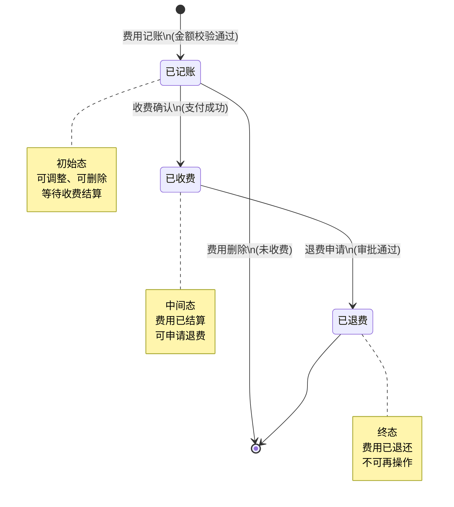
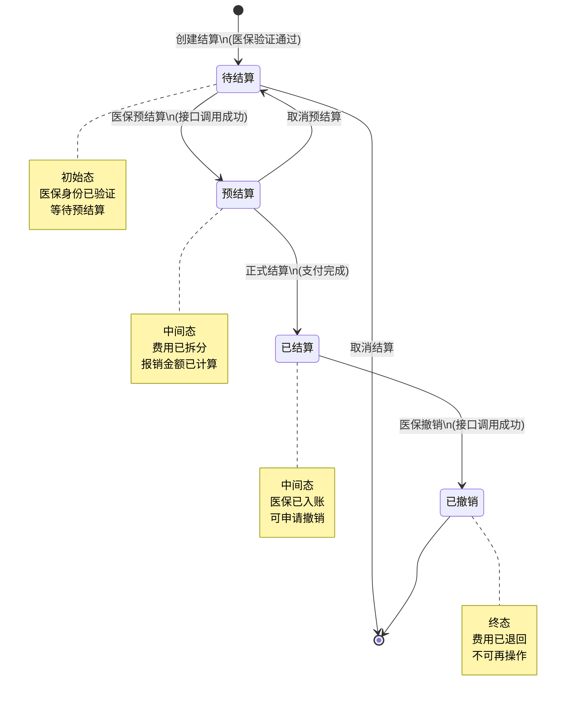
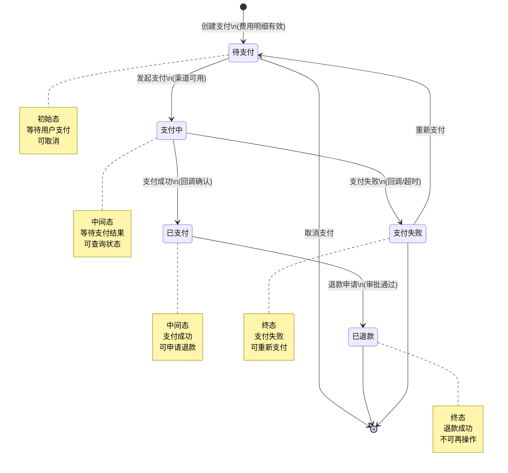
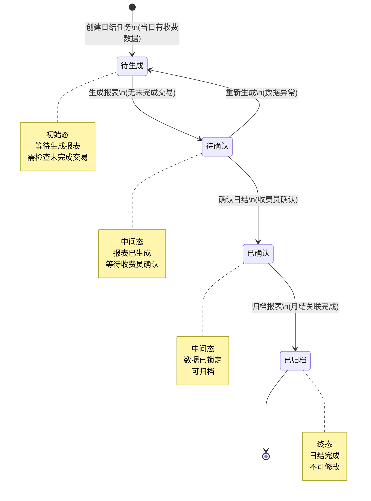
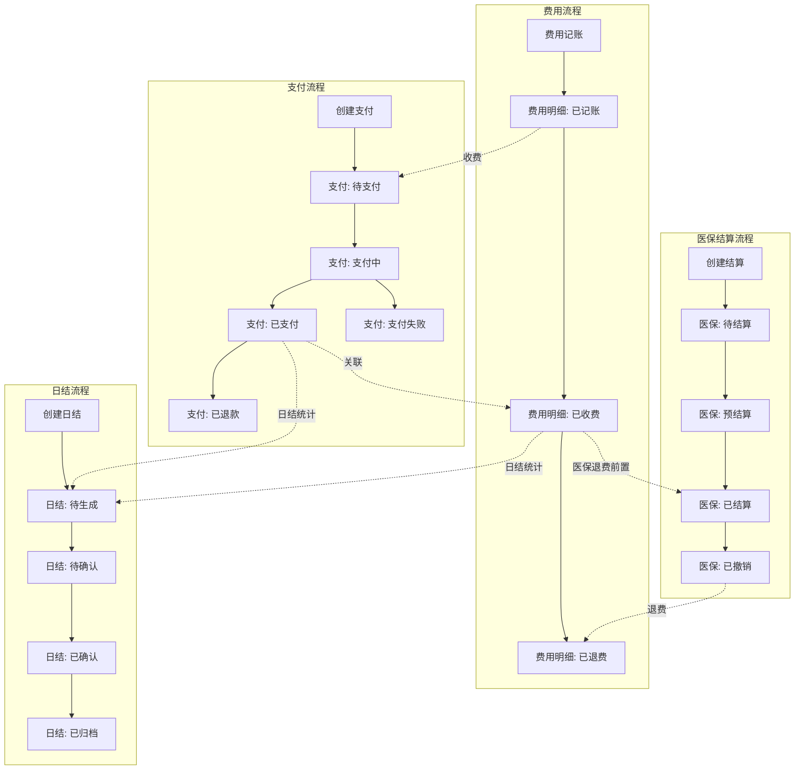

# M08-财务管理 - 状态机设计文档

> **文档编号**: YUDAO-HIS-SM-M08
> **版本**: V1.0
> **创建日期**: 2026-06-22
> **状态**: 设计中
> **关联文档**: YUDAO-HIS-SM-001 (全局状态机设计文档)

---

## 1. 概述

本文档定义财务管理模块(M08)核心业务对象的状态机设计，包括费用明细状态机、医保结算状态机、支付状态机和日结报表状态机。

### 1.1 状态机清单

| 序号 | 状态机编号 | 状态机名称 | 适用对象 | 优先级 | 业务规则 |
|------|------------|----------|----------|--------|----------|
| 1 | SM-FIN-001 | 费用明细状态机 | his_charge_detail | P0 | BR-FIN-016 |
| 2 | SM-FIN-002 | 医保结算状态机 | his_insurance_settlement | P0 | BR-FIN-015 |
| 3 | SM-FIN-003 | 支付状态机 | his_payment | P0 | BR-FIN-009 |
| 4 | SM-FIN-004 | 日结报表状态机 | his_daily_report | P0 | BR-FIN-017 |

---

## 2. 费用明细状态机 (SM-FIN-001)

### 2.1 基本信息

| 属性 | 内容 |
|------|------|
| 状态机编号 | SM-FIN-001 |
| 状态机名称 | 费用明细状态机 |
| 适用对象 | his_charge_detail（费用明细表） |
| 状态字段 | charge_status |
| 业务规则 | BR-FIN-016: 费用明细状态流转规则 |
| 优先级 | P0（MVP必需） |

### 2.2 状态列表

| 状态编码 | 状态名称 | 状态描述 | 状态类型 | 允许操作 |
|----------|----------|----------|----------|----------|
| 1 | 已记账 | 费用已记录，等待收费 | 初始态 | 收费、调整、删除 |
| 2 | 已收费 | 费用已收取，完成结算 | 中间态 | 退费申请 |
| 3 | 已退费 | 费用已退还，完成退费 | 终态 | 无 |

### 2.3 状态流转表

| 当前状态 | 触发事件 | 目标状态 | 前置条件 | 执行操作 | 关联规则 |
|----------|----------|----------|----------|----------|----------|
| - | 费用记账 | 已记账(1) | 费用金额非负、项目有效 | 创建费用明细记录、计算金额 | BR-FIN-006 |
| 已记账(1) | 收费确认 | 已收费(2) | 支付成功、费用未锁定 | 关联支付记录、更新收费时间 | BR-FIN-029 |
| 已记账(1) | 费用删除 | - (删除) | 未关联收费、未锁定 | 删除费用明细记录 | - |
| 已收费(2) | 退费申请 | 已退费(3) | 审批通过、医保已撤销 | 创建退费记录、原路退款 | BR-FIN-008, BR-FIN-032 |

### 2.4 状态流转图



### 2.5 状态约束规则

1. **已记账可调整**: 状态为"已记账"的费用明细可进行金额调整，调整金额需符合BR-FIN-007规则
2. **已记账可删除**: 状态为"已记账"且未关联任何收费记录的费用明细可删除
3. **已收费不可修改**: 状态为"已收费"的费用明细不可修改金额和项目信息
4. **已退费不可操作**: 状态为"已退费"的费用明细不可进行任何操作
5. **重复退费校验**: 已退费项目不允许再次退费（BR-FIN-008）
6. **医保退费同步**: 涉及医保的费用退费前需先完成医保撤销

### 2.6 Java枚举定义

```java
/**
 * 费用明细状态枚举
 */
public enum ChargeStatusEnum implements StatusEnum {

    CHARGED(1, "已记账", "费用已记录，等待收费"),
    PAID(2, "已收费", "费用已收取，完成结算"),
    REFUNDED(3, "已退费", "费用已退还，完成退费");

    private final Integer code;
    private final String name;
    private final String description;

    ChargeStatusEnum(Integer code, String name, String description) {
        this.code = code;
        this.name = name;
        this.description = description;
    }

    @Override
    public Integer getCode() {
        return code;
    }

    @Override
    public String getName() {
        return name;
    }

    @Override
    public String getDescription() {
        return description;
    }

    /**
     * 判断是否可以收费
     */
    public boolean canPay() {
        return this == CHARGED;
    }

    /**
     * 判断是否可以退费
     */
    public boolean canRefund() {
        return this == PAID;
    }

    /**
     * 判断是否可以删除
     */
    public boolean canDelete() {
        return this == CHARGED;
    }

    /**
     * 判断是否为终态
     */
    public boolean isFinal() {
        return this == REFUNDED;
    }
}
```

---

## 3. 医保结算状态机 (SM-FIN-002)

### 3.1 基本信息

| 属性 | 内容 |
|------|------|
| 状态机编号 | SM-FIN-002 |
| 状态机名称 | 医保结算状态机 |
| 适用对象 | his_insurance_settlement（医保结算记录表） |
| 状态字段 | settlement_status |
| 业务规则 | BR-FIN-015: 医保结算状态流转规则 |
| 优先级 | P0（MVP必需） |

### 3.2 状态列表

| 状态编码 | 状态名称 | 状态描述 | 状态类型 | 允许操作 |
|----------|----------|----------|----------|----------|
| 1 | 待结算 | 费用已汇总，等待结算 | 初始态 | 预结算、取消 |
| 2 | 预结算 | 医保预结算完成，等待正式结算 | 中间态 | 正式结算、取消 |
| 3 | 已结算 | 医保结算完成，报销入账 | 中间态 | 撤销 |
| 4 | 已撤销 | 医保结算已撤销，费用退回 | 终态 | 无 |

### 3.3 状态流转表

| 当前状态 | 触发事件 | 目标状态 | 前置条件 | 执行操作 | 关联规则 |
|----------|----------|----------|----------|----------|----------|
| - | 创建结算 | 待结算(1) | 医保身份验证通过 | 创建结算记录、关联费用明细 | BR-FIN-012 |
| 待结算(1) | 医保预结算 | 预结算(2) | 医保接口调用成功 | 计算报销金额、费用拆分 | BR-FIN-027, BR-FIN-028 |
| 待结算(1) | 取消结算 | - (删除) | 未开始预结算 | 删除结算记录 | - |
| 预结算(2) | 正式结算 | 已结算(3) | 医保接口调用成功、支付完成 | 获取医保流水号、更新费用明细 | BR-FIN-039 |
| 预结算(2) | 取消预结算 | 待结算(1) | 未正式结算 | 清除预结算数据 | - |
| 已结算(3) | 医保撤销 | 已撤销(4) | 医保撤销接口成功 | 更新费用明细、退回报销金额 | BR-FIN-040 |

### 3.4 状态流转图



### 3.5 状态约束规则

1. **身份验证前置**: 医保结算前必须完成医保身份验证（BR-FIN-012）
2. **预结算必需**: 正式结算前必须先完成预结算，获取费用拆分结果
3. **大额审批**: 医保报销金额超过阈值需审批（BR-FIN-019）
4. **撤销时限**: 已结算记录在规定时限内可申请撤销，超过时限需人工处理
5. **撤销后退费**: 医保撤销后需同步更新费用明细，将医保金额转为个人自付
6. **接口重试**: 医保接口调用失败时按BR-FIN-042规则进行重试

### 3.6 Java枚举定义

```java
/**
 * 医保结算状态枚举
 */
public enum InsuranceSettlementStatusEnum implements StatusEnum {

    PENDING(1, "待结算", "费用已汇总，等待结算"),
    PRE_SETTLED(2, "预结算", "医保预结算完成，等待正式结算"),
    SETTLED(3, "已结算", "医保结算完成，报销入账"),
    CANCELLED(4, "已撤销", "医保结算已撤销，费用退回");

    private final Integer code;
    private final String name;
    private final String description;

    InsuranceSettlementStatusEnum(Integer code, String name, String description) {
        this.code = code;
        this.name = name;
        this.description = description;
    }

    @Override
    public Integer getCode() {
        return code;
    }

    @Override
    public String getName() {
        return name;
    }

    @Override
    public String getDescription() {
        return description;
    }

    /**
     * 判断是否可以预结算
     */
    public boolean canPreSettle() {
        return this == PENDING;
    }

    /**
     * 判断是否可以正式结算
     */
    public boolean canSettle() {
        return this == PRE_SETTLED;
    }

    /**
     * 判断是否可以撤销
     */
    public boolean canCancel() {
        return this == SETTLED;
    }

    /**
     * 判断是否为终态
     */
    public boolean isFinal() {
        return this == CANCELLED;
    }
}
```

---

## 4. 支付状态机 (SM-FIN-003)

### 4.1 基本信息

| 属性 | 内容 |
|------|------|
| 状态机编号 | SM-FIN-003 |
| 状态机名称 | 支付状态机 |
| 适用对象 | his_payment（支付记录表） |
| 状态字段 | payment_status |
| 业务规则 | BR-FIN-009: 日结前未完成交易校验 |
| 优先级 | P0（MVP必需） |

### 4.2 状态列表

| 状态编码 | 状态名称 | 状态描述 | 状态类型 | 允许操作 |
|----------|----------|----------|----------|----------|
| 1 | 待支付 | 支付请求已创建，等待支付 | 初始态 | 支付、取消 |
| 2 | 支付中 | 支付处理中，等待结果 | 中间态 | 查询、超时处理 |
| 3 | 已支付 | 支付成功，交易完成 | 中间态 | 退款申请 |
| 4 | 已退款 | 退款成功，交易撤销 | 终态 | 无 |
| 5 | 支付失败 | 支付失败，交易终止 | 终态 | 重新支付 |

### 4.3 状态流转表

| 当前状态 | 触发事件 | 目标状态 | 前置条件 | 执行操作 | 关联规则 |
|----------|----------|----------|----------|----------|----------|
| - | 创建支付 | 待支付(1) | 费用明细有效 | 创建支付记录、生成支付单号 | - |
| 待支付(1) | 发起支付 | 支付中(2) | 支付渠道可用 | 调用支付接口、记录支付渠道 | - |
| 待支付(1) | 取消支付 | - (删除) | 未发起支付 | 删除支付记录 | - |
| 支付中(2) | 支付成功 | 已支付(3) | 支付渠道回调成功 | 更新支付时间、关联费用明细 | - |
| 支付中(2) | 支付失败 | 支付失败(5) | 支付渠道回调失败 | 记录失败原因、通知用户 | - |
| 支付中(2) | 支付超时 | 支付失败(5) | 超过规定时间 | 查询支付状态、更新失败原因 | - |
| 已支付(3) | 退款申请 | 已退款(4) | 退款审批通过 | 调用退款接口、更新费用明细 | BR-FIN-032 |
| 支付失败(5) | 重新支付 | 待支付(1) | 用户确认重新支付 | 创建新支付记录 | - |

### 4.4 状态流转图



### 4.5 状态约束规则

1. **支付超时处理**: 支付中状态超过规定时间（如30分钟）自动转为支付失败
2. **支付金额校验**: 支付金额必须与费用明细金额一致
3. **退款金额限制**: 退款金额不能超过实际支付金额
4. **支付渠道一致性**: 退款必须通过原支付渠道进行
5. **日结前检查**: 状态为"支付中"的记录存在时不允许日结（BR-FIN-009）
6. **并发控制**: 同一费用明细同一时间只能有一个"支付中"状态的支付记录

### 4.6 Java枚举定义

```java
/**
 * 支付状态枚举
 */
public enum PaymentStatusEnum implements StatusEnum {

    PENDING(1, "待支付", "支付请求已创建，等待支付"),
    PAYING(2, "支付中", "支付处理中，等待结果"),
    PAID(3, "已支付", "支付成功，交易完成"),
    REFUNDED(4, "已退款", "退款成功，交易撤销"),
    FAILED(5, "支付失败", "支付失败，交易终止");

    private final Integer code;
    private final String name;
    private final String description;

    PaymentStatusEnum(Integer code, String name, String description) {
        this.code = code;
        this.name = name;
        this.description = description;
    }

    @Override
    public Integer getCode() {
        return code;
    }

    @Override
    public String getName() {
        return name;
    }

    @Override
    public String getDescription() {
        return description;
    }

    /**
     * 判断是否可以支付
     */
    public boolean canPay() {
        return this == PENDING;
    }

    /**
     * 判断是否可以取消
     */
    public boolean canCancel() {
        return this == PENDING;
    }

    /**
     * 判断是否可以退款
     */
    public boolean canRefund() {
        return this == PAID;
    }

    /**
     * 判断是否可以重新支付
     */
    public boolean canRetry() {
        return this == FAILED;
    }

    /**
     * 判断是否为终态
     */
    public boolean isFinal() {
        return this == REFUNDED;
    }

    /**
     * 判断是否为完成态（成功或失败）
     */
    public boolean isCompleted() {
        return this == PAID || this == REFUNDED || this == FAILED;
    }
}
```

---

## 5. 日结报表状态机 (SM-FIN-004)

### 5.1 基本信息

| 属性 | 内容 |
|------|------|
| 状态机编号 | SM-FIN-004 |
| 状态机名称 | 日结报表状态机 |
| 适用对象 | his_daily_report（日结报表表） |
| 状态字段 | report_status |
| 业务规则 | BR-FIN-017: 日结报表状态流转规则 |
| 优先级 | P0（MVP必需） |

### 5.2 状态列表

| 状态编码 | 状态名称 | 状态描述 | 状态类型 | 允许操作 |
|----------|----------|----------|----------|----------|
| 1 | 待生成 | 日结任务已创建，等待生成 | 初始态 | 生成报表 |
| 2 | 待确认 | 报表已生成，等待确认 | 中间态 | 确认、重新生成 |
| 3 | 已确认 | 报表已确认，数据锁定 | 中间态 | 归档 |
| 4 | 已归档 | 报表已归档，完成日结 | 终态 | 无 |

### 5.3 状态流转表

| 当前状态 | 触发事件 | 目标状态 | 前置条件 | 执行操作 | 关联规则 |
|----------|----------|----------|----------|----------|----------|
| - | 创建日结任务 | 待生成(1) | 当日有收费数据 | 创建日结任务记录 | - |
| 待生成(1) | 生成报表 | 待确认(2) | 无未完成交易 | 统计收费数据、计算金额 | BR-FIN-009, BR-FIN-030 |
| 待确认(2) | 确认日结 | 已确认(3) | 收费员确认 | 锁定当日数据、记录确认时间 | BR-FIN-025 |
| 待确认(2) | 重新生成 | 待生成(1) | 发现数据异常 | 清除报表数据、重新统计 | - |
| 已确认(3) | 归档报表 | 已归档(4) | 月结关联完成 | 生成归档文件、更新归档标识 | - |

### 5.4 状态流转图



### 5.5 状态约束规则

1. **未完成交易检查**: 生成报表前必须检查是否存在"支付中"状态的交易（BR-FIN-009）
2. **数据锁定规则**: 确认日结后，当日收费数据锁定不可修改
3. **个人日结限制**: 收费员只能日结本人的收费记录（BR-FIN-025）
4. **重复日结禁止**: 同一收费员同一日期只能有一条日结记录
5. **月结前置**: 月结前必须确认当月所有日期已完成日结（BR-FIN-010）
6. **重新生成限制**: 重新生成报表需要记录操作日志

### 5.6 Java枚举定义

```java
/**
 * 日结报表状态枚举
 */
public enum DailyReportStatusEnum implements StatusEnum {

    TO_GENERATE(1, "待生成", "日结任务已创建，等待生成"),
    TO_CONFIRM(2, "待确认", "报表已生成，等待确认"),
    CONFIRMED(3, "已确认", "报表已确认，数据锁定"),
    ARCHIVED(4, "已归档", "报表已归档，完成日结");

    private final Integer code;
    private final String name;
    private final String description;

    DailyReportStatusEnum(Integer code, String name, String description) {
        this.code = code;
        this.name = name;
        this.description = description;
    }

    @Override
    public Integer getCode() {
        return code;
    }

    @Override
    public String getName() {
        return name;
    }

    @Override
    public String getDescription() {
        return description;
    }

    /**
     * 判断是否可以生成
     */
    public boolean canGenerate() {
        return this == TO_GENERATE;
    }

    /**
     * 判断是否可以确认
     */
    public boolean canConfirm() {
        return this == TO_CONFIRM;
    }

    /**
     * 判断是否可以重新生成
     */
    public boolean canRegenerate() {
        return this == TO_CONFIRM;
    }

    /**
     * 判断是否可以归档
     */
    public boolean canArchive() {
        return this == CONFIRMED;
    }

    /**
     * 判断是否为终态
     */
    public boolean isFinal() {
        return this == ARCHIVED;
    }

    /**
     * 判断是否数据已锁定
     */
    public boolean isLocked() {
        return this == CONFIRMED || this == ARCHIVED;
    }
}
```

---

## 6. 状态机交互关系

### 6.1 状态机交互图



### 6.2 状态机协作说明

| 场景 | 涉及状态机 | 协作说明 |
|------|------------|----------|
| 医保收费 | 费用明细、医保结算、支付 | 费用记账→医保预结算→医保正式结算→支付→费用已收费 |
| 自费收费 | 费用明细、支付 | 费用记账→支付成功→费用已收费 |
| 医保退费 | 费用明细、医保结算、支付 | 医保撤销→退款申请→费用已退费 |
| 自费退费 | 费用明细、支付 | 退款审批→支付退款→费用已退费 |
| 收费员日结 | 支付、费用明细、日结报表 | 检查未完成交易→统计收费/退费→确认日结→数据锁定 |

---

## 7. 异常状态处理

### 7.1 异常状态定义

| 状态机 | 异常场景 | 异常状态 | 处理方式 |
|--------|----------|----------|----------|
| 费用明细 | 记账金额异常 | 已记账 | 允许调整或删除 |
| 医保结算 | 医保接口超时 | 待结算/预结算 | 按BR-FIN-042重试，失败转自费 |
| 医保结算 | 医保接口失败 | 待结算 | 提示错误，允许转自费结算 |
| 支付 | 支付超时 | 支付中 | 自动查询状态，超时转失败 |
| 支付 | 支付渠道异常 | 支付中 | 记录日志，人工处理 |
| 日结报表 | 存在未完成交易 | 待生成 | 提示处理未完成交易 |

### 7.2 状态恢复机制

```java
/**
 * 状态恢复处理接口
 */
public interface StateRecoveryHandler {

    /**
     * 支付超时恢复
     * 定时任务检查支付中超时记录，查询支付渠道状态后更新
     */
    void recoverPaymentTimeout();

    /**
     * 医保结算超时恢复
     * 定时任务检查预结算超时记录，重新调用接口或转自费
     */
    void recoverInsuranceSettlementTimeout();

    /**
     * 日结任务恢复
     * 定时任务检查待生成任务，自动生成报表
     */
    void recoverDailyReportTask();
}
```

---

## 附录A: 状态编码汇总

| 状态机 | 状态编码 | 状态名称 | 状态类型 |
|--------|----------|----------|----------|
| 费用明细 | 1 | 已记账 | 初始态 |
| 费用明细 | 2 | 已收费 | 中间态 |
| 费用明细 | 3 | 已退费 | 终态 |
| 医保结算 | 1 | 待结算 | 初始态 |
| 医保结算 | 2 | 预结算 | 中间态 |
| 医保结算 | 3 | 已结算 | 中间态 |
| 医保结算 | 4 | 已撤销 | 终态 |
| 支付 | 1 | 待支付 | 初始态 |
| 支付 | 2 | 支付中 | 中间态 |
| 支付 | 3 | 已支付 | 中间态 |
| 支付 | 4 | 已退款 | 终态 |
| 支付 | 5 | 支付失败 | 终态 |
| 日结报表 | 1 | 待生成 | 初始态 |
| 日结报表 | 2 | 待确认 | 中间态 |
| 日结报表 | 3 | 已确认 | 中间态 |
| 日结报表 | 4 | 已归档 | 终态 |

---

## 附录B: 业务规则引用

| 规则编号 | 规则名称 | 适用状态机 |
|----------|----------|------------|
| BR-FIN-006 | 费用金额非负校验 | 费用明细 |
| BR-FIN-008 | 已退费项目重复退费校验 | 费用明细 |
| BR-FIN-009 | 日结前未完成交易校验 | 支付、日结报表 |
| BR-FIN-010 | 月结前未日结校验 | 日结报表 |
| BR-FIN-012 | 医保结算前身份验证校验 | 医保结算 |
| BR-FIN-015 | 医保结算状态流转规则 | 医保结算 |
| BR-FIN-016 | 费用明细状态流转规则 | 费用明细 |
| BR-FIN-017 | 日结报表状态流转规则 | 日结报表 |
| BR-FIN-019 | 医保结算审批流程 | 医保结算 |
| BR-FIN-025 | 日结权限控制 | 日结报表 |
| BR-FIN-027 | 医保报销金额计算 | 医保结算 |
| BR-FIN-028 | 医保起付线计算 | 医保结算 |
| BR-FIN-029 | 费用汇总计算 | 费用明细 |
| BR-FIN-030 | 日结报表金额计算 | 日结报表 |
| BR-FIN-032 | 退费金额计算 | 费用明细、支付 |
| BR-FIN-039 | 医保正式结算接口调用规则 | 医保结算 |
| BR-FIN-040 | 医保撤销接口调用规则 | 医保结算 |
| BR-FIN-042 | 医保接口超时重试规则 | 医保结算 |

---

## 附录C: 变更历史

| 版本 | 日期 | 变更内容 | 变更人 |
|------|------|----------|--------|
| V1.0 | 2026-06-22 | 初始版本，定义费用明细、医保结算、支付、日结报表四个状态机 | YUDAO-AI-HIS架构组 |

---

> **最后更新**: 2026-06-22
