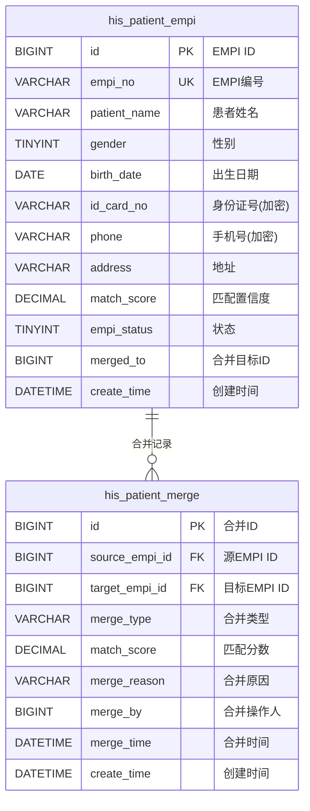
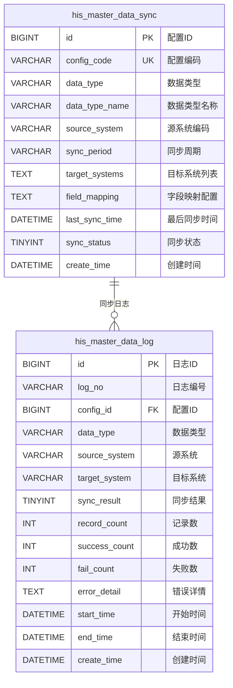
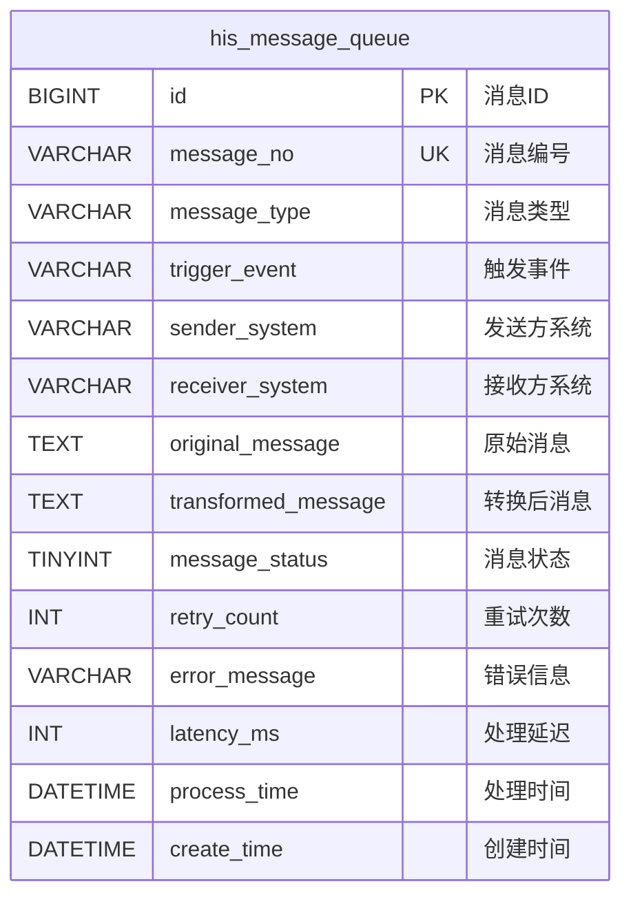
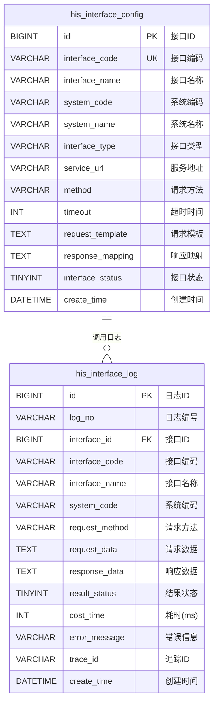
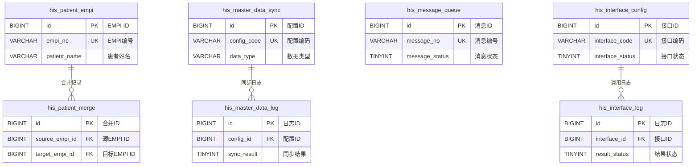

# M10 集成平台子系统 - 数据库设计文档

> **文档编号**: YUDAO-HIS-DB-M10
> **版本**: V1.0
> **创建日期**: 2026-06-22
> **所属系统**: YUDAO-AI-HIS智慧医疗信息系统
> **子系统**: M10-集成平台
> **参考文档**: YUDAO-HIS-PRD-M10, YUDAO-HIS-DB-001

---

## 1. 设计概述

### 1.1 模块说明

集成平台子系统是YUDAO-AI-HIS的公共服务层核心模块，提供院内/院间互联互通能力。系统实现EMPI患者主索引、主数据管理、消息引擎、接口适配器，遵循HL7 FHIR R4标准。

### 1.2 表清单

| 序号 | 表名 | 中文名 | 说明 | 年增量估算 |
|------|------|--------|------|------------|
| 1 | his_patient_empi | 患者主索引表 | EMPI唯一标识管理 | 约50万条 |
| 2 | his_patient_merge | 患者合并记录表 | 患者信息合并历史 | 约5万条 |
| 3 | his_master_data_sync | 主数据同步配置表 | 主数据同步规则配置 | 约100条 |
| 4 | his_master_data_log | 主数据同步日志表 | 主数据同步执行日志 | 约100万条 |
| 5 | his_message_queue | 消息队列表 | 消息引擎核心表 | 约1000万条 |
| 6 | his_interface_config | 接口配置表 | 外部系统接口配置 | 约500条 |
| 7 | his_interface_log | 接口日志表 | 接口调用日志 | 约5000万条 |

### 1.3 命名规范

遵循全局数据库设计文档规范：
- 表名前缀：`his_` 表示业务表
- 主键：`id` (BIGINT AUTO_INCREMENT)
- 外键：关联表名_id
- 索引：`idx_表名_字段名`
- 唯一索引：`uk_表名_字段名`

---

## 2. ER图设计

### 2.1 EMPI域 ER图



### 2.2 主数据管理域 ER图



### 2.3 消息引擎域 ER图



### 2.4 接口适配域 ER图



### 2.5 集成平台全局 ER图



---

## 3. DDL脚本设计

### 3.1 通用字段说明

```sql
-- =============================================
-- 通用字段说明（基于 ruoyi-vue-pro 框架规范）
-- 所有表均包含以下通用字段：
-- creator VARCHAR(64) DEFAULT '' COMMENT '创建者'
-- create_time DATETIME NOT NULL DEFAULT CURRENT_TIMESTAMP COMMENT '创建时间'
-- updater VARCHAR(64) DEFAULT '' COMMENT '更新者'
-- update_time DATETIME NOT NULL DEFAULT CURRENT_TIMESTAMP ON UPDATE CURRENT_TIMESTAMP COMMENT '更新时间'
-- deleted BIT(1) NOT NULL DEFAULT b'0' COMMENT '是否删除'
-- tenant_id BIGINT NOT NULL DEFAULT 0 COMMENT '租户编号'(多租户表)
-- =============================================
```

### 3.2 EMPI管理表结构

#### 3.2.1 患者主索引表 (his_patient_empi)

```sql
-- =============================================
-- 患者主索引表
-- 对应FHIR资源: Patient
-- 年增量估算: 约50万条
-- 说明: EMPI唯一标识管理，实现跨系统患者信息匹配
-- =============================================
CREATE TABLE `his_patient_empi` (
    `id` BIGINT NOT NULL AUTO_INCREMENT COMMENT 'EMPI ID',
    `empi_no` VARCHAR(30) NOT NULL COMMENT 'EMPI编号(对外唯一标识)',
    `patient_name` VARCHAR(50) NOT NULL COMMENT '患者姓名',
    `gender` TINYINT NOT NULL DEFAULT 9 COMMENT '性别: 1男/2女/9未知',
    `birth_date` DATE NOT NULL COMMENT '出生日期',
    `id_card_no` VARCHAR(100) COMMENT '身份证号(加密存储)',
    `id_card_no_hash` VARCHAR(64) COMMENT '身份证号哈希(用于匹配)',
    `phone` VARCHAR(100) COMMENT '手机号(加密存储)',
    `phone_hash` VARCHAR(64) COMMENT '手机号哈希(用于匹配)',
    `address` VARCHAR(200) COMMENT '地址',
    `province_code` VARCHAR(10) COMMENT '省编码',
    `city_code` VARCHAR(10) COMMENT '市编码',
    `district_code` VARCHAR(10) COMMENT '区编码',
    `nation` VARCHAR(20) DEFAULT '汉族' COMMENT '民族',
    `match_score` DECIMAL(5,2) COMMENT '匹配置信度分数(0-100)',
    `match_level` TINYINT COMMENT '匹配级别: 1精确匹配/2高置信度/3中置信度/4低置信度',
    `empi_status` TINYINT NOT NULL DEFAULT 1 COMMENT '状态: 1有效/2已合并/3已注销',
    `merged_to` BIGINT COMMENT '合并目标EMPI ID',
    `merge_time` DATETIME COMMENT '合并时间',
    `source_system` VARCHAR(50) COMMENT '来源系统编码',
    `source_patient_id` VARCHAR(50) COMMENT '来源系统患者ID',
    `verify_status` TINYINT DEFAULT 0 COMMENT '验证状态: 0未验证/1已验证',
    `verify_time` DATETIME COMMENT '验证时间',
    `verify_by` VARCHAR(64) COMMENT '验证人',
    `remark` VARCHAR(500) COMMENT '备注',
    `creator` VARCHAR(64) DEFAULT '' COMMENT '创建者',
    `create_time` DATETIME NOT NULL DEFAULT CURRENT_TIMESTAMP COMMENT '创建时间',
    `updater` VARCHAR(64) DEFAULT '' COMMENT '更新者',
    `update_time` DATETIME NOT NULL DEFAULT CURRENT_TIMESTAMP ON UPDATE CURRENT_TIMESTAMP COMMENT '更新时间',
    `deleted` BIT(1) NOT NULL DEFAULT b'0' COMMENT '是否删除',
    `tenant_id` BIGINT NOT NULL DEFAULT 0 COMMENT '租户编号',
    PRIMARY KEY (`id`),
    UNIQUE KEY `uk_empi_no` (`empi_no`),
    UNIQUE KEY `uk_id_card_no_hash` (`id_card_no_hash`),
    KEY `idx_empi_name` (`patient_name`),
    KEY `idx_empi_birth_date` (`birth_date`),
    KEY `idx_empi_phone_hash` (`phone_hash`),
    KEY `idx_empi_status` (`empi_status`),
    KEY `idx_empi_merged_to` (`merged_to`),
    KEY `idx_empi_source` (`source_system`, `source_patient_id`)
) ENGINE=InnoDB DEFAULT CHARSET=utf8mb4 COLLATE=utf8mb4_unicode_ci COMMENT='患者主索引表';
```

#### 3.2.2 患者合并记录表 (his_patient_merge)

```sql
-- =============================================
-- 患者合并记录表
-- 说明: 记录EMPI合并操作历史，支持合并追溯
-- =============================================
CREATE TABLE `his_patient_merge` (
    `id` BIGINT NOT NULL AUTO_INCREMENT COMMENT '合并ID',
    `merge_no` VARCHAR(30) COMMENT '合并编号',
    `source_empi_id` BIGINT NOT NULL COMMENT '源EMPI ID(被合并)',
    `source_empi_no` VARCHAR(30) COMMENT '源EMPI编号',
    `source_patient_name` VARCHAR(50) COMMENT '源患者姓名',
    `target_empi_id` BIGINT NOT NULL COMMENT '目标EMPI ID(合并目标)',
    `target_empi_no` VARCHAR(30) COMMENT '目标EMPI编号',
    `target_patient_name` VARCHAR(50) COMMENT '目标患者姓名',
    `merge_type` VARCHAR(20) NOT NULL COMMENT '合并类型: AUTO自动/MANUAL手动',
    `match_score` DECIMAL(5,2) COMMENT '匹配置信度分数',
    `match_rules` VARCHAR(500) COMMENT '匹配规则(JSON格式)',
    `merge_reason` VARCHAR(500) COMMENT '合并原因',
    `merge_by` BIGINT COMMENT '合并操作人ID',
    `merge_by_name` VARCHAR(50) COMMENT '合并操作人姓名',
    `merge_time` DATETIME NOT NULL COMMENT '合并时间',
    `audit_status` TINYINT DEFAULT 0 COMMENT '审核状态: 0待审核/1已审核/2已驳回',
    `audit_by` BIGINT COMMENT '审核人ID',
    `audit_by_name` VARCHAR(50) COMMENT '审核人姓名',
    `audit_time` DATETIME COMMENT '审核时间',
    `audit_opinion` VARCHAR(500) COMMENT '审核意见',
    `undo_status` TINYINT DEFAULT 0 COMMENT '撤销状态: 0未撤销/1已撤销',
    `undo_time` DATETIME COMMENT '撤销时间',
    `undo_by` BIGINT COMMENT '撤销人ID',
    `undo_by_name` VARCHAR(50) COMMENT '撤销人姓名',
    `remark` VARCHAR(500) COMMENT '备注',
    `creator` VARCHAR(64) DEFAULT '' COMMENT '创建者',
    `create_time` DATETIME NOT NULL DEFAULT CURRENT_TIMESTAMP COMMENT '创建时间',
    `updater` VARCHAR(64) DEFAULT '' COMMENT '更新者',
    `update_time` DATETIME NOT NULL DEFAULT CURRENT_TIMESTAMP ON UPDATE CURRENT_TIMESTAMP COMMENT '更新时间',
    `deleted` BIT(1) NOT NULL DEFAULT b'0' COMMENT '是否删除',
    `tenant_id` BIGINT NOT NULL DEFAULT 0 COMMENT '租户编号',
    PRIMARY KEY (`id`),
    UNIQUE KEY `uk_merge_no` (`merge_no`),
    KEY `idx_merge_source` (`source_empi_id`),
    KEY `idx_merge_target` (`target_empi_id`),
    KEY `idx_merge_type` (`merge_type`),
    KEY `idx_merge_time` (`merge_time`),
    KEY `idx_merge_by` (`merge_by`)
) ENGINE=InnoDB DEFAULT CHARSET=utf8mb4 COLLATE=utf8mb4_unicode_ci COMMENT='患者合并记录表';
```

### 3.3 主数据管理表结构

#### 3.3.1 主数据同步配置表 (his_master_data_sync)

```sql
-- =============================================
-- 主数据同步配置表
-- 说明: 定义主数据同步规则，包括数据类型、源系统、目标系统、字段映射等
-- =============================================
CREATE TABLE `his_master_data_sync` (
    `id` BIGINT NOT NULL AUTO_INCREMENT COMMENT '配置ID',
    `config_code` VARCHAR(30) NOT NULL COMMENT '配置编码',
    `config_name` VARCHAR(100) NOT NULL COMMENT '配置名称',
    `data_type` VARCHAR(30) NOT NULL COMMENT '数据类型: DEPT科室/STAFF人员/DIAG诊断/DRUG药品',
    `data_type_name` VARCHAR(50) COMMENT '数据类型名称',
    `source_system` VARCHAR(50) NOT NULL COMMENT '源系统编码',
    `source_system_name` VARCHAR(100) COMMENT '源系统名称',
    `source_config` TEXT COMMENT '源系统配置(JSON格式)',
    `sync_period` VARCHAR(20) NOT NULL COMMENT '同步周期: REALTIME实时/HOURLY每小时/DAILY每天/MANUAL手动',
    `sync_cron` VARCHAR(50) COMMENT 'Cron表达式(定时同步)',
    `target_systems` TEXT NOT NULL COMMENT '目标系统列表(JSON数组)',
    `field_mapping` TEXT NOT NULL COMMENT '字段映射配置(JSON格式)',
    `data_filter` TEXT COMMENT '数据过滤条件(JSON格式)',
    `transform_rules` TEXT COMMENT '数据转换规则(JSON格式)',
    `last_sync_time` DATETIME COMMENT '最后同步时间',
    `last_sync_status` TINYINT COMMENT '最后同步状态: 1成功/2失败/3部分成功',
    `last_sync_count` INT COMMENT '最后同步记录数',
    `sync_status` TINYINT NOT NULL DEFAULT 1 COMMENT '配置状态: 1启用/2禁用',
    `retry_count` INT DEFAULT 3 COMMENT '失败重试次数',
    `retry_interval` INT DEFAULT 60 COMMENT '重试间隔(秒)',
    `notify_on_fail` TINYINT DEFAULT 1 COMMENT '失败时通知: 0否/1是',
    `notify_receivers` VARCHAR(500) COMMENT '通知接收人(逗号分隔)',
    `remark` VARCHAR(500) COMMENT '备注',
    `creator` VARCHAR(64) DEFAULT '' COMMENT '创建者',
    `create_time` DATETIME NOT NULL DEFAULT CURRENT_TIMESTAMP COMMENT '创建时间',
    `updater` VARCHAR(64) DEFAULT '' COMMENT '更新者',
    `update_time` DATETIME NOT NULL DEFAULT CURRENT_TIMESTAMP ON UPDATE CURRENT_TIMESTAMP COMMENT '更新时间',
    `deleted` BIT(1) NOT NULL DEFAULT b'0' COMMENT '是否删除',
    `tenant_id` BIGINT NOT NULL DEFAULT 0 COMMENT '租户编号',
    PRIMARY KEY (`id`),
    UNIQUE KEY `uk_config_code` (`config_code`),
    KEY `idx_sync_data_type` (`data_type`),
    KEY `idx_sync_source` (`source_system`),
    KEY `idx_sync_status` (`sync_status`),
    KEY `idx_sync_period` (`sync_period`)
) ENGINE=InnoDB DEFAULT CHARSET=utf8mb4 COLLATE=utf8mb4_unicode_ci COMMENT='主数据同步配置表';
```

#### 3.3.2 主数据同步日志表 (his_master_data_log)

```sql
-- =============================================
-- 主数据同步日志表
-- 年增量估算: 约100万条
-- 分表策略: 按年分表
-- 说明: 记录主数据同步执行日志，支持同步追溯和问题排查
-- =============================================
CREATE TABLE `his_master_data_log` (
    `id` BIGINT NOT NULL AUTO_INCREMENT COMMENT '日志ID',
    `log_no` VARCHAR(30) COMMENT '日志编号',
    `config_id` BIGINT NOT NULL COMMENT '配置ID',
    `config_code` VARCHAR(30) COMMENT '配置编码',
    `data_type` VARCHAR(30) NOT NULL COMMENT '数据类型',
    `data_type_name` VARCHAR(50) COMMENT '数据类型名称',
    `source_system` VARCHAR(50) NOT NULL COMMENT '源系统编码',
    `source_system_name` VARCHAR(100) COMMENT '源系统名称',
    `target_system` VARCHAR(50) NOT NULL COMMENT '目标系统编码',
    `target_system_name` VARCHAR(100) COMMENT '目标系统名称',
    `sync_mode` VARCHAR(20) NOT NULL COMMENT '同步模式: FULL全量/INCREMENTAL增量',
    `sync_result` TINYINT NOT NULL COMMENT '同步结果: 1成功/2失败/3部分成功',
    `record_count` INT DEFAULT 0 COMMENT '总记录数',
    `success_count` INT DEFAULT 0 COMMENT '成功记录数',
    `fail_count` INT DEFAULT 0 COMMENT '失败记录数',
    `skip_count` INT DEFAULT 0 COMMENT '跳过记录数',
    `add_count` INT DEFAULT 0 COMMENT '新增记录数',
    `update_count` INT DEFAULT 0 COMMENT '更新记录数',
    `delete_count` INT DEFAULT 0 COMMENT '删除记录数',
    `error_detail` TEXT COMMENT '错误详情(JSON格式)',
    `start_time` DATETIME NOT NULL COMMENT '开始时间',
    `end_time` DATETIME COMMENT '结束时间',
    `cost_time` INT COMMENT '耗时(毫秒)',
    `trigger_type` VARCHAR(20) COMMENT '触发方式: AUTO自动/MANUAL手动/SCHEDULE定时',
    `trigger_by` BIGINT COMMENT '触发人ID(手动触发时)',
    `trigger_by_name` VARCHAR(50) COMMENT '触发人姓名',
    `remark` VARCHAR(500) COMMENT '备注',
    `creator` VARCHAR(64) DEFAULT '' COMMENT '创建者',
    `create_time` DATETIME NOT NULL DEFAULT CURRENT_TIMESTAMP COMMENT '创建时间',
    `updater` VARCHAR(64) DEFAULT '' COMMENT '更新者',
    `update_time` DATETIME NOT NULL DEFAULT CURRENT_TIMESTAMP ON UPDATE CURRENT_TIMESTAMP COMMENT '更新时间',
    `deleted` BIT(1) NOT NULL DEFAULT b'0' COMMENT '是否删除',
    `tenant_id` BIGINT NOT NULL DEFAULT 0 COMMENT '租户编号',
    PRIMARY KEY (`id`),
    KEY `idx_log_no` (`log_no`),
    KEY `idx_log_config` (`config_id`),
    KEY `idx_log_data_type` (`data_type`),
    KEY `idx_log_source` (`source_system`),
    KEY `idx_log_target` (`target_system`),
    KEY `idx_log_result` (`sync_result`),
    KEY `idx_log_start_time` (`start_time`),
    KEY `idx_log_create_time` (`create_time`),
    KEY `idx_log_year` (YEAR(`create_time`))
) ENGINE=InnoDB DEFAULT CHARSET=utf8mb4 COLLATE=utf8mb4_unicode_ci COMMENT='主数据同步日志表';
```

### 3.4 消息引擎表结构

#### 3.4.1 消息队列表 (his_message_queue)

```sql
-- =============================================
-- 消息队列表
-- 年增量估算: 约1000万条
-- 分表策略: 按月分表
-- 说明: 消息引擎核心表，存储消息解析、转换、路由全过程
-- =============================================
CREATE TABLE `his_message_queue` (
    `id` BIGINT NOT NULL AUTO_INCREMENT COMMENT '消息ID',
    `message_no` VARCHAR(30) NOT NULL COMMENT '消息编号',
    `message_type` VARCHAR(20) NOT NULL COMMENT '消息类型: ADT/ORM/ORU/ACK等',
    `trigger_event` VARCHAR(10) NOT NULL COMMENT '触发事件: A01/A02/O01/R01等',
    `message_format` VARCHAR(20) NOT NULL COMMENT '消息格式: HL7V2/FHIR/JSON/XML',
    `version` VARCHAR(20) COMMENT '消息版本',
    `sender_system` VARCHAR(50) NOT NULL COMMENT '发送方系统编码',
    `sender_system_name` VARCHAR(100) COMMENT '发送方系统名称',
    `sender_ip` VARCHAR(50) COMMENT '发送方IP',
    `receiver_system` VARCHAR(50) NOT NULL COMMENT '接收方系统编码',
    `receiver_system_name` VARCHAR(100) COMMENT '接收方系统名称',
    `original_message` TEXT NOT NULL COMMENT '原始消息内容',
    `transformed_message` TEXT COMMENT '转换后消息',
    `transform_rules` TEXT COMMENT '转换规则(JSON格式)',
    `route_rules` TEXT COMMENT '路由规则(JSON格式)',
    `message_status` TINYINT NOT NULL DEFAULT 1 COMMENT '状态: 1待处理/2处理中/3成功/4失败/5重试中',
    `process_time` DATETIME COMMENT '处理时间',
    `latency_ms` INT COMMENT '处理延迟(毫秒)',
    `retry_count` INT DEFAULT 0 COMMENT '重试次数',
    `max_retry` INT DEFAULT 3 COMMENT '最大重试次数',
    `next_retry_time` DATETIME COMMENT '下次重试时间',
    `error_code` VARCHAR(50) COMMENT '错误编码',
    `error_message` VARCHAR(500) COMMENT '错误信息',
    `error_stack` TEXT COMMENT '错误堆栈',
    `priority` TINYINT DEFAULT 5 COMMENT '优先级: 1最高/5普通/9最低',
    `expire_time` DATETIME COMMENT '过期时间',
    `correlation_id` VARCHAR(64) COMMENT '关联消息ID',
    `patient_id` BIGINT COMMENT '关联患者ID',
    `patient_name` VARCHAR(50) COMMENT '患者姓名',
    `visit_no` VARCHAR(30) COMMENT '就诊号',
    `business_type` VARCHAR(50) COMMENT '业务类型',
    `business_id` VARCHAR(100) COMMENT '业务ID',
    `trace_id` VARCHAR(64) COMMENT '链路追踪ID',
    `remark` VARCHAR(500) COMMENT '备注',
    `creator` VARCHAR(64) DEFAULT '' COMMENT '创建者',
    `create_time` DATETIME NOT NULL DEFAULT CURRENT_TIMESTAMP COMMENT '创建时间',
    `updater` VARCHAR(64) DEFAULT '' COMMENT '更新者',
    `update_time` DATETIME NOT NULL DEFAULT CURRENT_TIMESTAMP ON UPDATE CURRENT_TIMESTAMP COMMENT '更新时间',
    `deleted` BIT(1) NOT NULL DEFAULT b'0' COMMENT '是否删除',
    `tenant_id` BIGINT NOT NULL DEFAULT 0 COMMENT '租户编号',
    PRIMARY KEY (`id`),
    UNIQUE KEY `uk_message_no` (`message_no`),
    KEY `idx_msg_type` (`message_type`, `trigger_event`),
    KEY `idx_msg_sender` (`sender_system`),
    KEY `idx_msg_receiver` (`receiver_system`),
    KEY `idx_msg_status` (`message_status`),
    KEY `idx_msg_create_time` (`create_time`),
    KEY `idx_msg_process_time` (`process_time`),
    KEY `idx_msg_retry` (`message_status`, `next_retry_time`),
    KEY `idx_msg_patient` (`patient_id`),
    KEY `idx_msg_visit` (`visit_no`),
    KEY `idx_msg_business` (`business_type`, `business_id`),
    KEY `idx_msg_trace` (`trace_id`),
    KEY `idx_msg_month` (DATE_FORMAT(`create_time`, '%Y%m'))
) ENGINE=InnoDB DEFAULT CHARSET=utf8mb4 COLLATE=utf8mb4_unicode_ci COMMENT='消息队列表';
```

### 3.5 接口适配表结构

#### 3.5.1 接口配置表 (his_interface_config)

```sql
-- =============================================
-- 接口配置表
-- 说明: 外部系统接口适配器配置，支持多种协议类型
-- =============================================
CREATE TABLE `his_interface_config` (
    `id` BIGINT NOT NULL AUTO_INCREMENT COMMENT '接口ID',
    `interface_code` VARCHAR(30) NOT NULL COMMENT '接口编码',
    `interface_name` VARCHAR(100) NOT NULL COMMENT '接口名称',
    `interface_desc` VARCHAR(500) COMMENT '接口描述',
    `system_code` VARCHAR(50) NOT NULL COMMENT '所属系统编码',
    `system_name` VARCHAR(100) COMMENT '所属系统名称',
    `system_type` VARCHAR(20) COMMENT '系统类型: REGION区域平台/INSURANCE医保/BANK银行/AI/LIS/PACS',
    `interface_type` VARCHAR(20) NOT NULL COMMENT '接口类型: REST/SOAP/HL7/DICOM/DB',
    `interface_category` VARCHAR(20) COMMENT '接口分类: INBOUND入站/OUTBOUND出站',
    `service_url` VARCHAR(200) NOT NULL COMMENT '服务地址',
    `method` VARCHAR(10) COMMENT '请求方法: GET/POST/PUT/DELETE',
    `content_type` VARCHAR(50) DEFAULT 'application/json' COMMENT '内容类型',
    `charset` VARCHAR(20) DEFAULT 'UTF-8' COMMENT '字符编码',
    `timeout` INT NOT NULL DEFAULT 30 COMMENT '超时时间(秒)',
    `connect_timeout` INT DEFAULT 10 COMMENT '连接超时(秒)',
    `read_timeout` INT DEFAULT 30 COMMENT '读取超时(秒)',
    `retry_count` INT DEFAULT 3 COMMENT '失败重试次数',
    `retry_interval` INT DEFAULT 1000 COMMENT '重试间隔(毫秒)',
    `auth_type` VARCHAR(20) COMMENT '认证类型: NONE/BASIC/TOKEN/OAUTH2/APIKEY',
    `auth_config` TEXT COMMENT '认证配置(JSON格式)',
    `request_template` TEXT COMMENT '请求模板',
    `request_header` TEXT COMMENT '请求头配置(JSON格式)',
    `response_mapping` TEXT COMMENT '响应映射配置(JSON格式)',
    `error_mapping` TEXT COMMENT '错误映射配置(JSON格式)',
    `interface_status` TINYINT NOT NULL DEFAULT 1 COMMENT '状态: 1启用/2禁用/3维护中',
    `rate_limit` INT COMMENT '速率限制(次/分钟)',
    `daily_limit` INT COMMENT '每日限制(次)',
    `notify_on_fail` TINYINT DEFAULT 1 COMMENT '失败时通知: 0否/1是',
    `notify_receivers` VARCHAR(500) COMMENT '通知接收人',
    `last_call_time` DATETIME COMMENT '最后调用时间',
    `last_call_status` TINYINT COMMENT '最后调用状态: 1成功/2失败',
    `remark` VARCHAR(500) COMMENT '备注',
    `creator` VARCHAR(64) DEFAULT '' COMMENT '创建者',
    `create_time` DATETIME NOT NULL DEFAULT CURRENT_TIMESTAMP COMMENT '创建时间',
    `updater` VARCHAR(64) DEFAULT '' COMMENT '更新者',
    `update_time` DATETIME NOT NULL DEFAULT CURRENT_TIMESTAMP ON UPDATE CURRENT_TIMESTAMP COMMENT '更新时间',
    `deleted` BIT(1) NOT NULL DEFAULT b'0' COMMENT '是否删除',
    `tenant_id` BIGINT NOT NULL DEFAULT 0 COMMENT '租户编号',
    PRIMARY KEY (`id`),
    UNIQUE KEY `uk_interface_code` (`interface_code`),
    KEY `idx_interface_name` (`interface_name`),
    KEY `idx_interface_system` (`system_code`),
    KEY `idx_interface_type` (`interface_type`),
    KEY `idx_interface_status` (`interface_status`)
) ENGINE=InnoDB DEFAULT CHARSET=utf8mb4 COLLATE=utf8mb4_unicode_ci COMMENT='接口配置表';
```

#### 3.5.2 接口日志表 (his_interface_log)

```sql
-- =============================================
-- 接口日志表
-- 年增量估算: 约5000万条
-- 分表策略: 按月分表
-- 保留期限: ≥1年
-- 说明: 记录接口调用日志，支持问题排查和性能分析
-- =============================================
CREATE TABLE `his_interface_log` (
    `id` BIGINT NOT NULL AUTO_INCREMENT COMMENT '日志ID',
    `log_no` VARCHAR(30) COMMENT '日志编号',
    `interface_id` BIGINT NOT NULL COMMENT '接口ID',
    `interface_code` VARCHAR(30) COMMENT '接口编码',
    `interface_name` VARCHAR(100) COMMENT '接口名称',
    `system_code` VARCHAR(50) COMMENT '系统编码',
    `system_name` VARCHAR(100) COMMENT '系统名称',
    `interface_type` VARCHAR(20) COMMENT '接口类型',
    `request_method` VARCHAR(10) COMMENT '请求方法',
    `request_url` VARCHAR(500) COMMENT '请求URL',
    `request_header` TEXT COMMENT '请求头(JSON格式)',
    `request_data` TEXT COMMENT '请求数据',
    `response_code` VARCHAR(20) COMMENT '响应状态码',
    `response_header` TEXT COMMENT '响应头(JSON格式)',
    `response_data` TEXT COMMENT '响应数据',
    `result_status` TINYINT NOT NULL COMMENT '结果状态: 1成功/2失败/3超时',
    `cost_time` INT COMMENT '耗时(毫秒)',
    `error_code` VARCHAR(50) COMMENT '错误编码',
    `error_message` VARCHAR(500) COMMENT '错误信息',
    `error_stack` TEXT COMMENT '错误堆栈',
    `retry_count` INT DEFAULT 0 COMMENT '重试次数',
    `trace_id` VARCHAR(64) COMMENT '链路追踪ID',
    `span_id` VARCHAR(64) COMMENT '跨度ID',
    `parent_span_id` VARCHAR(64) COMMENT '父跨度ID',
    `patient_id` BIGINT COMMENT '关联患者ID',
    `patient_name` VARCHAR(50) COMMENT '患者姓名',
    `visit_no` VARCHAR(30) COMMENT '就诊号',
    `business_type` VARCHAR(50) COMMENT '业务类型',
    `business_id` VARCHAR(100) COMMENT '业务ID',
    `client_ip` VARCHAR(50) COMMENT '客户端IP',
    `server_ip` VARCHAR(50) COMMENT '服务端IP',
    `remark` VARCHAR(500) COMMENT '备注',
    `creator` VARCHAR(64) DEFAULT '' COMMENT '创建者',
    `create_time` DATETIME NOT NULL DEFAULT CURRENT_TIMESTAMP COMMENT '创建时间',
    `updater` VARCHAR(64) DEFAULT '' COMMENT '更新者',
    `update_time` DATETIME NOT NULL DEFAULT CURRENT_TIMESTAMP ON UPDATE CURRENT_TIMESTAMP COMMENT '更新时间',
    `deleted` BIT(1) NOT NULL DEFAULT b'0' COMMENT '是否删除',
    `tenant_id` BIGINT NOT NULL DEFAULT 0 COMMENT '租户编号',
    PRIMARY KEY (`id`),
    KEY `idx_log_no` (`log_no`),
    KEY `idx_log_interface` (`interface_id`),
    KEY `idx_log_interface_code` (`interface_code`),
    KEY `idx_log_system` (`system_code`),
    KEY `idx_log_status` (`result_status`),
    KEY `idx_log_create_time` (`create_time`),
    KEY `idx_log_cost_time` (`cost_time`),
    KEY `idx_log_trace` (`trace_id`),
    KEY `idx_log_patient` (`patient_id`),
    KEY `idx_log_visit` (`visit_no`),
    KEY `idx_log_business` (`business_type`, `business_id`),
    KEY `idx_log_month` (DATE_FORMAT(`create_time`, '%Y%m'))
) ENGINE=InnoDB DEFAULT CHARSET=utf8mb4 COLLATE=utf8mb4_unicode_ci COMMENT='接口日志表';
```

---

## 4. 分表策略

### 4.1 分表规则

| 数据表 | 分表策略 | 分表字段 | 说明 |
|--------|----------|----------|------|
| his_master_data_log | 按年分表 | create_time | 同步日志数据量大，约100万条/年 |
| his_message_queue | 按月分表 | create_time | 消息数据量极大，约1000万条/年 |
| his_interface_log | 按月分表 | create_time | 接口日志数据量极大，约5000万条/年 |

### 4.2 分表实现示例

```sql
-- =============================================
-- 主数据同步日志分表示例(按年)
-- =============================================
CREATE TABLE `his_master_data_log_2026` LIKE `his_master_data_log`;
CREATE TABLE `his_master_data_log_2027` LIKE `his_master_data_log`;

-- =============================================
-- 消息队列分表示例(按月)
-- =============================================
CREATE TABLE `his_message_queue_202606` LIKE `his_message_queue`;
CREATE TABLE `his_message_queue_202607` LIKE `his_message_queue`;

-- =============================================
-- 接口日志分表示例(按月)
-- =============================================
CREATE TABLE `his_interface_log_202606` LIKE `his_interface_log`;
CREATE TABLE `his_interface_log_202607` LIKE `his_interface_log`;
```

### 4.3 分表路由规则

```java
// 分表路由配置示例(ShardingSphere)
// his_message_queue按月分表
spring.shardingsphere.sharding.tables.his_message_queue.actual-data-nodes=ds0.his_message_queue_$->{202601..202612}
spring.shardingsphere.sharding.tables.his_message_queue.table-strategy.standard.sharding-column=create_time
spring.shardingsphere.sharding.tables.his_message_queue.table-strategy.standard.precise-algorithm-class-name=com.yudao.his.sharding.MonthShardingAlgorithm

// his_interface_log按月分表
spring.shardingsphere.sharding.tables.his_interface_log.actual-data-nodes=ds0.his_interface_log_$->{202601..202612}
spring.shardingsphere.sharding.tables.his_interface_log.table-strategy.standard.sharding-column=create_time
spring.shardingsphere.sharding.tables.his_interface_log.table-strategy.standard.precise-algorithm-class-name=com.yudao.his.sharding.MonthShardingAlgorithm

// his_master_data_log按年分表
spring.shardingsphere.sharding.tables.his_master_data_log.actual-data-nodes=ds0.his_master_data_log_$->{2026..2030}
spring.shardingsphere.sharding.tables.his_master_data_log.table-strategy.standard.sharding-column=create_time
spring.shardingsphere.sharding.tables.his_master_data_log.table-strategy.standard.precise-algorithm-class-name=com.yudao.his.sharding.YearShardingAlgorithm
```

---

## 5. 索引设计

### 5.1 索引汇总表

| 表名 | 索引名 | 索引类型 | 索引字段 | 说明 |
|------|--------|----------|----------|------|
| his_patient_empi | uk_empi_no | 唯一 | empi_no | EMPI编号唯一 |
| his_patient_empi | uk_id_card_no_hash | 唯一 | id_card_no_hash | 身份证号哈希唯一 |
| his_patient_empi | idx_empi_name | 普通 | patient_name | 按姓名查询 |
| his_patient_empi | idx_empi_birth_date | 普通 | birth_date | 按出生日期查询 |
| his_patient_empi | idx_empi_status | 普通 | empi_status | 按状态查询 |
| his_patient_merge | idx_merge_source | 普通 | source_empi_id | 按源EMPI查询 |
| his_patient_merge | idx_merge_target | 普通 | target_empi_id | 按目标EMPI查询 |
| his_patient_merge | idx_merge_time | 普通 | merge_time | 按合并时间查询 |
| his_master_data_sync | uk_config_code | 唯一 | config_code | 配置编码唯一 |
| his_master_data_sync | idx_sync_data_type | 普通 | data_type | 按数据类型查询 |
| his_master_data_log | idx_log_config | 普通 | config_id | 按配置查询 |
| his_master_data_log | idx_log_result | 普通 | sync_result | 按结果查询 |
| his_master_data_log | idx_log_start_time | 普通 | start_time | 按开始时间查询 |
| his_message_queue | uk_message_no | 唯一 | message_no | 消息编号唯一 |
| his_message_queue | idx_msg_status | 普通 | message_status | 按状态查询 |
| his_message_queue | idx_msg_retry | 联合 | message_status, next_retry_time | 重试消息查询 |
| his_message_queue | idx_msg_patient | 普通 | patient_id | 按患者查询 |
| his_message_queue | idx_msg_trace | 普通 | trace_id | 链路追踪查询 |
| his_interface_config | uk_interface_code | 唯一 | interface_code | 接口编码唯一 |
| his_interface_config | idx_interface_system | 普通 | system_code | 按系统查询 |
| his_interface_log | idx_log_interface | 普通 | interface_id | 按接口查询 |
| his_interface_log | idx_log_status | 普通 | result_status | 按结果查询 |
| his_interface_log | idx_log_trace | 普通 | trace_id | 链路追踪查询 |

---

## 6. 数据字典初始化

### 6.1 集成平台数据字典

```sql
-- =============================================
-- 数据字典类型初始化
-- =============================================
INSERT INTO `sys_dict_type` (`dict_type`, `dict_name`, `status`, `creator`) VALUES
('empi_status', 'EMPI状态', 1, 'admin'),
('merge_type', '合并类型', 1, 'admin'),
('match_level', '匹配级别', 1, 'admin'),
('master_data_type', '主数据类型', 1, 'admin'),
('sync_period', '同步周期', 1, 'admin'),
('sync_result', '同步结果', 1, 'admin'),
('message_type', '消息类型', 1, 'admin'),
('message_status', '消息状态', 1, 'admin'),
('interface_type', '接口类型', 1, 'admin'),
('interface_status', '接口状态', 1, 'admin'),
('system_type', '系统类型', 1, 'admin'),
('auth_type', '认证类型', 1, 'admin');

-- =============================================
-- 数据字典数据初始化
-- =============================================

-- EMPI状态
INSERT INTO `sys_dict_data` (`dict_type`, `dict_label`, `dict_value`, `sort`, `status`, `creator`) VALUES
('empi_status', '有效', '1', 1, 1, 'admin'),
('empi_status', '已合并', '2', 2, 1, 'admin'),
('empi_status', '已注销', '3', 3, 1, 'admin');

-- 合并类型
INSERT INTO `sys_dict_data` (`dict_type`, `dict_label`, `dict_value`, `sort`, `status`, `creator`) VALUES
('merge_type', '自动合并', 'AUTO', 1, 1, 'admin'),
('merge_type', '手动合并', 'MANUAL', 2, 1, 'admin');

-- 匹配级别
INSERT INTO `sys_dict_data` (`dict_type`, `dict_label`, `dict_value`, `sort`, `status`, `creator`) VALUES
('match_level', '精确匹配', '1', 1, 1, 'admin'),
('match_level', '高置信度', '2', 2, 1, 'admin'),
('match_level', '中置信度', '3', 3, 1, 'admin'),
('match_level', '低置信度', '4', 4, 1, 'admin');

-- 主数据类型
INSERT INTO `sys_dict_data` (`dict_type`, `dict_label`, `dict_value`, `sort`, `status`, `creator`) VALUES
('master_data_type', '科室', 'DEPT', 1, 1, 'admin'),
('master_data_type', '人员', 'STAFF', 2, 1, 'admin'),
('master_data_type', '诊断', 'DIAG', 3, 1, 'admin'),
('master_data_type', '药品', 'DRUG', 4, 1, 'admin'),
('master_data_type', '收费项目', 'CHARGE', 5, 1, 'admin');

-- 同步周期
INSERT INTO `sys_dict_data` (`dict_type`, `dict_label`, `dict_value`, `sort`, `status`, `creator`) VALUES
('sync_period', '实时同步', 'REALTIME', 1, 1, 'admin'),
('sync_period', '每小时', 'HOURLY', 2, 1, 'admin'),
('sync_period', '每天', 'DAILY', 3, 1, 'admin'),
('sync_period', '手动触发', 'MANUAL', 4, 1, 'admin');

-- 同步结果
INSERT INTO `sys_dict_data` (`dict_type`, `dict_label`, `dict_value`, `sort`, `status`, `creator`) VALUES
('sync_result', '成功', '1', 1, 1, 'admin'),
('sync_result', '失败', '2', 2, 1, 'admin'),
('sync_result', '部分成功', '3', 3, 1, 'admin');

-- 消息类型
INSERT INTO `sys_dict_data` (`dict_type`, `dict_label`, `dict_value`, `sort`, `status`, `creator`) VALUES
('message_type', 'ADT-患者管理', 'ADT', 1, 1, 'admin'),
('message_type', 'ORM-医嘱', 'ORM', 2, 1, 'admin'),
('message_type', 'ORU-检验结果', 'ORU', 3, 1, 'admin'),
('message_type', 'ACK-确认', 'ACK', 4, 1, 'admin'),
('message_type', 'MDM-主数据', 'MDM', 5, 1, 'admin');

-- 消息状态
INSERT INTO `sys_dict_data` (`dict_type`, `dict_label`, `dict_value`, `sort`, `status`, `creator`) VALUES
('message_status', '待处理', '1', 1, 1, 'admin'),
('message_status', '处理中', '2', 2, 1, 'admin'),
('message_status', '成功', '3', 3, 1, 'admin'),
('message_status', '失败', '4', 4, 1, 'admin'),
('message_status', '重试中', '5', 5, 1, 'admin');

-- 接口类型
INSERT INTO `sys_dict_data` (`dict_type`, `dict_label`, `dict_value`, `sort`, `status`, `creator`) VALUES
('interface_type', 'REST接口', 'REST', 1, 1, 'admin'),
('interface_type', 'SOAP接口', 'SOAP', 2, 1, 'admin'),
('interface_type', 'HL7接口', 'HL7', 3, 1, 'admin'),
('interface_type', 'DICOM接口', 'DICOM', 4, 1, 'admin'),
('interface_type', '数据库接口', 'DB', 5, 1, 'admin');

-- 接口状态
INSERT INTO `sys_dict_data` (`dict_type`, `dict_label`, `dict_value`, `sort`, `status`, `creator`) VALUES
('interface_status', '启用', '1', 1, 1, 'admin'),
('interface_status', '禁用', '2', 2, 1, 'admin'),
('interface_status', '维护中', '3', 3, 1, 'admin');

-- 系统类型
INSERT INTO `sys_dict_data` (`dict_type`, `dict_label`, `dict_value`, `sort`, `status`, `creator`) VALUES
('system_type', '区域平台', 'REGION', 1, 1, 'admin'),
('system_type', '医保系统', 'INSURANCE', 2, 1, 'admin'),
('system_type', '银行系统', 'BANK', 3, 1, 'admin'),
('system_type', 'AI系统', 'AI', 4, 1, 'admin'),
('system_type', 'LIS系统', 'LIS', 5, 1, 'admin'),
('system_type', 'PACS系统', 'PACS', 6, 1, 'admin');

-- 认证类型
INSERT INTO `sys_dict_data` (`dict_type`, `dict_label`, `dict_value`, `sort`, `status`, `creator`) VALUES
('auth_type', '无认证', 'NONE', 1, 1, 'admin'),
('auth_type', 'Basic认证', 'BASIC', 2, 1, 'admin'),
('auth_type', 'Token认证', 'TOKEN', 3, 1, 'admin'),
('auth_type', 'OAuth2认证', 'OAUTH2', 4, 1, 'admin'),
('auth_type', 'API Key认证', 'APIKEY', 5, 1, 'admin');
```

---

## 7. 初始数据配置

### 7.1 主数据同步配置初始化

```sql
-- =============================================
-- 主数据同步配置初始化
-- =============================================
INSERT INTO `his_master_data_sync` 
(`config_code`, `config_name`, `data_type`, `data_type_name`, `source_system`, `source_system_name`, `sync_period`, `target_systems`, `field_mapping`, `sync_status`, `creator`) VALUES
('SYNC_DEPT_001', '科室数据同步', 'DEPT', '科室', 'HIS_MAIN', 'HIS主系统', 'HOURLY', '["LIS","PACS","EMR"]', '{"dept_code":"code","dept_name":"name","parent_id":"parentId"}', 1, 'admin'),
('SYNC_STAFF_001', '人员数据同步', 'STAFF', '人员', 'HIS_MAIN', 'HIS主系统', 'HOURLY', '["LIS","PACS","EMR"]', '{"staff_code":"code","staff_name":"name","dept_code":"deptCode"}', 1, 'admin'),
('SYNC_DIAG_001', '诊断编码同步', 'DIAG', '诊断', 'ICD_SYSTEM', 'ICD编码系统', 'DAILY', '["HIS_OUTPATIENT","HIS_INPATIENT","EMR"]', '{"diag_code":"code","diag_name":"name","diag_type":"type"}', 1, 'admin');
```

### 7.2 接口配置初始化

```sql
-- =============================================
-- 接口配置初始化
-- =============================================
INSERT INTO `his_interface_config` 
(`interface_code`, `interface_name`, `system_code`, `system_name`, `system_type`, `interface_type`, `service_url`, `method`, `timeout`, `interface_status`, `creator`) VALUES
('IF-REGION-001', '区域平台患者注册接口', 'REGION_PLATFORM', '区域卫生平台', 'REGION', 'REST', 'http://region.health.gov.cn/api/patient/register', 'POST', 30, 1, 'admin'),
('IF-REGION-002', '区域平台门诊上传接口', 'REGION_PLATFORM', '区域卫生平台', 'REGION', 'REST', 'http://region.health.gov.cn/api/outpatient/upload', 'POST', 30, 1, 'admin'),
('IF-REGION-003', '区域平台住院上传接口', 'REGION_PLATFORM', '区域卫生平台', 'REGION', 'REST', 'http://region.health.gov.cn/api/inpatient/upload', 'POST', 30, 1, 'admin'),
('IF-INSURANCE-001', '医保结算接口', 'INSURANCE_SYSTEM', '医保系统', 'INSURANCE', 'REST', 'http://insurance.health.gov.cn/api/settlement', 'POST', 60, 1, 'admin'),
('IF-LIS-001', 'LIS检验申请接口', 'LIS_SYSTEM', 'LIS系统', 'LIS', 'HL7', 'tcp://lis.hospital.local:2575', 'POST', 30, 1, 'admin'),
('IF-PACS-001', 'PACS检查申请接口', 'PACS_SYSTEM', 'PACS系统', 'PACS', 'DICOM', 'dicom://pacs.hospital.local:11112', 'POST', 30, 1, 'admin');
```

---

## 8. 表清单汇总

### 8.1 按功能模块分类

| 模块 | 表名 | 中文名 | 说明 | 年增量估算 | 分表策略 |
|------|------|--------|------|------------|----------|
| **EMPI管理** | his_patient_empi | 患者主索引表 | EMPI唯一标识管理 | 约50万条 | - |
| | his_patient_merge | 患者合并记录表 | 患者信息合并历史 | 约5万条 | - |
| **主数据管理** | his_master_data_sync | 主数据同步配置表 | 同步规则配置 | 约100条 | - |
| | his_master_data_log | 主数据同步日志表 | 同步执行日志 | 约100万条 | 按年分表 |
| **消息引擎** | his_message_queue | 消息队列表 | 消息处理核心表 | 约1000万条 | 按月分表 |
| **接口适配** | his_interface_config | 接口配置表 | 外部系统接口配置 | 约500条 | - |
| | his_interface_log | 接口日志表 | 接口调用日志 | 约5000万条 | 按月分表 |

### 8.2 按优先级分类

| 优先级 | 表名 | 说明 |
|--------|------|------|
| **P0 (MVP必需)** | his_patient_empi | EMPI核心数据 |
| | his_message_queue | 消息引擎核心 |
| | his_interface_config | 接口配置核心 |
| **P1 (重要)** | his_patient_merge | 合并记录追溯 |
| | his_master_data_sync | 主数据同步配置 |
| | his_interface_log | 接口日志审计 |
| **P2 (一般)** | his_master_data_log | 同步日志分析 |

---

## 9. 变更历史

| 版本 | 日期 | 变更内容 | 变更人 |
|------|------|----------|--------|
| V1.0 | 2026-06-22 | 初始版本，完成集成平台核心表设计 | YUDAO-AI-HIS数据库设计师 |

---

> **数据库设计师**: ________________
> **技术负责人**: ________________
> **最后更新**: 2026-06-22
