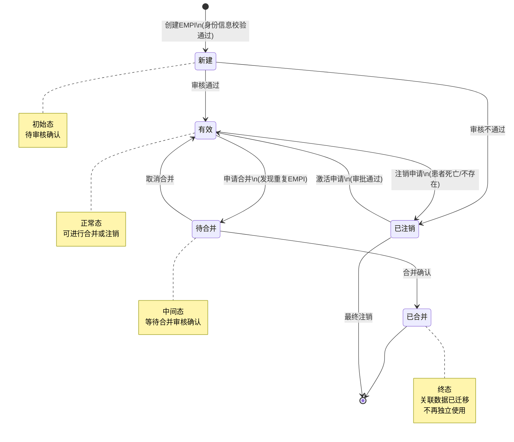
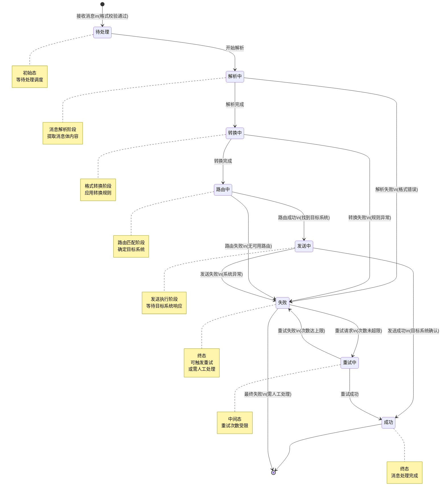
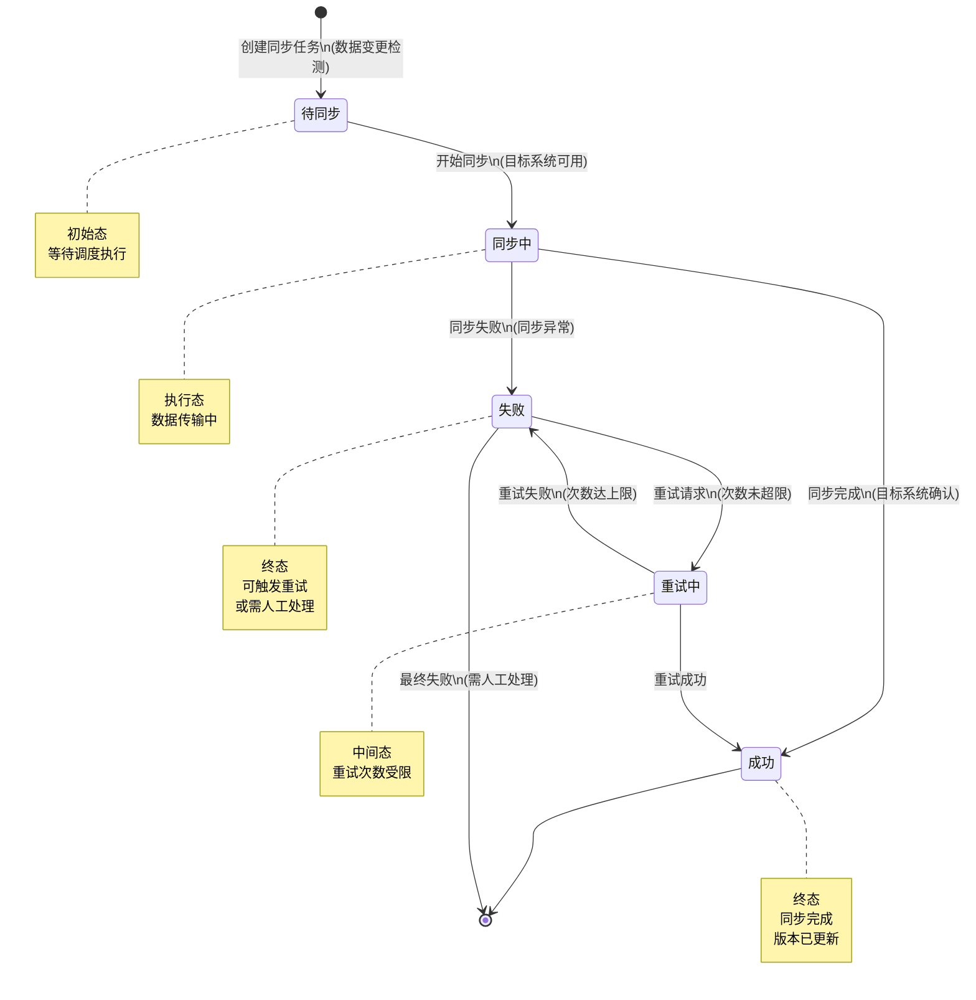
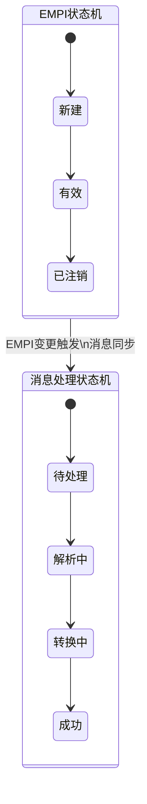
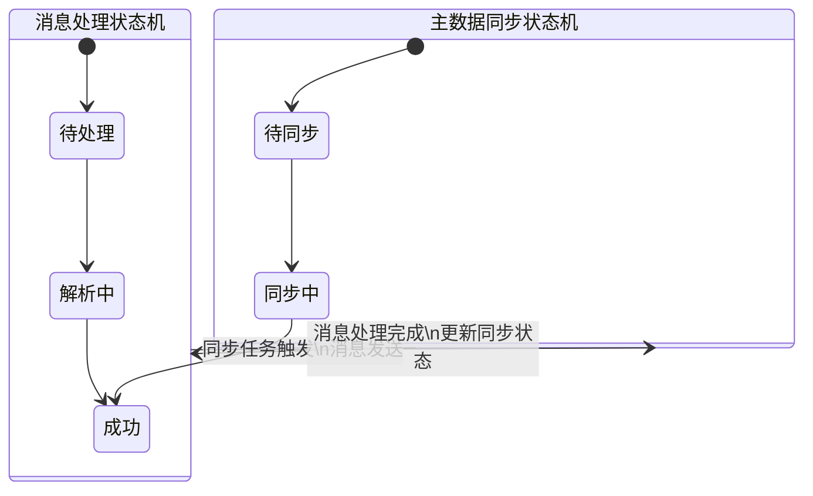

# M10-集成平台 - 状态机设计文档

> **文档编号**: YUDAO-HIS-SM-M10
> **版本**: V1.0
> **创建日期**: 2026-06-22
> **状态**: 设计中
> **关联文档**: YUDAO-HIS-SM-001 (全局状态机设计文档)

---

## 1. 概述

本文档定义集成平台模块(M10)核心业务对象的状态机设计，包括EMPI状态机、消息处理状态机和主数据同步状态机。

### 1.1 状态机清单

| 序号 | 状态机编号 | 状态机名称 | 适用对象 | 优先级 | 业务规则 |
|------|------------|----------|----------|--------|----------|
| 1 | SM-101 | EMPI状态机 | mpi_empi | P0 | BR-EMPI-001 |
| 2 | SM-102 | 消息处理状态机 | ip_message | P0 | BR-MSG-001 |
| 3 | SM-103 | 主数据同步状态机 | ip_master_sync | P0 | BR-MD-001 |

---

## 2. EMPI状态机 (SM-101)

### 2.1 基本信息

| 属性 | 内容 |
|------|------|
| 状态机编号 | SM-101 |
| 状态机名称 | EMPI状态机 |
| 适用对象 | mpi_empi（企业级主患者索引表） |
| 状态字段 | empi_status |
| 业务规则 | BR-EMPI-001: EMPI状态流转规则 |
| 优先级 | P0（MVP必需） |

### 2.2 状态列表

| 状态编码 | 状态名称 | 状态描述 | 状态类型 | 允许操作 |
|----------|----------|----------|----------|----------|
| 1 | 新建 | EMPI记录刚创建，待审核 | 初始态 | 审核、注销 |
| 2 | 有效 | EMPI审核通过，正常使用 | 正常态 | 合并、注销 |
| 3 | 待合并 | 申请合并，等待审核 | 中间态 | 合并确认、取消合并 |
| 4 | 已合并 | 已合并到主EMPI记录 | 终态 | 无 |
| 5 | 已注销 | EMPI记录已注销 | 终态 | 激活 |

### 2.3 状态流转表

| 当前状态 | 触发事件 | 目标状态 | 前置条件 | 执行操作 | 关联规则 |
|----------|----------|----------|----------|----------|----------|
| - | 创建EMPI | 新建(1) | 身份信息校验通过 | 创建EMPI记录、生成唯一标识 | BR-EMPI-002 |
| 新建(1) | 审核通过 | 有效(2) | 信息完整、无重复 | 更新审核时间、激活患者档案 | BR-EMPI-003 |
| 新建(1) | 审核不通过 | 已注销(5) | 存在严重错误 | 记录不通过原因、归档 | - |
| 有效(2) | 申请合并 | 待合并(3) | 发现重复EMPI | 创建合并申请、关联目标EMPI | BR-EMPI-004 |
| 有效(2) | 注销申请 | 已注销(5) | 患者不存在或死亡 | 记录注销原因、归档档案 | BR-EMPI-005 |
| 待合并(3) | 合并确认 | 已合并(4) | 目标EMPI有效 | 迁移关联数据、更新索引引用 | BR-EMPI-006 |
| 待合并(3) | 取消合并 | 有效(2) | 合并申请撤回 | 删除合并申请、恢复状态 | - |
| 已注销(5) | 激活申请 | 有效(2) | 审批通过 | 恢复患者档案、重新激活 | BR-EMPI-007 |

### 2.4 状态流转图



### 2.5 状态约束规则

1. **EMPI唯一性**: 同一患者只能有一条有效EMPI记录（BR-EMPI-001）
2. **合并限制**: 只有"有效"状态的EMPI可以申请合并
3. **合并方向**: 被合并的EMPI状态变更为"已合并"，目标EMPI保持"有效"
4. **注销审批**: 注销需要管理员审批，并记录注销原因
5. **数据迁移**: 合并操作需同步迁移就诊记录、处方记录等关联数据
6. **审计追踪**: 所有状态变更需记录操作人和时间，保留完整审计日志

### 2.6 Java枚举定义

```java
/**
 * EMPI状态枚举
 */
public enum EmpiStatusEnum implements StatusEnum {

    NEW(1, "新建", "EMPI记录刚创建，待审核"),
    VALID(2, "有效", "EMPI审核通过，正常使用"),
    MERGING(3, "待合并", "申请合并，等待审核"),
    MERGED(4, "已合并", "已合并到主EMPI记录"),
    CANCELLED(5, "已注销", "EMPI记录已注销");

    private final Integer code;
    private final String name;
    private final String description;

    EmpiStatusEnum(Integer code, String name, String description) {
        this.code = code;
        this.name = name;
        this.description = description;
    }

    @Override
    public Integer getCode() {
        return code;
    }

    @Override
    public String getName() {
        return name;
    }

    @Override
    public String getDescription() {
        return description;
    }

    /**
     * 判断是否可以合并
     */
    public boolean canMerge() {
        return this == VALID;
    }

    /**
     * 判断是否可以注销
     */
    public boolean canCancel() {
        return this == NEW || this == VALID;
    }

    /**
     * 判断是否可以激活
     */
    public boolean canActivate() {
        return this == CANCELLED;
    }

    /**
     * 判断是否为终态
     */
    public boolean isFinal() {
        return this == MERGED;
    }

    /**
     * 判断是否有效可用
     */
    public boolean isUsable() {
        return this == VALID;
    }
}
```

---

## 3. 消息处理状态机 (SM-102)

### 3.1 基本信息

| 属性 | 内容 |
|------|------|
| 状态机编号 | SM-102 |
| 状态机名称 | 消息处理状态机 |
| 适用对象 | ip_message（集成平台消息表） |
| 状态字段 | message_status |
| 业务规则 | BR-MSG-001: 消息处理状态流转规则 |
| 优先级 | P0（MVP必需） |

### 3.2 状态列表

| 状态编码 | 状态名称 | 状态描述 | 状态类型 | 允许操作 |
|----------|----------|----------|----------|----------|
| 1 | 待处理 | 消息已接收，等待处理 | 初始态 | 解析 |
| 2 | 解析中 | 正在解析消息内容 | 中间态 | 解析完成、解析失败 |
| 3 | 转换中 | 正在进行消息格式转换 | 中间态 | 转换完成、转换失败 |
| 4 | 路由中 | 正在路由到目标系统 | 中间态 | 发送、路由失败 |
| 5 | 发送中 | 正在发送到目标系统 | 中间态 | 发送成功、发送失败 |
| 6 | 成功 | 消息处理完成 | 终态 | 无 |
| 7 | 失败 | 消息处理失败 | 终态 | 重试 |
| 8 | 重试中 | 正在重试处理 | 中间态 | 成功、失败 |

### 3.3 状态流转表

| 当前状态 | 触发事件 | 目标状态 | 前置条件 | 执行操作 | 关联规则 |
|----------|----------|----------|----------|----------|----------|
| - | 接收消息 | 待处理(1) | 消息格式校验通过 | 记录消息、分配消息ID | BR-MSG-002 |
| 待处理(1) | 开始解析 | 解析中(2) | 解析器可用 | 调用解析器、提取消息体 | - |
| 解析中(2) | 解析完成 | 转换中(3) | 解析成功 | 提取业务数据、保存解析结果 | - |
| 解析中(2) | 解析失败 | 失败(7) | 格式错误 | 记录错误信息、发送告警 | BR-MSG-003 |
| 转换中(3) | 转换完成 | 路由中(4) | 转换成功 | 应用转换规则、生成目标格式 | - |
| 转换中(3) | 转换失败 | 失败(7) | 转换规则异常 | 记录错误、通知管理员 | BR-MSG-004 |
| 路由中(4) | 路由成功 | 发送中(5) | 找到目标路由 | 确定目标系统、准备发送 | - |
| 路由中(4) | 路由失败 | 失败(7) | 无可用路由 | 记录路由错误、告警 | BR-MSG-005 |
| 发送中(5) | 发送成功 | 成功(6) | 目标系统确认 | 记录响应、更新处理时间 | BR-MSG-006 |
| 发送中(5) | 发送失败 | 失败(7) | 目标系统异常 | 记录错误、触发告警 | BR-MSG-007 |
| 失败(7) | 重试请求 | 重试中(8) | 重试次数未超限 | 重置状态、重新处理 | BR-MSG-008 |
| 重试中(8) | 重试成功 | 成功(6) | 处理成功 | 记录成功、更新重试次数 | - |
| 重试中(8) | 重试失败 | 失败(7) | 重试次数达到上限 | 记录最终失败、告警通知 | BR-MSG-008 |

### 3.4 状态流转图



### 3.5 状态约束规则

1. **消息持久化**: 所有状态变更前需持久化消息内容（BR-MSG-001）
2. **幂等处理**: 同一消息ID不可重复处理，需做幂等校验
3. **重试限制**: 最大重试次数为3次，超过需人工介入（BR-MSG-008）
4. **超时控制**: 各阶段处理超时时间：解析30秒、转换60秒、发送120秒
5. **顺序保证**: 同一患者/业务的关联消息需按顺序处理
6. **错误分类**: 区分临时性错误（可重试）和永久性错误（需人工处理）
7. **告警机制**: 失败消息需实时告警，通知相关运维人员

### 3.6 Java枚举定义

```java
/**
 * 消息处理状态枚举
 */
public enum MessageStatusEnum implements StatusEnum {

    PENDING(1, "待处理", "消息已接收，等待处理"),
    PARSING(2, "解析中", "正在解析消息内容"),
    CONVERTING(3, "转换中", "正在进行消息格式转换"),
    ROUTING(4, "路由中", "正在路由到目标系统"),
    SENDING(5, "发送中", "正在发送到目标系统"),
    SUCCESS(6, "成功", "消息处理完成"),
    FAILED(7, "失败", "消息处理失败"),
    RETRYING(8, "重试中", "正在重试处理");

    private final Integer code;
    private final String name;
    private final String description;

    MessageStatusEnum(Integer code, String name, String description) {
        this.code = code;
        this.name = name;
        this.description = description;
    }

    @Override
    public Integer getCode() {
        return code;
    }

    @Override
    public String getName() {
        return name;
    }

    @Override
    public String getDescription() {
        return description;
    }

    /**
     * 判断是否可以重试
     */
    public boolean canRetry() {
        return this == FAILED;
    }

    /**
     * 判断是否为终态
     */
    public boolean isFinal() {
        return this == SUCCESS;
    }

    /**
     * 判断是否处理中
     */
    public boolean isProcessing() {
        return this == PARSING || this == CONVERTING || 
               this == ROUTING || this == SENDING || this == RETRYING;
    }

    /**
     * 判断是否失败
     */
    public boolean isFailed() {
        return this == FAILED;
    }

    /**
     * 判断是否成功
     */
    public boolean isSuccess() {
        return this == SUCCESS;
    }
}
```

---

## 4. 主数据同步状态机 (SM-103)

### 4.1 基本信息

| 属性 | 内容 |
|------|------|
| 状态机编号 | SM-103 |
| 状态机名称 | 主数据同步状态机 |
| 适用对象 | ip_master_sync（主数据同步记录表） |
| 状态字段 | sync_status |
| 业务规则 | BR-MD-001: 主数据同步状态流转规则 |
| 优先级 | P0（MVP必需） |

### 4.2 状态列表

| 状态编码 | 状态名称 | 状态描述 | 状态类型 | 允许操作 |
|----------|----------|----------|----------|----------|
| 1 | 待同步 | 同步任务已创建，等待执行 | 初始态 | 执行同步 |
| 2 | 同步中 | 正在执行同步操作 | 中间态 | 同步完成、同步失败 |
| 3 | 成功 | 同步执行成功 | 终态 | 无 |
| 4 | 失败 | 同步执行失败 | 终态 | 重试 |
| 5 | 重试中 | 正在重试同步 | 中间态 | 成功、失败 |

### 4.3 状态流转表

| 当前状态 | 触发事件 | 目标状态 | 前置条件 | 执行操作 | 关联规则 |
|----------|----------|----------|----------|----------|----------|
| - | 创建同步任务 | 待同步(1) | 数据变更检测 | 创建同步记录、记录变更内容 | BR-MD-002 |
| 待同步(1) | 开始同步 | 同步中(2) | 目标系统可用 | 调用同步接口、传输数据 | - |
| 同步中(2) | 同步完成 | 成功(3) | 目标系统确认 | 更新同步时间、记录版本 | BR-MD-003 |
| 同步中(2) | 同步失败 | 失败(4) | 同步异常 | 记录错误信息、发送告警 | BR-MD-004 |
| 失败(4) | 重试请求 | 重试中(5) | 重试次数未超限 | 重新执行同步 | BR-MD-005 |
| 重试中(5) | 重试成功 | 成功(3) | 同步成功 | 记录成功、更新版本 | - |
| 重试中(5) | 重试失败 | 失败(4) | 重试次数达上限 | 记录最终失败、告警 | BR-MD-005 |

### 4.4 状态流转图



### 4.5 状态约束规则

1. **增量同步**: 优先支持增量同步，记录同步版本号（BR-MD-001）
2. **版本控制**: 每次同步记录数据版本，支持版本回溯
3. **冲突处理**: 数据冲突时采用"后写入覆盖"或"人工仲裁"策略（BR-MD-006）
4. **重试限制**: 最大重试次数为5次，超过需人工介入（BR-MD-005）
5. **超时控制**: 单次同步超时时间300秒
6. **事务保证**: 同步操作需保证事务完整性，失败时自动回滚
7. **同步顺序**: 同一主数据的同步任务需按顺序执行，不可并行
8. **数据校验**: 同步前进行数据完整性和一致性校验

### 4.6 Java枚举定义

```java
/**
 * 主数据同步状态枚举
 */
public enum MasterDataSyncStatusEnum implements StatusEnum {

    PENDING(1, "待同步", "同步任务已创建，等待执行"),
    SYNCING(2, "同步中", "正在执行同步操作"),
    SUCCESS(3, "成功", "同步执行成功"),
    FAILED(4, "失败", "同步执行失败"),
    RETRYING(5, "重试中", "正在重试同步");

    private final Integer code;
    private final String name;
    private final String description;

    MasterDataSyncStatusEnum(Integer code, String name, String description) {
        this.code = code;
        this.name = name;
        this.description = description;
    }

    @Override
    public Integer getCode() {
        return code;
    }

    @Override
    public String getName() {
        return name;
    }

    @Override
    public String getDescription() {
        return description;
    }

    /**
     * 判断是否可以重试
     */
    public boolean canRetry() {
        return this == FAILED;
    }

    /**
     * 判断是否为终态
     */
    public boolean isFinal() {
        return this == SUCCESS;
    }

    /**
     * 判断是否处理中
     */
    public boolean isProcessing() {
        return this == SYNCING || this == RETRYING;
    }

    /**
     * 判断是否失败
     */
    public boolean isFailed() {
        return this == FAILED;
    }

    /**
     * 判断是否成功
     */
    public boolean isSuccess() {
        return this == SUCCESS;
    }

    /**
     * 判断是否可以执行同步
     */
    public boolean canSync() {
        return this == PENDING;
    }
}
```

---

## 5. 状态机关联关系

### 5.1 EMPI与消息处理关联



### 5.2 主数据同步与消息处理关联



---

## 6. 状态机监控与告警

### 6.1 监控指标

| 状态机 | 监控指标 | 告警阈值 | 告警级别 |
|--------|----------|----------|----------|
| EMPI状态机 | 待审核数量 | >100 | 警告 |
| EMPI状态机 | 待合并数量 | >50 | 警告 |
| 消息处理状态机 | 待处理队列长度 | >1000 | 警告 |
| 消息处理状态机 | 失败率 | >5% | 严重 |
| 消息处理状态机 | 处理延迟(秒) | >300 | 警告 |
| 主数据同步状态机 | 待同步队列长度 | >500 | 警告 |
| 主数据同步状态机 | 同步失败率 | >3% | 严重 |
| 主数据同步状态机 | 同步延迟(秒) | >600 | 警告 |

### 6.2 告警规则

1. **消息堆积告警**: 待处理消息超过阈值，发送运维告警
2. **失败率告警**: 处理失败率超过阈值，触发严重告警
3. **超时告警**: 消息处理时间超过阈值，记录慢处理日志
4. **重试告警**: 重试次数达到上限，通知人工介入
5. **系统异常告警**: 目标系统不可用，触发系统级告警

---

## 附录: 变更历史

| 版本 | 日期 | 变更内容 | 变更人 |
|------|------|----------|--------|
| V1.0 | 2026-06-22 | 从全局状态机设计文档拆分 | YUDAO-AI-HIS架构组 |

---

> **最后更新**: 2026-06-22
