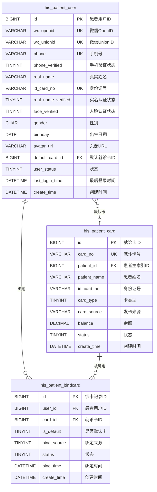
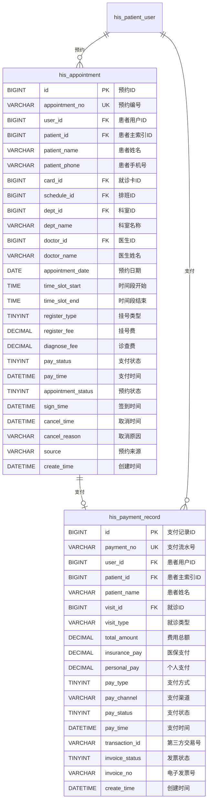
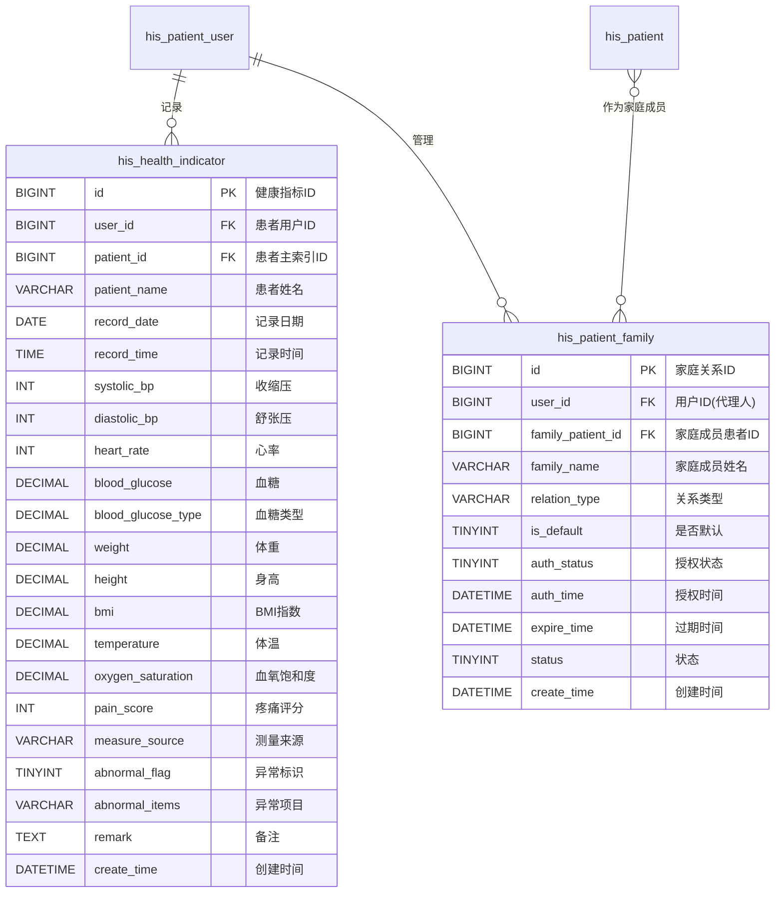
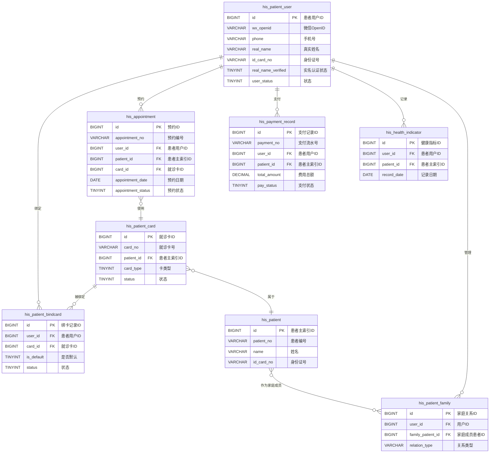

# M11-患者服务 - 数据库设计文档

> **文档编号**: YUDAO-HIS-DB-M11
> **版本**: V1.0
> **创建日期**: 2026-06-22
> **状态**: 设计中
> **参考文档**: YUDAO-HIS-DB-001, YUDAO-HIS-PRD-M11

---

## 1. 模块概述

### 1.1 模块范围

本模块包含患者服务子系统相关的数据库表设计，包括：
- 患者用户管理（微信/手机登录、实名认证）
- 就诊卡管理（绑卡、解绑、切换）
- 预约挂号管理（在线预约、预约记录）
- 在线缴费管理（支付记录、电子发票）
- 健康档案管理（健康指标记录）
- 家庭成员管理（代挂号、代缴费）

### 1.2 模块表清单

| 表名 | 中文名 | FHIR映射 | 年增量估算 |
|------|--------|----------|------------|
| his_patient_user | 患者用户表 | Patient(扩展) | 约100万条 |
| his_patient_card | 就诊卡表 | - | 约200万条 |
| his_patient_bindcard | 患者绑卡记录 | - | 约150万条 |
| his_appointment | 预约记录表 | Appointment | 约100万条 |
| his_payment_record | 支付记录表 | PaymentNotice | 约300万条 |
| his_health_indicator | 健康指标记录表 | Observation | 约500万条 |
| his_patient_family | 家庭成员关系表 | RelatedPerson | 约50万条 |

---

## 2. ER图设计

### 2.1 患者用户域 ER图



### 2.2 预约缴费域 ER图



### 2.3 健康档案域 ER图



### 2.4 全模块 ER图



---

## 3. DDL脚本设计

### 3.1 患者用户表 (his_patient_user)

```sql
-- =============================================
-- 患者用户表
-- 说明: 患者门户用户，支持微信授权、手机验证登录
-- 对应FHIR资源: Patient(扩展)
-- 年增量估算: 约100万条
-- =============================================
CREATE TABLE `his_patient_user` (
    `id` BIGINT NOT NULL AUTO_INCREMENT COMMENT '患者用户ID',
    `wx_openid` VARCHAR(64) COMMENT '微信OpenID',
    `wx_unionid` VARCHAR(64) COMMENT '微信UnionID',
    `alipay_user_id` VARCHAR(64) COMMENT '支付宝用户ID',
    `phone` VARCHAR(20) NOT NULL COMMENT '手机号',
    `phone_encrypt` VARCHAR(100) COMMENT '手机号加密',
    `phone_verified` TINYINT NOT NULL DEFAULT 0 COMMENT '手机验证状态: 0未验证/1已验证',
    `real_name` VARCHAR(50) COMMENT '真实姓名(实名认证后)',
    `id_card_no` VARCHAR(18) COMMENT '身份证号(实名认证后)',
    `id_card_encrypt` VARCHAR(100) COMMENT '身份证号加密',
    `real_name_verified` TINYINT NOT NULL DEFAULT 0 COMMENT '实名认证状态: 0未认证/1已认证',
    `face_verified` TINYINT DEFAULT 0 COMMENT '人脸认证状态: 0未认证/1已认证',
    `face_verify_time` DATETIME COMMENT '人脸认证时间',
    `empi_id` VARCHAR(30) COMMENT '患者主索引ID(实名认证后关联)',
    `gender` CHAR(1) COMMENT '性别: 1男/2女/9未知',
    `birthday` DATE COMMENT '出生日期',
    `avatar_url` VARCHAR(255) COMMENT '头像URL',
    `default_card_id` BIGINT COMMENT '默认就诊卡ID',
    `user_status` TINYINT NOT NULL DEFAULT 1 COMMENT '状态: 1正常/2冻结/3注销',
    `freeze_reason` VARCHAR(200) COMMENT '冻结原因',
    `freeze_time` DATETIME COMMENT '冻结时间',
    `freeze_by` VARCHAR(50) COMMENT '冻结操作人',
    `register_source` VARCHAR(20) NOT NULL COMMENT '注册来源: wechat/alipay/h5/selfservice',
    `register_ip` VARCHAR(50) COMMENT '注册IP',
    `last_login_time` DATETIME COMMENT '最后登录时间',
    `last_login_ip` VARCHAR(50) COMMENT '最后登录IP',
    `login_count` INT DEFAULT 0 COMMENT '登录次数',
    `remark` VARCHAR(500) COMMENT '备注',
    `creator` VARCHAR(64) DEFAULT '' COMMENT '创建者',
    `create_time` DATETIME NOT NULL DEFAULT CURRENT_TIMESTAMP COMMENT '创建时间',
    `updater` VARCHAR(64) DEFAULT '' COMMENT '更新者',
    `update_time` DATETIME NOT NULL DEFAULT CURRENT_TIMESTAMP ON UPDATE CURRENT_TIMESTAMP COMMENT '更新时间',
    `deleted` BIT(1) NOT NULL DEFAULT b'0' COMMENT '是否删除',
    `tenant_id` BIGINT NOT NULL DEFAULT 0 COMMENT '租户编号',
    PRIMARY KEY (`id`),
    UNIQUE KEY `uk_wx_openid` (`wx_openid`),
    UNIQUE KEY `uk_wx_unionid` (`wx_unionid`),
    UNIQUE KEY `uk_phone` (`phone`),
    UNIQUE KEY `uk_id_card_no` (`id_card_no`),
    KEY `idx_patient_user_name` (`real_name`),
    KEY `idx_patient_user_status` (`user_status`),
    KEY `idx_patient_user_empi` (`empi_id`)
) ENGINE=InnoDB DEFAULT CHARSET=utf8mb4 COLLATE=utf8mb4_unicode_ci COMMENT='患者用户表';
```

### 3.2 就诊卡表 (his_patient_card)

```sql
-- =============================================
-- 就诊卡表
-- 说明: 医院发行的就诊卡，一张卡对应一个患者
-- 年增量估算: 约200万条
-- =============================================
CREATE TABLE `his_patient_card` (
    `id` BIGINT NOT NULL AUTO_INCREMENT COMMENT '就诊卡ID',
    `card_no` VARCHAR(30) NOT NULL COMMENT '就诊卡号',
    `patient_id` BIGINT NOT NULL COMMENT '患者主索引ID',
    `patient_name` VARCHAR(50) NOT NULL COMMENT '患者姓名',
    `id_card_no` VARCHAR(18) COMMENT '身份证号',
    `gender` CHAR(1) COMMENT '性别: 1男/2女',
    `birthday` DATE COMMENT '出生日期',
    `phone` VARCHAR(20) COMMENT '手机号',
    `card_type` TINYINT NOT NULL DEFAULT 1 COMMENT '卡类型: 1普通卡/2医保卡/3公费医疗卡',
    `card_level` TINYINT DEFAULT 1 COMMENT '卡级别: 1普通/2VIP',
    `card_source` VARCHAR(50) COMMENT '发卡来源: window/wechat/selfservice',
    `issue_dept_id` BIGINT COMMENT '发卡科室ID',
    `issue_dept_name` VARCHAR(100) COMMENT '发卡科室名称',
    `issue_time` DATETIME COMMENT '发卡时间',
    `issue_operator` VARCHAR(50) COMMENT '发卡操作人',
    `balance` DECIMAL(10,2) NOT NULL DEFAULT 0.00 COMMENT '余额',
    `freeze_balance` DECIMAL(10,2) DEFAULT 0.00 COMMENT '冻结余额',
    `available_balance` DECIMAL(10,2) DEFAULT 0.00 COMMENT '可用余额',
    `total_recharge` DECIMAL(10,2) DEFAULT 0.00 COMMENT '累计充值',
    `total_consume` DECIMAL(10,2) DEFAULT 0.00 COMMENT '累计消费',
    `password` VARCHAR(100) COMMENT '支付密码(加密)',
    `password_set_time` DATETIME COMMENT '密码设置时间',
    `status` TINYINT NOT NULL DEFAULT 1 COMMENT '状态: 1正常/2挂失/3冻结/4注销',
    `loss_time` DATETIME COMMENT '挂失时间',
    `loss_reason` VARCHAR(200) COMMENT '挂失原因',
    `cancel_time` DATETIME COMMENT '注销时间',
    `cancel_reason` VARCHAR(200) COMMENT '注销原因',
    `remark` VARCHAR(500) COMMENT '备注',
    `creator` VARCHAR(64) DEFAULT '' COMMENT '创建者',
    `create_time` DATETIME NOT NULL DEFAULT CURRENT_TIMESTAMP COMMENT '创建时间',
    `updater` VARCHAR(64) DEFAULT '' COMMENT '更新者',
    `update_time` DATETIME NOT NULL DEFAULT CURRENT_TIMESTAMP ON UPDATE CURRENT_TIMESTAMP COMMENT '更新时间',
    `deleted` BIT(1) NOT NULL DEFAULT b'0' COMMENT '是否删除',
    `tenant_id` BIGINT NOT NULL DEFAULT 0 COMMENT '租户编号',
    PRIMARY KEY (`id`),
    UNIQUE KEY `uk_card_no` (`card_no`),
    KEY `idx_card_patient` (`patient_id`),
    KEY `idx_card_id_card` (`id_card_no`),
    KEY `idx_card_status` (`status`),
    KEY `idx_card_phone` (`phone`)
) ENGINE=InnoDB DEFAULT CHARSET=utf8mb4 COLLATE=utf8mb4_unicode_ci COMMENT='就诊卡表';
```

### 3.3 患者绑卡记录表 (his_patient_bindcard)

```sql
-- =============================================
-- 患者绑卡记录表
-- 说明: 患者用户绑定就诊卡的记录，支持一人绑多卡
-- 年增量估算: 约150万条
-- =============================================
CREATE TABLE `his_patient_bindcard` (
    `id` BIGINT NOT NULL AUTO_INCREMENT COMMENT '绑卡记录ID',
    `user_id` BIGINT NOT NULL COMMENT '患者用户ID',
    `card_id` BIGINT NOT NULL COMMENT '就诊卡ID',
    `card_no` VARCHAR(30) NOT NULL COMMENT '就诊卡号',
    `patient_id` BIGINT NOT NULL COMMENT '患者主索引ID',
    `patient_name` VARCHAR(50) NOT NULL COMMENT '患者姓名',
    `relation_type` TINYINT DEFAULT 1 COMMENT '与卡主关系: 1本人/2父母/3子女/4配偶/5其他',
    `is_default` TINYINT NOT NULL DEFAULT 0 COMMENT '是否默认卡: 0否/1是',
    `bind_source` VARCHAR(20) NOT NULL COMMENT '绑定来源: wechat/alipay/h5/selfservice',
    `bind_ip` VARCHAR(50) COMMENT '绑定IP',
    `bind_device` VARCHAR(100) COMMENT '绑定设备',
    `auth_code` VARCHAR(50) COMMENT '授权码(非本人绑卡)',
    `auth_time` DATETIME COMMENT '授权时间',
    `status` TINYINT NOT NULL DEFAULT 1 COMMENT '状态: 1已绑定/2已解绑',
    `bind_time` DATETIME NOT NULL COMMENT '绑定时间',
    `unbind_time` DATETIME COMMENT '解绑时间',
    `unbind_reason` VARCHAR(200) COMMENT '解绑原因',
    `unbind_source` VARCHAR(20) COMMENT '解绑来源',
    `remark` VARCHAR(500) COMMENT '备注',
    `creator` VARCHAR(64) DEFAULT '' COMMENT '创建者',
    `create_time` DATETIME NOT NULL DEFAULT CURRENT_TIMESTAMP COMMENT '创建时间',
    `updater` VARCHAR(64) DEFAULT '' COMMENT '更新者',
    `update_time` DATETIME NOT NULL DEFAULT CURRENT_TIMESTAMP ON UPDATE CURRENT_TIMESTAMP COMMENT '更新时间',
    `deleted` BIT(1) NOT NULL DEFAULT b'0' COMMENT '是否删除',
    `tenant_id` BIGINT NOT NULL DEFAULT 0 COMMENT '租户编号',
    PRIMARY KEY (`id`),
    UNIQUE KEY `uk_user_card` (`user_id`, `card_id`),
    KEY `idx_bindcard_user` (`user_id`),
    KEY `idx_bindcard_card` (`card_id`),
    KEY `idx_bindcard_patient` (`patient_id`),
    KEY `idx_bindcard_status` (`status`),
    KEY `idx_bindcard_default` (`user_id`, `is_default`)
) ENGINE=InnoDB DEFAULT CHARSET=utf8mb4 COLLATE=utf8mb4_unicode_ci COMMENT='患者绑卡记录表';
```

### 3.4 预约记录表 (his_appointment)

```sql
-- =============================================
-- 预约记录表
-- 说明: 患者通过患者门户进行在线预约挂号的记录
-- 对应FHIR资源: Appointment
-- 年增量估算: 约100万条
-- =============================================
CREATE TABLE `his_appointment` (
    `id` BIGINT NOT NULL AUTO_INCREMENT COMMENT '预约ID',
    `appointment_no` VARCHAR(30) NOT NULL COMMENT '预约编号',
    `user_id` BIGINT NOT NULL COMMENT '患者用户ID',
    `patient_id` BIGINT NOT NULL COMMENT '患者主索引ID',
    `patient_name` VARCHAR(50) NOT NULL COMMENT '患者姓名',
    `patient_phone` VARCHAR(20) NOT NULL COMMENT '患者手机号',
    `id_card_no` VARCHAR(18) COMMENT '身份证号',
    `card_id` BIGINT COMMENT '就诊卡ID',
    `card_no` VARCHAR(30) COMMENT '就诊卡号',
    `schedule_id` BIGINT NOT NULL COMMENT '排班ID',
    `dept_id` BIGINT NOT NULL COMMENT '科室ID',
    `dept_name` VARCHAR(100) NOT NULL COMMENT '科室名称',
    `doctor_id` BIGINT COMMENT '医生ID',
    `doctor_name` VARCHAR(50) COMMENT '医生姓名',
    `doctor_title` VARCHAR(50) COMMENT '医生职称',
    `appointment_date` DATE NOT NULL COMMENT '预约日期',
    `time_period` VARCHAR(10) NOT NULL COMMENT '时段: AM上午/PM下午',
    `time_slot_start` TIME NOT NULL COMMENT '时间段开始',
    `time_slot_end` TIME NOT NULL COMMENT '时间段结束',
    `time_slot` VARCHAR(20) COMMENT '时间段描述: 09:00-09:30',
    `queue_no` VARCHAR(10) COMMENT '排队序号',
    `register_type` TINYINT NOT NULL COMMENT '挂号类型: 1普通/2专家',
    `register_fee` DECIMAL(10,2) NOT NULL DEFAULT 0.00 COMMENT '挂号费',
    `diagnose_fee` DECIMAL(10,2) DEFAULT 0.00 COMMENT '诊查费',
    `total_fee` DECIMAL(10,2) NOT NULL DEFAULT 0.00 COMMENT '费用合计',
    `pay_status` TINYINT NOT NULL DEFAULT 0 COMMENT '支付状态: 0未支付/1已支付/2已退款',
    `pay_type` TINYINT COMMENT '支付方式: 1微信/2支付宝/3医保/4现金',
    `pay_time` DATETIME COMMENT '支付时间',
    `pay_trade_no` VARCHAR(50) COMMENT '支付流水号',
    `appointment_status` TINYINT NOT NULL DEFAULT 1 COMMENT '状态: 1已预约/2已支付/3已签到/4已取消/5已过期/6已完成',
    `sign_type` TINYINT COMMENT '签到方式: 1扫码签到/2定位签到/3人工签到',
    `sign_time` DATETIME COMMENT '签到时间',
    `sign_location` VARCHAR(100) COMMENT '签到位置',
    `register_id` BIGINT COMMENT '签到后生成的挂号ID',
    `cancel_time` DATETIME COMMENT '取消时间',
    `cancel_reason` VARCHAR(200) COMMENT '取消原因',
    `cancel_by` VARCHAR(50) COMMENT '取消人',
    `cancel_source` VARCHAR(20) COMMENT '取消来源',
    `refund_amount` DECIMAL(10,2) COMMENT '退款金额',
    `refund_time` DATETIME COMMENT '退款时间',
    `source` VARCHAR(20) NOT NULL COMMENT '预约来源: wechat/alipay/h5/selfservice',
    `source_ip` VARCHAR(50) COMMENT '来源IP',
    `source_device` VARCHAR(100) COMMENT '来源设备',
    `expire_time` DATETIME COMMENT '过期时间',
    `reminder_sent` TINYINT DEFAULT 0 COMMENT '是否已发送提醒: 0否/1是',
    `reminder_time` DATETIME COMMENT '提醒发送时间',
    `agent_user_id` BIGINT COMMENT '代预约用户ID',
    `agent_relation` VARCHAR(20) COMMENT '代理关系',
    `remark` VARCHAR(500) COMMENT '备注',
    `creator` VARCHAR(64) DEFAULT '' COMMENT '创建者',
    `create_time` DATETIME NOT NULL DEFAULT CURRENT_TIMESTAMP COMMENT '创建时间',
    `updater` VARCHAR(64) DEFAULT '' COMMENT '更新者',
    `update_time` DATETIME NOT NULL DEFAULT CURRENT_TIMESTAMP ON UPDATE CURRENT_TIMESTAMP COMMENT '更新时间',
    `deleted` BIT(1) NOT NULL DEFAULT b'0' COMMENT '是否删除',
    `tenant_id` BIGINT NOT NULL DEFAULT 0 COMMENT '租户编号',
    PRIMARY KEY (`id`),
    UNIQUE KEY `uk_appointment_no` (`appointment_no`),
    KEY `idx_appointment_user` (`user_id`),
    KEY `idx_appointment_patient` (`patient_id`),
    KEY `idx_appointment_card` (`card_id`),
    KEY `idx_appointment_schedule` (`schedule_id`),
    KEY `idx_appointment_dept` (`dept_id`),
    KEY `idx_appointment_doctor` (`doctor_id`),
    KEY `idx_appointment_date` (`appointment_date`),
    KEY `idx_appointment_status` (`appointment_status`),
    KEY `idx_appointment_date_status` (`appointment_date`, `appointment_status`),
    KEY `idx_appointment_phone` (`patient_phone`),
    KEY `idx_appointment_register` (`register_id`)
) ENGINE=InnoDB DEFAULT CHARSET=utf8mb4 COLLATE=utf8mb4_unicode_ci COMMENT='预约记录表';
```

### 3.5 支付记录表 (his_payment_record)

```sql
-- =============================================
-- 支付记录表
-- 说明: 患者通过患者门户进行在线支付的记录
-- 对应FHIR资源: PaymentNotice
-- 年增量估算: 约300万条
-- =============================================
CREATE TABLE `his_payment_record` (
    `id` BIGINT NOT NULL AUTO_INCREMENT COMMENT '支付记录ID',
    `payment_no` VARCHAR(30) NOT NULL COMMENT '支付流水号',
    `user_id` BIGINT NOT NULL COMMENT '患者用户ID',
    `patient_id` BIGINT NOT NULL COMMENT '患者主索引ID',
    `patient_name` VARCHAR(50) NOT NULL COMMENT '患者姓名',
    `card_id` BIGINT COMMENT '就诊卡ID',
    `card_no` VARCHAR(30) COMMENT '就诊卡号',
    `visit_id` BIGINT COMMENT '就诊ID',
    `visit_type` VARCHAR(20) COMMENT '就诊类型: OP门诊/IP住院',
    `visit_no` VARCHAR(30) COMMENT '就诊号',
    `visit_date` DATE COMMENT '就诊日期',
    `dept_id` BIGINT COMMENT '科室ID',
    `dept_name` VARCHAR(100) COMMENT '科室名称',
    `doctor_id` BIGINT COMMENT '医生ID',
    `doctor_name` VARCHAR(50) COMMENT '医生姓名',
    `business_type` VARCHAR(20) NOT NULL COMMENT '业务类型: REGISTRATION挂号/PRESCRIPTION处方/EXAM检查/LAB检验/INPATIENT住院',
    `business_id` BIGINT COMMENT '业务ID',
    `business_no` VARCHAR(30) COMMENT '业务编号',
    `total_amount` DECIMAL(12,2) NOT NULL COMMENT '费用总额',
    `discount_amount` DECIMAL(12,2) DEFAULT 0.00 COMMENT '优惠金额',
    `insurance_amount` DECIMAL(12,2) DEFAULT 0.00 COMMENT '医保支付金额',
    `insurance_type` TINYINT COMMENT '医保类型: 1城镇职工/2城镇居民/3新农合',
    `insurance_no` VARCHAR(30) COMMENT '医保卡号',
    `personal_amount` DECIMAL(12,2) NOT NULL COMMENT '个人支付金额',
    `pay_type` TINYINT NOT NULL COMMENT '支付方式: 1微信/2支付宝/3银行卡/4医保/5就诊卡余额',
    `pay_channel` VARCHAR(20) NOT NULL COMMENT '支付渠道: wechat/alipay/unionpay/insurance/card',
    `pay_status` TINYINT NOT NULL DEFAULT 0 COMMENT '支付状态: 0待支付/1支付中/2已支付/3支付失败/4已退款',
    `pay_time` DATETIME COMMENT '支付时间',
    `expire_time` DATETIME COMMENT '支付过期时间',
    `transaction_id` VARCHAR(64) COMMENT '第三方交易号',
    `prepay_id` VARCHAR(64) COMMENT '预支付ID',
    `pay_url` VARCHAR(255) COMMENT '支付链接',
    `qrcode_url` VARCHAR(255) COMMENT '支付二维码链接',
    `pay_ip` VARCHAR(50) COMMENT '支付IP',
    `pay_device` VARCHAR(100) COMMENT '支付设备',
    `fail_reason` VARCHAR(200) COMMENT '失败原因',
    `fail_code` VARCHAR(50) COMMENT '失败错误码',
    `invoice_status` TINYINT DEFAULT 0 COMMENT '发票状态: 0未生成/1已生成/2已开具',
    `invoice_no` VARCHAR(30) COMMENT '电子发票号',
    `invoice_url` VARCHAR(255) COMMENT '电子发票URL',
    `invoice_time` DATETIME COMMENT '发票生成时间',
    `refund_status` TINYINT DEFAULT 0 COMMENT '退款状态: 0无/1退款中/2已退款/3退款失败',
    `refund_amount` DECIMAL(12,2) COMMENT '退款金额',
    `refund_time` DATETIME COMMENT '退款时间',
    `refund_reason` VARCHAR(200) COMMENT '退款原因',
    `refund_transaction_id` VARCHAR(64) COMMENT '退款交易号',
    `fee_items` TEXT COMMENT '费用明细(JSON格式)',
    `item_count` INT DEFAULT 0 COMMENT '费用项数',
    `agent_user_id` BIGINT COMMENT '代缴费用户ID',
    `agent_relation` VARCHAR(20) COMMENT '代理关系',
    `remark` VARCHAR(500) COMMENT '备注',
    `creator` VARCHAR(64) DEFAULT '' COMMENT '创建者',
    `create_time` DATETIME NOT NULL DEFAULT CURRENT_TIMESTAMP COMMENT '创建时间',
    `updater` VARCHAR(64) DEFAULT '' COMMENT '更新者',
    `update_time` DATETIME NOT NULL DEFAULT CURRENT_TIMESTAMP ON UPDATE CURRENT_TIMESTAMP COMMENT '更新时间',
    `deleted` BIT(1) NOT NULL DEFAULT b'0' COMMENT '是否删除',
    `tenant_id` BIGINT NOT NULL DEFAULT 0 COMMENT '租户编号',
    PRIMARY KEY (`id`),
    UNIQUE KEY `uk_payment_no` (`payment_no`),
    KEY `idx_payment_user` (`user_id`),
    KEY `idx_payment_patient` (`patient_id`),
    KEY `idx_payment_card` (`card_id`),
    KEY `idx_payment_visit` (`visit_id`),
    KEY `idx_payment_business` (`business_type`, `business_id`),
    KEY `idx_payment_status` (`pay_status`),
    KEY `idx_payment_time` (`pay_time`),
    KEY `idx_payment_create_time` (`create_time`),
    KEY `idx_payment_transaction` (`transaction_id`),
    KEY `idx_payment_invoice` (`invoice_no`)
) ENGINE=InnoDB DEFAULT CHARSET=utf8mb4 COLLATE=utf8mb4_unicode_ci COMMENT='支付记录表';
```

### 3.6 健康指标记录表 (his_health_indicator)

```sql
-- =============================================
-- 健康指标记录表
-- 说明: 患者自行记录或设备同步的健康指标数据
-- 对应FHIR资源: Observation
-- 年增量估算: 约500万条
-- 分表策略: 按年分表
-- =============================================
CREATE TABLE `his_health_indicator` (
    `id` BIGINT NOT NULL AUTO_INCREMENT COMMENT '健康指标ID',
    `record_no` VARCHAR(30) COMMENT '记录编号',
    `user_id` BIGINT NOT NULL COMMENT '患者用户ID',
    `patient_id` BIGINT NOT NULL COMMENT '患者主索引ID',
    `patient_name` VARCHAR(50) NOT NULL COMMENT '患者姓名',
    `record_date` DATE NOT NULL COMMENT '记录日期',
    `record_time` TIME NOT NULL COMMENT '记录时间',
    `record_datetime` DATETIME NOT NULL COMMENT '记录时间(完整)',
    -- 血压相关
    `systolic_bp` INT COMMENT '收缩压(mmHg)',
    `diastolic_bp` INT COMMENT '舒张压(mmHg)',
    `mean_arterial_pressure` INT COMMENT '平均动脉压(mmHg)',
    `pulse_pressure` INT COMMENT '脉压差(mmHg)',
    -- 心率相关
    `heart_rate` INT COMMENT '心率(次/分)',
    `heart_rhythm` VARCHAR(20) COMMENT '心律: 规则/不规则',
    -- 血糖相关
    `blood_glucose` DECIMAL(5,2) COMMENT '血糖(mmol/L)',
    `blood_glucose_type` TINYINT COMMENT '血糖类型: 1空腹/2餐后2小时/3随机/4睡前',
    -- 体重相关
    `weight` DECIMAL(5,2) COMMENT '体重(kg)',
    `height` DECIMAL(5,2) COMMENT '身高(cm)',
    `bmi` DECIMAL(5,2) COMMENT 'BMI指数',
    `waist_circumference` DECIMAL(5,2) COMMENT '腰围(cm)',
    `hip_circumference` DECIMAL(5,2) COMMENT '臀围(cm)',
    `waist_hip_ratio` DECIMAL(5,2) COMMENT '腰臀比',
    -- 体温相关
    `temperature` DECIMAL(4,1) COMMENT '体温(°C)',
    `temperature_location` VARCHAR(20) COMMENT '测量部位: 口腔/腋下/肛门',
    -- 血氧相关
    `oxygen_saturation` DECIMAL(5,2) COMMENT '血氧饱和度(%)',
    -- 呼吸相关
    `respiration_rate` INT COMMENT '呼吸频率(次/分)',
    -- 疼痛相关
    `pain_score` INT COMMENT '疼痛评分(0-10)',
    `pain_location` VARCHAR(100) COMMENT '疼痛部位',
    `pain_type` VARCHAR(50) COMMENT '疼痛类型',
    -- 其他指标
    `blood_type` VARCHAR(5) COMMENT '血型',
    `urine_protein` TINYINT COMMENT '尿蛋白: 0阴性/1阳性',
    `urine_glucose` TINYINT COMMENT '尿糖: 0阴性/1阳性',
    -- 测量信息
    `measure_source` VARCHAR(50) COMMENT '测量来源: manual手动/device设备同步/hospital医院测量',
    `device_type` VARCHAR(50) COMMENT '设备类型',
    `device_id` VARCHAR(50) COMMENT '设备ID',
    `device_brand` VARCHAR(50) COMMENT '设备品牌',
    `measure_position` VARCHAR(50) COMMENT '测量姿势: 坐位/卧位/立位',
    `measure_arm` VARCHAR(10) COMMENT '测量手臂: 左/右',
    -- 异常标识
    `abnormal_flag` TINYINT DEFAULT 0 COMMENT '异常标识: 0正常/1异常',
    `abnormal_items` VARCHAR(500) COMMENT '异常项目(JSON格式)',
    `abnormal_level` TINYINT COMMENT '异常级别: 1轻度/2中度/3重度',
    -- AI分析
    `ai_analysis` TEXT COMMENT 'AI健康建议',
    `ai_risk_level` TINYINT COMMENT 'AI风险等级: 1低风险/2中风险/3高风险',
    -- 备注
    `symptom` VARCHAR(500) COMMENT '伴随症状',
    `medication` VARCHAR(200) COMMENT '用药情况',
    `activity` VARCHAR(100) COMMENT '活动状态',
    `mood` VARCHAR(50) COMMENT '心情状态',
    `weather` VARCHAR(50) COMMENT '天气情况',
    `remark` VARCHAR(500) COMMENT '备注',
    `creator` VARCHAR(64) DEFAULT '' COMMENT '创建者',
    `create_time` DATETIME NOT NULL DEFAULT CURRENT_TIMESTAMP COMMENT '创建时间',
    `updater` VARCHAR(64) DEFAULT '' COMMENT '更新者',
    `update_time` DATETIME NOT NULL DEFAULT CURRENT_TIMESTAMP ON UPDATE CURRENT_TIMESTAMP COMMENT '更新时间',
    `deleted` BIT(1) NOT NULL DEFAULT b'0' COMMENT '是否删除',
    `tenant_id` BIGINT NOT NULL DEFAULT 0 COMMENT '租户编号',
    PRIMARY KEY (`id`),
    KEY `idx_health_user` (`user_id`),
    KEY `idx_health_patient` (`patient_id`),
    KEY `idx_health_date` (`record_date`),
    KEY `idx_health_datetime` (`record_datetime`),
    KEY `idx_health_abnormal` (`abnormal_flag`),
    KEY `idx_health_source` (`measure_source`),
    KEY `idx_health_year` (YEAR(`create_time`))
) ENGINE=InnoDB DEFAULT CHARSET=utf8mb4 COLLATE=utf8mb4_unicode_ci COMMENT='健康指标记录表';
```

### 3.7 家庭成员关系表 (his_patient_family)

```sql
-- =============================================
-- 家庭成员关系表
-- 说明: 患者用户管理家庭成员(老人、儿童)的关系，支持代挂号、代缴费
-- 对应FHIR资源: RelatedPerson
-- 年增量估算: 约50万条
-- =============================================
CREATE TABLE `his_patient_family` (
    `id` BIGINT NOT NULL AUTO_INCREMENT COMMENT '家庭关系ID',
    `user_id` BIGINT NOT NULL COMMENT '用户ID(代理人)',
    `family_patient_id` BIGINT NOT NULL COMMENT '家庭成员患者ID',
    `family_name` VARCHAR(50) NOT NULL COMMENT '家庭成员姓名',
    `family_id_card_no` VARCHAR(18) COMMENT '家庭成员身份证号',
    `family_phone` VARCHAR(20) COMMENT '家庭成员手机号',
    `family_gender` CHAR(1) COMMENT '家庭成员性别',
    `family_birthday` DATE COMMENT '家庭成员出生日期',
    `family_avatar` VARCHAR(255) COMMENT '家庭成员头像',
    `relation_type` VARCHAR(20) NOT NULL COMMENT '关系类型: 父亲/母亲/子女/配偶/其他',
    `relation_desc` VARCHAR(50) COMMENT '关系描述',
    `is_default` TINYINT NOT NULL DEFAULT 0 COMMENT '是否默认成员: 0否/1是',
    `sort` INT DEFAULT 0 COMMENT '排序',
    -- 授权信息
    `auth_status` TINYINT NOT NULL DEFAULT 0 COMMENT '授权状态: 0待授权/1已授权/2已拒绝/3已过期',
    `auth_code` VARCHAR(50) COMMENT '授权码',
    `auth_time` DATETIME COMMENT '授权时间',
    `auth_expire_time` DATETIME COMMENT '授权过期时间',
    `auth_scope` VARCHAR(200) COMMENT '授权范围: appointment预约/payment缴费/report报告/all全部',
    -- 操作权限
    `can_appointment` TINYINT DEFAULT 1 COMMENT '可代挂号: 0否/1是',
    `can_payment` TINYINT DEFAULT 1 COMMENT '可代缴费: 0否/1是',
    `can_view_report` TINYINT DEFAULT 1 COMMENT '可查报告: 0否/1是',
    `can_view_record` TINYINT DEFAULT 1 COMMENT '可查记录: 0否/1是',
    -- 状态
    `status` TINYINT NOT NULL DEFAULT 1 COMMENT '状态: 1正常/2已解除/3已禁用',
    `bind_time` DATETIME NOT NULL COMMENT '绑定时间',
    `bind_source` VARCHAR(20) COMMENT '绑定来源',
    `unbind_time` DATETIME COMMENT '解除时间',
    `unbind_reason` VARCHAR(200) COMMENT '解除原因',
    `remark` VARCHAR(500) COMMENT '备注',
    `creator` VARCHAR(64) DEFAULT '' COMMENT '创建者',
    `create_time` DATETIME NOT NULL DEFAULT CURRENT_TIMESTAMP COMMENT '创建时间',
    `updater` VARCHAR(64) DEFAULT '' COMMENT '更新者',
    `update_time` DATETIME NOT NULL DEFAULT CURRENT_TIMESTAMP ON UPDATE CURRENT_TIMESTAMP COMMENT '更新时间',
    `deleted` BIT(1) NOT NULL DEFAULT b'0' COMMENT '是否删除',
    `tenant_id` BIGINT NOT NULL DEFAULT 0 COMMENT '租户编号',
    PRIMARY KEY (`id`),
    UNIQUE KEY `uk_user_family` (`user_id`, `family_patient_id`),
    KEY `idx_family_user` (`user_id`),
    KEY `idx_family_patient` (`family_patient_id`),
    KEY `idx_family_status` (`status`),
    KEY `idx_family_auth` (`auth_status`),
    KEY `idx_family_default` (`user_id`, `is_default`)
) ENGINE=InnoDB DEFAULT CHARSET=utf8mb4 COLLATE=utf8mb4_unicode_ci COMMENT='家庭成员关系表';
```

---

## 4. 索引设计

### 4.1 索引汇总表

| 表名 | 索引名 | 索引类型 | 索引字段 | 说明 |
|------|--------|----------|----------|------|
| his_patient_user | uk_wx_openid | 唯一 | wx_openid | 微信OpenID唯一 |
| his_patient_user | uk_wx_unionid | 唯一 | wx_unionid | 微信UnionID唯一 |
| his_patient_user | uk_phone | 唯一 | phone | 手机号唯一 |
| his_patient_user | uk_id_card_no | 唯一 | id_card_no | 身份证号唯一 |
| his_patient_user | idx_patient_user_name | 普通 | real_name | 按姓名查询 |
| his_patient_user | idx_patient_user_status | 普通 | user_status | 按状态查询 |
| his_patient_card | uk_card_no | 唯一 | card_no | 就诊卡号唯一 |
| his_patient_card | idx_card_patient | 普通 | patient_id | 按患者查询卡 |
| his_patient_card | idx_card_status | 普通 | status | 按状态查询 |
| his_patient_bindcard | uk_user_card | 唯一 | user_id, card_id | 用户绑卡唯一 |
| his_patient_bindcard | idx_bindcard_user | 普通 | user_id | 按用户查询绑定 |
| his_patient_bindcard | idx_bindcard_default | 联合 | user_id, is_default | 查询默认卡 |
| his_appointment | uk_appointment_no | 唯一 | appointment_no | 预约编号唯一 |
| his_appointment | idx_appointment_user | 普通 | user_id | 按用户查询预约 |
| his_appointment | idx_appointment_date_status | 联合 | appointment_date, appointment_status | 按日期状态查询 |
| his_payment_record | uk_payment_no | 唯一 | payment_no | 支付流水号唯一 |
| his_payment_record | idx_payment_user | 普通 | user_id | 按用户查询支付 |
| his_payment_record | idx_payment_time | 普通 | pay_time | 按支付时间查询 |
| his_payment_record | idx_payment_business | 联合 | business_type, business_id | 按业务查询 |
| his_health_indicator | idx_health_user | 普通 | user_id | 按用户查询指标 |
| his_health_indicator | idx_health_date | 普通 | record_date | 按日期查询 |
| his_health_indicator | idx_health_abnormal | 普通 | abnormal_flag | 查询异常指标 |
| his_patient_family | uk_user_family | 唯一 | user_id, family_patient_id | 用户家庭成员唯一 |
| his_patient_family | idx_family_user | 普通 | user_id | 按用户查询家庭成员 |

---

## 5. 分表策略

| 数据表 | 分表策略 | 分表字段 | 说明 |
|--------|----------|----------|------|
| his_health_indicator | 按年分表 | create_time | 健康指标数据量大，约500万条/年 |
| his_payment_record | 按年分表 | create_time | 支付记录数据量大，约300万条/年 |

### 5.1 分表实现示例

```sql
-- =============================================
-- 健康指标分表示例(按年)
-- =============================================
-- 2026年健康指标表
CREATE TABLE `his_health_indicator_2026` LIKE `his_health_indicator`;

-- 2027年健康指标表
CREATE TABLE `his_health_indicator_2027` LIKE `his_health_indicator`;

-- =============================================
-- 支付记录分表示例(按年)
-- =============================================
-- 2026年支付记录表
CREATE TABLE `his_payment_record_2026` LIKE `his_payment_record`;

-- 2027年支付记录表
CREATE TABLE `his_payment_record_2027` LIKE `his_payment_record`;
```

---

## 6. FHIR资源映射

| HIS实体 | FHIR资源 | 映射说明 |
|---------|----------|----------|
| his_patient_user | Patient(扩展) | 患者门户用户，扩展微信/支付宝登录信息 |
| his_appointment | Appointment | 预约挂号记录 |
| his_payment_record | PaymentNotice | 支付通知/记录 |
| his_health_indicator | Observation | 健康指标观察记录 |
| his_patient_family | RelatedPerson | 家庭成员关系 |

---

## 7. 数据字典初始化

### 7.1 患者服务相关字典类型

```sql
-- =============================================
-- 数据字典类型初始化
-- =============================================
INSERT INTO `sys_dict_type` (`dict_type`, `dict_name`, `status`, `creator`) VALUES
('user_status', '患者用户状态', 1, 'admin'),
('real_name_status', '实名认证状态', 1, 'admin'),
('card_type', '就诊卡类型', 1, 'admin'),
('card_status', '就诊卡状态', 1, 'admin'),
('bind_relation', '绑卡关系类型', 1, 'admin'),
('appointment_status', '预约状态', 1, 'admin'),
('appointment_source', '预约来源', 1, 'admin'),
('pay_status', '支付状态', 1, 'admin'),
('pay_channel', '支付渠道', 1, 'admin'),
('business_type', '缴费业务类型', 1, 'admin'),
('invoice_status', '发票状态', 1, 'admin'),
('health_glucose_type', '血糖类型', 1, 'admin'),
('health_measure_source', '健康指标测量来源', 1, 'admin'),
('family_relation', '家庭成员关系', 1, 'admin'),
('auth_status', '授权状态', 1, 'admin');
```

### 7.2 患者服务相关字典数据

```sql
-- =============================================
-- 数据字典数据初始化
-- =============================================

-- 患者用户状态
INSERT INTO `sys_dict_data` (`dict_type`, `dict_label`, `dict_value`, `sort`, `status`, `creator`) VALUES
('user_status', '正常', '1', 1, 1, 'admin'),
('user_status', '冻结', '2', 2, 1, 'admin'),
('user_status', '注销', '3', 3, 1, 'admin');

-- 实名认证状态
INSERT INTO `sys_dict_data` (`dict_type`, `dict_label`, `dict_value`, `sort`, `status`, `creator`) VALUES
('real_name_status', '未认证', '0', 1, 1, 'admin'),
('real_name_status', '已认证', '1', 2, 1, 'admin');

-- 就诊卡类型
INSERT INTO `sys_dict_data` (`dict_type`, `dict_label`, `dict_value`, `sort`, `status`, `creator`) VALUES
('card_type', '普通卡', '1', 1, 1, 'admin'),
('card_type', '医保卡', '2', 2, 1, 'admin'),
('card_type', '公费医疗卡', '3', 3, 1, 'admin');

-- 就诊卡状态
INSERT INTO `sys_dict_data` (`dict_type`, `dict_label`, `dict_value`, `sort`, `status`, `creator`) VALUES
('card_status', '正常', '1', 1, 1, 'admin'),
('card_status', '挂失', '2', 2, 1, 'admin'),
('card_status', '冻结', '3', 3, 1, 'admin'),
('card_status', '注销', '4', 4, 1, 'admin');

-- 绑卡关系类型
INSERT INTO `sys_dict_data` (`dict_type`, `dict_label`, `dict_value`, `sort`, `status`, `creator`) VALUES
('bind_relation', '本人', '1', 1, 1, 'admin'),
('bind_relation', '父母', '2', 2, 1, 'admin'),
('bind_relation', '子女', '3', 3, 1, 'admin'),
('bind_relation', '配偶', '4', 4, 1, 'admin'),
('bind_relation', '其他', '5', 5, 1, 'admin');

-- 预约状态
INSERT INTO `sys_dict_data` (`dict_type`, `dict_label`, `dict_value`, `sort`, `status`, `creator`) VALUES
('appointment_status', '已预约', '1', 1, 1, 'admin'),
('appointment_status', '已支付', '2', 2, 1, 'admin'),
('appointment_status', '已签到', '3', 3, 1, 'admin'),
('appointment_status', '已取消', '4', 4, 1, 'admin'),
('appointment_status', '已过期', '5', 5, 1, 'admin'),
('appointment_status', '已完成', '6', 6, 1, 'admin');

-- 预约来源
INSERT INTO `sys_dict_data` (`dict_type`, `dict_label`, `dict_value`, `sort`, `status`, `creator`) VALUES
('appointment_source', '微信小程序', 'wechat', 1, 1, 'admin'),
('appointment_source', '支付宝小程序', 'alipay', 2, 1, 'admin'),
('appointment_source', 'H5网页', 'h5', 3, 1, 'admin'),
('appointment_source', '自助机', 'selfservice', 4, 1, 'admin');

-- 支付状态
INSERT INTO `sys_dict_data` (`dict_type`, `dict_label`, `dict_value`, `sort`, `status`, `creator`) VALUES
('pay_status', '待支付', '0', 1, 1, 'admin'),
('pay_status', '支付中', '1', 2, 1, 'admin'),
('pay_status', '已支付', '2', 3, 1, 'admin'),
('pay_status', '支付失败', '3', 4, 1, 'admin'),
('pay_status', '已退款', '4', 5, 1, 'admin');

-- 支付渠道
INSERT INTO `sys_dict_data` (`dict_type`, `dict_label`, `dict_value`, `sort`, `status`, `creator`) VALUES
('pay_channel', '微信支付', 'wechat', 1, 1, 'admin'),
('pay_channel', '支付宝', 'alipay', 2, 1, 'admin'),
('pay_channel', '银联支付', 'unionpay', 3, 1, 'admin'),
('pay_channel', '医保支付', 'insurance', 4, 1, 'admin'),
('pay_channel', '就诊卡余额', 'card', 5, 1, 'admin');

-- 缴费业务类型
INSERT INTO `sys_dict_data` (`dict_type`, `dict_label`, `dict_value`, `sort`, `status`, `creator`) VALUES
('business_type', '挂号费', 'REGISTRATION', 1, 1, 'admin'),
('business_type', '处方药品费', 'PRESCRIPTION', 2, 1, 'admin'),
('business_type', '检查费', 'EXAM', 3, 1, 'admin'),
('business_type', '检验费', 'LAB', 4, 1, 'admin'),
('business_type', '住院预缴', 'INPATIENT', 5, 1, 'admin');

-- 发票状态
INSERT INTO `sys_dict_data` (`dict_type`, `dict_label`, `dict_value`, `sort`, `status`, `creator`) VALUES
('invoice_status', '未生成', '0', 1, 1, 'admin'),
('invoice_status', '已生成', '1', 2, 1, 'admin'),
('invoice_status', '已开具', '2', 3, 1, 'admin');

-- 血糖类型
INSERT INTO `sys_dict_data` (`dict_type`, `dict_label`, `dict_value`, `sort`, `status`, `creator`) VALUES
('health_glucose_type', '空腹血糖', '1', 1, 1, 'admin'),
('health_glucose_type', '餐后2小时', '2', 2, 1, 'admin'),
('health_glucose_type', '随机血糖', '3', 3, 1, 'admin'),
('health_glucose_type', '睡前血糖', '4', 4, 1, 'admin');

-- 健康指标测量来源
INSERT INTO `sys_dict_data` (`dict_type`, `dict_label`, `dict_value`, `sort`, `status`, `creator`) VALUES
('health_measure_source', '手动录入', 'manual', 1, 1, 'admin'),
('health_measure_source', '设备同步', 'device', 2, 1, 'admin'),
('health_measure_source', '医院测量', 'hospital', 3, 1, 'admin');

-- 家庭成员关系
INSERT INTO `sys_dict_data` (`dict_type`, `dict_label`, `dict_value`, `sort`, `status`, `creator`) VALUES
('family_relation', '父亲', '父亲', 1, 1, 'admin'),
('family_relation', '母亲', '母亲', 2, 1, 'admin'),
('family_relation', '儿子', '儿子', 3, 1, 'admin'),
('family_relation', '女儿', '女儿', 4, 1, 'admin'),
('family_relation', '配偶', '配偶', 5, 1, 'admin'),
('family_relation', '其他', '其他', 6, 1, 'admin');

-- 授权状态
INSERT INTO `sys_dict_data` (`dict_type`, `dict_label`, `dict_value`, `sort`, `status`, `creator`) VALUES
('auth_status', '待授权', '0', 1, 1, 'admin'),
('auth_status', '已授权', '1', 2, 1, 'admin'),
('auth_status', '已拒绝', '2', 3, 1, 'admin'),
('auth_status', '已过期', '3', 4, 1, 'admin');
```

---

## 8. 变更历史

| 版本 | 日期 | 变更内容 | 变更人 |
|------|------|----------|--------|
| V1.0 | 2026-06-22 | 初始版本，完成M11患者服务模块数据库设计 | Claude AI |

---

> **模块负责人**: ________________
> **最后更新**: 2026-06-22
