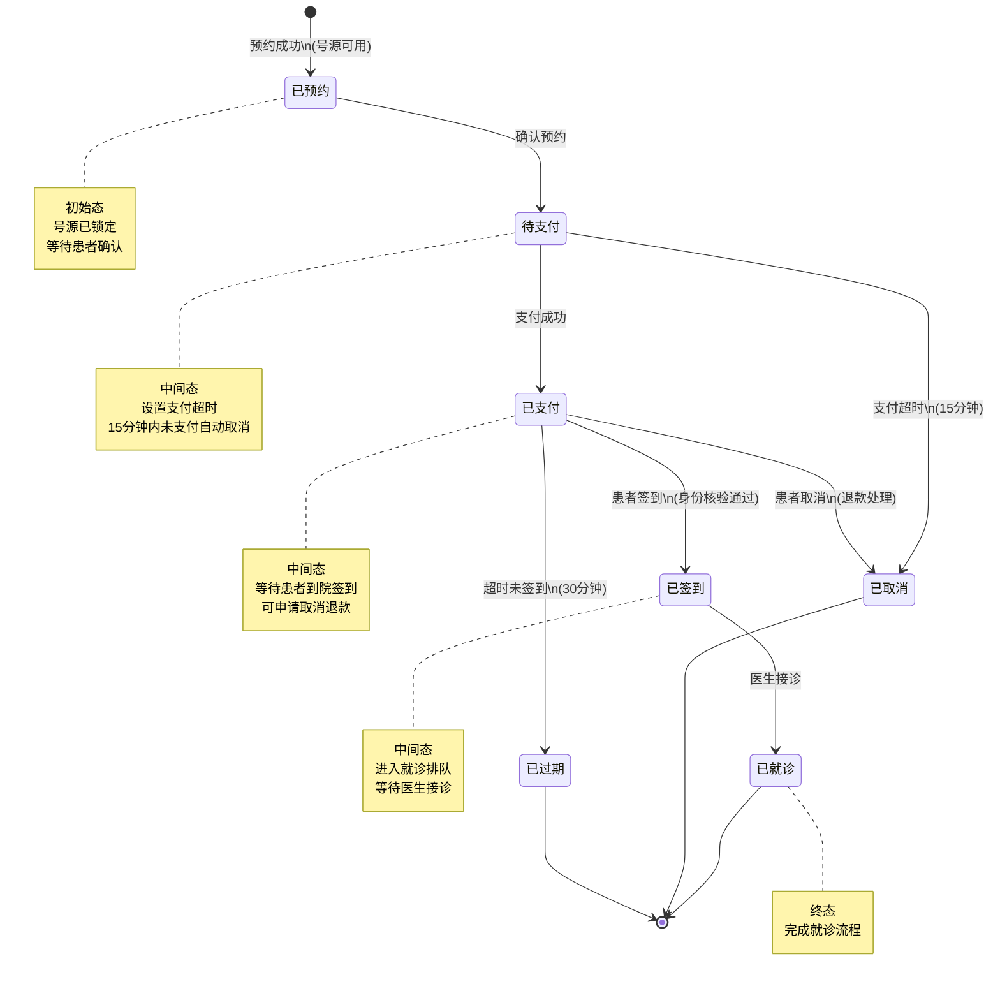
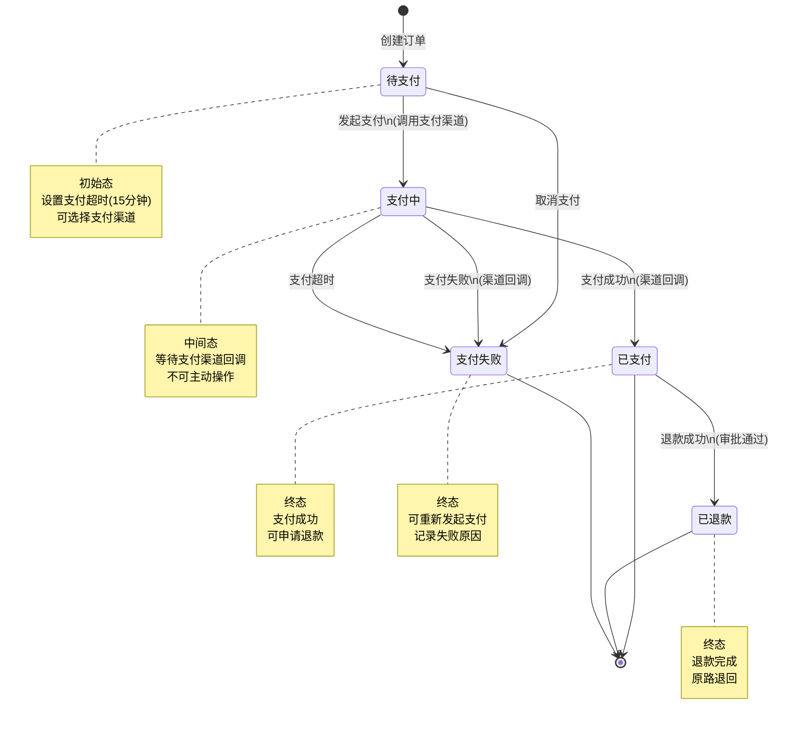
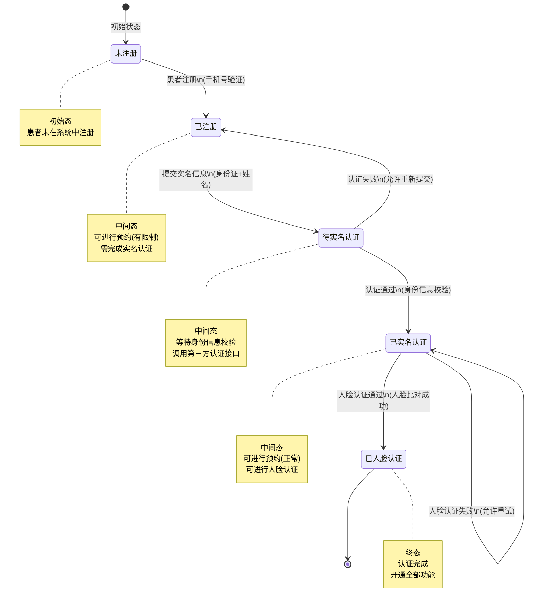
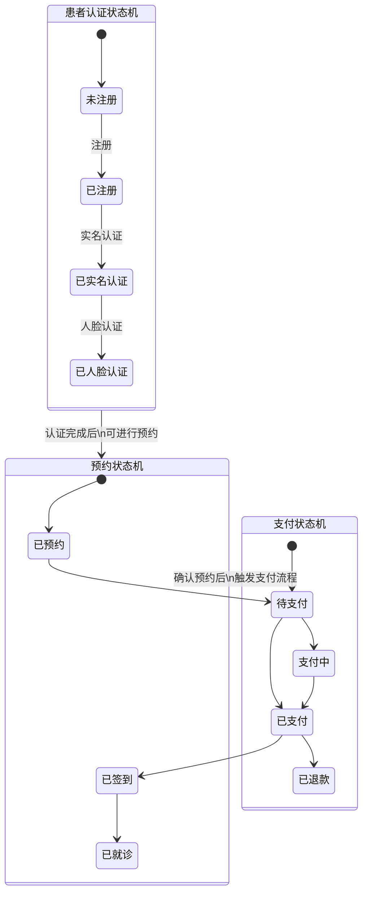

# M11-患者服务 - 状态机设计文档

> **文档编号**: YUDAO-HIS-SM-M11
> **版本**: V1.0
> **创建日期**: 2026-06-22
> **状态**: 设计中
> **关联文档**: YUDAO-HIS-SM-001 (全局状态机设计文档)

---

## 1. 概述

本文档定义患者服务模块(M11)核心业务对象的状态机设计，包括预约状态机、支付状态机和患者认证状态机。

### 1.1 状态机清单

| 序号 | 状态机编号 | 状态机名称 | 适用对象 | 优先级 | 业务规则 |
|------|------------|----------|----------|--------|----------|
| 1 | SM-M11-001 | 预约状态机 | patient_appointment | P0 | BR-PAT-001 |
| 2 | SM-M11-002 | 支付状态机 | patient_payment | P0 | BR-PAT-002 |
| 3 | SM-M11-003 | 患者认证状态机 | patient_profile | P0 | BR-PAT-003 |

---

## 2. 预约状态机 (SM-M11-001)

### 2.1 基本信息

| 属性 | 内容 |
|------|------|
| 状态机编号 | SM-M11-001 |
| 状态机名称 | 预约状态机 |
| 适用对象 | patient_appointment（预约记录表） |
| 状态字段 | appointment_status |
| 业务规则 | BR-PAT-001: 预约状态流转规则 |
| 优先级 | P0（MVP必需） |

### 2.2 状态列表

| 状态编码 | 状态名称 | 状态描述 | 状态类型 | 允许操作 |
|----------|----------|----------|----------|----------|
| 1 | 已预约 | 预约成功，等待支付 | 初始态 | 支付、取消 |
| 2 | 待支付 | 预约已确认，等待支付 | 中间态 | 支付、取消 |
| 3 | 已支付 | 支付完成，等待签到 | 中间态 | 签到、取消、申请退款 |
| 4 | 已签到 | 患者已到院签到 | 中间态 | 就诊 |
| 5 | 已就诊 | 医生完成接诊 | 终态 | 无 |
| 6 | 已取消 | 预约已取消 | 终态 | 无 |
| 7 | 已过期 | 超时未签到自动过期 | 终态 | 无 |

### 2.3 状态流转表

| 当前状态 | 触发事件 | 目标状态 | 前置条件 | 执行操作 | 关联规则 |
|----------|----------|----------|----------|----------|----------|
| - | 预约成功 | 已预约(1) | 号源可用、患者资格校验通过 | 锁定号源、发送预约通知 | BR-PAT-001 |
| 已预约(1) | 确认预约 | 待支付(2) | 患者确认预约信息 | 进入支付流程、设置支付超时 | - |
| 待支付(2) | 支付成功 | 已支付(3) | 支付金额正确、支付渠道正常 | 更新支付状态、发送支付通知 | BR-PAT-002 |
| 待支付(2) | 支付超时 | 已取消(6) | 超过支付时限(15分钟) | 释放号源、发送取消通知 | BR-PAT-004 |
| 已支付(3) | 患者签到 | 已签到(4) | 在预约时间段内、身份核验通过 | 创建就诊排队记录 | - |
| 已支付(3) | 患者取消 | 已取消(6) | 在取消时限内 | 退款处理、释放号源 | BR-PAT-005 |
| 已支付(3) | 超时未签到 | 已过期(7) | 超过预约时间30分钟 | 释放号源、记录过期 | BR-PAT-006 |
| 已签到(4) | 医生接诊 | 已就诊(5) | 医生确认接诊 | 生成就诊记录、更新排队状态 | - |

### 2.4 状态流转图



### 2.5 状态约束规则

1. **预约资格校验**: 患者必须完成实名认证方可预约（BR-PAT-001）
2. **支付超时**: 待支付状态超过15分钟自动取消（BR-PAT-004）
3. **签到时限**: 只能在预约时间段前30分钟至结束后15分钟内签到
4. **取消时限**: 预约时间前2小时内不可取消
5. **过期处理**: 预约时间段结束后30分钟自动过期，不退费
6. **号源释放**: 取消或过期后自动释放号源

### 2.6 Java枚举定义

```java
/**
 * 预约状态枚举
 */
public enum AppointmentStatusEnum implements StatusEnum {

    APPOINTED(1, "已预约", "预约成功，等待支付"),
    PENDING_PAYMENT(2, "待支付", "预约已确认，等待支付"),
    PAID(3, "已支付", "支付完成，等待签到"),
    CHECKED_IN(4, "已签到", "患者已到院签到"),
    VISITED(5, "已就诊", "医生完成接诊"),
    CANCELLED(6, "已取消", "预约已取消"),
    EXPIRED(7, "已过期", "超时未签到自动过期");

    private final Integer code;
    private final String name;
    private final String description;

    AppointmentStatusEnum(Integer code, String name, String description) {
        this.code = code;
        this.name = name;
        this.description = description;
    }

    @Override
    public Integer getCode() {
        return code;
    }

    @Override
    public String getName() {
        return name;
    }

    @Override
    public String getDescription() {
        return description;
    }

    /**
     * 判断是否可以支付
     */
    public boolean canPay() {
        return this == APPOINTED || this == PENDING_PAYMENT;
    }

    /**
     * 判断是否可以取消
     */
    public boolean canCancel() {
        return this == APPOINTED || this == PENDING_PAYMENT || this == PAID;
    }

    /**
     * 判断是否可以签到
     */
    public boolean canCheckIn() {
        return this == PAID;
    }

    /**
     * 判断是否为终态
     */
    public boolean isFinal() {
        return this == VISITED || this == CANCELLED || this == EXPIRED;
    }
}
```

---

## 3. 支付状态机 (SM-M11-002)

### 3.1 基本信息

| 属性 | 内容 |
|------|------|
| 状态机编号 | SM-M11-002 |
| 状态机名称 | 支付状态机 |
| 适用对象 | patient_payment（支付记录表） |
| 状态字段 | payment_status |
| 业务规则 | BR-PAT-002: 支付状态流转规则 |
| 优先级 | P0（MVP必需） |

### 3.2 状态列表

| 状态编码 | 状态名称 | 状态描述 | 状态类型 | 允许操作 |
|----------|----------|----------|----------|----------|
| 1 | 待支付 | 支付订单已创建 | 初始态 | 支付、取消 |
| 2 | 支付中 | 支付请求已发送，等待结果 | 中间态 | 无（等待回调） |
| 3 | 已支付 | 支付成功 | 终态 | 退款申请 |
| 4 | 已退款 | 退款成功 | 终态 | 无 |
| 5 | 支付失败 | 支付失败 | 终态 | 重新支付 |

### 3.3 状态流转表

| 当前状态 | 触发事件 | 目标状态 | 前置条件 | 执行操作 | 关联规则 |
|----------|----------|----------|----------|----------|----------|
| - | 创建订单 | 待支付(1) | 订单信息有效、金额正确 | 生成支付订单、设置超时 | BR-PAT-002 |
| 待支付(1) | 发起支付 | 支付中(2) | 支付渠道可用 | 调用支付渠道API | - |
| 待支付(1) | 取消支付 | 支付失败(5) | 用户主动取消 | 记录取消原因 | - |
| 支付中(2) | 支付成功 | 已支付(3) | 支付渠道回调成功 | 更新订单状态、发送通知 | BR-PAT-002 |
| 支付中(2) | 支付失败 | 支付失败(5) | 支付渠道回调失败 | 记录失败原因、允许重试 | - |
| 支付中(2) | 支付超时 | 支付失败(5) | 超过支付时限 | 记录超时、关闭订单 | - |
| 已支付(3) | 退款成功 | 已退款(4) | 退款审批通过、原路退款成功 | 更新退款状态、发送通知 | BR-PAT-007 |

### 3.4 状态流转图



### 3.5 状态约束规则

1. **支付超时**: 待支付状态超过15分钟自动关闭（BR-PAT-004）
2. **幂等性保证**: 同一订单号不可重复支付
3. **金额校验**: 支付金额必须与订单金额一致
4. **退款审批**: 退款需经过审批流程（BR-PAT-007）
5. **原路退款**: 退款必须原路返回至支付账户
6. **对账机制**: 每日与支付渠道进行对账

### 3.6 Java枚举定义

```java
/**
 * 支付状态枚举
 */
public enum PaymentStatusEnum implements StatusEnum {

    PENDING(1, "待支付", "支付订单已创建"),
    PAYING(2, "支付中", "支付请求已发送，等待结果"),
    PAID(3, "已支付", "支付成功"),
    REFUNDED(4, "已退款", "退款成功"),
    FAILED(5, "支付失败", "支付失败");

    private final Integer code;
    private final String name;
    private final String description;

    PaymentStatusEnum(Integer code, String name, String description) {
        this.code = code;
        this.name = name;
        this.description = description;
    }

    @Override
    public Integer getCode() {
        return code;
    }

    @Override
    public String getName() {
        return name;
    }

    @Override
    public String getDescription() {
        return description;
    }

    /**
     * 判断是否可以发起支付
     */
    public boolean canPay() {
        return this == PENDING || this == FAILED;
    }

    /**
     * 判断是否可以退款
     */
    public boolean canRefund() {
        return this == PAID;
    }

    /**
     * 判断是否为终态
     */
    public boolean isFinal() {
        return this == PAID || this == REFUNDED || this == FAILED;
    }

    /**
     * 判断支付是否成功
     */
    public boolean isPaid() {
        return this == PAID;
    }
}
```

---

## 4. 患者认证状态机 (SM-M11-003)

### 4.1 基本信息

| 属性 | 内容 |
|------|------|
| 状态机编号 | SM-M11-003 |
| 状态机名称 | 患者认证状态机 |
| 适用对象 | patient_profile（患者档案表） |
| 状态字段 | auth_status |
| 业务规则 | BR-PAT-003: 患者认证状态流转规则 |
| 优先级 | P0（MVP必需） |

### 4.2 状态列表

| 状态编码 | 状态名称 | 状态描述 | 状态类型 | 允许操作 |
|----------|----------|----------|----------|----------|
| 0 | 未注册 | 患者未在系统中注册 | 初始态 | 注册 |
| 1 | 已注册 | 患者已注册，未实名认证 | 中间态 | 实名认证 |
| 2 | 待实名认证 | 已提交实名信息，等待审核 | 中间态 | 审核、取消 |
| 3 | 已实名认证 | 实名认证通过 | 中间态 | 人脸认证 |
| 4 | 已人脸认证 | 人脸认证通过，认证完成 | 终态 | 无 |

### 4.3 状态流转表

| 当前状态 | 触发事件 | 目标状态 | 前置条件 | 执行操作 | 关联规则 |
|----------|----------|----------|----------|----------|----------|
| - | 患者注册 | 已注册(1) | 手机号未注册、验证码正确 | 创建患者档案、发送欢迎通知 | BR-PAT-008 |
| 已注册(1) | 提交实名 | 待实名认证(2) | 身份证信息完整 | 调用实名认证接口 | BR-PAT-009 |
| 待实名认证(2) | 认证通过 | 已实名认证(3) | 身份信息校验通过 | 更新认证状态、记录认证时间 | - |
| 待实名认证(2) | 认证失败 | 已注册(1) | 身份信息校验失败 | 记录失败原因、允许重新提交 | - |
| 已实名认证(3) | 人脸认证通过 | 已人脸认证(4) | 人脸比对通过 | 更新认证状态、开通全部功能 | BR-PAT-010 |
| 已实名认证(3) | 人脸认证失败 | 已实名认证(3) | 人脸比对失败 | 记录失败次数、允许重试 | - |

### 4.4 状态流转图



### 4.5 状态约束规则

1. **手机号唯一**: 同一手机号只能注册一次（BR-PAT-008）
2. **身份证唯一**: 同一身份证号只能绑定一个账户
3. **实名认证必须**: 未实名认证用户只能预约普通号源
4. **人脸认证可选**: 人脸认证通过后可使用刷脸签到功能（BR-PAT-010）
5. **认证失败限制**: 实名认证失败5次后需人工审核
6. **人脸重试限制**: 人脸认证失败3次后需24小时后重试

### 4.6 Java枚举定义

```java
/**
 * 患者认证状态枚举
 */
public enum PatientAuthStatusEnum implements StatusEnum {

    UNREGISTERED(0, "未注册", "患者未在系统中注册"),
    REGISTERED(1, "已注册", "患者已注册，未实名认证"),
    PENDING_AUTH(2, "待实名认证", "已提交实名信息，等待审核"),
    AUTHENTICATED(3, "已实名认证", "实名认证通过"),
    FACE_AUTHENTICATED(4, "已人脸认证", "人脸认证通过，认证完成");

    private final Integer code;
    private final String name;
    private final String description;

    PatientAuthStatusEnum(Integer code, String name, String description) {
        this.code = code;
        this.name = name;
        this.description = description;
    }

    @Override
    public Integer getCode() {
        return code;
    }

    @Override
    public String getName() {
        return name;
    }

    @Override
    public String getDescription() {
        return description;
    }

    /**
     * 判断是否可以预约
     */
    public boolean canAppointment() {
        return this != UNREGISTERED;
    }

    /**
     * 判断是否可以预约专家号
     */
    public boolean canExpertAppointment() {
        return this == AUTHENTICATED || this == FACE_AUTHENTICATED;
    }

    /**
     * 判断是否可以刷脸签到
     */
    public boolean canFaceCheckIn() {
        return this == FACE_AUTHENTICATED;
    }

    /**
     * 判断是否为终态
     */
    public boolean isFinal() {
        return this == FACE_AUTHENTICATED;
    }

    /**
     * 判断是否已完成实名认证
     */
    public boolean isRealNameAuthenticated() {
        return this == AUTHENTICATED || this == FACE_AUTHENTICATED;
    }
}
```

---

## 5. 状态机交互关系

### 5.1 状态机协作图



### 5.2 状态机协作说明

| 协作场景 | 触发条件 | 协作流程 | 业务规则 |
|----------|----------|----------|----------|
| 预约前认证检查 | 患者发起预约 | 检查患者认证状态，未实名认证限制预约专家号 | BR-PAT-001 |
| 预约支付联动 | 预约确认 | 创建支付订单，预约状态流转至待支付 | BR-PAT-002 |
| 支付成功回调 | 支付渠道回调 | 更新支付状态为已支付，预约状态流转至已支付 | BR-PAT-002 |
| 签到认证检查 | 患者签到 | 检查人脸认证状态，支持刷脸签到 | BR-PAT-010 |
| 取消退款联动 | 预约取消 | 触发退款流程，支付状态流转至已退款 | BR-PAT-007 |

---

## 附录: 变更历史

| 版本 | 日期 | 变更内容 | 变更人 |
|------|------|----------|--------|
| V1.0 | 2026-06-22 | 创建患者服务模块状态机设计文档 | YUDAO-AI-HIS架构组 |

---

> **最后更新**: 2026-06-22
