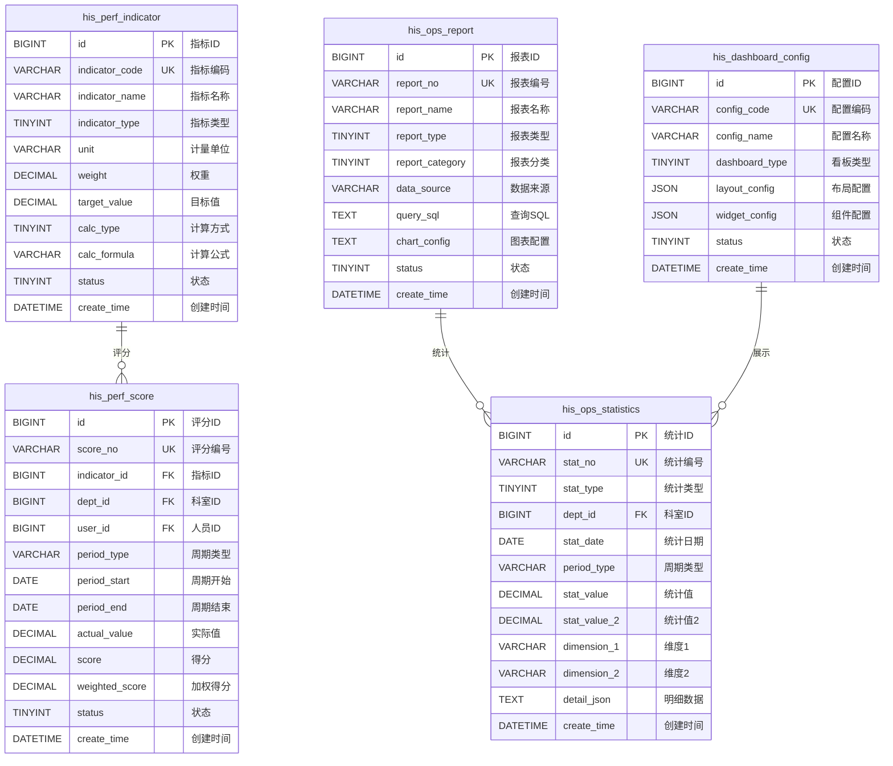
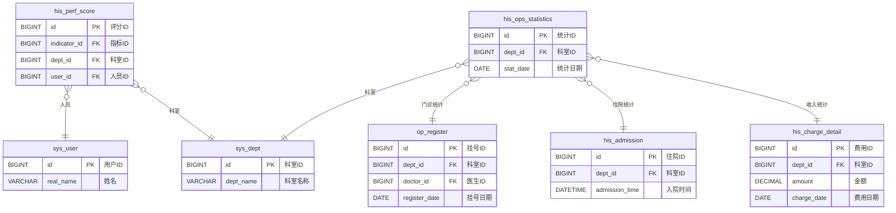

# YUDAO-AI-HIS 智慧医疗信息系统 - M12运营管理模块数据库设计文档

> **文档编号**: YUDAO-HIS-DB-M12-001
> **版本**: V1.0
> **创建日期**: 2026-06-22
> **状态**: 设计中
> **参考文档**: YUDAO-HIS-DB-001, YUDAO-HIS-MDD-001

---

## 1. 设计概述

### 1.1 模块概述

M12运营管理子系统面向医院管理者，提供运营数据分析、绩效管理、决策支持等核心能力。

| 属性 | 内容 |
|------|------|
| 模块编号 | M12 |
| 模块名称 | 运营管理子系统 |
| 优先级 | P2 - 增强功能 |
| 预估工作量 | 4人月 |

### 1.2 业务范围

**边界范围**:
- 运营数据看板（门诊量、住院量、床位使用率、收入统计）
- 统计报表（科室工作量统计、医生工作量统计、药品消耗统计、手术统计）
- 绩效管理（绩效指标配置、绩效评分、绩效报表）
- 经营分析（收入分析、成本分析）

**边界排除**:
- 业务数据录入（归属各业务模块）
- 财务核算（归属M08财务管理）

### 1.3 设计原则

| 原则 | 说明 |
|------|------|
| 标准化 | 遵循全局数据库设计文档规范 |
| 规范化 | 遵循数据库第三范式(3NF)，减少数据冗余 |
| 扩展性 | 支持分表策略，适应大数据量场景 |
| 性能优化 | 合理设计索引，优化统计查询性能 |

### 1.4 通用字段说明

基于 ruoyi-vue-pro 框架规范，所有表均包含以下通用字段：

| 字段名 | 类型 | 默认值 | 说明 |
|--------|------|--------|------|
| creator | VARCHAR(64) | '' | 创建者 |
| create_time | DATETIME | CURRENT_TIMESTAMP | 创建时间 |
| updater | VARCHAR(64) | '' | 更新者 |
| update_time | DATETIME | CURRENT_TIMESTAMP ON UPDATE CURRENT_TIMESTAMP | 更新时间 |
| deleted | BIT(1) | b'0' | 是否删除 |
| tenant_id | BIGINT | 0 | 租户编号 |

---

## 2. ER图设计

### 2.1 运营管理模块 ER图



### 2.2 与其他模块关系 ER图



---

## 3. DDL脚本设计

### 3.1 绩效指标表 (his_perf_indicator)

```sql
-- =============================================
-- 绩效指标表
-- 用于配置绩效考核指标
-- =============================================
CREATE TABLE `his_perf_indicator` (
    `id` BIGINT NOT NULL AUTO_INCREMENT COMMENT '指标ID',
    `indicator_code` VARCHAR(50) NOT NULL COMMENT '指标编码',
    `indicator_name` VARCHAR(100) NOT NULL COMMENT '指标名称',
    `indicator_type` TINYINT NOT NULL COMMENT '指标类型: 1工作效率/2医疗质量/3服务满意度/4运营效益',
    `indicator_category` VARCHAR(50) COMMENT '指标分类',
    `unit` VARCHAR(20) COMMENT '计量单位',
    `weight` DECIMAL(5,2) NOT NULL DEFAULT 1.00 COMMENT '权重(%)',
    `target_value` DECIMAL(12,2) COMMENT '目标值',
    `max_value` DECIMAL(12,2) COMMENT '最大值',
    `min_value` DECIMAL(12,2) COMMENT '最小值',
    `calc_type` TINYINT NOT NULL DEFAULT 1 COMMENT '计算方式: 1自动计算/2手动录入',
    `calc_formula` VARCHAR(500) COMMENT '计算公式',
    `data_source` VARCHAR(200) COMMENT '数据来源表',
    `dept_types` VARCHAR(200) COMMENT '适用科室类型(多个逗号分隔)',
    `sort` INT DEFAULT 0 COMMENT '排序',
    `status` TINYINT NOT NULL DEFAULT 1 COMMENT '状态: 0禁用/1正常',
    `remark` VARCHAR(500) COMMENT '备注',
    `creator` VARCHAR(64) DEFAULT '' COMMENT '创建者',
    `create_time` DATETIME NOT NULL DEFAULT CURRENT_TIMESTAMP COMMENT '创建时间',
    `updater` VARCHAR(64) DEFAULT '' COMMENT '更新者',
    `update_time` DATETIME NOT NULL DEFAULT CURRENT_TIMESTAMP ON UPDATE CURRENT_TIMESTAMP COMMENT '更新时间',
    `deleted` BIT(1) NOT NULL DEFAULT b'0' COMMENT '是否删除',
    `tenant_id` BIGINT NOT NULL DEFAULT 0 COMMENT '租户编号',
    PRIMARY KEY (`id`),
    UNIQUE KEY `uk_indicator_code` (`indicator_code`),
    KEY `idx_indicator_type` (`indicator_type`),
    KEY `idx_indicator_status` (`status`)
) ENGINE=InnoDB DEFAULT CHARSET=utf8mb4 COLLATE=utf8mb4_unicode_ci COMMENT='绩效指标表';
```

### 3.2 绩效评分表 (his_perf_score)

```sql
-- =============================================
-- 绩效评分表
-- 记录各科室/人员的绩效评分
-- 分表策略: 按年分表
-- =============================================
CREATE TABLE `his_perf_score` (
    `id` BIGINT NOT NULL AUTO_INCREMENT COMMENT '评分ID',
    `score_no` VARCHAR(30) NOT NULL COMMENT '评分编号',
    `indicator_id` BIGINT NOT NULL COMMENT '指标ID',
    `indicator_code` VARCHAR(50) COMMENT '指标编码',
    `indicator_name` VARCHAR(100) COMMENT '指标名称',
    `dept_id` BIGINT COMMENT '科室ID',
    `dept_name` VARCHAR(100) COMMENT '科室名称',
    `user_id` BIGINT COMMENT '人员ID',
    `user_name` VARCHAR(50) COMMENT '人员姓名',
    `period_type` VARCHAR(20) NOT NULL COMMENT '周期类型: DAY日/MONTH月/QUARTER季/YEAR年',
    `period_start` DATE NOT NULL COMMENT '周期开始日期',
    `period_end` DATE NOT NULL COMMENT '周期结束日期',
    `actual_value` DECIMAL(12,2) NOT NULL COMMENT '实际值',
    `target_value` DECIMAL(12,2) COMMENT '目标值',
    `completion_rate` DECIMAL(5,2) COMMENT '完成率(%)',
    `base_score` DECIMAL(5,2) COMMENT '基础分',
    `score` DECIMAL(5,2) NOT NULL COMMENT '得分',
    `weight` DECIMAL(5,2) COMMENT '权重',
    `weighted_score` DECIMAL(5,2) COMMENT '加权得分',
    `rank` INT COMMENT '排名',
    `score_level` VARCHAR(20) COMMENT '评分等级: S/A/B/C/D',
    `data_source` VARCHAR(50) COMMENT '数据来源: AUTO自动/MANUAL手动',
    `calc_time` DATETIME COMMENT '计算时间',
    `audit_status` TINYINT DEFAULT 0 COMMENT '审核状态: 0未审核/1已审核',
    `audit_user_id` BIGINT COMMENT '审核人ID',
    `audit_user_name` VARCHAR(50) COMMENT '审核人姓名',
    `audit_time` DATETIME COMMENT '审核时间',
    `status` TINYINT NOT NULL DEFAULT 1 COMMENT '状态: 0无效/1有效',
    `remark` VARCHAR(500) COMMENT '备注',
    `creator` VARCHAR(64) DEFAULT '' COMMENT '创建者',
    `create_time` DATETIME NOT NULL DEFAULT CURRENT_TIMESTAMP COMMENT '创建时间',
    `updater` VARCHAR(64) DEFAULT '' COMMENT '更新者',
    `update_time` DATETIME NOT NULL DEFAULT CURRENT_TIMESTAMP ON UPDATE CURRENT_TIMESTAMP COMMENT '更新时间',
    `deleted` BIT(1) NOT NULL DEFAULT b'0' COMMENT '是否删除',
    `tenant_id` BIGINT NOT NULL DEFAULT 0 COMMENT '租户编号',
    PRIMARY KEY (`id`),
    UNIQUE KEY `uk_score_no` (`score_no`),
    KEY `idx_perf_score_indicator` (`indicator_id`),
    KEY `idx_perf_score_dept` (`dept_id`),
    KEY `idx_perf_score_user` (`user_id`),
    KEY `idx_perf_score_period` (`period_type`, `period_start`),
    KEY `idx_perf_score_date` (`period_start`, `period_end`),
    KEY `idx_perf_score_year` (YEAR(`create_time`))
) ENGINE=InnoDB DEFAULT CHARSET=utf8mb4 COLLATE=utf8mb4_unicode_ci COMMENT='绩效评分表';
```

### 3.3 运营报表表 (his_ops_report)

```sql
-- =============================================
-- 运营报表表
-- 配置各类运营统计报表
-- =============================================
CREATE TABLE `his_ops_report` (
    `id` BIGINT NOT NULL AUTO_INCREMENT COMMENT '报表ID',
    `report_no` VARCHAR(30) NOT NULL COMMENT '报表编号',
    `report_name` VARCHAR(100) NOT NULL COMMENT '报表名称',
    `report_type` TINYINT NOT NULL COMMENT '报表类型: 1统计报表/2分析报表/3自定义报表',
    `report_category` TINYINT NOT NULL COMMENT '报表分类: 1科室统计/2医生统计/3药品统计/4手术统计/5收入统计/6成本统计',
    `report_icon` VARCHAR(50) COMMENT '报表图标',
    `data_source` VARCHAR(200) COMMENT '数据来源',
    `query_sql` TEXT COMMENT '查询SQL',
    `query_params` TEXT COMMENT '查询参数(JSON格式)',
    `columns` TEXT COMMENT '列定义(JSON格式)',
    `chart_type` VARCHAR(20) COMMENT '图表类型: LINE折线/BAR柱状/PIE饼图/TABLE表格',
    `chart_config` TEXT COMMENT '图表配置(JSON格式)',
    `drill_down` TINYINT DEFAULT 0 COMMENT '是否支持钻取: 0否/1是',
    `drill_config` TEXT COMMENT '钻取配置(JSON格式)',
    `export_type` VARCHAR(50) DEFAULT 'EXCEL,PDF' COMMENT '导出类型',
    `cache_type` TINYINT DEFAULT 0 COMMENT '缓存类型: 0不缓存/1按天缓存/2按小时缓存',
    `cache_expire` INT DEFAULT 3600 COMMENT '缓存过期时间(秒)',
    `permission_code` VARCHAR(100) COMMENT '权限编码',
    `sort` INT DEFAULT 0 COMMENT '排序',
    `status` TINYINT NOT NULL DEFAULT 1 COMMENT '状态: 0禁用/1正常',
    `remark` VARCHAR(500) COMMENT '备注',
    `creator` VARCHAR(64) DEFAULT '' COMMENT '创建者',
    `create_time` DATETIME NOT NULL DEFAULT CURRENT_TIMESTAMP COMMENT '创建时间',
    `updater` VARCHAR(64) DEFAULT '' COMMENT '更新者',
    `update_time` DATETIME NOT NULL DEFAULT CURRENT_TIMESTAMP ON UPDATE CURRENT_TIMESTAMP COMMENT '更新时间',
    `deleted` BIT(1) NOT NULL DEFAULT b'0' COMMENT '是否删除',
    `tenant_id` BIGINT NOT NULL DEFAULT 0 COMMENT '租户编号',
    PRIMARY KEY (`id`),
    UNIQUE KEY `uk_report_no` (`report_no`),
    KEY `idx_ops_report_type` (`report_type`),
    KEY `idx_ops_report_category` (`report_category`),
    KEY `idx_ops_report_status` (`status`)
) ENGINE=InnoDB DEFAULT CHARSET=utf8mb4 COLLATE=utf8mb4_unicode_ci COMMENT='运营报表表';
```

### 3.4 运营统计数据表 (his_ops_statistics)

```sql
-- =============================================
-- 运营统计数据表
-- 存储各类运营统计汇总数据
-- 分表策略: 按年分表
-- =============================================
CREATE TABLE `his_ops_statistics` (
    `id` BIGINT NOT NULL AUTO_INCREMENT COMMENT '统计ID',
    `stat_no` VARCHAR(30) NOT NULL COMMENT '统计编号',
    `stat_type` TINYINT NOT NULL COMMENT '统计类型: 1门诊量/2住院量/3手术量/4床位使用率/5收入统计/6药品消耗/7人员工作量',
    `stat_name` VARCHAR(100) COMMENT '统计名称',
    `dept_id` BIGINT COMMENT '科室ID',
    `dept_name` VARCHAR(100) COMMENT '科室名称',
    `user_id` BIGINT COMMENT '人员ID',
    `user_name` VARCHAR(50) COMMENT '人员姓名',
    `stat_date` DATE NOT NULL COMMENT '统计日期',
    `period_type` VARCHAR(20) NOT NULL COMMENT '周期类型: DAY日/WEEK周/MONTH月/QUARTER季/YEAR年',
    `stat_value` DECIMAL(14,2) NOT NULL COMMENT '统计值',
    `stat_value_2` DECIMAL(14,2) COMMENT '统计值2(对比值)',
    `stat_value_3` DECIMAL(14,2) COMMENT '统计值3(同比)',
    `stat_value_4` DECIMAL(14,2) COMMENT '统计值4(环比)',
    `growth_rate` DECIMAL(6,2) COMMENT '增长率(%)',
    `yoy_rate` DECIMAL(6,2) COMMENT '同比增长率(%)',
    `mom_rate` DECIMAL(6,2) COMMENT '环比增长率(%)',
    `dimension_1` VARCHAR(50) COMMENT '维度1(如挂号类型)',
    `dimension_2` VARCHAR(50) COMMENT '维度2(如支付方式)',
    `dimension_3` VARCHAR(50) COMMENT '维度3',
    `dimension_4` VARCHAR(50) COMMENT '维度4',
    `detail_json` TEXT COMMENT '明细数据(JSON格式)',
    `data_source` VARCHAR(100) COMMENT '数据来源',
    `calc_time` DATETIME COMMENT '计算时间',
    `version` INT DEFAULT 1 COMMENT '版本号',
    `creator` VARCHAR(64) DEFAULT '' COMMENT '创建者',
    `create_time` DATETIME NOT NULL DEFAULT CURRENT_TIMESTAMP COMMENT '创建时间',
    `updater` VARCHAR(64) DEFAULT '' COMMENT '更新者',
    `update_time` DATETIME NOT NULL DEFAULT CURRENT_TIMESTAMP ON UPDATE CURRENT_TIMESTAMP COMMENT '更新时间',
    `deleted` BIT(1) NOT NULL DEFAULT b'0' COMMENT '是否删除',
    `tenant_id` BIGINT NOT NULL DEFAULT 0 COMMENT '租户编号',
    PRIMARY KEY (`id`),
    UNIQUE KEY `uk_stat_no` (`stat_no`),
    KEY `idx_ops_stat_type` (`stat_type`),
    KEY `idx_ops_stat_dept` (`dept_id`),
    KEY `idx_ops_stat_user` (`user_id`),
    KEY `idx_ops_stat_date` (`stat_date`),
    KEY `idx_ops_stat_period` (`period_type`, `stat_date`),
    KEY `idx_ops_stat_dimension` (`dimension_1`, `dimension_2`),
    KEY `idx_ops_stat_year` (YEAR(`create_time`))
) ENGINE=InnoDB DEFAULT CHARSET=utf8mb4 COLLATE=utf8mb4_unicode_ci COMMENT='运营统计数据表';
```

### 3.5 看板配置表 (his_dashboard_config)

```sql
-- =============================================
-- 看板配置表
-- 配置运营看板的布局和组件
-- =============================================
CREATE TABLE `his_dashboard_config` (
    `id` BIGINT NOT NULL AUTO_INCREMENT COMMENT '配置ID',
    `config_code` VARCHAR(50) NOT NULL COMMENT '配置编码',
    `config_name` VARCHAR(100) NOT NULL COMMENT '配置名称',
    `dashboard_type` TINYINT NOT NULL COMMENT '看板类型: 1门诊看板/2住院看板/3床位看板/4收入看板/5绩效看板/6综合看板',
    `layout_type` VARCHAR(20) DEFAULT 'GRID' COMMENT '布局类型: GRID网格/FLEX流式',
    `layout_config` JSON COMMENT '布局配置(JSON格式)',
    `widget_config` JSON COMMENT '组件配置(JSON格式)',
    `refresh_interval` INT DEFAULT 300 COMMENT '刷新间隔(秒)',
    `auto_refresh` TINYINT DEFAULT 1 COMMENT '是否自动刷新: 0否/1是',
    `role_ids` VARCHAR(500) COMMENT '可见角色ID(多个逗号分隔)',
    `dept_ids` VARCHAR(500) COMMENT '可见科室ID(多个逗号分隔)',
    `is_default` TINYINT DEFAULT 0 COMMENT '是否默认: 0否/1是',
    `sort` INT DEFAULT 0 COMMENT '排序',
    `status` TINYINT NOT NULL DEFAULT 1 COMMENT '状态: 0禁用/1正常',
    `remark` VARCHAR(500) COMMENT '备注',
    `creator` VARCHAR(64) DEFAULT '' COMMENT '创建者',
    `create_time` DATETIME NOT NULL DEFAULT CURRENT_TIMESTAMP COMMENT '创建时间',
    `updater` VARCHAR(64) DEFAULT '' COMMENT '更新者',
    `update_time` DATETIME NOT NULL DEFAULT CURRENT_TIMESTAMP ON UPDATE CURRENT_TIMESTAMP COMMENT '更新时间',
    `deleted` BIT(1) NOT NULL DEFAULT b'0' COMMENT '是否删除',
    `tenant_id` BIGINT NOT NULL DEFAULT 0 COMMENT '租户编号',
    PRIMARY KEY (`id`),
    UNIQUE KEY `uk_config_code` (`config_code`),
    KEY `idx_dashboard_type` (`dashboard_type`),
    KEY `idx_dashboard_status` (`status`)
) ENGINE=InnoDB DEFAULT CHARSET=utf8mb4 COLLATE=utf8mb4_unicode_ci COMMENT='看板配置表';
```

---

## 4. 分表策略

### 4.1 分表规则

| 数据表 | 分表策略 | 分表字段 | 分表数量 | 说明 |
|--------|----------|----------|----------|------|
| his_perf_score | 按年分表 | create_time | 每年1张 | 绩效评分数据量大，按年分表 |
| his_ops_statistics | 按年分表 | create_time | 每年1张 | 运营统计数据量大，按年分表 |

### 4.2 分表实现示例

```sql
-- =============================================
-- 绩效评分分表示例(按年)
-- =============================================
-- 2026年绩效评分表
CREATE TABLE `his_perf_score_2026` LIKE `his_perf_score`;

-- 2027年绩效评分表
CREATE TABLE `his_perf_score_2027` LIKE `his_perf_score`;

-- =============================================
-- 运营统计分表示例(按年)
-- =============================================
-- 2026年运营统计表
CREATE TABLE `his_ops_statistics_2026` LIKE `his_ops_statistics`;

-- 2027年运营统计表
CREATE TABLE `his_ops_statistics_2027` LIKE `his_ops_statistics`;
```

### 4.3 分表路由规则

```java
// 分表路由配置示例(ShardingSphere)
// his_perf_score按年分表
spring.shardingsphere.sharding.tables.his_perf_score.actual-data-nodes=ds0.his_perf_score_$->{2026..2030}
spring.shardingsphere.sharding.tables.his_perf_score.table-strategy.standard.sharding-column=create_time
spring.shardingsphere.sharding.tables.his_perf_score.table-strategy.standard.precise-algorithm-class-name=com.yudao.his.sharding.YearShardingAlgorithm

// his_ops_statistics按年分表
spring.shardingsphere.sharding.tables.his_ops_statistics.actual-data-nodes=ds0.his_ops_statistics_$->{2026..2030}
spring.shardingsphere.sharding.tables.his_ops_statistics.table-strategy.standard.sharding-column=create_time
spring.shardingsphere.sharding.tables.his_ops_statistics.table-strategy.standard.precise-algorithm-class-name=com.yudao.his.sharding.YearShardingAlgorithm
```

---

## 5. 索引设计

### 5.1 索引汇总表

| 表名 | 索引名 | 索引类型 | 索引字段 | 说明 |
|------|--------|----------|----------|------|
| his_perf_indicator | uk_indicator_code | 唯一 | indicator_code | 指标编码唯一 |
| his_perf_indicator | idx_indicator_type | 普通 | indicator_type | 按指标类型查询 |
| his_perf_indicator | idx_indicator_status | 普通 | status | 按状态查询 |
| his_perf_score | uk_score_no | 唯一 | score_no | 评分编号唯一 |
| his_perf_score | idx_perf_score_indicator | 普通 | indicator_id | 按指标查询 |
| his_perf_score | idx_perf_score_dept | 普通 | dept_id | 按科室查询 |
| his_perf_score | idx_perf_score_user | 普通 | user_id | 按人员查询 |
| his_perf_score | idx_perf_score_period | 联合 | period_type, period_start | 按周期类型查询 |
| his_perf_score | idx_perf_score_date | 联合 | period_start, period_end | 按日期范围查询 |
| his_ops_report | uk_report_no | 唯一 | report_no | 报表编号唯一 |
| his_ops_report | idx_ops_report_type | 普通 | report_type | 按报表类型查询 |
| his_ops_report | idx_ops_report_category | 普通 | report_category | 按报表分类查询 |
| his_ops_statistics | uk_stat_no | 唯一 | stat_no | 统计编号唯一 |
| his_ops_statistics | idx_ops_stat_type | 普通 | stat_type | 按统计类型查询 |
| his_ops_statistics | idx_ops_stat_dept | 普通 | dept_id | 按科室查询 |
| his_ops_statistics | idx_ops_stat_date | 普通 | stat_date | 按日期查询 |
| his_ops_statistics | idx_ops_stat_period | 联合 | period_type, stat_date | 按周期查询 |
| his_dashboard_config | uk_config_code | 唯一 | config_code | 配置编码唯一 |
| his_dashboard_config | idx_dashboard_type | 普通 | dashboard_type | 按看板类型查询 |

---

## 6. 数据字典初始化

### 6.1 指标类型字典

```sql
-- =============================================
-- 数据字典类型初始化
-- =============================================
INSERT INTO `sys_dict_type` (`dict_type`, `dict_name`, `status`, `creator`) VALUES
('perf_indicator_type', '绩效指标类型', 1, 'admin'),
('perf_score_level', '绩效评分等级', 1, 'admin'),
('ops_report_type', '运营报表类型', 1, 'admin'),
('ops_report_category', '运营报表分类', 1, 'admin'),
('ops_stat_type', '运营统计类型', 1, 'admin'),
('dashboard_type', '看板类型', 1, 'admin'),
('stat_period_type', '统计周期类型', 1, 'admin'),
('calc_type', '计算方式', 1, 'admin');

-- =============================================
-- 数据字典数据初始化
-- =============================================

-- 绩效指标类型
INSERT INTO `sys_dict_data` (`dict_type`, `dict_label`, `dict_value`, `sort`, `status`, `creator`) VALUES
('perf_indicator_type', '工作效率', '1', 1, 1, 'admin'),
('perf_indicator_type', '医疗质量', '2', 2, 1, 'admin'),
('perf_indicator_type', '服务满意度', '3', 3, 1, 'admin'),
('perf_indicator_type', '运营效益', '4', 4, 1, 'admin');

-- 绩效评分等级
INSERT INTO `sys_dict_data` (`dict_type`, `dict_label`, `dict_value`, `sort`, `status`, `creator`) VALUES
('perf_score_level', 'S级(优秀)', 'S', 1, 1, 'admin'),
('perf_score_level', 'A级(良好)', 'A', 2, 1, 'admin'),
('perf_score_level', 'B级(合格)', 'B', 3, 1, 'admin'),
('perf_score_level', 'C级(待改进)', 'C', 4, 1, 'admin'),
('perf_score_level', 'D级(不合格)', 'D', 5, 1, 'admin');

-- 运营报表类型
INSERT INTO `sys_dict_data` (`dict_type`, `dict_label`, `dict_value`, `sort`, `status`, `creator`) VALUES
('ops_report_type', '统计报表', '1', 1, 1, 'admin'),
('ops_report_type', '分析报表', '2', 2, 1, 'admin'),
('ops_report_type', '自定义报表', '3', 3, 1, 'admin');

-- 运营报表分类
INSERT INTO `sys_dict_data` (`dict_type`, `dict_label`, `dict_value`, `sort`, `status`, `creator`) VALUES
('ops_report_category', '科室统计', '1', 1, 1, 'admin'),
('ops_report_category', '医生统计', '2', 2, 1, 'admin'),
('ops_report_category', '药品统计', '3', 3, 1, 'admin'),
('ops_report_category', '手术统计', '4', 4, 1, 'admin'),
('ops_report_category', '收入统计', '5', 5, 1, 'admin'),
('ops_report_category', '成本统计', '6', 6, 1, 'admin');

-- 运营统计类型
INSERT INTO `sys_dict_data` (`dict_type`, `dict_label`, `dict_value`, `sort`, `status`, `creator`) VALUES
('ops_stat_type', '门诊量', '1', 1, 1, 'admin'),
('ops_stat_type', '住院量', '2', 2, 1, 'admin'),
('ops_stat_type', '手术量', '3', 3, 1, 'admin'),
('ops_stat_type', '床位使用率', '4', 4, 1, 'admin'),
('ops_stat_type', '收入统计', '5', 5, 1, 'admin'),
('ops_stat_type', '药品消耗', '6', 6, 1, 'admin'),
('ops_stat_type', '人员工作量', '7', 7, 1, 'admin');

-- 看板类型
INSERT INTO `sys_dict_data` (`dict_type`, `dict_label`, `dict_value`, `sort`, `status`, `creator`) VALUES
('dashboard_type', '门诊看板', '1', 1, 1, 'admin'),
('dashboard_type', '住院看板', '2', 2, 1, 'admin'),
('dashboard_type', '床位看板', '3', 3, 1, 'admin'),
('dashboard_type', '收入看板', '4', 4, 1, 'admin'),
('dashboard_type', '绩效看板', '5', 5, 1, 'admin'),
('dashboard_type', '综合看板', '6', 6, 1, 'admin');

-- 统计周期类型
INSERT INTO `sys_dict_data` (`dict_type`, `dict_label`, `dict_value`, `sort`, `status`, `creator`) VALUES
('stat_period_type', '日', 'DAY', 1, 1, 'admin'),
('stat_period_type', '周', 'WEEK', 2, 1, 'admin'),
('stat_period_type', '月', 'MONTH', 3, 1, 'admin'),
('stat_period_type', '季', 'QUARTER', 4, 1, 'admin'),
('stat_period_type', '年', 'YEAR', 5, 1, 'admin');

-- 计算方式
INSERT INTO `sys_dict_data` (`dict_type`, `dict_label`, `dict_value`, `sort`, `status`, `creator`) VALUES
('calc_type', '自动计算', '1', 1, 1, 'admin'),
('calc_type', '手动录入', '2', 2, 1, 'admin');
```

### 6.2 绩效指标初始化

```sql
-- =============================================
-- 绩效指标初始化
-- =============================================
INSERT INTO `his_perf_indicator` (`indicator_code`, `indicator_name`, `indicator_type`, `indicator_category`, `unit`, `weight`, `target_value`, `calc_type`, `calc_formula`, `data_source`, `status`, `creator`) VALUES
('IND001', '门诊人次', 1, '工作效率', '人次', 10.00, 1000.00, 1, 'COUNT(op_register)', 'op_register', 1, 'admin'),
('IND002', '住院人次', 1, '工作效率', '人次', 10.00, 500.00, 1, 'COUNT(his_admission)', 'his_admission', 1, 'admin'),
('IND003', '手术台次', 1, '工作效率', '台', 8.00, 100.00, 1, 'COUNT(his_surgery_record)', 'his_surgery_record', 1, 'admin'),
('IND004', '床位使用率', 1, '工作效率', '%', 8.00, 90.00, 1, 'AVG(bed_usage_rate)', 'his_bed', 1, 'admin'),
('IND005', '平均住院日', 2, '医疗质量', '天', 8.00, 8.00, 1, 'AVG(stay_days)', 'his_admission', 1, 'admin'),
('IND006', '治愈好转率', 2, '医疗质量', '%', 8.00, 95.00, 1, 'COUNT(cured)/COUNT(total)', 'his_admission', 1, 'admin'),
('IND007', '危重患者抢救成功率', 2, '医疗质量', '%', 6.00, 85.00, 2, NULL, NULL, 1, 'admin'),
('IND008', '药占比', 2, '医疗质量', '%', 6.00, 40.00, 1, 'drug_amount/total_amount', 'his_charge_detail', 1, 'admin'),
('IND009', '抗菌药物使用强度', 2, '医疗质量', 'DDDs', 5.00, 40.00, 1, 'SUM(ddd)', 'his_medication_admin', 1, 'admin'),
('IND010', '患者满意度', 3, '服务满意度', '%', 10.00, 90.00, 2, NULL, NULL, 1, 'admin'),
('IND011', '投诉率', 3, '服务满意度', '%', 5.00, 0.50, 2, NULL, NULL, 1, 'admin'),
('IND012', '医疗收入', 4, '运营效益', '元', 8.00, 1000000.00, 1, 'SUM(amount)', 'his_charge_detail', 1, 'admin'),
('IND013', '人均费用', 4, '运营效益', '元', 5.00, 500.00, 1, 'SUM(amount)/COUNT(patient)', 'his_charge_detail', 1, 'admin'),
('IND014', '成本收益率', 4, '运营效益', '%', 3.00, 15.00, 2, NULL, NULL, 1, 'admin');
```

---

## 7. 接口边界定义

### 7.1 接口清单

| 接口编号 | 接口名称 | 接口类型 | 说明 |
|----------|----------|----------|------|
| API-OPS-001 | 运营看板数据查询 | REST | GET /api/ops/dashboard |
| API-OPS-002 | 运营统计报表生成 | REST | POST /api/ops/report |
| API-OPS-003 | 绩效指标配置 | REST | POST /api/ops/indicator |
| API-OPS-004 | 绩效评分计算 | REST | POST /api/ops/score/calc |
| API-OPS-005 | 绩效评分查询 | REST | GET /api/ops/score/list |
| API-OPS-006 | 统计数据同步 | 消息 | 接收业务数据变更 |
| API-OPS-007 | 看板配置保存 | REST | POST /api/ops/dashboard/config |

### 7.2 外部接口依赖

| 接口编号 | 接口名称 | 归属模块 | 说明 |
|----------|----------|----------|------|
| IF-OPS-M01 | 门诊数据查询 | M01门诊管理 | 挂号、就诊数据 |
| IF-OPS-M02 | 住院数据查询 | M02住院管理 | 入院、出院、床位数据 |
| IF-OPS-M08 | 财务数据查询 | M08财务管理 | 收入、费用数据 |

---

## 8. 表清单汇总

### 8.1 模块表清单

| 序号 | 表名 | 中文名 | 年增量估算 | 分表策略 |
|------|------|--------|------------|----------|
| 1 | his_perf_indicator | 绩效指标表 | 约500条 | 不分表 |
| 2 | his_perf_score | 绩效评分表 | 约100万条 | 按年分表 |
| 3 | his_ops_report | 运营报表表 | 约200条 | 不分表 |
| 4 | his_ops_statistics | 运营统计数据表 | 约500万条 | 按年分表 |
| 5 | his_dashboard_config | 看板配置表 | 约100条 | 不分表 |

### 8.2 数据来源关系

| 本模块表 | 数据来源模块 | 数据来源表 | 数据关系 |
|----------|--------------|------------|----------|
| his_ops_statistics | M01门诊管理 | op_register | 统计门诊量 |
| his_ops_statistics | M02住院管理 | his_admission | 统计住院量、床位使用率 |
| his_ops_statistics | M02住院管理 | his_bed | 统计床位使用率 |
| his_ops_statistics | M08财务管理 | his_charge_detail | 统计收入 |
| his_ops_statistics | M06药品管理 | his_drug_stock | 统计药品消耗 |
| his_perf_score | M09系统管理 | sys_user | 绩效评分对象 |
| his_perf_score | M09系统管理 | sys_dept | 绩效评分对象 |

---

## 9. 变更历史

| 版本 | 日期 | 变更内容 | 变更人 |
|------|------|----------|--------|
| V1.0 | 2026-06-22 | 初始版本，完成M12运营管理模块数据库设计 | Claude AI |

---

> **数据库设计师**: ________________
> **技术负责人**: ________________
> **最后更新**: 2026-06-22
