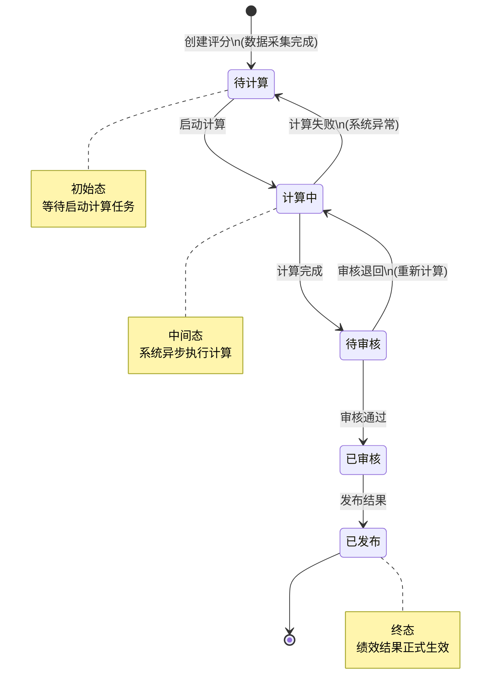
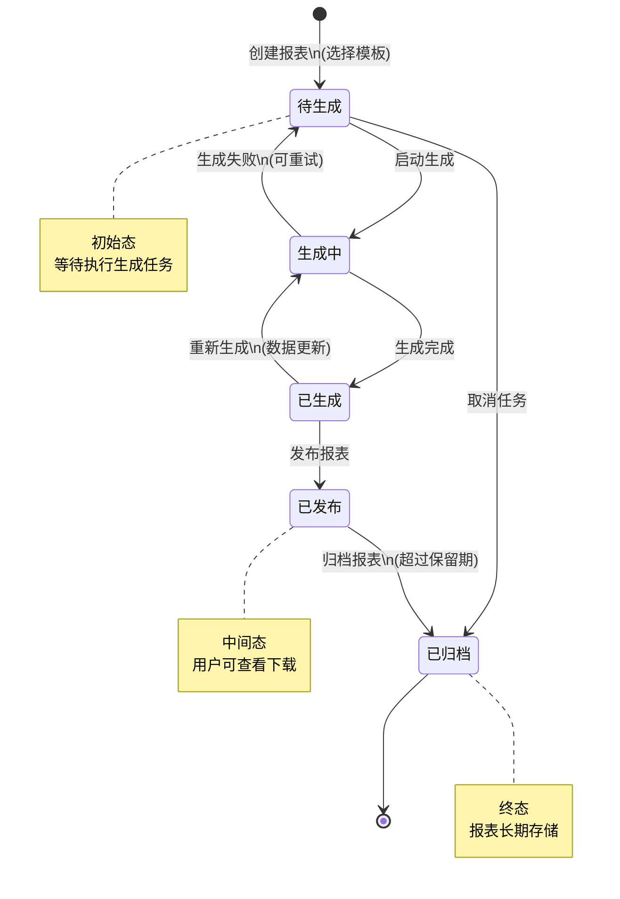
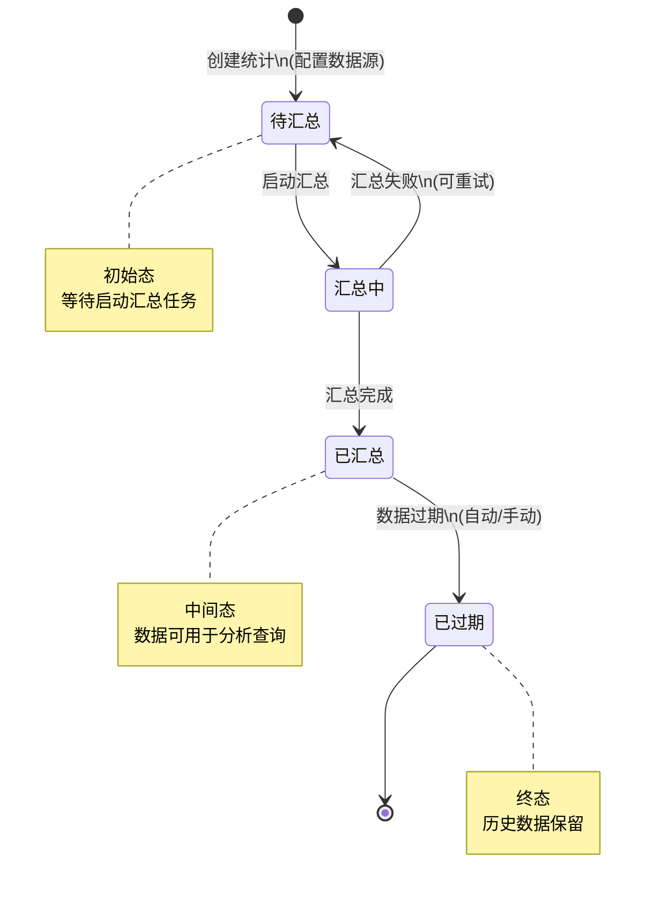

# M12-运营管理 - 状态机设计文档

> **文档编号**: YUDAO-HIS-SM-M12
> **版本**: V1.0
> **创建日期**: 2026-06-22
> **状态**: 设计中
> **关联文档**: YUDAO-HIS-SM-001 (全局状态机设计文档)

---

## 1. 概述

本文档定义运营管理模块(M12)核心业务对象的状态机设计，包括绩效评分状态机、报表生成状态机和运营统计数据状态机。

### 1.1 状态机清单

| 序号 | 状态机编号 | 状态机名称 | 适用对象 | 优先级 | 业务规则 |
|------|------------|----------|----------|--------|----------|
| 1 | SM-012-001 | 绩效评分状态机 | op_performance_score | P0 | BR-OPS-001 |
| 2 | SM-012-002 | 报表生成状态机 | op_report | P0 | BR-OPS-002 |
| 3 | SM-012-003 | 运营统计数据状态机 | op_statistics | P1 | BR-OPS-003 |

---

## 2. 绩效评分状态机 (SM-012-001)

### 2.1 基本信息

| 属性 | 内容 |
|------|------|
| 状态机编号 | SM-012-001 |
| 状态机名称 | 绩效评分状态机 |
| 适用对象 | op_performance_score（绩效评分表） |
| 状态字段 | score_status |
| 业务规则 | BR-OPS-001: 绩效评分状态流转规则 |
| 优先级 | P0（MVP必需） |

### 2.2 状态列表

| 状态编码 | 状态名称 | 状态描述 | 状态类型 | 允许操作 |
|----------|----------|----------|----------|----------|
| 1 | 待计算 | 绩效数据已采集，等待计算 | 初始态 | 启动计算 |
| 2 | 计算中 | 系统正在计算绩效得分 | 中间态 | 取消计算 |
| 3 | 待审核 | 计算完成，等待主管审核 | 中间态 | 审核通过、审核退回 |
| 4 | 已审核 | 审核通过，等待发布 | 中间态 | 发布 |
| 5 | 已发布 | 绩效结果已发布，生效中 | 终态 | 无 |

### 2.3 状态流转表

| 当前状态 | 触发事件 | 目标状态 | 前置条件 | 执行操作 | 关联规则 |
|----------|----------|----------|----------|----------|----------|
| - | 创建评分 | 待计算(1) | 数据采集完成 | 创建评分记录、关联数据源 | BR-OPS-010 |
| 待计算(1) | 启动计算 | 计算中(2) | 无进行中的计算任务 | 启动异步计算任务 | BR-OPS-011 |
| 计算中(2) | 计算完成 | 待审核(3) | 所有指标计算完毕 | 存储计算结果、生成汇总报告 | BR-OPS-012 |
| 计算中(2) | 计算失败 | 待计算(1) | 系统异常或数据错误 | 记录错误日志、回滚临时数据 | BR-OPS-013 |
| 待审核(3) | 审核通过 | 已审核(4) | 审核人确认 | 记录审核意见、审核时间 | BR-OPS-014 |
| 待审核(3) | 审核退回 | 计算中(2) | 发现计算问题 | 记录退回原因、重新计算 | BR-OPS-015 |
| 已审核(4) | 发布结果 | 已发布(5) | 审批通过 | 发送通知、更新绩效档案 | BR-OPS-016 |

### 2.4 状态流转图



### 2.5 状态约束规则

1. **计算互斥**: 同一考核周期内，同一科室/人员只能有一个进行中的计算任务
2. **数据完整性**: 计算前必须确保所有数据源采集完成（BR-OPS-010）
3. **审核权限**: 仅具备审核权限的管理人员可执行审核操作
4. **发布时效**: 审核通过后应在规定时限内发布，超期需重新审核
5. **结果追溯**: 已发布的绩效结果应保留完整的计算过程和审核记录

### 2.6 Java枚举定义

```java
/**
 * 绩效评分状态枚举
 */
public enum PerformanceScoreStatusEnum implements StatusEnum {

    PENDING_CALCULATION(1, "待计算", "绩效数据已采集，等待计算"),
    CALCULATING(2, "计算中", "系统正在计算绩效得分"),
    PENDING_AUDIT(3, "待审核", "计算完成，等待主管审核"),
    AUDITED(4, "已审核", "审核通过，等待发布"),
    PUBLISHED(5, "已发布", "绩效结果已发布，生效中");

    private final Integer code;
    private final String name;
    private final String description;

    PerformanceScoreStatusEnum(Integer code, String name, String description) {
        this.code = code;
        this.name = name;
        this.description = description;
    }

    @Override
    public Integer getCode() {
        return code;
    }

    @Override
    public String getName() {
        return name;
    }

    @Override
    public String getDescription() {
        return description;
    }

    /**
     * 判断是否可以启动计算
     */
    public boolean canStartCalculation() {
        return this == PENDING_CALCULATION;
    }

    /**
     * 判断是否可以审核
     */
    public boolean canAudit() {
        return this == PENDING_AUDIT;
    }

    /**
     * 判断是否可以发布
     */
    public boolean canPublish() {
        return this == AUDITED;
    }

    /**
     * 判断是否为终态
     */
    public boolean isFinal() {
        return this == PUBLISHED;
    }
}
```

---

## 3. 报表生成状态机 (SM-012-002)

### 3.1 基本信息

| 属性 | 内容 |
|------|------|
| 状态机编号 | SM-012-002 |
| 状态机名称 | 报表生成状态机 |
| 适用对象 | op_report（运营报表表） |
| 状态字段 | report_status |
| 业务规则 | BR-OPS-002: 报表生成状态流转规则 |
| 优先级 | P0（MVP必需） |

### 3.2 状态列表

| 状态编码 | 状态名称 | 状态描述 | 状态类型 | 允许操作 |
|----------|----------|----------|----------|----------|
| 1 | 待生成 | 报表任务已创建，等待执行 | 初始态 | 启动生成、取消 |
| 2 | 生成中 | 系统正在生成报表数据 | 中间态 | 取消生成 |
| 3 | 已生成 | 报表生成完成，可供查看 | 中间态 | 发布、重新生成 |
| 4 | 已发布 | 报表已发布，可供查看下载 | 中间态 | 归档 |
| 5 | 已归档 | 报表已归档存储 | 终态 | 无 |

### 3.3 状态流转表

| 当前状态 | 触发事件 | 目标状态 | 前置条件 | 执行操作 | 关联规则 |
|----------|----------|----------|----------|----------|----------|
| - | 创建报表 | 待生成(1) | 报表模板存在 | 创建报表任务记录 | BR-OPS-020 |
| 待生成(1) | 启动生成 | 生成中(2) | 数据源可用 | 启动异步生成任务 | BR-OPS-021 |
| 待生成(1) | 取消任务 | 已归档(5) | 用户主动取消 | 记录取消原因 | BR-OPS-022 |
| 生成中(2) | 生成完成 | 已生成(3) | 数据处理完毕 | 存储报表文件、生成预览 | BR-OPS-023 |
| 生成中(2) | 生成失败 | 待生成(1) | 系统异常或数据问题 | 记录错误日志、支持重试 | BR-OPS-024 |
| 已生成(3) | 发布报表 | 已发布(4) | 审核通过（如需） | 发送发布通知、开放访问 | BR-OPS-025 |
| 已生成(3) | 重新生成 | 生成中(2) | 数据有更新 | 删除旧文件、重新生成 | BR-OPS-026 |
| 已发布(4) | 归档报表 | 已归档(5) | 超过保留期限或手动归档 | 移动到归档存储、压缩备份 | BR-OPS-027 |

### 3.4 状态流转图



### 3.5 状态约束规则

1. **生成队列**: 报表生成采用异步队列机制，避免并发过多导致系统压力
2. **数据锁定**: 生成中报表关联的数据源应避免大规模变更
3. **重试限制**: 生成失败后自动重试不超过3次，超过需人工介入
4. **归档周期**: 已发布报表默认保留90天后自动归档（BR-OPS-027）
5. **访问权限**: 已发布报表的查看和下载需具备相应权限

### 3.6 Java枚举定义

```java
/**
 * 报表生成状态枚举
 */
public enum ReportStatusEnum implements StatusEnum {

    PENDING_GENERATION(1, "待生成", "报表任务已创建，等待执行"),
    GENERATING(2, "生成中", "系统正在生成报表数据"),
    GENERATED(3, "已生成", "报表生成完成，可供查看"),
    PUBLISHED(4, "已发布", "报表已发布，可供查看下载"),
    ARCHIVED(5, "已归档", "报表已归档存储");

    private final Integer code;
    private final String name;
    private final String description;

    ReportStatusEnum(Integer code, String name, String description) {
        this.code = code;
        this.name = name;
        this.description = description;
    }

    @Override
    public Integer getCode() {
        return code;
    }

    @Override
    public String getName() {
        return name;
    }

    @Override
    public String getDescription() {
        return description;
    }

    /**
     * 判断是否可以启动生成
     */
    public boolean canStartGeneration() {
        return this == PENDING_GENERATION;
    }

    /**
     * 判断是否可以发布
     */
    public boolean canPublish() {
        return this == GENERATED;
    }

    /**
     * 判断是否可以归档
     */
    public boolean canArchive() {
        return this == PUBLISHED;
    }

    /**
     * 判断是否可以重新生成
     */
    public boolean canRegenerate() {
        return this == GENERATED;
    }

    /**
     * 判断是否为终态
     */
    public boolean isFinal() {
        return this == ARCHIVED;
    }
}
```

---

## 4. 运营统计数据状态机 (SM-012-003)

### 4.1 基本信息

| 属性 | 内容 |
|------|------|
| 状态机编号 | SM-012-003 |
| 状态机名称 | 运营统计数据状态机 |
| 适用对象 | op_statistics（运营统计数据表） |
| 状态字段 | statistics_status |
| 业务规则 | BR-OPS-003: 运营统计数据状态流转规则 |
| 优先级 | P1（重要非紧急） |

### 4.2 状态列表

| 状态编码 | 状态名称 | 状态描述 | 状态类型 | 允许操作 |
|----------|----------|----------|----------|----------|
| 1 | 待汇总 | 原始数据已采集，等待汇总 | 初始态 | 启动汇总 |
| 2 | 汇总中 | 系统正在进行数据汇总计算 | 中间态 | 取消汇总 |
| 3 | 已汇总 | 数据汇总完成，可用于分析 | 中间态 | 过期处理 |
| 4 | 已过期 | 数据已过期，仅作历史记录 | 终态 | 无 |

### 4.3 状态流转表

| 当前状态 | 触发事件 | 目标状态 | 前置条件 | 执行操作 | 关联规则 |
|----------|----------|----------|----------|----------|----------|
| - | 创建统计 | 待汇总(1) | 数据源配置完成 | 创建统计任务、锁定数据范围 | BR-OPS-030 |
| 待汇总(1) | 启动汇总 | 汇总中(2) | 源数据已准备就绪 | 启动异步汇总任务 | BR-OPS-031 |
| 汇总中(2) | 汇总完成 | 已汇总(3) | 所有指标汇总完毕 | 存储汇总结果、更新缓存 | BR-OPS-032 |
| 汇总中(2) | 汇总失败 | 待汇总(1) | 数据异常或系统错误 | 记录错误日志、支持重试 | BR-OPS-033 |
| 已汇总(3) | 数据过期 | 已过期(4) | 超过有效期或新数据生成 | 标记过期、归档历史数据 | BR-OPS-034 |
| 已汇总(3) | 手动过期 | 已过期(4) | 管理员手动标记 | 记录操作原因 | BR-OPS-035 |

### 4.4 状态流转图



### 4.5 状态约束规则

1. **汇总周期**: 统计数据按日/周/月/季/年进行周期性汇总
2. **数据时效**: 已汇总数据默认有效期30天，超期自动标记过期（BR-OPS-034）
3. **历史保留**: 已过期数据保留3年，供历史查询和趋势分析
4. **缓存更新**: 汇总完成后自动更新相关缓存，确保查询性能
5. **增量汇总**: 支持增量汇总，避免重复计算历史数据

### 4.6 Java枚举定义

```java
/**
 * 运营统计数据状态枚举
 */
public enum StatisticsStatusEnum implements StatusEnum {

    PENDING_SUMMARY(1, "待汇总", "原始数据已采集，等待汇总"),
    SUMMARIZING(2, "汇总中", "系统正在进行数据汇总计算"),
    SUMMARIZED(3, "已汇总", "数据汇总完成，可用于分析"),
    EXPIRED(4, "已过期", "数据已过期，仅作历史记录");

    private final Integer code;
    private final String name;
    private final String description;

    StatisticsStatusEnum(Integer code, String name, String description) {
        this.code = code;
        this.name = name;
        this.description = description;
    }

    @Override
    public Integer getCode() {
        return code;
    }

    @Override
    public String getName() {
        return name;
    }

    @Override
    public String getDescription() {
        return description;
    }

    /**
     * 判断是否可以启动汇总
     */
    public boolean canStartSummary() {
        return this == PENDING_SUMMARY;
    }

    /**
     * 判断是否可以使用
     */
    public boolean isUsable() {
        return this == SUMMARIZED;
    }

    /**
     * 判断是否为终态
     */
    public boolean isFinal() {
        return this == EXPIRED;
    }
}
```

---

## 附录: 变更历史

| 版本 | 日期 | 变更内容 | 变更人 |
|------|------|----------|--------|
| V1.0 | 2026-06-22 | 创建运营管理模块状态机设计文档 | YUDAO-AI-HIS架构组 |

---

> **最后更新**: 2026-06-22
