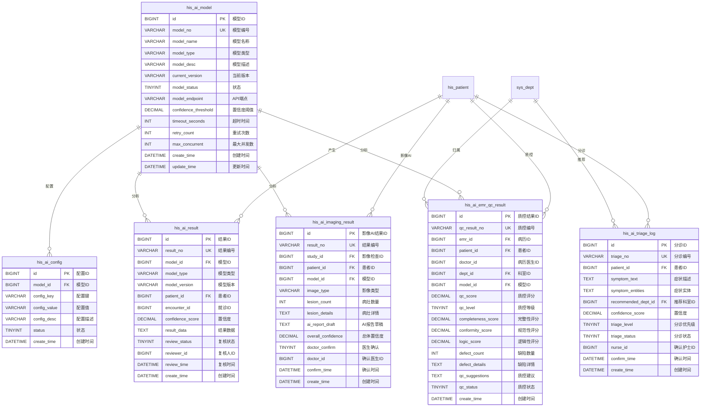

# M13-AI辅助 - 数据库设计文档

> **文档编号**: YUDAO-HIS-DB-M13
> **版本**: V1.0
> **创建日期**: 2026-06-22
> **状态**: 设计中
> **所属模块**: M13-AI辅助子系统
> **参考文档**: YUDAO-HIS-DB-001, YUDAO-HIS-MDD-001, YUDAO-HIS-FP-M13-01~04

---

## 1. 设计概述

### 1.1 模块概述

M13-AI辅助子系统是YUDAO-AI-HIS智慧医疗信息系统的智能化模块，提供智能分诊、影像AI辅助诊断、病历质控AI和AI模型管理四大核心功能。本数据库设计文档详细定义了AI辅助模块所需的数据表结构。

### 1.2 设计原则

| 原则 | 说明 |
|------|------|
| 标准化 | 遵循全局数据库设计文档的命名规范和字段定义 |
| 规范化 | 遵循数据库第三范式(3NF)，减少数据冗余 |
| 可追溯 | 完整记录AI调用过程和结果，支持结果追溯 |
| 安全性 | AI结果必须人工复核，置信度低时提供警告 |
| 性能优化 | 合理设计索引，支持大数据量场景 |

### 1.3 数据库选型

| 项目 | 选择 | 说明 |
|------|------|------|
| 数据库 | MySQL 8.0+ | 与全局数据库保持一致 |
| 字符集 | utf8mb4 | 支持emoji和特殊字符 |
| 排序规则 | utf8mb4_unicode_ci | 支持多语言排序 |
| 存储引擎 | InnoDB | 支持事务和外键 |

---

## 2. ER图设计

### 2.1 M13 AI辅助模块ER图



### 2.2 表关系说明

| 关系 | 类型 | 说明 |
|------|------|------|
| his_patient -> his_ai_result | 一对多 | 一个患者可产生多条AI分析结果 |
| his_patient -> his_ai_triage_log | 一对多 | 一个患者可有多次分诊记录 |
| his_patient -> his_ai_imaging_result | 一对多 | 一个患者可有多条影像AI结果 |
| his_patient -> his_ai_emr_qc_result | 一对多 | 一个患者可有多条质控结果 |
| his_ai_model -> his_ai_result | 一对多 | 一个模型可产生多条分析结果 |
| his_ai_model -> his_ai_config | 一对多 | 一个模型可有多项配置 |
| sys_dept -> his_ai_triage_log | 一对多 | 科室与分诊记录关联 |

---

## 3. DDL脚本设计

### 3.1 通用字段说明

```sql
-- =============================================
-- 通用字段说明（基于 ruoyi-vue-pro 框架规范）
-- 所有表均包含以下通用字段：
-- creator VARCHAR(64) DEFAULT '' COMMENT '创建者'
-- create_time DATETIME NOT NULL DEFAULT CURRENT_TIMESTAMP COMMENT '创建时间'
-- updater VARCHAR(64) DEFAULT '' COMMENT '更新者'
-- update_time DATETIME NOT NULL DEFAULT CURRENT_TIMESTAMP ON UPDATE CURRENT_TIMESTAMP COMMENT '更新时间'
-- deleted BIT(1) NOT NULL DEFAULT b'0' COMMENT '是否删除'
-- tenant_id BIGINT NOT NULL DEFAULT 0 COMMENT '租户编号'
-- =============================================
```

### 3.2 AI模型表 (his_ai_model)

```sql
-- =============================================
-- AI模型表
-- 用于管理所有AI模型的基本信息、配置参数和运行状态
-- =============================================
CREATE TABLE `his_ai_model` (
    `id` BIGINT NOT NULL AUTO_INCREMENT COMMENT '模型ID',
    `model_no` VARCHAR(30) NOT NULL COMMENT '模型编号，格式：MOD+序号',
    `model_name` VARCHAR(100) NOT NULL COMMENT '模型名称',
    `model_type` VARCHAR(50) NOT NULL COMMENT '模型类型：TRIAGE-智能分诊/IMAGING-影像AI/QC-病历质控/DIAGNOSIS-辅助诊断/ECG-心电分析',
    `model_desc` VARCHAR(500) COMMENT '模型描述',
    `current_version` VARCHAR(20) NOT NULL COMMENT '当前版本',
    `model_status` TINYINT NOT NULL DEFAULT 1 COMMENT '状态：1启用/2禁用/3测试',
    `model_endpoint` VARCHAR(200) NOT NULL COMMENT 'API端点地址',
    `protocol` VARCHAR(20) NOT NULL DEFAULT 'REST' COMMENT '协议：REST/gRPC',
    `auth_type` VARCHAR(20) COMMENT '认证方式：API_KEY/BEARER_TOKEN/BASIC_AUTH',
    `api_key` VARCHAR(200) COMMENT 'API密钥（加密存储）',
    `confidence_threshold` DECIMAL(5,2) NOT NULL DEFAULT 70.00 COMMENT '置信度阈值，默认70',
    `timeout_seconds` INT NOT NULL DEFAULT 30 COMMENT '超时时间（秒），默认30',
    `retry_count` INT NOT NULL DEFAULT 2 COMMENT '重试次数，默认2',
    `max_concurrent` INT NOT NULL DEFAULT 100 COMMENT '最大并发数，默认100',
    `cache_seconds` INT NOT NULL DEFAULT 0 COMMENT '结果缓存时间（秒），0表示不缓存',
    `accuracy_rate` DECIMAL(5,2) COMMENT '准确率',
    `avg_response_time` INT COMMENT '平均响应时间（毫秒）',
    `daily_call_count` INT DEFAULT 0 COMMENT '日均调用次数',
    `user_satisfaction` DECIMAL(3,2) COMMENT '用户满意度（1-5分）',
    `remark` VARCHAR(500) COMMENT '备注',
    `creator` VARCHAR(64) DEFAULT '' COMMENT '创建者',
    `create_time` DATETIME NOT NULL DEFAULT CURRENT_TIMESTAMP COMMENT '创建时间',
    `updater` VARCHAR(64) DEFAULT '' COMMENT '更新者',
    `update_time` DATETIME NOT NULL DEFAULT CURRENT_TIMESTAMP ON UPDATE CURRENT_TIMESTAMP COMMENT '更新时间',
    `deleted` BIT(1) NOT NULL DEFAULT b'0' COMMENT '是否删除',
    `tenant_id` BIGINT NOT NULL DEFAULT 0 COMMENT '租户编号',
    PRIMARY KEY (`id`),
    UNIQUE KEY `uk_model_no` (`model_no`),
    KEY `idx_model_type` (`model_type`),
    KEY `idx_model_status` (`model_status`)
) ENGINE=InnoDB DEFAULT CHARSET=utf8mb4 COLLATE=utf8mb4_unicode_ci COMMENT='AI模型表';
```

### 3.3 AI分析结果表 (his_ai_result)

```sql
-- =============================================
-- AI分析结果表
-- 记录所有AI分析的通用结果信息，支持结果追溯
-- 年增量估算：约50万条
-- =============================================
CREATE TABLE `his_ai_result` (
    `id` BIGINT NOT NULL AUTO_INCREMENT COMMENT '结果ID',
    `result_no` VARCHAR(30) NOT NULL COMMENT '结果编号，格式：AI+日期+序号',
    `model_id` BIGINT NOT NULL COMMENT '模型ID',
    `model_type` VARCHAR(50) NOT NULL COMMENT '模型类型',
    `model_version` VARCHAR(20) NOT NULL COMMENT '模型版本',
    `patient_id` BIGINT NOT NULL COMMENT '患者ID',
    `patient_name` VARCHAR(50) COMMENT '患者姓名',
    `encounter_id` BIGINT COMMENT '就诊ID（挂号ID/住院ID）',
    `encounter_type` TINYINT COMMENT '就诊类型：1门诊/2住院',
    `request_id` VARCHAR(50) NOT NULL COMMENT '请求ID',
    `request_params` TEXT COMMENT '请求参数（JSON）',
    `request_time` DATETIME NOT NULL COMMENT '请求时间',
    `response_result` TEXT COMMENT '响应结果（JSON）',
    `response_duration` INT COMMENT '响应耗时（毫秒）',
    `confidence_score` DECIMAL(5,2) COMMENT '置信度（0-100）',
    `result_data` TEXT COMMENT '结果详情数据（JSON）',
    `analysis_status` TINYINT NOT NULL DEFAULT 1 COMMENT '分析状态：1待分析/2分析中/3已分析/4分析失败',
    `error_code` VARCHAR(20) COMMENT '错误码',
    `error_message` VARCHAR(500) COMMENT '错误信息',
    `review_status` TINYINT DEFAULT 0 COMMENT '复核状态：0未复核/1已确认/2已调整/3已忽略',
    `reviewer_id` BIGINT COMMENT '复核人ID',
    `reviewer_name` VARCHAR(50) COMMENT '复核人姓名',
    `review_time` DATETIME COMMENT '复核时间',
    `review_opinion` VARCHAR(500) COMMENT '复核意见',
    `is_adopted` TINYINT COMMENT '是否采用：0否/1部分采用/2完全采用',
    `feedback_score` TINYINT COMMENT '反馈评分：1-5分',
    `feedback_text` VARCHAR(500) COMMENT '反馈意见',
    `creator` VARCHAR(64) DEFAULT '' COMMENT '创建者',
    `create_time` DATETIME NOT NULL DEFAULT CURRENT_TIMESTAMP COMMENT '创建时间',
    `updater` VARCHAR(64) DEFAULT '' COMMENT '更新者',
    `update_time` DATETIME NOT NULL DEFAULT CURRENT_TIMESTAMP ON UPDATE CURRENT_TIMESTAMP COMMENT '更新时间',
    `deleted` BIT(1) NOT NULL DEFAULT b'0' COMMENT '是否删除',
    `tenant_id` BIGINT NOT NULL DEFAULT 0 COMMENT '租户编号',
    PRIMARY KEY (`id`),
    UNIQUE KEY `uk_result_no` (`result_no`),
    KEY `idx_ai_result_model` (`model_id`),
    KEY `idx_ai_result_patient` (`patient_id`),
    KEY `idx_ai_result_encounter` (`encounter_id`),
    KEY `idx_ai_result_type` (`model_type`),
    KEY `idx_ai_result_status` (`review_status`),
    KEY `idx_ai_result_time` (`create_time`)
) ENGINE=InnoDB DEFAULT CHARSET=utf8mb4 COLLATE=utf8mb4_unicode_ci COMMENT='AI分析结果表';
```

### 3.4 AI配置表 (his_ai_config)

```sql
-- =============================================
-- AI配置表
-- 存储AI模型的可扩展配置参数
-- =============================================
CREATE TABLE `his_ai_config` (
    `id` BIGINT NOT NULL AUTO_INCREMENT COMMENT '配置ID',
    `model_id` BIGINT NOT NULL COMMENT '模型ID',
    `config_key` VARCHAR(100) NOT NULL COMMENT '配置键',
    `config_value` VARCHAR(500) NOT NULL COMMENT '配置值',
    `config_type` VARCHAR(20) NOT NULL DEFAULT 'STRING' COMMENT '配置类型：STRING/NUMBER/BOOLEAN/JSON',
    `config_desc` VARCHAR(200) COMMENT '配置描述',
    `default_value` VARCHAR(500) COMMENT '默认值',
    `min_value` DECIMAL(20,6) COMMENT '最小值（数值类型）',
    `max_value` DECIMAL(20,6) COMMENT '最大值（数值类型）',
    `sort_order` INT DEFAULT 0 COMMENT '排序号',
    `status` TINYINT NOT NULL DEFAULT 1 COMMENT '状态：0禁用/1启用',
    `remark` VARCHAR(200) COMMENT '备注',
    `creator` VARCHAR(64) DEFAULT '' COMMENT '创建者',
    `create_time` DATETIME NOT NULL DEFAULT CURRENT_TIMESTAMP COMMENT '创建时间',
    `updater` VARCHAR(64) DEFAULT '' COMMENT '更新者',
    `update_time` DATETIME NOT NULL DEFAULT CURRENT_TIMESTAMP ON UPDATE CURRENT_TIMESTAMP COMMENT '更新时间',
    `deleted` BIT(1) NOT NULL DEFAULT b'0' COMMENT '是否删除',
    `tenant_id` BIGINT NOT NULL DEFAULT 0 COMMENT '租户编号',
    PRIMARY KEY (`id`),
    UNIQUE KEY `uk_model_config` (`model_id`, `config_key`),
    KEY `idx_config_model` (`model_id`)
) ENGINE=InnoDB DEFAULT CHARSET=utf8mb4 COLLATE=utf8mb4_unicode_ci COMMENT='AI配置表';
```

### 3.5 智能分诊日志表 (his_ai_triage_log)

```sql
-- =============================================
-- 智能分诊日志表
-- 记录智能分诊的完整过程和结果
-- 年增量估算：约20万条
-- =============================================
CREATE TABLE `his_ai_triage_log` (
    `id` BIGINT NOT NULL AUTO_INCREMENT COMMENT '分诊ID',
    `triage_no` VARCHAR(30) NOT NULL COMMENT '分诊编号，格式：TR+日期+序号',
    `patient_id` BIGINT NOT NULL COMMENT '患者ID',
    `patient_name` VARCHAR(50) NOT NULL COMMENT '患者姓名',
    `patient_phone` VARCHAR(20) COMMENT '患者手机号',
    `symptom_text` TEXT NOT NULL COMMENT '原始症状描述文本',
    `symptom_codes` VARCHAR(500) COMMENT '标准化症状编码（JSON数组）',
    `symptom_entities` TEXT COMMENT 'NLP提取的症状实体（JSON）',
    `input_type` TINYINT NOT NULL DEFAULT 1 COMMENT '输入类型：1文字/2语音/3快速选择',
    `recommended_dept_id` BIGINT NOT NULL COMMENT '推荐科室ID',
    `recommended_dept_name` VARCHAR(100) NOT NULL COMMENT '推荐科室名称',
    `confidence_score` DECIMAL(5,2) NOT NULL COMMENT 'AI置信度（0-100）',
    `alternative_depts` TEXT COMMENT '可选科室列表（JSON）',
    `triage_level` TINYINT NOT NULL DEFAULT 1 COMMENT '分诊优先级：1普通/2优先/3紧急',
    `triage_suggestion` VARCHAR(500) COMMENT '分诊建议',
    `ai_model_id` BIGINT NOT NULL COMMENT 'AI模型ID',
    `ai_model_version` VARCHAR(20) NOT NULL COMMENT '模型版本',
    `analysis_duration` INT COMMENT '分析耗时（毫秒）',
    `triage_status` TINYINT NOT NULL DEFAULT 1 COMMENT '状态：1待分析/2已分析/3待确认/4已确认/5已挂号/6人工分诊',
    `nurse_confirm` TINYINT DEFAULT 0 COMMENT '护士确认：0未确认/1已确认',
    `nurse_id` BIGINT COMMENT '确认护士ID',
    `nurse_name` VARCHAR(50) COMMENT '确认护士姓名',
    `confirm_time` DATETIME COMMENT '确认时间',
    `actual_dept_id` BIGINT COMMENT '实际挂号科室ID',
    `actual_dept_name` VARCHAR(100) COMMENT '实际挂号科室名称',
    `adjust_reason` VARCHAR(500) COMMENT '调整原因',
    `is_correct` TINYINT COMMENT '分诊是否正确：0否/1是',
    `feedback_text` VARCHAR(500) COMMENT '反馈意见',
    `feedback_time` DATETIME COMMENT '反馈时间',
    `channel` TINYINT NOT NULL DEFAULT 1 COMMENT '分诊渠道：1小程序/2自助机/3窗口',
    `register_id` BIGINT COMMENT '关联挂号ID',
    `remark` VARCHAR(500) COMMENT '备注',
    `creator` VARCHAR(64) DEFAULT '' COMMENT '创建者',
    `create_time` DATETIME NOT NULL DEFAULT CURRENT_TIMESTAMP COMMENT '创建时间',
    `updater` VARCHAR(64) DEFAULT '' COMMENT '更新者',
    `update_time` DATETIME NOT NULL DEFAULT CURRENT_TIMESTAMP ON UPDATE CURRENT_TIMESTAMP COMMENT '更新时间',
    `deleted` BIT(1) NOT NULL DEFAULT b'0' COMMENT '是否删除',
    `tenant_id` BIGINT NOT NULL DEFAULT 0 COMMENT '租户编号',
    PRIMARY KEY (`id`),
    UNIQUE KEY `uk_triage_no` (`triage_no`),
    KEY `idx_triage_patient` (`patient_id`),
    KEY `idx_triage_dept` (`recommended_dept_id`),
    KEY `idx_triage_status` (`triage_status`),
    KEY `idx_triage_time` (`create_time`),
    KEY `idx_triage_nurse` (`nurse_id`)
) ENGINE=InnoDB DEFAULT CHARSET=utf8mb4 COLLATE=utf8mb4_unicode_ci COMMENT='智能分诊日志表';
```

### 3.6 影像AI结果表 (his_ai_imaging_result)

```sql
-- =============================================
-- 影像AI结果表
-- 记录影像AI分析结果，包括病灶检测和AI辅助报告
-- 年增量估算：约30万条
-- =============================================
CREATE TABLE `his_ai_imaging_result` (
    `id` BIGINT NOT NULL AUTO_INCREMENT COMMENT '影像AI结果ID',
    `result_no` VARCHAR(30) NOT NULL COMMENT '结果编号，格式：IM+日期+序号',
    `study_id` BIGINT NOT NULL COMMENT '影像检查ID',
    `study_no` VARCHAR(30) NOT NULL COMMENT '影像检查编号',
    `patient_id` BIGINT NOT NULL COMMENT '患者ID',
    `patient_name` VARCHAR(50) NOT NULL COMMENT '患者姓名',
    `series_id` BIGINT COMMENT '影像序列ID',
    `image_type` VARCHAR(50) NOT NULL COMMENT '影像类型：CT_CHEST/CT_ABDOMEN/MRI_BRAIN/XR_CHEST等',
    `modality` VARCHAR(20) COMMENT '检查类型：CT/MR/US/DR/CR/RF',
    `model_id` BIGINT NOT NULL COMMENT 'AI模型ID',
    `model_name` VARCHAR(100) NOT NULL COMMENT 'AI模型名称',
    `model_version` VARCHAR(20) NOT NULL COMMENT '模型版本',
    `lesion_count` INT NOT NULL DEFAULT 0 COMMENT '检测病灶数量',
    `lesion_details` TEXT COMMENT '病灶详情（JSON数组）',
    `ai_report_draft` TEXT COMMENT 'AI辅助报告草稿',
    `overall_confidence` DECIMAL(5,2) NOT NULL COMMENT '总体置信度（0-100）',
    `analysis_time` DATETIME NOT NULL COMMENT '分析时间',
    `analysis_duration` INT COMMENT '分析耗时（秒）',
    `analysis_status` TINYINT NOT NULL DEFAULT 1 COMMENT '分析状态：1待分析/2分析中/3已分析/4分析失败',
    `error_message` VARCHAR(500) COMMENT '错误信息',
    `doctor_confirm` TINYINT DEFAULT 0 COMMENT '医生确认：0未确认/1已确认/2已调整/3已忽略',
    `doctor_id` BIGINT COMMENT '确认医生ID',
    `doctor_name` VARCHAR(50) COMMENT '确认医生姓名',
    `confirm_time` DATETIME COMMENT '确认时间',
    `confirm_notes` VARCHAR(500) COMMENT '确认备注',
    `is_adopted` TINYINT COMMENT '是否采用：0否/1部分采用/2完全采用',
    `adopted_lesion_ids` VARCHAR(500) COMMENT '采用的病灶ID列表',
    `feedback_score` TINYINT COMMENT '反馈评分：1-5分',
    `feedback_text` VARCHAR(500) COMMENT '反馈意见',
    `creator` VARCHAR(64) DEFAULT '' COMMENT '创建者',
    `create_time` DATETIME NOT NULL DEFAULT CURRENT_TIMESTAMP COMMENT '创建时间',
    `updater` VARCHAR(64) DEFAULT '' COMMENT '更新者',
    `update_time` DATETIME NOT NULL DEFAULT CURRENT_TIMESTAMP ON UPDATE CURRENT_TIMESTAMP COMMENT '更新时间',
    `deleted` BIT(1) NOT NULL DEFAULT b'0' COMMENT '是否删除',
    `tenant_id` BIGINT NOT NULL DEFAULT 0 COMMENT '租户编号',
    PRIMARY KEY (`id`),
    UNIQUE KEY `uk_imaging_result_no` (`result_no`),
    KEY `idx_imaging_study` (`study_id`),
    KEY `idx_imaging_patient` (`patient_id`),
    KEY `idx_imaging_model` (`model_id`),
    KEY `idx_imaging_type` (`image_type`),
    KEY `idx_imaging_status` (`analysis_status`),
    KEY `idx_imaging_confirm` (`doctor_confirm`),
    KEY `idx_imaging_time` (`create_time`)
) ENGINE=InnoDB DEFAULT CHARSET=utf8mb4 COLLATE=utf8mb4_unicode_ci COMMENT='影像AI结果表';
```

### 3.7 病历质控AI结果表 (his_ai_emr_qc_result)

```sql
-- =============================================
-- 病历质控AI结果表
-- 记录病历质控AI分析结果，包括完整性、规范性、逻辑性检查
-- 年增量估算：约40万条
-- =============================================
CREATE TABLE `his_ai_emr_qc_result` (
    `id` BIGINT NOT NULL AUTO_INCREMENT COMMENT '质控结果ID',
    `qc_result_no` VARCHAR(30) NOT NULL COMMENT '质控编号，格式：QC+日期+序号',
    `emr_id` BIGINT NOT NULL COMMENT '病历ID',
    `emr_type` TINYINT COMMENT '病历类型：1门诊病历/2入院记录/3病程记录/4出院记录',
    `patient_id` BIGINT NOT NULL COMMENT '患者ID',
    `patient_name` VARCHAR(50) NOT NULL COMMENT '患者姓名',
    `encounter_id` BIGINT COMMENT '就诊ID',
    `doctor_id` BIGINT NOT NULL COMMENT '病历书写医生ID',
    `doctor_name` VARCHAR(50) NOT NULL COMMENT '病历书写医生姓名',
    `dept_id` BIGINT NOT NULL COMMENT '科室ID',
    `dept_name` VARCHAR(100) COMMENT '科室名称',
    `model_id` BIGINT NOT NULL COMMENT 'AI模型ID',
    `model_version` VARCHAR(20) NOT NULL COMMENT '模型版本',
    `qc_score` DECIMAL(5,2) NOT NULL COMMENT '质控评分（0-100）',
    `qc_level` TINYINT NOT NULL COMMENT '质控等级：1优秀/2良好/3合格/4不合格',
    `completeness_score` DECIMAL(5,2) NOT NULL COMMENT '完整性评分',
    `conformity_score` DECIMAL(5,2) NOT NULL COMMENT '规范性评分',
    `logic_score` DECIMAL(5,2) NOT NULL COMMENT '逻辑性评分',
    `completeness_check` TEXT COMMENT '完整性检查结果（JSON）',
    `conformity_check` TEXT COMMENT '规范性检查结果（JSON）',
    `logic_check` TEXT COMMENT '逻辑性检查结果（JSON）',
    `defect_count` INT NOT NULL DEFAULT 0 COMMENT '缺陷数量',
    `major_defect_count` INT DEFAULT 0 COMMENT '主要缺陷数量',
    `minor_defect_count` INT DEFAULT 0 COMMENT '次要缺陷数量',
    `defect_details` TEXT COMMENT '缺陷详情（JSON数组）',
    `qc_suggestions` TEXT COMMENT '质控建议（JSON数组）',
    `qc_report` TEXT COMMENT '质控报告（Markdown格式）',
    `analysis_time` DATETIME NOT NULL COMMENT '分析时间',
    `analysis_duration` INT COMMENT '分析耗时（毫秒）',
    `qc_status` TINYINT NOT NULL DEFAULT 1 COMMENT '状态：1待分析/2已分析/3待审核/4通过/5待整改/6整改待审核',
    `qc_admin_id` BIGINT COMMENT '审核质控员ID',
    `qc_admin_name` VARCHAR(50) COMMENT '审核质控员姓名',
    `confirm_time` DATETIME COMMENT '审核时间',
    `revision_request_time` DATETIME COMMENT '整改要求时间',
    `revision_deadline` DATETIME COMMENT '整改截止时间',
    `revision_opinion` VARCHAR(500) COMMENT '整改意见',
    `revision_submit_time` DATETIME COMMENT '整改提交时间',
    `revision_content` TEXT COMMENT '整改内容说明',
    `timeout_count` INT DEFAULT 0 COMMENT '超时次数',
    `creator` VARCHAR(64) DEFAULT '' COMMENT '创建者',
    `create_time` DATETIME NOT NULL DEFAULT CURRENT_TIMESTAMP COMMENT '创建时间',
    `updater` VARCHAR(64) DEFAULT '' COMMENT '更新者',
    `update_time` DATETIME NOT NULL DEFAULT CURRENT_TIMESTAMP ON UPDATE CURRENT_TIMESTAMP COMMENT '更新时间',
    `deleted` BIT(1) NOT NULL DEFAULT b'0' COMMENT '是否删除',
    `tenant_id` BIGINT NOT NULL DEFAULT 0 COMMENT '租户编号',
    PRIMARY KEY (`id`),
    UNIQUE KEY `uk_qc_result_no` (`qc_result_no`),
    KEY `idx_qc_emr` (`emr_id`),
    KEY `idx_qc_patient` (`patient_id`),
    KEY `idx_qc_doctor` (`doctor_id`),
    KEY `idx_qc_dept` (`dept_id`),
    KEY `idx_qc_model` (`model_id`),
    KEY `idx_qc_status` (`qc_status`),
    KEY `idx_qc_score` (`qc_score`),
    KEY `idx_qc_time` (`create_time`)
) ENGINE=InnoDB DEFAULT CHARSET=utf8mb4 COLLATE=utf8mb4_unicode_ci COMMENT='病历质控AI结果表';
```

### 3.8 AI模型版本表 (his_ai_model_version)

```sql
-- =============================================
-- AI模型版本表
-- 记录AI模型的版本历史，支持版本切换和回滚
-- =============================================
CREATE TABLE `his_ai_model_version` (
    `id` BIGINT NOT NULL AUTO_INCREMENT COMMENT '版本ID',
    `model_id` BIGINT NOT NULL COMMENT '模型ID',
    `version_no` VARCHAR(20) NOT NULL COMMENT '版本号',
    `version_status` TINYINT NOT NULL DEFAULT 2 COMMENT '状态：1当前版本/2历史版本',
    `release_date` DATE NOT NULL COMMENT '发布日期',
    `change_log` TEXT COMMENT '变更说明',
    `model_endpoint` VARCHAR(200) COMMENT '版本对应的API端点',
    `is_active` TINYINT NOT NULL DEFAULT 1 COMMENT '是否可用：0否/1是',
    `switch_time` DATETIME COMMENT '切换时间',
    `switch_by` VARCHAR(50) COMMENT '切换操作人',
    `switch_reason` VARCHAR(500) COMMENT '切换原因',
    `creator` VARCHAR(64) DEFAULT '' COMMENT '创建者',
    `create_time` DATETIME NOT NULL DEFAULT CURRENT_TIMESTAMP COMMENT '创建时间',
    `updater` VARCHAR(64) DEFAULT '' COMMENT '更新者',
    `update_time` DATETIME NOT NULL DEFAULT CURRENT_TIMESTAMP ON UPDATE CURRENT_TIMESTAMP COMMENT '更新时间',
    `deleted` BIT(1) NOT NULL DEFAULT b'0' COMMENT '是否删除',
    `tenant_id` BIGINT NOT NULL DEFAULT 0 COMMENT '租户编号',
    PRIMARY KEY (`id`),
    UNIQUE KEY `uk_model_version` (`model_id`, `version_no`),
    KEY `idx_version_model` (`model_id`),
    KEY `idx_version_status` (`version_status`)
) ENGINE=InnoDB DEFAULT CHARSET=utf8mb4 COLLATE=utf8mb4_unicode_ci COMMENT='AI模型版本表';
```

### 3.9 AI服务状态表 (his_ai_service_status)

```sql
-- =============================================
-- AI服务状态表
-- 记录AI服务的实时运行状态和性能指标
-- =============================================
CREATE TABLE `his_ai_service_status` (
    `id` BIGINT NOT NULL AUTO_INCREMENT COMMENT '服务ID',
    `service_name` VARCHAR(100) NOT NULL COMMENT '服务名称',
    `service_type` VARCHAR(50) NOT NULL COMMENT '服务类型',
    `model_id` BIGINT NOT NULL COMMENT '关联模型ID',
    `service_status` TINYINT NOT NULL DEFAULT 1 COMMENT '状态：1正常/2警告/3异常/4禁用',
    `total_calls_today` INT NOT NULL DEFAULT 0 COMMENT '今日调用量',
    `success_count` INT NOT NULL DEFAULT 0 COMMENT '成功次数',
    `fail_count` INT NOT NULL DEFAULT 0 COMMENT '失败次数',
    `avg_response_time` INT NOT NULL DEFAULT 0 COMMENT '平均响应时间（毫秒）',
    `success_rate` DECIMAL(5,2) NOT NULL DEFAULT 0.00 COMMENT '成功率',
    `last_call_time` DATETIME COMMENT '最后调用时间',
    `last_error_time` DATETIME COMMENT '最后错误时间',
    `last_error_message` VARCHAR(500) COMMENT '最后错误信息',
    `check_time` DATETIME COMMENT '检查时间',
    `creator` VARCHAR(64) DEFAULT '' COMMENT '创建者',
    `create_time` DATETIME NOT NULL DEFAULT CURRENT_TIMESTAMP COMMENT '创建时间',
    `updater` VARCHAR(64) DEFAULT '' COMMENT '更新者',
    `update_time` DATETIME NOT NULL DEFAULT CURRENT_TIMESTAMP ON UPDATE CURRENT_TIMESTAMP COMMENT '更新时间',
    `deleted` BIT(1) NOT NULL DEFAULT b'0' COMMENT '是否删除',
    `tenant_id` BIGINT NOT NULL DEFAULT 0 COMMENT '租户编号',
    PRIMARY KEY (`id`),
    UNIQUE KEY `uk_service_name` (`service_name`),
    KEY `idx_service_model` (`model_id`),
    KEY `idx_service_status` (`service_status`)
) ENGINE=InnoDB DEFAULT CHARSET=utf8mb4 COLLATE=utf8mb4_unicode_ci COMMENT='AI服务状态表';
```

### 3.10 AI调用日志表 (his_ai_call_log)

```sql
-- =============================================
-- AI调用日志表
-- 记录AI服务调用的详细日志，支持问题追溯
-- 年增量估算：约100万条
-- 分表策略：按月分表
-- =============================================
CREATE TABLE `his_ai_call_log` (
    `id` BIGINT NOT NULL AUTO_INCREMENT COMMENT '日志ID',
    `log_no` VARCHAR(30) NOT NULL COMMENT '日志编号，格式：CL+日期+序号',
    `model_id` BIGINT NOT NULL COMMENT '模型ID',
    `model_type` VARCHAR(50) NOT NULL COMMENT '模型类型',
    `model_version` VARCHAR(20) NOT NULL COMMENT '模型版本',
    `service_id` BIGINT COMMENT '服务ID',
    `patient_id` BIGINT COMMENT '患者ID',
    `encounter_id` BIGINT COMMENT '就诊ID',
    `request_id` VARCHAR(50) NOT NULL COMMENT '请求ID',
    `request_params` TEXT COMMENT '请求参数（JSON）',
    `request_time` DATETIME NOT NULL COMMENT '请求时间',
    `response_result` TEXT COMMENT '响应结果（JSON）',
    `response_time` DATETIME COMMENT '响应时间',
    `response_duration` INT COMMENT '响应耗时（毫秒）',
    `confidence_score` DECIMAL(5,2) COMMENT '置信度',
    `call_status` TINYINT NOT NULL COMMENT '状态：1成功/2失败/3超时',
    `error_code` VARCHAR(20) COMMENT '错误码',
    `error_message` VARCHAR(500) COMMENT '错误信息',
    `review_status` TINYINT COMMENT '复核状态：1待复核/2已确认/3已调整/4已忽略',
    `reviewer_id` BIGINT COMMENT '复核人ID',
    `review_time` DATETIME COMMENT '复核时间',
    `is_adopted` TINYINT COMMENT '是否采用：0否/1部分采用/2完全采用',
    `feedback_score` TINYINT COMMENT '反馈评分：1-5分',
    `creator` VARCHAR(64) DEFAULT '' COMMENT '创建者',
    `create_time` DATETIME NOT NULL DEFAULT CURRENT_TIMESTAMP COMMENT '创建时间',
    `updater` VARCHAR(64) DEFAULT '' COMMENT '更新者',
    `update_time` DATETIME NOT NULL DEFAULT CURRENT_TIMESTAMP ON UPDATE CURRENT_TIMESTAMP COMMENT '更新时间',
    `deleted` BIT(1) NOT NULL DEFAULT b'0' COMMENT '是否删除',
    `tenant_id` BIGINT NOT NULL DEFAULT 0 COMMENT '租户编号',
    PRIMARY KEY (`id`),
    UNIQUE KEY `uk_log_no` (`log_no`),
    KEY `idx_call_model` (`model_id`),
    KEY `idx_call_patient` (`patient_id`),
    KEY `idx_call_status` (`call_status`),
    KEY `idx_call_time` (`request_time`),
    KEY `idx_call_request_id` (`request_id`)
) ENGINE=InnoDB DEFAULT CHARSET=utf8mb4 COLLATE=utf8mb4_unicode_ci COMMENT='AI调用日志表';
```

### 3.11 AI告警记录表 (his_ai_alert)

```sql
-- =============================================
-- AI告警记录表
-- 记录AI服务异常告警，支持告警处理跟踪
-- =============================================
CREATE TABLE `his_ai_alert` (
    `id` BIGINT NOT NULL AUTO_INCREMENT COMMENT '告警ID',
    `alert_no` VARCHAR(30) NOT NULL COMMENT '告警编号，格式：AL+日期+序号',
    `service_id` BIGINT COMMENT '服务ID',
    `model_id` BIGINT COMMENT '模型ID',
    `alert_level` TINYINT NOT NULL COMMENT '告警级别：1警告/2严重/3紧急',
    `alert_type` VARCHAR(50) NOT NULL COMMENT '告警类型：RESPONSE_TIME/SUCCESS_RATE/CALL_COUNT/SERVICE_DOWN',
    `alert_content` VARCHAR(500) NOT NULL COMMENT '告警内容',
    `alert_time` DATETIME NOT NULL COMMENT '告警时间',
    `alert_status` TINYINT NOT NULL DEFAULT 1 COMMENT '状态：1待处理/2已处理/3已忽略',
    `handler_id` BIGINT COMMENT '处理人ID',
    `handler_name` VARCHAR(50) COMMENT '处理人姓名',
    `handle_time` DATETIME COMMENT '处理时间',
    `handle_remark` VARCHAR(500) COMMENT '处理备注',
    `notify_status` TINYINT DEFAULT 0 COMMENT '通知状态：0未通知/1已通知',
    `notify_time` DATETIME COMMENT '通知时间',
    `creator` VARCHAR(64) DEFAULT '' COMMENT '创建者',
    `create_time` DATETIME NOT NULL DEFAULT CURRENT_TIMESTAMP COMMENT '创建时间',
    `updater` VARCHAR(64) DEFAULT '' COMMENT '更新者',
    `update_time` DATETIME NOT NULL DEFAULT CURRENT_TIMESTAMP ON UPDATE CURRENT_TIMESTAMP COMMENT '更新时间',
    `deleted` BIT(1) NOT NULL DEFAULT b'0' COMMENT '是否删除',
    `tenant_id` BIGINT NOT NULL DEFAULT 0 COMMENT '租户编号',
    PRIMARY KEY (`id`),
    UNIQUE KEY `uk_alert_no` (`alert_no`),
    KEY `idx_alert_service` (`service_id`),
    KEY `idx_alert_model` (`model_id`),
    KEY `idx_alert_level` (`alert_level`),
    KEY `idx_alert_status` (`alert_status`),
    KEY `idx_alert_time` (`alert_time`)
) ENGINE=InnoDB DEFAULT CHARSET=utf8mb4 COLLATE=utf8mb4_unicode_ci COMMENT='AI告警记录表';
```

### 3.12 症状标准编码表 (his_ai_symptom_dict)

```sql
-- =============================================
-- 症状标准编码表
-- 存储症状标准化编码，用于智能分诊症状匹配
-- =============================================
CREATE TABLE `his_ai_symptom_dict` (
    `id` BIGINT NOT NULL AUTO_INCREMENT COMMENT '症状ID',
    `symptom_code` VARCHAR(20) NOT NULL COMMENT '症状编码',
    `symptom_name` VARCHAR(50) NOT NULL COMMENT '症状名称',
    `symptom_alias` VARCHAR(200) COMMENT '症状别名（JSON数组）',
    `symptom_category` VARCHAR(50) NOT NULL COMMENT '症状分类',
    `body_part` VARCHAR(50) COMMENT '部位',
    `severity_level` TINYINT NOT NULL DEFAULT 1 COMMENT '严重程度：1轻微/2中度/3严重',
    `related_depts` VARCHAR(500) COMMENT '关联科室（JSON数组）',
    `keywords` VARCHAR(500) COMMENT '关键词列表（JSON数组）',
    `is_common` TINYINT NOT NULL DEFAULT 0 COMMENT '是否常见症状：0否/1是',
    `sort_order` INT DEFAULT 0 COMMENT '排序号',
    `status` TINYINT NOT NULL DEFAULT 1 COMMENT '状态：0禁用/1启用',
    `remark` VARCHAR(200) COMMENT '备注',
    `creator` VARCHAR(64) DEFAULT '' COMMENT '创建者',
    `create_time` DATETIME NOT NULL DEFAULT CURRENT_TIMESTAMP COMMENT '创建时间',
    `updater` VARCHAR(64) DEFAULT '' COMMENT '更新者',
    `update_time` DATETIME NOT NULL DEFAULT CURRENT_TIMESTAMP ON UPDATE CURRENT_TIMESTAMP COMMENT '更新时间',
    `deleted` BIT(1) NOT NULL DEFAULT b'0' COMMENT '是否删除',
    `tenant_id` BIGINT NOT NULL DEFAULT 0 COMMENT '租户编号',
    PRIMARY KEY (`id`),
    UNIQUE KEY `uk_symptom_code` (`symptom_code`),
    KEY `idx_symptom_category` (`symptom_category`),
    KEY `idx_symptom_common` (`is_common`),
    KEY `idx_symptom_status` (`status`)
) ENGINE=InnoDB DEFAULT CHARSET=utf8mb4 COLLATE=utf8mb4_unicode_ci COMMENT='症状标准编码表';
```

---

## 4. 分表策略

### 4.1 分表规则

| 数据表 | 分表策略 | 分表字段 | 分表数量 | 说明 |
|--------|----------|----------|----------|------|
| his_ai_call_log | 按月分表 | create_time | 每月1张 | AI调用日志数据量大，约100万条/年 |
| his_ai_result | 按年分表 | create_time | 每年1张 | AI结果数据量大，约50万条/年 |

### 4.2 分表实现示例

```sql
-- =============================================
-- AI调用日志分表示例(按月)
-- =============================================
-- 2026年6月AI调用日志表
CREATE TABLE `his_ai_call_log_202606` LIKE `his_ai_call_log`;

-- 2026年7月AI调用日志表
CREATE TABLE `his_ai_call_log_202607` LIKE `his_ai_call_log`;

-- =============================================
-- AI结果分表示例(按年)
-- =============================================
-- 2026年AI结果表
CREATE TABLE `his_ai_result_2026` LIKE `his_ai_result`;

-- 2027年AI结果表
CREATE TABLE `his_ai_result_2027` LIKE `his_ai_result`;
```

---

## 5. 索引设计

### 5.1 索引设计原则

1. **主键索引**: 所有表必须定义主键，使用自增BIGINT类型
2. **外键索引**: 所有外键字段必须建立索引
3. **常用查询字段索引**: 高频查询字段建立单列索引
4. **联合索引**: 根据查询条件组合建立联合索引，遵循最左前缀原则
5. **唯一索引**: 业务唯一性字段建立唯一索引

### 5.2 索引汇总表

| 表名 | 索引名 | 索引类型 | 索引字段 | 说明 |
|------|--------|----------|----------|------|
| his_ai_model | uk_model_no | 唯一 | model_no | 模型编号唯一 |
| his_ai_model | idx_model_type | 普通 | model_type | 按模型类型查询 |
| his_ai_model | idx_model_status | 普通 | model_status | 按状态查询 |
| his_ai_result | uk_result_no | 唯一 | result_no | 结果编号唯一 |
| his_ai_result | idx_ai_result_patient | 普通 | patient_id | 按患者查询 |
| his_ai_result | idx_ai_result_type | 普通 | model_type | 按模型类型查询 |
| his_ai_triage_log | uk_triage_no | 唯一 | triage_no | 分诊编号唯一 |
| his_ai_triage_log | idx_triage_patient | 普通 | patient_id | 按患者查询 |
| his_ai_triage_log | idx_triage_status | 普通 | triage_status | 按状态查询 |
| his_ai_imaging_result | uk_imaging_result_no | 唯一 | result_no | 结果编号唯一 |
| his_ai_imaging_result | idx_imaging_study | 普通 | study_id | 按影像检查查询 |
| his_ai_imaging_result | idx_imaging_patient | 普通 | patient_id | 按患者查询 |
| his_ai_emr_qc_result | uk_qc_result_no | 唯一 | qc_result_no | 质控编号唯一 |
| his_ai_emr_qc_result | idx_qc_emr | 普通 | emr_id | 按病历查询 |
| his_ai_emr_qc_result | idx_qc_status | 普通 | qc_status | 按状态查询 |
| his_ai_call_log | uk_log_no | 唯一 | log_no | 日志编号唯一 |
| his_ai_call_log | idx_call_time | 普通 | request_time | 按时间查询 |

---

## 6. 数据字典初始化

### 6.1 AI模型类型字典

```sql
-- =============================================
-- AI模型类型字典初始化
-- =============================================
INSERT INTO `sys_dict_type` (`dict_type`, `dict_name`, `status`, `creator`) VALUES
('ai_model_type', 'AI模型类型', 1, 'admin');

INSERT INTO `sys_dict_data` (`dict_type`, `dict_label`, `dict_value`, `sort`, `status`, `creator`) VALUES
('ai_model_type', '智能分诊', 'TRIAGE', 1, 1, 'admin'),
('ai_model_type', '影像AI', 'IMAGING', 2, 1, 'admin'),
('ai_model_type', '病历质控', 'QC', 3, 1, 'admin'),
('ai_model_type', '辅助诊断', 'DIAGNOSIS', 4, 1, 'admin'),
('ai_model_type', '心电分析', 'ECG', 5, 1, 'admin');
```

### 6.2 AI模型状态字典

```sql
-- =============================================
-- AI模型状态字典初始化
-- =============================================
INSERT INTO `sys_dict_type` (`dict_type`, `dict_name`, `status`, `creator`) VALUES
('ai_model_status', 'AI模型状态', 1, 'admin');

INSERT INTO `sys_dict_data` (`dict_type`, `dict_label`, `dict_value`, `sort`, `status`, `creator`) VALUES
('ai_model_status', '启用', '1', 1, 1, 'admin'),
('ai_model_status', '禁用', '2', 2, 1, 'admin'),
('ai_model_status', '测试', '3', 3, 1, 'admin');
```

### 6.3 分诊状态字典

```sql
-- =============================================
-- 分诊状态字典初始化
-- =============================================
INSERT INTO `sys_dict_type` (`dict_type`, `dict_name`, `status`, `creator`) VALUES
('triage_status', '分诊状态', 1, 'admin');

INSERT INTO `sys_dict_data` (`dict_type`, `dict_label`, `dict_value`, `sort`, `status`, `creator`) VALUES
('triage_status', '待分析', '1', 1, 1, 'admin'),
('triage_status', '已分析', '2', 2, 1, 'admin'),
('triage_status', '待确认', '3', 3, 1, 'admin'),
('triage_status', '已确认', '4', 4, 1, 'admin'),
('triage_status', '已挂号', '5', 5, 1, 'admin'),
('triage_status', '人工分诊', '6', 6, 1, 'admin');
```

### 6.4 分诊优先级字典

```sql
-- =============================================
-- 分诊优先级字典初始化
-- =============================================
INSERT INTO `sys_dict_type` (`dict_type`, `dict_name`, `status`, `creator`) VALUES
('triage_level', '分诊优先级', 1, 'admin');

INSERT INTO `sys_dict_data` (`dict_type`, `dict_label`, `dict_value`, `sort`, `status`, `creator`) VALUES
('triage_level', '普通', '1', 1, 1, 'admin'),
('triage_level', '优先', '2', 2, 1, 'admin'),
('triage_level', '紧急', '3', 3, 1, 'admin');
```

### 6.5 质控等级字典

```sql
-- =============================================
-- 质控等级字典初始化
-- =============================================
INSERT INTO `sys_dict_type` (`dict_type`, `dict_name`, `status`, `creator`) VALUES
('qc_level', '质控等级', 1, 'admin');

INSERT INTO `sys_dict_data` (`dict_type`, `dict_label`, `dict_value`, `sort`, `status`, `creator`) VALUES
('qc_level', '优秀', '1', 1, 1, 'admin'),
('qc_level', '良好', '2', 2, 1, 'admin'),
('qc_level', '合格', '3', 3, 1, 'admin'),
('qc_level', '不合格', '4', 4, 1, 'admin');
```

### 6.6 质控状态字典

```sql
-- =============================================
-- 质控状态字典初始化
-- =============================================
INSERT INTO `sys_dict_type` (`dict_type`, `dict_name`, `status`, `creator`) VALUES
('qc_status', '质控状态', 1, 'admin');

INSERT INTO `sys_dict_data` (`dict_type`, `dict_label`, `dict_value`, `sort`, `status`, `creator`) VALUES
('qc_status', '待分析', '1', 1, 1, 'admin'),
('qc_status', '已分析', '2', 2, 1, 'admin'),
('qc_status', '待审核', '3', 3, 1, 'admin'),
('qc_status', '通过', '4', 4, 1, 'admin'),
('qc_status', '待整改', '5', 5, 1, 'admin'),
('qc_status', '整改待审核', '6', 6, 1, 'admin');
```

### 6.7 缺陷类型字典

```sql
-- =============================================
-- 缺陷类型字典初始化
-- =============================================
INSERT INTO `sys_dict_type` (`dict_type`, `dict_name`, `status`, `creator`) VALUES
('defect_type', '缺陷类型', 1, 'admin');

INSERT INTO `sys_dict_data` (`dict_type`, `dict_label`, `dict_value`, `sort`, `status`, `creator`) VALUES
('defect_type', '完整性缺陷', '1', 1, 1, 'admin'),
('defect_type', '规范性缺陷', '2', 2, 1, 'admin'),
('defect_type', '逻辑性缺陷', '3', 3, 1, 'admin');
```

### 6.8 AI告警级别字典

```sql
-- =============================================
-- AI告警级别字典初始化
-- =============================================
INSERT INTO `sys_dict_type` (`dict_type`, `dict_name`, `status`, `creator`) VALUES
('ai_alert_level', 'AI告警级别', 1, 'admin');

INSERT INTO `sys_dict_data` (`dict_type`, `dict_label`, `dict_value`, `sort`, `status`, `creator`) VALUES
('ai_alert_level', '警告', '1', 1, 1, 'admin'),
('ai_alert_level', '严重', '2', 2, 1, 'admin'),
('ai_alert_level', '紧急', '3', 3, 1, 'admin');
```

### 6.9 影像类型字典

```sql
-- =============================================
-- 影像类型字典初始化
-- =============================================
INSERT INTO `sys_dict_type` (`dict_type`, `dict_name`, `status`, `creator`) VALUES
('image_type', '影像类型', 1, 'admin');

INSERT INTO `sys_dict_data` (`dict_type`, `dict_label`, `dict_value`, `sort`, `status`, `creator`) VALUES
('image_type', '胸部CT', 'CT_CHEST', 1, 1, 'admin'),
('image_type', '腹部CT', 'CT_ABDOMEN', 2, 1, 'admin'),
('image_type', '头颅MRI', 'MRI_BRAIN', 3, 1, 'admin'),
('image_type', '胸部X线', 'XR_CHEST', 4, 1, 'admin'),
('image_type', '乳腺钼靶', 'MG_BREAST', 5, 1, 'admin');
```

---

## 7. 表清单汇总

### 7.1 M13模块表清单

| 表名 | 中文名 | 模块 | 年增量估算 | 说明 |
|------|--------|------|------------|------|
| his_ai_model | AI模型表 | M13-04 | 约50条 | 模型基本信息和配置 |
| his_ai_config | AI配置表 | M13-04 | 约500条 | 模型扩展配置参数 |
| his_ai_model_version | AI模型版本表 | M13-04 | 约200条 | 模型版本历史记录 |
| his_ai_result | AI分析结果表 | M13-通用 | 约50万条 | AI分析通用结果记录 |
| his_ai_triage_log | 智能分诊日志表 | M13-01 | 约20万条 | 分诊过程和结果记录 |
| his_ai_imaging_result | 影像AI结果表 | M13-02 | 约30万条 | 影像AI分析结果 |
| his_ai_emr_qc_result | 病历质控AI结果表 | M13-03 | 约40万条 | 病历质控结果 |
| his_ai_service_status | AI服务状态表 | M13-04 | 约20条 | 服务运行状态监控 |
| his_ai_call_log | AI调用日志表 | M13-04 | 约100万条 | AI服务调用日志 |
| his_ai_alert | AI告警记录表 | M13-04 | 约1万条 | 服务异常告警记录 |
| his_ai_symptom_dict | 症状标准编码表 | M13-01 | 约5000条 | 症状标准化编码 |

### 7.2 按优先级分类

| 优先级 | 表名 | 说明 |
|--------|------|------|
| **P0 (MVP必需)** | his_ai_model | AI模型核心数据 |
| | his_ai_result | AI结果核心数据 |
| | his_ai_triage_log | 智能分诊核心数据 |
| | his_ai_imaging_result | 影像AI核心数据 |
| | his_ai_emr_qc_result | 病历质控核心数据 |
| | his_ai_config | 模型配置数据 |
| | his_ai_call_log | 调用日志数据 |
| **P1 (重要)** | his_ai_model_version | 版本管理数据 |
| | his_ai_service_status | 服务监控数据 |
| | his_ai_alert | 告警管理数据 |
| | his_ai_symptom_dict | 症状字典数据 |

---

## 8. 数据量估算

### 8.1 年度数据量估算

| 表名 | 日均增量 | 年增量 | 存储空间估算 |
|------|----------|--------|--------------|
| his_ai_result | 1,500条 | 约50万条 | 约500MB |
| his_ai_triage_log | 600条 | 约20万条 | 约200MB |
| his_ai_imaging_result | 900条 | 约30万条 | 约600MB |
| his_ai_emr_qc_result | 1,200条 | 约40万条 | 约400MB |
| his_ai_call_log | 3,000条 | 约100万条 | 约2GB |
| his_ai_alert | 30条 | 约1万条 | 约10MB |
| his_ai_model | - | 约50条 | 约1MB |
| his_ai_config | - | 约500条 | 约100KB |
| his_ai_model_version | - | 约200条 | 约50KB |
| his_ai_service_status | - | 约20条 | 约10KB |
| his_ai_symptom_dict | - | 约5,000条 | 约500KB |
| **合计** | **约6,230条/天** | **约241万条** | **约3.7GB** |

### 8.2 五年数据量预测

| 项目 | 数值 |
|------|------|
| 五年记录总量 | 约1,200万条 |
| 五年存储空间 | 约18.5GB |
| 索引空间占比 | 约30% |
| 总存储需求 | 约24GB |

---

## 9. 变更历史

| 版本 | 日期 | 变更内容 | 变更人 |
|------|------|----------|--------|
| V1.0 | 2026-06-22 | 初始版本，完成M13模块数据库设计 | YUDAO-AI-HIS数据库设计师 |

---

> **数据库设计师**: ________________
> **技术负责人**: ________________
> **最后更新**: 2026-06-22
