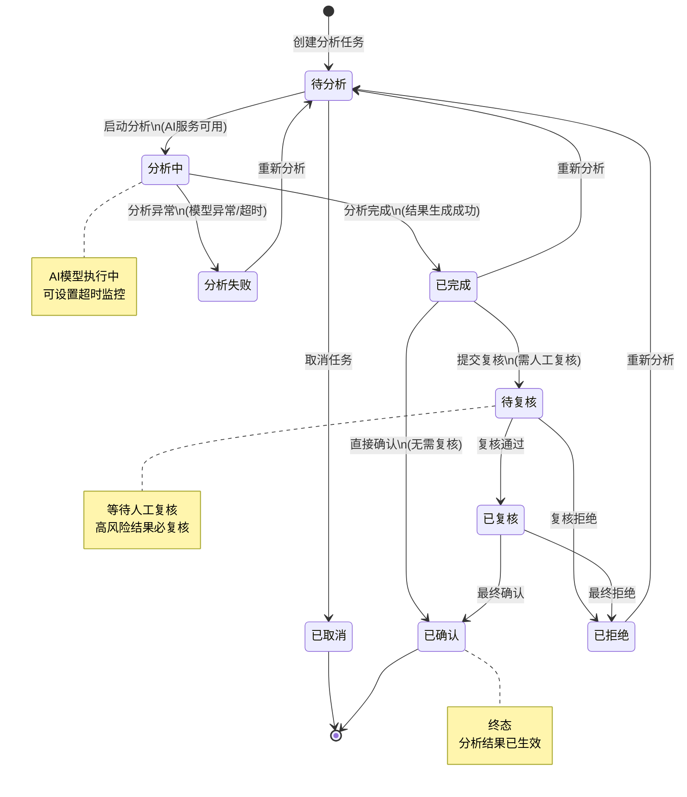
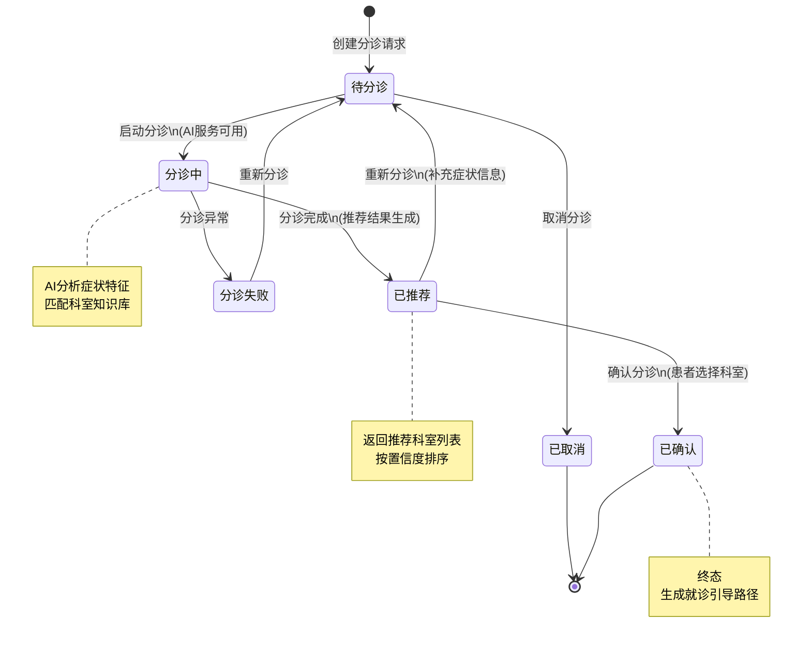
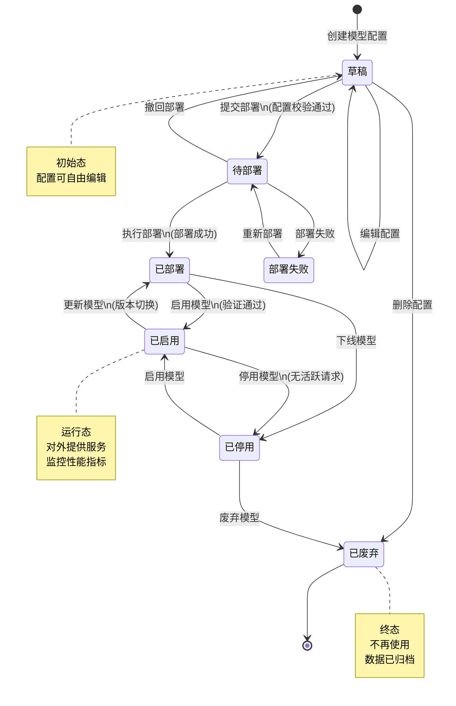
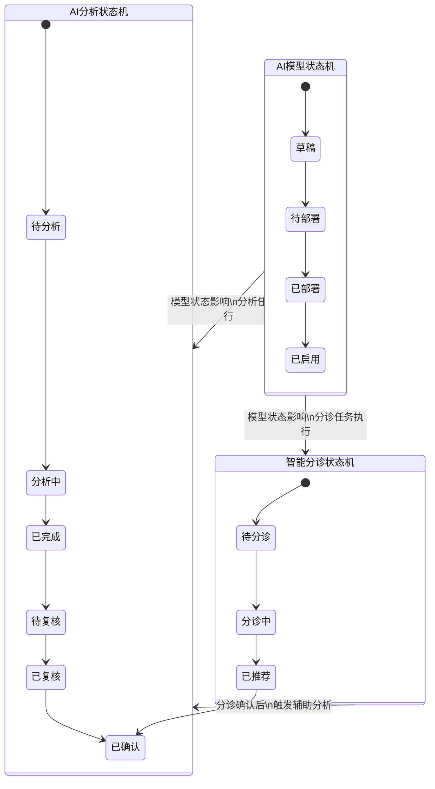

# M13-AI辅助 - 状态机设计文档

> **文档编号**: YUDAO-HIS-SM-M13
> **版本**: V1.0
> **创建日期**: 2026-06-22
> **状态**: 设计中
> **关联文档**: YUDAO-HIS-SM-001 (全局状态机设计文档)

---

## 1. 概述

本文档定义AI辅助模块(M13)核心业务对象的状态机设计，包括AI分析状态机、智能分诊状态机和AI模型状态机。

### 1.1 状态机清单

| 序号 | 状态机编号 | 状态机名称 | 适用对象 | 优先级 | 业务规则 |
|------|------------|----------|----------|--------|----------|
| 1 | SM-013-001 | AI分析状态机 | ai_analysis_record | P0 | BR-AI-001 |
| 2 | SM-013-002 | 智能分诊状态机 | ai_triage_record | P0 | BR-AI-002 |
| 3 | SM-013-003 | AI模型状态机 | ai_model_config | P1 | BR-AI-003 |

---

## 2. AI分析状态机 (SM-013-001)

### 2.1 基本信息

| 属性 | 内容 |
|------|------|
| 状态机编号 | SM-013-001 |
| 状态机名称 | AI分析状态机 |
| 适用对象 | ai_analysis_record（AI分析记录表） |
| 状态字段 | analysis_status |
| 业务规则 | BR-AI-001: AI分析状态流转规则 |
| 优先级 | P0（MVP必需） |

### 2.2 状态列表

| 状态编码 | 状态名称 | 状态描述 | 状态类型 | 允许操作 |
|----------|----------|----------|----------|----------|
| 1 | 待分析 | 分析任务已创建，等待执行 | 初始态 | 启动分析、取消 |
| 2 | 分析中 | AI正在执行分析任务 | 中间态 | 无（等待完成） |
| 3 | 已完成 | AI分析完成，结果已生成 | 中间态 | 提交复核、重新分析 |
| 4 | 待复核 | 等待人工复核确认 | 中间态 | 复核通过、复核拒绝 |
| 5 | 已复核 | 复核通过，等待最终确认 | 中间态 | 确认、拒绝 |
| 6 | 已确认 | 最终确认，分析结果生效 | 终态 | 无 |
| 7 | 已拒绝 | 分析结果被拒绝 | 终态 | 重新分析 |
| 8 | 已取消 | 分析任务已取消 | 终态 | 无 |
| 9 | 分析失败 | AI分析过程异常 | 终态 | 重新分析 |

### 2.3 状态流转表

| 当前状态 | 触发事件 | 目标状态 | 前置条件 | 执行操作 | 关联规则 |
|----------|----------|----------|----------|----------|----------|
| - | 创建分析任务 | 待分析(1) | 输入数据有效 | 创建分析记录、加入任务队列 | - |
| 待分析(1) | 启动分析 | 分析中(2) | AI服务可用 | 调用AI模型、记录开始时间 | BR-AI-004 |
| 待分析(1) | 取消任务 | 已取消(8) | 未开始执行 | 移出任务队列、记录取消原因 | - |
| 分析中(2) | 分析完成 | 已完成(3) | 结果生成成功 | 保存分析结果、记录耗时 | BR-AI-005 |
| 分析中(2) | 分析异常 | 分析失败(9) | 模型异常/超时 | 记录错误信息、告警通知 | BR-AI-006 |
| 已完成(3) | 提交复核 | 待复核(4) | 需人工复核场景 | 发送复核通知 | BR-AI-007 |
| 已完成(3) | 直接确认 | 已确认(6) | 无需复核场景 | 记录确认信息、生效结果 | - |
| 已完成(3) | 重新分析 | 待分析(1) | 结果不满意 | 清除结果、重新入队 | - |
| 待复核(4) | 复核通过 | 已复核(5) | 复核人员确认 | 记录复核人、复核时间 | BR-AI-008 |
| 待复核(4) | 复核拒绝 | 已拒绝(7) | 复核人员拒绝 | 记录拒绝原因、通知申请人 | - |
| 已复核(5) | 最终确认 | 已确认(6) | 确认人员确认 | 记录确认人、生效结果 | - |
| 已复核(5) | 最终拒绝 | 已拒绝(7) | 确认人员拒绝 | 记录拒绝原因 | - |
| 已拒绝(7) | 重新分析 | 待分析(1) | 需要重新分析 | 清除结果、重新入队 | - |
| 分析失败(9) | 重新分析 | 待分析(1) | 需要重试 | 清除错误、重新入队 | - |

### 2.4 状态流转图



### 2.5 状态约束规则

1. **AI服务可用性检查**: 启动分析前必须检查AI服务状态（BR-AI-004）
2. **分析超时处理**: 分析任务超过配置时限自动标记为失败（BR-AI-006）
3. **高风险结果复核**: 涉及诊断建议的分析结果必须人工复核（BR-AI-007）
4. **结果追溯**: 所有状态变更需记录操作人、时间、原因
5. **并发控制**: 同一患者同一类型分析同时只能有一个进行中的任务

### 2.6 Java枚举定义

```java
/**
 * AI分析状态枚举
 */
public enum AiAnalysisStatusEnum implements StatusEnum {

    PENDING(1, "待分析", "分析任务已创建，等待执行"),
    ANALYZING(2, "分析中", "AI正在执行分析任务"),
    COMPLETED(3, "已完成", "AI分析完成，结果已生成"),
    REVIEW_PENDING(4, "待复核", "等待人工复核确认"),
    REVIEWED(5, "已复核", "复核通过，等待最终确认"),
    CONFIRMED(6, "已确认", "最终确认，分析结果生效"),
    REJECTED(7, "已拒绝", "分析结果被拒绝"),
    CANCELLED(8, "已取消", "分析任务已取消"),
    FAILED(9, "分析失败", "AI分析过程异常");

    private final Integer code;
    private final String name;
    private final String description;

    AiAnalysisStatusEnum(Integer code, String name, String description) {
        this.code = code;
        this.name = name;
        this.description = description;
    }

    @Override
    public Integer getCode() {
        return code;
    }

    @Override
    public String getName() {
        return name;
    }

    @Override
    public String getDescription() {
        return description;
    }

    /**
     * 判断是否可以启动分析
     */
    public boolean canStart() {
        return this == PENDING;
    }

    /**
     * 判断是否可以取消
     */
    public boolean canCancel() {
        return this == PENDING;
    }

    /**
     * 判断是否可以重新分析
     */
    public boolean canReanalyze() {
        return this == COMPLETED || this == REJECTED || this == FAILED;
    }

    /**
     * 判断是否需要复核
     */
    public boolean needReview() {
        return this == COMPLETED;
    }

    /**
     * 判断是否为终态
     */
    public boolean isFinal() {
        return this == CONFIRMED || this == CANCELLED;
    }
}
```

---

## 3. 智能分诊状态机 (SM-013-002)

### 3.1 基本信息

| 属性 | 内容 |
|------|------|
| 状态机编号 | SM-013-002 |
| 状态机名称 | 智能分诊状态机 |
| 适用对象 | ai_triage_record（智能分诊记录表） |
| 状态字段 | triage_status |
| 业务规则 | BR-AI-002: 智能分诊状态流转规则 |
| 优先级 | P0（MVP必需） |

### 3.2 状态列表

| 状态编码 | 状态名称 | 状态描述 | 状态类型 | 允许操作 |
|----------|----------|----------|----------|----------|
| 1 | 待分诊 | 分诊请求已创建，等待处理 | 初始态 | 启动分诊、取消 |
| 2 | 分诊中 | AI正在执行分诊推荐 | 中间态 | 无（等待完成） |
| 3 | 已推荐 | 分诊完成，科室推荐已生成 | 中间态 | 确认、重新分诊 |
| 4 | 已确认 | 患者确认分诊结果 | 终态 | 无 |
| 5 | 已取消 | 分诊请求已取消 | 终态 | 无 |
| 6 | 分诊失败 | 分诊过程异常 | 终态 | 重新分诊 |

### 3.3 状态流转表

| 当前状态 | 触发事件 | 目标状态 | 前置条件 | 执行操作 | 关联规则 |
|----------|----------|----------|----------|----------|----------|
| - | 创建分诊请求 | 待分诊(1) | 患者信息有效 | 创建分诊记录、采集症状信息 | - |
| 待分诊(1) | 启动分诊 | 分诊中(2) | AI服务可用 | 调用分诊模型、分析症状 | BR-AI-009 |
| 待分诊(1) | 取消分诊 | 已取消(5) | 未开始处理 | 记录取消原因 | - |
| 分诊中(2) | 分诊完成 | 已推荐(3) | 推荐结果生成 | 保存推荐科室列表、置信度 | BR-AI-010 |
| 分诊中(2) | 分诊异常 | 分诊失败(6) | 模型异常 | 记录错误信息 | - |
| 已推荐(3) | 确认分诊 | 已确认(4) | 患者选择科室 | 记录选择科室、生成就诊引导 | BR-AI-011 |
| 已推荐(3) | 重新分诊 | 待分诊(1) | 结果不满意 | 补充症状信息、重新分析 | - |
| 分诊失败(6) | 重新分诊 | 待分诊(1) | 需要重试 | 清除错误、重新入队 | - |

### 3.4 状态流转图



### 3.5 状态约束规则

1. **症状信息完整性**: 启动分诊前必须采集足够的症状信息（BR-AI-009）
2. **推荐结果排序**: 科室推荐按置信度降序排列，最多返回5个候选（BR-AI-010）
3. **置信度阈值**: 推荐结果置信度低于阈值时提示人工干预
4. **患者确认**: 分诊结果必须经患者确认后方可生效（BR-AI-011）
5. **历史参考**: 分诊时可参考患者历史就诊记录提高准确率

### 3.6 Java枚举定义

```java
/**
 * 智能分诊状态枚举
 */
public enum AiTriageStatusEnum implements StatusEnum {

    PENDING(1, "待分诊", "分诊请求已创建，等待处理"),
    TRIAGING(2, "分诊中", "AI正在执行分诊推荐"),
    RECOMMENDED(3, "已推荐", "分诊完成，科室推荐已生成"),
    CONFIRMED(4, "已确认", "患者确认分诊结果"),
    CANCELLED(5, "已取消", "分诊请求已取消"),
    FAILED(6, "分诊失败", "分诊过程异常");

    private final Integer code;
    private final String name;
    private final String description;

    AiTriageStatusEnum(Integer code, String name, String description) {
        this.code = code;
        this.name = name;
        this.description = description;
    }

    @Override
    public Integer getCode() {
        return code;
    }

    @Override
    public String getName() {
        return name;
    }

    @Override
    public String getDescription() {
        return description;
    }

    /**
     * 判断是否可以启动分诊
     */
    public boolean canStart() {
        return this == PENDING;
    }

    /**
     * 判断是否可以取消
     */
    public boolean canCancel() {
        return this == PENDING;
    }

    /**
     * 判断是否可以确认
     */
    public boolean canConfirm() {
        return this == RECOMMENDED;
    }

    /**
     * 判断是否可以重新分诊
     */
    public boolean canRetriage() {
        return this == RECOMMENDED || this == FAILED;
    }

    /**
     * 判断是否为终态
     */
    public boolean isFinal() {
        return this == CONFIRMED || this == CANCELLED;
    }
}
```

---

## 4. AI模型状态机 (SM-013-003)

### 4.1 基本信息

| 属性 | 内容 |
|------|------|
| 状态机编号 | SM-013-003 |
| 状态机名称 | AI模型状态机 |
| 适用对象 | ai_model_config（AI模型配置表） |
| 状态字段 | model_status |
| 业务规则 | BR-AI-003: AI模型生命周期管理规则 |
| 优先级 | P1（重要） |

### 4.2 状态列表

| 状态编码 | 状态名称 | 状态描述 | 状态类型 | 允许操作 |
|----------|----------|----------|----------|----------|
| 1 | 草稿 | 模型配置创建中，未完成 | 初始态 | 编辑、提交部署、删除 |
| 2 | 待部署 | 配置完成，等待部署 | 中间态 | 执行部署、撤回 |
| 3 | 已部署 | 模型已部署到运行环境 | 中间态 | 启用、下线 |
| 4 | 已启用 | 模型已启用，可对外服务 | 中间态 | 停用、更新 |
| 5 | 已停用 | 模型已停用，暂停服务 | 中间态 | 启用、废弃 |
| 6 | 已废弃 | 模型已废弃，不再使用 | 终态 | 无 |
| 7 | 部署失败 | 部署过程失败 | 中间态 | 重新部署 |

### 4.3 状态流转表

| 当前状态 | 触发事件 | 目标状态 | 前置条件 | 执行操作 | 关联规则 |
|----------|----------|----------|----------|----------|----------|
| - | 创建模型配置 | 草稿(1) | 配置信息有效 | 创建模型配置记录 | - |
| 草稿(1) | 编辑配置 | 草稿(1) | 配置未提交 | 更新配置信息 | - |
| 草稿(1) | 提交部署 | 待部署(2) | 配置完整性校验通过 | 发送部署申请 | BR-AI-012 |
| 草稿(1) | 删除配置 | 已废弃(6) | 无关联业务 | 删除配置记录 | - |
| 待部署(2) | 执行部署 | 已部署(3) | 部署环境就绪 | 部署模型到环境、验证 | BR-AI-013 |
| 待部署(2) | 部署失败 | 部署失败(7) | 部署异常 | 记录失败原因 | - |
| 待部署(2) | 撤回部署 | 草稿(1) | 未开始部署 | 撤回部署申请 | - |
| 部署失败(7) | 重新部署 | 待部署(2) | 修复问题后 | 重新发送部署申请 | - |
| 已部署(3) | 启用模型 | 已启用(4) | 模型验证通过 | 开放服务访问、记录启用时间 | BR-AI-014 |
| 已部署(3) | 下线模型 | 已停用(5) | 无活跃请求 | 关闭服务访问 | - |
| 已启用(4) | 停用模型 | 已停用(5) | 无活跃请求或平滑切换 | 关闭服务访问、通知下游 | BR-AI-015 |
| 已启用(4) | 更新模型 | 已部署(3) | 新版本部署完成 | 版本切换、保留回滚能力 | BR-AI-016 |
| 已停用(5) | 启用模型 | 已启用(4) | 模型状态正常 | 开放服务访问 | - |
| 已停用(5) | 废弃模型 | 已废弃(6) | 确认不再使用 | 记录废弃原因、归档数据 | - |

### 4.4 状态流转图



### 4.5 状态约束规则

1. **配置完整性**: 提交部署前必须完成所有必填配置项校验（BR-AI-012）
2. **部署验证**: 部署后必须通过功能验证方可启用（BR-AI-013）
3. **平滑切换**: 停用模型时需确保无活跃请求或采用平滑切换机制（BR-AI-015）
4. **版本管理**: 更新模型需保留回滚能力，支持版本追溯（BR-AI-016）
5. **废弃确认**: 废弃模型需二次确认，废弃后不可恢复
6. **性能监控**: 已启用状态的模型需持续监控性能指标

### 4.6 Java枚举定义

```java
/**
 * AI模型状态枚举
 */
public enum AiModelStatusEnum implements StatusEnum {

    DRAFT(1, "草稿", "模型配置创建中，未完成"),
    PENDING_DEPLOY(2, "待部署", "配置完成，等待部署"),
    DEPLOYED(3, "已部署", "模型已部署到运行环境"),
    ENABLED(4, "已启用", "模型已启用，可对外服务"),
    DISABLED(5, "已停用", "模型已停用，暂停服务"),
    DEPRECATED(6, "已废弃", "模型已废弃，不再使用"),
    DEPLOY_FAILED(7, "部署失败", "部署过程失败");

    private final Integer code;
    private final String name;
    private final String description;

    AiModelStatusEnum(Integer code, String name, String description) {
        this.code = code;
        this.name = name;
        this.description = description;
    }

    @Override
    public Integer getCode() {
        return code;
    }

    @Override
    public String getName() {
        return name;
    }

    @Override
    public String getDescription() {
        return description;
    }

    /**
     * 判断是否可以编辑
     */
    public boolean canEdit() {
        return this == DRAFT;
    }

    /**
     * 判断是否可以提交部署
     */
    public boolean canSubmitDeploy() {
        return this == DRAFT;
    }

    /**
     * 判断是否可以启用
     */
    public boolean canEnable() {
        return this == DEPLOYED || this == DISABLED;
    }

    /**
     * 判断是否可以停用
     */
    public boolean canDisable() {
        return this == ENABLED;
    }

    /**
     * 判断是否可以废弃
     */
    public boolean canDeprecate() {
        return this == DISABLED || this == DRAFT;
    }

    /**
     * 判断是否为运行态
     */
    public boolean isRunning() {
        return this == ENABLED;
    }

    /**
     * 判断是否为终态
     */
    public boolean isFinal() {
        return this == DEPRECATED;
    }
}
```

---

## 5. 状态机协作关系

### 5.1 状态机交互图



### 5.2 协作规则说明

| 协作场景 | 触发条件 | 执行逻辑 | 备注 |
|----------|----------|----------|------|
| 分诊触发分析 | 分诊状态变为"已确认" | 自动创建AI辅助分析任务 | 可配置是否自动触发 |
| 模型状态检查 | 分析/分诊任务启动前 | 检查对应模型是否为"已启用" | 模型不可用则任务失败 |
| 模型停用影响 | 模型状态变为"已停用" | 暂停接收新任务，等待存量任务完成 | 平滑切换机制 |
| 模型废弃影响 | 模型状态变为"已废弃" | 拒绝所有新任务，存量任务标记异常 | 需提前通知 |

---

## 附录: 变更历史

| 版本 | 日期 | 变更内容 | 变更人 |
|------|------|----------|--------|
| V1.0 | 2026-06-22 | 创建AI辅助模块状态机设计文档 | YUDAO-AI-HIS架构组 |

---

> **最后更新**: 2026-06-22
