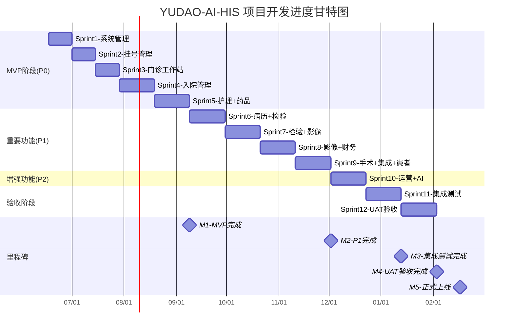

# YUDAO-AI-HIS 智慧医疗信息系统 - 项目开发计划

> **文档编号**: YUDAO-HIS-PMP-001
> **版本**: V1.0
> **创建日期**: 2026-06-17
> **编制方法**: 基于需求分析、模块划分、技术选型、架构决策等文档，结合研发agent和项目管理agent讨论结果
> **参考文档**: PRD、模块划分文档、技术选型报告、ADR、Sprint规划

---

## 一、项目概述

### 1.1 项目背景

YUDAO-AI-HIS智慧医疗信息系统是一个面向三级医院的核心业务系统，旨在替代传统老旧HIS系统，实现门诊、住院、检验、影像、药品、财务等业务的数字化管理。

### 1.2 项目目标

| 目标类型 | 具体目标 | 量化指标 |
|----------|----------|----------|
| 业务目标 | 支撑医院日常核心业务运转 | 日均5000+门诊量、1000+住院量 |
| 质量目标 | 满足HIMSS EMRAM Stage 5+标准 | 闭环给药核对率100%、危急值15分钟通报 |
| 安全目标 | 满足等保三级安全要求 | 审计日志完整、数据加密存储 |
| 技术目标 | 支持微服务架构演进 | 模块独立部署、接口标准规范 |
| 效率目标 | 提升医护工作效率 | 挂号响应≤2秒、病历书写≤5分钟 |

### 1.3 项目范围

| 范围项 | 包含 | 不包含 |
|--------|------|--------|
| 业务模块 | 门诊、住院、检验、影像、药品、财务、病历、手术、系统管理等13个子系统 | 独立的LIS系统（实验室设备控制）、独立PACS系统（影像设备驱动） |
| 用户范围 | 医生、护士、药剂师、收费员、管理员、患者 | 设备厂商、第三方供应商 |
| 集成范围 | 医保接口、CA签名、区域平台 | 检验设备直连（由LIS负责） |

---

## 二、团队组织架构

### 2.1 项目团队配置

| 角色 | 人数 | 职责 | 技能要求 |
|------|------|------|----------|
| 项目经理 | 1 | 项目管理、进度跟踪、资源协调 | PMP认证、医疗行业经验 |
| 技术负责人 | 1 | 技术决策、架构设计、代码审查 | 5年以上架构经验 |
| 后端开发工程师 | 2 | 后端业务开发、API实现 | Spring Boot熟练 |
| 前端开发工程师 | 2 | 前端界面开发、交互实现 | Vue 3熟练 |
| 测试工程师 | 1 | 测试用例设计、测试执行 | 自动化测试经验 |
| **合计** | **7人** | - | - |

### 2.2 团队协作模式

采用敏捷开发模式，2周一个Sprint迭代：
- 每日立会：15分钟，同步进度和阻塞
- Sprint评审：每Sprint结束，演示成果
- Sprint回顾：每Sprint结束，改进流程

---

## 三、模块开发计划

### 3.1 模块工作量汇总

| 模块编号 | 模块名称 | 优先级 | 预估工作量(人月) | 功能点数 | RICE评分 |
|----------|----------|--------|------------------|----------|----------|
| M09 | 系统管理 | P0 | 3 | 22 | 333 |
| M01 | 门诊管理 | P0 | 8 | 34 | 178 |
| M02 | 住院管理 | P0 | 10 | 43 | 143 |
| M06 | 药品管理 | P0 | 6 | 28 | 225 |
| M03 | 电子病历 | P1 | 8 | 19 | 169 |
| M04 | 检验管理 | P1 | 5 | 21 | 170 |
| M05 | 影像管理 | P1 | 6 | 18 | 142 |
| M07 | 手术麻醉 | P1 | 7 | 19 | - |
| M08 | 财务管理 | P1 | 4 | 17 | - |
| M10 | 集成平台 | P1 | 5 | 15 | - |
| M11 | 患者服务 | P1 | 4 | 14 | - |
| M12 | 运营管理 | P2 | 4 | 13 | - |
| M13 | AI辅助 | P2 | 6 | 12 | - |
| **总计** | **13模块** | - | **76人月** | **320** | - |

### 3.2 Sprint详细规划

| Sprint | 时间范围 | 开发模块 | 核心目标 | 预估工作量 | 团队投入 |
|--------|----------|----------|----------|------------|----------|
| Sprint 1 | 第1-2周 | M09 系统管理 | 用户/权限/字典基础能力 | 3人月 | 2后端+2前端 |
| Sprint 2 | 第3-4周 | M01-01 挂号管理 | 挂号、号源、候诊核心流程 | 4人月 | 2后端+2前端 |
| Sprint 3 | 第5-6周 | M01-02/03/04 | 医生工作站、收费、药房 | 4人月 | 2后端+2前端 |
| Sprint 4 | 第7-9周 | M02-01/02 | 入院登记、医嘱管理 | 5人月 | 2后端+2前端 |
| Sprint 5 | 第10-12周 | M02-03/04/05 + M06 | 护理工作站、闭环给药、药库 | 8人月 | 全团队 |
| Sprint 6 | 第13-15周 | M03 + M04-01/02 | 病历模板、检验流程 | 8人月 | 全团队 |
| Sprint 7 | 第16-18周 | M04-03/04/05 + M05 | 检验报告、危急值、影像流程 | 10人月 | 全团队 |
| Sprint 8 | 第19-21周 | M05-03/04/05 + M08 | 影像存储、医保结算 | 10人月 | 全团队 |
| Sprint 9 | 第22-24周 | M07 + M10 + M11 | 手术流程、EMPI、患者门户 | 16人月 | 全团队 |
| Sprint 10 | 第25-27周 | M12 + M13 | 运营看板、AI辅助 | 10人月 | 全团队 |
| Sprint 11 | 第28-30周 | 集成测试 | 全系统集成测试 | 6人月 | 全团队+测试 |
| Sprint 12 | 第31-33周 | UAT验收 | 用户验收测试 | 4人月 | 全团队 |

**总周期**: 约33周（约8个月）

---

## 四、里程碑计划

### 4.1 关键里程碑

| 里程碑编号 | 里程碑名称 | 计划日期 | 验收标准 | 关联任务 |
|------------|------------|----------|----------|----------|
| M1 | MVP核心功能完成 | 第12周 | P0模块全部上线可用 | Sprint 1-5 |
| M2 | P1模块开发完成 | 第24周 | P1模块全部开发完成 | Sprint 6-9 |
| M3 | 系统集成测试完成 | 第30周 | 集成测试通过率≥95% | Sprint 11 |
| M4 | UAT验收完成 | 第33周 | 用户验收通过 | Sprint 12 |
| M5 | 正式上线 | 第35周 | 系统正式投产运行 | 部署上线 |

### 4.2 里程碑验收检查清单

**M1 - MVP核心功能完成**:
- [ ] M09系统管理：用户/角色/权限/字典功能可用
- [ ] M01门诊管理：挂号→接诊→开方→收费→取药流程完整
- [ ] M02住院管理：入院→医嘱→护理→出院流程完整
- [ ] M06药品管理：药库入库→出库→配药→发药流程完整
- [ ] 闭环给药功能：腕带+药品双核对率达到100%
- [ ] CDS临床决策支持：四维校验功能可用

**M2 - P1模块开发完成**:
- [ ] M03电子病历：病历模板→编辑→审签→归档流程完整
- [ ] M04检验管理：申请→采集→检验→报告→危急值通报完整
- [ ] M05影像管理：申请→检查→影像存储→报告完整
- [ ] M07手术麻醉：申请→排期→手术→麻醉记录完整
- [ ] M08财务管理：医保结算→费用记账→报表完整
- [ ] M10集成平台：EMPI创建→FHIR资源映射可用
- [ ] M11患者服务：预约挂号→报告查询→在线缴费可用

---

## 五、甘特图（项目进度）

---

## 六、风险管理清单

### 6.1 技术风险

| 风险编号 | 风险描述 | 风险等级 | 应对措施 | 责任人 |
|----------|----------|----------|----------|--------|
| TR-001 | 微服务架构拆分复杂度高 | 中 | MVP阶段采用单体架构，预留拆分接口 | 架构师 |
| TR-002 | MySQL数据量增长性能瓶颈 | 中 | 按时间分表、读写分离、缓存优化 | DBA |
| TR-003 | HL7 FHIR标准理解偏差 | 中 | 团队培训、参考HAPI FHIR实现 | 架构师 |
| TR-004 | DICOM影像存储扩展困难 | 中 | MinIO分布式存储、三级存储架构 | 开发 |
| TR-005 | 医保接口对接变更 | 中 | 关注医保局公告、适配器模式封装 | 开发 |

### 6.2 业务风险

| 风险编号 | 风险描述 | 风险等级 | 应对措施 | 责任人 |
|----------|----------|----------|----------|--------|
| BR-001 | 业务需求理解偏差 | 中 | 需求评审、原型确认、用户参与 | 产品经理 |
| BR-002 | 闭环给药流程改变大 | 中 | 培训护士、流程改造、试点推广 | 项目经理 |
| BR-003 | 医保政策变化影响结算 | 中 | 及时关注政策、预留配置项 | 财务人员 |

### 6.3 人员风险

| 风险编号 | 风险描述 | 风险等级 | 应对措施 | 责任人 |
|----------|----------|----------|----------|--------|
| HR-001 | 核心人员离职 | 高 | 代码文档化、知识共享、备份培养 | 项目经理 |
| HR-002 | 团队技能不足 | 中 | 培训计划、外部指导 | 技术负责人 |
| HR-003 | 人员缺口导致延期 | 中 | 提前协调、外包补充 | 项目经理 |

### 6.4 进度风险

| 风险编号 | 风险描述 | 风险等级 | 应对措施 | 责任人 |
|----------|----------|----------|----------|--------|
| SR-001 | Sprint工时偏差>30% | 中 | 每周偏差监控、缓冲时间预留 | 项目经理 |
| SR-002 | 需求变更导致返工 | 中 | 变更评审、影响分析 | 项目经理 |
| SR-003 | 集成联调时间不足 | 高 | 预留3周集成测试、提前接口定义 | 技术负责人 |

---

## 七、技术架构方案

### 7.1 技术选型汇总

| 技术领域 | 技术选型 | 版本 | 选型理由 |
|----------|----------|------|----------|
| 后端框架 | Spring Boot | 3.2.x | 团队熟悉、生态完善、YUDAO框架匹配 |
| 前端框架 | Vue 3 + Element Plus | 3.4.x / 2.x | 团队熟悉、组件丰富、YUDAO前端匹配 |
| 数据库 | MySQL | 8.0.x | 开源免费、性能稳定、运维成熟 |
| 缓存 | Redis | 7.x | 高性能、数据结构丰富、集群支持 |
| 消息队列 | RabbitMQ | 3.12.x | 可靠性高、医疗场景适配、延迟队列 |
| 对象存储 | MinIO | Latest | S3兼容、高性能、开源免费 |
| 容器编排 | Kubernetes | 1.28.x | 云原生标准、弹性伸缩 |
| 搜索引擎 | Elasticsearch | 8.x | 病历检索、全文搜索 |
| 任务调度 | XXL-Job | 2.4.x | 分布式调度、可视化管理 |

### 7.2 架构演进路线

**第一阶段（MVP）**: 模块化单体架构
- 所有模块部署在同一应用中
- Maven多模块项目结构
- 共享数据库，独立Schema边界

**第二阶段（按需拆分）**: 渐进式微服务
- 优先拆分高负载模块：影像、检验
- 独立部署公共服务：集成平台、CDS
- 核心业务（门诊、住院）保持单体

---

## 八、质量保障计划

### 8.1 代码质量标准

| 检查项 | 标准 | 工具 |
|--------|------|------|
| 单元测试覆盖率 | ≥80% | JUnit + Mockito |
| 代码规范检查 | SonarQube无Critical | SonarQube |
| 代码审查 | 每次提交必须审查 | GitLab MR |
| API文档 | 所有接口必须有文档 | Knife4j |

### 8.2 测试计划

| 测试类型 | 测试范围 | 测试时机 | 负责人 |
|----------|----------|----------|--------|
| 单元测试 | 所有Service层方法 | 每次提交 | 开发人员 |
| 集成测试 | 模块间接口调用 | Sprint结束 | 测试人员 |
| 功能测试 | 全部功能点 | Sprint结束 | 测试人员 |
| 性能测试 | 高并发场景 | M1/M2里程碑 | 测试人员 |
| 安全测试 | 等保三级要求 | M3里程碑 | 安全人员 |
| UAT验收 | 用户验收场景 | Sprint 12 | 用户代表 |

### 8.3 质量门控

**Sprint门控标准**:
- 单元测试覆盖率≥80%
- SonarQube无Critical问题
- 功能测试通过率≥95%
- 代码审查全部完成

**里程碑门控标准**:
- 集成测试通过率≥95%
- 性能测试达标（响应≤2秒）
- 安全测试通过等保三级检查
- UAT验收签字确认

---

## 九、沟通与协作计划

### 9.1 沟通机制

| 沟通类型 | 频率 | 参与人员 | 内容 |
|----------|------|----------|------|
| 每日立会 | 每日 | 全团队 | 三件事汇报、阻塞同步 |
| Sprint评审 | 每Sprint | 全团队+干系人 | 成果演示、反馈收集 |
| Sprint回顾 | 每Sprint | 全团队 | 流程改进、经验总结 |
| 周报 | 每周 | 项目经理→干系人 | 进度汇报、风险预警 |
| 里程碑报告 | 里程碑节点 | 项目经理→干系人 | 验收报告、偏差分析 |

### 9.2 文档管理

| 文档类型 | 存放位置 | 更新频率 | 负责人 |
|----------|----------|----------|--------|
| 需求文档 | 02-开发库/01-需求开发 | 需求变更时 | 产品经理 |
| 设计文档 | 02-开发库/03-系统设计 | 设计变更时 | 架构师 |
| 测试用例 | 02-开发库/06-集成测试 | Sprint开始时 | 测试人员 |
| 项目报告 | 02-开发库/项目管理 | 每周 | 项目经理 |

---

## 十、成本估算

### 10.1 人力成本

| 角色 | 人数 | 工时(人月) | 单价(万元/人月) | 总成本(万元) |
|------|------|------------|-----------------|--------------|
| 项目经理 | 1 | 8 | 2.5 | 20 |
| 技术负责人 | 1 | 8 | 3.0 | 24 |
| 后端开发 | 2 | 16 | 2.0 | 32 |
| 前端开发 | 2 | 16 | 2.0 | 32 |
| 测试工程师 | 1 | 8 | 1.5 | 12 |
| **合计** | **7人** | **76人月** | - | **120万元** |

### 10.2 基础设施成本

| 成本项 | 规格 | 月费用 | 总费用(8个月) |
|--------|------|--------|---------------|
| 云服务器 | 8核16G×4台 | 0.8万 | 6.4万 |
| 数据库 | MySQL主从×3 | 0.5万 | 4万 |
| Redis集群 | 6节点 | 0.3万 | 2.4万 |
| MinIO存储 | 4节点+50TB | 0.6万 | 4.8万 |
| **合计** | - | **2.2万/月** | **17.6万** |

### 10.3 第三方服务成本

| 服务项 | 说明 | 一次性费用 | 年费用 |
|--------|------|------------|--------|
| CA认证服务 | 数字签名证书 | 5万 | 3万 |
| 短信通知服务 | 危急值通知 | - | 2万 |
| 域名SSL证书 | HTTPS证书 | 0.5万 | 0.5万 |
| **合计** | - | **5.5万** | **5.5万** |

### 10.4 总成本汇总

| 成本类别 | 金额(万元) |
|----------|------------|
| 人力成本 | 120 |
| 基础设施成本 | 17.6 |
| 第三方服务成本 | 5.5+5.5/年 |
| **总预算** | **143.1万** (不含年费) |

---

## 十一、附录

### 附录A: Sprint任务分解

详见各Sprint任务清单（Excel格式）

### 附录B: 参考文档

1. HIS系统-产品需求文档 (YUDAO-HIS-PRD-001)
2. HIS系统-模块划分文档 (YUDAO-HIS-MDD-001)
3. HIS系统-技术选型报告 (YUDAO-HIS-TSR-001)
4. HIS系统-架构决策记录 (YUDAO-HIS-ADR-001)
5. HIS系统-安全架构设计文档 (YUDAO-HIS-SAD-001)

### 附录C: 变更历史

| 版本 | 日期 | 变更内容 | 变更人 |
|------|------|----------|--------|
| V1.0 | 2026-06-17 | 初始版本，基于研发agent和项目管理agent讨论结果整合 | HIS项目组 |

---

> **项目经理**: ________________
> **技术负责人**: ________________
> **最后更新**: 2026-06-17